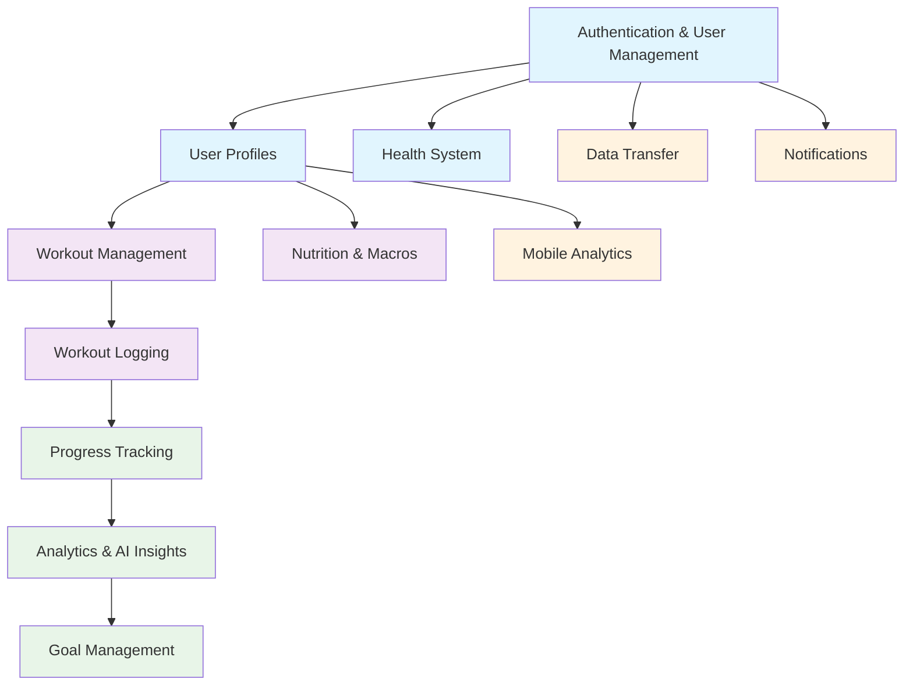

# trAIner Backend Features - Master Index

## Overview

This document serves as the comprehensive index for all backend features in the trAIner AI Fitness App, providing quick access to detailed documentation, dependency relationships, and integration guidance for frontend development.

**Documentation Status**: ✅ **Complete** - All 12 core features fully documented  
**Last Updated**: January 2025  
**Target Audience**: Frontend developers, API consumers, system integrators

---

## 📋 Feature Categories

### 🔐 Foundation Features
Essential system-level features that support all other functionality.

### 💪 Core Workout Features  
Primary user-facing workout and nutrition functionality with AI integration.

### 📊 Analytics & Progress Features
Data analysis, insights generation, and progress tracking capabilities.

### 📱 Supporting Features
Additional functionality for mobile optimization, data management, and notifications.

---

## 🏗️ Feature Dependency Graph

**Dependency Rules**:
- **Foundation Features** must be implemented first
- **Core Features** require user profiles for personalization
- **Analytics Features** depend on data from core features
- **Supporting Features** can be implemented independently

---

## 📚 Complete Feature Documentation

### 🔐 Foundation Features

#### 1. Authentication & User Management
**Status**: ✅ Complete | **Endpoints**: 12 | **Priority**: Critical

**Description**: Comprehensive user authentication system built on Supabase Auth with JWT token management, password reset functionality, email verification, and session management. Provides the security foundation for all other features.

**Key Capabilities**:
- User registration and login with secure password handling
- JWT token generation, validation, and refresh mechanisms
- Email verification and password reset workflows
- Session management with configurable expiration
- Supabase Auth integration with Row Level Security (RLS)

**AI Integration**: None (security-focused feature)

**Documentation Links**:
- 📖 **[Feature Documentation](./01-authentication-user-management.md)** (2,285 lines)
- 🔧 **[Middleware Documentation](../backend/middleware/docs/authMiddlewareDocs.md)**
- 🔧 **[Configuration Documentation](../backend/config/docs/authUserMgmtConfiguration.md)**
- 📋 **[OpenAPI Specification](../docs/paths/auth/)** (12 endpoints)

**Dependencies**: None (foundation feature)  
**Dependents**: All other features require authentication

---

#### 2. User Profiles
**Status**: ✅ Complete | **Endpoints**: 5 | **Priority**: Critical

**Description**: Comprehensive user profile management system supporting both metric and imperial units, medical conditions tracking, fitness preferences, and equipment availability. Handles complex data transformations and provides personalization foundation.

**Key Capabilities**:
- Dynamic height field handling (metric: number, imperial: feet/inches object)
- Unit preference management with automatic conversions
- Medical conditions validation and healthcare data sanitization
- Fitness equipment and exercise type preference management
- Profile completeness calculations and validation

**AI Integration**: Profile data drives all AI agent personalization

**Documentation Links**:
- 📖 **[Feature Documentation](./02-user-profiles.md)** (3,402 lines)
- 🔧 **[Middleware Documentation](../backend/middleware/docs/userProfilesMiddleware.md)**
- 📋 **[OpenAPI Specification](../docs/paths/profiles/)** (2 endpoints)

**Dependencies**: Authentication & User Management  
**Dependents**: All AI-powered features, Workout Management, Nutrition & Macros

---

#### 3. Health System
**Status**: ✅ Complete | **Endpoints**: 3 | **Priority**: High

**Description**: System health monitoring and diagnostics providing real-time status of all backend services, database connectivity, and external API availability. Critical for frontend error handling and user experience.

**Key Capabilities**:
- Comprehensive health checks for all system components
- Database connectivity and performance monitoring
- External API availability validation (OpenAI, Perplexity)
- Service dependency status reporting
- Degraded service detection and reporting

**AI Integration**: Monitors AI service availability and performance

**Documentation Links**:
- 📖 **[Feature Documentation](./03-health-system.md)** (809 lines)
- 📋 **[OpenAPI Specification](../docs/paths/healthSystem/)** (3 endpoints)

**Dependencies**: None (system monitoring)  
**Dependents**: All features benefit from health monitoring

---

### 💪 Core Workout Features

#### 4. Workout Management
**Status**: ✅ Complete | **Endpoints**: 5 | **Priority**: Critical

**Description**: Advanced AI-powered workout plan generation and management system utilizing multiple AI agents (Research Agent + Workout Generation Agent + Plan Adjustment Agent) to create personalized, research-backed workout plans with intelligent reasoning.

**Key Capabilities**:
- AI-powered workout plan generation with research integration
- Natural language plan adjustments and modifications
- Exercise database integration with 873+ exercises
- Plan versioning and revision history
- Advanced set techniques (supersets, drop sets, rest-pause)
- Equipment-based exercise selection and safety filtering

**AI Integration**: 
- **Research Agent** (Perplexity AI): Exercise research and best practices
- **Workout Generation Agent** (OpenAI): Personalized plan creation
- **Plan Adjustment Agent** (OpenAI): Natural language modifications
- **Memory System**: User preference learning and adaptation

**Documentation Links**:
- 📖 **[Feature Documentation](./04-workout-management.md)** (2,780 lines)
- 🤖 **[Workout Generation Agent](../backend/agents/docs/workoutGenerationAgentDocs.md)**
- 🤖 **[Research Agent](../backend/agents/docs/researchAgentDocs.md)**
- 🤖 **[Plan Adjustment Agent](../backend/agents/docs/planAdjustmentAgentDocs.md)**
- 🔧 **[OpenAI Configuration](../backend/config/docs/openaiConfigurationDocs.md)**
- 📋 **[OpenAPI Specification](../docs/paths/workouts/)** (2 endpoints)

**Dependencies**: User Profiles, Authentication  
**Dependents**: Workout Logging, Analytics & AI Insights

---

#### 5. Workout Logging
**Status**: ✅ Complete | **Endpoints**: 5 | **Priority**: High

**Description**: Comprehensive workout session logging system with detailed exercise tracking, performance metrics, subjective feedback capture, and progress calculation. Supports both manual entry and bulk operations.

**Key Capabilities**:
- Detailed exercise logging with sets, reps, and weights
- Subjective metrics tracking (difficulty, energy, satisfaction)
- Progress calculation and performance trend analysis
- Bulk logging operations for efficiency
- Foreign key relationships with workout plans
- Advanced querying with date ranges and filtering

**AI Integration**: Logged data feeds analytics and provides feedback for plan adjustments

**Documentation Links**:
- 📖 **[Feature Documentation](./05-workout-logging.md)** (1,334 lines)
- 📋 **[OpenAPI Specification](../docs/paths/workoutLogs/)** (2 endpoints)

**Dependencies**: Workout Management, User Profiles, Authentication  
**Dependents**: Progress Tracking, Analytics & AI Insights

---

#### 6. Nutrition & Macros
**Status**: ✅ Complete | **Endpoints**: 12 | **Priority**: High

**Description**: AI-powered nutrition planning and macro calculation system with personalized meal planning, dietary restriction handling, and nutritional goal optimization. Integrates with specialized nutrition AI agent.

**Key Capabilities**:
- Automated macro calculation based on user profile and goals
- AI-powered meal plan generation with dietary restrictions
- Nutrition logging and tracking capabilities
- Food database integration and recipe management
- Dietary preference management (vegetarian, keto, etc.)
- Nutritional goal tracking and progress monitoring

**AI Integration**:
- **Nutrition Agent** (OpenAI): Personalized meal planning and macro optimization
- **Memory System**: Dietary preference learning and meal history

**Documentation Links**:
- 📖 **[Feature Documentation](./06-nutrition-macros.md)** (1,070 lines)
- 🤖 **[Nutrition Agent](../backend/agents/docs/nutritionAgentDocs.md)**
- 📋 **[OpenAPI Specification](../docs/paths/nutritionMacros/)** (9 endpoints)

**Dependencies**: User Profiles, Authentication  
**Dependents**: Analytics & AI Insights, Goal Management

---

### 📊 Analytics & Progress Features

#### 7. Progress Tracking
**Status**: ✅ Complete | **Endpoints**: 4 | **Priority**: High

**Description**: Comprehensive progress monitoring system with bi-weekly check-ins, measurement tracking, goal progress calculation, and trend analysis. Provides foundation for analytics and AI insights.

**Key Capabilities**:
- Bi-weekly check-in system with structured data collection
- Body measurement tracking (weight, body fat, circumferences)
- Progress photo management and comparison
- Goal progress calculation and milestone detection
- Trend analysis and regression tracking
- Historical data visualization preparation

**AI Integration**: Progress data feeds analytics agents for insight generation

**Documentation Links**:
- 📖 **[Feature Documentation](./07-progress-tracking.md)** (1,233 lines)
- 📋 **[OpenAPI Specification](../docs/paths/progress/)** (4 endpoints)

**Dependencies**: Workout Logging, Nutrition & Macros, User Profiles  
**Dependents**: Analytics & AI Insights, Goal Management

---

#### 8. Analytics & AI Insights
**Status**: ✅ Complete | **Endpoints**: 16 | **Priority**: High

**Description**: Advanced AI-powered analytics platform providing comprehensive fitness insights, pattern detection, personalized recommendations, and predictive analytics. Utilizes multiple specialized AI agents for deep analysis.

**Key Capabilities**:
- Comprehensive analytics dashboard with overview metrics
- AI-generated insights and personalized recommendations
- Pattern detection and trend analysis
- Strength progress tracking and adherence monitoring
- Date range analytics with flexible querying
- Real-time data refresh and caching strategies

**AI Integration**:
- **Analytics Agent** (OpenAI): Comprehensive fitness analysis
- **Insight Generator Agent** (OpenAI): Personalized recommendations
- **Pattern Detector Agent** (OpenAI): Trend and pattern identification
- **Memory System**: Long-term progress tracking and insight refinement

**Documentation Links**:
- 📖 **[Feature Documentation](./08-analytics-ai-insights.md)** (653 lines)
- 🤖 **[Analytics Agent](../backend/agents/docs/analyticsAgentDocs.md)**
- 🤖 **[Insight Generator Agent](../backend/agents/docs/insightGeneratorAgentDocs.md)**
- 🤖 **[Pattern Detector Agent](../backend/agents/docs/patternDetectorAgentDocs.md)**
- 📋 **[OpenAPI Specification](../docs/paths/analytics/)** (12 endpoints)

**Dependencies**: Progress Tracking, Workout Logging, Nutrition & Macros  
**Dependents**: Goal Management, Mobile Analytics

---

#### 9. Goal Management
**Status**: ✅ Complete | **Endpoints**: 4 | **Priority**: Medium

**Description**: Intelligent goal setting and tracking system with AI-powered progress prediction, achievement detection, and goal recommendation. Integrates with all user data for comprehensive goal management.

**Key Capabilities**:
- Goal creation with SMART criteria validation
- Progress tracking with milestone detection
- AI-powered goal achievement prediction
- Goal recommendation based on user history
- Achievement celebration and reward systems
- Goal difficulty adjustment based on performance

**AI Integration**: Uses analytics data and AI prediction models for goal optimization

**Documentation Links**:
- 📖 **[Feature Documentation](./09-goal-management.md)** (1,000 lines)
- 📋 **[OpenAPI Specification](../docs/paths/goals/)** (4 endpoints)

**Dependencies**: Analytics & AI Insights, Progress Tracking  
**Dependents**: Mobile Analytics, Notifications

---

### 📱 Supporting Features

#### 10. Mobile Analytics
**Status**: ✅ Complete | **Endpoints**: 6 | **Priority**: Medium

**Description**: Mobile-optimized analytics and data synchronization system providing lightweight, bandwidth-efficient access to core analytics features with offline support and optimized payloads.

**Key Capabilities**:
- Mobile-optimized analytics with reduced payload sizes
- Offline data synchronization and conflict resolution
- Peer comparison and social features
- Push notification integration for mobile alerts
- Battery-optimized data fetching strategies
- Progressive data loading and caching

**AI Integration**: Simplified versions of main analytics AI features

**Documentation Links**:
- 📖 **[Feature Documentation](./10-mobile-analytics.md)** (1,290 lines)
- 📋 **[OpenAPI Specification](../docs/paths/mobile/)** (6 endpoints)

**Dependencies**: Analytics & AI Insights, Goal Management  
**Dependents**: Notifications

---

#### 11. Data Transfer
**Status**: ✅ Complete | **Endpoints**: 2 | **Priority**: Low

**Description**: Comprehensive data import/export system supporting multiple formats (JSON, CSV, XLSX, PDF) with validation, transformation, and error handling. Enables data portability and backup functionality.

**Key Capabilities**:
- Multi-format export (JSON, CSV, XLSX, PDF)
- Intelligent data import with validation and error recovery
- Data transformation and format conversion
- Large file handling with streaming support
- Data integrity validation and conflict resolution
- Batch processing for large datasets

**AI Integration**: None (data management feature)

**Documentation Links**:
- 📖 **[Feature Documentation](./11-data-transfer.md)** (1,761 lines)
- 📋 **[OpenAPI Specification](../docs/paths/dataTransfer/)** (2 endpoints)

**Dependencies**: Authentication, User Profiles  
**Dependents**: None

---

#### 12. Notifications
**Status**: ✅ Complete | **Endpoints**: 3 | **Priority**: Medium

**Description**: Multi-channel notification system supporting email, SMS, and push notifications with user preference management, template system, and delivery tracking. Integrates with all features for comprehensive user engagement.

**Key Capabilities**:
- Multi-channel delivery (email, SMS, push notifications)
- User preference management and opt-out handling
- Template system with personalization
- Scheduled and triggered notification workflows
- Delivery tracking and retry mechanisms
- Rate limiting and anti-spam protection

**AI Integration**: Uses AI insights to personalize notification timing and content

**Documentation Links**:
- 📖 **[Feature Documentation](./12-notifications.md)** (870 lines)
- 🔧 **[Rate Limiting Middleware](../backend/middleware/docs/rateLimitMiddlewareDocs.md)**
- 📋 **[OpenAPI Specification](../docs/paths/notifications/)** (2 endpoints)

**Dependencies**: Authentication, User Profiles  
**Dependents**: All features can trigger notifications

---

## 🔧 Cross-Cutting Documentation

### Shared Middleware (Phase 5, Step 13)
Essential middleware components that affect multiple features:

- 🛡️ **[Error Middleware](../backend/middleware/docs/errorMiddlewareDocs.md)** - Centralized error handling
- 🔒 **[Security Middleware](../backend/middleware/docs/securityMiddlewareDocs.md)** - CORS, CSRF, SQL injection protection  
- ✅ **[Validation Middleware](../backend/middleware/docs/validationMiddlewareDocs.md)** - Request validation with Joi schemas
- ⏱️ **[Rate Limiting Middleware](../backend/middleware/docs/rateLimitMiddlewareDocs.md)** - API rate limiting and quota management

### Shared Configuration (Phase 5, Step 14)
Core configuration systems:

- 🌐 **[Environment Configuration](../backend/config/docs/envConfigurationDocs.md)** - All environment variables and settings
- 📝 **[Logger Configuration](../backend/config/docs/loggerConfigurationDocs.md)** - Logging system with sensitive data redaction
- 🤖 **[OpenAI Configuration](../backend/config/docs/openaiConfigurationDocs.md)** - AI service configuration and optimization

### AI Agent Architecture (Phase 5, Step 15)
Foundation for all AI-powered features:

- 🏗️ **[Base Agent System](../backend/agents/docs/baseAgentDocs.md)** - Common agent patterns, error handling, memory integration

---

## 📖 Additional Resources

### API Documentation
- 🔗 **[Complete OpenAPI Specification](../docs/openapi.yaml)** - Full API contract
- 🌐 **[Interactive API Documentation](../docs/interactive-docs/)** - Swagger UI interface
- 📊 **[API Analysis Reports](../docs/analysis/)** - Performance and usage analytics

### Development Resources
- 🏗️ **[API Versioning Strategy](../docs/API_VERSIONING_STRATEGY.md)** - Version management approach
- 🔧 **[Node.js Compatibility](../docs/node-compatibility.md)** - Environment requirements
- 📋 **[Component Library](../docs/COMPONENTS.md)** - Reusable API components

---

## 🚀 Integration Quick Start Guide

### For Frontend Developers

1. **Start with Foundation Features (1-3)**:
   - Implement authentication flow first
   - Set up user profile management
   - Add health system monitoring

2. **Add Core Features (4-6)**:
   - Integrate workout management with AI agents
   - Implement workout logging capabilities
   - Add nutrition and macro tracking

3. **Enhance with Analytics (7-9)**:
   - Add progress tracking visualizations
   - Integrate AI insights and recommendations
   - Implement goal management features

4. **Optimize with Supporting Features (10-12)**:
   - Add mobile optimizations
   - Implement data export/import
   - Set up notification system

### Key Integration Considerations

- 🔐 **Authentication**: All endpoints require JWT Bearer tokens
- 🤖 **AI Features**: Expect variable response times (5-30 seconds)  
- 📊 **Real-time Data**: Use WebSocket connections for live updates
- 🔄 **Error Handling**: Implement comprehensive error boundaries
- 📱 **Mobile**: Use optimized endpoints for mobile applications

---

## 📈 System Statistics

| Category | Features | Endpoints | Documentation Lines | AI Agents |
|----------|----------|-----------|---------------------|-----------|
| Foundation | 3 | 20 | 6,496 | 0 |
| Core Workout | 3 | 22 | 5,184 | 4 |
| Analytics & Progress | 3 | 24 | 2,886 | 3 |
| Supporting | 3 | 11 | 3,921 | 0 |
| **Total** | **12** | **77** | **18,487** | **7** |

**Cross-cutting**: 15 middleware & config docs, 1 base agent system

---

## ✅ Documentation Completeness

- ✅ **All 12 features fully documented** with implementation details
- ✅ **Complete OpenAPI specification** with 77 endpoints
- ✅ **AI agent integration patterns** documented
- ✅ **Cross-cutting concerns** covered (middleware, config, base systems)
- ✅ **Frontend integration guidance** provided
- ✅ **Dependency relationships** clearly defined

**Last Updated**: January 2025  
**Maintained By**: Backend Development Team  
**Review Cycle**: Monthly updates with feature releases 