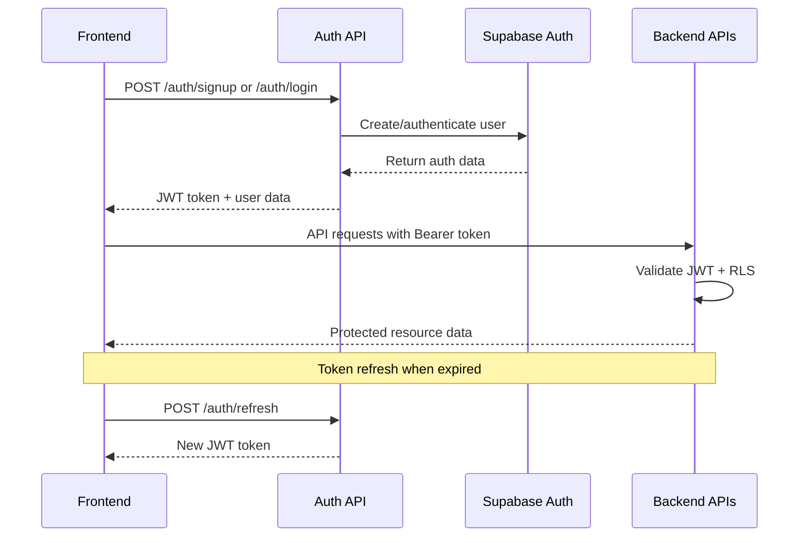

# trAIner Frontend Integration Guide

## Overview

This comprehensive guide provides frontend developers with everything needed to integrate with the trAIner backend API, covering authentication flows, state management patterns, error handling strategies, and performance considerations for building robust fitness applications.

**Target Audience**: Frontend developers, mobile app developers, third-party integrators  
**Backend Version**: v1.x  
**API Documentation**: [Complete OpenAPI Specification](./docs/openapi.yaml)  
**Feature Index**: [Backend Features Master Index](./docs/features/README.md)

---

## 🚀 Quick Start Integration

### Prerequisites
- JWT token management capability
- HTTP client with interceptor support (axios, fetch, etc.)
- Error boundary implementation
- State management system (Redux, Zustand, Context API)

### Base Configuration
```javascript
// API Client Configuration
const API_CONFIG = {
  baseURL: process.env.REACT_APP_API_URL || 'http://localhost:8000/v1',
  timeout: 30000, // 30s for AI operations
  headers: {
    'Content-Type': 'application/json',
    'Accept': 'application/json'
  }
};

// AI Operation Timeouts (higher than standard)
const AI_TIMEOUTS = {
  workoutGeneration: 45000,    // 45s - Complex AI planning
  workoutAdjustment: 30000,    // 30s - Plan modifications
  nutritionPlanning: 40000,    // 40s - Dietary calculations
  analyticsInsights: 35000,    // 35s - Data analysis
  standardOperations: 15000    // 15s - CRUD operations
};
```

---

## 🔐 Authentication Flow

### Authentication Architecture


### Authentication Implementation

#### 1. User Registration
```javascript
// Registration with comprehensive validation
const signupUser = async (userData) => {
  try {
    const response = await fetch(`${API_CONFIG.baseURL}/auth/signup`, {
      method: 'POST',
      headers: API_CONFIG.headers,
      body: JSON.stringify({
        name: userData.name,
        email: userData.email,
        password: userData.password
      })
    });
    
    if (!response.ok) {
      const errorData = await response.json();
      throw new Error(errorData.message || 'Signup failed');
    }
    
    const data = await response.json();
    
    // Store user ID for profile setup
    localStorage.setItem('tempUserId', data.userId);
    
    return {
      userId: data.userId,
      message: data.message,
      requiresEmailVerification: true
    };
  } catch (error) {
    throw new Error(`Signup error: ${error.message}`);
  }
};
```

#### 2. User Login with Token Management
```javascript
// Login with JWT token storage
const loginUser = async (email, password, rememberMe = false) => {
  try {
    const response = await fetch(`${API_CONFIG.baseURL}/auth/login`, {
      method: 'POST',
      headers: API_CONFIG.headers,
      body: JSON.stringify({ email, password, rememberMe })
    });
    
    if (!response.ok) {
      const errorData = await response.json();
      
      // Handle specific auth errors
      if (response.status === 429) {
        throw new Error('Too many login attempts. Please try again later.');
      }
      if (response.status === 401) {
        throw new Error('Invalid email or password.');
      }
      
      throw new Error(errorData.message || 'Login failed');
    }
    
    const data = await response.json();
    
    // Store authentication tokens
    localStorage.setItem('jwtToken', data.jwtToken);
    localStorage.setItem('userId', data.userId);
    
    // Store refresh token if remember me is enabled
    if (data.refreshToken) {
      localStorage.setItem('refreshToken', data.refreshToken);
    }
    
    return {
      userId: data.userId,
      jwtToken: data.jwtToken,
      user: data.user
    };
  } catch (error) {
    throw new Error(`Login error: ${error.message}`);
  }
};
```

#### 3. JWT Token Refresh
```javascript
// Automatic token refresh implementation
const refreshToken = async () => {
  const refreshToken = localStorage.getItem('refreshToken');
  
  if (!refreshToken) {
    throw new Error('No refresh token available');
  }
  
  try {
    const response = await fetch(`${API_CONFIG.baseURL}/auth/refresh`, {
      method: 'POST',
      headers: API_CONFIG.headers,
      body: JSON.stringify({ refreshToken })
    });
    
    if (!response.ok) {
      // Refresh token expired - logout user
      localStorage.clear();
      window.location.href = '/login';
      return;
    }
    
    const data = await response.json();
    
    // Update stored tokens
    localStorage.setItem('jwtToken', data.jwtToken);
    
    return data.jwtToken;
  } catch (error) {
    console.error('Token refresh failed:', error);
    localStorage.clear();
    window.location.href = '/login';
  }
};
```

#### 4. Authenticated API Client
```javascript
// HTTP client with automatic token injection and refresh
class AuthenticatedAPIClient {
  constructor() {
    this.baseURL = API_CONFIG.baseURL;
  }
  
  async request(endpoint, options = {}) {
    let token = localStorage.getItem('jwtToken');
    
    const config = {
      ...options,
      headers: {
        ...API_CONFIG.headers,
        ...(options.headers || {}),
        Authorization: token ? `Bearer ${token}` : undefined
      }
    };
    
    let response = await fetch(`${this.baseURL}${endpoint}`, config);
    
    // Handle token expiration
    if (response.status === 401) {
      try {
        token = await refreshToken();
        
        // Retry request with new token
        config.headers.Authorization = `Bearer ${token}`;
        response = await fetch(`${this.baseURL}${endpoint}`, config);
      } catch (refreshError) {
        throw new Error('Authentication failed');
      }
    }
    
    if (!response.ok) {
      const errorData = await response.json();
      throw new Error(errorData.message || `HTTP ${response.status}`);
    }
    
    return response.json();
  }
  
  get(endpoint, options = {}) {
    return this.request(endpoint, { ...options, method: 'GET' });
  }
  
  post(endpoint, data, options = {}) {
    return this.request(endpoint, {
      ...options,
      method: 'POST',
      body: JSON.stringify(data)
    });
  }
  
  put(endpoint, data, options = {}) {
    return this.request(endpoint, {
      ...options,
      method: 'PUT',
      body: JSON.stringify(data)
    });
  }
  
  delete(endpoint, options = {}) {
    return this.request(endpoint, { ...options, method: 'DELETE' });
  }
}

// Global API client instance
const apiClient = new AuthenticatedAPIClient();
```

---

## 🔄 State Management Patterns

### 1. Authentication State Management

#### React Context Implementation
```javascript
// AuthContext.js - Authentication state management
import React, { createContext, useContext, useReducer, useEffect } from 'react';

const AuthContext = createContext();

const authReducer = (state, action) => {
  switch (action.type) {
    case 'LOGIN_START':
      return { ...state, loading: true, error: null };
      
    case 'LOGIN_SUCCESS':
      return {
        ...state,
        loading: false,
        isAuthenticated: true,
        user: action.payload.user,
        userId: action.payload.userId,
        error: null
      };
      
    case 'LOGIN_FAILURE':
      return {
        ...state,
        loading: false,
        isAuthenticated: false,
        user: null,
        userId: null,
        error: action.payload
      };
      
    case 'LOGOUT':
      return {
        ...state,
        isAuthenticated: false,
        user: null,
        userId: null,
        loading: false,
        error: null
      };
      
    case 'TOKEN_REFRESH':
      return { ...state, tokenRefreshing: action.payload };
      
    default:
      return state;
  }
};

export const AuthProvider = ({ children }) => {
  const [state, dispatch] = useReducer(authReducer, {
    isAuthenticated: false,
    user: null,
    userId: null,
    loading: true,
    error: null,
    tokenRefreshing: false
  });
  
  // Initialize auth state from localStorage
  useEffect(() => {
    const token = localStorage.getItem('jwtToken');
    const userId = localStorage.getItem('userId');
    
    if (token && userId) {
      // Verify token validity
      apiClient.get('/auth/me')
        .then(userData => {
          dispatch({
            type: 'LOGIN_SUCCESS',
            payload: { user: userData, userId }
          });
        })
        .catch(() => {
          localStorage.clear();
          dispatch({ type: 'LOGOUT' });
        });
    } else {
      dispatch({ type: 'LOGOUT' });
    }
  }, []);
  
  const login = async (email, password, rememberMe) => {
    dispatch({ type: 'LOGIN_START' });
    
    try {
      const result = await loginUser(email, password, rememberMe);
      dispatch({
        type: 'LOGIN_SUCCESS',
        payload: result
      });
      return result;
    } catch (error) {
      dispatch({
        type: 'LOGIN_FAILURE',
        payload: error.message
      });
      throw error;
    }
  };
  
  const logout = async () => {
    try {
      await apiClient.post('/auth/logout');
    } catch (error) {
      console.error('Logout error:', error);
    } finally {
      localStorage.clear();
      dispatch({ type: 'LOGOUT' });
    }
  };
  
  return (
    <AuthContext.Provider value={{ ...state, login, logout }}>
      {children}
    </AuthContext.Provider>
  );
};

export const useAuth = () => {
  const context = useContext(AuthContext);
  if (!context) {
    throw new Error('useAuth must be used within AuthProvider');
  }
  return context;
};
```

### 2. AI Operations State Management

#### Workout Generation State
```javascript
// WorkoutContext.js - AI workout operations
import React, { createContext, useContext, useReducer } from 'react';

const WorkoutContext = createContext();

const workoutReducer = (state, action) => {
  switch (action.type) {
    case 'GENERATION_START':
      return {
        ...state,
        generating: true,
        generationProgress: 0,
        error: null
      };
      
    case 'GENERATION_PROGRESS':
      return {
        ...state,
        generationProgress: action.payload
      };
      
    case 'GENERATION_SUCCESS':
      return {
        ...state,
        generating: false,
        generationProgress: 100,
        currentPlan: action.payload,
        plans: [...state.plans, action.payload]
      };
      
    case 'GENERATION_FAILURE':
      return {
        ...state,
        generating: false,
        generationProgress: 0,
        error: action.payload
      };
      
    case 'ADJUSTMENT_START':
      return {
        ...state,
        adjusting: true,
        adjustmentError: null
      };
      
    case 'ADJUSTMENT_SUCCESS':
      return {
        ...state,
        adjusting: false,
        currentPlan: action.payload,
        plans: state.plans.map(plan =>
          plan.planId === action.payload.planId ? action.payload : plan
        )
      };
      
    default:
      return state;
  }
};

export const WorkoutProvider = ({ children }) => {
  const [state, dispatch] = useReducer(workoutReducer, {
    plans: [],
    currentPlan: null,
    generating: false,
    generationProgress: 0,
    adjusting: false,
    error: null,
    adjustmentError: null
  });
  
  const generateWorkoutPlan = async (planData) => {
    dispatch({ type: 'GENERATION_START' });
    
    try {
      // Simulate progress for long AI operations
      const progressInterval = setInterval(() => {
        dispatch({
          type: 'GENERATION_PROGRESS',
          payload: Math.min(state.generationProgress + 10, 90)
        });
      }, 2000);
      
      const plan = await apiClient.post('/workouts', planData);
      
      clearInterval(progressInterval);
      dispatch({
        type: 'GENERATION_SUCCESS',
        payload: plan
      });
      
      return plan;
    } catch (error) {
      dispatch({
        type: 'GENERATION_FAILURE',
        payload: error.message
      });
      throw error;
    }
  };
  
  const adjustWorkoutPlan = async (planId, feedback) => {
    dispatch({ type: 'ADJUSTMENT_START' });
    
    try {
      const adjustedPlan = await apiClient.post(`/workouts/${planId}`, {
        feedback
      });
      
      dispatch({
        type: 'ADJUSTMENT_SUCCESS',
        payload: adjustedPlan
      });
      
      return adjustedPlan;
    } catch (error) {
      dispatch({
        type: 'ADJUSTMENT_FAILURE',
        payload: error.message
      });
      throw error;
    }
  };
  
  return (
    <WorkoutContext.Provider value={{
      ...state,
      generateWorkoutPlan,
      adjustWorkoutPlan
    }}>
      {children}
    </WorkoutContext.Provider>
  );
};

export const useWorkout = () => {
  const context = useContext(WorkoutContext);
  if (!context) {
    throw new Error('useWorkout must be used within WorkoutProvider');
  }
  return context;
};
```

### 3. Profile State Management
```javascript
// ProfileContext.js - User profile and preferences
const ProfileContext = createContext();

const profileReducer = (state, action) => {
  switch (action.type) {
    case 'PROFILE_LOADING':
      return { ...state, loading: true, error: null };
      
    case 'PROFILE_LOADED':
      return {
        ...state,
        loading: false,
        profile: action.payload,
        isComplete: calculateProfileCompleteness(action.payload)
      };
      
    case 'PROFILE_UPDATE_SUCCESS':
      return {
        ...state,
        profile: { ...state.profile, ...action.payload },
        isComplete: calculateProfileCompleteness({ ...state.profile, ...action.payload })
      };
      
    case 'UNIT_PREFERENCE_CHANGED':
      return {
        ...state,
        profile: {
          ...state.profile,
          unitPreference: action.payload
        }
      };
      
    default:
      return state;
  }
};

// Profile completeness calculation
const calculateProfileCompleteness = (profile) => {
  if (!profile) return false;
  
  const requiredFields = ['age', 'height', 'weight', 'goals', 'equipment'];
  const completedFields = requiredFields.filter(field => {
    const value = profile[field];
    return value !== null && value !== undefined && value !== '';
  });
  
  return completedFields.length === requiredFields.length;
};
```

---

## ⚠️ Error Handling Strategies

### 1. Comprehensive Error Classification
```javascript
// ErrorTypes.js - Error classification system
export const ERROR_TYPES = {
  // Authentication Errors
  AUTH_INVALID_CREDENTIALS: 'auth/invalid-credentials',
  AUTH_TOKEN_EXPIRED: 'auth/token-expired',
  AUTH_RATE_LIMIT: 'auth/rate-limit-exceeded',
  AUTH_EMAIL_NOT_VERIFIED: 'auth/email-not-verified',
  
  // Validation Errors
  VALIDATION_REQUIRED_FIELD: 'validation/required-field',
  VALIDATION_INVALID_FORMAT: 'validation/invalid-format',
  VALIDATION_MEDICAL_CONDITION: 'validation/medical-condition',
  
  // AI Operation Errors
  AI_GENERATION_FAILED: 'ai/generation-failed',
  AI_ADJUSTMENT_FAILED: 'ai/adjustment-failed',
  AI_QUOTA_EXCEEDED: 'ai/quota-exceeded',
  AI_TIMEOUT: 'ai/timeout',
  
  // Network Errors
  NETWORK_TIMEOUT: 'network/timeout',
  NETWORK_CONNECTION: 'network/connection-failed',
  NETWORK_SERVER_ERROR: 'network/server-error',
  
  // Business Logic Errors
  PLAN_NOT_FOUND: 'business/plan-not-found',
  INSUFFICIENT_PROFILE_DATA: 'business/insufficient-profile-data',
  RATE_LIMIT_EXCEEDED: 'business/rate-limit-exceeded'
};

// Error classification function
export const classifyError = (error, response) => {
  if (!response) {
    // Network or client-side errors
    if (error.code === 'NETWORK_ERROR' || error.name === 'NetworkError') {
      return ERROR_TYPES.NETWORK_CONNECTION;
    }
    if (error.code === 'TIMEOUT' || error.name === 'TimeoutError') {
      return ERROR_TYPES.NETWORK_TIMEOUT;
    }
    return ERROR_TYPES.NETWORK_CONNECTION;
  }
  
  const { status, data } = response;
  
  switch (status) {
    case 400:
      if (data.errorCode === 'VALIDATION_ERROR') {
        return ERROR_TYPES.VALIDATION_REQUIRED_FIELD;
      }
      if (data.errorCode === 'INSUFFICIENT_PROFILE_DATA') {
        return ERROR_TYPES.INSUFFICIENT_PROFILE_DATA;
      }
      return ERROR_TYPES.VALIDATION_INVALID_FORMAT;
      
    case 401:
      if (data.errorCode === 'AUTH_INVALID_CREDENTIALS') {
        return ERROR_TYPES.AUTH_INVALID_CREDENTIALS;
      }
      if (data.errorCode === 'AUTH_TOKEN_EXPIRED') {
        return ERROR_TYPES.AUTH_TOKEN_EXPIRED;
      }
      return ERROR_TYPES.AUTH_INVALID_CREDENTIALS;
      
    case 404:
      return ERROR_TYPES.PLAN_NOT_FOUND;
      
    case 429:
      if (data.errorCode === 'AI_QUOTA_EXCEEDED') {
        return ERROR_TYPES.AI_QUOTA_EXCEEDED;
      }
      return ERROR_TYPES.RATE_LIMIT_EXCEEDED;
      
    case 500:
      if (data.errorCode === 'AI_GENERATION_FAILED') {
        return ERROR_TYPES.AI_GENERATION_FAILED;
      }
      return ERROR_TYPES.NETWORK_SERVER_ERROR;
      
    default:
      return ERROR_TYPES.NETWORK_SERVER_ERROR;
  }
};
```

### 2. Error Boundary Implementation
```javascript
// ErrorBoundary.js - React error boundary for AI operations
import React from 'react';

class ErrorBoundary extends React.Component {
  constructor(props) {
    super(props);
    this.state = { 
      hasError: false, 
      error: null,
      errorInfo: null,
      errorType: null
    };
  }
  
  static getDerivedStateFromError(error) {
    return { 
      hasError: true,
      error: error
    };
  }
  
  componentDidCatch(error, errorInfo) {
    const errorType = this.classifyReactError(error);
    
    this.setState({
      error,
      errorInfo,
      errorType
    });
    
    // Log to error reporting service
    if (window.errorReporting) {
      window.errorReporting.captureException(error, {
        contexts: {
          react: {
            componentStack: errorInfo.componentStack
          }
        },
        tags: {
          errorBoundary: this.props.name || 'Unknown',
          errorType
        }
      });
    }
  }
  
  classifyReactError(error) {
    if (error.message.includes('AI') || error.message.includes('workout')) {
      return 'AI_OPERATION_ERROR';
    }
    if (error.message.includes('Network') || error.message.includes('fetch')) {
      return 'NETWORK_ERROR';
    }
    return 'UNKNOWN_ERROR';
  }
  
  render() {
    if (this.state.hasError) {
      return (
        <div className="error-boundary">
          <h2>Something went wrong</h2>
          <details style={{ whiteSpace: 'pre-wrap' }}>
            <summary>Error details</summary>
            {this.state.error && this.state.error.toString()}
            <br />
            {this.state.errorInfo.componentStack}
          </details>
          <button onClick={() => this.setState({ hasError: false })}>
            Try again
          </button>
        </div>
      );
    }
    
    return this.props.children;
  }
}

// Usage wrapper for AI operations
export const AIOperationBoundary = ({ children }) => (
  <ErrorBoundary name="AIOperation">
    {children}
  </ErrorBoundary>
);
```

### 3. User-Friendly Error Messages
```javascript
// ErrorMessages.js - User-friendly error mapping
export const USER_ERROR_MESSAGES = {
  [ERROR_TYPES.AUTH_INVALID_CREDENTIALS]: {
    title: 'Login Failed',
    message: 'Please check your email and password and try again.',
    action: 'Retry Login',
    severity: 'warning'
  },
  
  [ERROR_TYPES.AUTH_RATE_LIMIT]: {
    title: 'Too Many Attempts',
    message: 'Please wait a few minutes before trying to log in again.',
    action: 'Wait and Retry',
    severity: 'warning'
  },
  
  [ERROR_TYPES.AI_GENERATION_FAILED]: {
    title: 'Workout Generation Failed',
    message: 'We couldn\'t generate your workout plan right now. This might be due to high demand or a temporary issue.',
    action: 'Try Again',
    severity: 'error'
  },
  
  [ERROR_TYPES.AI_QUOTA_EXCEEDED]: {
    title: 'Generation Limit Reached',
    message: 'You\'ve reached your hourly limit for workout generation. Please try again later.',
    action: 'Try Later',
    severity: 'info'
  },
  
  [ERROR_TYPES.INSUFFICIENT_PROFILE_DATA]: {
    title: 'Profile Incomplete',
    message: 'Please complete your profile to generate personalized workout plans.',
    action: 'Complete Profile',
    severity: 'warning'
  },
  
  [ERROR_TYPES.NETWORK_CONNECTION]: {
    title: 'Connection Problem',
    message: 'Please check your internet connection and try again.',
    action: 'Retry',
    severity: 'error'
  }
};

// Error message component
export const ErrorMessage = ({ errorType, onAction }) => {
  const errorConfig = USER_ERROR_MESSAGES[errorType];
  
  if (!errorConfig) {
    return (
      <div className="error-message error-message--default">
        <h3>An unexpected error occurred</h3>
        <p>Please try again or contact support if the problem persists.</p>
        <button onClick={onAction}>Try Again</button>
      </div>
    );
  }
  
  return (
    <div className={`error-message error-message--${errorConfig.severity}`}>
      <h3>{errorConfig.title}</h3>
      <p>{errorConfig.message}</p>
      {onAction && (
        <button onClick={onAction}>
          {errorConfig.action}
        </button>
      )}
    </div>
  );
};
```

---

## ⚡ Performance Considerations

### 1. AI Operation Optimization

#### Loading States for Long Operations
```javascript
// AILoadingStates.js - Specialized loading states for AI
import React, { useState, useEffect } from 'react';

export const WorkoutGenerationLoader = ({ isLoading, progress = 0 }) => {
  const [currentStep, setCurrentStep] = useState(0);
  const [estimatedTime, setEstimatedTime] = useState(45);
  
  const steps = [
    { label: 'Analyzing your profile...', duration: 8 },
    { label: 'Researching exercises...', duration: 15 },
    { label: 'Creating your plan...', duration: 12 },
    { label: 'Adding safety considerations...', duration: 6 },
    { label: 'Finalizing recommendations...', duration: 4 }
  ];
  
  useEffect(() => {
    if (!isLoading) return;
    
    let totalTime = 0;
    const stepIndex = steps.findIndex((step, index) => {
      totalTime += step.duration;
      return progress < (totalTime / 45) * 100;
    });
    
    setCurrentStep(Math.max(0, stepIndex));
    setEstimatedTime(Math.max(5, 45 - Math.floor(progress * 0.45)));
  }, [progress, isLoading]);
  
  if (!isLoading) return null;
  
  return (
    <div className="ai-loading-container">
      <div className="ai-loading-progress">
        <div 
          className="ai-loading-progress-bar" 
          style={{ width: `${progress}%` }}
        />
      </div>
      
      <div className="ai-loading-content">
        <h3>Generating Your Workout Plan</h3>
        <p className="ai-loading-step">
          {steps[currentStep]?.label || 'Processing...'}
        </p>
        <p className="ai-loading-time">
          Estimated time remaining: {estimatedTime} seconds
        </p>
        
        <div className="ai-loading-tips">
          <h4>Did you know?</h4>
          <p>Our AI considers your fitness level, equipment, and goals to create a personalized plan just for you.</p>
        </div>
      </div>
    </div>
  );
};
```

### 2. Data Caching Strategies
```javascript
// CacheManager.js - Client-side caching for API responses
class CacheManager {
  constructor() {
    this.cache = new Map();
    this.cacheExpiry = new Map();
  }
  
  // Cache configuration by data type
  getCacheConfig(key) {
    const configs = {
      'user-profile': { ttl: 5 * 60 * 1000 },      // 5 minutes
      'workout-plans': { ttl: 30 * 60 * 1000 },    // 30 minutes
      'analytics-overview': { ttl: 10 * 60 * 1000 }, // 10 minutes
      'health-check': { ttl: 2 * 60 * 1000 },      // 2 minutes
      'nutrition-plans': { ttl: 60 * 60 * 1000 }   // 1 hour
    };
    
    return configs[key] || { ttl: 5 * 60 * 1000 };
  }
  
  set(key, data, customTTL) {
    const config = this.getCacheConfig(key);
    const ttl = customTTL || config.ttl;
    
    this.cache.set(key, data);
    this.cacheExpiry.set(key, Date.now() + ttl);
  }
  
  get(key) {
    if (!this.cache.has(key)) return null;
    
    const expiry = this.cacheExpiry.get(key);
    if (Date.now() > expiry) {
      this.cache.delete(key);
      this.cacheExpiry.delete(key);
      return null;
    }
    
    return this.cache.get(key);
  }
  
  invalidate(pattern) {
    const keysToDelete = Array.from(this.cache.keys())
      .filter(key => key.includes(pattern));
    
    keysToDelete.forEach(key => {
      this.cache.delete(key);
      this.cacheExpiry.delete(key);
    });
  }
  
  clear() {
    this.cache.clear();
    this.cacheExpiry.clear();
  }
}

// Enhanced API client with caching
class CachedAPIClient extends AuthenticatedAPIClient {
  constructor() {
    super();
    this.cache = new CacheManager();
  }
  
  async get(endpoint, options = {}) {
    const cacheKey = `GET:${endpoint}`;
    const useCache = options.cache !== false;
    
    // Check cache first
    if (useCache) {
      const cachedData = this.cache.get(cacheKey);
      if (cachedData) {
        return cachedData;
      }
    }
    
    // Make API request
    const data = await super.get(endpoint, options);
    
    // Cache successful responses
    if (useCache && data) {
      this.cache.set(cacheKey, data, options.cacheTTL);
    }
    
    return data;
  }
  
  async post(endpoint, body, options = {}) {
    const result = await super.post(endpoint, body, options);
    
    // Invalidate related cache entries
    if (options.invalidateCache) {
      this.cache.invalidate(options.invalidateCache);
    }
    
    return result;
  }
}
```

### 3. Optimistic Updates
```javascript
// OptimisticUpdates.js - Optimistic UI updates
export const useOptimisticWorkoutLog = () => {
  const [logs, setLogs] = useState([]);
  const [pendingLogs, setPendingLogs] = useState(new Set());
  
  const logWorkout = async (workoutData) => {
    const tempId = `temp-${Date.now()}`;
    const optimisticLog = {
      ...workoutData,
      id: tempId,
      createdAt: new Date().toISOString(),
      status: 'pending'
    };
    
    // Optimistically add to UI
    setLogs(prev => [optimisticLog, ...prev]);
    setPendingLogs(prev => new Set([...prev, tempId]));
    
    try {
      // Make API request
      const savedLog = await apiClient.post('/workouts/log', workoutData);
      
      // Replace optimistic entry with real data
      setLogs(prev => prev.map(log => 
        log.id === tempId ? { ...savedLog, status: 'saved' } : log
      ));
      setPendingLogs(prev => {
        const newSet = new Set(prev);
        newSet.delete(tempId);
        return newSet;
      });
      
      return savedLog;
    } catch (error) {
      // Mark as failed, allow retry
      setLogs(prev => prev.map(log => 
        log.id === tempId ? { ...log, status: 'failed', error: error.message } : log
      ));
      throw error;
    }
  };
  
  const retryFailedLog = async (tempId) => {
    const failedLog = logs.find(log => log.id === tempId);
    if (!failedLog) return;
    
    // Remove temp ID and retry
    const { id, status, error, ...logData } = failedLog;
    return await logWorkout(logData);
  };
  
  return {
    logs,
    pendingLogs,
    logWorkout,
    retryFailedLog
  };
};
```

### 4. Real-time Updates
```javascript
// RealtimeUpdates.js - WebSocket integration for live updates
class RealtimeManager {
  constructor(userId) {
    this.userId = userId;
    this.ws = null;
    this.reconnectAttempts = 0;
    this.maxReconnectAttempts = 5;
    this.listeners = new Map();
  }
  
  connect() {
    const token = localStorage.getItem('jwtToken');
    if (!token) return;
    
    this.ws = new WebSocket(`${WS_URL}?token=${token}&userId=${this.userId}`);
    
    this.ws.onopen = () => {
      console.log('WebSocket connected');
      this.reconnectAttempts = 0;
    };
    
    this.ws.onmessage = (event) => {
      const data = JSON.parse(event.data);
      this.handleMessage(data);
    };
    
    this.ws.onclose = () => {
      this.handleReconnect();
    };
    
    this.ws.onerror = (error) => {
      console.error('WebSocket error:', error);
    };
  }
  
  handleMessage(data) {
    const { type, payload } = data;
    
    switch (type) {
      case 'ANALYTICS_UPDATED':
        this.notifyListeners('analytics', payload);
        break;
      case 'PLAN_GENERATED':
        this.notifyListeners('workout', payload);
        break;
      case 'PROGRESS_UPDATED':
        this.notifyListeners('progress', payload);
        break;
    }
  }
  
  subscribe(event, callback) {
    if (!this.listeners.has(event)) {
      this.listeners.set(event, new Set());
    }
    this.listeners.get(event).add(callback);
    
    return () => {
      this.listeners.get(event)?.delete(callback);
    };
  }
  
  notifyListeners(event, data) {
    const eventListeners = this.listeners.get(event);
    if (eventListeners) {
      eventListeners.forEach(callback => callback(data));
    }
  }
  
  handleReconnect() {
    if (this.reconnectAttempts < this.maxReconnectAttempts) {
      this.reconnectAttempts++;
      const delay = Math.pow(2, this.reconnectAttempts) * 1000; // Exponential backoff
      
      setTimeout(() => {
        console.log(`Reconnecting... (${this.reconnectAttempts}/${this.maxReconnectAttempts})`);
        this.connect();
      }, delay);
    }
  }
  
  disconnect() {
    if (this.ws) {
      this.ws.close();
      this.ws = null;
    }
  }
}
```

---

## 🔧 Feature-Specific Integration Patterns

### 1. Workout Management Integration

#### Complete Workout Generation Flow
```javascript
// WorkoutIntegration.js - Complete workout feature integration
export const useWorkoutGeneration = () => {
  const [state, setState] = useState({
    generating: false,
    progress: 0,
    plan: null,
    error: null
  });
  
  const generatePlan = async (planRequest) => {
    setState(prev => ({ ...prev, generating: true, progress: 0, error: null }));
    
    try {
      // Validate profile completeness first
      const profile = await apiClient.get('/profile');
      if (!profile.isComplete) {
        throw new Error('Please complete your profile first');
      }
      
      // Start generation with progress tracking
      const progressInterval = setInterval(() => {
        setState(prev => ({
          ...prev,
          progress: Math.min(prev.progress + 5, 85)
        }));
      }, 2000);
      
      const plan = await apiClient.post('/workouts', planRequest, {
        timeout: AI_TIMEOUTS.workoutGeneration
      });
      
      clearInterval(progressInterval);
      setState(prev => ({
        ...prev,
        generating: false,
        progress: 100,
        plan
      }));
      
      return plan;
    } catch (error) {
      clearInterval(progressInterval);
      setState(prev => ({
        ...prev,
        generating: false,
        progress: 0,
        error: error.message
      }));
      throw error;
    }
  };
  
  const adjustPlan = async (planId, feedback) => {
    try {
      setState(prev => ({ ...prev, adjusting: true }));
      
      const adjustedPlan = await apiClient.post(`/workouts/${planId}`, {
        feedback
      }, {
        timeout: AI_TIMEOUTS.workoutAdjustment
      });
      
      setState(prev => ({
        ...prev,
        adjusting: false,
        plan: adjustedPlan
      }));
      
      return adjustedPlan;
    } catch (error) {
      setState(prev => ({
        ...prev,
        adjusting: false,
        error: error.message
      }));
      throw error;
    }
  };
  
  return {
    ...state,
    generatePlan,
    adjustPlan
  };
};
```

### 2. Profile Management Integration

#### Profile with Unit Conversion
```javascript
// ProfileIntegration.js - Profile management with unit handling
export const useProfile = () => {
  const [profile, setProfile] = useState(null);
  const [loading, setLoading] = useState(false);
  
  const updateProfile = async (updates) => {
    setLoading(true);
    
    try {
      // Handle unit conversions on frontend
      const processedUpdates = processProfileUpdates(updates, profile?.unitPreference);
      
      const updatedProfile = await apiClient.put('/profile', processedUpdates);
      
      setProfile(updatedProfile);
      
      // Invalidate related caches
      apiClient.cache?.invalidate('user-profile');
      
      return updatedProfile;
    } catch (error) {
      throw new Error(`Profile update failed: ${error.message}`);
    } finally {
      setLoading(false);
    }
  };
  
  const processProfileUpdates = (updates, currentUnitPreference) => {
    const processed = { ...updates };
    
    // Handle height field complexity
    if (updates.height) {
      if (updates.unitPreference === 'imperial' && typeof updates.height === 'object') {
        // Height as {feet, inches} object for imperial
        processed.height = updates.height;
      } else if (updates.unitPreference === 'metric' && typeof updates.height === 'number') {
        // Height as number (cm) for metric
        processed.height = updates.height;
      }
    }
    
    // Handle unit preference changes
    if (updates.unitPreference && updates.unitPreference !== currentUnitPreference) {
      // Convert existing measurements to new unit system
      if (updates.unitPreference === 'metric' && profile?.height) {
        // Convert imperial to metric
        processed.weight = profile.weight ? (profile.weight * 0.453592) : profile.weight;
      } else if (updates.unitPreference === 'imperial' && profile?.height) {
        // Convert metric to imperial
        processed.weight = profile.weight ? (profile.weight * 2.20462) : profile.weight;
      }
    }
    
    return processed;
  };
  
  return {
    profile,
    loading,
    updateProfile
  };
};
```

### 3. Analytics Integration

#### Real-time Analytics Dashboard
```javascript
// AnalyticsIntegration.js - Analytics with real-time updates
export const useAnalyticsDashboard = () => {
  const [analytics, setAnalytics] = useState({
    overview: null,
    insights: [],
    loading: false,
    lastUpdated: null
  });
  
  const realtimeManager = useRef(null);
  
  useEffect(() => {
    // Initialize real-time updates
    const userId = localStorage.getItem('userId');
    if (userId) {
      realtimeManager.current = new RealtimeManager(userId);
      realtimeManager.current.connect();
      
      // Subscribe to analytics updates
      const unsubscribe = realtimeManager.current.subscribe('analytics', (data) => {
        setAnalytics(prev => ({
          ...prev,
          ...data,
          lastUpdated: new Date()
        }));
      });
      
      return () => {
        unsubscribe();
        realtimeManager.current?.disconnect();
      };
    }
  }, []);
  
  const loadAnalytics = async (timeframe = '7days') => {
    setAnalytics(prev => ({ ...prev, loading: true }));
    
    try {
      const [overview, insights] = await Promise.all([
        apiClient.get(`/analytics/overview?timeframe=${timeframe}`, {
          cache: true,
          cacheTTL: 10 * 60 * 1000 // 10 minutes
        }),
        apiClient.get(`/analytics/ai/insights?timeframe=${timeframe}`, {
          timeout: AI_TIMEOUTS.analyticsInsights
        })
      ]);
      
      setAnalytics(prev => ({
        ...prev,
        overview,
        insights: insights.insights || [],
        loading: false,
        lastUpdated: new Date()
      }));
      
      return { overview, insights };
    } catch (error) {
      setAnalytics(prev => ({ ...prev, loading: false }));
      throw error;
    }
  };
  
  const refreshAnalytics = async () => {
    try {
      await apiClient.post('/analytics/refresh');
      
      // Invalidate cache and reload
      apiClient.cache?.invalidate('analytics');
      await loadAnalytics();
    } catch (error) {
      console.error('Analytics refresh failed:', error);
    }
  };
  
  return {
    ...analytics,
    loadAnalytics,
    refreshAnalytics
  };
};
```

---

## 📋 Integration Checklist

### Pre-Integration Setup
- [ ] API client configured with proper base URL and timeouts
- [ ] Authentication system implemented with JWT token management
- [ ] Error boundaries set up for AI operations
- [ ] State management system chosen and configured
- [ ] Loading states designed for long AI operations

### Authentication Integration
- [ ] User registration with email verification
- [ ] Login with "remember me" functionality
- [ ] Automatic token refresh implementation
- [ ] Logout with proper cleanup
- [ ] Protected route guards

### Profile Integration
- [ ] Profile CRUD operations
- [ ] Unit conversion handling (metric/imperial)
- [ ] Medical conditions validation
- [ ] Profile completeness checking
- [ ] Equipment and preference management

### AI Features Integration
- [ ] Workout generation with progress indicators
- [ ] Plan adjustment with natural language input
- [ ] Nutrition planning with dietary restrictions
- [ ] Analytics insights with real-time updates
- [ ] Error handling for AI operation failures

### Performance Optimization
- [ ] Client-side caching implementation
- [ ] Optimistic updates for user actions
- [ ] Real-time updates via WebSocket
- [ ] Request timeout configuration
- [ ] Progress indicators for long operations

### Error Handling
- [ ] Comprehensive error classification
- [ ] User-friendly error messages
- [ ] Error recovery mechanisms
- [ ] Error reporting integration
- [ ] Network error handling

---

## 🔍 Testing Integration

### Testing Strategies
```javascript
// IntegrationTests.js - Frontend integration testing patterns
describe('API Integration Tests', () => {
  test('should handle authentication flow', async () => {
    const mockUser = {
      email: 'test@example.com',
      password: 'TestPassword123!'
    };
    
    // Test login
    const loginResult = await loginUser(mockUser.email, mockUser.password);
    expect(loginResult.jwtToken).toBeDefined();
    expect(loginResult.userId).toBeDefined();
    
    // Test authenticated request
    const profile = await apiClient.get('/profile');
    expect(profile).toBeDefined();
    
    // Test logout
    await apiClient.post('/auth/logout');
    expect(localStorage.getItem('jwtToken')).toBeNull();
  });
  
  test('should handle AI operation timeouts', async () => {
    const longRunningRequest = apiClient.post('/workouts', mockPlanData, {
      timeout: 1000 // Very short timeout
    });
    
    await expect(longRunningRequest).rejects.toThrow('timeout');
  });
  
  test('should handle error recovery', async () => {
    // Simulate network error
    const mockError = new Error('Network error');
    mockError.code = 'NETWORK_ERROR';
    
    const errorType = classifyError(mockError);
    expect(errorType).toBe(ERROR_TYPES.NETWORK_CONNECTION);
    
    const userMessage = USER_ERROR_MESSAGES[errorType];
    expect(userMessage.title).toBe('Connection Problem');
  });
});
```

---

## 📚 Additional Resources

### API Reference Links
- **[Complete API Documentation](./docs/openapi.yaml)** - Full OpenAPI specification
- **[Feature Documentation Index](./docs/features/README.md)** - All backend features
- **[Authentication Guide](./docs/features/01-authentication-user-management.md)** - Detailed auth patterns
- **[AI Integration Guide](./docs/features/04-workout-management.md)** - AI agent integration
- **[Error Handling Reference](./backend/middleware/docs/errorMiddlewareDocs.md)** - Backend error patterns

### Development Tools
- **Postman Collection**: Available for API testing
- **TypeScript Definitions**: Generated from OpenAPI spec
- **SDK Generation**: Available for multiple platforms
- **Interactive Documentation**: Swagger UI at `/docs/interactive-docs/`

### Best Practices
- Always implement proper loading states for AI operations
- Use optimistic updates for better user experience
- Implement comprehensive error handling with user-friendly messages
- Cache API responses appropriately based on data volatility
- Set up real-time updates for live data synchronization
- Follow the authentication patterns exactly as documented
- Handle unit conversions properly for international users
- Implement proper retry logic for network failures

---

**Last Updated**: January 2025  
**Version**: 1.0  
**Maintained By**: Backend Development Team 