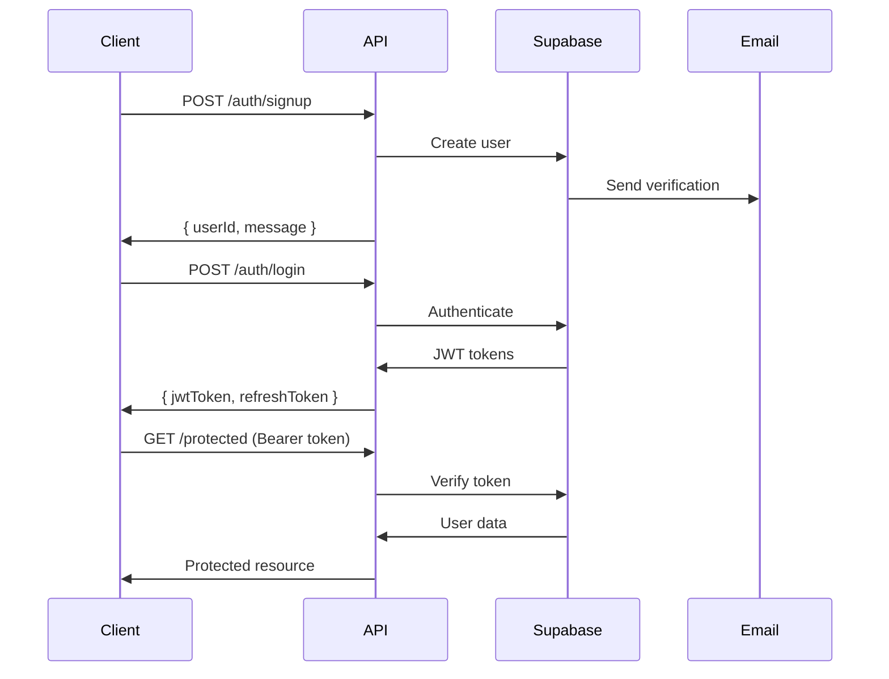

# Authentication Frontend Integration Guide

## Table of Contents
- [Overview](#overview)
- [Authentication System Architecture](#authentication-system-architecture)
- [API Endpoints Reference](#api-endpoints-reference)
- [Implementation Guide](#implementation-guide)
- [Security Considerations](#security-considerations)
- [Error Handling](#error-handling)
- [Testing Authentication](#testing-authentication)
- [Troubleshooting](#troubleshooting)

## Overview

The trAIner authentication system is built on **Supabase Auth** with JWT token management, providing secure user registration, login, session management, password operations, and email verification.

### Key Features
- **JWT Token-Based Authentication**: Secure stateless authentication
- **Email Verification**: Required for account activation
- **Password Management**: Secure reset and update flows
- **Session Management**: Automatic token refresh with configurable expiry
- **Rate Limiting**: Protection against brute force attacks
- **RLS Integration**: Row Level Security for data protection

### Quick Start Example

```javascript
// Basic authentication flow
const auth = {
  // 1. Register new user
  async signup(name, email, password) {
    const response = await fetch('https://api.trainer.app/v1/auth/signup', {
      method: 'POST',
      headers: { 'Content-Type': 'application/json' },
      body: JSON.stringify({ name, email, password })
    });
    return response.json();
  },
  
  // 2. Login user
  async login(email, password) {
    const response = await fetch('https://api.trainer.app/v1/auth/login', {
      method: 'POST',
      headers: { 'Content-Type': 'application/json' },
      body: JSON.stringify({ email, password })
    });
    const data = await response.json();
    if (data.jwtToken) {
      localStorage.setItem('jwtToken', data.jwtToken);
    }
    return data;
  },
  
  // 3. Make authenticated request
  async getProfile() {
    const token = localStorage.getItem('jwtToken');
    const response = await fetch('https://api.trainer.app/v1/auth/me', {
      headers: { 'Authorization': `Bearer ${token}` }
    });
    return response.json();
  }
};
```

## Authentication System Architecture

### Token Management Flow



### Security Layers

1. **Rate Limiting**: Endpoint-specific limits to prevent abuse
2. **JWT Validation**: Every request validates token with Supabase
3. **RLS Enforcement**: Database-level security for user data
4. **CORS Protection**: Configurable origin restrictions
5. **SQL Injection Prevention**: Pattern detection and parameterized queries

## API Endpoints Reference

### Public Authentication Endpoints

#### POST /v1/auth/signup
Register a new user account.

**Rate Limit**: 10 requests/hour per IP

**Request**:
```javascript
const response = await fetch('/v1/auth/signup', {
  method: 'POST',
  headers: { 'Content-Type': 'application/json' },
  body: JSON.stringify({
    name: 'John Doe',           // Required: User's full name
    email: 'john@example.com',  // Required: Valid email address
    password: 'SecurePass123!'  // Required: Min 8 chars, uppercase, lowercase, number, special char
  })
});
```

**Success Response** (201):
```json
{
  "status": "success",
  "userId": "550e8400-e29b-41d4-a716-446655440000",
  "message": "User created successfully"
}
```

**Error Responses**:
- `400`: Validation error (weak password, invalid email)
- `409`: Email already exists
- `429`: Rate limit exceeded

#### POST /v1/auth/login
Authenticate user and obtain JWT tokens.

**Rate Limit**: 5 requests/15 minutes per IP

**Request**:
```javascript
const response = await fetch('/v1/auth/login', {
  method: 'POST',
  headers: { 'Content-Type': 'application/json' },
  body: JSON.stringify({
    email: 'john@example.com',
    password: 'SecurePass123!',
    rememberMe: true  // Optional: Returns refresh token for extended sessions
  })
});
```

**Success Response** (200):
```json
{
  "status": "success",
  "userId": "550e8400-e29b-41d4-a716-446655440000",
  "jwtToken": "eyJhbGciOiJIUzI1NiIsInR5cCI6IkpXVCJ9...",
  "refreshToken": "v1.MZU3ZTg0MDAtZTI5Yi00MWQ0LWE3MTYtNDQ2NjU1NDQwMDAw...",
  "message": "Login successful"
}
```

#### POST /v1/auth/refresh
Refresh expired JWT token using refresh token.

**Rate Limit**: 10 requests/15 minutes per IP

**Request**:
```javascript
const response = await fetch('/v1/auth/refresh', {
  method: 'POST',
  headers: { 'Content-Type': 'application/json' },
  body: JSON.stringify({
    refresh_token: localStorage.getItem('refreshToken')
  })
});
```

**Success Response** (200):
```json
{
  "status": "success",
  "jwtToken": "eyJhbGciOiJIUzI1NiIsInR5cCI6IkpXVCJ9...",
  "refreshToken": "v1.MZU3ZTg0MDAtZTI5Yi00MWQ0LWE3MTYtNDQ2NjU1NDQwMDAw..."
}
```

### Protected Authentication Endpoints

All protected endpoints require the `Authorization: Bearer <token>` header.

#### GET /v1/auth/me
Get current authenticated user information.

**Request**:
```javascript
const response = await fetch('/v1/auth/me', {
  headers: {
    'Authorization': `Bearer ${localStorage.getItem('jwtToken')}`
  }
});
```

**Success Response** (200):
```json
{
  "status": "success",
  "user": {
    "id": "550e8400-e29b-41d4-a716-446655440000",
    "email": "john@example.com",
    "name": "John Doe",
    "email_verified": true,
    "created_at": "2023-01-01T00:00:00Z",
    "updated_at": "2023-01-01T00:00:00Z"
  }
}
```

#### POST /v1/auth/logout
Terminate current session.

**Request**:
```javascript
const response = await fetch('/v1/auth/logout', {
  method: 'POST',
  headers: {
    'Authorization': `Bearer ${localStorage.getItem('jwtToken')}`
  }
});
```

#### POST /v1/auth/update-password
Change password for authenticated user.

**Request**:
```javascript
const response = await fetch('/v1/auth/update-password', {
  method: 'POST',
  headers: {
    'Authorization': `Bearer ${localStorage.getItem('jwtToken')}`,
    'Content-Type': 'application/json'
  },
  body: JSON.stringify({
    currentPassword: 'OldPassword123!',
    newPassword: 'NewSecurePass456!'
  })
});
```

### Password Reset Endpoints

#### POST /v1/auth/password-reset
Request password reset email.

**Rate Limit**: 3 requests/hour per IP

**Request**:
```javascript
const response = await fetch('/v1/auth/password-reset', {
  method: 'POST',
  headers: { 'Content-Type': 'application/json' },
  body: JSON.stringify({
    email: 'john@example.com'
  })
});
```

#### POST /v1/auth/reset-password
Complete password reset with token from email.

**Rate Limit**: 3 requests/hour per IP

**Request**:
```javascript
const response = await fetch('/v1/auth/reset-password', {
  method: 'POST',
  headers: { 'Content-Type': 'application/json' },
  body: JSON.stringify({
    token: 'reset-token-from-email',
    newPassword: 'NewSecurePass789!'
  })
});
```

### Email Verification Endpoints

#### POST /v1/auth/verify-email
Verify email with token from verification email.

**Rate Limit**: 5 requests/15 minutes per IP

**Request**:
```javascript
const response = await fetch('/v1/auth/verify-email', {
  method: 'POST',
  headers: { 'Content-Type': 'application/json' },
  body: JSON.stringify({
    token: 'verification-token-from-email'
  })
});
```

#### POST /v1/auth/resend-verification
Resend email verification link.

**Rate Limit**: 3 requests/hour per IP

**Request**:
```javascript
const response = await fetch('/v1/auth/resend-verification', {
  method: 'POST',
  headers: { 'Content-Type': 'application/json' },
  body: JSON.stringify({
    email: 'john@example.com'
  })
});
```

#### GET /v1/auth/email-verification-status
Check if the authenticated user's email is verified.

**Authentication Required**: Yes

**Request**:
```javascript
const response = await fetch('/v1/auth/email-verification-status', {
  headers: {
    'Authorization': `Bearer ${localStorage.getItem('jwtToken')}`
  }
});
```

**Success Response** (200):
```json
{
  "status": "success",
  "verified": true,
  "email": "john@example.com"
}
```

## Implementation Guide

### Complete Authentication Service

Here's a production-ready authentication service for your frontend:

```javascript
class AuthService {
  constructor(apiUrl = 'https://api.trainer.app') {
    this.apiUrl = apiUrl;
    this.tokenKey = 'jwtToken';
    this.refreshTokenKey = 'refreshToken';
  }

  // Token Management
  getToken() {
    return localStorage.getItem(this.tokenKey);
  }

  setTokens(jwtToken, refreshToken) {
    localStorage.setItem(this.tokenKey, jwtToken);
    if (refreshToken) {
      localStorage.setItem(this.refreshTokenKey, refreshToken);
    }
  }

  clearTokens() {
    localStorage.removeItem(this.tokenKey);
    localStorage.removeItem(this.refreshTokenKey);
  }

  // API Request Helper
  async request(endpoint, options = {}) {
    const url = `${this.apiUrl}${endpoint}`;
    const token = this.getToken();

    const headers = {
      'Content-Type': 'application/json',
      ...options.headers
    };

    if (token && !options.skipAuth) {
      headers['Authorization'] = `Bearer ${token}`;
    }

    const response = await fetch(url, {
      ...options,
      headers
    });

    // Handle token expiry
    if (response.status === 401 && !options.skipAuth) {
      const refreshed = await this.refreshToken();
      if (refreshed) {
        // Retry original request with new token
        headers['Authorization'] = `Bearer ${this.getToken()}`;
        return fetch(url, { ...options, headers });
      }
    }

    return response;
  }

  // Authentication Methods
  async signup(name, email, password) {
    const response = await this.request('/v1/auth/signup', {
      method: 'POST',
      body: JSON.stringify({ name, email, password }),
      skipAuth: true
    });

    if (!response.ok) {
      const error = await response.json();
      throw new AuthError(error.message, error.code, response.status);
    }

    return response.json();
  }

  async login(email, password, rememberMe = false) {
    const response = await this.request('/v1/auth/login', {
      method: 'POST',
      body: JSON.stringify({ email, password, rememberMe }),
      skipAuth: true
    });

    if (!response.ok) {
      const error = await response.json();
      throw new AuthError(error.message, error.code, response.status);
    }

    const data = await response.json();
    this.setTokens(data.jwtToken, data.refreshToken);
    return data;
  }

  async logout() {
    try {
      await this.request('/v1/auth/logout', { method: 'POST' });
    } finally {
      this.clearTokens();
    }
  }

  async refreshToken() {
    const refreshToken = localStorage.getItem(this.refreshTokenKey);
    if (!refreshToken) return false;

    try {
      const response = await this.request('/v1/auth/refresh', {
        method: 'POST',
        body: JSON.stringify({ refresh_token: refreshToken }),
        skipAuth: true
      });

      if (!response.ok) return false;

      const data = await response.json();
      this.setTokens(data.jwtToken, data.refreshToken);
      return true;
    } catch (error) {
      return false;
    }
  }

  async getCurrentUser() {
    const response = await this.request('/v1/auth/me');
    
    if (!response.ok) {
      throw new AuthError('Failed to get user data', 'GET_USER_ERROR', response.status);
    }

    const data = await response.json();
    return data.user;
  }

  async updatePassword(currentPassword, newPassword) {
    const response = await this.request('/v1/auth/update-password', {
      method: 'POST',
      body: JSON.stringify({ currentPassword, newPassword })
    });

    if (!response.ok) {
      const error = await response.json();
      throw new AuthError(error.message, error.code, response.status);
    }

    return response.json();
  }

  async requestPasswordReset(email) {
    const response = await this.request('/v1/auth/password-reset', {
      method: 'POST',
      body: JSON.stringify({ email }),
      skipAuth: true
    });

    if (!response.ok) {
      const error = await response.json();
      throw new AuthError(error.message, error.code, response.status);
    }

    return response.json();
  }

  async resetPassword(token, newPassword) {
    const response = await this.request('/v1/auth/reset-password', {
      method: 'POST',
      body: JSON.stringify({ token, newPassword }),
      skipAuth: true
    });

    if (!response.ok) {
      const error = await response.json();
      throw new AuthError(error.message, error.code, response.status);
    }

    return response.json();
  }

  async verifyEmail(token) {
    const response = await this.request('/v1/auth/verify-email', {
      method: 'POST',
      body: JSON.stringify({ token }),
      skipAuth: true
    });

    if (!response.ok) {
      const error = await response.json();
      throw new AuthError(error.message, error.code, response.status);
    }

    return response.json();
  }

  async resendVerificationEmail(email) {
    const response = await this.request('/v1/auth/resend-verification', {
      method: 'POST',
      body: JSON.stringify({ email }),
      skipAuth: true
    });

    if (!response.ok) {
      const error = await response.json();
      throw new AuthError(error.message, error.code, response.status);
    }

    return response.json();
  }

  async getEmailVerificationStatus() {
    const response = await this.request('/v1/auth/email-verification-status');

    if (!response.ok) {
      const error = await response.json();
      throw new AuthError(error.message, error.code, response.status);
    }

    const data = await response.json();
    return data;
  }

  // Session Management
  isAuthenticated() {
    return !!this.getToken();
  }

  async validateSession() {
    if (!this.isAuthenticated()) return false;

    try {
      const response = await this.request('/v1/auth/validate-session');
      return response.ok;
    } catch (error) {
      return false;
    }
  }
}

// Custom error class for auth errors
class AuthError extends Error {
  constructor(message, code, status) {
    super(message);
    this.name = 'AuthError';
    this.code = code;
    this.status = status;
  }
}

// Export singleton instance
export default new AuthService();
```

### React Integration Example

```jsx
import React, { createContext, useContext, useState, useEffect } from 'react';
import authService from './services/authService';

// Auth Context
const AuthContext = createContext(null);

export const useAuth = () => {
  const context = useContext(AuthContext);
  if (!context) {
    throw new Error('useAuth must be used within AuthProvider');
  }
  return context;
};

// Auth Provider Component
export const AuthProvider = ({ children }) => {
  const [user, setUser] = useState(null);
  const [loading, setLoading] = useState(true);

  useEffect(() => {
    checkAuth();
  }, []);

  const checkAuth = async () => {
    try {
      if (authService.isAuthenticated()) {
        const userData = await authService.getCurrentUser();
        setUser(userData);
      }
    } catch (error) {
      console.error('Auth check failed:', error);
    } finally {
      setLoading(false);
    }
  };

  const login = async (email, password, rememberMe = false) => {
    const response = await authService.login(email, password, rememberMe);
    const userData = await authService.getCurrentUser();
    setUser(userData);
    return response;
  };

  const logout = async () => {
    await authService.logout();
    setUser(null);
  };

  const signup = async (name, email, password) => {
    return authService.signup(name, email, password);
  };

  const value = {
    user,
    loading,
    login,
    logout,
    signup,
    updatePassword: authService.updatePassword.bind(authService),
    requestPasswordReset: authService.requestPasswordReset.bind(authService),
    resetPassword: authService.resetPassword.bind(authService)
  };

  return <AuthContext.Provider value={value}>{children}</AuthContext.Provider>;
};

// Protected Route Component
export const ProtectedRoute = ({ children }) => {
  const { user, loading } = useAuth();
  const navigate = useNavigate();

  useEffect(() => {
    if (!loading && !user) {
      navigate('/login');
    }
  }, [user, loading, navigate]);

  if (loading) {
    return <div>Loading...</div>;
  }

  return user ? children : null;
};

// Login Component Example
export const LoginForm = () => {
  const [email, setEmail] = useState('');
  const [password, setPassword] = useState('');
  const [rememberMe, setRememberMe] = useState(false);
  const [error, setError] = useState(null);
  const [loading, setLoading] = useState(false);
  
  const { login } = useAuth();
  const navigate = useNavigate();

  const handleSubmit = async (e) => {
    e.preventDefault();
    setError(null);
    setLoading(true);

    try {
      await login(email, password, rememberMe);
      navigate('/dashboard');
    } catch (error) {
      if (error.code === 'AUTH_RATE_LIMIT_EXCEEDED') {
        setError('Too many login attempts. Please try again later.');
      } else if (error.status === 401) {
        setError('Invalid email or password.');
      } else {
        setError('An error occurred. Please try again.');
      }
    } finally {
      setLoading(false);
    }
  };

  return (
    <form onSubmit={handleSubmit}>
      {error && <div className="error">{error}</div>}
      
      <input
        type="email"
        value={email}
        onChange={(e) => setEmail(e.target.value)}
        placeholder="Email"
        required
      />
      
      <input
        type="password"
        value={password}
        onChange={(e) => setPassword(e.target.value)}
        placeholder="Password"
        required
      />
      
      <label>
        <input
          type="checkbox"
          checked={rememberMe}
          onChange={(e) => setRememberMe(e.target.checked)}
        />
        Remember me
      </label>
      
      <button type="submit" disabled={loading}>
        {loading ? 'Logging in...' : 'Login'}
      </button>
    </form>
  );
};
```

### Vue.js Integration Example

```javascript
// auth.js - Vuex store module
import authService from '@/services/authService';

export default {
  namespaced: true,
  
  state: {
    user: null,
    isAuthenticated: false,
    loading: true
  },
  
  mutations: {
    SET_USER(state, user) {
      state.user = user;
      state.isAuthenticated = !!user;
    },
    SET_LOADING(state, loading) {
      state.loading = loading;
    }
  },
  
  actions: {
    async checkAuth({ commit }) {
      try {
        if (authService.isAuthenticated()) {
          const user = await authService.getCurrentUser();
          commit('SET_USER', user);
        }
      } catch (error) {
        console.error('Auth check failed:', error);
        commit('SET_USER', null);
      } finally {
        commit('SET_LOADING', false);
      }
    },
    
    async login({ commit }, { email, password, rememberMe }) {
      const response = await authService.login(email, password, rememberMe);
      const user = await authService.getCurrentUser();
      commit('SET_USER', user);
      return response;
    },
    
    async logout({ commit }) {
      await authService.logout();
      commit('SET_USER', null);
    },
    
    async signup(_, { name, email, password }) {
      return authService.signup(name, email, password);
    }
  }
};

// Navigation guard
router.beforeEach(async (to, from, next) => {
  const requiresAuth = to.matched.some(record => record.meta.requiresAuth);
  const isAuthenticated = store.state.auth.isAuthenticated;
  
  if (requiresAuth && !isAuthenticated) {
    next('/login');
  } else {
    next();
  }
});
```

## Security Considerations

### Token Storage Best Practices

```javascript
// Secure token storage options
const tokenStorage = {
  // Option 1: localStorage (convenient but vulnerable to XSS)
  localStorage: {
    set: (key, value) => localStorage.setItem(key, value),
    get: (key) => localStorage.getItem(key),
    remove: (key) => localStorage.removeItem(key)
  },
  
  // Option 2: sessionStorage (more secure, cleared on tab close)
  sessionStorage: {
    set: (key, value) => sessionStorage.setItem(key, value),
    get: (key) => sessionStorage.getItem(key),
    remove: (key) => sessionStorage.removeItem(key)
  },
  
  // Option 3: httpOnly cookies (most secure, requires backend support)
  // Tokens would be set by backend in Set-Cookie header
  // Frontend would not handle tokens directly
};

// XSS Protection
const sanitizeInput = (input) => {
  const div = document.createElement('div');
  div.textContent = input;
  return div.innerHTML;
};
```

### Rate Limiting Handling

```javascript
class RateLimiter {
  constructor() {
    this.attempts = new Map();
  }

  async executeWithBackoff(fn, key, maxRetries = 3) {
    const attemptInfo = this.attempts.get(key) || { count: 0, lastAttempt: 0 };
    
    for (let attempt = 0; attempt < maxRetries; attempt++) {
      try {
        const result = await fn();
        this.attempts.delete(key);
        return result;
      } catch (error) {
        if (error.code === 'AUTH_RATE_LIMIT_EXCEEDED') {
          attemptInfo.count++;
          attemptInfo.lastAttempt = Date.now();
          this.attempts.set(key, attemptInfo);
          
          // Exponential backoff: 2^attempt * 1000ms
          const delay = Math.pow(2, attempt) * 1000;
          await new Promise(resolve => setTimeout(resolve, delay));
        } else {
          throw error;
        }
      }
    }
    
    throw new Error('Max retry attempts exceeded');
  }
}

const rateLimiter = new RateLimiter();

// Usage
await rateLimiter.executeWithBackoff(
  () => authService.login(email, password),
  'login'
);
```

### CORS Configuration

```javascript
// Development CORS setup (if needed)
const corsProxy = {
  development: 'http://localhost:8000',
  production: 'https://api.trainer.app'
};

// Ensure your requests include credentials
fetch(url, {
  credentials: 'include', // Include cookies
  headers: {
    'Content-Type': 'application/json'
  }
});
```

## Error Handling

### Standard Error Format

All authentication errors follow this format:

```json
{
  "status": "error",
  "message": "Human-readable error message",
  "code": "ERROR_CODE",
  "field": "fieldName",  // For validation errors
  "timestamp": "2023-01-01T00:00:00.000Z"
}
```

### Error Codes Reference

| Code | HTTP Status | Description | User Action |
|------|-------------|-------------|-------------|
| `VALIDATION_ERROR` | 400 | Invalid input data | Fix input and retry |
| `TOKEN_EXPIRED` | 401 | JWT token has expired | Refresh token or login again |
| `INVALID_CREDENTIALS` | 401 | Wrong email/password | Verify credentials |
| `EMAIL_ALREADY_EXISTS` | 409 | Email already registered | Use different email or login |
| `USER_NOT_FOUND` | 404 | User does not exist | Check email or signup |
| `AUTH_RATE_LIMIT_EXCEEDED` | 429 | Too many attempts | Wait and retry with backoff |
| `INTERNAL_SERVER_ERROR` | 500 | Server error | Retry or contact support |

### Error Handling Component

```jsx
const ErrorBoundary = ({ children }) => {
  const [error, setError] = useState(null);

  const handleAuthError = (error) => {
    switch (error.code) {
      case 'TOKEN_EXPIRED':
        // Auto-refresh token
        authService.refreshToken().then(success => {
          if (!success) {
            window.location.href = '/login';
          }
        });
        break;
        
      case 'AUTH_RATE_LIMIT_EXCEEDED':
        setError({
          message: 'Too many attempts. Please try again later.',
          type: 'warning',
          retry: true
        });
        break;
        
      case 'VALIDATION_ERROR':
        setError({
          message: error.message,
          type: 'error',
          field: error.field
        });
        break;
        
      default:
        setError({
          message: 'An unexpected error occurred.',
          type: 'error'
        });
    }
  };

  if (error) {
    return (
      <div className={`alert alert-${error.type}`}>
        <p>{error.message}</p>
        {error.retry && (
          <button onClick={() => setError(null)}>Try Again</button>
        )}
      </div>
    );
  }

  return children;
};
```

## Testing Authentication

### Unit Testing Example

```javascript
import { jest } from '@jest/globals';
import authService from './authService';

describe('AuthService', () => {
  beforeEach(() => {
    localStorage.clear();
    fetch.resetMocks();
  });

  test('login stores tokens correctly', async () => {
    fetch.mockResponseOnce(JSON.stringify({
      status: 'success',
      jwtToken: 'test-jwt-token',
      refreshToken: 'test-refresh-token'
    }));

    await authService.login('test@example.com', 'password123', true);

    expect(localStorage.getItem('jwtToken')).toBe('test-jwt-token');
    expect(localStorage.getItem('refreshToken')).toBe('test-refresh-token');
  });

  test('handles rate limiting with retry', async () => {
    fetch
      .mockResponseOnce('', { status: 429 })
      .mockResponseOnce(JSON.stringify({ status: 'success' }));

    const result = await authService.login('test@example.com', 'password123');
    
    expect(fetch).toHaveBeenCalledTimes(2);
    expect(result.status).toBe('success');
  });

  test('refreshes token on 401 response', async () => {
    localStorage.setItem('jwtToken', 'expired-token');
    localStorage.setItem('refreshToken', 'valid-refresh-token');

    fetch
      .mockResponseOnce('', { status: 401 })
      .mockResponseOnce(JSON.stringify({
        jwtToken: 'new-jwt-token',
        refreshToken: 'new-refresh-token'
      }))
      .mockResponseOnce(JSON.stringify({ user: { id: '123' } }));

    const user = await authService.getCurrentUser();
    
    expect(localStorage.getItem('jwtToken')).toBe('new-jwt-token');
    expect(user.id).toBe('123');
  });
});
```

### E2E Testing Example

```javascript
// Cypress test example
describe('Authentication Flow', () => {
  it('completes full signup and login flow', () => {
    // Signup
    cy.visit('/signup');
    cy.get('input[name="name"]').type('Test User');
    cy.get('input[name="email"]').type('test@example.com');
    cy.get('input[name="password"]').type('SecurePass123!');
    cy.get('button[type="submit"]').click();
    
    cy.contains('User created successfully').should('be.visible');
    
    // Login
    cy.visit('/login');
    cy.get('input[name="email"]').type('test@example.com');
    cy.get('input[name="password"]').type('SecurePass123!');
    cy.get('button[type="submit"]').click();
    
    cy.url().should('include', '/dashboard');
    cy.contains('Welcome, Test User').should('be.visible');
  });

  it('handles rate limiting gracefully', () => {
    // Make multiple failed login attempts
    for (let i = 0; i < 6; i++) {
      cy.visit('/login');
      cy.get('input[name="email"]').type('test@example.com');
      cy.get('input[name="password"]').type('wrongpassword');
      cy.get('button[type="submit"]').click();
    }
    
    cy.contains('Too many attempts').should('be.visible');
  });
});
```

## Troubleshooting

### Common Issues and Solutions

#### Token Expired Errors
```javascript
// Automatic token refresh interceptor
const setupAxiosInterceptors = (axios) => {
  axios.interceptors.response.use(
    response => response,
    async error => {
      const originalRequest = error.config;
      
      if (error.response?.status === 401 && !originalRequest._retry) {
        originalRequest._retry = true;
        
        const refreshed = await authService.refreshToken();
        if (refreshed) {
          const token = authService.getToken();
          originalRequest.headers['Authorization'] = `Bearer ${token}`;
          return axios(originalRequest);
        }
      }
      
      return Promise.reject(error);
    }
  );
};
```

#### CORS Issues
```javascript
// Development proxy configuration (Vite example)
// vite.config.js
export default {
  server: {
    proxy: {
      '/v1': {
        target: 'http://localhost:8000',
        changeOrigin: true,
        secure: false
      }
    }
  }
};
```

#### Rate Limiting Recovery
```javascript
// Track rate limit windows
class RateLimitTracker {
  constructor() {
    this.windows = new Map();
  }
  
  trackLimit(endpoint, resetTime) {
    this.windows.set(endpoint, {
      resetAt: Date.now() + resetTime,
      remaining: 0
    });
  }
  
  canRetry(endpoint) {
    const window = this.windows.get(endpoint);
    if (!window) return true;
    
    if (Date.now() > window.resetAt) {
      this.windows.delete(endpoint);
      return true;
    }
    
    return false;
  }
  
  getWaitTime(endpoint) {
    const window = this.windows.get(endpoint);
    if (!window) return 0;
    
    return Math.max(0, window.resetAt - Date.now());
  }
}
```

### Debug Mode

```javascript
// Enable debug logging
const enableAuthDebug = () => {
  const originalFetch = window.fetch;
  
  window.fetch = async (url, options = {}) => {
    console.group(`Auth Request: ${options.method || 'GET'} ${url}`);
    console.log('Headers:', options.headers);
    console.log('Body:', options.body);
    
    try {
      const response = await originalFetch(url, options);
      const clone = response.clone();
      const data = await clone.json();
      
      console.log('Response Status:', response.status);
      console.log('Response Data:', data);
      console.groupEnd();
      
      return response;
    } catch (error) {
      console.error('Request Failed:', error);
      console.groupEnd();
      throw error;
    }
  };
};
```

## Best Practices Summary

1. **Always use HTTPS** in production for secure token transmission
2. **Implement token refresh** logic to handle expiry gracefully
3. **Handle rate limiting** with exponential backoff
4. **Validate input** on frontend before sending to API
5. **Store tokens securely** (consider httpOnly cookies for maximum security)
6. **Implement proper error handling** for all auth operations
7. **Test authentication flows** thoroughly including edge cases
8. **Monitor failed auth attempts** for security purposes
9. **Clear tokens on logout** and handle cleanup properly
10. **Use loading states** during async auth operations

## Next Steps

After implementing authentication, you can:

1. **Create User Profiles** - See [User Profiles Guide](./02-user-profiles-guide.md)
2. **Implement Protected Routes** - Secure your application pages
3. **Add Social Login** - Integrate OAuth providers (future feature)
4. **Enable 2FA** - Add two-factor authentication (future feature)
5. **Set Up Analytics** - Track authentication metrics

For additional support, refer to the [API Documentation](https://api.trainer.app/docs) or contact the backend team. 