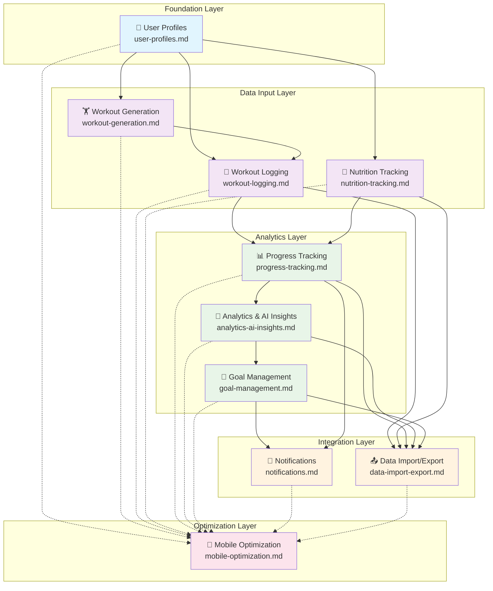
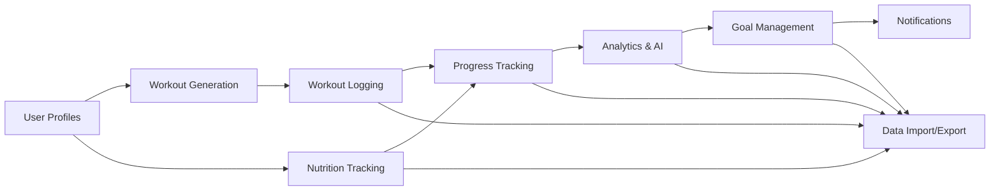

# Feature Integration Guides

## Overview

This directory contains comprehensive frontend integration guides for all 10 core features of the trAIner application. Each guide provides complete implementation guidance including API endpoints, state management patterns, UI components, testing strategies, and troubleshooting information.

---

## 🗺️ Feature Dependency Graph

The following dependency graph shows the implementation order and relationships between features:



---

## 📚 Complete Feature Guide Index

### Foundation Layer
| Feature | Guide | Status | Dependencies | Key APIs |
|---------|-------|--------|--------------|----------|
| 👤 **User Profiles** | [user-profiles.md](./user-profiles.md) | ✅ Complete | None | `/v1/profile/*` |

### Data Input Layer
| Feature | Guide | Status | Dependencies | Key APIs |
|---------|-------|--------|--------------|----------|
| 🏋️ **Workout Generation** | [workout-generation.md](./workout-generation.md) | ✅ Complete | User Profiles | `/v1/workouts/generate` |
| 🍎 **Nutrition Tracking** | [nutrition-tracking.md](./nutrition-tracking.md) | ✅ Complete | User Profiles | `/v1/nutrition/*` |
| 📝 **Workout Logging** | [workout-logging.md](./workout-logging.md) | ✅ Complete | User Profiles, Workout Generation | `/v1/workout-logs/*` |

### Analytics Layer  
| Feature | Guide | Status | Dependencies | Key APIs |
|---------|-------|--------|--------------|----------|
| 📊 **Progress Tracking** | [progress-tracking.md](./progress-tracking.md) | ✅ Complete | Workout Logging, Nutrition Tracking | `/v1/progress/*` |
| 🧠 **Analytics & AI Insights** | [analytics-ai-insights.md](./analytics-ai-insights.md) | ✅ Complete | Progress Tracking | `/v1/analytics/*` |
| 🎯 **Goal Management** | [goal-management.md](./goal-management.md) | ✅ Complete | Analytics & AI Insights | `/v1/goals/*` |

### Integration Layer
| Feature | Guide | Status | Dependencies | Key APIs |
|---------|-------|--------|--------------|----------|
| 🔔 **Notifications** | [notifications.md](./notifications.md) | ✅ Complete | Goal Management, Progress Tracking | `/v1/notifications/*` |
| 📤 **Data Import/Export** | [data-import-export.md](./data-import-export.md) | ✅ Complete | All Data Features | `/v1/data-transfer/*` |

### Optimization Layer
| Feature | Guide | Status | Dependencies | Key APIs |
|---------|-------|--------|--------------|----------|
| 📱 **Mobile Optimization** | [mobile-optimization.md](./mobile-optimization.md) | ✅ Complete | All Features | `/v1/mobile/*` |

---

## 🚀 Quick Start Implementation Guide

### 1. Foundation First
Start with the foundation layer that all other features depend on:

```bash
# Begin with user profiles - everything depends on this
📖 Read: user-profiles.md
```

### 2. Choose Your Path
Based on your application needs, choose one of these implementation paths:

#### Path A: Workout-Focused App
```bash
1. 👤 user-profiles.md      # Foundation
2. 🏋️ workout-generation.md # AI workout plans
3. 📝 workout-logging.md    # Log workouts  
4. 📊 progress-tracking.md  # Track progress
5. 🧠 analytics-ai-insights.md # AI insights
6. 🎯 goal-management.md    # Set goals
```

#### Path B: Nutrition-Focused App
```bash
1. 👤 user-profiles.md      # Foundation
2. 🍎 nutrition-tracking.md # Track nutrition
3. 📊 progress-tracking.md  # Track progress
4. 🧠 analytics-ai-insights.md # AI insights
5. 🎯 goal-management.md    # Set goals
```

#### Path C: Complete Fitness Platform
```bash
1. 👤 user-profiles.md      # Foundation
2. 🏋️ workout-generation.md # AI workout plans
3. 🍎 nutrition-tracking.md # Track nutrition
4. 📝 workout-logging.md    # Log workouts
5. 📊 progress-tracking.md  # Track progress
6. 🧠 analytics-ai-insights.md # AI insights
7. 🎯 goal-management.md    # Set goals
8. 🔔 notifications.md      # User engagement
9. 📤 data-import-export.md # Data portability
10. 📱 mobile-optimization.md # Mobile experience
```

### 3. Integration Features
Add these features once your core data features are implemented:

```bash
# User Engagement
🔔 notifications.md         # Add when goals are implemented

# Data Management  
📤 data-import-export.md    # Add when multiple data features exist

# Performance
📱 mobile-optimization.md   # Add for mobile experience
```

---

## 🏗️ Implementation Patterns

### Common Integration Patterns Across Features

Each feature guide follows consistent patterns you'll find throughout:

#### 1. **State Management Pattern**
```typescript
// All features use similar state patterns
interface FeatureState {
  data: FeatureData | null;
  loading: boolean;
  error: string | null;
  // Feature-specific state...
}
```

#### 2. **API Client Pattern**  
```typescript
// Consistent API client structure
class FeatureApiClient {
  async getFeatureData(params: FeatureParams): Promise<FeatureResponse>
  async updateFeatureData(data: FeatureData): Promise<FeatureResponse>
  // Feature-specific methods...
}
```

#### 3. **Real-time Updates Pattern**
```typescript
// Features with real-time data use Supabase Realtime
useEffect(() => {
  const channel = supabase
    .channel('feature-updates')
    .on('postgres_changes', {
      event: '*',
      schema: 'public', 
      table: 'feature_table'
    }, handleRealtimeUpdate)
    .subscribe();
    
  return () => supabase.removeChannel(channel);
}, []);
```

#### 4. **Error Handling Pattern**
```typescript
// Consistent error boundaries and handling
try {
  const result = await apiCall();
  // Handle success
} catch (error) {
  if (error instanceof ValidationError) {
    // Handle validation errors
  } else if (error instanceof NetworkError) {
    // Handle network errors  
  } else {
    // Handle unexpected errors
  }
}
```

---

## 🧠 AI-Powered Features

Three features include sophisticated AI integration:

| Feature | AI Capability | Implementation Guide |
|---------|---------------|---------------------|
| 🏋️ **Workout Generation** | Dual AI agents for research + plan generation | [AI Integration Patterns](./workout-generation.md#ai-integration-patterns) |
| 🍎 **Nutrition Tracking** | Meal planning AI agent | [AI Meal Planning](./nutrition-tracking.md#ai-meal-planning-integration) |
| 🧠 **Analytics & AI Insights** | Pattern detection + insight generation | [AI Analytics](./analytics-ai-insights.md#ai-insights-implementation) |

### AI Integration Patterns
```typescript
// Common AI status tracking pattern
interface AIStatus {
  status: 'idle' | 'thinking' | 'researching' | 'generating' | 'complete' | 'error';
  progress?: number;
  currentStep?: string;
  reasoning?: string[];
  error?: string;
}
```

---

## 📱 Mobile-First Considerations

The [mobile-optimization.md](./mobile-optimization.md) guide provides comprehensive mobile optimization, but key mobile considerations are integrated throughout all feature guides:

- **Payload Optimization**: All API responses optimized for <50KB mobile payloads
- **Offline Capabilities**: PWA features with IndexedDB storage
- **Progressive Loading**: Essential for mobile AI interactions
- **Battery Optimization**: Network-aware and battery-conscious features

---

## 🔗 Cross-Feature Integration Points

### Data Flow Between Features


### State Coordination
Features share data through several mechanisms:
- **User Context**: Profile data available globally
- **Real-time Updates**: Supabase Realtime for live data sync
- **Cross-Feature Queries**: Analytics aggregates data from multiple sources
- **Notification Triggers**: Goals and progress trigger notifications

---

## 🧪 Testing Strategy

Each feature guide includes comprehensive testing patterns:

1. **Unit Tests**: Component and hook testing with React Testing Library
2. **Integration Tests**: API integration with MSW (Mock Service Worker)
3. **AI Mocking**: Patterns for mocking AI agent responses
4. **E2E Tests**: Critical user journey testing with Playwright

### Common Test Utilities
```typescript
// Test utilities shared across features
export const createMockFeatureData = () => ({...});
export const mockFeatureAPI = () => ({...});
export const renderWithProviders = (component) => ({...});
```

---

## 🔧 Development Tools & Setup

### Prerequisites
- Node.js 18+
- TypeScript 5.0+
- React 18+
- Supabase CLI
- Backend API running locally

### Environment Setup
```bash
# Copy environment template
cp .env.example .env.local

# Install dependencies  
npm install

# Start development server
npm run dev
```

### Feature Development Workflow
1. Read the specific feature guide thoroughly
2. Implement backend integration first (API client)
3. Add state management (hooks/context)
4. Build UI components  
5. Add real-time capabilities (if applicable)
6. Implement error handling
7. Add comprehensive tests
8. Optimize for mobile (if applicable)

---

## 📖 Documentation Standards

Each feature guide follows this standardized structure:

1. **Overview** - Feature purpose and capabilities
2. **Architecture & Data Flow** - Technical architecture
3. **API Endpoints Reference** - Complete endpoint documentation  
4. **State Management** - React state patterns
5. **Implementation Guide** - Step-by-step implementation
6. **UI Components** - Component examples and patterns
7. **Real-time Updates** - Live data integration (if applicable)
8. **Error Handling** - Error management strategies
9. **Testing Strategies** - Comprehensive testing approach
10. **Troubleshooting** - Common issues and solutions

---

## 🆘 Getting Help

### Quick Reference Links
- **Backend API Documentation**: `/docs/api/`
- **Database Schema**: `/docs/database/`
- **Core Concepts**: `/docs/frontend-integration/01-core-concepts/`
- **UI Patterns**: `/docs/frontend-integration/03-ui-patterns/`

### Implementation Support
1. Start with the feature dependency graph above
2. Read the complete feature guide for your target feature
3. Check cross-feature integration points for dependencies
4. Reference common patterns section for consistent implementation
5. Use troubleshooting sections for common issues

### Contributing
When updating feature guides:
1. Maintain consistency with existing patterns
2. Update dependency graph if relationships change
3. Keep implementation status current
4. Add examples for complex integrations
5. Update cross-references between guides

---

**Total Features Documented**: 10/10 ✅  
**Implementation Status**: Production Ready  
**Last Updated**: December 2024 