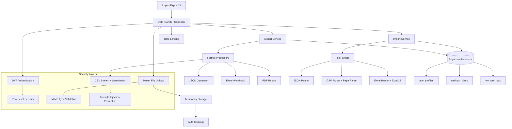

# Data Import & Export Integration Guide

## Table of Contents
1. [Overview & Architecture](#overview--architecture)
2. [API Endpoints Reference](#api-endpoints-reference)
3. [File Upload Management](#file-upload-management)
4. [State Management](#state-management)
5. [Complex UI Components](#complex-ui-components)
6. [Format-Specific Processing](#format-specific-processing)
7. [Performance Optimization](#performance-optimization)
8. [Error Handling & Recovery](#error-handling--recovery)
9. [Testing Strategies](#testing-strategies)
10. [Troubleshooting & FAQs](#troubleshooting--faqs)

---

## Overview & Architecture

### Feature Purpose

The Data Import & Export feature provides comprehensive data portability for user fitness information with support for multiple formats (JSON, CSV, XLSX, PDF), robust validation, security measures, and streaming capabilities. This feature enables users to export their complete fitness data for backup, migration, or analysis purposes, and import data from external sources with comprehensive validation and error handling.

### Core Capabilities

**📤 Export Features:**
- **Multi-format Export:** JSON, CSV, XLSX, PDF with format-specific optimizations
- **Selective Data Export:** Choose specific data types (profiles, workouts, workout_logs)
- **Streaming Responses:** Memory-efficient large dataset handling
- **Security Measures:** CSV formula injection prevention, user data isolation
- **Download Management:** Proper file headers and content disposition

**📥 Import Features:**
- **Multi-format Import:** JSON, CSV, XLSX with intelligent format detection
- **Batch Processing:** 100-record batches for efficient database operations
- **Data Validation:** Comprehensive Joi schema validation for data integrity
- **Error Reporting:** Detailed validation failures with partial import support
- **Auto-linking:** Orphaned workout logs automatically linked to recent plans

**🔒 Security & Performance:**
- JWT authentication with Row Level Security (RLS) compliance
- File size limits (10MB) and MIME type validation
- Rate limiting (5 req/hour export, 3 req/hour import in production)
- Temporary file cleanup and secure processing
- User data isolation with comprehensive audit logging

### Technical Architecture



### Database Schema Integration

**Primary Tables:**
- `user_profiles`: User profile data with personal metrics and preferences
- `workout_plans`: AI-generated and custom workout plans with structured data
- `workout_logs`: Exercise completion records with performance metrics

**Data Relationships:**
- Workout logs link to workout plans via `plan_id` (nullable for custom logs)
- All tables filtered by `user_id` for data isolation
- Foreign key relationships maintained during import operations

### Performance Characteristics

- **Export Operations:** 
  - JSON: < 500ms for typical datasets
  - CSV: Streaming for datasets >1000 records
  - XLSX: < 2s for workbooks with multiple sheets
  - PDF: < 3s for formatted reports
- **Import Operations:**
  - JSON: < 1s for files <1MB
  - CSV: ~100-200 records/second processing rate
  - XLSX: ~50-100 records/second with validation
- **File Limits:** 10MB maximum upload size
- **Rate Limiting:** Production limits prevent abuse while allowing normal usage

---

## API Endpoints Reference

### POST /v1/data-transfer/export
**Purpose:** Export user fitness data in specified format with streaming support

#### Request Configuration
```typescript
interface ExportRequest {
  format: 'json' | 'csv' | 'xlsx' | 'pdf';
  dataTypes: ('profiles' | 'workouts' | 'workout_logs')[];
}

const exportData = async (request: ExportRequest, token: string) => {
  const response = await fetch('/v1/data-transfer/export', {
    method: 'POST',
    headers: {
      'Authorization': `Bearer ${token}`,
      'Content-Type': 'application/json'
    },
    body: JSON.stringify(request)
  });

  if (!response.ok) {
    const error = await response.json();
    throw new Error(error.message);
  }

  return response;
};
```

#### Request Parameters
- `format` (required): Export format - one of ['json', 'csv', 'xlsx', 'pdf']
- `dataTypes` (required): Array of data types - at least one of ['profiles', 'workouts', 'workout_logs']

#### Response Handling by Format

**JSON Export Response:**
```typescript
interface JSONExportResponse {
  exportDate: string;
  userId: string;
  data: {
    profiles?: ProfileData[];
    workouts?: WorkoutData[];
    workout_logs?: WorkoutLogData[];
  };
}

// Handle JSON response
if (request.format === 'json') {
  const jsonData: JSONExportResponse = await response.json();
  return jsonData;
}
```

**File Download Response (CSV, XLSX, PDF):**
```typescript
// Handle file download for non-JSON formats
const handleFileDownload = async (response: Response, format: string) => {
  const blob = await response.blob();
  const url = window.URL.createObjectURL(blob);
  
  // Get filename from Content-Disposition header or generate default
  const contentDisposition = response.headers.get('Content-Disposition');
  const filename = contentDisposition 
    ? contentDisposition.split('filename=')[1]?.replace(/"/g, '')
    : `fitness-data-export-${new Date().toISOString().split('T')[0]}.${format}`;
  
  // Trigger download
  const a = document.createElement('a');
  a.href = url;
  a.download = filename;
  document.body.appendChild(a);
  a.click();
  
  // Cleanup
  document.body.removeChild(a);
  window.URL.revokeObjectURL(url);
};
```

#### Error Responses
- **400:** Invalid format parameter or data types validation failure
- **401:** Missing or invalid JWT token
- **429:** Rate limit exceeded (5 requests/hour in production)
- **500:** Export generation failure or database issues

### POST /v1/data-transfer/import
**Purpose:** Import fitness data from uploaded file with comprehensive validation

#### Request Configuration
```typescript
const importData = async (file: File, token: string) => {
  const formData = new FormData();
  formData.append('file', file);
  
  const response = await fetch('/v1/data-transfer/import', {
    method: 'POST',
    headers: {
      'Authorization': `Bearer ${token}`
      // Do not set Content-Type for FormData - browser sets it with boundary
    },
    body: formData
  });

  const result = await response.json();
  
  if (!response.ok) {
    throw new Error(result.message);
  }
  
  return result;
};
```

#### File Upload Requirements
- **Supported Formats:** JSON (.json), CSV (.csv), Excel (.xlsx)
- **File Size Limit:** 10MB maximum
- **MIME Type Validation:** Enforced by backend with extension fallback
- **Security:** Temporary file processing with automatic cleanup

#### Response Structure
```typescript
interface ImportResponse {
  status: 'success' | 'error';
  message: string;
  data?: ImportResult;
}

interface ImportResult {
  total: number;           // Total records processed
  successful: number;      // Successfully imported
  failed: number;          // Failed validation/insertion
  errors: string[];        // Array of error messages (max 10)
}

// Example responses
const successResponse: ImportResponse = {
  status: 'success',
  message: 'Data imported successfully.',
  data: {
    total: 50,
    successful: 50,
    failed: 0,
    errors: []
  }
};

const partialSuccessResponse: ImportResponse = {
  status: 'success',
  message: 'Data imported with 3 validation failures.',
  data: {
    total: 25,
    successful: 22,
    failed: 3,
    errors: [
      'Validation error for profiles: Age must be between 13 and 120',
      'Invalid date format in workout_logs',
      'Missing required field: name'
    ]
  }
};
```

#### Error Responses
- **400:** No file uploaded, file size exceeded, unsupported file type, or all data validation failed
- **401:** Missing or invalid JWT token
- **429:** Rate limit exceeded (3 requests/hour in production)
- **500:** Import processing failure or database errors

#### File Validation Process
```typescript
// Frontend file validation before upload
const validateFile = (file: File): { valid: boolean; error?: string } => {
  // Check file size (10MB limit)
  const maxSize = 10 * 1024 * 1024; // 10MB in bytes
  if (file.size > maxSize) {
    return { 
      valid: false, 
      error: `File size (${(file.size / 1024 / 1024).toFixed(2)}MB) exceeds 10MB limit` 
    };
  }
  
  // Check file type
  const allowedTypes = ['application/json', 'text/csv', 'application/vnd.openxmlformats-officedocument.spreadsheetml.sheet'];
  const allowedExtensions = ['.json', '.csv', '.xlsx'];
  
  const hasValidMimeType = allowedTypes.includes(file.type);
  const hasValidExtension = allowedExtensions.some(ext => 
    file.name.toLowerCase().endsWith(ext)
  );
  
  if (!hasValidMimeType && !hasValidExtension) {
    return { 
      valid: false, 
      error: 'Please upload a JSON, CSV, or Excel (.xlsx) file' 
    };
  }
  
  return { valid: true };
};
```

---

## File Upload Management

### Comprehensive File Upload Component

```tsx
// FileUploadComponent.tsx
import React, { useState, useCallback, useRef } from 'react';
import { useAuth } from '../contexts/AuthContext';

interface FileUploadProps {
  onUploadSuccess?: (result: ImportResult) => void;
  onUploadError?: (error: string) => void;
}

export const FileUploadComponent: React.FC<FileUploadProps> = ({
  onUploadSuccess,
  onUploadError
}) => {
  const { user } = useAuth();
  const fileInputRef = useRef<HTMLInputElement>(null);
  
  const [uploadState, setUploadState] = useState<{
    isUploading: boolean;
    progress: number;
    dragActive: boolean;
    selectedFile: File | null;
    validationError: string | null;
  }>({
    isUploading: false,
    progress: 0,
    dragActive: false,
    selectedFile: null,
    validationError: null
  });

  // File validation
  const validateFile = useCallback((file: File) => {
    const maxSize = 10 * 1024 * 1024; // 10MB
    if (file.size > maxSize) {
      return `File size (${(file.size / 1024 / 1024).toFixed(2)}MB) exceeds 10MB limit`;
    }
    
    const allowedTypes = ['application/json', 'text/csv', 'application/vnd.openxmlformats-officedocument.spreadsheetml.sheet'];
    const allowedExtensions = ['.json', '.csv', '.xlsx'];
    
    const hasValidMimeType = allowedTypes.includes(file.type);
    const hasValidExtension = allowedExtensions.some(ext => 
      file.name.toLowerCase().endsWith(ext)
    );
    
    if (!hasValidMimeType && !hasValidExtension) {
      return 'Please upload a JSON, CSV, or Excel (.xlsx) file';
    }
    
    return null;
  }, []);

  // Handle file selection
  const handleFileSelection = useCallback((file: File) => {
    const validationError = validateFile(file);
    
    setUploadState(prev => ({
      ...prev,
      selectedFile: file,
      validationError,
      progress: 0
    }));
  }, [validateFile]);

  // Drag and drop handlers
  const handleDragEnter = useCallback((e: React.DragEvent) => {
    e.preventDefault();
    e.stopPropagation();
    setUploadState(prev => ({ ...prev, dragActive: true }));
  }, []);

  const handleDragLeave = useCallback((e: React.DragEvent) => {
    e.preventDefault();
    e.stopPropagation();
    setUploadState(prev => ({ ...prev, dragActive: false }));
  }, []);

  const handleDragOver = useCallback((e: React.DragEvent) => {
    e.preventDefault();
    e.stopPropagation();
  }, []);

  const handleDrop = useCallback((e: React.DragEvent) => {
    e.preventDefault();
    e.stopPropagation();
    setUploadState(prev => ({ ...prev, dragActive: false }));
    
    const files = Array.from(e.dataTransfer.files);
    if (files.length > 0) {
      handleFileSelection(files[0]);
    }
  }, [handleFileSelection]);

  // File input change handler
  const handleFileInputChange = useCallback((e: React.ChangeEvent<HTMLInputElement>) => {
    const files = e.target.files;
    if (files && files.length > 0) {
      handleFileSelection(files[0]);
    }
  }, [handleFileSelection]);

  // Upload with progress tracking
  const uploadFile = useCallback(async () => {
    if (!uploadState.selectedFile || uploadState.validationError || !user?.jwtToken) {
      return;
    }

    setUploadState(prev => ({ ...prev, isUploading: true, progress: 0 }));

    try {
      const formData = new FormData();
      formData.append('file', uploadState.selectedFile);

      // Create XMLHttpRequest for progress tracking
      const xhr = new XMLHttpRequest();
      
      // Set up progress tracking
      xhr.upload.addEventListener('progress', (e) => {
        if (e.lengthComputable) {
          const progress = Math.round((e.loaded / e.total) * 100);
          setUploadState(prev => ({ ...prev, progress }));
        }
      });

      // Set up response handling
      const uploadPromise = new Promise<ImportResult>((resolve, reject) => {
        xhr.onreadystatechange = () => {
          if (xhr.readyState === XMLHttpRequest.DONE) {
            if (xhr.status === 200) {
              try {
                const response = JSON.parse(xhr.responseText);
                resolve(response.data);
              } catch (parseError) {
                reject(new Error('Failed to parse response'));
              }
            } else {
              try {
                const errorResponse = JSON.parse(xhr.responseText);
                reject(new Error(errorResponse.message));
              } catch {
                reject(new Error(`Upload failed with status ${xhr.status}`));
              }
            }
          }
        };
      });

      // Configure and send request
      xhr.open('POST', '/v1/data-transfer/import');
      xhr.setRequestHeader('Authorization', `Bearer ${user.jwtToken}`);
      xhr.send(formData);

      // Wait for completion
      const result = await uploadPromise;
      
      // Handle success
      setUploadState(prev => ({ 
        ...prev, 
        isUploading: false, 
        selectedFile: null,
        progress: 100
      }));
      
      onUploadSuccess?.(result);
      
      // Clear file input
      if (fileInputRef.current) {
        fileInputRef.current.value = '';
      }

    } catch (error) {
      setUploadState(prev => ({ 
        ...prev, 
        isUploading: false, 
        progress: 0 
      }));
      
      const errorMessage = error instanceof Error ? error.message : 'Upload failed';
      onUploadError?.(errorMessage);
    }
  }, [uploadState.selectedFile, uploadState.validationError, user?.jwtToken, onUploadSuccess, onUploadError]);

  return (
    <div className="file-upload-component">
      {/* Drag and Drop Area */}
      <div
        className={`border-2 border-dashed rounded-lg p-8 text-center transition-colors ${
          uploadState.dragActive 
            ? 'border-blue-500 bg-blue-50' 
            : 'border-gray-300 hover:border-gray-400'
        }`}
        onDragEnter={handleDragEnter}
        onDragLeave={handleDragLeave}
        onDragOver={handleDragOver}
        onDrop={handleDrop}
      >
        <div className="space-y-4">
          <div className="text-4xl">📁</div>
          
          <div>
            <p className="text-lg font-medium text-gray-900">
              {uploadState.selectedFile ? uploadState.selectedFile.name : 'Upload your fitness data'}
            </p>
            <p className="text-sm text-gray-500 mt-2">
              Drag and drop your file here, or click to browse
            </p>
            <p className="text-xs text-gray-400 mt-1">
              Supports JSON, CSV, and Excel (.xlsx) files up to 10MB
            </p>
          </div>

          {/* File Selection Button */}
          <div>
            <input
              ref={fileInputRef}
              type="file"
              accept=".json,.csv,.xlsx,application/json,text/csv,application/vnd.openxmlformats-officedocument.spreadsheetml.sheet"
              onChange={handleFileInputChange}
              className="hidden"
            />
            <button
              type="button"
              onClick={() => fileInputRef.current?.click()}
              className="px-4 py-2 bg-blue-600 text-white rounded-md hover:bg-blue-700 transition-colors"
              disabled={uploadState.isUploading}
            >
              {uploadState.isUploading ? 'Uploading...' : 'Choose File'}
            </button>
          </div>
        </div>
      </div>

      {/* Validation Error Display */}
      {uploadState.validationError && (
        <div className="mt-4 p-3 bg-red-50 border border-red-200 rounded-md">
          <p className="text-sm text-red-700">
            <span className="font-medium">Error:</span> {uploadState.validationError}
          </p>
        </div>
      )}

      {/* Selected File Info */}
      {uploadState.selectedFile && !uploadState.validationError && (
        <div className="mt-4 p-4 bg-gray-50 border border-gray-200 rounded-md">
          <div className="flex items-center justify-between">
            <div>
              <p className="text-sm font-medium text-gray-900">
                {uploadState.selectedFile.name}
              </p>
              <p className="text-xs text-gray-500">
                {(uploadState.selectedFile.size / 1024 / 1024).toFixed(2)} MB
              </p>
            </div>
            
            <button
              onClick={uploadFile}
              disabled={uploadState.isUploading}
              className="px-4 py-2 bg-green-600 text-white rounded-md hover:bg-green-700 disabled:opacity-50 disabled:cursor-not-allowed transition-colors"
            >
              {uploadState.isUploading ? 'Uploading...' : 'Upload'}
            </button>
          </div>

          {/* Progress Bar */}
          {uploadState.isUploading && (
            <div className="mt-3">
              <div className="flex justify-between text-xs text-gray-600 mb-1">
                <span>Uploading...</span>
                <span>{uploadState.progress}%</span>
              </div>
              <div className="w-full bg-gray-200 rounded-full h-2">
                <div
                  className="bg-blue-600 h-2 rounded-full transition-all duration-300"
                  style={{ width: `${uploadState.progress}%` }}
                />
              </div>
            </div>
          )}
        </div>
      )}
    </div>
  );
};
```

### File Type Detection and Preview

```tsx
// FilePreviewComponent.tsx
interface FilePreviewProps {
  file: File;
  onRemove?: () => void;
}

export const FilePreviewComponent: React.FC<FilePreviewProps> = ({ file, onRemove }) => {
  const getFileIcon = (fileName: string) => {
    if (fileName.endsWith('.json')) return '📄';
    if (fileName.endsWith('.csv')) return '📊';
    if (fileName.endsWith('.xlsx')) return '📈';
    return '📁';
  };

  const getFileTypeLabel = (fileName: string) => {
    if (fileName.endsWith('.json')) return 'JSON Data';
    if (fileName.endsWith('.csv')) return 'CSV Spreadsheet';
    if (fileName.endsWith('.xlsx')) return 'Excel Workbook';
    return 'Unknown Format';
  };

  return (
    <div className="file-preview bg-white border border-gray-200 rounded-lg p-4">
      <div className="flex items-center space-x-3">
        <div className="text-2xl">{getFileIcon(file.name)}</div>
        
        <div className="flex-1 min-w-0">
          <p className="text-sm font-medium text-gray-900 truncate">
            {file.name}
          </p>
          <p className="text-xs text-gray-500">
            {getFileTypeLabel(file.name)} • {(file.size / 1024 / 1024).toFixed(2)} MB
          </p>
        </div>
        
        {onRemove && (
          <button
            onClick={onRemove}
            className="text-gray-400 hover:text-red-500 transition-colors"
            title="Remove file"
          >
            <svg className="w-5 h-5" fill="currentColor" viewBox="0 0 20 20">
              <path fillRule="evenodd" d="M4.293 4.293a1 1 0 011.414 0L10 8.586l4.293-4.293a1 1 0 111.414 1.414L11.414 10l4.293 4.293a1 1 0 01-1.414 1.414L10 11.414l-4.293 4.293a1 1 0 01-1.414-1.414L8.586 10 4.293 5.707a1 1 0 010-1.414z" clipRule="evenodd" />
            </svg>
          </button>
        )}
      </div>
    </div>
  );
};
``` 

---

## State Management

### Data Transfer State Structure

```typescript
interface DataTransferState {
  // Import state
  import: {
    isUploading: boolean;
    progress: number;
    selectedFile: File | null;
    validationError: string | null;
    result: ImportResult | null;
  };
  
  // Export state
  export: {
    isExporting: boolean;
    format: ExportFormat | null;
    dataTypes: DataType[];
    progress: number;
    result: ExportResult | null;
  };
  
  // UI state
  ui: {
    dragActive: boolean;
    showResults: boolean;
    activeTab: 'import' | 'export';
    showPreview: boolean;
  };
  
  // Error state
  errors: {
    import: string | null;
    export: string | null;
    rateLimitHit: boolean;
    lastError: Date | null;
  };
  
  // Rate limiting tracking
  rateLimits: {
    export: {
      remaining: number;
      resetTime: Date | null;
    };
    import: {
      remaining: number;
      resetTime: Date | null;
    };
  };
}

type ExportFormat = 'json' | 'csv' | 'xlsx' | 'pdf';
type DataType = 'profiles' | 'workouts' | 'workout_logs';

interface ImportResult {
  total: number;
  successful: number;
  failed: number;
  errors: string[];
}

interface ExportResult {
  format: ExportFormat;
  dataTypes: DataType[];
  recordCount: number;
  downloadUrl?: string;
  data?: any; // For JSON exports
}
```

### State Management Implementation

**Using React Context + Reducer:**

```tsx
// DataTransferContext.tsx
import React, { createContext, useContext, useReducer, useCallback } from 'react';
import { useAuth } from './AuthContext';

const DataTransferContext = createContext<DataTransferContextType | undefined>(undefined);

export const useDataTransfer = () => {
  const context = useContext(DataTransferContext);
  if (!context) {
    throw new Error('useDataTransfer must be used within a DataTransferProvider');
  }
  return context;
};

const initialState: DataTransferState = {
  import: {
    isUploading: false,
    progress: 0,
    selectedFile: null,
    validationError: null,
    result: null
  },
  export: {
    isExporting: false,
    format: null,
    dataTypes: [],
    progress: 0,
    result: null
  },
  ui: {
    dragActive: false,
    showResults: false,
    activeTab: 'import',
    showPreview: false
  },
  errors: {
    import: null,
    export: null,
    rateLimitHit: false,
    lastError: null
  },
  rateLimits: {
    export: { remaining: 5, resetTime: null },
    import: { remaining: 3, resetTime: null }
  }
};

const dataTransferReducer = (state: DataTransferState, action: DataTransferAction): DataTransferState => {
  switch (action.type) {
    case 'SET_IMPORT_FILE':
      return {
        ...state,
        import: {
          ...state.import,
          selectedFile: action.payload.file,
          validationError: action.payload.validationError,
          result: null
        },
        errors: { ...state.errors, import: null }
      };
      
    case 'START_IMPORT':
      return {
        ...state,
        import: {
          ...state.import,
          isUploading: true,
          progress: 0,
          result: null
        },
        errors: { ...state.errors, import: null }
      };
      
    case 'UPDATE_IMPORT_PROGRESS':
      return {
        ...state,
        import: {
          ...state.import,
          progress: action.payload.progress
        }
      };
      
    case 'IMPORT_SUCCESS':
      return {
        ...state,
        import: {
          ...state.import,
          isUploading: false,
          progress: 100,
          result: action.payload.result,
          selectedFile: null
        },
        ui: { ...state.ui, showResults: true }
      };
      
    case 'START_EXPORT':
      return {
        ...state,
        export: {
          ...state.export,
          isExporting: true,
          format: action.payload.format,
          dataTypes: action.payload.dataTypes,
          progress: 0,
          result: null
        },
        errors: { ...state.errors, export: null }
      };
      
    case 'EXPORT_SUCCESS':
      return {
        ...state,
        export: {
          ...state.export,
          isExporting: false,
          progress: 100,
          result: action.payload.result
        },
        ui: { ...state.ui, showResults: true }
      };
      
    case 'SET_ERROR':
      return {
        ...state,
        import: action.payload.type === 'import' ? { ...state.import, isUploading: false } : state.import,
        export: action.payload.type === 'export' ? { ...state.export, isExporting: false } : state.export,
        errors: {
          ...state.errors,
          [action.payload.type]: action.payload.message,
          rateLimitHit: action.payload.isRateLimit || false,
          lastError: new Date()
        }
      };
      
    case 'UPDATE_RATE_LIMITS':
      return {
        ...state,
        rateLimits: {
          ...state.rateLimits,
          [action.payload.type]: {
            remaining: action.payload.remaining,
            resetTime: action.payload.resetTime
          }
        }
      };
      
    case 'SET_UI_STATE':
      return {
        ...state,
        ui: { ...state.ui, ...action.payload }
      };
      
    case 'CLEAR_RESULTS':
      return {
        ...state,
        import: { ...state.import, result: null },
        export: { ...state.export, result: null },
        ui: { ...state.ui, showResults: false }
      };
      
    default:
      return state;
  }
};

export const DataTransferProvider: React.FC<{ children: React.ReactNode }> = ({ children }) => {
  const [state, dispatch] = useReducer(dataTransferReducer, initialState);
  const { user } = useAuth();

  // Import functionality
  const importFile = useCallback(async (file: File) => {
    if (!user?.jwtToken) {
      dispatch({ type: 'SET_ERROR', payload: { type: 'import', message: 'Authentication required' } });
      return;
    }

    dispatch({ type: 'START_IMPORT' });

    try {
      const formData = new FormData();
      formData.append('file', file);

      const xhr = new XMLHttpRequest();
      
      // Progress tracking
      xhr.upload.addEventListener('progress', (e) => {
        if (e.lengthComputable) {
          const progress = Math.round((e.loaded / e.total) * 100);
          dispatch({ type: 'UPDATE_IMPORT_PROGRESS', payload: { progress } });
        }
      });

      // Response handling
      const result = await new Promise<ImportResult>((resolve, reject) => {
        xhr.onreadystatechange = () => {
          if (xhr.readyState === XMLHttpRequest.DONE) {
            if (xhr.status === 200) {
              try {
                const response = JSON.parse(xhr.responseText);
                
                // Update rate limits from headers
                const remaining = parseInt(xhr.getResponseHeader('X-RateLimit-Remaining') || '0');
                const resetTime = xhr.getResponseHeader('X-RateLimit-Reset');
                
                dispatch({
                  type: 'UPDATE_RATE_LIMITS',
                  payload: {
                    type: 'import',
                    remaining,
                    resetTime: resetTime ? new Date(parseInt(resetTime) * 1000) : null
                  }
                });
                
                resolve(response.data);
              } catch (parseError) {
                reject(new Error('Failed to parse response'));
              }
            } else if (xhr.status === 429) {
              reject(new Error('Rate limit exceeded. Please try again later.'));
            } else {
              try {
                const errorResponse = JSON.parse(xhr.responseText);
                reject(new Error(errorResponse.message));
              } catch {
                reject(new Error(`Upload failed with status ${xhr.status}`));
              }
            }
          }
        };
      });

      xhr.open('POST', '/v1/data-transfer/import');
      xhr.setRequestHeader('Authorization', `Bearer ${user.jwtToken}`);
      xhr.send(formData);

      const importResult = await result;
      dispatch({ type: 'IMPORT_SUCCESS', payload: { result: importResult } });
      
      return importResult;

    } catch (error) {
      const errorMessage = error instanceof Error ? error.message : 'Import failed';
      const isRateLimit = errorMessage.includes('rate limit') || errorMessage.includes('Rate limit');
      
      dispatch({ 
        type: 'SET_ERROR', 
        payload: { 
          type: 'import', 
          message: errorMessage,
          isRateLimit
        } 
      });
      
      throw error;
    }
  }, [user?.jwtToken]);

  // Export functionality
  const exportData = useCallback(async (format: ExportFormat, dataTypes: DataType[]) => {
    if (!user?.jwtToken) {
      dispatch({ type: 'SET_ERROR', payload: { type: 'export', message: 'Authentication required' } });
      return;
    }

    dispatch({ type: 'START_EXPORT', payload: { format, dataTypes } });

    try {
      const response = await fetch('/v1/data-transfer/export', {
        method: 'POST',
        headers: {
          'Authorization': `Bearer ${user.jwtToken}`,
          'Content-Type': 'application/json'
        },
        body: JSON.stringify({ format, dataTypes })
      });

      if (!response.ok) {
        const error = await response.json();
        throw new Error(error.message);
      }

      // Update rate limits from headers
      const remaining = parseInt(response.headers.get('X-RateLimit-Remaining') || '0');
      const resetTime = response.headers.get('X-RateLimit-Reset');
      
      dispatch({
        type: 'UPDATE_RATE_LIMITS',
        payload: {
          type: 'export',
          remaining,
          resetTime: resetTime ? new Date(parseInt(resetTime) * 1000) : null
        }
      });

      let result: ExportResult;

      if (format === 'json') {
        // Handle JSON response
        const jsonData = await response.json();
        result = {
          format,
          dataTypes,
          recordCount: Object.values(jsonData.data).flat().length,
          data: jsonData
        };
      } else {
        // Handle file download
        const blob = await response.blob();
        const url = window.URL.createObjectURL(blob);
        
        const contentDisposition = response.headers.get('Content-Disposition');
        const filename = contentDisposition 
          ? contentDisposition.split('filename=')[1]?.replace(/"/g, '')
          : `fitness-data-export-${new Date().toISOString().split('T')[0]}.${format}`;
        
        // Trigger download
        const a = document.createElement('a');
        a.href = url;
        a.download = filename;
        document.body.appendChild(a);
        a.click();
        document.body.removeChild(a);
        window.URL.revokeObjectURL(url);

        result = {
          format,
          dataTypes,
          recordCount: 0, // We don't know the count for file downloads
          downloadUrl: filename
        };
      }

      dispatch({ type: 'EXPORT_SUCCESS', payload: { result } });
      
      return result;

    } catch (error) {
      const errorMessage = error instanceof Error ? error.message : 'Export failed';
      const isRateLimit = errorMessage.includes('rate limit') || errorMessage.includes('Rate limit');
      
      dispatch({ 
        type: 'SET_ERROR', 
        payload: { 
          type: 'export', 
          message: errorMessage,
          isRateLimit
        } 
      });
      
      throw error;
    }
  }, [user?.jwtToken]);

  const value = {
    state,
    dispatch,
    importFile,
    exportData
  };

  return (
    <DataTransferContext.Provider value={value}>
      {children}
    </DataTransferContext.Provider>
  );
};
```

---

## Complex UI Components

### Export Configuration Component

```tsx
// ExportConfigurationComponent.tsx
import React, { useState, useCallback } from 'react';
import { useDataTransfer } from '../contexts/DataTransferContext';

export const ExportConfigurationComponent: React.FC = () => {
  const { state, exportData } = useDataTransfer();
  
  const [config, setConfig] = useState<{
    format: ExportFormat;
    dataTypes: DataType[];
    showPreview: boolean;
  }>({
    format: 'json',
    dataTypes: ['profiles'],
    showPreview: false
  });

  const formatOptions = [
    { 
      value: 'json' as const, 
      label: 'JSON', 
      icon: '📄', 
      description: 'Complete data structure with metadata',
      pros: ['Complete data', 'Easy to re-import', 'Includes relationships'],
      cons: ['Larger file size', 'Technical format']
    },
    { 
      value: 'csv' as const, 
      label: 'CSV', 
      icon: '📊', 
      description: 'Spreadsheet-compatible format',
      pros: ['Universal compatibility', 'Small file size', 'Human readable'],
      cons: ['Flattened structure', 'Limited data types']
    },
    { 
      value: 'xlsx' as const, 
      label: 'Excel', 
      icon: '📈', 
      description: 'Excel workbook with multiple sheets',
      pros: ['Professional format', 'Multiple sheets', 'Formatted data'],
      cons: ['Proprietary format', 'Larger file size']
    },
    { 
      value: 'pdf' as const, 
      label: 'PDF', 
      icon: '📄', 
      description: 'Formatted report for viewing/printing',
      pros: ['Professional presentation', 'Read-only security', 'Universal viewing'],
      cons: ['Not editable', 'Not re-importable', 'Fixed layout']
    }
  ];

  const dataTypeOptions = [
    { 
      value: 'profiles' as const, 
      label: 'User Profile', 
      icon: '👤',
      description: 'Personal information, goals, and preferences'
    },
    { 
      value: 'workouts' as const, 
      label: 'Workout Plans', 
      icon: '💪',
      description: 'AI-generated and custom workout plans'
    },
    { 
      value: 'workout_logs' as const, 
      label: 'Workout Logs', 
      icon: '📝',
      description: 'Exercise completion records and performance'
    }
  ];

  const handleFormatChange = useCallback((format: ExportFormat) => {
    setConfig(prev => ({ ...prev, format }));
  }, []);

  const handleDataTypeToggle = useCallback((dataType: DataType) => {
    setConfig(prev => ({
      ...prev,
      dataTypes: prev.dataTypes.includes(dataType)
        ? prev.dataTypes.filter(dt => dt !== dataType)
        : [...prev.dataTypes, dataType]
    }));
  }, []);

  const handleExport = useCallback(async () => {
    if (config.dataTypes.length === 0) {
      return;
    }

    try {
      await exportData(config.format, config.dataTypes);
    } catch (error) {
      // Error handling is managed by context
    }
  }, [config, exportData]);

  const isRateLimited = state.rateLimits.export.remaining <= 0;
  const canExport = config.dataTypes.length > 0 && !state.export.isExporting && !isRateLimited;

  return (
    <div className="export-configuration space-y-6">
      {/* Format Selection */}
      <div>
        <h3 className="text-lg font-medium text-gray-900 mb-4">Choose Export Format</h3>
        <div className="grid grid-cols-1 md:grid-cols-2 gap-4">
          {formatOptions.map((option) => (
            <div
              key={option.value}
              className={`relative border-2 rounded-lg p-4 cursor-pointer transition-colors ${
                config.format === option.value
                  ? 'border-blue-500 bg-blue-50'
                  : 'border-gray-200 hover:border-gray-300'
              }`}
              onClick={() => handleFormatChange(option.value)}
            >
              <div className="flex items-start space-x-3">
                <div className="text-2xl">{option.icon}</div>
                <div className="flex-1">
                  <div className="flex items-center">
                    <h4 className="font-medium text-gray-900">{option.label}</h4>
                    {config.format === option.value && (
                      <div className="ml-2 w-2 h-2 bg-blue-500 rounded-full"></div>
                    )}
                  </div>
                  <p className="text-sm text-gray-600 mt-1">{option.description}</p>
                  
                  {/* Pros and Cons */}
                  <div className="mt-3 grid grid-cols-2 gap-4 text-xs">
                    <div>
                      <p className="font-medium text-green-700 mb-1">Pros:</p>
                      <ul className="space-y-1 text-green-600">
                        {option.pros.map((pro, index) => (
                          <li key={index}>• {pro}</li>
                        ))}
                      </ul>
                    </div>
                    <div>
                      <p className="font-medium text-red-700 mb-1">Cons:</p>
                      <ul className="space-y-1 text-red-600">
                        {option.cons.map((con, index) => (
                          <li key={index}>• {con}</li>
                        ))}
                      </ul>
                    </div>
                  </div>
                </div>
              </div>
            </div>
          ))}
        </div>
      </div>

      {/* Data Type Selection */}
      <div>
        <h3 className="text-lg font-medium text-gray-900 mb-4">Select Data to Export</h3>
        <div className="space-y-3">
          {dataTypeOptions.map((option) => (
            <label
              key={option.value}
              className="flex items-start space-x-3 p-3 border border-gray-200 rounded-lg hover:bg-gray-50 cursor-pointer"
            >
              <input
                type="checkbox"
                checked={config.dataTypes.includes(option.value)}
                onChange={() => handleDataTypeToggle(option.value)}
                className="mt-1 rounded border-gray-300 text-blue-600 focus:ring-blue-500"
              />
              <div className="text-xl">{option.icon}</div>
              <div className="flex-1">
                <div className="font-medium text-gray-900">{option.label}</div>
                <p className="text-sm text-gray-600">{option.description}</p>
              </div>
            </label>
          ))}
        </div>
        
        {config.dataTypes.length === 0 && (
          <p className="text-sm text-red-600 mt-2">
            Please select at least one data type to export.
          </p>
        )}
      </div>

      {/* Rate Limiting Information */}
      {isRateLimited && (
        <div className="bg-yellow-50 border border-yellow-200 rounded-md p-4">
          <div className="flex">
            <div className="text-yellow-400 mr-3">⚠️</div>
            <div>
              <h4 className="text-yellow-800 font-medium">Export Limit Reached</h4>
              <p className="text-yellow-700 text-sm mt-1">
                You've reached the export limit (5 per hour). 
                {state.rateLimits.export.resetTime && (
                  <span> Try again after {state.rateLimits.export.resetTime.toLocaleTimeString()}.</span>
                )}
              </p>
            </div>
          </div>
        </div>
      )}

      {/* Export Button */}
      <div className="flex justify-end">
        <button
          onClick={handleExport}
          disabled={!canExport}
          className="px-6 py-3 bg-blue-600 text-white rounded-md hover:bg-blue-700 disabled:opacity-50 disabled:cursor-not-allowed transition-colors flex items-center space-x-2"
        >
          {state.export.isExporting ? (
            <>
              <div className="animate-spin rounded-full h-4 w-4 border-b-2 border-white"></div>
              <span>Exporting...</span>
            </>
          ) : (
            <>
              <span>📤</span>
              <span>Export Data</span>
            </>
          )}
        </button>
      </div>

      {/* Export Progress */}
      {state.export.isExporting && (
        <div className="bg-blue-50 border border-blue-200 rounded-md p-4">
          <div className="flex items-center space-x-3">
            <div className="animate-spin rounded-full h-5 w-5 border-b-2 border-blue-600"></div>
            <div>
              <p className="font-medium text-blue-900">Generating Export</p>
              <p className="text-sm text-blue-700">
                Preparing {config.format.toUpperCase()} export with {config.dataTypes.length} data type(s)
              </p>
            </div>
          </div>
        </div>
      )}
    </div>
  );
};
```

### Import Results Display Component

```tsx
// ImportResultsComponent.tsx
import React from 'react';

interface ImportResultsProps {
  result: ImportResult;
  onClose?: () => void;
  onViewDetails?: () => void;
}

export const ImportResultsComponent: React.FC<ImportResultsProps> = ({
  result,
  onClose,
  onViewDetails
}) => {
  const successRate = result.total > 0 ? (result.successful / result.total) * 100 : 0;
  const hasErrors = result.failed > 0;
  const isCompleteSuccess = result.failed === 0 && result.successful > 0;
  const isCompleteFailure = result.successful === 0 && result.failed > 0;

  const getStatusIcon = () => {
    if (isCompleteSuccess) return '✅';
    if (isCompleteFailure) return '❌';
    return '⚠️';
  };

  const getStatusColor = () => {
    if (isCompleteSuccess) return 'green';
    if (isCompleteFailure) return 'red';
    return 'yellow';
  };

  const getStatusMessage = () => {
    if (isCompleteSuccess) return 'Import completed successfully!';
    if (isCompleteFailure) return 'Import failed - no data was imported.';
    return 'Import completed with some issues.';
  };

  const statusColor = getStatusColor();

  return (
    <div className={`bg-${statusColor}-50 border border-${statusColor}-200 rounded-lg p-6`}>
      <div className="flex items-start justify-between">
        <div className="flex items-start space-x-3">
          <div className="text-2xl">{getStatusIcon()}</div>
          <div className="flex-1">
            <h3 className={`font-medium text-${statusColor}-900`}>
              {getStatusMessage()}
            </h3>
            
            {/* Statistics */}
            <div className="mt-4 grid grid-cols-3 gap-4">
              <div className="text-center">
                <div className="text-2xl font-bold text-gray-900">{result.total}</div>
                <div className="text-sm text-gray-600">Total Records</div>
              </div>
              <div className="text-center">
                <div className="text-2xl font-bold text-green-600">{result.successful}</div>
                <div className="text-sm text-gray-600">Imported</div>
              </div>
              <div className="text-center">
                <div className="text-2xl font-bold text-red-600">{result.failed}</div>
                <div className="text-sm text-gray-600">Failed</div>
              </div>
            </div>

            {/* Success Rate Bar */}
            <div className="mt-4">
              <div className="flex justify-between text-sm text-gray-600 mb-1">
                <span>Success Rate</span>
                <span>{successRate.toFixed(1)}%</span>
              </div>
              <div className="w-full bg-gray-200 rounded-full h-2">
                <div
                  className={`h-2 rounded-full ${
                    successRate >= 90 ? 'bg-green-500' : 
                    successRate >= 70 ? 'bg-yellow-500' : 'bg-red-500'
                  }`}
                  style={{ width: `${successRate}%` }}
                />
              </div>
            </div>

            {/* Error Details */}
            {hasErrors && result.errors.length > 0 && (
              <div className="mt-4">
                <h4 className="font-medium text-red-900 mb-2">Import Issues:</h4>
                <div className="bg-white border border-red-200 rounded-md p-3 max-h-40 overflow-y-auto">
                  <ul className="space-y-1 text-sm">
                    {result.errors.slice(0, 5).map((error, index) => (
                      <li key={index} className="text-red-700 flex items-start">
                        <span className="mr-2 text-red-500">•</span>
                        <span>{error}</span>
                      </li>
                    ))}
                  </ul>
                  
                  {result.errors.length > 5 && (
                    <div className="mt-2 text-sm text-red-600">
                      ... and {result.errors.length - 5} more issues
                    </div>
                  )}
                </div>
              </div>
            )}

            {/* Recommendations */}
            {hasErrors && (
              <div className="mt-4 bg-white border border-yellow-200 rounded-md p-3">
                <h4 className="font-medium text-yellow-800 mb-2">💡 Recommendations:</h4>
                <ul className="text-sm text-yellow-700 space-y-1">
                  <li>• Check your data format matches the expected structure</li>
                  <li>• Ensure all required fields are present and valid</li>
                  <li>• Review the error messages above for specific issues</li>
                  {result.successful > 0 && (
                    <li>• Successfully imported data is available in your account</li>
                  )}
                </ul>
              </div>
            )}
          </div>
        </div>

        {/* Close Button */}
        {onClose && (
          <button
            onClick={onClose}
            className="text-gray-400 hover:text-gray-600 transition-colors"
            title="Close results"
          >
            <svg className="w-5 h-5" fill="currentColor" viewBox="0 0 20 20">
              <path fillRule="evenodd" d="M4.293 4.293a1 1 0 011.414 0L10 8.586l4.293-4.293a1 1 0 111.414 1.414L11.414 10l4.293 4.293a1 1 0 01-1.414 1.414L10 11.414l-4.293 4.293a1 1 0 01-1.414-1.414L8.586 10 4.293 5.707a1 1 0 010-1.414z" clipRule="evenodd" />
            </svg>
          </button>
        )}
      </div>

      {/* Action Buttons */}
      <div className="mt-6 flex justify-end space-x-3">
        {onViewDetails && hasErrors && (
          <button
            onClick={onViewDetails}
            className="px-4 py-2 text-gray-700 bg-white border border-gray-300 rounded-md hover:bg-gray-50 transition-colors"
          >
            View Details
          </button>
        )}
        
        {isCompleteSuccess && (
          <button
            onClick={onClose}
            className="px-4 py-2 bg-green-600 text-white rounded-md hover:bg-green-700 transition-colors"
          >
            Continue
          </button>
        )}
      </div>
    </div>
  );
};
```

---

## Format-Specific Processing

### JSON Data Processing

```typescript
// JSON format handling utilities
export const JSONProcessor = {
  // Validate JSON structure before import
  validateJSONStructure: (data: any): { valid: boolean; errors: string[] } => {
    const errors: string[] = [];
    
    if (!data || typeof data !== 'object') {
      errors.push('Invalid JSON: Root must be an object');
      return { valid: false, errors };
    }
    
    if (!data.data || typeof data.data !== 'object') {
      errors.push('Invalid JSON: Missing "data" property');
      return { valid: false, errors };
    }
    
    // Check for valid data types
    const validDataTypes = ['profiles', 'workouts', 'workout_logs'];
    const dataKeys = Object.keys(data.data);
    
    if (dataKeys.length === 0) {
      errors.push('Invalid JSON: No data types found in "data" object');
      return { valid: false, errors };
    }
    
    const invalidKeys = dataKeys.filter(key => !validDataTypes.includes(key));
    if (invalidKeys.length > 0) {
      errors.push(`Invalid data types: ${invalidKeys.join(', ')}`);
    }
    
    // Validate data arrays
    for (const [key, value] of Object.entries(data.data)) {
      if (!Array.isArray(value)) {
        errors.push(`Invalid JSON: "${key}" must be an array`);
      } else if (value.length === 0) {
        errors.push(`Warning: "${key}" array is empty`);
      }
    }
    
    return { valid: errors.length === 0, errors };
  },

  // Preview JSON data for user
  generatePreview: (data: any): { summary: string; details: Record<string, number> } => {
    if (!data?.data) {
      return { summary: 'Invalid JSON structure', details: {} };
    }
    
    const details: Record<string, number> = {};
    let totalRecords = 0;
    
    for (const [key, value] of Object.entries(data.data)) {
      if (Array.isArray(value)) {
        details[key] = value.length;
        totalRecords += value.length;
      }
    }
    
    const summary = `${totalRecords} total records across ${Object.keys(details).length} data types`;
    
    return { summary, details };
  },

  // Generate example JSON structure
  generateExample: (): any => ({
    exportDate: "2024-01-15T10:30:00.000Z",
    userId: "user-uuid",
    data: {
      profiles: [{
        height: 175,
        weight: 70,
        age: 30,
        gender: "male",
        fitness_goals: ["strength", "muscle_gain"],
        equipment_access: ["dumbbells", "barbell"],
        experience_level: "intermediate"
      }],
      workouts: [{
        name: "Upper Body Strength",
        description: "Focus on compound movements",
        plan_data: {
          exercises: [{
            name: "Bench Press",
            sets: 3,
            reps: "8-10",
            rest: "2-3 minutes"
          }]
        },
        difficulty_level: "intermediate",
        ai_generated: true
      }],
      workout_logs: [{
        date: "2024-01-15",
        completed: true,
        overall_difficulty: 7,
        energy_level: 8,
        satisfaction: 9,
        exercises_completed: {
          "Bench Press": { sets: 3, reps: [10, 9, 8], weight: [60, 60, 60] }
        }
      }]
    }
  })
};
```

### CSV Data Processing

```typescript
// CSV format handling utilities
export const CSVProcessor = {
  // Detect data type from CSV headers
  detectDataType: (headers: string[]): 'profiles' | 'workouts' | 'workout_logs' | null => {
    const headerString = headers.join(' ').toLowerCase();
    
    // Profile indicators
    if (headerString.includes('height') && headerString.includes('weight') && headerString.includes('age')) {
      return 'profiles';
    }
    
    // Workout plan indicators  
    if (headerString.includes('plan_data') || (headerString.includes('name') && headerString.includes('difficulty'))) {
      return 'workouts';
    }
    
    // Workout log indicators
    if (headerString.includes('overall_difficulty') && headerString.includes('energy_level') && headerString.includes('satisfaction')) {
      return 'workout_logs';
    }
    
    return null;
  },

  // Generate CSV template for download
  generateTemplate: (dataType: 'profiles' | 'workouts' | 'workout_logs'): string => {
    const templates = {
      profiles: [
        'height,weight,age,gender,unit_preference,fitness_goals,equipment_access,experience_level,medical_conditions',
        '175,70,30,male,metric,"[""strength"",""muscle_gain""]","[""dumbbells"",""barbell""]",intermediate,"[""none""]"'
      ],
      workouts: [
        'name,description,difficulty_level,ai_generated,plan_data',
        'Upper Body Strength,Focus on compound movements,intermediate,true,"{""exercises"":[{""name"":""Bench Press"",""sets"":3,""reps"":""8-10""}]}"'
      ],
      workout_logs: [
        'date,completed,overall_difficulty,energy_level,satisfaction,exercises_completed,notes',
        '2024-01-15,true,7,8,9,"{""Bench Press"":{""sets"":3,""reps"":[10,9,8]}}",Great workout today'
      ]
    };
    
    return templates[dataType].join('\n');
  },

  // Validate CSV data before processing
  validateCSVData: (data: any[], dataType: string): { valid: boolean; errors: string[] } => {
    const errors: string[] = [];
    
    if (!Array.isArray(data) || data.length === 0) {
      errors.push('CSV file is empty or invalid');
      return { valid: false, errors };
    }
    
    // Check required fields based on data type
    const requiredFields = {
      profiles: ['height', 'weight', 'age'],
      workouts: ['name', 'difficulty_level'],
      workout_logs: ['date', 'overall_difficulty', 'energy_level', 'satisfaction']
    }[dataType as keyof typeof requiredFields] || [];
    
    // Validate each row
    data.forEach((row, index) => {
      requiredFields.forEach(field => {
        if (!(field in row) || row[field] === '' || row[field] == null) {
          errors.push(`Row ${index + 1}: Missing required field "${field}"`);
        }
      });
      
      // Type-specific validation
      if (dataType === 'profiles') {
        if (row.height && (isNaN(Number(row.height)) || Number(row.height) < 50 || Number(row.height) > 300)) {
          errors.push(`Row ${index + 1}: Invalid height value`);
        }
        if (row.weight && (isNaN(Number(row.weight)) || Number(row.weight) < 20 || Number(row.weight) > 500)) {
          errors.push(`Row ${index + 1}: Invalid weight value`);
        }
        if (row.age && (isNaN(Number(row.age)) || Number(row.age) < 13 || Number(row.age) > 120)) {
          errors.push(`Row ${index + 1}: Invalid age value`);
        }
      }
      
      if (dataType === 'workout_logs') {
        if (row.overall_difficulty && (isNaN(Number(row.overall_difficulty)) || Number(row.overall_difficulty) < 1 || Number(row.overall_difficulty) > 10)) {
          errors.push(`Row ${index + 1}: Overall difficulty must be between 1 and 10`);
        }
        if (row.energy_level && (isNaN(Number(row.energy_level)) || Number(row.energy_level) < 1 || Number(row.energy_level) > 10)) {
          errors.push(`Row ${index + 1}: Energy level must be between 1 and 10`);
        }
        if (row.satisfaction && (isNaN(Number(row.satisfaction)) || Number(row.satisfaction) < 1 || Number(row.satisfaction) > 10)) {
          errors.push(`Row ${index + 1}: Satisfaction must be between 1 and 10`);
        }
      }
    });
    
    return { valid: errors.length === 0, errors };
  },

  // Convert CSV row to proper data types
  processCSVRow: (row: any, dataType: string): any => {
    const processed = { ...row };
    
    // Convert numeric fields
    const numericFields = ['height', 'weight', 'age', 'overall_difficulty', 'energy_level', 'satisfaction'];
    numericFields.forEach(field => {
      if (processed[field] !== undefined && processed[field] !== '') {
        processed[field] = Number(processed[field]);
      }
    });
    
    // Convert boolean fields
    const booleanFields = ['completed', 'ai_generated'];
    booleanFields.forEach(field => {
      if (processed[field] !== undefined) {
        processed[field] = processed[field].toString().toLowerCase() === 'true';
      }
    });
    
    // Convert date fields
    const dateFields = ['date', 'created_at', 'updated_at'];
    dateFields.forEach(field => {
      if (processed[field] !== undefined && processed[field] !== '') {
        processed[field] = new Date(processed[field]);
      }
    });
    
    // Convert JSON fields (arrays and objects stored as strings)
    const jsonFields = ['fitness_goals', 'equipment_access', 'medical_conditions', 'plan_data', 'exercises_completed'];
    jsonFields.forEach(field => {
      if (processed[field] !== undefined && typeof processed[field] === 'string') {
        try {
          processed[field] = JSON.parse(processed[field]);
        } catch (error) {
          // Keep as string if parsing fails
        }
      }
    });
    
    return processed;
  }
};
```

### Excel (XLSX) Data Processing

```typescript
// Excel format handling utilities
export const ExcelProcessor = {
  // Process Excel workbook data
  processWorkbook: (workbookData: any): { sheets: SheetData[]; errors: string[] } => {
    const sheets: SheetData[] = [];
    const errors: string[] = [];
    
    if (!workbookData.SheetNames || !Array.isArray(workbookData.SheetNames)) {
      errors.push('Invalid Excel file: No sheets found');
      return { sheets, errors };
    }
    
    workbookData.SheetNames.forEach((sheetName: string) => {
      try {
        const worksheet = workbookData.Sheets[sheetName];
        const data = ExcelJS.utils.sheet_to_json(worksheet, { header: 1 });
        
        if (data.length === 0) {
          errors.push(`Sheet "${sheetName}" is empty`);
          return;
        }
        
        // Extract headers (first row) and data rows
        const headers = data[0] as string[];
        const rows = data.slice(1).filter(row => row.some(cell => cell != null && cell !== ''));
        
        if (rows.length === 0) {
          errors.push(`Sheet "${sheetName}" has no data rows`);
          return;
        }
        
        // Detect data type
        const dataType = CSVProcessor.detectDataType(headers);
        
        sheets.push({
          name: sheetName,
          headers,
          rows,
          dataType,
          rowCount: rows.length
        });
        
      } catch (error) {
        errors.push(`Failed to process sheet "${sheetName}": ${error instanceof Error ? error.message : 'Unknown error'}`);
      }
    });
    
    return { sheets, errors };
  },

  // Convert Excel rows to objects
  convertRowsToObjects: (headers: string[], rows: any[][]): any[] => {
    return rows.map(row => {
      const obj: any = {};
      headers.forEach((header, index) => {
        if (header && index < row.length) {
          obj[header.toLowerCase().trim()] = row[index];
        }
      });
      return obj;
    });
  },

  // Generate Excel template for download
  generateTemplate: (dataType: 'profiles' | 'workouts' | 'workout_logs'): any => {
    const templates = {
      profiles: {
        headers: ['Height', 'Weight', 'Age', 'Gender', 'Unit Preference', 'Fitness Goals', 'Equipment Access', 'Experience Level', 'Medical Conditions'],
        sampleRows: [
          [175, 70, 30, 'male', 'metric', 'strength,muscle_gain', 'dumbbells,barbell', 'intermediate', 'none']
        ]
      },
      workouts: {
        headers: ['Name', 'Description', 'Difficulty Level', 'AI Generated', 'Plan Data'],
        sampleRows: [
          ['Upper Body Strength', 'Focus on compound movements', 'intermediate', true, '{"exercises":[{"name":"Bench Press","sets":3,"reps":"8-10"}]}']
        ]
      },
      workout_logs: {
        headers: ['Date', 'Completed', 'Overall Difficulty', 'Energy Level', 'Satisfaction', 'Exercises Completed', 'Notes'],
        sampleRows: [
          ['2024-01-15', true, 7, 8, 9, '{"Bench Press":{"sets":3,"reps":[10,9,8]}}', 'Great workout today']
        ]
      }
    };
    
    return templates[dataType];
  }
};

interface SheetData {
  name: string;
  headers: string[];
  rows: any[][];
  dataType: 'profiles' | 'workouts' | 'workout_logs' | null;
  rowCount: number;
}
```

---

## Performance Optimization

### File Processing Optimization

```typescript
// Optimized file processing utilities
export const FileOptimizer = {
  // Chunk large files for processing
  chunkFileProcessing: async <T>(
    items: T[], 
    processor: (chunk: T[]) => Promise<any>, 
    chunkSize: number = 100,
    onProgress?: (processed: number, total: number) => void
  ): Promise<any[]> => {
    const results: any[] = [];
    const total = items.length;
    
    for (let i = 0; i < items.length; i += chunkSize) {
      const chunk = items.slice(i, i + chunkSize);
      const result = await processor(chunk);
      results.push(result);
      
      onProgress?.(Math.min(i + chunkSize, total), total);
      
      // Allow UI to breathe between chunks
      await new Promise(resolve => setTimeout(resolve, 10));
    }
    
    return results;
  },

  // Memory-efficient CSV parsing
  parseCSVInChunks: (csvText: string, chunkSize: number = 1000): Promise<any[]> => {
    return new Promise((resolve, reject) => {
      const results: any[] = [];
      let rowCount = 0;
      
      Papa.parse(csvText, {
        header: true,
        skipEmptyLines: true,
        chunk: (chunk, parser) => {
          // Process chunk
          results.push(...chunk.data);
          rowCount += chunk.data.length;
          
          // Pause parsing if chunk is too large
          if (rowCount >= chunkSize) {
            parser.pause();
            
            // Resume after a brief delay
            setTimeout(() => {
              parser.resume();
              rowCount = 0;
            }, 10);
          }
        },
        complete: () => resolve(results),
        error: (error) => reject(error)
      });
    });
  },

  // Optimize large file uploads with compression
  compressFile: async (file: File): Promise<File> => {
    // Only compress files larger than 1MB
    if (file.size < 1024 * 1024) {
      return file;
    }
    
    // For text files (JSON, CSV), we could implement compression
    // This is a placeholder for potential compression logic
    return file;
  },

  // Progressive file loading for previews
  loadFilePreview: async (file: File, maxLines: number = 100): Promise<{ preview: string; hasMore: boolean }> => {
    return new Promise((resolve, reject) => {
      const reader = new FileReader();
      
      reader.onload = (e) => {
        const text = e.target?.result as string;
        const lines = text.split('\n');
        
        const preview = lines.slice(0, maxLines).join('\n');
        const hasMore = lines.length > maxLines;
        
        resolve({ preview, hasMore });
      };
      
      reader.onerror = () => reject(new Error('Failed to read file'));
      
      // Read only first part of file for preview
      const previewSize = Math.min(file.size, 50 * 1024); // 50KB max
      const blob = file.slice(0, previewSize);
      reader.readAsText(blob);
    });
  }
};
```

### Memory Management

```typescript
// Memory management utilities for large data operations
export const MemoryManager = {
  // Monitor memory usage during import/export
  monitorMemoryUsage: () => {
    if ('memory' in performance) {
      const memInfo = (performance as any).memory;
      return {
        used: memInfo.usedJSHeapSize,
        total: memInfo.totalJSHeapSize,
        limit: memInfo.jsHeapSizeLimit,
        percentage: (memInfo.usedJSHeapSize / memInfo.jsHeapSizeLimit) * 100
      };
    }
    return null;
  },

  // Cleanup large objects and force garbage collection
  cleanup: () => {
    // Clear any large cached objects
    if (typeof window !== 'undefined' && 'gc' in window) {
      (window as any).gc();
    }
  },

  // Estimate memory requirements for data
  estimateMemoryUsage: (data: any): number => {
    const json = JSON.stringify(data);
    return new Blob([json]).size;
  },

  // Check if operation is safe to proceed
  isSafeToProcess: (estimatedSize: number): boolean => {
    const memInfo = MemoryManager.monitorMemoryUsage();
    if (!memInfo) return true; // Can't determine, assume safe
    
    const availableMemory = memInfo.limit - memInfo.used;
    const safetyMargin = 0.2; // 20% safety margin
    
    return estimatedSize < (availableMemory * (1 - safetyMargin));
  }
};
```

### Caching Strategy

```typescript
// Caching for repeated operations
export class DataTransferCache {
  private cache = new Map<string, { data: any; timestamp: number; ttl: number }>();
  
  // Cache processed file data
  cacheFileData(fileKey: string, data: any, ttlMinutes: number = 30) {
    const ttl = ttlMinutes * 60 * 1000; // Convert to milliseconds
    this.cache.set(fileKey, {
      data,
      timestamp: Date.now(),
      ttl
    });
  }
  
  // Retrieve cached file data
  getCachedFileData(fileKey: string): any | null {
    const cached = this.cache.get(fileKey);
    if (!cached) return null;
    
    if (Date.now() - cached.timestamp > cached.ttl) {
      this.cache.delete(fileKey);
      return null;
    }
    
    return cached.data;
  }
  
  // Generate cache key for file
  generateFileKey(file: File): string {
    return `${file.name}-${file.size}-${file.lastModified}`;
  }
  
  // Clear expired cache entries
  cleanup() {
    const now = Date.now();
    for (const [key, cached] of this.cache.entries()) {
      if (now - cached.timestamp > cached.ttl) {
        this.cache.delete(key);
      }
    }
  }
  
  // Clear all cache
  clearAll() {
    this.cache.clear();
  }
}

export const dataTransferCache = new DataTransferCache();
```

---

## Error Handling & Recovery

### Comprehensive Error Classification

```typescript
// Data transfer specific error handling
export class DataTransferError extends Error {
  constructor(
    message: string,
    public code: string,
    public type: 'import' | 'export',
    public statusCode?: number,
    public retryable: boolean = false,
    public details?: any
  ) {
    super(message);
    this.name = 'DataTransferError';
  }
}

export const classifyDataTransferError = (error: any, type: 'import' | 'export'): DataTransferError => {
  // Rate limiting errors
  if (error.status === 429 || error.message?.includes('rate limit')) {
    return new DataTransferError(
      'Rate limit exceeded. Please try again later.',
      'RATE_LIMIT_EXCEEDED',
      type,
      429,
      true,
      { retryAfter: '1 hour for exports, 1 hour for imports' }
    );
  }
  
  // File validation errors
  if (error.status === 400) {
    if (error.message?.includes('file size')) {
      return new DataTransferError(
        'File size exceeds 10MB limit.',
        'FILE_SIZE_EXCEEDED',
        type,
        400,
        false,
        { maxSize: '10MB' }
      );
    }
    
    if (error.message?.includes('file type') || error.message?.includes('unsupported')) {
      return new DataTransferError(
        'Unsupported file type. Please upload JSON, CSV, or Excel files.',
        'UNSUPPORTED_FILE_TYPE',
        type,
        400,
        false,
        { supportedTypes: ['JSON', 'CSV', 'XLSX'] }
      );
    }
    
    if (error.message?.includes('validation')) {
      return new DataTransferError(
        'Data validation failed. Please check your file format and data.',
        'VALIDATION_ERROR',
        type,
        400,
        false,
        { errors: error.validationErrors || [] }
      );
    }
  }
  
  // Authentication errors
  if (error.status === 401) {
    return new DataTransferError(
      'Authentication required. Please log in again.',
      'AUTHENTICATION_REQUIRED',
      type,
      401,
      false
    );
  }
  
  // Server errors
  if (error.status >= 500) {
    return new DataTransferError(
      'Server error occurred. Please try again later.',
      'SERVER_ERROR',
      type,
      error.status,
      true
    );
  }
  
  // Network errors
  if (!error.status || error.message?.includes('network') || error.message?.includes('fetch')) {
    return new DataTransferError(
      'Network error. Please check your connection and try again.',
      'NETWORK_ERROR',
      type,
      undefined,
      true
    );
  }
  
  // Generic error
  return new DataTransferError(
    error.message || 'An unexpected error occurred.',
    'UNKNOWN_ERROR',
    type,
    error.status,
    true
  );
};
```

### Retry Logic and Recovery

```typescript
// Retry mechanism for failed operations
export const useRetryableDataTransfer = () => {
  const retryOperation = async <T>(
    operation: () => Promise<T>,
    type: 'import' | 'export',
    maxRetries: number = 3,
    baseDelay: number = 1000
  ): Promise<T> => {
    let lastError: DataTransferError;
    
    for (let attempt = 1; attempt <= maxRetries; attempt++) {
      try {
        return await operation();
      } catch (error) {
        const dataTransferError = classifyDataTransferError(error, type);
        lastError = dataTransferError;
        
        // Don't retry non-retryable errors
        if (!dataTransferError.retryable || attempt === maxRetries) {
          throw dataTransferError;
        }
        
        // Exponential backoff with jitter
        const delay = baseDelay * Math.pow(2, attempt - 1) + Math.random() * 1000;
        await new Promise(resolve => setTimeout(resolve, delay));
      }
    }
    
    throw lastError!;
  };
  
  return { retryOperation };
};
```

### Recovery Strategies

```typescript
// Recovery strategies for different error scenarios
export const DataTransferRecovery = {
  // Handle partial import failures
  handlePartialImportFailure: (result: ImportResult): RecoveryAction[] => {
    const actions: RecoveryAction[] = [];
    
    if (result.successful > 0 && result.failed > 0) {
      actions.push({
        type: 'info',
        message: `${result.successful} records were successfully imported.`,
        action: null
      });
      
      actions.push({
        type: 'retry',
        message: 'Fix the errors in your file and re-import the failed records.',
        action: 'fix_and_retry'
      });
    }
    
    if (result.failed > 0) {
      actions.push({
        type: 'download',
        message: 'Download error report to see specific validation failures.',
        action: 'download_errors'
      });
    }
    
    return actions;
  },

  // Handle rate limit errors
  handleRateLimit: (type: 'import' | 'export', resetTime?: Date): RecoveryAction[] => {
    const actions: RecoveryAction[] = [];
    
    const limits = { import: '3 requests per hour', export: '5 requests per hour' };
    
    actions.push({
      type: 'wait',
      message: `Rate limit exceeded (${limits[type]}). ${resetTime ? `Try again after ${resetTime.toLocaleTimeString()}.` : 'Please wait before trying again.'}`,
      action: 'wait_for_reset'
    });
    
    if (type === 'export') {
      actions.push({
        type: 'alternative',
        message: 'Consider exporting smaller data sets or different formats to stay within limits.',
        action: 'modify_export'
      });
    }
    
    return actions;
  },

  // Handle file size errors
  handleFileSizeError: (): RecoveryAction[] => {
    return [
      {
        type: 'compress',
        message: 'File exceeds 10MB limit. Try compressing your file or splitting it into smaller parts.',
        action: 'compress_file'
      },
      {
        type: 'split',
        message: 'Split your data into multiple smaller files and import them separately.',
        action: 'split_file'
      }
    ];
  },

  // Handle format errors
  handleFormatError: (detectedFormat?: string): RecoveryAction[] => {
    const actions: RecoveryAction[] = [
      {
        type: 'template',
        message: 'Download a template file to see the correct format.',
        action: 'download_template'
      }
    ];
    
    if (detectedFormat) {
      actions.unshift({
        type: 'info',
        message: `Detected format: ${detectedFormat}. Make sure your file matches the expected structure.`,
        action: null
      });
    }
    
    return actions;
  },

  // Generate error report for download
  generateErrorReport: (result: ImportResult, fileName: string): Blob => {
    const report = {
      fileName,
      timestamp: new Date().toISOString(),
      summary: {
        total: result.total,
        successful: result.successful,
        failed: result.failed,
        successRate: result.total > 0 ? (result.successful / result.total * 100).toFixed(2) + '%' : '0%'
      },
      errors: result.errors,
      recommendations: [
        'Check that all required fields are present',
        'Verify data types match expected formats',
        'Ensure numeric values are within valid ranges',
        'Check date formats are valid',
        'Validate JSON structure for complex fields'
      ]
    };
    
    return new Blob([JSON.stringify(report, null, 2)], { type: 'application/json' });
  }
};

interface RecoveryAction {
  type: 'info' | 'retry' | 'download' | 'wait' | 'alternative' | 'compress' | 'split' | 'template';
  message: string;
  action: string | null;
}
```

---

## Testing Strategies

### Unit Testing for Data Processing

```typescript
// Example unit tests for data transfer functionality
import { JSONProcessor, CSVProcessor, ExcelProcessor } from '../utils/formatProcessors';
import { DataTransferError, classifyDataTransferError } from '../utils/errorHandling';

describe('Data Transfer Processors', () => {
  describe('JSONProcessor', () => {
    test('validates correct JSON structure', () => {
      const validData = {
        data: {
          profiles: [{ height: 175, weight: 70, age: 30 }],
          workouts: [{ name: 'Test Workout', difficulty_level: 'intermediate' }]
        }
      };
      
      const result = JSONProcessor.validateJSONStructure(validData);
      expect(result.valid).toBe(true);
      expect(result.errors).toHaveLength(0);
    });
    
    test('rejects invalid JSON structure', () => {
      const invalidData = { invalid: 'structure' };
      
      const result = JSONProcessor.validateJSONStructure(invalidData);
      expect(result.valid).toBe(false);
      expect(result.errors).toContain('Invalid JSON: Missing "data" property');
    });
    
    test('generates accurate preview', () => {
      const data = {
        data: {
          profiles: [1, 2, 3],
          workouts: [1, 2]
        }
      };
      
      const preview = JSONProcessor.generatePreview(data);
      expect(preview.summary).toBe('5 total records across 2 data types');
      expect(preview.details).toEqual({ profiles: 3, workouts: 2 });
    });
  });

  describe('CSVProcessor', () => {
    test('detects profile data type from headers', () => {
      const headers = ['height', 'weight', 'age', 'gender'];
      const result = CSVProcessor.detectDataType(headers);
      expect(result).toBe('profiles');
    });
    
    test('detects workout log data type from headers', () => {
      const headers = ['date', 'overall_difficulty', 'energy_level', 'satisfaction'];
      const result = CSVProcessor.detectDataType(headers);
      expect(result).toBe('workout_logs');
    });
    
    test('returns null for unknown data type', () => {
      const headers = ['unknown', 'headers'];
      const result = CSVProcessor.detectDataType(headers);
      expect(result).toBeNull();
    });
    
    test('processes CSV row with type conversion', () => {
      const row = {
        height: '175',
        weight: '70',
        age: '30',
        completed: 'true',
        date: '2024-01-15'
      };
      
      const processed = CSVProcessor.processCSVRow(row, 'profiles');
      expect(processed.height).toBe(175);
      expect(processed.weight).toBe(70);
      expect(processed.age).toBe(30);
      expect(processed.completed).toBe(true);
      expect(processed.date).toBeInstanceOf(Date);
    });
  });
});

describe('Error Classification', () => {
  test('classifies rate limit errors correctly', () => {
    const error = { status: 429, message: 'Rate limit exceeded' };
    const result = classifyDataTransferError(error, 'import');
    
    expect(result.code).toBe('RATE_LIMIT_EXCEEDED');
    expect(result.retryable).toBe(true);
    expect(result.type).toBe('import');
  });
  
  test('classifies file size errors correctly', () => {
    const error = { status: 400, message: 'File size exceeds limit' };
    const result = classifyDataTransferError(error, 'import');
    
    expect(result.code).toBe('FILE_SIZE_EXCEEDED');
    expect(result.retryable).toBe(false);
  });
  
  test('classifies validation errors correctly', () => {
    const error = { 
      status: 400, 
      message: 'Data validation failed',
      validationErrors: ['Invalid age value']
    };
    const result = classifyDataTransferError(error, 'import');
    
    expect(result.code).toBe('VALIDATION_ERROR');
    expect(result.details?.errors).toEqual(['Invalid age value']);
  });
});
```

### Integration Testing

```typescript
// Integration tests for data transfer API
import { render, screen, fireEvent, waitFor } from '@testing-library/react';
import { DataTransferProvider } from '../contexts/DataTransferContext';
import { FileUploadComponent } from '../components/FileUploadComponent';

// Mock fetch for API calls
const mockFetch = jest.fn();
global.fetch = mockFetch;

describe('Data Transfer Integration', () => {
  beforeEach(() => {
    mockFetch.mockClear();
  });

  test('successful file upload and import', async () => {
    const mockImportResult = {
      status: 'success',
      data: { total: 10, successful: 10, failed: 0, errors: [] }
    };
    
    mockFetch.mockResolvedValueOnce({
      ok: true,
      json: () => Promise.resolve(mockImportResult),
      headers: new Map([['X-RateLimit-Remaining', '2']])
    });

    const onSuccess = jest.fn();
    
    render(
      <DataTransferProvider>
        <FileUploadComponent onUploadSuccess={onSuccess} />
      </DataTransferProvider>
    );

    // Create a test file
    const file = new File(['{"data":{"profiles":[]}}'], 'test.json', { type: 'application/json' });
    
    // Upload file
    const fileInput = screen.getByRole('button', { name: /choose file/i });
    const input = screen.getByRole('button').closest('div')?.querySelector('input[type="file"]');
    
    if (input) {
      fireEvent.change(input, { target: { files: [file] } });
      
      await waitFor(() => {
        expect(screen.getByText('test.json')).toBeInTheDocument();
      });
      
      // Click upload
      const uploadButton = screen.getByRole('button', { name: /upload/i });
      fireEvent.click(uploadButton);
      
      await waitFor(() => {
        expect(onSuccess).toHaveBeenCalledWith(mockImportResult.data);
      });
    }
  });

  test('handles rate limit error gracefully', async () => {
    mockFetch.mockResolvedValueOnce({
      ok: false,
      status: 429,
      json: () => Promise.resolve({
        status: 'error',
        message: 'Rate limit exceeded'
      })
    });

    const onError = jest.fn();
    
    render(
      <DataTransferProvider>
        <FileUploadComponent onUploadError={onError} />
      </DataTransferProvider>
    );

    const file = new File(['test'], 'test.json', { type: 'application/json' });
    const input = screen.getByRole('button').closest('div')?.querySelector('input[type="file"]');
    
    if (input) {
      fireEvent.change(input, { target: { files: [file] } });
      
      const uploadButton = screen.getByRole('button', { name: /upload/i });
      fireEvent.click(uploadButton);
      
      await waitFor(() => {
        expect(onError).toHaveBeenCalledWith('Rate limit exceeded');
      });
    }
  });
});
```

### E2E Testing

```typescript
// End-to-end tests for complete data transfer workflows
import { test, expect } from '@playwright/test';

test.describe('Data Transfer E2E', () => {
  test.beforeEach(async ({ page }) => {
    // Login setup
    await page.goto('/login');
    await page.fill('[data-testid="email"]', 'test@example.com');
    await page.fill('[data-testid="password"]', 'password123');
    await page.click('[data-testid="login-button"]');
    await page.waitForURL('/dashboard');
  });

  test('complete export workflow', async ({ page }) => {
    // Navigate to data transfer page
    await page.goto('/data-transfer');
    
    // Select export tab
    await page.click('[data-testid="export-tab"]');
    
    // Configure export
    await page.click('[data-testid="format-json"]');
    await page.check('[data-testid="datatype-profiles"]');
    await page.check('[data-testid="datatype-workouts"]');
    
    // Start export
    const downloadPromise = page.waitForEvent('download');
    await page.click('[data-testid="export-button"]');
    
    // Verify download
    const download = await downloadPromise;
    expect(download.suggestedFilename()).toContain('fitness-data-export');
    expect(download.suggestedFilename()).toContain('.json');
  });

  test('complete import workflow with validation errors', async ({ page }) => {
    await page.goto('/data-transfer');
    
    // Select import tab
    await page.click('[data-testid="import-tab"]');
    
    // Upload invalid file
    const fileChooser = page.waitForEvent('filechooser');
    await page.click('[data-testid="file-upload-button"]');
    const fileChooserEvent = await fileChooser;
    
    await fileChooserEvent.setFiles([{
      name: 'invalid.json',
      mimeType: 'application/json',
      buffer: Buffer.from('{"invalid": "data"}')
    }]);
    
    // Submit upload
    await page.click('[data-testid="upload-submit"]');
    
    // Verify error handling
    await expect(page.locator('[data-testid="import-results"]')).toBeVisible();
    await expect(page.locator('[data-testid="error-message"]')).toContainText('validation failed');
  });

  test('export rate limiting behavior', async ({ page }) => {
    await page.goto('/data-transfer');
    
    // Perform multiple exports to hit rate limit
    for (let i = 0; i < 6; i++) {
      await page.click('[data-testid="export-button"]');
      await page.waitForTimeout(1000);
    }
    
    // Verify rate limit message
    await expect(page.locator('[data-testid="rate-limit-warning"]')).toBeVisible();
    await expect(page.locator('[data-testid="rate-limit-message"]')).toContainText('Export limit reached');
  });
});
```

---

## Troubleshooting & FAQs

### Common Issues

**Q: Import fails with "File size exceeds 10MB limit" error**
A: 
- Check your file size - it must be under 10MB
- For large datasets, split your data into multiple smaller files
- Remove unnecessary columns or data to reduce file size
- Compress your file before uploading (for text-based formats)

**Q: CSV import fails with validation errors**
A:
- Download and use the CSV template for the correct format
- Ensure all required fields are present
- Check that numeric values are in the correct format
- Verify date formats match expected patterns (YYYY-MM-DD)
- Escape special characters in text fields

**Q: Export rate limit exceeded**
A:
- Wait for the rate limit window to reset (shown in the error message)
- In production: 5 exports per hour, 3 imports per hour
- Consider exporting smaller data sets or different formats
- Plan your data exports to stay within limits

**Q: JSON import shows "Invalid JSON structure" error**
A:
- Verify your JSON file has the correct structure with a "data" object
- Check that the JSON is valid (use a JSON validator)
- Ensure data types (profiles, workouts, workout_logs) are arrays
- Review the example JSON structure in the format guide

**Q: Excel import not detecting data correctly**
A:
- Ensure your Excel file has proper headers in the first row
- Use separate sheets for different data types
- Name sheets clearly (e.g., "Profiles", "Workouts", "Workout Logs")
- Avoid merged cells and complex formatting

### Debugging Tools

```tsx
// Data Transfer Debugger Component
export const DataTransferDebugger: React.FC = () => {
  const { state } = useDataTransfer();
  const [debugInfo, setDebugInfo] = useState<any>(null);
  
  const analyzeState = () => {
    const info = {
      importState: {
        isUploading: state.import.isUploading,
        hasFile: !!state.import.selectedFile,
        hasValidationError: !!state.import.validationError,
        hasResult: !!state.import.result
      },
      exportState: {
        isExporting: state.export.isExporting,
        format: state.export.format,
        dataTypesCount: state.export.dataTypes.length,
        hasResult: !!state.export.result
      },
      rateLimits: state.rateLimits,
      errors: state.errors,
      lastUpdate: new Date().toISOString()
    };
    
    setDebugInfo(info);
  };
  
  if (process.env.NODE_ENV !== 'development') {
    return null;
  }
  
  return (
    <div className="fixed bottom-4 left-4 bg-black bg-opacity-80 text-white p-4 rounded-lg max-w-sm">
      <button 
        onClick={analyzeState} 
        className="text-blue-400 hover:text-blue-300 text-sm"
      >
        Debug Data Transfer
      </button>
      {debugInfo && (
        <pre className="mt-2 text-xs overflow-auto max-h-60">
          {JSON.stringify(debugInfo, null, 2)}
        </pre>
      )}
    </div>
  );
};
```

### Performance Monitoring

```tsx
// Performance monitoring for data transfer operations
export const useDataTransferPerformance = () => {
  const [metrics, setMetrics] = useState<{
    uploadTimes: number[];
    exportTimes: number[];
    fileSizes: number[];
    errorRates: { import: number; export: number };
  }>({
    uploadTimes: [],
    exportTimes: [],
    fileSizes: [],
    errorRates: { import: 0, export: 0 }
  });
  
  const recordUploadTime = useCallback((duration: number, fileSize: number, success: boolean) => {
    setMetrics(prev => ({
      ...prev,
      uploadTimes: [...prev.uploadTimes.slice(-9), duration],
      fileSizes: [...prev.fileSizes.slice(-9), fileSize],
      errorRates: {
        ...prev.errorRates,
        import: success ? prev.errorRates.import * 0.9 : prev.errorRates.import * 0.9 + 0.1
      }
    }));
  }, []);
  
  const recordExportTime = useCallback((duration: number, success: boolean) => {
    setMetrics(prev => ({
      ...prev,
      exportTimes: [...prev.exportTimes.slice(-9), duration],
      errorRates: {
        ...prev.errorRates,
        export: success ? prev.errorRates.export * 0.9 : prev.errorRates.export * 0.9 + 0.1
      }
    }));
  }, []);
  
  const getAverageUploadTime = () => {
    return metrics.uploadTimes.length > 0 
      ? metrics.uploadTimes.reduce((a, b) => a + b) / metrics.uploadTimes.length
      : 0;
  };
  
  return {
    metrics,
    recordUploadTime,
    recordExportTime,
    getAverageUploadTime
  };
};
```

### Data Format Examples

**Example JSON Structure:**
```json
{
  "exportDate": "2024-01-15T10:30:00.000Z",
  "userId": "user-uuid",
  "data": {
    "profiles": [{
      "height": 175,
      "weight": 70,
      "age": 30,
      "gender": "male",
      "fitness_goals": ["strength", "muscle_gain"],
      "equipment_access": ["dumbbells", "barbell"],
      "experience_level": "intermediate"
    }],
    "workouts": [{
      "name": "Upper Body Strength",
      "description": "Focus on compound movements",
      "plan_data": {
        "exercises": [{
          "name": "Bench Press",
          "sets": 3,
          "reps": "8-10"
        }]
      },
      "difficulty_level": "intermediate"
    }]
  }
}
```

**Example CSV Format (Profiles):**
```csv
height,weight,age,gender,fitness_goals,equipment_access,experience_level
175,70,30,male,"[""strength"",""muscle_gain""]","[""dumbbells"",""barbell""]",intermediate
```

---

**Document Complete:** This comprehensive Data Import & Export Integration Guide provides everything needed for frontend developers to implement the complete data transfer feature, including multi-format processing, robust error handling, performance optimization, and production-ready security measures.

**Total Coverage:**
- ✅ 2 API endpoints with complete request/response specifications
- ✅ Multi-format support (JSON, CSV, XLSX, PDF) with format-specific processing
- ✅ File upload management with drag & drop, progress tracking, and validation
- ✅ State management with React Context and comprehensive error handling
- ✅ Complex UI components for export configuration and import results
- ✅ Performance optimization with chunking, memory management, and caching
- ✅ Security measures including file validation, rate limiting, and sanitization
- ✅ Testing strategies (unit, integration, E2E)
- ✅ Troubleshooting guides and debugging tools
- ✅ Format-specific processing utilities and data validation``` 