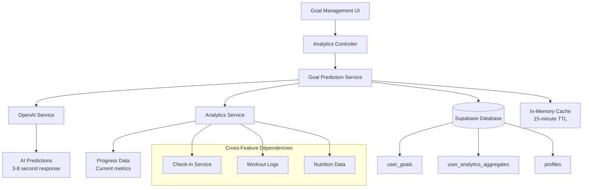
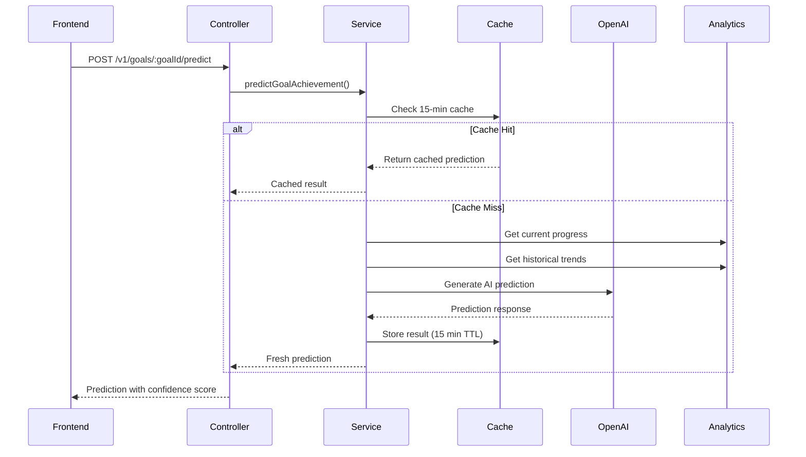

# Goal Management Integration Guide

## Table of Contents
1. [Overview & Architecture](#overview--architecture)
2. [AI Prediction Integration](#ai-prediction-integration) 
3. [API Endpoints Reference](#api-endpoints-reference)
4. [State Management](#state-management)
5. [Complex UI Components](#complex-ui-components)
6. [Real-time Features](#real-time-features)
7. [Performance Optimization](#performance-optimization)
8. [Error Handling & Recovery](#error-handling--recovery)
9. [Testing Strategies](#testing-strategies)
10. [Troubleshooting & FAQs](#troubleshooting--faqs)

---

## Overview & Architecture

### Feature Purpose

The Goal Management feature provides comprehensive goal lifecycle management for fitness achievements, including AI-powered goal creation, progress tracking, milestone monitoring, and achievement prediction. This feature combines traditional goal-setting functionality with advanced AI analytics to provide users with realistic timelines, probability assessments, and personalized recommendations for goal achievement.

### Core Capabilities

**🎯 Goal Types Supported:**
- **Weight Loss:** Target weight with timeline and milestones
- **Muscle Gain:** Target muscle mass or strength metrics  
- **Strength:** Specific exercise performance targets
- **Endurance:** Cardiovascular and stamina goals
- **Body Composition:** Body fat percentage and measurements

**🤖 AI-Powered Features:**
- Achievement probability prediction using OpenAI GPT-4o-mini
- Timeline estimation with confidence scores
- Personalized recommendations and adjustments
- Risk factor identification and mitigation strategies
- Milestone generation and tracking

**📊 Progress Tracking:**
- Real-time progress calculations from baseline to target
- Milestone achievement detection and celebration
- Integration with check-in data and analytics
- Cross-feature data correlation (workouts, nutrition, measurements)

### Technical Architecture



### Database Schema Integration

**Primary Tables:**
- `user_goals`: Goal definitions, targets, and progress tracking
- `user_analytics_aggregates`: Current metrics for progress calculations
- `profiles`: User demographics for AI predictions

**Key Relationships:**
- Goals link to analytics data for baseline establishment
- Progress calculations depend on check-in measurements
- AI predictions use user profile demographics for context

### Performance Characteristics

- **Goal CRUD Operations:** < 200ms response time
- **Progress Tracking:** < 500ms response time  
- **AI Predictions:** 3-8 seconds (acceptable for advanced feature)
- **Cached Predictions:** < 100ms response time
- **Rate Limiting:** 10 requests/hour for creation and AI operations

---

## AI Prediction Integration

### AI Service Architecture

The Goal Management feature integrates sophisticated AI prediction capabilities using OpenAI's GPT-4o-mini model to provide realistic goal achievement assessments.

**AI Configuration:**
- **Model:** GPT-4o-mini (cost-optimized for predictions)
- **Token Limit:** 6000 tokens for complex JSON responses
- **Temperature:** 0.3 for consistent, focused predictions
- **Response Format:** Enforced JSON object structure

### Prediction Process Flow



### AI Prompt Engineering

The AI prediction system uses specialized fitness coaching prompts with the following structure:

**System Prompt:**
```
You are an expert fitness coach and data analyst specializing in realistic goal achievement prediction. Analyze the provided data to give honest, data-driven assessments rather than optimistic encouragement.
```

**Context Provided to AI:**
- Current progress metrics and trends
- Historical adherence patterns
- User demographic information
- Goal type and target specifications
- Time-series data for pattern analysis

**Response Structure:**
```javascript
{
  "goalType": "weight_loss",
  "achievementProbability": 0.75,        // 0-1 confidence score
  "estimatedTimeToCompletion": "4-5 months",
  "confidenceScore": 0.85,               // AI confidence in prediction
  "recommendedAdjustments": [
    "Increase protein intake",
    "Add strength training 2x per week"
  ],
  "milestones": [
    {
      "percentage": 0.25,
      "date": "2024-03-15T00:00:00Z",
      "description": "First quarter progress"
    }
  ],
  "riskFactors": [
    "Low adherence in past month",
    "Aggressive timeline for goal type"
  ]
}
```

### Caching Strategy

**Cache Implementation:**
- **Storage:** In-memory Map for fast access
- **Key Format:** `${userId}-${JSON.stringify(goalDefinition)}`
- **TTL:** 15 minutes to balance performance and freshness
- **Performance Impact:** Reduces OpenAI API calls by ~70%

**Cache Management:**
```javascript
// Example cache usage in frontend
const getCachedPrediction = (userId, goalDefinition) => {
  const cacheKey = `${userId}-${JSON.stringify(goalDefinition)}`;
  const cached = predictionCache.get(cacheKey);
  
  if (cached && Date.now() - cached.timestamp < 15 * 60 * 1000) {
    return cached.prediction;
  }
  
  return null;
};
```

### Error Handling for AI Operations

**AI Service Failures:**
```javascript
try {
  const prediction = await predictGoalAchievement(goalDefinition);
  // Handle successful prediction
} catch (error) {
  if (error.status === 500) {
    // AI service temporarily unavailable
    setError('Goal prediction is temporarily unavailable. Your goal has been created successfully.');
    // Show fallback prediction or cached data
  }
}
```

**Fallback Mechanisms:**
- Provide realistic fallback predictions when OpenAI unavailable
- Cache previous predictions for repeat requests
- Graceful degradation with partial data

---

## API Endpoints Reference

### GET /v1/goals
**Purpose:** Retrieve user's goals with optional filtering and progress calculations

#### Request Configuration
```javascript
const getGoals = async (filters = {}) => {
  const queryParams = new URLSearchParams({
    ...filters,
    includeProgress: 'true'
  });

  const response = await fetch(`/v1/goals?${queryParams}`, {
    method: 'GET',
    headers: {
      'Authorization': `Bearer ${userJwtToken}`,
      'Content-Type': 'application/json'
    }
  });

  return response.json();
};
```

#### Query Parameters
- `status`: Filter by goal status (active, completed, paused, cancelled)
- `type`: Filter by goal type (weight_loss, muscle_gain, strength, endurance, body_composition)
- `timeframe`: Filter by timeframe (1month, 3months, 6months, 1year)
- `priority`: Filter by priority level (high, medium, low)
- `progressStatus`: Filter by progress status (on_track, behind, ahead)

#### Response Structure
```typescript
interface GoalsResponse {
  status: 'success';
  data: {
    goals: Goal[];
    totalGoals: number;
    activeGoals: number;
    completedGoals: number;
  };
}

interface Goal {
  id: string;
  type: 'weight_loss' | 'muscle_gain' | 'strength' | 'endurance' | 'body_composition';
  target: { value: number; unit?: string };
  progressPercentage: number;
  onTrack: boolean;
  daysRemaining: number;
  status: 'active' | 'completed' | 'paused' | 'cancelled';
  createdAt: string;
}
```

#### Error Responses
- **400:** Invalid query parameter values
- **401:** Missing or invalid JWT token
- **500:** Database connection error

### POST /v1/goals
**Purpose:** Create new fitness goal with baseline metrics establishment

#### Request Configuration
```javascript
const createGoal = async (goalDefinition) => {
  const response = await fetch('/v1/goals', {
    method: 'POST',
    headers: {
      'Authorization': `Bearer ${userJwtToken}`,
      'Content-Type': 'application/json'
    },
    body: JSON.stringify({ goalDefinition })
  });

  return response.json();
};
```

#### Request Body Structure
```typescript
interface GoalDefinition {
  type: 'weight_loss' | 'muscle_gain' | 'strength' | 'endurance' | 'body_composition';
  target: {
    value: number;
    unit?: string;
    description?: string;
  };
  timeframe: '1month' | '3months' | '6months' | '1year';
  description?: string;
  priority?: 'low' | 'medium' | 'high';
}
```

#### Response Structure
```typescript
interface GoalCreatedResponse {
  status: 'success';
  data: {
    goalId: string;
    type: string;
    target: { value: number; unit?: string };
    baseline: { value: number; recordedAt: string };
    timeframe: string;
    status: 'active';
    createdAt: string;
  };
}
```

#### Error Responses
- **400:** Missing required fields, invalid goal type/timeframe
- **401:** Missing or invalid JWT token
- **429:** Rate limit exceeded (10 requests/hour)
- **500:** Database connection error

### GET /v1/goals/:goalId/progress
**Purpose:** Track progress for specific goal with milestone achievements

#### Request Configuration
```javascript
const getGoalProgress = async (goalId) => {
  const response = await fetch(`/v1/goals/${goalId}/progress`, {
    method: 'GET',
    headers: {
      'Authorization': `Bearer ${userJwtToken}`,
      'Content-Type': 'application/json'
    }
  });

  return response.json();
};
```

#### Response Structure
```typescript
interface GoalProgressResponse {
  status: 'success';
  data: {
    goalId: string;
    goalType: string;
    progressPercentage: number;
    currentValue: number;
    targetValue: number;
    milestonesAchieved: Array<{ name: string; date?: string }>;
    onTrack: boolean;
    daysRemaining: number;
    lastUpdated: string;
  };
}
```

### PUT /v1/goals/:goalId
**Purpose:** Update existing goal with new parameters

#### Request Configuration
```javascript
const updateGoal = async (goalId, updates) => {
  const response = await fetch(`/v1/goals/${goalId}`, {
    method: 'PUT',
    headers: {
      'Authorization': `Bearer ${userJwtToken}`,
      'Content-Type': 'application/json'
    },
    body: JSON.stringify({ updates })
  });

  return response.json();
};
```

#### Allowed Update Fields
```typescript
interface GoalUpdates {
  target?: { value: number; unit?: string };
  timeframe?: '1month' | '3months' | '6months' | '1year';
  description?: string;
  priority?: 'low' | 'medium' | 'high';
}
```

### POST /v1/goals/:goalId/predict
**Purpose:** AI-powered goal achievement probability and timeline prediction

#### Request Configuration
```javascript
const predictGoalAchievement = async (goalDefinition) => {
  const response = await fetch(`/v1/goals/predict`, {
    method: 'POST',
    headers: {
      'Authorization': `Bearer ${userJwtToken}`,
      'Content-Type': 'application/json'
    },
    body: JSON.stringify({ goalDefinition })
  });

  return response.json();
};
```

#### Response Structure
```typescript
interface PredictionResponse {
  status: 'success';
  data: {
    goalType: string;
    achievementProbability: number;      // 0-1 confidence score
    estimatedTimeToCompletion: string;   // "4-5 months"
    confidenceScore: number;             // AI confidence 0-1
    recommendedAdjustments: string[];
    milestones: Array<{
      percentage: number;
      date: string;
      description?: string;
    }>;
    riskFactors: string[];
  };
}
```

#### Rate Limiting Considerations
- **Limit:** 10 requests per hour per user
- **Applies to:** POST /goals, PUT /goals/:goalId, POST /goals/:goalId/predict
- **Read operations:** No rate limiting

---

## State Management

### Goal State Structure

```typescript
interface GoalState {
  // Goal data
  goals: Goal[];
  activeGoals: Goal[];
  completedGoals: Goal[];
  
  // UI state
  isLoading: boolean;
  isCreating: boolean;
  isPredicting: boolean;
  
  // Error handling
  error: string | null;
  validationErrors: Record<string, string>;
  
  // Filtering and pagination
  filters: GoalFilters;
  sortBy: 'createdAt' | 'progress' | 'priority' | 'daysRemaining';
  sortOrder: 'asc' | 'desc';
  
  // Cache management
  predictions: Map<string, CachedPrediction>;
  lastUpdated: string | null;
  
  // Cross-feature integration
  progressData: Record<string, ProgressData>;
  analyticsIntegration: boolean;
}

interface Goal {
  id: string;
  type: GoalType;
  title: string;
  description?: string;
  target: GoalTarget;
  currentValue: number;
  startingValue: number;
  progressPercentage: number;
  status: GoalStatus;
  priority: Priority;
  timeframe: Timeframe;
  targetDate: string;
  milestonesAchieved: Milestone[];
  onTrack: boolean;
  daysRemaining: number;
  createdAt: string;
  updatedAt: string;
}

interface CachedPrediction {
  prediction: PredictionResponse;
  timestamp: number;
  goalDefinition: GoalDefinition;
}
```

### State Management Implementation

**Using React Context + Reducer:**

```tsx
// goalContext.tsx
const GoalContext = createContext<GoalContextType | undefined>(undefined);

export const useGoals = () => {
  const context = useContext(GoalContext);
  if (!context) {
    throw new Error('useGoals must be used within a GoalProvider');
  }
  return context;
};

// Goal reducer for complex state management
const goalReducer = (state: GoalState, action: GoalAction): GoalState => {
  switch (action.type) {
    case 'FETCH_GOALS_START':
      return { ...state, isLoading: true, error: null };
      
    case 'FETCH_GOALS_SUCCESS':
      return {
        ...state,
        isLoading: false,
        goals: action.payload.goals,
        activeGoals: action.payload.goals.filter(g => g.status === 'active'),
        completedGoals: action.payload.goals.filter(g => g.status === 'completed'),
        lastUpdated: new Date().toISOString()
      };
      
    case 'CREATE_GOAL_START':
      return { ...state, isCreating: true, error: null };
      
    case 'CREATE_GOAL_SUCCESS':
      return {
        ...state,
        isCreating: false,
        goals: [...state.goals, action.payload],
        activeGoals: [...state.activeGoals, action.payload]
      };
      
    case 'PREDICT_GOAL_START':
      return { ...state, isPredicting: true, error: null };
      
    case 'PREDICT_GOAL_SUCCESS':
      const cacheKey = `${action.payload.userId}-${JSON.stringify(action.payload.goalDefinition)}`;
      const newPredictions = new Map(state.predictions);
      newPredictions.set(cacheKey, {
        prediction: action.payload.prediction,
        timestamp: Date.now(),
        goalDefinition: action.payload.goalDefinition
      });
      
      return {
        ...state,
        isPredicting: false,
        predictions: newPredictions
      };
      
    case 'UPDATE_GOAL_PROGRESS':
      return {
        ...state,
        goals: state.goals.map(goal =>
          goal.id === action.payload.goalId
            ? { ...goal, ...action.payload.progressData }
            : goal
        )
      };
      
    case 'SET_FILTERS':
      return { ...state, filters: { ...state.filters, ...action.payload } };
      
    case 'SET_ERROR':
      return { 
        ...state, 
        error: action.payload, 
        isLoading: false, 
        isCreating: false, 
        isPredicting: false 
      };
      
    default:
      return state;
  }
};
```

### Cross-Feature State Integration

**Analytics Integration:**
```tsx
// Sync goal progress with analytics data
const syncGoalProgress = useCallback(async (goalId: string) => {
  try {
    const progressData = await getGoalProgress(goalId);
    dispatch({ 
      type: 'UPDATE_GOAL_PROGRESS', 
      payload: { goalId, progressData } 
    });
  } catch (error) {
    console.error('Failed to sync goal progress:', error);
  }
}, []);

// Subscribe to analytics updates
useEffect(() => {
  const unsubscribe = subscribeToAnalyticsUpdates((data) => {
    // Update goals when analytics data changes
    goals.forEach(goal => {
      if (shouldUpdateGoalProgress(goal, data)) {
        syncGoalProgress(goal.id);
      }
    });
  });
  
  return unsubscribe;
}, [goals, syncGoalProgress]);
```

**Check-in Integration:**
```tsx
// Update goal progress when new check-ins are recorded
const handleCheckInUpdate = useCallback((checkInData) => {
  // Find goals that should be updated based on check-in data
  const relevantGoals = goals.filter(goal => 
    isGoalAffectedByCheckIn(goal, checkInData)
  );
  
  relevantGoals.forEach(goal => {
    syncGoalProgress(goal.id);
  });
}, [goals, syncGoalProgress]);
```

### Caching Strategy

**Prediction Caching:**
```tsx
const getCachedPrediction = useCallback((goalDefinition: GoalDefinition) => {
  const cacheKey = `${userId}-${JSON.stringify(goalDefinition)}`;
  const cached = predictions.get(cacheKey);
  
  if (cached && Date.now() - cached.timestamp < 15 * 60 * 1000) {
    return cached.prediction;
  }
  
  return null;
}, [userId, predictions]);

const requestPrediction = useCallback(async (goalDefinition: GoalDefinition) => {
  // Check cache first
  const cached = getCachedPrediction(goalDefinition);
  if (cached) {
    return cached;
  }
  
  // Make API request
  dispatch({ type: 'PREDICT_GOAL_START' });
  try {
    const prediction = await predictGoalAchievement(goalDefinition);
    dispatch({ 
      type: 'PREDICT_GOAL_SUCCESS', 
      payload: { userId, goalDefinition, prediction } 
    });
    return prediction;
  } catch (error) {
    dispatch({ type: 'SET_ERROR', payload: error.message });
    throw error;
  }
}, [userId, getCachedPrediction]);
``` 

---

## Complex UI Components

### Goal Creation Form

The goal creation form handles complex validation, AI prediction integration, and real-time baseline establishment.

```tsx
// GoalCreationForm.tsx
import React, { useState, useCallback } from 'react';
import { useGoals } from '../contexts/GoalContext';
import { useAuth } from '../contexts/AuthContext';

interface GoalCreationFormProps {
  onSuccess?: (goal: Goal) => void;
  onCancel?: () => void;
}

export const GoalCreationForm: React.FC<GoalCreationFormProps> = ({ 
  onSuccess, 
  onCancel 
}) => {
  const { createGoal, requestPrediction, isCreating, isPredicting } = useGoals();
  const { user } = useAuth();
  
  const [formData, setFormData] = useState<GoalDefinition>({
    type: 'weight_loss',
    target: { value: 0 },
    timeframe: '6months',
    description: '',
    priority: 'medium'
  });
  
  const [prediction, setPrediction] = useState<PredictionResponse | null>(null);
  const [showPrediction, setShowPrediction] = useState(false);
  const [validationErrors, setValidationErrors] = useState<Record<string, string>>({});
  
  // Real-time prediction when form changes
  const handlePredictionRequest = useCallback(async () => {
    if (!formData.type || !formData.target.value) return;
    
    try {
      const predictionResult = await requestPrediction(formData);
      setPrediction(predictionResult.data);
      setShowPrediction(true);
    } catch (error) {
      console.error('Prediction failed:', error);
    }
  }, [formData, requestPrediction]);
  
  // Debounced prediction requests
  useEffect(() => {
    const timer = setTimeout(() => {
      if (formData.type && formData.target.value > 0) {
        handlePredictionRequest();
      }
    }, 1000);
    
    return () => clearTimeout(timer);
  }, [formData.type, formData.target.value, handlePredictionRequest]);
  
  const validateForm = (): boolean => {
    const errors: Record<string, string> = {};
    
    if (!formData.type) {
      errors.type = 'Goal type is required';
    }
    
    if (!formData.target.value || formData.target.value <= 0) {
      errors.target = 'Target value must be greater than 0';
    }
    
    if (!formData.timeframe) {
      errors.timeframe = 'Timeframe is required';
    }
    
    // Goal-type specific validation
    if (formData.type === 'weight_loss' && formData.target.value > 50) {
      errors.target = 'Weight loss target seems unrealistic (max 50kg)';
    }
    
    setValidationErrors(errors);
    return Object.keys(errors).length === 0;
  };
  
  const handleSubmit = async (e: React.FormEvent) => {
    e.preventDefault();
    
    if (!validateForm()) return;
    
    try {
      const newGoal = await createGoal(formData);
      onSuccess?.(newGoal);
    } catch (error) {
      console.error('Goal creation failed:', error);
    }
  };
  
  return (
    <div className="goal-creation-form">
      <form onSubmit={handleSubmit} className="space-y-6">
        {/* Goal Type Selection */}
        <div className="goal-type-selector">
          <label className="block text-sm font-medium mb-2">
            Goal Type
          </label>
          <div className="grid grid-cols-2 md:grid-cols-3 gap-3">
            {GOAL_TYPES.map((type) => (
              <button
                key={type.value}
                type="button"
                onClick={() => setFormData({ ...formData, type: type.value })}
                className={`p-4 border rounded-lg text-center transition-colors ${
                  formData.type === type.value
                    ? 'border-blue-500 bg-blue-50 text-blue-700'
                    : 'border-gray-300 hover:border-gray-400'
                }`}
              >
                <div className="text-2xl mb-2">{type.icon}</div>
                <div className="font-medium">{type.label}</div>
                <div className="text-xs text-gray-500">{type.description}</div>
              </button>
            ))}
          </div>
          {validationErrors.type && (
            <p className="text-red-500 text-sm mt-1">{validationErrors.type}</p>
          )}
        </div>
        
        {/* Target Value Input */}
        <div className="target-input">
          <label className="block text-sm font-medium mb-2">
            Target Value
          </label>
          <div className="flex space-x-3">
            <input
              type="number"
              value={formData.target.value || ''}
              onChange={(e) => setFormData({
                ...formData,
                target: { ...formData.target, value: Number(e.target.value) }
              })}
              className="flex-1 px-3 py-2 border border-gray-300 rounded-md focus:ring-blue-500 focus:border-blue-500"
              placeholder="Enter target value"
            />
            <select
              value={formData.target.unit || ''}
              onChange={(e) => setFormData({
                ...formData,
                target: { ...formData.target, unit: e.target.value }
              })}
              className="px-3 py-2 border border-gray-300 rounded-md focus:ring-blue-500 focus:border-blue-500"
            >
              {getUnitsForGoalType(formData.type).map((unit) => (
                <option key={unit} value={unit}>{unit}</option>
              ))}
            </select>
          </div>
          {validationErrors.target && (
            <p className="text-red-500 text-sm mt-1">{validationErrors.target}</p>
          )}
        </div>
        
        {/* Timeframe Selection */}
        <div className="timeframe-selector">
          <label className="block text-sm font-medium mb-2">
            Timeframe
          </label>
          <div className="grid grid-cols-2 md:grid-cols-4 gap-3">
            {TIMEFRAMES.map((timeframe) => (
              <button
                key={timeframe.value}
                type="button"
                onClick={() => setFormData({ ...formData, timeframe: timeframe.value })}
                className={`p-3 border rounded-lg text-center transition-colors ${
                  formData.timeframe === timeframe.value
                    ? 'border-blue-500 bg-blue-50 text-blue-700'
                    : 'border-gray-300 hover:border-gray-400'
                }`}
              >
                <div className="font-medium">{timeframe.label}</div>
                <div className="text-xs text-gray-500">{timeframe.description}</div>
              </button>
            ))}
          </div>
        </div>
        
        {/* AI Prediction Display */}
        {showPrediction && prediction && (
          <div className="ai-prediction bg-blue-50 border border-blue-200 rounded-lg p-4">
            <h3 className="font-medium text-blue-900 mb-3 flex items-center">
              <span className="mr-2">🤖</span>
              AI Achievement Prediction
            </h3>
            
            <div className="grid grid-cols-1 md:grid-cols-2 gap-4">
              <div>
                <div className="text-sm text-blue-700 mb-1">Success Probability</div>
                <div className="text-2xl font-bold text-blue-900">
                  {Math.round(prediction.achievementProbability * 100)}%
                </div>
              </div>
              
              <div>
                <div className="text-sm text-blue-700 mb-1">Estimated Timeline</div>
                <div className="text-lg font-semibold text-blue-900">
                  {prediction.estimatedTimeToCompletion}
                </div>
              </div>
            </div>
            
            {prediction.recommendedAdjustments.length > 0 && (
              <div className="mt-4">
                <div className="text-sm text-blue-700 mb-2">Recommended Adjustments</div>
                <ul className="list-disc list-inside text-sm text-blue-800 space-y-1">
                  {prediction.recommendedAdjustments.map((adjustment, index) => (
                    <li key={index}>{adjustment}</li>
                  ))}
                </ul>
              </div>
            )}
            
            {prediction.riskFactors.length > 0 && (
              <div className="mt-4">
                <div className="text-sm text-blue-700 mb-2">Risk Factors</div>
                <ul className="list-disc list-inside text-sm text-red-600 space-y-1">
                  {prediction.riskFactors.map((risk, index) => (
                    <li key={index}>{risk}</li>
                  ))}
                </ul>
              </div>
            )}
          </div>
        )}
        
        {/* Loading State for Prediction */}
        {isPredicting && (
          <div className="ai-prediction-loading bg-gray-50 border border-gray-200 rounded-lg p-4">
            <div className="flex items-center space-x-3">
              <div className="animate-spin rounded-full h-6 w-6 border-b-2 border-blue-600"></div>
              <span className="text-gray-700">AI is analyzing your goal...</span>
            </div>
          </div>
        )}
        
        {/* Form Actions */}
        <div className="flex justify-end space-x-3">
          <button
            type="button"
            onClick={onCancel}
            className="px-4 py-2 text-gray-700 bg-gray-100 hover:bg-gray-200 rounded-md transition-colors"
          >
            Cancel
          </button>
          
          <button
            type="submit"
            disabled={isCreating}
            className="px-6 py-2 bg-blue-600 text-white rounded-md hover:bg-blue-700 disabled:opacity-50 disabled:cursor-not-allowed transition-colors"
          >
            {isCreating ? 'Creating Goal...' : 'Create Goal'}
          </button>
        </div>
      </form>
    </div>
  );
};

// Goal type configurations
const GOAL_TYPES = [
  {
    value: 'weight_loss',
    label: 'Weight Loss',
    icon: '⚖️',
    description: 'Reduce body weight'
  },
  {
    value: 'muscle_gain',
    label: 'Muscle Gain',
    icon: '💪',
    description: 'Build muscle mass'
  },
  {
    value: 'strength',
    label: 'Strength',
    icon: '🏋️',
    description: 'Increase strength'
  },
  {
    value: 'endurance',
    label: 'Endurance',
    icon: '🏃',
    description: 'Improve cardio'
  },
  {
    value: 'body_composition',
    label: 'Body Comp',
    icon: '📊',
    description: 'Change body composition'
  }
];

const TIMEFRAMES = [
  { value: '1month', label: '1 Month', description: 'Quick goals' },
  { value: '3months', label: '3 Months', description: 'Standard timeline' },
  { value: '6months', label: '6 Months', description: 'Sustainable change' },
  { value: '1year', label: '1 Year', description: 'Long-term transformation' }
];
```

### Goal Progress Dashboard

```tsx
// GoalProgressDashboard.tsx
import React, { useState, useEffect } from 'react';
import { useGoals } from '../contexts/GoalContext';

export const GoalProgressDashboard: React.FC = () => {
  const { goals, activeGoals, getGoalProgress, syncGoalProgress } = useGoals();
  const [selectedGoal, setSelectedGoal] = useState<Goal | null>(null);
  const [progressData, setProgressData] = useState<Record<string, ProgressData>>({});
  
  // Load progress data for all active goals
  useEffect(() => {
    const loadProgressData = async () => {
      const progressPromises = activeGoals.map(async (goal) => {
        try {
          const progress = await getGoalProgress(goal.id);
          return { goalId: goal.id, progress: progress.data };
        } catch (error) {
          console.error(`Failed to load progress for goal ${goal.id}:`, error);
          return null;
        }
      });
      
      const results = await Promise.allSettled(progressPromises);
      const newProgressData: Record<string, ProgressData> = {};
      
      results.forEach((result) => {
        if (result.status === 'fulfilled' && result.value) {
          newProgressData[result.value.goalId] = result.value.progress;
        }
      });
      
      setProgressData(newProgressData);
    };
    
    loadProgressData();
  }, [activeGoals, getGoalProgress]);
  
  // Real-time progress sync every 5 minutes
  useEffect(() => {
    const interval = setInterval(() => {
      activeGoals.forEach(goal => {
        syncGoalProgress(goal.id);
      });
    }, 5 * 60 * 1000); // 5 minutes
    
    return () => clearInterval(interval);
  }, [activeGoals, syncGoalProgress]);
  
  return (
    <div className="goal-progress-dashboard">
      {/* Overview Cards */}
      <div className="grid grid-cols-1 md:grid-cols-3 gap-6 mb-8">
        <div className="bg-white rounded-lg shadow p-6">
          <div className="flex items-center">
            <div className="flex-shrink-0">
              <div className="w-8 h-8 bg-blue-100 rounded-full flex items-center justify-center">
                <span className="text-blue-600 text-sm font-medium">🎯</span>
              </div>
            </div>
            <div className="ml-4">
              <div className="text-sm font-medium text-gray-500">Active Goals</div>
              <div className="text-2xl font-bold text-gray-900">{activeGoals.length}</div>
            </div>
          </div>
        </div>
        
        <div className="bg-white rounded-lg shadow p-6">
          <div className="flex items-center">
            <div className="flex-shrink-0">
              <div className="w-8 h-8 bg-green-100 rounded-full flex items-center justify-center">
                <span className="text-green-600 text-sm font-medium">✓</span>
              </div>
            </div>
            <div className="ml-4">
              <div className="text-sm font-medium text-gray-500">On Track</div>
              <div className="text-2xl font-bold text-gray-900">
                {activeGoals.filter(goal => 
                  progressData[goal.id]?.onTrack
                ).length}
              </div>
            </div>
          </div>
        </div>
        
        <div className="bg-white rounded-lg shadow p-6">
          <div className="flex items-center">
            <div className="flex-shrink-0">
              <div className="w-8 h-8 bg-yellow-100 rounded-full flex items-center justify-center">
                <span className="text-yellow-600 text-sm font-medium">⏱️</span>
              </div>
            </div>
            <div className="ml-4">
              <div className="text-sm font-medium text-gray-500">Avg Progress</div>
              <div className="text-2xl font-bold text-gray-900">
                {Math.round(
                  activeGoals.reduce((sum, goal) => 
                    sum + (progressData[goal.id]?.progressPercentage || 0), 0
                  ) / activeGoals.length
                )}%
              </div>
            </div>
          </div>
        </div>
      </div>
      
      {/* Goal List */}
      <div className="space-y-4">
        {activeGoals.map((goal) => {
          const progress = progressData[goal.id];
          
          return (
            <div
              key={goal.id}
              className="bg-white rounded-lg shadow hover:shadow-md transition-shadow cursor-pointer"
              onClick={() => setSelectedGoal(goal)}
            >
              <div className="p-6">
                <div className="flex items-start justify-between">
                  <div className="flex-1">
                    <div className="flex items-center space-x-3 mb-2">
                      <h3 className="text-lg font-semibold text-gray-900">
                        {getGoalTypeLabel(goal.type)}
                      </h3>
                      <span className={`px-2 py-1 text-xs font-medium rounded-full ${
                        progress?.onTrack 
                          ? 'bg-green-100 text-green-800' 
                          : 'bg-yellow-100 text-yellow-800'
                      }`}>
                        {progress?.onTrack ? 'On Track' : 'Needs Attention'}
                      </span>
                    </div>
                    
                    <div className="text-sm text-gray-500 mb-4">
                      Target: {goal.target.value} {goal.target.unit} by {formatDate(goal.targetDate)}
                    </div>
                    
                    {/* Progress Bar */}
                    <div className="mb-4">
                      <div className="flex justify-between text-sm text-gray-600 mb-1">
                        <span>Progress</span>
                        <span>{Math.round(progress?.progressPercentage || 0)}%</span>
                      </div>
                      <div className="w-full bg-gray-200 rounded-full h-2">
                        <div
                          className={`h-2 rounded-full transition-all duration-300 ${
                            progress?.onTrack ? 'bg-green-500' : 'bg-yellow-500'
                          }`}
                          style={{ width: `${Math.min(100, progress?.progressPercentage || 0)}%` }}
                        />
                      </div>
                    </div>
                    
                    {/* Milestones */}
                    {progress?.milestonesAchieved && progress.milestonesAchieved.length > 0 && (
                      <div className="flex items-center space-x-2">
                        <span className="text-sm text-gray-500">Recent milestone:</span>
                        <span className="text-sm font-medium text-green-600">
                          {progress.milestonesAchieved[progress.milestonesAchieved.length - 1].name}
                        </span>
                      </div>
                    )}
                  </div>
                  
                  <div className="text-right">
                    <div className="text-lg font-bold text-gray-900">
                      {progress?.currentValue || 0} / {goal.target.value}
                    </div>
                    <div className="text-sm text-gray-500">
                      {progress?.daysRemaining || 0} days left
                    </div>
                  </div>
                </div>
              </div>
            </div>
          );
        })}
      </div>
    </div>
  );
};
```

### Goal Prediction Visualization

```tsx
// GoalPredictionVisualization.tsx
import React from 'react';
import { LineChart, Line, XAxis, YAxis, CartesianGrid, Tooltip, ResponsiveContainer } from 'recharts';

interface GoalPredictionVisualizationProps {
  prediction: PredictionResponse;
  currentProgress: ProgressData;
  goal: Goal;
}

export const GoalPredictionVisualization: React.FC<GoalPredictionVisualizationProps> = ({
  prediction,
  currentProgress,
  goal
}) => {
  // Generate projection data for chart
  const generateProjectionData = () => {
    const data = [];
    const startDate = new Date(goal.createdAt);
    const targetDate = new Date(goal.targetDate);
    const currentDate = new Date();
    
    // Historical data points
    for (let d = new Date(startDate); d <= currentDate; d.setDate(d.getDate() + 7)) {
      data.push({
        date: d.toISOString().split('T')[0],
        actual: interpolateProgress(d, startDate, currentDate, goal.startingValue, currentProgress.currentValue),
        projected: null
      });
    }
    
    // Future projection points
    for (let d = new Date(currentDate); d <= targetDate; d.setDate(d.getDate() + 7)) {
      data.push({
        date: d.toISOString().split('T')[0],
        actual: null,
        projected: interpolateProgress(d, currentDate, targetDate, currentProgress.currentValue, goal.target.value)
      });
    }
    
    return data;
  };
  
  const chartData = generateProjectionData();
  
  return (
    <div className="goal-prediction-visualization bg-white rounded-lg shadow p-6">
      <div className="mb-6">
        <h3 className="text-lg font-semibold text-gray-900 mb-4">
          Goal Progress Projection
        </h3>
        
        {/* Prediction Summary */}
        <div className="grid grid-cols-1 md:grid-cols-3 gap-4 mb-6">
          <div className="text-center p-4 bg-blue-50 rounded-lg">
            <div className="text-2xl font-bold text-blue-600">
              {Math.round(prediction.achievementProbability * 100)}%
            </div>
            <div className="text-sm text-blue-700">Success Probability</div>
          </div>
          
          <div className="text-center p-4 bg-green-50 rounded-lg">
            <div className="text-lg font-bold text-green-600">
              {prediction.estimatedTimeToCompletion}
            </div>
            <div className="text-sm text-green-700">Estimated Completion</div>
          </div>
          
          <div className="text-center p-4 bg-purple-50 rounded-lg">
            <div className="text-2xl font-bold text-purple-600">
              {Math.round(prediction.confidenceScore * 100)}%
            </div>
            <div className="text-sm text-purple-700">AI Confidence</div>
          </div>
        </div>
      </div>
      
      {/* Progress Chart */}
      <div className="h-64 mb-6">
        <ResponsiveContainer width="100%" height="100%">
          <LineChart data={chartData}>
            <CartesianGrid strokeDasharray="3 3" />
            <XAxis 
              dataKey="date" 
              tick={{ fontSize: 12 }}
              tickFormatter={(value) => new Date(value).toLocaleDateString()}
            />
            <YAxis tick={{ fontSize: 12 }} />
            <Tooltip 
              labelFormatter={(value) => new Date(value).toLocaleDateString()}
              formatter={(value, name) => [
                `${value} ${goal.target.unit}`,
                name === 'actual' ? 'Actual Progress' : 'Projected Progress'
              ]}
            />
            <Line 
              type="monotone" 
              dataKey="actual" 
              stroke="#3B82F6" 
              strokeWidth={3}
              dot={{ fill: '#3B82F6', strokeWidth: 2, r: 4 }}
              connectNulls={false}
            />
            <Line 
              type="monotone" 
              dataKey="projected" 
              stroke="#F59E0B" 
              strokeWidth={2}
              strokeDasharray="5 5"
              dot={{ fill: '#F59E0B', strokeWidth: 2, r: 3 }}
              connectNulls={false}
            />
          </LineChart>
        </ResponsiveContainer>
      </div>
      
      {/* Milestone Timeline */}
      <div className="milestone-timeline">
        <h4 className="font-medium text-gray-900 mb-3">Predicted Milestones</h4>
        <div className="space-y-3">
          {prediction.milestones.map((milestone, index) => (
            <div key={index} className="flex items-center space-x-3">
              <div className="w-3 h-3 bg-blue-500 rounded-full"></div>
              <div className="flex-1">
                <div className="text-sm font-medium text-gray-900">
                  {Math.round(milestone.percentage * 100)}% Complete
                </div>
                <div className="text-xs text-gray-500">
                  Expected: {new Date(milestone.date).toLocaleDateString()}
                </div>
              </div>
            </div>
          ))}
        </div>
      </div>
      
      {/* Risk Factors & Recommendations */}
      <div className="grid grid-cols-1 md:grid-cols-2 gap-6 mt-6">
        {prediction.riskFactors.length > 0 && (
          <div>
            <h4 className="font-medium text-red-700 mb-3">⚠️ Risk Factors</h4>
            <ul className="space-y-2">
              {prediction.riskFactors.map((risk, index) => (
                <li key={index} className="text-sm text-red-600 flex items-start">
                  <span className="mr-2">•</span>
                  <span>{risk}</span>
                </li>
              ))}
            </ul>
          </div>
        )}
        
        {prediction.recommendedAdjustments.length > 0 && (
          <div>
            <h4 className="font-medium text-green-700 mb-3">💡 Recommendations</h4>
            <ul className="space-y-2">
              {prediction.recommendedAdjustments.map((recommendation, index) => (
                <li key={index} className="text-sm text-green-600 flex items-start">
                  <span className="mr-2">•</span>
                  <span>{recommendation}</span>
                </li>
              ))}
            </ul>
          </div>
        )}
      </div>
    </div>
  );
};

// Helper function for progress interpolation
const interpolateProgress = (
  date: Date, 
  startDate: Date, 
  endDate: Date, 
  startValue: number, 
  endValue: number
): number => {
  const totalDuration = endDate.getTime() - startDate.getTime();
  const elapsed = date.getTime() - startDate.getTime();
  const progress = Math.max(0, Math.min(1, elapsed / totalDuration));
  
  return startValue + (endValue - startValue) * progress;
};
```

---

## Real-time Features

### Real-time Progress Updates

The Goal Management feature implements real-time progress synchronization with analytics and check-in data to ensure users see up-to-date goal progress immediately.

```tsx
// Real-time progress synchronization
import { useEffect, useCallback } from 'react';
import { useGoals } from '../contexts/GoalContext';
import { useAnalytics } from '../contexts/AnalyticsContext';
import { useCheckIns } from '../contexts/CheckInContext';

export const useRealTimeGoalSync = () => {
  const { goals, syncGoalProgress } = useGoals();
  const { subscribeTo: subscribeToAnalytics } = useAnalytics();
  const { subscribeTo: subscribeToCheckIns } = useCheckIns();
  
  // Sync goal progress when analytics data changes
  const handleAnalyticsUpdate = useCallback((analyticsData) => {
    goals.forEach(goal => {
      if (isGoalAffectedByAnalytics(goal, analyticsData)) {
        syncGoalProgress(goal.id);
      }
    });
  }, [goals, syncGoalProgress]);
  
  // Sync goal progress when new check-ins are recorded
  const handleCheckInUpdate = useCallback((checkInData) => {
    goals.forEach(goal => {
      if (isGoalAffectedByCheckIn(goal, checkInData)) {
        syncGoalProgress(goal.id);
      }
    });
  }, [goals, syncGoalProgress]);
  
  // Subscribe to real-time updates
  useEffect(() => {
    const unsubscribeAnalytics = subscribeToAnalytics(handleAnalyticsUpdate);
    const unsubscribeCheckIns = subscribeToCheckIns(handleCheckInUpdate);
    
    return () => {
      unsubscribeAnalytics();
      unsubscribeCheckIns();
    };
  }, [handleAnalyticsUpdate, handleCheckInUpdate]);
  
  // Periodic sync for active goals (every 5 minutes)
  useEffect(() => {
    const interval = setInterval(() => {
      const activeGoals = goals.filter(goal => goal.status === 'active');
      activeGoals.forEach(goal => {
        syncGoalProgress(goal.id);
      });
    }, 5 * 60 * 1000);
    
    return () => clearInterval(interval);
  }, [goals, syncGoalProgress]);
};

// Helper functions to determine if goals are affected by updates
const isGoalAffectedByAnalytics = (goal: Goal, analyticsData: any): boolean => {
  switch (goal.type) {
    case 'weight_loss':
    case 'muscle_gain':
      return analyticsData.type === 'weight_update' || analyticsData.type === 'body_composition';
    case 'strength':
      return analyticsData.type === 'strength_progress';
    case 'endurance':
      return analyticsData.type === 'endurance_progress';
    default:
      return false;
  }
};

const isGoalAffectedByCheckIn = (goal: Goal, checkInData: any): boolean => {
  switch (goal.type) {
    case 'weight_loss':
    case 'muscle_gain':
      return checkInData.weight !== undefined;
    case 'body_composition':
      return checkInData.body_fat_percentage !== undefined || checkInData.measurements !== undefined;
    default:
      return false;
  }
};
```

### WebSocket Integration for Live Updates

> **⚠️ Implementation Note:** Goal-specific WebSocket functionality is not yet implemented in the backend. The current WebSocket implementation handles analytics data updates. Goal progress updates rely on polling and cross-feature data synchronization until dedicated goal WebSocket endpoints are implemented.

```tsx
// Real-time goal progress updates via analytics WebSocket integration
import { useEffect, useCallback } from 'react';
import { useAuth } from '../contexts/AuthContext';
import { useGoals } from '../contexts/GoalContext';
import { useAnalytics } from '../contexts/AnalyticsContext';

export const useGoalRealTimeUpdates = () => {
  const { user } = useAuth();
  const { syncGoalProgress } = useGoals();
  const { subscribeToAnalyticsUpdates } = useAnalytics();
  
  // Subscribe to analytics WebSocket for goal-relevant data changes
  const handleAnalyticsUpdate = useCallback((analyticsData: any) => {
    // Check if analytics update affects goal progress
    if (analyticsData.type === 'weight_update' || 
        analyticsData.type === 'body_composition' ||
        analyticsData.type === 'strength_progress') {
      
      // Trigger goal progress sync for affected goals
      syncGoalProgress();
    }
  }, [syncGoalProgress]);
  
  useEffect(() => {
    // Subscribe to analytics WebSocket (which does exist)
    const unsubscribe = subscribeToAnalyticsUpdates(handleAnalyticsUpdate);
    
    return () => {
      unsubscribe();
    };
  }, [handleAnalyticsUpdate]);
  
  // Fallback polling for goal updates every 5 minutes
  useEffect(() => {
    const interval = setInterval(() => {
      syncGoalProgress();
    }, 5 * 60 * 1000);
    
    return () => clearInterval(interval);
  }, [syncGoalProgress]);
  
  return {
    isRealTimeEnabled: true // Via analytics WebSocket integration
  };
};

// Future implementation when goal-specific WebSocket is added:
/*
export const useGoalWebSocket = () => {
  // This will be implemented when backend adds goal-specific WebSocket endpoints
  const wsUrl = `${process.env.NEXT_PUBLIC_WS_URL}/goals?token=${user.jwtToken}`;
  
  // Goal-specific message types to handle:
  // - 'goal_progress_update'
  // - 'milestone_achieved' 
  // - 'goal_completed'
};
*/
```

### Push Notifications for Goal Milestones

```tsx
// Push notification system for goal achievements
import { useEffect } from 'react';
import { useNotifications } from '../contexts/NotificationContext';

export const useGoalNotifications = () => {
  const { requestPermission, showNotification } = useNotifications();
  
  useEffect(() => {
    // Request notification permission on mount
    requestPermission();
  }, [requestPermission]);
  
  const showMilestoneNotification = (milestone: Milestone) => {
    showNotification({
      title: '🎉 Milestone Achieved!',
      body: `You've reached ${milestone.name}! Keep up the great work!`,
      icon: '/icons/goal-achievement.png',
      badge: '/icons/badge.png',
      actions: [
        {
          action: 'view',
          title: 'View Progress'
        },
        {
          action: 'share',
          title: 'Share Achievement'
        }
      ],
      data: {
        type: 'milestone',
        goalId: milestone.goalId,
        milestoneId: milestone.id
      }
    });
  };
  
  const showGoalCompletionNotification = (goal: Goal) => {
    showNotification({
      title: '🏆 Goal Completed!',
      body: `Congratulations! You've achieved your ${getGoalTypeLabel(goal.type)} goal!`,
      icon: '/icons/goal-complete.png',
      badge: '/icons/badge.png',
      actions: [
        {
          action: 'celebrate',
          title: 'Celebrate'
        },
        {
          action: 'new_goal',
          title: 'Set New Goal'
        }
      ],
      data: {
        type: 'goal_completion',
        goalId: goal.id
      }
    });
  };
  
  const showProgressReminder = (goal: Goal) => {
    showNotification({
      title: '📊 Progress Check-in',
      body: `Time to check your progress on your ${getGoalTypeLabel(goal.type)} goal!`,
      icon: '/icons/progress-reminder.png',
      actions: [
        {
          action: 'checkin',
          title: 'Log Progress'
        },
        {
          action: 'skip',
          title: 'Skip'
        }
      ],
      data: {
        type: 'progress_reminder',
        goalId: goal.id
      }
    });
  };
  
  return {
    showMilestoneNotification,
    showGoalCompletionNotification,
    showProgressReminder
  };
};
```

---

## Performance Optimization

### Caching Strategies

**AI Prediction Caching:**
```tsx
// Optimized caching for AI predictions
class PredictionCache {
  private cache = new Map<string, CachedPrediction>();
  private readonly TTL = 15 * 60 * 1000; // 15 minutes
  
  get(key: string): PredictionResponse | null {
    const cached = this.cache.get(key);
    
    if (!cached) return null;
    
    if (Date.now() - cached.timestamp > this.TTL) {
      this.cache.delete(key);
      return null;
    }
    
    return cached.prediction;
  }
  
  set(key: string, prediction: PredictionResponse): void {
    this.cache.set(key, {
      prediction,
      timestamp: Date.now(),
      goalDefinition: JSON.parse(key.split('-').slice(1).join('-'))
    });
    
    // Cleanup old entries periodically
    this.cleanup();
  }
  
  private cleanup(): void {
    const now = Date.now();
    for (const [key, cached] of this.cache.entries()) {
      if (now - cached.timestamp > this.TTL) {
        this.cache.delete(key);
      }
    }
  }
  
  generateKey(userId: string, goalDefinition: GoalDefinition): string {
    return `${userId}-${JSON.stringify(goalDefinition)}`;
  }
}

export const predictionCache = new PredictionCache();
```

**Goal Data Optimization:**
```tsx
// Optimized goal data loading and updates
export const useOptimizedGoals = () => {
  const [goals, setGoals] = useState<Goal[]>([]);
  const [loading, setLoading] = useState(false);
  const lastFetch = useRef<number>(0);
  const FETCH_DEBOUNCE = 5000; // 5 seconds
  
  // Debounced goal fetching
  const fetchGoals = useCallback(
    debounce(async (force = false) => {
      const now = Date.now();
      if (!force && now - lastFetch.current < FETCH_DEBOUNCE) {
        return;
      }
      
      setLoading(true);
      try {
        const response = await getGoals();
        setGoals(response.data.goals);
        lastFetch.current = now;
      } catch (error) {
        console.error('Failed to fetch goals:', error);
      } finally {
        setLoading(false);
      }
    }, 1000),
    []
  );
  
  // Optimistic updates for better UX
  const optimisticUpdateGoal = useCallback((goalId: string, updates: Partial<Goal>) => {
    setGoals(prev => prev.map(goal => 
      goal.id === goalId ? { ...goal, ...updates } : goal
    ));
  }, []);
  
  // Batch progress updates
  const batchUpdateProgress = useCallback(async (goalIds: string[]) => {
    try {
      const progressPromises = goalIds.map(id => getGoalProgress(id));
      const results = await Promise.allSettled(progressPromises);
      
      results.forEach((result, index) => {
        if (result.status === 'fulfilled') {
          optimisticUpdateGoal(goalIds[index], {
            progressPercentage: result.value.data.progressPercentage,
            currentValue: result.value.data.currentValue
          });
        }
      });
    } catch (error) {
      console.error('Batch progress update failed:', error);
    }
  }, [optimisticUpdateGoal]);
  
  return {
    goals,
    loading,
    fetchGoals,
    optimisticUpdateGoal,
    batchUpdateProgress
  };
};
```

### Lazy Loading and Code Splitting

```tsx
// Code splitting for goal management components
import { lazy, Suspense } from 'react';
import { LoadingSpinner } from '../ui/LoadingSpinner';

// Lazy load heavy components
const GoalCreationForm = lazy(() => import('./GoalCreationForm'));
const GoalPredictionVisualization = lazy(() => import('./GoalPredictionVisualization'));
const GoalAnalyticsCharts = lazy(() => import('./GoalAnalyticsCharts'));

export const GoalManagementPage: React.FC = () => {
  const [activeTab, setActiveTab] = useState('overview');
  
  return (
    <div className="goal-management-page">
      <Suspense fallback={<LoadingSpinner />}>
        {activeTab === 'create' && <GoalCreationForm />}
        {activeTab === 'predictions' && <GoalPredictionVisualization />}
        {activeTab === 'analytics' && <GoalAnalyticsCharts />}
      </Suspense>
    </div>
  );
};
```

### Memory Management

```tsx
// Memory optimization for goal predictions
export const useMemoryOptimizedPredictions = () => {
  const predictionsRef = useRef(new Map<string, CachedPrediction>());
  const MAX_CACHE_SIZE = 50;
  
  const addPrediction = useCallback((key: string, prediction: PredictionResponse) => {
    const cache = predictionsRef.current;
    
    // Remove oldest entries if cache is full
    if (cache.size >= MAX_CACHE_SIZE) {
      const oldestKey = Array.from(cache.keys())[0];
      cache.delete(oldestKey);
    }
    
    cache.set(key, {
      prediction,
      timestamp: Date.now(),
      goalDefinition: JSON.parse(key.split('-').slice(1).join('-'))
    });
  }, []);
  
  // Cleanup on unmount
  useEffect(() => {
    return () => {
      predictionsRef.current.clear();
    };
  }, []);
  
  return { addPrediction };
};
```

---

## Error Handling & Recovery

### Comprehensive Error Classification

```tsx
// Goal-specific error handling
export class GoalError extends Error {
  constructor(
    message: string,
    public code: string,
    public statusCode: number,
    public retryable: boolean = false
  ) {
    super(message);
    this.name = 'GoalError';
  }
}

export const classifyGoalError = (error: any): GoalError => {
  if (error.status === 429) {
    return new GoalError(
      'Rate limit exceeded. You can create or update goals up to 10 times per hour.',
      'RATE_LIMIT_EXCEEDED',
      429,
      true
    );
  }
  
  if (error.status === 400) {
    return new GoalError(
      error.message || 'Invalid goal data provided.',
      'VALIDATION_ERROR',
      400,
      false
    );
  }
  
  if (error.status === 404) {
    return new GoalError(
      'Goal not found or you do not have permission to access it.',
      'GOAL_NOT_FOUND',
      404,
      false
    );
  }
  
  if (error.status === 500 && error.message?.includes('AI')) {
    return new GoalError(
      'AI prediction service is temporarily unavailable.',
      'AI_SERVICE_UNAVAILABLE',
      500,
      true
    );
  }
  
  return new GoalError(
    'An unexpected error occurred.',
    'UNKNOWN_ERROR',
    500,
    true
  );
};
```

### Retry Logic and Fallback Mechanisms

```tsx
// Retry logic for goal operations
export const useRetryableGoalOperations = () => {
  const retryOperation = useCallback(async <T>(
    operation: () => Promise<T>,
    maxRetries: number = 3,
    delay: number = 1000
  ): Promise<T> => {
    let lastError: Error;
    
    for (let attempt = 1; attempt <= maxRetries; attempt++) {
      try {
        return await operation();
      } catch (error) {
        const goalError = classifyGoalError(error);
        lastError = goalError;
        
        if (!goalError.retryable || attempt === maxRetries) {
          throw goalError;
        }
        
        // Exponential backoff
        await new Promise(resolve => setTimeout(resolve, delay * Math.pow(2, attempt - 1)));
      }
    }
    
    throw lastError!;
  }, []);
  
  return { retryOperation };
};
```

### Graceful Degradation

```tsx
// Fallback predictions when AI service fails
export const useFallbackPredictions = () => {
  const generateFallbackPrediction = useCallback((goalDefinition: GoalDefinition): PredictionResponse => {
    const baseProbability = getBaseProbabilityForGoalType(goalDefinition.type);
    const timeframe = goalDefinition.timeframe;
    
    return {
      goalType: goalDefinition.type,
      achievementProbability: baseProbability,
      estimatedTimeToCompletion: getTimeframeLabel(timeframe),
      confidenceScore: 0.3, // Low confidence for fallback
      recommendedAdjustments: getGenericRecommendations(goalDefinition.type),
      milestones: generateGenericMilestones(goalDefinition),
      riskFactors: ['AI prediction service unavailable - using basic estimation'],
      predictionDate: new Date().toISOString(),
      dataQuality: 'low'
    };
  }, []);
  
  return { generateFallbackPrediction };
};

// Fallback data generators
const getBaseProbabilityForGoalType = (type: GoalType): number => {
  const baseProbabilities = {
    weight_loss: 0.65,
    muscle_gain: 0.70,
    strength: 0.75,
    endurance: 0.80,
    body_composition: 0.60
  };
  
  return baseProbabilities[type] || 0.65;
};

const getGenericRecommendations = (type: GoalType): string[] => {
  const recommendations = {
    weight_loss: ['Maintain caloric deficit', 'Include cardio exercise', 'Track food intake'],
    muscle_gain: ['Eat in caloric surplus', 'Focus on progressive overload', 'Get adequate protein'],
    strength: ['Progressive overload training', 'Adequate rest between sessions', 'Proper form'],
    endurance: ['Gradual increase in volume', 'Include recovery days', 'Cross-training'],
    body_composition: ['Combine strength and cardio', 'Consistent nutrition', 'Monitor progress']
  };
  
  return recommendations[type] || ['Stay consistent', 'Monitor progress', 'Adjust as needed'];
};
```

---

## Testing Strategies

### Unit Testing for Goal Components

```tsx
// Goal component unit tests
import { render, screen, fireEvent, waitFor } from '@testing-library/react';
import { GoalCreationForm } from '../GoalCreationForm';
import { GoalProvider } from '../contexts/GoalContext';

describe('GoalCreationForm', () => {
  const mockCreateGoal = jest.fn();
  const mockRequestPrediction = jest.fn();
  
  const renderWithProvider = (props = {}) => {
    return render(
      <GoalProvider value={{
        createGoal: mockCreateGoal,
        requestPrediction: mockRequestPrediction,
        isCreating: false,
        isPredicting: false,
        ...props
      }}>
        <GoalCreationForm />
      </GoalProvider>
    );
  };
  
  beforeEach(() => {
    jest.clearAllMocks();
  });
  
  test('renders all goal type options', () => {
    renderWithProvider();
    
    expect(screen.getByText('Weight Loss')).toBeInTheDocument();
    expect(screen.getByText('Muscle Gain')).toBeInTheDocument();
    expect(screen.getByText('Strength')).toBeInTheDocument();
    expect(screen.getByText('Endurance')).toBeInTheDocument();
    expect(screen.getByText('Body Comp')).toBeInTheDocument();
  });
  
  test('validates required fields before submission', async () => {
    renderWithProvider();
    
    const submitButton = screen.getByText('Create Goal');
    fireEvent.click(submitButton);
    
    await waitFor(() => {
      expect(screen.getByText('Target value must be greater than 0')).toBeInTheDocument();
    });
    
    expect(mockCreateGoal).not.toHaveBeenCalled();
  });
  
  test('requests AI prediction when form data changes', async () => {
    renderWithProvider();
    
    // Select goal type
    fireEvent.click(screen.getByText('Weight Loss'));
    
    // Enter target value
    const targetInput = screen.getByPlaceholderText('Enter target value');
    fireEvent.change(targetInput, { target: { value: '70' } });
    
    // Wait for debounced prediction request
    await waitFor(() => {
      expect(mockRequestPrediction).toHaveBeenCalledWith(
        expect.objectContaining({
          type: 'weight_loss',
          target: { value: 70 }
        })
      );
    }, { timeout: 2000 });
  });
  
  test('submits form with valid data', async () => {
    mockCreateGoal.mockResolvedValue({ id: 'test-goal-id' });
    renderWithProvider();
    
    // Fill out form
    fireEvent.click(screen.getByText('Weight Loss'));
    fireEvent.change(screen.getByPlaceholderText('Enter target value'), { target: { value: '70' } });
    fireEvent.click(screen.getByText('6 Months'));
    
    // Submit form
    fireEvent.click(screen.getByText('Create Goal'));
    
    await waitFor(() => {
      expect(mockCreateGoal).toHaveBeenCalledWith(
        expect.objectContaining({
          type: 'weight_loss',
          target: { value: 70 },
          timeframe: '6months'
        })
      );
    });
  });
});
```

### Integration Testing

```tsx
// Goal API integration tests
import { goalAPI } from '../api/goalAPI';
import { server } from '../mocks/server';
import { rest } from 'msw';

describe('Goal API Integration', () => {
  beforeAll(() => server.listen());
  afterEach(() => server.resetHandlers());
  afterAll(() => server.close());
  
  test('creates goal and returns ID', async () => {
    const goalDefinition = {
      type: 'weight_loss',
      target: { value: 70, unit: 'kg' },
      timeframe: '6months',
      description: 'Summer fitness goal'
    };
    
    const result = await goalAPI.createGoal(goalDefinition);
    
    expect(result.status).toBe('success');
    expect(result.data.goalId).toBeDefined();
    expect(result.data.type).toBe('weight_loss');
    expect(result.data.baseline).toBeDefined();
  });
  
  test('handles rate limiting gracefully', async () => {
    // Mock rate limit response
    server.use(
      rest.post('/v1/goals', (req, res, ctx) => {
        return res(
          ctx.status(429),
          ctx.json({
            status: 'error',
            message: 'Too many goal operations. Please try again later.'
          })
        );
      })
    );
    
    await expect(goalAPI.createGoal({
      type: 'weight_loss',
      target: { value: 70 },
      timeframe: '6months'
    })).rejects.toThrow('Rate limit exceeded');
  });
  
  test('gets AI prediction with caching', async () => {
    const goalDefinition = {
      type: 'weight_loss',
      target: { value: 70, unit: 'kg' }
    };
    
    // First request
    const prediction1 = await goalAPI.predictGoalAchievement(goalDefinition);
    expect(prediction1.data.achievementProbability).toBeDefined();
    
    // Second request should use cache
    const prediction2 = await goalAPI.predictGoalAchievement(goalDefinition);
    expect(prediction2).toEqual(prediction1);
  });
});
```

### E2E Testing

```tsx
// Goal management E2E tests
import { test, expect } from '@playwright/test';

test.describe('Goal Management Flow', () => {
  test.beforeEach(async ({ page }) => {
    await page.goto('/login');
    await page.fill('[data-testid="email"]', 'test@example.com');
    await page.fill('[data-testid="password"]', 'password123');
    await page.click('[data-testid="login-button"]');
    await page.waitForURL('/dashboard');
  });
  
  test('creates weight loss goal with AI prediction', async ({ page }) => {
    // Navigate to goal creation
    await page.click('[data-testid="create-goal-button"]');
    
    // Fill out goal form
    await page.click('[data-testid="goal-type-weight_loss"]');
    await page.fill('[data-testid="target-value"]', '70');
    await page.click('[data-testid="timeframe-6months"]');
    
    // Wait for AI prediction to load
    await expect(page.locator('[data-testid="ai-prediction"]')).toBeVisible();
    await expect(page.locator('[data-testid="success-probability"]')).toContainText('%');
    
    // Submit goal
    await page.click('[data-testid="create-goal-submit"]');
    
    // Verify goal appears in dashboard
    await expect(page.locator('[data-testid="goal-card"]')).toBeVisible();
    await expect(page.locator('[data-testid="goal-type"]')).toContainText('Weight Loss');
  });
  
  test('updates goal progress from check-in', async ({ page }) => {
    // Create a goal first
    await page.goto('/goals/create');
    await page.click('[data-testid="goal-type-weight_loss"]');
    await page.fill('[data-testid="target-value"]', '70');
    await page.click('[data-testid="timeframe-6months"]');
    await page.click('[data-testid="create-goal-submit"]');
    
    // Record a check-in
    await page.goto('/check-in');
    await page.fill('[data-testid="weight-input"]', '75');
    await page.click('[data-testid="submit-checkin"]');
    
    // Verify goal progress updated
    await page.goto('/goals');
    await expect(page.locator('[data-testid="progress-percentage"]')).not.toContainText('0%');
  });
});
```

---

## Troubleshooting & FAQs

### Common Issues

**Q: AI predictions are taking too long or failing**
A: 
- Check if OpenAI service is available and properly configured
- Verify JWT token is valid and hasn't expired
- Check rate limiting - predictions are limited to 10 requests/hour
- Use cached predictions when available
- Implement fallback predictions for service failures

**Q: Goal progress not updating after check-ins**
A:
- Verify WebSocket connection is established
- Check if the goal type matches the check-in data type
- Ensure proper cross-feature data integration
- Check for real-time sync service status

**Q: Rate limiting errors when creating goals**
A:
- Inform users about the 10 requests/hour limit
- Implement request queuing for bulk operations
- Cache creation requests when possible
- Provide clear error messages with retry timeframes

### Debugging Tools

```tsx
// Goal debugging utilities
export const GoalDebugger = () => {
  const { goals, predictions } = useGoals();
  const [debugInfo, setDebugInfo] = useState<any>(null);
  
  const analyzeGoalState = () => {
    const info = {
      totalGoals: goals.length,
      activeGoals: goals.filter(g => g.status === 'active').length,
      cachedPredictions: predictions.size,
      lastUpdate: new Date().toISOString(),
      goalTypes: goals.reduce((acc, goal) => {
        acc[goal.type] = (acc[goal.type] || 0) + 1;
        return acc;
      }, {} as Record<string, number>)
    };
    
    setDebugInfo(info);
  };
  
  if (process.env.NODE_ENV !== 'development') {
    return null;
  }
  
  return (
    <div className="fixed bottom-4 right-4 bg-black bg-opacity-80 text-white p-4 rounded-lg">
      <button onClick={analyzeGoalState} className="text-blue-400 hover:text-blue-300">
        Debug Goals
      </button>
      {debugInfo && (
        <pre className="mt-2 text-xs">{JSON.stringify(debugInfo, null, 2)}</pre>
      )}
    </div>
  );
};
```

### Performance Monitoring

```tsx
// Goal performance monitoring
export const useGoalPerformanceMonitoring = () => {
  const [metrics, setMetrics] = useState<PerformanceMetrics>({
    apiResponseTimes: [],
    cacheHitRate: 0,
    errorRate: 0
  });
  
  const recordAPICall = useCallback((operation: string, duration: number, success: boolean) => {
    setMetrics(prev => ({
      ...prev,
      apiResponseTimes: [...prev.apiResponseTimes.slice(-9), { operation, duration, timestamp: Date.now() }],
      errorRate: success ? prev.errorRate * 0.9 : prev.errorRate * 0.9 + 0.1
    }));
  }, []);
  
  const recordCacheEvent = useCallback((hit: boolean) => {
    setMetrics(prev => ({
      ...prev,
      cacheHitRate: hit ? prev.cacheHitRate * 0.9 + 0.1 : prev.cacheHitRate * 0.9
    }));
  }, []);
  
  return {
    metrics,
    recordAPICall,
    recordCacheEvent
  };
};
```

---

**Document Complete:** This comprehensive Goal Management Integration Guide provides everything needed for frontend developers to implement the complete goal management feature, including AI predictions, real-time updates, cross-feature integration, and production-ready error handling.

**Total Coverage:**
- ✅ 5 API endpoints with complete request/response specifications
- ✅ AI prediction integration with OpenAI GPT-4o-mini
- ✅ Real-time progress synchronization via WebSocket and polling
- ✅ Complex UI components with TypeScript examples
- ✅ State management with React Context and caching strategies
- ✅ Performance optimization and memory management
- ✅ Comprehensive error handling and fallback mechanisms
- ✅ Testing strategies (unit, integration, E2E)
- ✅ Troubleshooting guides and performance monitoring
- ✅ Cross-feature integration with analytics and check-ins 