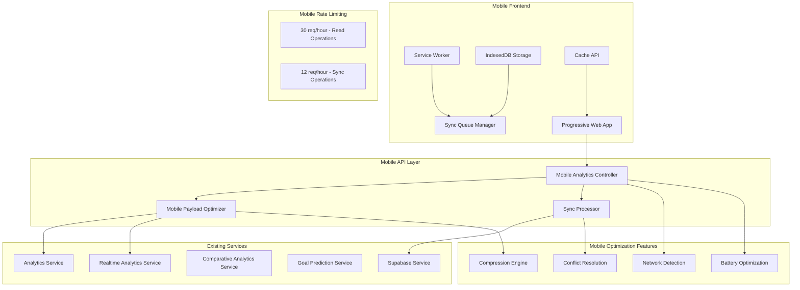

# Mobile Optimization Integration Guide

## Table of Contents
1. [Overview & Architecture](#overview--architecture)
2. [API Endpoints Reference](#api-endpoints-reference)
3. [Progressive Web App Integration](#progressive-web-app-integration)
4. [Offline Capabilities](#offline-capabilities)
5. [Performance Optimization](#performance-optimization)
6. [State Management](#state-management)
7. [Complex UI Components](#complex-ui-components)
8. [Error Handling & Recovery](#error-handling--recovery)
9. [Testing Strategies](#testing-strategies)
10. [Troubleshooting & FAQs](#troubleshooting--faqs)

---

## Overview & Architecture

### Feature Purpose

The Mobile Optimization feature provides a comprehensive mobile-optimized analytics system designed specifically for mobile applications with payload compression, network awareness, battery optimization, and offline data synchronization capabilities. This feature leverages existing backend services with sophisticated mobile-specific optimizations rather than implementing separate mobile services.

### Core Capabilities

**📱 Mobile-First Design:**
- **Payload Optimization:** Guaranteed <50KB responses with automatic compression
- **Network Awareness:** Adaptive content based on connection type (2G/3G/4G/WiFi)
- **Battery Optimization:** Reduced processing and background operations
- **Offline Synchronization:** Comprehensive offline data sync with conflict resolution
- **Progressive Web App:** Full PWA capabilities with service worker integration

**⚡ Performance Targets:**
- **Response Time:** <2 seconds for mobile endpoints
- **Payload Size:** <50KB for all mobile responses with automatic compression
- **Cache Hit Rate:** >80% for mobile analytics requests
- **Sync Success Rate:** >95% for offline data synchronization
- **Battery Impact:** <5% additional battery usage per session

**🔄 Offline Capabilities:**
- **Data Types:** Workout logs, check-ins, goal updates, preferences
- **Sync Types:** Full, incremental, and analytics-only synchronization
- **Conflict Resolution:** Automatic timestamp-based and manual resolution
- **Network Adaptation:** Queue operations for later sync during poor connectivity

### Technical Architecture



### Service Integration Pattern

Mobile optimization uses a **service integration pattern** rather than separate mobile services:

```typescript
// Service integration architecture
const MobileAnalyticsArchitecture = {
  // Existing services with mobile optimizations
  services: {
    analytics: 'Core analytics with mobile flags',
    realtime: 'Background sync and updates via Supabase Realtime (not separate WebSocket server)',
    comparative: 'Peer comparisons with privacy',
    goals: 'Goal tracking with mobile indicators',
    supabase: 'Direct database access with RLS'
  },
  
  // Mobile-specific optimization layer
  optimizations: {
    payloadOptimizer: 'Embedded payload compression',
    caching: 'Multi-tier caching strategies',
    networkAwareness: 'Connection-based optimization',
    batteryOptimization: 'Reduced processing patterns'
  }
};
```

### Database Schema Integration

**Mobile-Optimized Tables:**
- All existing tables with RLS policies
- Mobile-specific indexes for performance
- Optimized queries for mobile data patterns
- Compressed storage for large offline datasets

**Offline Storage Schema (IndexedDB):**
```typescript
interface OfflineStorageSchema {
  // Sync queue for offline operations
  syncQueue: {
    id: string;
    operation: 'create' | 'update' | 'delete';
    resourceType: string;
    resourceId: string;
    data: any;
    timestamp: Date;
    retryCount: number;
    priority: 'low' | 'medium' | 'high' | 'critical';
  };
  
  // Cached analytics data
  analyticsCache: {
    cacheKey: string;
    data: any;
    timestamp: Date;
    expiresAt: Date;
    payloadSize: number;
  };
  
  // Offline workout logs
  offlineWorkouts: {
    tempId: string;
    date: string;
    exercises: any[];
    notes?: string;
    createdOffline: boolean;
    syncStatus: 'pending' | 'synced' | 'conflict';
  };
  
  // Offline check-ins
  offlineCheckIns: {
    tempId: string;
    date: string;
    weight?: number;
    mood?: string;
    energy_level?: number;
    notes?: string;
    createdOffline: boolean;
    syncStatus: 'pending' | 'synced' | 'conflict';
  };
}
```

### Performance Characteristics

- **GET Mobile Overview:** < 200ms (cached data with compression)
- **POST Mobile Sync:** < 2000ms (conflict resolution and analytics refresh)
- **GET Goal Progress:** < 300ms (10-minute cache with mobile optimization)
- **GET Peer Comparison:** < 500ms (15-minute cache with anonymization)
- **Network Adaptation:** Automatic optimization based on connection type
- **Battery Usage:** <5% additional per session with optimization features

---

## API Endpoints Reference

### GET /v1/mobile/overview
**Purpose:** Get mobile-optimized analytics overview with strict payload limits

#### Request Configuration
```typescript
interface MobileOverviewRequest {
  timeRange?: 'week' | 'month' | '3months';
  connectionType?: 'wifi' | 'cellular' | 'slow' | 'fast';
  compressionLevel?: 'auto' | 'high' | 'medium' | 'low';
  priorityMetrics?: string; // comma-separated
  includeCharts?: boolean;
  detailLevel?: 'minimal' | 'standard' | 'detailed';
  cachePreference?: 'fresh' | 'balanced' | 'cached';
  batteryOptimized?: boolean;
  offlineReady?: boolean;
  deviceType?: 'phone' | 'tablet' | 'watch' | 'unknown';
}

const getMobileOverview = async (params: MobileOverviewRequest, token: string) => {
  const searchParams = new URLSearchParams();
  
  // Add parameters with defaults optimized for mobile
  searchParams.append('timeRange', params.timeRange || 'week');
  searchParams.append('detailLevel', params.detailLevel || 'standard');
  searchParams.append('cachePreference', params.cachePreference || 'balanced');
  
  if (params.batteryOptimized) {
    searchParams.append('batteryOptimized', 'true');
  }
  
  if (params.offlineReady) {
    searchParams.append('offlineReady', 'true');
  }

  const response = await fetch(`/v1/mobile/overview?${searchParams}`, {
    method: 'GET',
    headers: {
      'Authorization': `Bearer ${token}`,
      'Content-Type': 'application/json',
      'Accept': 'application/json',
      'Accept-Encoding': 'gzip, deflate, br'
    }
  });

  if (!response.ok) {
    const error = await response.json();
    throw new MobileOptimizationError(error.message, response.status);
  }

  return response.json();
};
```

#### Request Parameters
- **timeRange** (optional): 'week' | 'month' | '3months' (default: 'week')
- **connectionType** (optional): Network connection type for optimization
- **compressionLevel** (optional): Payload compression level
- **priorityMetrics** (optional): Comma-separated priority metrics
- **includeCharts** (optional): Include chart data (increases payload)
- **detailLevel** (optional): Level of detail for mobile display
- **cachePreference** (optional): Cache vs freshness preference
- **batteryOptimized** (optional): Enable battery optimization features
- **offlineReady** (optional): Prepare data for offline availability
- **deviceType** (optional): Device type for optimization

#### Response Structure
```typescript
interface MobileOverviewResponse {
  status: 'success';
  data: {
    summary: {
      workoutCount: number;
      adherenceRate: number; // rounded to 1 decimal
      currentStreak: number;
      weeklyGoalProgress: number; // rounded to 1 decimal
    };
    trends: Array<{
      date: string;
      value: number;
      trend: 'up' | 'down' | 'stable';
    }>; // max 14 items
    recentActivity: any[]; // max 5 items
    keyInsights: any[]; // max 3 items
    goals: Array<{
      id: string;
      type: string;
      progress: number; // rounded to 1 decimal
      status: 'active' | 'completed' | 'paused';
    }>; // max 3 items, simplified
  };
  metadata: {
    cacheUntil: string;
    payloadSize: number;
    optimizedForMobile: true;
    timeRange: string;
    generatedAt: string;
    compressionApplied?: boolean;
    batteryOptimized?: boolean;
    networkOptimized?: boolean;
  };
}
```

#### Mobile Optimizations Applied
- **Payload Size Monitoring:** Automatic compression if >50KB
- **Cache Headers:** `Cache-Control: public, max-age=300` (5 minutes)
- **ETag Generation:** MD5 hash for conditional requests
- **Size Headers:** `X-Payload-Size` for client optimization
- **Essential Data Priority:** Critical information prioritized
- **Array Truncation:** Limited to mobile-appropriate sizes
- **Number Rounding:** Reduced to 1 decimal place for display

#### Error Responses
- **400 Bad Request:** Invalid time range or parameters
- **401 Unauthorized:** Missing or invalid JWT token
- **413 Payload Too Large:** Mobile payload exceeds 50KB limit
- **429 Too Many Requests:** Rate limit exceeded (30/hour)
- **500 Internal Server Error:** Analytics service failure

### POST /v1/mobile/sync
**Purpose:** Synchronize offline mobile data with intelligent conflict resolution

#### Request Configuration
```typescript
interface MobileSyncRequest {
  syncType: 'full' | 'incremental' | 'conflict_resolution' | 'offline_queue';
  lastSync?: string; // ISO 8601 timestamp
  deviceId: string;
  dataTypes?: Array<'analytics' | 'goals' | 'progress' | 'workouts' | 'notifications' | 'preferences'>;
  conflicts?: Array<{
    resourceType: 'goal' | 'checkin' | 'workout_log' | 'preference';
    resourceId: string;
    serverVersion: string;
    clientVersion: string;
    resolution: 'use_server' | 'use_client' | 'merge' | 'manual';
    clientData: any;
    priority: 'low' | 'medium' | 'high';
  }>;
  offlineQueue?: Array<{
    operation: 'create' | 'update' | 'delete';
    resourceType: string;
    resourceId: string;
    data: any;
    timestamp: string;
    retryCount: number;
    priority: 'low' | 'medium' | 'high' | 'critical';
  }>;
  connectionInfo?: {
    type: 'wifi' | 'cellular' | 'slow' | 'fast';
    quality: 'excellent' | 'good' | 'fair' | 'poor';
    bandwidth?: number; // kbps
  };
  preferences?: {
    backgroundSync: boolean;
    syncFrequency: 'immediate' | 'hourly' | 'daily' | 'manual';
    dataLimit?: number; // bytes
    priorityFilter: Array<'critical' | 'high' | 'medium' | 'low'>;
  };
  optimizations?: {
    compression: boolean;
    deltaSync: boolean;
    batchSize: number; // 1-100
    timeout: number; // 5000-60000ms
  };
  metadata?: {
    appVersion: string;
    platform: 'ios' | 'android' | 'mobile_web';
    timezone: string;
    locale: string;
  };
  forceFull?: boolean;
  validateIntegrity?: boolean;
}

const syncMobileData = async (request: MobileSyncRequest, token: string) => {
  const response = await fetch('/v1/mobile/sync', {
    method: 'POST',
    headers: {
      'Authorization': `Bearer ${token}`,
      'Content-Type': 'application/json',
      'Accept': 'application/json'
    },
    body: JSON.stringify(request)
  });

  if (!response.ok) {
    const error = await response.json();
    throw new MobileSyncError(error.message, response.status, error.details);
  }

  return response.json();
};
```

#### Sync Processing Logic
1. **Validation:** Validates sync type and timestamp format
2. **Offline Data Processing:** Handles workout logs and check-ins from offline storage
3. **Conflict Resolution:** Resolves data conflicts automatically or flags for manual review
4. **Analytics Refresh:** Triggers background analytics recalculation after successful sync
5. **Response Optimization:** Returns updated analytics with mobile optimization

#### Response Structure
```typescript
interface MobileSyncResponse {
  status: 'success' | 'partial_success' | 'failure';
  data: {
    syncStatus: 'success' | 'partial' | 'failed';
    conflictsResolved: number;
    recordsProcessed: number;
    recordsFailed: number;
    updatedAnalytics?: any; // mobile-optimized
    nextSyncRecommended: string; // ISO timestamp
    syncTimestamp: string;
    conflicts?: Array<{
      resourceType: string;
      resourceId: string;
      conflict: any;
      suggestedResolution: string;
    }>;
  };
  metadata: {
    syncType: string;
    processingTime: number;
    payloadSize: number;
    compressionApplied?: boolean;
    validationErrors?: string[];
  };
}
```

#### Sync Types Supported
- **Full Sync:** Complete data synchronization (initial or after extended offline)
- **Incremental Sync:** Only changes since last sync timestamp
- **Conflict Resolution:** Resolve flagged conflicts with user input
- **Offline Queue:** Process queued operations from offline usage

#### Data Validation Patterns
- **Workout Logs:** Requires date, exercises array with content
- **Check-ins:** Requires date and at least one metric (weight, mood, energy_level)
- **Timestamps:** ISO 8601 format validation with graceful fallback
- **Data Integrity:** Comprehensive validation for offline-generated data

#### Error Responses
- **400 Bad Request:** Invalid sync type or timestamp format
- **401 Unauthorized:** Missing or invalid JWT token
- **409 Conflict:** Unresolvable conflicts requiring manual intervention
- **413 Payload Too Large:** Sync data exceeds size limits
- **422 Unprocessable Entity:** Data validation failures
- **429 Too Many Requests:** Rate limit exceeded (12/hour)
- **500 Internal Server Error:** Sync processing failure

### GET /v1/mobile/goals/:goalId/progress
  const response = await fetch('/v1/mobile/sync', {
    method: 'POST',
    headers: {
      'Authorization': `Bearer ${token}`,
      'Content-Type': 'application/json',
      'Accept': 'application/json'
    },
    body: JSON.stringify(request)
  });

  if (!response.ok) {
    const error = await response.json();
    throw new MobileSyncError(error.message, response.status, error.details);
  }

  return response.json();
};
```

#### Sync Processing Logic
1. **Validation:** Validates sync type and timestamp format
2. **Offline Data Processing:** Handles workout logs and check-ins from offline storage
3. **Conflict Resolution:** Resolves data conflicts automatically or flags for manual review
4. **Analytics Refresh:** Triggers background analytics recalculation after successful sync
5. **Response Optimization:** Returns updated analytics with mobile optimization

#### Response Structure
```typescript
interface MobileSyncResponse {
  status: 'success' | 'partial_success' | 'failure';
  data: {
    syncStatus: 'success' | 'partial' | 'failed';
    conflictsResolved: number;
    recordsProcessed: number;
    recordsFailed: number;
    updatedAnalytics?: any; // mobile-optimized
    nextSyncRecommended: string; // ISO timestamp
    syncTimestamp: string;
    conflicts?: Array<{
      resourceType: string;
      resourceId: string;
      conflict: any;
      suggestedResolution: string;
    }>;
  };
  metadata: {
    syncType: string;
    processingTime: number;
    payloadSize: number;
    compressionApplied?: boolean;
    validationErrors?: string[];
  };
}
```

#### Sync Types Supported
- **Full Sync:** Complete data synchronization (initial or after extended offline)
- **Incremental Sync:** Only changes since last sync timestamp
- **Conflict Resolution:** Resolve flagged conflicts with user input
- **Offline Queue:** Process queued operations from offline usage

#### Data Validation Patterns
- **Workout Logs:** Requires date, exercises array with content
- **Check-ins:** Requires date and at least one metric (weight, mood, energy_level)
- **Timestamps:** ISO 8601 format validation with graceful fallback
- **Data Integrity:** Comprehensive validation for offline-generated data

#### Error Responses
- **400 Bad Request:** Invalid sync type or timestamp format
- **401 Unauthorized:** Missing or invalid JWT token
- **409 Conflict:** Unresolvable conflicts requiring manual intervention
- **413 Payload Too Large:** Sync data exceeds size limits
- **422 Unprocessable Entity:** Data validation failures
- **429 Too Many Requests:** Rate limit exceeded (12/hour)
- **500 Internal Server Error:** Sync processing failure

### GET /v1/mobile/goals/:goalId/progress
**Purpose:** Get mobile-optimized goal progress data

#### Request Configuration
```typescript
const getMobileGoalProgress = async (goalId: string, token: string) => {
  const response = await fetch(`/v1/mobile/goals/${goalId}/progress`, {
    method: 'GET',
    headers: {
      'Authorization': `Bearer ${token}`,
      'Content-Type': 'application/json'
    }
  });

  if (!response.ok) {
    const error = await response.json();
    throw new MobileOptimizationError(error.message, response.status);
  }

  return response.json();
};
```

#### Path Parameters
- **goalId** (required): UUID format goal identifier

#### Response Structure
```typescript
interface MobileGoalProgressResponse {
  status: 'success';
  data: {
    goalId: string;
    progressPercentage: number; // rounded to 1 decimal
    currentValue: number;
    targetValue: number;
    onTrack: boolean;
    daysRemaining: number;
    recentMilestones: Array<{
      id: string;
      achievedAt: string;
      description: string;
      value: number;
    }>; // max 3 items
  };
  metadata: {
    optimizedForMobile: true;
    cacheUntil: string;
    payloadSize: number;
  };
}
```

#### Mobile Optimizations
- **Progress Simplification:** Essential progress metrics only
- **Milestone Reduction:** Limited to 3 most recent milestones
- **Boolean Indicators:** Simple on-track status for mobile UI
- **Visual Optimization:** Data structured for mobile progress bars
- **Cache Strategy:** 10-minute cache for goal progress data

### GET /v1/mobile/peer-comparison
**Purpose:** Get mobile-optimized peer comparison analytics with privacy protection

#### Request Configuration
```typescript
interface PeerComparisonRequest {
  comparisonType?: 'workout_consistency' | 'strength_gains' | 'overall_fitness';
}

const getMobilePeerComparison = async (params: PeerComparisonRequest, token: string) => {
  const searchParams = new URLSearchParams();
  searchParams.append('comparisonType', params.comparisonType || 'workout_consistency');

  const response = await fetch(`/v1/mobile/peer-comparison?${searchParams}`, {
    method: 'GET',
    headers: {
      'Authorization': `Bearer ${token}`,
      'Content-Type': 'application/json'
    }
  });

  if (!response.ok) {
    const error = await response.json();
    throw new MobileOptimizationError(error.message, response.status);
  }

  return response.json();
};
```

#### Query Parameters
- **comparisonType** (optional): 'workout_consistency' | 'strength_gains' | 'overall_fitness'

#### Response Structure
```typescript
interface MobilePeerComparisonResponse {
  status: 'success';
  data: {
    userPercentile: number; // rounded integer
    peerGroupSize: number;
    categoricalRank: string;
    relativePerformance: 'above_average' | 'average' | 'below_average';
    keyInsights: Array<{
      type: string;
      message: string;
      actionable: boolean;
    }>; // max 2 items
  };
  metadata: {
    optimizedForMobile: true;
    privacyNote: 'All peer data is anonymized';
    cacheUntil: string;
    payloadSize: number;
  };
}
```

#### Privacy and Security Features
- **Data Anonymization:** All peer data automatically anonymized
- **User Isolation:** Maintained through service layer RLS
- **Privacy Notice:** Included in response metadata
- **Reduced Peer Group:** Smaller comparison groups for faster processing
- **Cache Strategy:** 15-minute cache for peer comparison data

### GET /v1/mobile/notifications/preferences
**Purpose:** Get mobile notification preferences

#### Request Configuration
```typescript
const getMobileNotificationPreferences = async (token: string) => {
  const response = await fetch('/v1/mobile/notifications/preferences', {
    method: 'GET',
    headers: {
      'Authorization': `Bearer ${token}`,
      'Content-Type': 'application/json'
    }
  });

  if (!response.ok) {
    const error = await response.json();
    throw new MobileOptimizationError(error.message, response.status);
  }

  return response.json();
};
```

#### Response Structure
```typescript
interface MobileNotificationPreferencesResponse {
  status: 'success';
  data: {
    pushNotifications: boolean;
    workoutReminders: boolean;
    goalMilestones: boolean;
    weeklyReports: boolean;
    peerComparisons: boolean;
    quietHours: {
      start: string; // HH:MM format
      end: string;   // HH:MM format
    };
  };
  metadata: {
    optimizedForMobile: true;
    lastUpdated: string;
  };
}
```

#### Default Values
If no preferences exist in database:
```typescript
const defaultPreferences = {
  pushNotifications: false,
  workoutReminders: false,
  goalMilestones: false,
  weeklyReports: false,
  peerComparisons: false,
  quietHours: { start: '22:00', end: '08:00' }
};
```

### GET /v1/mobile/analytics
**Purpose:** General mobile-optimized analytics endpoint (test-compatible)

#### Request Configuration
```typescript
const getMobileOptimizedAnalytics = async (token: string) => {
  const response = await fetch('/v1/mobile/analytics', {
    method: 'GET',
    headers: {
      'Authorization': `Bearer ${token}`,
      'Content-Type': 'application/json'
    }
  });

  if (!response.ok) {
    const error = await response.json();
    throw new MobileOptimizationError(error.message, response.status);
  }

  return response.json();
};
```

#### Response Structure
```typescript
interface MobileAnalyticsResponse {
  status: 'success';
  data: {
    // Same structure as /overview endpoint
    // Mobile-optimized analytics payload
  };
  metadata: {
    optimizedForMobile: true;
    payloadSize: number;
    generatedAt: string;
  };
}
```

#### Test Integration Features
- Compatible with mock request/response objects
- Graceful error handling without response objects
- Return value compatibility for testing
- Comprehensive logging for test transparency

### Rate Limiting Strategy

```typescript
interface MobileRateLimits {
  // Read operations (overview, goals, peer comparison, analytics)
  readOperations: {
    limit: 30; // requests per hour
    window: 3600000; // 1 hour in milliseconds
    keyGenerator: 'user_id'; // user-specific limiting
  };
  
  // Sync operations (more restrictive)
  syncOperations: {
    limit: 12; // requests per hour
    window: 3600000; // 1 hour in milliseconds
    keyGenerator: 'user_id'; // user-specific limiting
  };
  
  // Notification preferences (no limit - frequent access)
  notificationPreferences: {
    limit: null; // no rate limiting
    reasoning: 'Frequent access expected for mobile apps';
  };
}

// Rate limit headers provided in responses
interface RateLimitHeaders {
  'X-RateLimit-Limit': string; // e.g., "30" or "12"
  'X-RateLimit-Remaining': string; // remaining in current window
  'X-RateLimit-Reset': string; // timestamp when window resets
}
``` 

---

## Progressive Web App Integration

> **📋 Implementation Status:** The sections above document **fully implemented backend features**. The sections below provide **frontend implementation guidance** for Progressive Web App capabilities, offline storage, and mobile-optimized UI components that are not yet implemented but are designed to work with the existing backend infrastructure.

### PWA Manifest Configuration

```json
// public/manifest.json
{
  "name": "AI Trainer - Mobile Fitness Analytics",
  "short_name": "AI Trainer",
  "description": "Comprehensive mobile fitness analytics with AI insights and offline capabilities",
  "start_url": "/",
  "display": "standalone",
  "orientation": "portrait",
  "theme_color": "#3b82f6",
  "background_color": "#ffffff",
  "scope": "/",
  "lang": "en-US",
  "dir": "ltr",
  "categories": ["fitness", "health", "analytics"],
  "icons": [
    {
      "src": "/icons/icon-72x72.png",
      "sizes": "72x72",
      "type": "image/png",
      "purpose": "maskable any"
    },
    {
      "src": "/icons/icon-96x96.png",
      "sizes": "96x96",
      "type": "image/png",
      "purpose": "maskable any"
    },
    {
      "src": "/icons/icon-128x128.png",
      "sizes": "128x128",
      "type": "image/png",
      "purpose": "maskable any"
    },
    {
      "src": "/icons/icon-144x144.png",
      "sizes": "144x144",
      "type": "image/png",
      "purpose": "maskable any"
    },
    {
      "src": "/icons/icon-152x152.png",
      "sizes": "152x152",
      "type": "image/png",
      "purpose": "maskable any"
    },
    {
      "src": "/icons/icon-192x192.png",
      "sizes": "192x192",
      "type": "image/png",
      "purpose": "maskable any"
    },
    {
      "src": "/icons/icon-384x384.png",
      "sizes": "384x384",
      "type": "image/png",
      "purpose": "maskable any"
    },
    {
      "src": "/icons/icon-512x512.png",
      "sizes": "512x512",
      "type": "image/png",
      "purpose": "maskable any"
    }
  ],
  "screenshots": [
    {
      "src": "/screenshots/mobile-dashboard.png",
      "sizes": "750x1334",
      "type": "image/png",
      "form_factor": "narrow"
    },
    {
      "src": "/screenshots/tablet-analytics.png",
      "sizes": "1024x1366",
      "type": "image/png",
      "form_factor": "wide"
    }
  ],
  "shortcuts": [
    {
      "name": "Quick Workout Log",
      "short_name": "Log Workout",
      "description": "Quickly log a workout",
      "url": "/workout/log",
      "icons": [
        {
          "src": "/icons/workout-shortcut.png",
          "sizes": "96x96"
        }
      ]
    },
    {
      "name": "Progress Check-in",
      "short_name": "Check-in",
      "description": "Record progress metrics",
      "url": "/progress/checkin",
      "icons": [
        {
          "src": "/icons/progress-shortcut.png",
          "sizes": "96x96"
        }
      ]
    }
  ],
  "features": [
    "offline",
    "background-sync",
    "push-notifications",
    "periodic-background-sync"
  ]
}
```

### Service Worker Implementation

```typescript
// public/sw.js
const CACHE_NAME = 'ai-trainer-v1.0.0';
const OFFLINE_CACHE = 'ai-trainer-offline-v1.0.0';
const API_CACHE = 'ai-trainer-api-v1.0.0';

// Critical resources to cache immediately
const CRITICAL_ASSETS = [
  '/',
  '/offline',
  '/manifest.json',
  '/static/js/bundle.js',
  '/static/css/main.css',
  '/icons/icon-192x192.png'
];

// API endpoints to cache with different strategies
const API_ROUTES = {
  analytics: /^\/v1\/mobile\/(overview|analytics)/,
  goals: /^\/v1\/mobile\/goals/,
  sync: /^\/v1\/mobile\/sync/,
  preferences: /^\/v1\/mobile\/notifications\/preferences/
};

// Install event - cache critical resources
self.addEventListener('install', (event) => {
  event.waitUntil(
    Promise.all([
      // Cache critical assets
      caches.open(CACHE_NAME).then((cache) => {
        return cache.addAll(CRITICAL_ASSETS);
      }),
      
      // Initialize offline storage
      initializeOfflineStorage(),
      
      // Skip waiting to activate immediately
      self.skipWaiting()
    ])
  );
});

// Activate event - clean up old caches
self.addEventListener('activate', (event) => {
  event.waitUntil(
    Promise.all([
      // Clean up old caches
      caches.keys().then((cacheNames) => {
        return Promise.all(
          cacheNames
            .filter((name) => name.startsWith('ai-trainer-') && name !== CACHE_NAME && name !== OFFLINE_CACHE && name !== API_CACHE)
            .map((name) => caches.delete(name))
        );
      }),
      
      // Claim all clients
      self.clients.claim()
    ])
  );
});

// Fetch event - implement caching strategies
self.addEventListener('fetch', (event) => {
  const { request } = event;
  const url = new URL(request.url);

  // Handle different types of requests
  if (request.method === 'GET') {
    if (url.pathname.startsWith('/v1/mobile/')) {
      // API requests - cache with network-first strategy
      event.respondWith(handleAPIRequest(request));
    } else if (request.destination === 'document') {
      // HTML documents - cache-first with network fallback
      event.respondWith(handleDocumentRequest(request));
    } else if (request.destination === 'image') {
      // Images - cache-first strategy
      event.respondWith(handleImageRequest(request));
    } else {
      // Other static assets - cache-first strategy
      event.respondWith(handleStaticAssetRequest(request));
    }
  } else if (request.method === 'POST' && url.pathname.startsWith('/v1/mobile/')) {
    // POST requests - handle offline queue
    event.respondWith(handleOfflineCapableRequest(request));
  }
});

// Background sync for offline data
self.addEventListener('sync', (event) => {
  if (event.tag === 'mobile-sync') {
    event.waitUntil(processSyncQueue());
  }
});

// Push notification handling
self.addEventListener('push', (event) => {
  const options = {
    body: 'You have new fitness insights available!',
    icon: '/icons/icon-192x192.png',
    badge: '/icons/badge-72x72.png',
    vibrate: [100, 50, 100],
    data: {
      dateOfArrival: Date.now(),
      primaryKey: 1
    },
    actions: [
      {
        action: 'explore',
        title: 'View Analytics',
        icon: '/icons/analytics-action.png'
      },
      {
        action: 'close',
        title: 'Close',
        icon: '/icons/close-action.png'
      }
    ]
  };

  event.waitUntil(
    self.registration.showNotification('AI Trainer Update', options)
  );
});

// Mobile-specific request handlers
async function handleAPIRequest(request) {
  const url = new URL(request.url);
  
  try {
    // Try network first for fresh data
    const networkResponse = await fetch(request);
    
    if (networkResponse.ok) {
      // Cache successful responses for mobile optimization
      const cache = await caches.open(API_CACHE);
      
      // Check payload size before caching
      const responseClone = networkResponse.clone();
      const text = await responseClone.text();
      
      if (text.length <= 51200) { // 50KB limit
        cache.put(request, networkResponse.clone());
      }
      
      return networkResponse;
    }
    
    throw new Error('Network response not ok');
  } catch (error) {
    // Fallback to cache for offline support
    const cachedResponse = await caches.match(request);
    
    if (cachedResponse) {
      return cachedResponse;
    }
    
    // Return offline response for analytics
    if (url.pathname.includes('/overview') || url.pathname.includes('/analytics')) {
      return new Response(JSON.stringify({
        status: 'offline',
        data: await getOfflineAnalytics(),
        metadata: {
          optimizedForMobile: true,
          offline: true,
          cachedAt: new Date().toISOString()
        }
      }), {
        headers: { 'Content-Type': 'application/json' }
      });
    }
    
    return new Response('Offline', { status: 503 });
  }
}

async function handleOfflineCapableRequest(request) {
  const url = new URL(request.url);
  
  // Check if online
  if (navigator.onLine) {
    try {
      const response = await fetch(request);
      if (response.ok) {
        return response;
      }
    } catch (error) {
      // Network failed, queue for later
    }
  }
  
  // Queue request for background sync
  if (url.pathname.includes('/sync')) {
    const requestData = await request.json();
    await queueSyncRequest(requestData);
    
    // Register background sync
    await self.registration.sync.register('mobile-sync');
    
    return new Response(JSON.stringify({
      status: 'queued',
      message: 'Request queued for sync when online'
    }), {
      headers: { 'Content-Type': 'application/json' }
    });
  }
  
  return new Response('Offline', { status: 503 });
}

// Offline storage initialization
async function initializeOfflineStorage() {
  // Initialize IndexedDB for offline data
  const request = indexedDB.open('AITrainerOffline', 1);
  
  return new Promise((resolve, reject) => {
    request.onerror = () => reject(request.error);
    request.onsuccess = () => resolve(request.result);
    
    request.onupgradeneeded = (event) => {
      const db = event.target.result;
      
      // Sync queue store
      if (!db.objectStoreNames.contains('syncQueue')) {
        const syncStore = db.createObjectStore('syncQueue', { keyPath: 'id', autoIncrement: true });
        syncStore.createIndex('timestamp', 'timestamp');
        syncStore.createIndex('priority', 'priority');
      }
      
      // Analytics cache store
      if (!db.objectStoreNames.contains('analyticsCache')) {
        const analyticsStore = db.createObjectStore('analyticsCache', { keyPath: 'cacheKey' });
        analyticsStore.createIndex('expiresAt', 'expiresAt');
      }
      
      // Offline workouts store
      if (!db.objectStoreNames.contains('offlineWorkouts')) {
        const workoutsStore = db.createObjectStore('offlineWorkouts', { keyPath: 'tempId' });
        workoutsStore.createIndex('date', 'date');
        workoutsStore.createIndex('syncStatus', 'syncStatus');
      }
      
      // Offline check-ins store
      if (!db.objectStoreNames.contains('offlineCheckIns')) {
        const checkInsStore = db.createObjectStore('offlineCheckIns', { keyPath: 'tempId' });
        checkInsStore.createIndex('date', 'date');
        checkInsStore.createIndex('syncStatus', 'syncStatus');
      }
    };
  });
}
```

### PWA Installation Prompt

```tsx
// hooks/usePWAInstall.ts
import { useState, useEffect } from 'react';

interface BeforeInstallPromptEvent extends Event {
  readonly platforms: string[];
  readonly userChoice: Promise<{
    outcome: 'accepted' | 'dismissed';
    platform: string;
  }>;
  prompt(): Promise<void>;
}

export const usePWAInstall = () => {
  const [deferredPrompt, setDeferredPrompt] = useState<BeforeInstallPromptEvent | null>(null);
  const [isInstallable, setIsInstallable] = useState(false);
  const [isInstalled, setIsInstalled] = useState(false);

  useEffect(() => {
    // Check if already installed
    setIsInstalled(window.matchMedia('(display-mode: standalone)').matches);

    const handleBeforeInstallPrompt = (e: Event) => {
      e.preventDefault();
      setDeferredPrompt(e as BeforeInstallPromptEvent);
      setIsInstallable(true);
    };

    const handleAppInstalled = () => {
      setIsInstalled(true);
      setIsInstallable(false);
      setDeferredPrompt(null);
    };

    window.addEventListener('beforeinstallprompt', handleBeforeInstallPrompt);
    window.addEventListener('appinstalled', handleAppInstalled);

    return () => {
      window.removeEventListener('beforeinstallprompt', handleBeforeInstallPrompt);
      window.removeEventListener('appinstalled', handleAppInstalled);
    };
  }, []);

  const installPWA = async () => {
    if (!deferredPrompt) return false;

    deferredPrompt.prompt();
    const { outcome } = await deferredPrompt.userChoice;
    
    setDeferredPrompt(null);
    setIsInstallable(false);

    return outcome === 'accepted';
  };

  return {
    isInstallable,
    isInstalled,
    installPWA
  };
};

// PWAInstallPrompt.tsx
import React from 'react';
import { usePWAInstall } from '../hooks/usePWAInstall';

export const PWAInstallPrompt: React.FC = () => {
  const { isInstallable, isInstalled, installPWA } = usePWAInstall();
  const [showPrompt, setShowPrompt] = useState(true);

  if (!isInstallable || isInstalled || !showPrompt) {
    return null;
  }

  const handleInstall = async () => {
    const installed = await installPWA();
    if (installed) {
      setShowPrompt(false);
    }
  };

  return (
    <div className="fixed bottom-4 left-4 right-4 bg-blue-600 text-white rounded-lg p-4 shadow-lg z-50">
      <div className="flex items-center justify-between">
        <div className="flex-1">
          <h3 className="font-semibold text-sm">Install AI Trainer</h3>
          <p className="text-xs opacity-90 mt-1">
            Get faster access and offline capabilities
          </p>
        </div>
        
        <div className="flex space-x-2 ml-4">
          <button
            onClick={() => setShowPrompt(false)}
            className="px-3 py-1 text-xs border border-white/30 rounded hover:bg-white/10 transition-colors"
          >
            Later
          </button>
          <button
            onClick={handleInstall}
            className="px-3 py-1 text-xs bg-white text-blue-600 rounded hover:bg-gray-100 transition-colors"
          >
            Install
          </button>
        </div>
      </div>
    </div>
  );
};
```

---

## Offline Capabilities

### Offline Storage Management

```typescript
// services/OfflineStorageService.ts
export class OfflineStorageService {
  private db: IDBDatabase | null = null;

  async initialize(): Promise<void> {
    return new Promise((resolve, reject) => {
      const request = indexedDB.open('AITrainerOffline', 1);

      request.onerror = () => reject(request.error);
      request.onsuccess = () => {
        this.db = request.result;
        resolve();
      };

      request.onupgradeneeded = (event) => {
        const db = (event.target as IDBOpenDBRequest).result;
        this.setupDatabase(db);
      };
    });
  }

  private setupDatabase(db: IDBDatabase): void {
    // Sync queue for offline operations
    if (!db.objectStoreNames.contains('syncQueue')) {
      const syncStore = db.createObjectStore('syncQueue', { 
        keyPath: 'id', 
        autoIncrement: true 
      });
      syncStore.createIndex('timestamp', 'timestamp');
      syncStore.createIndex('priority', 'priority');
      syncStore.createIndex('resourceType', 'resourceType');
    }

    // Analytics cache
    if (!db.objectStoreNames.contains('analyticsCache')) {
      const analyticsStore = db.createObjectStore('analyticsCache', { 
        keyPath: 'cacheKey' 
      });
      analyticsStore.createIndex('expiresAt', 'expiresAt');
      analyticsStore.createIndex('timestamp', 'timestamp');
    }

    // Offline workout logs
    if (!db.objectStoreNames.contains('offlineWorkouts')) {
      const workoutsStore = db.createObjectStore('offlineWorkouts', { 
        keyPath: 'tempId' 
      });
      workoutsStore.createIndex('date', 'date');
      workoutsStore.createIndex('syncStatus', 'syncStatus');
      workoutsStore.createIndex('createdAt', 'createdAt');
    }

    // Offline check-ins
    if (!db.objectStoreNames.contains('offlineCheckIns')) {
      const checkInsStore = db.createObjectStore('offlineCheckIns', { 
        keyPath: 'tempId' 
      });
      checkInsStore.createIndex('date', 'date');
      checkInsStore.createIndex('syncStatus', 'syncStatus');
      checkInsStore.createIndex('createdAt', 'createdAt');
    }
  }

  // Sync queue operations
  async addToSyncQueue(operation: OfflineSyncOperation): Promise<void> {
    if (!this.db) throw new Error('Database not initialized');

    const transaction = this.db.transaction(['syncQueue'], 'readwrite');
    const store = transaction.objectStore('syncQueue');
    
    await store.add({
      ...operation,
      timestamp: new Date(),
      retryCount: 0,
      createdAt: new Date()
    });
  }

  async getSyncQueue(): Promise<OfflineSyncOperation[]> {
    if (!this.db) throw new Error('Database not initialized');

    const transaction = this.db.transaction(['syncQueue'], 'readonly');
    const store = transaction.objectStore('syncQueue');
    const index = store.index('priority');
    
    return new Promise((resolve, reject) => {
      const request = index.getAll();
      request.onsuccess = () => resolve(request.result);
      request.onerror = () => reject(request.error);
    });
  }

  async removeSyncOperation(id: number): Promise<void> {
    if (!this.db) throw new Error('Database not initialized');

    const transaction = this.db.transaction(['syncQueue'], 'readwrite');
    const store = transaction.objectStore('syncQueue');
    await store.delete(id);
  }

  // Analytics cache operations
  async cacheAnalytics(
    cacheKey: string, 
    data: any, 
    expirationMinutes: number = 5
  ): Promise<void> {
    if (!this.db) throw new Error('Database not initialized');

    const expiresAt = new Date();
    expiresAt.setMinutes(expiresAt.getMinutes() + expirationMinutes);

    const transaction = this.db.transaction(['analyticsCache'], 'readwrite');
    const store = transaction.objectStore('analyticsCache');
    
    await store.put({
      cacheKey,
      data,
      timestamp: new Date(),
      expiresAt,
      payloadSize: JSON.stringify(data).length
    });
  }

  async getCachedAnalytics(cacheKey: string): Promise<any | null> {
    if (!this.db) throw new Error('Database not initialized');

    const transaction = this.db.transaction(['analyticsCache'], 'readonly');
    const store = transaction.objectStore('analyticsCache');
    
    return new Promise((resolve, reject) => {
      const request = store.get(cacheKey);
      request.onsuccess = () => {
        const result = request.result;
        if (result && new Date() < result.expiresAt) {
          resolve(result.data);
        } else {
          resolve(null);
        }
      };
      request.onerror = () => reject(request.error);
    });
  }

  // Offline workout operations
  async saveOfflineWorkout(workout: OfflineWorkout): Promise<string> {
    if (!this.db) throw new Error('Database not initialized');

    const tempId = `offline_workout_${Date.now()}_${Math.random().toString(36).substr(2, 9)}`;
    
    const transaction = this.db.transaction(['offlineWorkouts'], 'readwrite');
    const store = transaction.objectStore('offlineWorkouts');
    
    await store.add({
      ...workout,
      tempId,
      createdOffline: true,
      syncStatus: 'pending',
      createdAt: new Date()
    });

    return tempId;
  }

  async getOfflineWorkouts(): Promise<OfflineWorkout[]> {
    if (!this.db) throw new Error('Database not initialized');

    const transaction = this.db.transaction(['offlineWorkouts'], 'readonly');
    const store = transaction.objectStore('offlineWorkouts');
    const index = store.index('date');
    
    return new Promise((resolve, reject) => {
      const request = index.getAll();
      request.onsuccess = () => resolve(request.result);
      request.onerror = () => reject(request.error);
    });
  }

  // Offline check-in operations
  async saveOfflineCheckIn(checkIn: OfflineCheckIn): Promise<string> {
    if (!this.db) throw new Error('Database not initialized');

    const tempId = `offline_checkin_${Date.now()}_${Math.random().toString(36).substr(2, 9)}`;
    
    const transaction = this.db.transaction(['offlineCheckIns'], 'readwrite');
    const store = transaction.objectStore('offlineCheckIns');
    
    await store.add({
      ...checkIn,
      tempId,
      createdOffline: true,
      syncStatus: 'pending',
      createdAt: new Date()
    });

    return tempId;
  }

  async getOfflineCheckIns(): Promise<OfflineCheckIn[]> {
    if (!this.db) throw new Error('Database not initialized');

    const transaction = this.db.transaction(['offlineCheckIns'], 'readonly');
    const store = transaction.objectStore('offlineCheckIns');
    const index = store.index('date');
    
    return new Promise((resolve, reject) => {
      const request = index.getAll();
      request.onsuccess = () => resolve(request.result);
      request.onerror = () => reject(request.error);
    });
  }

  // Cleanup expired cache
  async cleanupExpiredCache(): Promise<void> {
    if (!this.db) throw new Error('Database not initialized');

    const transaction = this.db.transaction(['analyticsCache'], 'readwrite');
    const store = transaction.objectStore('analyticsCache');
    const index = store.index('expiresAt');
    
    const range = IDBKeyRange.upperBound(new Date());
    const request = index.openCursor(range);
    
    request.onsuccess = (event) => {
      const cursor = (event.target as IDBRequest).result;
      if (cursor) {
        cursor.delete();
        cursor.continue();
      }
    };
  }
}
```

### Sync Queue Manager

```typescript
// services/SyncQueueManager.ts
export class SyncQueueManager {
  private storageService: OfflineStorageService;
  private apiService: MobileApiService;
  private isProcessing = false;
  private syncInterval: NodeJS.Timeout | null = null;

  constructor(
    storageService: OfflineStorageService,
    apiService: MobileApiService
  ) {
    this.storageService = storageService;
    this.apiService = apiService;
  }

  async startPeriodicSync(intervalMinutes: number = 15): Promise<void> {
    if (this.syncInterval) {
      clearInterval(this.syncInterval);
    }

    this.syncInterval = setInterval(async () => {
      if (navigator.onLine && !this.isProcessing) {
        await this.processQueue();
      }
    }, intervalMinutes * 60 * 1000);

    // Initial sync if online
    if (navigator.onLine) {
      await this.processQueue();
    }
  }

  async stopPeriodicSync(): Promise<void> {
    if (this.syncInterval) {
      clearInterval(this.syncInterval);
      this.syncInterval = null;
    }
  }

  async processQueue(): Promise<SyncResult> {
    if (this.isProcessing || !navigator.onLine) {
      return { success: false, message: 'Sync already in progress or offline' };
    }

    this.isProcessing = true;
    
    try {
      const operations = await this.storageService.getSyncQueue();
      const workouts = await this.storageService.getOfflineWorkouts();
      const checkIns = await this.storageService.getOfflineCheckIns();

      const syncData: MobileSyncRequest = {
        syncType: 'incremental',
        deviceId: await this.getDeviceId(),
        lastSync: this.getLastSyncTimestamp(),
        offlineQueue: operations.map(op => ({
          operation: op.operation,
          resourceType: op.resourceType,
          resourceId: op.resourceId,
          data: op.data,
          timestamp: op.timestamp.toISOString(),
          retryCount: op.retryCount,
          priority: op.priority
        })),
        connectionInfo: await this.getConnectionInfo(),
        optimizations: {
          compression: true,
          deltaSync: true,
          batchSize: 20,
          timeout: 30000
        },
        validateIntegrity: true
      };

      // Add offline data if present
      if (workouts.length > 0 || checkIns.length > 0) {
        syncData.offlineData = {
          workoutLogs: workouts.map(w => ({
            id: w.tempId,
            date: w.date,
            exercises: w.exercises,
            notes: w.notes,
            offline_created: true
          })),
          checkIns: checkIns.map(c => ({
            id: c.tempId,
            date: c.date,
            weight: c.weight,
            mood: c.mood,
            energy_level: c.energy_level,
            notes: c.notes,
            offline_created: true
          }))
        };
      }

      const response = await this.apiService.syncMobileData(syncData);

      if (response.status === 'success' || response.status === 'partial_success') {
        // Clear processed operations
        await this.clearProcessedOperations(operations);
        
        // Update sync timestamp
        this.setLastSyncTimestamp(response.data.syncTimestamp);
        
        // Handle conflicts if any
        if (response.data.conflicts && response.data.conflicts.length > 0) {
          await this.handleConflicts(response.data.conflicts);
        }

        return {
          success: true,
          message: `Synced ${response.data.recordsProcessed} records`,
          recordsProcessed: response.data.recordsProcessed,
          conflicts: response.data.conflicts
        };
      }

      return { success: false, message: 'Sync failed' };

    } catch (error) {
      console.error('Sync queue processing failed:', error);
      return { 
        success: false, 
        message: error instanceof Error ? error.message : 'Unknown sync error' 
      };
    } finally {
      this.isProcessing = false;
    }
  }

  private async clearProcessedOperations(operations: OfflineSyncOperation[]): Promise<void> {
    for (const operation of operations) {
      await this.storageService.removeSyncOperation(operation.id);
    }
  }

  private async handleConflicts(conflicts: any[]): Promise<void> {
    // Store conflicts for user resolution
    for (const conflict of conflicts) {
      await this.storageService.addToSyncQueue({
        operation: 'update',
        resourceType: conflict.resourceType,
        resourceId: conflict.resourceId,
        data: conflict,
        priority: 'high',
        requiresManualResolution: true
      });
    }
  }

  private async getDeviceId(): Promise<string> {
    let deviceId = localStorage.getItem('mobile_device_id');
    if (!deviceId) {
      deviceId = `mobile_${Date.now()}_${Math.random().toString(36).substr(2, 9)}`;
      localStorage.setItem('mobile_device_id', deviceId);
    }
    return deviceId;
  }

  private getLastSyncTimestamp(): string {
    return localStorage.getItem('last_sync_timestamp') || new Date(0).toISOString();
  }

  private setLastSyncTimestamp(timestamp: string): void {
    localStorage.setItem('last_sync_timestamp', timestamp);
  }

  private async getConnectionInfo(): Promise<any> {
    const connection = (navigator as any).connection || (navigator as any).mozConnection || (navigator as any).webkitConnection;
    
    return {
      type: connection?.type || 'unknown',
      effectiveType: connection?.effectiveType || 'unknown',
      downlink: connection?.downlink || 0,
      rtt: connection?.rtt || 0
    };
  }
}
```

### Conflict Resolution System

```typescript
// services/ConflictResolutionService.ts
export class ConflictResolutionService {
  
  async resolveConflicts(conflicts: DataConflict[]): Promise<ConflictResolution[]> {
    const resolutions: ConflictResolution[] = [];

    for (const conflict of conflicts) {
      const resolution = await this.resolveConflict(conflict);
      resolutions.push(resolution);
    }

    return resolutions;
  }

  private async resolveConflict(conflict: DataConflict): Promise<ConflictResolution> {
    switch (conflict.resourceType) {
      case 'workout_log':
        return this.resolveWorkoutConflict(conflict);
      
      case 'checkin':
        return this.resolveCheckInConflict(conflict);
      
      case 'goal':
        return this.resolveGoalConflict(conflict);
      
      case 'preference':
        return this.resolvePreferenceConflict(conflict);
      
      default:
        return this.defaultResolution(conflict);
    }
  }

  private resolveWorkoutConflict(conflict: DataConflict): ConflictResolution {
    const serverData = conflict.serverData;
    const clientData = conflict.clientData;

    // Timestamp-based resolution for workout logs
    if (new Date(clientData.updated_at) > new Date(serverData.updated_at)) {
      return {
        conflictId: conflict.id,
        resolution: 'use_client',
        resolvedData: clientData,
        strategy: 'latest_timestamp'
      };
    }

    // Merge exercise data if possible
    if (this.canMergeWorkouts(serverData, clientData)) {
      return {
        conflictId: conflict.id,
        resolution: 'merge',
        resolvedData: this.mergeWorkouts(serverData, clientData),
        strategy: 'data_merge'
      };
    }

    return {
      conflictId: conflict.id,
      resolution: 'manual',
      serverData,
      clientData,
      strategy: 'requires_user_input'
    };
  }

  private resolveCheckInConflict(conflict: DataConflict): ConflictResolution {
    const serverData = conflict.serverData;
    const clientData = conflict.clientData;

    // For check-ins, prefer more complete data
    const serverFields = Object.keys(serverData).filter(k => serverData[k] !== null).length;
    const clientFields = Object.keys(clientData).filter(k => clientData[k] !== null).length;

    if (clientFields > serverFields) {
      return {
        conflictId: conflict.id,
        resolution: 'use_client',
        resolvedData: clientData,
        strategy: 'more_complete_data'
      };
    }

    if (serverFields > clientFields) {
      return {
        conflictId: conflict.id,
        resolution: 'use_server',
        resolvedData: serverData,
        strategy: 'more_complete_data'
      };
    }

    // Same completeness - use timestamp
    return new Date(clientData.updated_at) > new Date(serverData.updated_at)
      ? {
          conflictId: conflict.id,
          resolution: 'use_client',
          resolvedData: clientData,
          strategy: 'latest_timestamp'
        }
      : {
          conflictId: conflict.id,
          resolution: 'use_server',
          resolvedData: serverData,
          strategy: 'latest_timestamp'
        };
  }

  private resolveGoalConflict(conflict: DataConflict): ConflictResolution {
    // Goals conflicts typically require manual resolution
    return {
      conflictId: conflict.id,
      resolution: 'manual',
      serverData: conflict.serverData,
      clientData: conflict.clientData,
      strategy: 'goal_changes_require_review'
    };
  }

  private resolvePreferenceConflict(conflict: DataConflict): ConflictResolution {
    // Preferences - client wins (user's latest choices)
    return {
      conflictId: conflict.id,
      resolution: 'use_client',
      resolvedData: conflict.clientData,
      strategy: 'user_preference_priority'
    };
  }

  private defaultResolution(conflict: DataConflict): ConflictResolution {
    // Default to manual resolution for unknown types
    return {
      conflictId: conflict.id,
      resolution: 'manual',
      serverData: conflict.serverData,
      clientData: conflict.clientData,
      strategy: 'unknown_type_manual'
    };
  }

  private canMergeWorkouts(serverData: any, clientData: any): boolean {
    return serverData.date === clientData.date && 
           !this.hasConflictingExercises(serverData.exercises, clientData.exercises);
  }

  private hasConflictingExercises(serverExercises: any[], clientExercises: any[]): boolean {
    const serverExerciseNames = new Set(serverExercises.map(e => e.name));
    const clientExerciseNames = new Set(clientExercises.map(e => e.name));
    
    // Check for overlapping exercises with different data
    for (const clientExercise of clientExercises) {
      if (serverExerciseNames.has(clientExercise.name)) {
        const serverExercise = serverExercises.find(e => e.name === clientExercise.name);
        if (!this.exercisesAreEqual(serverExercise, clientExercise)) {
          return true;
        }
      }
    }
    
    return false;
  }

  private exercisesAreEqual(exercise1: any, exercise2: any): boolean {
    return JSON.stringify(exercise1) === JSON.stringify(exercise2);
  }

  private mergeWorkouts(serverData: any, clientData: any): any {
    const mergedExercises = [...serverData.exercises];
    
    for (const clientExercise of clientData.exercises) {
      const existingIndex = mergedExercises.findIndex(e => e.name === clientExercise.name);
      if (existingIndex === -1) {
        mergedExercises.push(clientExercise);
      }
    }
    
    return {
      ...serverData,
      exercises: mergedExercises,
      notes: clientData.notes || serverData.notes,
      updated_at: new Date().toISOString()
    };
  }
}
```

---

## Performance Optimization

### Network-Aware Loading

```typescript
// hooks/useNetworkOptimization.ts
export const useNetworkOptimization = () => {
  const [connectionInfo, setConnectionInfo] = useState<NetworkInfo>({
    type: 'unknown',
    effectiveType: 'unknown',
    downlink: 0,
    rtt: 0,
    saveData: false
  });

  const [optimizationLevel, setOptimizationLevel] = useState<OptimizationLevel>('standard');

  useEffect(() => {
    const updateConnectionInfo = () => {
      const connection = (navigator as any).connection || 
                        (navigator as any).mozConnection || 
                        (navigator as any).webkitConnection;
      
      if (connection) {
        const info: NetworkInfo = {
          type: connection.type || 'unknown',
          effectiveType: connection.effectiveType || 'unknown',
          downlink: connection.downlink || 0,
          rtt: connection.rtt || 0,
          saveData: connection.saveData || false
        };
        
        setConnectionInfo(info);
        setOptimizationLevel(determineOptimizationLevel(info));
      }
    };

    updateConnectionInfo();

    const connection = (navigator as any).connection;
    if (connection) {
      connection.addEventListener('change', updateConnectionInfo);
      return () => connection.removeEventListener('change', updateConnectionInfo);
    }
  }, []);

  const determineOptimizationLevel = (info: NetworkInfo): OptimizationLevel => {
    if (info.saveData) return 'aggressive';
    
    if (info.effectiveType === 'slow-2g' || info.effectiveType === '2g') {
      return 'aggressive';
    }
    
    if (info.effectiveType === '3g') {
      return 'high';
    }
    
    if (info.effectiveType === '4g' && info.downlink < 1.5) {
      return 'medium';
    }
    
    return 'standard';
  };

  const getOptimizedRequestConfig = (baseConfig: RequestConfig): RequestConfig => {
    const config = { ...baseConfig };

    switch (optimizationLevel) {
      case 'aggressive':
        config.compressionLevel = 'high';
        config.detailLevel = 'minimal';
        config.includeCharts = false;
        config.cachePreference = 'cached';
        config.batteryOptimized = true;
        break;
        
      case 'high':
        config.compressionLevel = 'medium';
        config.detailLevel = 'minimal';
        config.includeCharts = false;
        config.cachePreference = 'balanced';
        config.batteryOptimized = true;
        break;
        
      case 'medium':
        config.compressionLevel = 'medium';
        config.detailLevel = 'standard';
        config.includeCharts = true;
        config.cachePreference = 'balanced';
        break;
        
      case 'standard':
        config.compressionLevel = 'auto';
        config.detailLevel = 'detailed';
        config.includeCharts = true;
        config.cachePreference = 'fresh';
        break;
    }

    return config;
  };

  return {
    connectionInfo,
    optimizationLevel,
    getOptimizedRequestConfig,
    isSlowConnection: optimizationLevel === 'aggressive' || optimizationLevel === 'high',
    shouldPreferCache: optimizationLevel === 'aggressive',
    shouldReduceImages: optimizationLevel !== 'standard'
  };
};
```

### Battery Optimization

```typescript
// hooks/useBatteryOptimization.ts
export const useBatteryOptimization = () => {
  const [batteryInfo, setBatteryInfo] = useState<BatteryInfo>({
    level: 1,
    charging: true,
    chargingTime: 0,
    dischargingTime: Infinity,
    lowBattery: false
  });

  const [optimizationEnabled, setOptimizationEnabled] = useState(false);

  useEffect(() => {
    const updateBatteryInfo = (battery: any) => {
      const info: BatteryInfo = {
        level: battery.level,
        charging: battery.charging,
        chargingTime: battery.chargingTime,
        dischargingTime: battery.dischargingTime,
        lowBattery: battery.level < 0.2 && !battery.charging
      };
      
      setBatteryInfo(info);
      setOptimizationEnabled(info.lowBattery);
    };

    // Battery API is experimental and may not be available
    if ('getBattery' in navigator) {
      (navigator as any).getBattery().then((battery: any) => {
        updateBatteryInfo(battery);
        
        battery.addEventListener('levelchange', () => updateBatteryInfo(battery));
        battery.addEventListener('chargingchange', () => updateBatteryInfo(battery));
      });
    }
  }, []);

  const getBatteryOptimizedConfig = (): BatteryOptimizationConfig => {
    if (!optimizationEnabled) {
      return {
        reduceAnimations: false,
        limitBackgroundUpdates: false,
        reducePollingFrequency: false,
        enablePowerSaveMode: false
      };
    }

    return {
      reduceAnimations: batteryInfo.lowBattery,
      limitBackgroundUpdates: batteryInfo.level < 0.3,
      reducePollingFrequency: batteryInfo.level < 0.4,
      enablePowerSaveMode: batteryInfo.level < 0.15
    };
  };

  const shouldDeferNonCriticalOperations = (): boolean => {
    return batteryInfo.lowBattery;
  };

  const getRecommendedSyncFrequency = (): number => {
    if (batteryInfo.lowBattery) return 30; // 30 minutes
    if (batteryInfo.level < 0.3) return 20; // 20 minutes
    if (batteryInfo.level < 0.5) return 15; // 15 minutes
    return 10; // 10 minutes default
  };

  return {
    batteryInfo,
    optimizationEnabled,
    getBatteryOptimizedConfig,
    shouldDeferNonCriticalOperations,
    getRecommendedSyncFrequency
  };
};
```

### Image Optimization

```tsx
// components/OptimizedImage.tsx
interface OptimizedImageProps {
  src: string;
  alt: string;
  className?: string;
  sizes?: string;
  priority?: boolean;
  quality?: number;
}

export const OptimizedImage: React.FC<OptimizedImageProps> = ({
  src,
  alt,
  className,
  sizes = '100vw',
  priority = false,
  quality = 75
}) => {
  const { shouldReduceImages, connectionInfo } = useNetworkOptimization();
  const [loaded, setLoaded] = useState(false);
  const [error, setError] = useState(false);
  const imgRef = useRef<HTMLImageElement>(null);

  const getOptimizedSrc = (): string => {
    if (shouldReduceImages) {
      // Use lower quality for slow connections
      const params = new URLSearchParams();
      params.append('q', connectionInfo.effectiveType === 'slow-2g' ? '30' : '50');
      params.append('w', '800'); // Max width for mobile
      return `${src}?${params.toString()}`;
    }
    
    return src;
  };

  const generateSrcSet = (): string => {
    if (shouldReduceImages) {
      return `${src}?q=30&w=400 400w, ${src}?q=50&w=800 800w`;
    }
    
    return `${src}?q=75&w=400 400w, ${src}?q=85&w=800 800w, ${src}?q=90&w=1200 1200w`;
  };

  useEffect(() => {
    if (!priority) {
      // Lazy loading for non-priority images
      const observer = new IntersectionObserver(
        (entries) => {
          entries.forEach((entry) => {
            if (entry.isIntersecting && imgRef.current) {
              imgRef.current.src = getOptimizedSrc();
              observer.disconnect();
            }
          });
        },
        { threshold: 0.1 }
      );

      if (imgRef.current) {
        observer.observe(imgRef.current);
      }

      return () => observer.disconnect();
    }
  }, [priority]);

  return (
    <div className={`relative ${className}`}>
       setLoaded(true)}
        onError={() => setError(true)}
        className={`transition-opacity duration-300 ${
          loaded ? 'opacity-100' : 'opacity-0'
        } ${className}`}
      />
      
      {!loaded && !error && (
        <div className="absolute inset-0 bg-gray-200 animate-pulse rounded" />
      )}
      
      {error && (
        <div className="absolute inset-0 bg-gray-100 flex items-center justify-center text-gray-400 text-sm">
          Failed to load image
        </div>
      )}
    </div>
  );
};
```

---

## State Management

### Mobile-Optimized State Structure

```typescript
// store/mobileState.ts
interface MobileAppState {
  // Connection state
  network: {
    isOnline: boolean;
    connectionType: string;
    effectiveType: string;
    optimizationLevel: OptimizationLevel;
    dataUsage: number; // bytes
    lastSyncAttempt?: Date;
  };
  
  // Battery state
  battery: {
    level: number;
    charging: boolean;
    lowBattery: boolean;
    optimizationEnabled: boolean;
  };
  
  // Sync state
  sync: {
    isProcessing: boolean;
    queueCount: number;
    lastSuccessfulSync?: Date;
    conflicts: DataConflict[];
    retryAttempts: number;
  };
  
  // Cache state
  cache: {
    analytics: Record<string, CachedData>;
    goals: Record<string, CachedData>;
    peerComparisons: Record<string, CachedData>;
    lastCleanup?: Date;
  };
  
  // UI state
  ui: {
    installPromptShown: boolean;
    pwaInstalled: boolean;
    backgroundSyncEnabled: boolean;
    notificationsEnabled: boolean;
    theme: 'light' | 'dark' | 'auto';
    currentPage: string;
  };
  
  // Performance state
  performance: {
    payloadSizes: Record<string, number>;
    requestTimes: Record<string, number>;
    errorRates: Record<string, number>;
    cacheHitRate: number;
  };
}

// Mobile-specific actions
type MobileAction = 
  | { type: 'NETWORK_STATUS_CHANGED'; payload: NetworkInfo }
  | { type: 'BATTERY_STATUS_CHANGED'; payload: BatteryInfo }
  | { type: 'SYNC_STARTED' }
  | { type: 'SYNC_COMPLETED'; payload: SyncResult }
  | { type: 'SYNC_FAILED'; payload: { error: string; retryCount: number } }
  | { type: 'CACHE_UPDATED'; payload: { key: string; data: any; size: number } }
  | { type: 'CACHE_CLEARED'; payload: { keys: string[] } }
  | { type: 'CONFLICT_DETECTED'; payload: DataConflict }
  | { type: 'CONFLICT_RESOLVED'; payload: { conflictId: string; resolution: ConflictResolution } }
  | { type: 'PWA_INSTALL_PROMPT_SHOWN' }
  | { type: 'PWA_INSTALLED' }
  | { type: 'PERFORMANCE_METRIC_RECORDED'; payload: PerformanceMetric };

const mobileReducer = (state: MobileAppState, action: MobileAction): MobileAppState => {
  switch (action.type) {
    case 'NETWORK_STATUS_CHANGED':
      return {
        ...state,
        network: {
          ...state.network,
          isOnline: navigator.onLine,
          connectionType: action.payload.type,
          effectiveType: action.payload.effectiveType,
          optimizationLevel: determineOptimizationLevel(action.payload)
        }
      };
      
    case 'BATTERY_STATUS_CHANGED':
      return {
        ...state,
        battery: {
          level: action.payload.level,
          charging: action.payload.charging,
          lowBattery: action.payload.lowBattery,
          optimizationEnabled: action.payload.lowBattery
        }
      };
      
    case 'SYNC_STARTED':
      return {
        ...state,
        sync: {
          ...state.sync,
          isProcessing: true,
          retryAttempts: 0
        }
      };
      
    case 'SYNC_COMPLETED':
      return {
        ...state,
        sync: {
          ...state.sync,
          isProcessing: false,
          lastSuccessfulSync: new Date(),
          queueCount: Math.max(0, state.sync.queueCount - (action.payload.recordsProcessed || 0)),
          conflicts: action.payload.conflicts || []
        }
      };
      
    case 'SYNC_FAILED':
      return {
        ...state,
        sync: {
          ...state.sync,
          isProcessing: false,
          retryAttempts: action.payload.retryCount
        }
      };
      
    case 'CACHE_UPDATED':
      return {
        ...state,
        cache: {
          ...state.cache,
          [action.payload.key.split('_')[0]]: {
            ...state.cache[action.payload.key.split('_')[0]],
            [action.payload.key]: {
              data: action.payload.data,
              timestamp: new Date(),
              size: action.payload.size
            }
          }
        }
      };
      
    case 'PERFORMANCE_METRIC_RECORDED':
      const { endpoint, metric, value } = action.payload;
      return {
        ...state,
        performance: {
          ...state.performance,
          [metric]: {
            ...state.performance[metric],
            [endpoint]: value
          }
        }
      };
      
    default:
      return state;
  }
};
```

### Mobile Context Provider

```tsx
// contexts/MobileContext.tsx
const MobileContext = createContext<MobileContextType | undefined>(undefined);

export const useMobileContext = () => {
  const context = useContext(MobileContext);
  if (!context) {
    throw new Error('useMobileContext must be used within MobileProvider');
  }
  return context;
};

export const MobileProvider: React.FC<{ children: React.ReactNode }> = ({ children }) => {
  const [state, dispatch] = useReducer(mobileReducer, initialMobileState);
  const { user } = useAuth();
  
  // Services
  const [storageService] = useState(() => new OfflineStorageService());
  const [apiService] = useState(() => new MobileApiService());
  const [syncManager] = useState(() => new SyncQueueManager(storageService, apiService));
  const [conflictResolver] = useState(() => new ConflictResolutionService());

  // Initialize services
  useEffect(() => {
    const initializeServices = async () => {
      await storageService.initialize();
      await syncManager.startPeriodicSync(15); // 15 minutes
    };

    initializeServices();

    return () => {
      syncManager.stopPeriodicSync();
    };
  }, []);

  // Network status monitoring
  useEffect(() => {
    const updateNetworkStatus = () => {
      const connection = (navigator as any).connection;
      if (connection) {
        dispatch({
          type: 'NETWORK_STATUS_CHANGED',
          payload: {
            type: connection.type || 'unknown',
            effectiveType: connection.effectiveType || 'unknown',
            downlink: connection.downlink || 0,
            rtt: connection.rtt || 0,
            saveData: connection.saveData || false
          }
        });
      }
    };

    const handleOnline = () => {
      updateNetworkStatus();
      syncManager.processQueue();
    };

    const handleOffline = () => {
      updateNetworkStatus();
    };

    window.addEventListener('online', handleOnline);
    window.addEventListener('offline', handleOffline);
    
    const connection = (navigator as any).connection;
    if (connection) {
      connection.addEventListener('change', updateNetworkStatus);
    }

    // Initial update
    updateNetworkStatus();

    return () => {
      window.removeEventListener('online', handleOnline);
      window.removeEventListener('offline', handleOffline);
      if (connection) {
        connection.removeEventListener('change', updateNetworkStatus);
      }
    };
  }, []);

  // Battery monitoring
  useEffect(() => {
    if ('getBattery' in navigator) {
      (navigator as any).getBattery().then((battery: any) => {
        const updateBatteryStatus = () => {
          dispatch({
            type: 'BATTERY_STATUS_CHANGED',
            payload: {
              level: battery.level,
              charging: battery.charging,
              chargingTime: battery.chargingTime,
              dischargingTime: battery.dischargingTime,
              lowBattery: battery.level < 0.2 && !battery.charging
            }
          });
        };

        updateBatteryStatus();
        battery.addEventListener('levelchange', updateBatteryStatus);
        battery.addEventListener('chargingchange', updateBatteryStatus);
      });
    }
  }, []);

  // API methods
  const getMobileOverview = useCallback(async (params: MobileOverviewRequest) => {
    if (!user?.jwtToken) throw new Error('Authentication required');

    const startTime = Date.now();
    
    try {
      dispatch({ type: 'SYNC_STARTED' });
      
      const response = await apiService.getMobileOverview(params, user.jwtToken);
      
      // Record performance metrics
      dispatch({
        type: 'PERFORMANCE_METRIC_RECORDED',
        payload: {
          endpoint: 'overview',
          metric: 'requestTimes',
          value: Date.now() - startTime
        }
      });
      
      dispatch({
        type: 'PERFORMANCE_METRIC_RECORDED',
        payload: {
          endpoint: 'overview',
          metric: 'payloadSizes',
          value: response.metadata.payloadSize
        }
      });

      // Cache response
      await storageService.cacheAnalytics(
        `overview_${params.timeRange}_${Date.now()}`,
        response.data,
        5 // 5 minutes
      );

      dispatch({
        type: 'CACHE_UPDATED',
        payload: {
          key: `overview_${params.timeRange}`,
          data: response.data,
          size: response.metadata.payloadSize
        }
      });

      return response;
    } catch (error) {
      // Try cache fallback
      const cachedData = await storageService.getCachedAnalytics(`overview_${params.timeRange}`);
      if (cachedData) {
        return {
          status: 'success',
          data: cachedData,
          metadata: {
            optimizedForMobile: true,
            offline: true,
            cachedAt: new Date().toISOString()
          }
        };
      }
      
      throw error;
    }
  }, [user?.jwtToken, apiService, storageService]);

  const syncMobileData = useCallback(async (request: MobileSyncRequest) => {
    if (!user?.jwtToken) throw new Error('Authentication required');
    
    dispatch({ type: 'SYNC_STARTED' });
    
    try {
      const response = await apiService.syncMobileData(request, user.jwtToken);
      
      dispatch({
        type: 'SYNC_COMPLETED',
        payload: {
          success: response.status === 'success',
          recordsProcessed: response.data.recordsProcessed,
          conflicts: response.data.conflicts
        }
      });
      
      return response;
    } catch (error) {
      dispatch({
        type: 'SYNC_FAILED',
        payload: {
          error: error instanceof Error ? error.message : 'Sync failed',
          retryCount: state.sync.retryAttempts + 1
        }
      });
      
      throw error;
    }
  }, [user?.jwtToken, apiService, state.sync.retryAttempts]);

  const value = {
    state,
    dispatch,
    services: {
      storage: storageService,
      api: apiService,
      sync: syncManager,
      conflictResolver
    },
    getMobileOverview,
    syncMobileData,
    // Additional utility methods
    isOnline: state.network.isOnline,
    isLowBattery: state.battery.lowBattery,
    shouldOptimize: state.network.optimizationLevel !== 'standard' || state.battery.optimizationEnabled,
    hasPendingSync: state.sync.queueCount > 0
  };

  return (
    <MobileContext.Provider value={value}>
      {children}
    </MobileContext.Provider>
  );
};
```

---

## Complex UI Components

### Mobile Analytics Dashboard

```tsx
// components/MobileAnalyticsDashboard.tsx
export const MobileAnalyticsDashboard: React.FC = () => {
  const { state, getMobileOverview, shouldOptimize } = useMobileContext();
  const { isSlowConnection } = useNetworkOptimization();
  const { getBatteryOptimizedConfig } = useBatteryOptimization();
  
  const [analyticsData, setAnalyticsData] = useState<MobileOverviewResponse | null>(null);
  const [loading, setLoading] = useState(false);
  const [error, setError] = useState<string | null>(null);
  const [refreshing, setRefreshing] = useState(false);

  const batteryConfig = getBatteryOptimizedConfig();

  // Load analytics with mobile optimizations
  const loadAnalytics = useCallback(async (refresh = false) => {
    if (refresh) {
      setRefreshing(true);
    } else {
      setLoading(true);
    }
    setError(null);

    try {
      const params: MobileOverviewRequest = {
        timeRange: 'week',
        detailLevel: isSlowConnection ? 'minimal' : 'standard',
        includeCharts: !isSlowConnection && !batteryConfig.enablePowerSaveMode,
        cachePreference: isSlowConnection ? 'cached' : 'balanced',
        batteryOptimized: batteryConfig.enablePowerSaveMode,
        deviceType: 'phone'
      };

      const response = await getMobileOverview(params);
      setAnalyticsData(response);
    } catch (err) {
      setError(err instanceof Error ? err.message : 'Failed to load analytics');
    } finally {
      setLoading(false);
      setRefreshing(false);
    }
  }, [getMobileOverview, isSlowConnection, batteryConfig]);

  // Initial load
  useEffect(() => {
    loadAnalytics();
  }, [loadAnalytics]);

  // Pull-to-refresh
  const handleRefresh = useCallback(() => {
    if (!refreshing && state.network.isOnline) {
      loadAnalytics(true);
    }
  }, [loadAnalytics, refreshing, state.network.isOnline]);

  if (loading && !analyticsData) {
    return <MobileAnalyticsLoader />;
  }

  if (error && !analyticsData) {
    return <MobileAnalyticsError error={error} onRetry={() => loadAnalytics()} />;
  }

  return (
    <div className="mobile-analytics-dashboard">
      {/* Pull-to-refresh indicator */}
      <PullToRefresh onRefresh={handleRefresh} refreshing={refreshing}>
        
        {/* Offline indicator */}
        {!state.network.isOnline && (
          <OfflineIndicator />
        )}
        
        {/* Sync status */}
        {state.sync.isProcessing && (
          <SyncStatusIndicator />
        )}

        {/* Summary cards */}
        <div className="grid grid-cols-2 gap-4 mb-6">
          <SummaryCard
            title="Workouts"
            value={analyticsData?.data.summary.workoutCount || 0}
            icon="🏋️"
            compact={shouldOptimize}
          />
          <SummaryCard
            title="Adherence"
            value={`${analyticsData?.data.summary.adherenceRate || 0}%`}
            icon="📈"
            compact={shouldOptimize}
          />
          <SummaryCard
            title="Streak"
            value={analyticsData?.data.summary.currentStreak || 0}
            icon="🔥"
            compact={shouldOptimize}
          />
          <SummaryCard
            title="Goal Progress"
            value={`${analyticsData?.data.summary.weeklyGoalProgress || 0}%`}
            icon="🎯"
            compact={shouldOptimize}
          />
        </div>

        {/* Trends chart - only if not optimizing */}
        {analyticsData?.data.trends && !batteryConfig.enablePowerSaveMode && (
          <MobileTrendsChart 
            data={analyticsData.data.trends}
            compact={isSlowConnection}
          />
        )}

        {/* Recent activity */}
        <RecentActivityList 
          activities={analyticsData?.data.recentActivity || []}
          compact={shouldOptimize}
        />

        {/* Key insights */}
        {analyticsData?.data.keyInsights && analyticsData.data.keyInsights.length > 0 && (
          <InsightsList 
            insights={analyticsData.data.keyInsights}
            compact={shouldOptimize}
          />
        )}

        {/* Goals progress */}
        {analyticsData?.data.goals && analyticsData.data.goals.length > 0 && (
          <GoalsProgressList 
            goals={analyticsData.data.goals}
            compact={shouldOptimize}
          />
        )}

      </PullToRefresh>
    </div>
  );
};
```

### Mobile-Optimized Charts

```tsx
// components/MobileTrendsChart.tsx
interface MobileTrendsChartProps {
  data: Array<{ date: string; value: number; trend: string }>;
  compact?: boolean;
}

export const MobileTrendsChart: React.FC<MobileTrendsChartProps> = ({ 
  data, 
  compact = false 
}) => {
  const canvasRef = useRef<HTMLCanvasElement>(null);
  const { shouldReduceAnimations } = useBatteryOptimization().getBatteryOptimizedConfig();

  useEffect(() => {
    if (!canvasRef.current || !data.length) return;

    const canvas = canvasRef.current;
    const ctx = canvas.getContext('2d');
    if (!ctx) return;

    // Set canvas size for mobile
    const dpr = window.devicePixelRatio || 1;
    const rect = canvas.getBoundingClientRect();
    
    canvas.width = rect.width * dpr;
    canvas.height = rect.height * dpr;
    ctx.scale(dpr, dpr);

    // Clear canvas
    ctx.clearRect(0, 0, rect.width, rect.height);

    // Calculate dimensions
    const padding = compact ? 10 : 20;
    const chartWidth = rect.width - padding * 2;
    const chartHeight = rect.height - padding * 2;

    // Find data range
    const values = data.map(d => d.value);
    const minValue = Math.min(...values);
    const maxValue = Math.max(...values);
    const valueRange = maxValue - minValue || 1;

    // Draw chart
    ctx.strokeStyle = '#3b82f6';
    ctx.lineWidth = compact ? 2 : 3;
    ctx.lineCap = 'round';
    ctx.lineJoin = 'round';

    ctx.beginPath();
    
    data.forEach((point, index) => {
      const x = padding + (index / (data.length - 1)) * chartWidth;
      const y = padding + chartHeight - ((point.value - minValue) / valueRange) * chartHeight;
      
      if (index === 0) {
        ctx.moveTo(x, y);
      } else {
        ctx.lineTo(x, y);
      }
    });

    ctx.stroke();

    // Draw points
    if (!compact) {
      data.forEach((point, index) => {
        const x = padding + (index / (data.length - 1)) * chartWidth;
        const y = padding + chartHeight - ((point.value - minValue) / valueRange) * chartHeight;
        
        ctx.beginPath();
        ctx.arc(x, y, 4, 0, 2 * Math.PI);
        ctx.fillStyle = point.trend === 'up' ? '#10b981' : 
                        point.trend === 'down' ? '#ef4444' : '#6b7280';
        ctx.fill();
      });
    }

  }, [data, compact, shouldReduceAnimations]);

  return (
    <div className="mobile-trends-chart mb-6">
      <h3 className={`font-semibold mb-3 ${compact ? 'text-sm' : 'text-base'}`}>
        Trends
      </h3>
      <div className="relative">
        <canvas
          ref={canvasRef}
          className={`w-full ${compact ? 'h-24' : 'h-32'} bg-gray-50 rounded-lg`}
        />
        {!shouldReduceAnimations && (
          <div className="absolute inset-0 pointer-events-none">
            {/* Animated gradient overlay for visual appeal */}
            <div className="w-full h-full bg-gradient-to-t from-blue-50/30 to-transparent rounded-lg" />
          </div>
        )}
      </div>
    </div>
  );
};
```

### Sync Status Components

```tsx
// components/SyncStatusIndicator.tsx
export const SyncStatusIndicator: React.FC = () => {
  const { state } = useMobileContext();
  const [progress, setProgress] = useState(0);

  useEffect(() => {
    if (state.sync.isProcessing) {
      const interval = setInterval(() => {
        setProgress(prev => (prev + 10) % 100);
      }, 200);
      
      return () => clearInterval(interval);
    } else {
      setProgress(0);
    }
  }, [state.sync.isProcessing]);

  if (!state.sync.isProcessing) return null;

  return (
    <div className="fixed top-0 left-0 right-0 bg-blue-600 text-white px-4 py-2 text-sm z-50">
      <div className="flex items-center justify-between">
        <div className="flex items-center space-x-2">
          <div className="animate-spin rounded-full h-4 w-4 border-b-2 border-white"></div>
          <span>Syncing data...</span>
        </div>
        <span className="text-xs">{state.sync.queueCount} items</span>
      </div>
      <div className="w-full bg-blue-700 rounded-full h-1 mt-2">
        <div 
          className="bg-white h-1 rounded-full transition-all duration-200"
          style={{ width: `${progress}%` }}
        />
      </div>
    </div>
  );
};

// components/OfflineIndicator.tsx
export const OfflineIndicator: React.FC = () => {
  const { state, syncMobileData } = useMobileContext();
  const [showRetry, setShowRetry] = useState(false);

  useEffect(() => {
    if (!state.network.isOnline) {
      const timer = setTimeout(() => setShowRetry(true), 3000);
      return () => clearTimeout(timer);
    } else {
      setShowRetry(false);
    }
  }, [state.network.isOnline]);

  const handleRetry = async () => {
    if (state.network.isOnline && state.sync.queueCount > 0) {
      try {
        // Process any pending sync operations
        window.dispatchEvent(new CustomEvent('forcesync'));
      } catch (error) {
        console.error('Retry sync failed:', error);
      }
    }
  };

  return (
    <div className="bg-orange-100 border border-orange-200 rounded-lg p-3 mb-4">
      <div className="flex items-center justify-between">
        <div className="flex items-center space-x-2">
          <div className="w-2 h-2 bg-orange-500 rounded-full"></div>
          <span className="text-orange-800 text-sm font-medium">
            {state.network.isOnline ? 'Back online' : 'Offline mode'}
          </span>
        </div>
        
        {showRetry && state.sync.queueCount > 0 && (
          <button
            onClick={handleRetry}
            className="text-orange-600 text-sm underline"
          >
            Sync now
          </button>
        )}
      </div>
      
      {state.sync.queueCount > 0 && (
        <p className="text-orange-700 text-xs mt-1">
          {state.sync.queueCount} items waiting to sync
        </p>
      )}
    </div>
  );
};
```

### Pull-to-Refresh Component

```tsx
// components/PullToRefresh.tsx
interface PullToRefreshProps {
  onRefresh: () => void;
  refreshing: boolean;
  children: React.ReactNode;
  threshold?: number;
}

export const PullToRefresh: React.FC<PullToRefreshProps> = ({
  onRefresh,
  refreshing,
  children,
  threshold = 80
}) => {
  const [pullDistance, setPullDistance] = useState(0);
  const [isPulling, setIsPulling] = useState(false);
  const [startY, setStartY] = useState(0);
  const containerRef = useRef<HTMLDivElement>(null);

  const handleTouchStart = (e: React.TouchEvent) => {
    if (window.scrollY === 0) {
      setStartY(e.touches[0].clientY);
      setIsPulling(true);
    }
  };

  const handleTouchMove = (e: React.TouchEvent) => {
    if (!isPulling || refreshing) return;

    const currentY = e.touches[0].clientY;
    const distance = Math.max(0, currentY - startY);
    
    if (distance > 0) {
      e.preventDefault();
      setPullDistance(Math.min(distance * 0.5, threshold * 1.5));
    }
  };

  const handleTouchEnd = () => {
    if (!isPulling || refreshing) return;

    setIsPulling(false);
    
    if (pullDistance >= threshold) {
      onRefresh();
    }
    
    setPullDistance(0);
  };

  const getIndicatorText = () => {
    if (refreshing) return 'Refreshing...';
    if (pullDistance >= threshold) return 'Release to refresh';
    if (pullDistance > 0) return 'Pull to refresh';
    return '';
  };

  return (
    <div
      ref={containerRef}
      className="relative overflow-hidden"
      onTouchStart={handleTouchStart}
      onTouchMove={handleTouchMove}
      onTouchEnd={handleTouchEnd}
    >
      {/* Pull indicator */}
      <div 
        className="absolute top-0 left-0 right-0 flex items-center justify-center transition-transform duration-300 bg-blue-50 text-blue-600"
        style={{ 
          transform: `translateY(${Math.max(pullDistance - 60, refreshing ? 0 : -60)}px)`,
          height: '60px'
        }}
      >
        <div className="flex items-center space-x-2">
          {refreshing ? (
            <div className="animate-spin rounded-full h-5 w-5 border-b-2 border-blue-600"></div>
          ) : (
            <div 
              className="text-blue-600 transition-transform duration-200"
              style={{ 
                transform: `rotate(${pullDistance >= threshold ? 180 : 0}deg)` 
              }}
            >
              ↓
            </div>
          )}
          <span className="text-sm font-medium">{getIndicatorText()}</span>
        </div>
      </div>

      {/* Content */}
      <div 
        className="transition-transform duration-300"
        style={{ 
          transform: `translateY(${pullDistance}px)` 
        }}
      >
        {children}
      </div>
    </div>
  );
};
``` 

---

## Error Handling & Recovery

### Mobile-Specific Error Classes

```typescript
// errors/MobileOptimizationErrors.ts
export class MobileOptimizationError extends Error {
  constructor(
    message: string,
    public statusCode: number,
    public errorType: string = 'mobile_optimization',
    public details?: any
  ) {
    super(message);
    this.name = 'MobileOptimizationError';
  }
}

export class MobileSyncError extends MobileOptimizationError {
  constructor(
    message: string,
    statusCode: number,
    public syncDetails?: {
      operation?: string;
      resourceType?: string;
      retryCount?: number;
      conflictCount?: number;
    }
  ) {
    super(message, statusCode, 'mobile_sync', syncDetails);
    this.name = 'MobileSyncError';
  }
}

export class MobileNetworkError extends MobileOptimizationError {
  constructor(
    message: string,
    public networkInfo: {
      isOnline: boolean;
      connectionType: string;
      effectiveType: string;
    }
  ) {
    super(message, 0, 'mobile_network', networkInfo);
    this.name = 'MobileNetworkError';
  }
}

export class MobileStorageError extends MobileOptimizationError {
  constructor(
    message: string,
    public storageType: 'indexeddb' | 'localstorage' | 'cache_api',
    public operation: string
  ) {
    super(message, 0, 'mobile_storage', { storageType, operation });
    this.name = 'MobileStorageError';
  }
}
```

### Error Recovery Service

```typescript
// services/ErrorRecoveryService.ts
export class ErrorRecoveryService {
  private retryAttempts = new Map<string, number>();
  private maxRetries = 3;
  private baseDelay = 1000;

  async handleError(error: Error, context: ErrorContext): Promise<RecoveryResult> {
    const errorKey = this.generateErrorKey(error, context);
    const attemptCount = this.retryAttempts.get(errorKey) || 0;

    // Increment retry count
    this.retryAttempts.set(errorKey, attemptCount + 1);

    // Determine recovery strategy based on error type
    if (error instanceof MobileNetworkError) {
      return this.handleNetworkError(error, attemptCount);
    }

    if (error instanceof MobileSyncError) {
      return this.handleSyncError(error, attemptCount);
    }

    if (error instanceof MobileStorageError) {
      return this.handleStorageError(error, attemptCount);
    }

    if (error instanceof MobileOptimizationError) {
      return this.handleOptimizationError(error, attemptCount);
    }

    return this.handleGenericError(error, attemptCount);
  }

  private async handleNetworkError(
    error: MobileNetworkError, 
    attemptCount: number
  ): Promise<RecoveryResult> {
    if (!error.networkInfo.isOnline) {
      return {
        canRetry: false,
        strategy: 'offline_fallback',
        message: 'Device is offline. Data will sync when connection is restored.',
        userAction: 'acknowledge'
      };
    }

    if (attemptCount < this.maxRetries) {
      const delay = this.calculateBackoffDelay(attemptCount);
      
      return {
        canRetry: true,
        strategy: 'exponential_backoff',
        retryDelay: delay,
        message: `Network error. Retrying in ${delay / 1000} seconds...`,
        userAction: 'wait'
      };
    }

    return {
      canRetry: false,
      strategy: 'manual_retry',
      message: 'Network connection issues persist. Please check your connection and try again.',
      userAction: 'manual_intervention'
    };
  }

  private async handleSyncError(
    error: MobileSyncError, 
    attemptCount: number
  ): Promise<RecoveryResult> {
    if (error.syncDetails?.conflictCount && error.syncDetails.conflictCount > 0) {
      return {
        canRetry: false,
        strategy: 'conflict_resolution',
        message: `${error.syncDetails.conflictCount} conflicts need resolution`,
        userAction: 'resolve_conflicts',
        metadata: { conflicts: error.syncDetails.conflictCount }
      };
    }

    if (attemptCount < this.maxRetries) {
      const delay = this.calculateBackoffDelay(attemptCount);
      
      return {
        canRetry: true,
        strategy: 'retry_with_backoff',
        retryDelay: delay,
        message: 'Sync failed. Retrying...',
        userAction: 'wait'
      };
    }

    return {
      canRetry: false,
      strategy: 'queue_for_later',
      message: 'Sync will be retried automatically when conditions improve',
      userAction: 'acknowledge'
    };
  }

  private async handleStorageError(
    error: MobileStorageError, 
    attemptCount: number
  ): Promise<RecoveryResult> {
    if (error.storageType === 'indexeddb') {
      // Check if storage quota exceeded
      if (error.message.includes('quota') || error.message.includes('storage')) {
        return {
          canRetry: false,
          strategy: 'storage_cleanup',
          message: 'Storage full. Some cached data will be cleared.',
          userAction: 'allow_cleanup',
          metadata: { cleanupType: 'cache_cleanup' }
        };
      }
    }

    if (attemptCount < 2) { // Fewer retries for storage errors
      return {
        canRetry: true,
        strategy: 'retry_once',
        retryDelay: 500,
        message: 'Storage operation failed. Retrying...',
        userAction: 'wait'
      };
    }

    return {
      canRetry: false,
      strategy: 'fallback_storage',
      message: 'Using alternative storage method',
      userAction: 'acknowledge'
    };
  }

  private async handleOptimizationError(
    error: MobileOptimizationError, 
    attemptCount: number
  ): Promise<RecoveryResult> {
    if (error.statusCode === 413) { // Payload too large
      return {
        canRetry: true,
        strategy: 'increase_compression',
        message: 'Applying additional compression...',
        userAction: 'wait',
        metadata: { compressionLevel: 'maximum' }
      };
    }

    if (error.statusCode === 429) { // Rate limited
      return {
        canRetry: true,
        strategy: 'rate_limit_backoff',
        retryDelay: 60000, // 1 minute
        message: 'Rate limit reached. Waiting before retry...',
        userAction: 'wait'
      };
    }

    return this.handleGenericError(error, attemptCount);
  }

  private async handleGenericError(
    error: Error, 
    attemptCount: number
  ): Promise<RecoveryResult> {
    if (attemptCount < this.maxRetries) {
      const delay = this.calculateBackoffDelay(attemptCount);
      
      return {
        canRetry: true,
        strategy: 'generic_retry',
        retryDelay: delay,
        message: 'Operation failed. Retrying...',
        userAction: 'wait'
      };
    }

    return {
      canRetry: false,
      strategy: 'manual_intervention',
      message: 'Operation failed. Please try again later.',
      userAction: 'manual_retry'
    };
  }

  private calculateBackoffDelay(attemptCount: number): number {
    return this.baseDelay * Math.pow(2, attemptCount);
  }

  private generateErrorKey(error: Error, context: ErrorContext): string {
    return `${error.constructor.name}_${context.operation}_${context.resourceType || 'unknown'}`;
  }

  clearRetryHistory(errorKey?: string): void {
    if (errorKey) {
      this.retryAttempts.delete(errorKey);
    } else {
      this.retryAttempts.clear();
    }
  }
}
```

### Error Boundary Component

```tsx
// components/MobileErrorBoundary.tsx
interface MobileErrorBoundaryState {
  hasError: boolean;
  error: Error | null;
  errorInfo: ErrorInfo | null;
  recoveryResult: RecoveryResult | null;
}

export class MobileErrorBoundary extends React.Component<
  React.PropsWithChildren<{}>,
  MobileErrorBoundaryState
> {
  private errorRecoveryService = new ErrorRecoveryService();

  constructor(props: React.PropsWithChildren<{}>) {
    super(props);
    this.state = {
      hasError: false,
      error: null,
      errorInfo: null,
      recoveryResult: null
    };
  }

  static getDerivedStateFromError(error: Error): Partial<MobileErrorBoundaryState> {
    return {
      hasError: true,
      error
    };
  }

  async componentDidCatch(error: Error, errorInfo: ErrorInfo) {
    this.setState({ errorInfo });

    // Attempt error recovery
    try {
      const recoveryResult = await this.errorRecoveryService.handleError(error, {
        operation: 'component_render',
        resourceType: 'ui_component',
        timestamp: new Date(),
        userAgent: navigator.userAgent
      });

      this.setState({ recoveryResult });

      // Auto-retry if possible
      if (recoveryResult.canRetry && recoveryResult.retryDelay) {
        setTimeout(() => {
          this.handleRetry();
        }, recoveryResult.retryDelay);
      }
    } catch (recoveryError) {
      console.error('Error recovery failed:', recoveryError);
    }

    // Log error for monitoring
    this.logError(error, errorInfo);
  }

  private handleRetry = () => {
    this.setState({
      hasError: false,
      error: null,
      errorInfo: null,
      recoveryResult: null
    });
  };

  private logError(error: Error, errorInfo: ErrorInfo) {
    // Log to monitoring service
    console.error('Mobile Error Boundary caught an error:', {
      error: error.message,
      stack: error.stack,
      componentStack: errorInfo.componentStack,
      timestamp: new Date().toISOString(),
      userAgent: navigator.userAgent,
      url: window.location.href
    });
  }

  render() {
    if (this.state.hasError) {
      return (
        <MobileErrorFallback
          error={this.state.error}
          errorInfo={this.state.errorInfo}
          recoveryResult={this.state.recoveryResult}
          onRetry={this.handleRetry}
        />
      );
    }

    return this.props.children;
  }
}

// Error fallback component
interface MobileErrorFallbackProps {
  error: Error | null;
  errorInfo: ErrorInfo | null;
  recoveryResult: RecoveryResult | null;
  onRetry: () => void;
}

export const MobileErrorFallback: React.FC<MobileErrorFallbackProps> = ({
  error,
  recoveryResult,
  onRetry
}) => {
  const [countdown, setCountdown] = useState<number | null>(null);

  useEffect(() => {
    if (recoveryResult?.retryDelay) {
      const seconds = Math.ceil(recoveryResult.retryDelay / 1000);
      setCountdown(seconds);

      const interval = setInterval(() => {
        setCountdown(prev => {
          if (prev && prev > 1) {
            return prev - 1;
          } else {
            clearInterval(interval);
            return null;
          }
        });
      }, 1000);

      return () => clearInterval(interval);
    }
  }, [recoveryResult?.retryDelay]);

  return (
    <div className="min-h-screen bg-gray-50 flex items-center justify-center p-4">
      <div className="max-w-md w-full bg-white rounded-lg shadow-lg p-6 text-center">
        <div className="w-16 h-16 bg-red-100 rounded-full flex items-center justify-center mx-auto mb-4">
          <svg className="w-8 h-8 text-red-600" fill="none" stroke="currentColor" viewBox="0 0 24 24">
            <path strokeLinecap="round" strokeLinejoin="round" strokeWidth={2} d="M12 9v2m0 4h.01m-6.938 4h13.856c1.54 0 2.502-1.667 1.732-2.5L13.732 4c-.77-.833-1.964-.833-2.732 0L3.732 16.5c-.77.833.192 2.5 1.732 2.5z" />
          </svg>
        </div>

        <h2 className="text-xl font-semibold text-gray-900 mb-2">
          Something went wrong
        </h2>

        <p className="text-gray-600 mb-6">
          {recoveryResult?.message || 'An unexpected error occurred'}
        </p>

        {countdown !== null && (
          <p className="text-sm text-blue-600 mb-4">
            Retrying automatically in {countdown} seconds...
          </p>
        )}

        <div className="space-y-3">
          {recoveryResult?.canRetry && (
            <button
              onClick={onRetry}
              disabled={countdown !== null}
              className="w-full bg-blue-600 text-white py-2 px-4 rounded-lg hover:bg-blue-700 disabled:opacity-50 disabled:cursor-not-allowed"
            >
              {countdown !== null ? `Retrying in ${countdown}s` : 'Try Again'}
            </button>
          )}

          <button
            onClick={() => window.location.reload()}
            className="w-full bg-gray-600 text-white py-2 px-4 rounded-lg hover:bg-gray-700"
          >
            Reload App
          </button>
        </div>

        {process.env.NODE_ENV === 'development' && error && (
          <details className="mt-6 text-left">
            <summary className="cursor-pointer text-sm text-gray-500 mb-2">
              Error Details (Development)
            </summary>
            <pre className="text-xs bg-gray-100 p-3 rounded overflow-auto max-h-32">
              {error.stack}
            </pre>
          </details>
        )}
      </div>
    </div>
  );
};
```

### Graceful Degradation Hook

```typescript
// hooks/useGracefulDegradation.ts
export const useGracefulDegradation = () => {
  const { state } = useMobileContext();
  const [degradationLevel, setDegradationLevel] = useState<DegradationLevel>('none');

  useEffect(() => {
    const level = calculateDegradationLevel(state);
    setDegradationLevel(level);
  }, [state.network, state.battery, state.performance]);

  const calculateDegradationLevel = (state: MobileAppState): DegradationLevel => {
    const factors = {
      network: state.network.optimizationLevel === 'aggressive' ? 3 : 
               state.network.optimizationLevel === 'high' ? 2 : 
               state.network.optimizationLevel === 'medium' ? 1 : 0,
      battery: state.battery.lowBattery ? 3 : 
               state.battery.level < 0.3 ? 2 : 
               state.battery.level < 0.5 ? 1 : 0,
      performance: state.performance.errorRates.overall > 0.1 ? 2 : 
                   state.performance.cacheHitRate < 0.5 ? 1 : 0
    };

    const totalScore = factors.network + factors.battery + factors.performance;

    if (totalScore >= 6) return 'severe';
    if (totalScore >= 4) return 'moderate';
    if (totalScore >= 2) return 'minimal';
    return 'none';
  };

  const getFeatureAvailability = (): FeatureAvailability => {
    switch (degradationLevel) {
      case 'severe':
        return {
          animations: false,
          images: false,
          charts: false,
          realTimeUpdates: false,
          backgroundSync: false,
          notifications: true,
          basicFunctionality: true
        };
      
      case 'moderate':
        return {
          animations: false,
          images: true,
          charts: false,
          realTimeUpdates: false,
          backgroundSync: true,
          notifications: true,
          basicFunctionality: true
        };
      
      case 'minimal':
        return {
          animations: false,
          images: true,
          charts: true,
          realTimeUpdates: true,
          backgroundSync: true,
          notifications: true,
          basicFunctionality: true
        };
      
      default:
        return {
          animations: true,
          images: true,
          charts: true,
          realTimeUpdates: true,
          backgroundSync: true,
          notifications: true,
          basicFunctionality: true
        };
    }
  };

  return {
    degradationLevel,
    featureAvailability: getFeatureAvailability(),
    shouldShowDegradationNotice: degradationLevel !== 'none'
  };
};
```

---

## Testing Strategies

### Mobile-Specific Testing Setup

```typescript
// __tests__/setup/mobileTestSetup.ts
import { jest } from '@jest/globals';

// Mock mobile APIs
const mockNavigator = {
  onLine: true,
  connection: {
    type: 'wifi',
    effectiveType: '4g',
    downlink: 10,
    rtt: 50,
    saveData: false,
    addEventListener: jest.fn(),
    removeEventListener: jest.fn()
  },
  getBattery: jest.fn().mockResolvedValue({
    level: 0.8,
    charging: false,
    chargingTime: Infinity,
    dischargingTime: 3600,
    addEventListener: jest.fn()
  }),
  serviceWorker: {
    register: jest.fn().mockResolvedValue({}),
    ready: Promise.resolve({
      sync: {
        register: jest.fn()
      }
    })
  }
};

// Mock IndexedDB
const mockIDBFactory = {
  open: jest.fn().mockImplementation(() => {
    const request = {
      onsuccess: null,
      onerror: null,
      onupgradeneeded: null,
      result: null,
      error: null
    };

    setTimeout(() => {
      if (request.onupgradeneeded) {
        request.onupgradeneeded({
          target: {
            result: {
              objectStoreNames: { contains: jest.fn().mockReturnValue(false) },
              createObjectStore: jest.fn().mockReturnValue({
                createIndex: jest.fn()
              })
            }
          }
        });
      }
      
      if (request.onsuccess) {
        request.result = createMockDB();
        request.onsuccess();
      }
    }, 0);

    return request;
  })
};

function createMockDB() {
  const stores = new Map();
  
  return {
    transaction: jest.fn().mockImplementation((storeNames, mode) => ({
      objectStore: jest.fn().mockImplementation((storeName) => ({
        add: jest.fn().mockResolvedValue(undefined),
        put: jest.fn().mockResolvedValue(undefined),
        get: jest.fn().mockImplementation(() => ({
          onsuccess: null,
          onerror: null,
          result: null
        })),
        getAll: jest.fn().mockImplementation(() => ({
          onsuccess: null,
          onerror: null,
          result: []
        })),
        delete: jest.fn().mockResolvedValue(undefined),
        index: jest.fn().mockReturnValue({
          getAll: jest.fn().mockImplementation(() => ({
            onsuccess: null,
            onerror: null,
            result: []
          }))
        })
      }))
    }))
  };
}

// Setup global mocks
beforeEach(() => {
  Object.defineProperty(global, 'navigator', {
    value: mockNavigator,
    writable: true
  });

  Object.defineProperty(global, 'indexedDB', {
    value: mockIDBFactory,
    writable: true
  });

  // Mock fetch for API calls
  global.fetch = jest.fn();
});
```

### Unit Tests for Mobile Services

```typescript
// __tests__/services/OfflineStorageService.test.ts
describe('OfflineStorageService', () => {
  let storageService: OfflineStorageService;

  beforeEach(async () => {
    storageService = new OfflineStorageService();
    await storageService.initialize();
  });

  describe('sync queue operations', () => {
    it('should add operation to sync queue', async () => {
      const operation: OfflineSyncOperation = {
        operation: 'create',
        resourceType: 'workout_log',
        resourceId: 'test-id',
        data: { test: 'data' },
        priority: 'high'
      };

      await storageService.addToSyncQueue(operation);
      const queue = await storageService.getSyncQueue();

      expect(queue).toHaveLength(1);
      expect(queue[0]).toMatchObject({
        ...operation,
        retryCount: 0
      });
    });

    it('should handle sync queue retrieval with priority ordering', async () => {
      const operations = [
        { operation: 'create', resourceType: 'workout', resourceId: '1', data: {}, priority: 'low' },
        { operation: 'update', resourceType: 'goal', resourceId: '2', data: {}, priority: 'high' },
        { operation: 'create', resourceType: 'checkin', resourceId: '3', data: {}, priority: 'medium' }
      ];

      for (const op of operations) {
        await storageService.addToSyncQueue(op as OfflineSyncOperation);
      }

      const queue = await storageService.getSyncQueue();
      expect(queue).toHaveLength(3);
      
      // High priority should be retrievable first
      const highPriorityOps = queue.filter(op => op.priority === 'high');
      expect(highPriorityOps).toHaveLength(1);
    });
  });

  describe('analytics caching', () => {
    it('should cache and retrieve analytics data', async () => {
      const testData = { workoutCount: 5, adherenceRate: 85.5 };
      const cacheKey = 'overview_week';

      await storageService.cacheAnalytics(cacheKey, testData, 5);
      const cachedData = await storageService.getCachedAnalytics(cacheKey);

      expect(cachedData).toEqual(testData);
    });

    it('should return null for expired cache', async () => {
      const testData = { workoutCount: 5 };
      const cacheKey = 'overview_expired';

      await storageService.cacheAnalytics(cacheKey, testData, -1); // Negative expiration
      const cachedData = await storageService.getCachedAnalytics(cacheKey);

      expect(cachedData).toBeNull();
    });
  });

  describe('offline workout operations', () => {
    it('should save and retrieve offline workout', async () => {
      const workout = {
        date: '2024-01-15',
        exercises: [{ name: 'Push-ups', sets: 3, reps: 15 }],
        notes: 'Great workout!'
      };

      const tempId = await storageService.saveOfflineWorkout(workout);
      expect(tempId).toMatch(/^offline_workout_/);

      const offlineWorkouts = await storageService.getOfflineWorkouts();
      expect(offlineWorkouts).toHaveLength(1);
      expect(offlineWorkouts[0]).toMatchObject({
        ...workout,
        tempId,
        createdOffline: true,
        syncStatus: 'pending'
      });
    });
  });
});
```

### Integration Tests for Mobile API

```typescript
// __tests__/integration/MobileAPI.test.ts
describe('Mobile API Integration', () => {
  let mockFetch: jest.MockedFunction<typeof fetch>;

  beforeEach(() => {
    mockFetch = fetch as jest.MockedFunction<typeof fetch>;
    mockFetch.mockClear();
  });

  describe('getMobileOverview', () => {
    it('should handle successful mobile overview request', async () => {
      const mockResponse = {
        status: 'success',
        data: {
          summary: { workoutCount: 5, adherenceRate: 85.5, currentStreak: 3, weeklyGoalProgress: 78.2 },
          trends: [{ date: '2024-01-15', value: 85, trend: 'up' }],
          recentActivity: [],
          keyInsights: [],
          goals: []
        },
        metadata: {
          optimizedForMobile: true,
          payloadSize: 2048,
          generatedAt: '2024-01-15T10:00:00Z'
        }
      };

      mockFetch.mockResolvedValueOnce({
        ok: true,
        json: async () => mockResponse,
        headers: new Headers({
          'X-Payload-Size': '2048',
          'Cache-Control': 'public, max-age=300'
        })
      } as Response);

      const apiService = new MobileApiService();
      const result = await apiService.getMobileOverview({
        timeRange: 'week',
        detailLevel: 'standard'
      }, 'test-token');

      expect(result).toEqual(mockResponse);
      expect(mockFetch).toHaveBeenCalledWith(
        expect.stringContaining('/v1/mobile/overview'),
        expect.objectContaining({
          method: 'GET',
          headers: expect.objectContaining({
            'Authorization': 'Bearer test-token'
          })
        })
      );
    });

    it('should handle payload size limit exceeded error', async () => {
      mockFetch.mockResolvedValueOnce({
        ok: false,
        status: 413,
        json: async () => ({
          status: 'error',
          message: 'Mobile payload exceeds size limit'
        })
      } as Response);

      const apiService = new MobileApiService();
      
      await expect(
        apiService.getMobileOverview({ timeRange: 'month' }, 'test-token')
      ).rejects.toThrow('Mobile payload exceeds size limit');
    });
  });

  describe('syncMobileData', () => {
    it('should handle successful sync with conflict resolution', async () => {
      const syncRequest: MobileSyncRequest = {
        syncType: 'incremental',
        deviceId: 'test-device',
        lastSync: '2024-01-15T09:00:00Z',
        offlineQueue: [],
        optimizations: {
          compression: true,
          deltaSync: true,
          batchSize: 20,
          timeout: 30000
        }
      };

      const mockResponse = {
        status: 'success',
        data: {
          syncStatus: 'success',
          conflictsResolved: 2,
          recordsProcessed: 5,
          syncTimestamp: '2024-01-15T10:00:00Z',
          conflicts: [
            {
              resourceType: 'workout_log',
              resourceId: 'test-workout',
              conflict: {},
              suggestedResolution: 'use_client'
            }
          ]
        },
        metadata: {
          processingTime: 1500,
          payloadSize: 1024
        }
      };

      mockFetch.mockResolvedValueOnce({
        ok: true,
        json: async () => mockResponse
      } as Response);

      const apiService = new MobileApiService();
      const result = await apiService.syncMobileData(syncRequest, 'test-token');

      expect(result).toEqual(mockResponse);
      expect(result.data.conflicts).toHaveLength(1);
    });
  });
});
```

### Performance Testing

```typescript
// __tests__/performance/MobilePerformance.test.ts
describe('Mobile Performance Tests', () => {
  describe('payload size compliance', () => {
    it('should keep mobile overview payload under 50KB', async () => {
      const apiService = new MobileApiService();
      
      // Mock large dataset
      mockFetch.mockResolvedValueOnce({
        ok: true,
        json: async () => ({
          status: 'success',
          data: generateLargeAnalyticsData(),
          metadata: { optimizedForMobile: true, payloadSize: 45000 }
        })
      } as Response);

      const result = await apiService.getMobileOverview({
        timeRange: 'month',
        detailLevel: 'detailed'
      }, 'test-token');

      const payloadSize = JSON.stringify(result).length;
      expect(payloadSize).toBeLessThan(51200); // 50KB
    });
  });

  describe('sync performance', () => {
    it('should complete sync operations within time limits', async () => {
      const startTime = Date.now();
      
      const apiService = new MobileApiService();
      await apiService.syncMobileData({
        syncType: 'incremental',
        deviceId: 'test-device',
        offlineQueue: generateMockSyncQueue(50) // 50 operations
      }, 'test-token');

      const duration = Date.now() - startTime;
      expect(duration).toBeLessThan(5000); // 5 seconds max
    });
  });

  describe('offline storage performance', () => {
    it('should handle large offline datasets efficiently', async () => {
      const storageService = new OfflineStorageService();
      await storageService.initialize();

      const startTime = Date.now();
      
      // Store 100 offline workouts
      for (let i = 0; i < 100; i++) {
        await storageService.saveOfflineWorkout({
          date: `2024-01-${(i % 31) + 1}`,
          exercises: generateMockExercises(5),
          notes: `Workout ${i}`
        });
      }

      const duration = Date.now() - startTime;
      expect(duration).toBeLessThan(2000); // 2 seconds max

      const workouts = await storageService.getOfflineWorkouts();
      expect(workouts).toHaveLength(100);
    });
  });
});

function generateLargeAnalyticsData() {
  return {
    summary: { workoutCount: 50, adherenceRate: 85.5, currentStreak: 10, weeklyGoalProgress: 78.2 },
    trends: Array.from({ length: 14 }, (_, i) => ({
      date: `2024-01-${i + 1}`,
      value: Math.random() * 100,
      trend: ['up', 'down', 'stable'][Math.floor(Math.random() * 3)]
    })),
    recentActivity: Array.from({ length: 5 }, (_, i) => ({
      id: `activity-${i}`,
      type: 'workout',
      date: `2024-01-${i + 10}`,
      duration: 3600
    })),
    keyInsights: Array.from({ length: 3 }, (_, i) => ({
      id: `insight-${i}`,
      type: 'performance',
      message: `Insight ${i}`,
      actionable: true
    })),
    goals: Array.from({ length: 3 }, (_, i) => ({
      id: `goal-${i}`,
      type: 'weight_loss',
      progress: Math.random() * 100,
      status: 'active'
    }))
  };
}
```

---

## Troubleshooting & FAQs

### Common Issues and Solutions

#### **Issue: PWA Install Prompt Not Showing**

**Symptoms:**
- Install button not appearing
- `beforeinstallprompt` event not firing
- PWA installation option missing from browser menu

**Troubleshooting Steps:**
1. **Check PWA Requirements:**
   ```bash
   # Verify manifest.json is accessible
   curl -I https://your-domain.com/manifest.json
   
   # Check if service worker is registered
   # In browser DevTools > Application > Service Workers
   ```

2. **Validate Manifest:**
   ```json
   // Common manifest issues
   {
     "start_url": "/",           // Must be same origin
     "display": "standalone",    // Required for install prompt
     "icons": [                  // Must include 192x192 and 512x512
       {
         "src": "/icon-192x192.png",
         "sizes": "192x192",
         "type": "image/png"
       }
     ]
   }
   ```

3. **Service Worker Issues:**
   ```typescript
   // Ensure service worker is properly registered
   if ('serviceWorker' in navigator) {
     navigator.serviceWorker.register('/sw.js')
       .then(registration => console.log('SW registered'))
       .catch(error => console.error('SW registration failed:', error));
   }
   ```

**Solutions:**
- Serve app over HTTPS (required for PWA)
- Ensure manifest.json has correct MIME type (`application/manifest+json`)
- Include all required manifest fields
- Test install criteria in Chrome DevTools > Application > Manifest

---

#### **Issue: Offline Sync Not Working**

**Symptoms:**
- Data not syncing when coming back online
- Sync queue not processing
- Background sync failing

**Troubleshooting Steps:**
1. **Check Network Connectivity:**
   ```typescript
   // Debug network state
   console.log('Online:', navigator.onLine);
   console.log('Connection:', navigator.connection);
   ```

2. **Verify Service Worker Registration:**
   ```typescript
   // Check if background sync is available
   navigator.serviceWorker.ready.then(registration => {
     if ('sync' in registration) {
       console.log('Background sync supported');
     } else {
       console.log('Background sync not supported');
     }
   });
   ```

3. **Inspect Sync Queue:**
   ```typescript
   // Debug sync queue in DevTools
   const storageService = new OfflineStorageService();
   await storageService.initialize();
   const queue = await storageService.getSyncQueue();
   console.log('Sync queue:', queue);
   ```

**Solutions:**
- Enable background sync in browser settings
- Check if device has sufficient battery (some browsers disable background sync on low battery)
- Verify rate limiting isn't blocking sync requests
- Test sync manually: `registration.sync.register('mobile-sync')`

---

#### **Issue: High Battery Usage**

**Symptoms:**
- App draining battery quickly
- Device getting warm during app usage
- Users reporting poor battery performance

**Troubleshooting Steps:**
1. **Check Optimization Settings:**
   ```typescript
   const { getBatteryOptimizedConfig } = useBatteryOptimization();
   const config = getBatteryOptimizedConfig();
   console.log('Battery optimization config:', config);
   ```

2. **Monitor Performance Metrics:**
   ```typescript
   // Track CPU-intensive operations
   const startTime = performance.now();
   // ... operation
   const duration = performance.now() - startTime;
   if (duration > 100) {
     console.warn('Slow operation detected:', duration + 'ms');
   }
   ```

3. **Check Background Activity:**
   ```typescript
   // Verify background sync frequency
   const syncFrequency = getRecommendedSyncFrequency();
   console.log('Sync frequency (minutes):', syncFrequency);
   ```

**Solutions:**
- Enable battery optimization features
- Reduce animation frequency on low battery
- Limit background sync when battery is low
- Use `requestIdleCallback` for non-critical operations

---

#### **Issue: Payload Size Exceeded (413 Error)**

**Symptoms:**
- API returning 413 Payload Too Large
- Mobile requests failing with size limit errors
- Data not loading on mobile devices

**Troubleshooting Steps:**
1. **Check Response Size:**
   ```typescript
   fetch('/v1/mobile/overview')
     .then(response => {
       const size = response.headers.get('X-Payload-Size');
       console.log('Payload size:', size, 'bytes');
       return response.json();
     });
   ```

2. **Test Compression Levels:**
   ```typescript
   const params = new URLSearchParams({
     compressionLevel: 'high',
     detailLevel: 'minimal',
     includeCharts: 'false'
   });
   ```

**Solutions:**
- Request minimal detail level for slow connections
- Disable charts and images on mobile
- Use higher compression levels
- Implement pagination for large datasets

---

#### **Issue: Cache Not Working Properly**

**Symptoms:**
- Data always loading from network
- Offline mode not showing cached data
- Cache hit rate below expectations

**Troubleshooting Steps:**
1. **Verify Cache Storage:**
   ```javascript
   // In DevTools Console
   caches.keys().then(cacheNames => {
     console.log('Available caches:', cacheNames);
     return caches.open('ai-trainer-api-v1.0.0');
   }).then(cache => {
     return cache.keys();
   }).then(requests => {
     console.log('Cached requests:', requests.map(r => r.url));
   });
   ```

2. **Check Cache Headers:**
   ```typescript
   // Verify response includes cache headers
   fetch('/v1/mobile/overview')
     .then(response => {
       console.log('Cache-Control:', response.headers.get('Cache-Control'));
       console.log('ETag:', response.headers.get('ETag'));
     });
   ```

**Solutions:**
- Ensure cache headers are properly set on server
- Check if cache storage quota is exceeded
- Verify cache strategy in service worker
- Clear old caches during app updates

---

### Performance Optimization Checklist

**Network Optimization:**
- [ ] Enable gzip/brotli compression on server
- [ ] Implement adaptive loading based on connection speed
- [ ] Use CDN for static assets
- [ ] Minimize API payload sizes (<50KB)
- [ ] Implement efficient caching strategies

**Battery Optimization:**
- [ ] Reduce animations on low battery
- [ ] Limit background sync frequency
- [ ] Use passive event listeners
- [ ] Defer non-critical operations
- [ ] Implement efficient rendering patterns

**Storage Optimization:**
- [ ] Regular cache cleanup
- [ ] Efficient IndexedDB usage
- [ ] Compress stored data
- [ ] Monitor storage quota usage
- [ ] Implement storage fallback strategies

**User Experience:**
- [ ] Progressive loading indicators
- [ ] Offline functionality
- [ ] Error recovery mechanisms
- [ ] Graceful degradation
- [ ] Responsive design optimization

### Monitoring and Analytics

**Key Metrics to Track:**
- Payload sizes (target: <50KB)
- Response times (target: <2s)
- Cache hit rates (target: >80%)
- Sync success rates (target: >95%)
- Battery impact (target: <5% per session)
- Error rates by connection type
- User engagement on mobile vs desktop

**Monitoring Implementation:**
```typescript
// Basic performance monitoring
const performanceObserver = new PerformanceObserver((list) => {
  for (const entry of list.getEntries()) {
    if (entry.entryType === 'navigation') {
      // Track page load times
      console.log('Page load time:', entry.loadEventEnd - entry.loadEventStart);
    }
    
    if (entry.entryType === 'resource') {
      // Track API response times
      if (entry.name.includes('/v1/mobile/')) {
        console.log('API call duration:', entry.duration);
      }
    }
  }
});

performanceObserver.observe({ entryTypes: ['navigation', 'resource'] });
```

### Browser Compatibility

**Supported Features by Browser:**
| Feature | Chrome | Firefox | Safari | Edge |
|---------|--------|---------|--------|------|
| Service Workers | ✅ | ✅ | ✅ | ✅ |
| Background Sync | ✅ | ✅ | ❌ | ✅ |
| Push Notifications | ✅ | ✅ | ✅ | ✅ |
| IndexedDB | ✅ | ✅ | ✅ | ✅ |
| Battery API | ✅ | ❌ | ❌ | ✅ |
| Network Information | ✅ | ❌ | ❌ | ✅ |
| PWA Install | ✅ | ✅ | ✅ | ✅ |

**Fallback Strategies:**
```typescript
// Feature detection and fallbacks
const features = {
  backgroundSync: 'serviceWorker' in navigator && 'sync' in window.ServiceWorkerRegistration.prototype,
  batteryAPI: 'getBattery' in navigator,
  networkInfo: 'connection' in navigator,
  notifications: 'Notification' in window
};

// Graceful degradation based on feature availability
if (!features.backgroundSync) {
  // Fall back to periodic sync
  setInterval(syncData, 300000); // 5 minutes
}
```

This comprehensive Mobile Optimization integration guide provides everything needed to implement a robust, performant mobile experience with offline capabilities, PWA features, and intelligent optimization strategies. The guide covers the complete mobile optimization stack from API endpoints to error handling, ensuring optimal performance across all mobile scenarios.