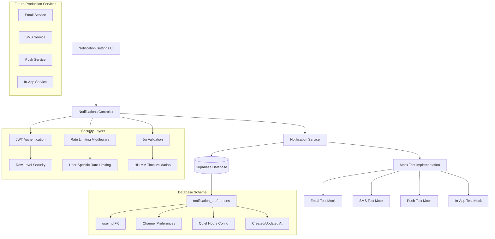

# Notifications Integration Guide

## Table of Contents
1. [Overview & Architecture](#overview--architecture)
2. [API Endpoints Reference](#api-endpoints-reference)
3. [State Management](#state-management)
4. [Complex UI Components](#complex-ui-components)
5. [Real-time Features](#real-time-features)
6. [Multi-Channel Integration](#multi-channel-integration)
7. [Performance Optimization](#performance-optimization)
8. [Error Handling & Recovery](#error-handling--recovery)
9. [Testing Strategies](#testing-strategies)
10. [Troubleshooting & FAQs](#troubleshooting--faqs)

---

## Overview & Architecture

### Feature Purpose

The Notifications feature provides comprehensive user notification preference management with support for multiple delivery channels (email, SMS, push, in-app), robust validation, rate limiting protection, and test functionality. This MVP-ready system enables users to configure their notification preferences across all channels, set quiet hours for reduced interruptions, and test notification delivery with infrastructure prepared for future notification service integration.

### Core Capabilities

**📧 Multi-Channel Support:**
- **Email Notifications:** Configurable email delivery preferences
- **SMS Notifications:** Text message delivery controls  
- **Push Notifications:** Mobile and web push notification settings
- **In-App Notifications:** Application-level notification management
- **Quiet Hours:** Time-based notification suppression (HH:MM format)

**⚙️ Preference Management:**
- **Granular Controls:** Per-channel enable/disable toggles
- **Default Settings:** Smart defaults (in-app enabled, others disabled)
- **Time-Based Rules:** Quiet hours with start/end time configuration
- **User Isolation:** Complete preference separation via RLS
- **Test Functionality:** Channel-specific test notification sending

**🔒 Security & Performance:**
- JWT authentication with Row Level Security (RLS) compliance
- Rate limiting (10 requests/hour for updates and tests)
- Input validation with time format constraints
- Comprehensive error handling and sanitized responses
- MVP mock implementation ready for production service integration

### Technical Architecture



### Database Schema Integration

**Primary Table:** `notification_preferences`
- **Primary Key:** `id` (UUID)
- **Foreign Key:** `user_id` references `auth.users(id)`
- **Unique Constraint:** `user_id` (one preference record per user)
- **RLS Policies:** Users can only access their own preferences

**Column Structure:**
- `email_enabled` (BOOLEAN) - Default: false
- `sms_enabled` (BOOLEAN) - Default: false  
- `push_enabled` (BOOLEAN) - Default: false
- `in_app_enabled` (BOOLEAN) - Default: true
- `quiet_hours_start` (TEXT) - HH:MM format with CHECK constraint
- `quiet_hours_end` (TEXT) - HH:MM format with CHECK constraint
- `created_at`, `updated_at` (TIMESTAMP) - Automatic timestamps

### Performance Characteristics

- **GET Preferences:** < 200ms (single indexed database query)
- **POST Preferences:** < 300ms (upsert operation with conflict resolution)
- **POST Test:** < 100ms (mock implementation with preference check)
- **Rate Limiting:** 10 requests per hour prevents abuse while allowing normal usage
- **Concurrent Users:** Designed for 1000+ simultaneous users
- **Database Load:** Minimal due to single-query operations and RLS indexes

---

## API Endpoints Reference

### GET /v1/notifications/preferences
**Purpose:** Retrieve user notification preferences with default value application

#### Request Configuration
```typescript
const getPreferences = async (token: string) => {
  const response = await fetch('/v1/notifications/preferences', {
    method: 'GET',
    headers: {
      'Authorization': `Bearer ${token}`,
      'Content-Type': 'application/json'
    }
  });

  if (!response.ok) {
    const error = await response.json();
    throw new Error(error.message);
  }

  return response.json();
};
```

#### Request Parameters
- **Authentication:** JWT Bearer token (required)
- **Path Parameters:** None
- **Query Parameters:** None
- **Body:** None (GET request)

#### Response Structure
```typescript
interface NotificationPreferences {
  email_enabled: boolean;      // Default: false
  sms_enabled: boolean;        // Default: false
  push_enabled: boolean;       // Default: false
  in_app_enabled: boolean;     // Default: true (only channel enabled by default)
  quiet_hours_start: string | null;  // HH:MM format or null
  quiet_hours_end: string | null;    // HH:MM format or null
}

interface GetPreferencesResponse {
  status: 'success';
  data: NotificationPreferences;
}
```

#### Default Values Applied
When no preferences exist for a user, the following defaults are applied:
- `email_enabled`: `false` - Email notifications disabled by default
- `sms_enabled`: `false` - SMS notifications disabled by default
- `push_enabled`: `false` - Push notifications disabled by default
- `in_app_enabled`: `true` - In-app notifications enabled by default
- `quiet_hours_start`: `null` - No quiet hours configured
- `quiet_hours_end`: `null` - No quiet hours configured

#### Error Responses
- **401 Unauthorized:** Missing or invalid JWT token
- **500 Internal Server Error:** Database or service failure

### POST /v1/notifications/preferences
**Purpose:** Update user notification preferences with upsert functionality

#### Request Configuration
```typescript
interface PreferencesUpdateRequest {
  email_enabled?: boolean;
  sms_enabled?: boolean;
  push_enabled?: boolean;
  in_app_enabled?: boolean;
  quiet_hours_start?: string;  // HH:MM format (e.g., "22:00")
  quiet_hours_end?: string;    // HH:MM format (e.g., "08:00")
}

const updatePreferences = async (
  preferences: PreferencesUpdateRequest, 
  token: string
) => {
  const response = await fetch('/v1/notifications/preferences', {
    method: 'POST',
    headers: {
      'Authorization': `Bearer ${token}`,
      'Content-Type': 'application/json'
    },
    body: JSON.stringify(preferences)
  });

  if (!response.ok) {
    const error = await response.json();
    throw new Error(error.message);
  }

  return response.json();
};
```

#### Request Validation
**Time Format Validation:**
- **Pattern:** `/^([01]\d|2[0-3]):([0-5]\d)$/`
- **Valid Range:** 00:00 to 23:59
- **Format:** HH:MM (24-hour format with leading zeros)
- **Valid Examples:** "09:30", "14:45", "23:59", "00:00"
- **Invalid Examples:** "25:30", "12:60", "9:30" (missing leading zero)

**Boolean Field Validation:**
- All channel preferences (`*_enabled`) accept boolean values
- Optional fields - omitted fields retain current values
- Partial updates supported (only send changed fields)

#### Response Structure
```typescript
interface UpdatePreferencesResponse {
  status: 'success';
  data: {
    id: string;                    // UUID primary key
    user_id: string;               // User UUID
    email_enabled: boolean;
    sms_enabled: boolean;
    push_enabled: boolean;
    in_app_enabled: boolean;
    quiet_hours_start: string | null;
    quiet_hours_end: string | null;
    created_at: string;            // ISO timestamp
    updated_at: string;            // ISO timestamp
  };
  message: 'Notification preferences updated successfully';
}
```

#### Rate Limiting
- **Limit:** 10 requests per hour per user
- **Shared Quota:** Updates and test notifications share the same limit
- **Headers Provided:**
  - `X-RateLimit-Limit`: 10
  - `X-RateLimit-Remaining`: Requests remaining in current window
  - `X-RateLimit-Reset`: Timestamp when window resets

#### Error Responses
- **400 Bad Request:** Invalid notification preferences (validation failed)
  ```json
  {
    "status": "error",
    "message": "Invalid notification preferences",
    "details": ["Quiet hours must be in HH:MM format (e.g., 14:30)"]
  }
  ```
- **401 Unauthorized:** Missing or invalid JWT token
- **429 Too Many Requests:** Rate limit exceeded
  ```json
  {
    "status": "error",
    "message": "Too many preference updates. Please try again later."
  }
  ```
- **500 Internal Server Error:** Database or service failure

### POST /v1/notifications/test
**Purpose:** Send test notification to verify channel functionality (MVP mock implementation)

#### Request Configuration
```typescript
interface TestNotificationRequest {
  channel: 'email' | 'sms' | 'push' | 'in_app';
}

const sendTestNotification = async (
  request: TestNotificationRequest, 
  token: string
) => {
  const response = await fetch('/v1/notifications/test', {
    method: 'POST',
    headers: {
      'Authorization': `Bearer ${token}`,
      'Content-Type': 'application/json'
    },
    body: JSON.stringify(request)
  });

  if (!response.ok) {
    const error = await response.json();
    throw new Error(error.message);
  }

  return response.json();
};
```

#### Request Parameters
- **channel** (required): Must be one of ['email', 'sms', 'push', 'in_app']
- Validation performed in controller with descriptive error messages

#### MVP Implementation Behavior
**Current Mock Behavior:**
```javascript
// Console logging for testing purposes
console.log(`[MOCK ${channel.toUpperCase()}]: Test notification for user ${userId}`);
```

**Preference Checking:**
1. Retrieves user's current preferences
2. Checks if the specified channel is enabled
3. Includes warning message if channel is disabled

#### Response Structure
```typescript
interface TestNotificationResponse {
  status: 'success';
  data: {
    success: true;
    message: string;  // Includes channel status warning if applicable
  };
  message: string;
}

// Example responses
const enabledChannelResponse = {
  status: 'success',
  data: {
    success: true,
    message: 'Test email notification logged'
  },
  message: 'Test email notification logged'
};

const disabledChannelResponse = {
  status: 'success',
  data: {
    success: true,
    message: 'Test email notification logged (Note: email notifications are currently disabled in your preferences)'
  },
  message: 'Test email notification logged'
};
```

#### Rate Limiting
- **Shared Limit:** Uses same 10 requests/hour quota as preference updates
- **Rationale:** Prevents test notification spam while allowing adequate testing

#### Error Responses
- **400 Bad Request:** Invalid notification channel specified
  ```json
  {
    "status": "error",
    "message": "Invalid notification channel. Must be one of: email, sms, push, in_app"
  }
  ```
- **401 Unauthorized:** Missing or invalid JWT token
- **429 Too Many Requests:** Rate limit exceeded (shared with preferences)
- **500 Internal Server Error:** Test notification failure

#### Future Production Implementation
The current mock implementation provides the foundation for production notification services:

```typescript
// Future production implementation structure
switch(channel) {
  case 'email':
    return await emailService.sendTestEmail(userId, testTemplate);
  case 'sms':
    return await smsService.sendTestSMS(userId, testMessage);
  case 'push':
    return await pushService.sendTestPush(userId, testPayload);
  case 'in_app':
    return await inAppService.createTestNotification(userId, testData);
}
```

---

## State Management

### Notification State Structure

```typescript
interface NotificationState {
  // Preference data
  preferences: {
    data: NotificationPreferences | null;
    isLoading: boolean;
    lastFetched: Date | null;
    hasChanges: boolean;
  };
  
  // Update operations
  updates: {
    isUpdating: boolean;
    pendingChanges: Partial<NotificationPreferences>;
    optimisticUpdates: boolean;
  };
  
  // Test functionality
  testing: {
    isTestingChannel: string | null;  // null or channel being tested
    lastTestResults: Record<string, TestResult>;
    testHistory: TestHistoryEntry[];
  };
  
  // UI state
  ui: {
    activeSection: 'preferences' | 'testing' | 'history';
    expandedChannels: Set<string>;
    showQuietHours: boolean;
    isDirty: boolean;
  };
  
  // Error state
  errors: {
    preferences: string | null;
    updates: string | null;
    testing: string | null;
    rateLimitHit: boolean;
    lastError: Date | null;
  };
  
  // Rate limiting tracking
  rateLimits: {
    remaining: number;
    resetTime: Date | null;
    isLimited: boolean;
  };
}

interface NotificationPreferences {
  email_enabled: boolean;
  sms_enabled: boolean;
  push_enabled: boolean;
  in_app_enabled: boolean;
  quiet_hours_start: string | null;
  quiet_hours_end: string | null;
}

interface TestResult {
  success: boolean;
  message: string;
  timestamp: Date;
  channelEnabled: boolean;
}

interface TestHistoryEntry {
  channel: string;
  timestamp: Date;
  success: boolean;
  message: string;
}
```

### State Management Implementation

**Using React Context + Reducer:**

```tsx
// NotificationContext.tsx
import React, { createContext, useContext, useReducer, useCallback } from 'react';
import { useAuth } from './AuthContext';

const NotificationContext = createContext<NotificationContextType | undefined>(undefined);

export const useNotifications = () => {
  const context = useContext(NotificationContext);
  if (!context) {
    throw new Error('useNotifications must be used within a NotificationProvider');
  }
  return context;
};

const initialState: NotificationState = {
  preferences: {
    data: null,
    isLoading: false,
    lastFetched: null,
    hasChanges: false
  },
  updates: {
    isUpdating: false,
    pendingChanges: {},
    optimisticUpdates: true
  },
  testing: {
    isTestingChannel: null,
    lastTestResults: {},
    testHistory: []
  },
  ui: {
    activeSection: 'preferences',
    expandedChannels: new Set(['email', 'push']),
    showQuietHours: false,
    isDirty: false
  },
  errors: {
    preferences: null,
    updates: null,
    testing: null,
    rateLimitHit: false,
    lastError: null
  },
  rateLimits: {
    remaining: 10,
    resetTime: null,
    isLimited: false
  }
};

const notificationReducer = (state: NotificationState, action: NotificationAction): NotificationState => {
  switch (action.type) {
    case 'FETCH_PREFERENCES_START':
      return {
        ...state,
        preferences: {
          ...state.preferences,
          isLoading: true
        },
        errors: { ...state.errors, preferences: null }
      };
      
    case 'FETCH_PREFERENCES_SUCCESS':
      return {
        ...state,
        preferences: {
          data: action.payload.preferences,
          isLoading: false,
          lastFetched: new Date(),
          hasChanges: false
        },
        ui: {
          ...state.ui,
          showQuietHours: !!(action.payload.preferences.quiet_hours_start || action.payload.preferences.quiet_hours_end)
        }
      };
      
    case 'UPDATE_PREFERENCES_START':
      return {
        ...state,
        updates: {
          ...state.updates,
          isUpdating: true,
          pendingChanges: action.payload.changes
        },
        errors: { ...state.errors, updates: null }
      };
      
    case 'UPDATE_PREFERENCES_SUCCESS':
      return {
        ...state,
        preferences: {
          ...state.preferences,
          data: action.payload.preferences,
          hasChanges: false
        },
        updates: {
          isUpdating: false,
          pendingChanges: {},
          optimisticUpdates: state.updates.optimisticUpdates
        },
        ui: { ...state.ui, isDirty: false }
      };
      
    case 'SET_PENDING_CHANGES':
      const newPreferences = state.updates.optimisticUpdates 
        ? { ...state.preferences.data, ...action.payload.changes }
        : state.preferences.data;
        
      return {
        ...state,
        preferences: {
          ...state.preferences,
          data: newPreferences,
          hasChanges: true
        },
        updates: {
          ...state.updates,
          pendingChanges: { ...state.updates.pendingChanges, ...action.payload.changes }
        },
        ui: { ...state.ui, isDirty: true }
      };
      
    case 'TEST_NOTIFICATION_START':
      return {
        ...state,
        testing: {
          ...state.testing,
          isTestingChannel: action.payload.channel
        },
        errors: { ...state.errors, testing: null }
      };
      
    case 'TEST_NOTIFICATION_SUCCESS':
      const testResult: TestResult = {
        success: action.payload.result.success,
        message: action.payload.result.message,
        timestamp: new Date(),
        channelEnabled: state.preferences.data?.[`${action.payload.channel}_enabled` as keyof NotificationPreferences] as boolean || false
      };
      
      return {
        ...state,
        testing: {
          isTestingChannel: null,
          lastTestResults: {
            ...state.testing.lastTestResults,
            [action.payload.channel]: testResult
          },
          testHistory: [
            {
              channel: action.payload.channel,
              timestamp: testResult.timestamp,
              success: testResult.success,
              message: testResult.message
            },
            ...state.testing.testHistory.slice(0, 9) // Keep last 10 entries
          ]
        }
      };
      
    case 'SET_ERROR':
      return {
        ...state,
        preferences: action.payload.type === 'preferences' ? { ...state.preferences, isLoading: false } : state.preferences,
        updates: action.payload.type === 'updates' ? { ...state.updates, isUpdating: false } : state.updates,
        testing: action.payload.type === 'testing' ? { ...state.testing, isTestingChannel: null } : state.testing,
        errors: {
          ...state.errors,
          [action.payload.type]: action.payload.message,
          rateLimitHit: action.payload.isRateLimit || false,
          lastError: new Date()
        }
      };
      
    case 'UPDATE_RATE_LIMITS':
      return {
        ...state,
        rateLimits: {
          remaining: action.payload.remaining,
          resetTime: action.payload.resetTime,
          isLimited: action.payload.remaining <= 0
        }
      };
      
    case 'SET_UI_STATE':
      return {
        ...state,
        ui: { ...state.ui, ...action.payload }
      };
      
    case 'CLEAR_ERRORS':
      return {
        ...state,
        errors: {
          preferences: null,
          updates: null,
          testing: null,
          rateLimitHit: false,
          lastError: null
        }
      };
      
    default:
      return state;
  }
};

export const NotificationProvider: React.FC<{ children: React.ReactNode }> = ({ children }) => {
  const [state, dispatch] = useReducer(notificationReducer, initialState);
  const { user } = useAuth();

  // Fetch preferences
  const fetchPreferences = useCallback(async () => {
    if (!user?.jwtToken) {
      dispatch({ type: 'SET_ERROR', payload: { type: 'preferences', message: 'Authentication required' } });
      return;
    }

    dispatch({ type: 'FETCH_PREFERENCES_START' });

    try {
      const response = await fetch('/v1/notifications/preferences', {
        headers: {
          'Authorization': `Bearer ${user.jwtToken}`,
          'Content-Type': 'application/json'
        }
      });

      if (!response.ok) {
        const error = await response.json();
        throw new Error(error.message);
      }

      const result = await response.json();
      dispatch({ 
        type: 'FETCH_PREFERENCES_SUCCESS', 
        payload: { preferences: result.data } 
      });

      return result.data;

    } catch (error) {
      const errorMessage = error instanceof Error ? error.message : 'Failed to fetch preferences';
      dispatch({ 
        type: 'SET_ERROR', 
        payload: { type: 'preferences', message: errorMessage } 
      });
      throw error;
    }
  }, [user?.jwtToken]);

  // Update preferences
  const updatePreferences = useCallback(async (changes: Partial<NotificationPreferences>) => {
    if (!user?.jwtToken) {
      dispatch({ type: 'SET_ERROR', payload: { type: 'updates', message: 'Authentication required' } });
      return;
    }

    dispatch({ type: 'UPDATE_PREFERENCES_START', payload: { changes } });

    try {
      const response = await fetch('/v1/notifications/preferences', {
        method: 'POST',
        headers: {
          'Authorization': `Bearer ${user.jwtToken}`,
          'Content-Type': 'application/json'
        },
        body: JSON.stringify(changes)
      });

      if (!response.ok) {
        const error = await response.json();
        if (response.status === 429) {
          throw new Error('Rate limit exceeded. Please try again later.');
        }
        throw new Error(error.message);
      }

      // Update rate limits from headers
      const remaining = parseInt(response.headers.get('X-RateLimit-Remaining') || '10');
      const resetTime = response.headers.get('X-RateLimit-Reset');
      
      dispatch({
        type: 'UPDATE_RATE_LIMITS',
        payload: {
          remaining,
          resetTime: resetTime ? new Date(parseInt(resetTime) * 1000) : null
        }
      });

      const result = await response.json();
      dispatch({ 
        type: 'UPDATE_PREFERENCES_SUCCESS', 
        payload: { preferences: result.data } 
      });

      return result.data;

    } catch (error) {
      const errorMessage = error instanceof Error ? error.message : 'Failed to update preferences';
      const isRateLimit = errorMessage.includes('rate limit') || errorMessage.includes('Rate limit');
      
      dispatch({ 
        type: 'SET_ERROR', 
        payload: { 
          type: 'updates', 
          message: errorMessage,
          isRateLimit
        } 
      });
      throw error;
    }
  }, [user?.jwtToken]);

  // Test notification
  const testNotification = useCallback(async (channel: string) => {
    if (!user?.jwtToken) {
      dispatch({ type: 'SET_ERROR', payload: { type: 'testing', message: 'Authentication required' } });
      return;
    }

    dispatch({ type: 'TEST_NOTIFICATION_START', payload: { channel } });

    try {
      const response = await fetch('/v1/notifications/test', {
        method: 'POST',
        headers: {
          'Authorization': `Bearer ${user.jwtToken}`,
          'Content-Type': 'application/json'
        },
        body: JSON.stringify({ channel })
      });

      if (!response.ok) {
        const error = await response.json();
        if (response.status === 429) {
          throw new Error('Rate limit exceeded. Please try again later.');
        }
        throw new Error(error.message);
      }

      // Update rate limits from headers
      const remaining = parseInt(response.headers.get('X-RateLimit-Remaining') || '10');
      const resetTime = response.headers.get('X-RateLimit-Reset');
      
      dispatch({
        type: 'UPDATE_RATE_LIMITS',
        payload: {
          remaining,
          resetTime: resetTime ? new Date(parseInt(resetTime) * 1000) : null
        }
      });

      const result = await response.json();
      dispatch({ 
        type: 'TEST_NOTIFICATION_SUCCESS', 
        payload: { 
          channel, 
          result: result.data 
        } 
      });

      return result.data;

    } catch (error) {
      const errorMessage = error instanceof Error ? error.message : 'Test notification failed';
      const isRateLimit = errorMessage.includes('rate limit') || errorMessage.includes('Rate limit');
      
      dispatch({ 
        type: 'SET_ERROR', 
        payload: { 
          type: 'testing', 
          message: errorMessage,
          isRateLimit
        } 
      });
      throw error;
    }
  }, [user?.jwtToken]);

  // Set pending changes (for optimistic updates)
  const setPendingChanges = useCallback((changes: Partial<NotificationPreferences>) => {
    dispatch({ type: 'SET_PENDING_CHANGES', payload: { changes } });
  }, []);

  const value = {
    state,
    dispatch,
    fetchPreferences,
    updatePreferences,
    testNotification,
    setPendingChanges
  };

  return (
    <NotificationContext.Provider value={value}>
      {children}
    </NotificationContext.Provider>
  );
};
``` 

---

## Complex UI Components

### Notification Preferences Panel

```tsx
// NotificationPreferencesPanel.tsx
import React, { useState, useEffect, useCallback } from 'react';
import { useNotifications } from '../contexts/NotificationContext';

export const NotificationPreferencesPanel: React.FC = () => {
  const { 
    state, 
    fetchPreferences, 
    updatePreferences, 
    setPendingChanges,
    testNotification 
  } = useNotifications();
  
  const [localChanges, setLocalChanges] = useState<Partial<NotificationPreferences>>({});
  const [validationErrors, setValidationErrors] = useState<Record<string, string>>({});

  // Load preferences on mount
  useEffect(() => {
    fetchPreferences();
  }, [fetchPreferences]);

  // Time format validation
  const validateTimeFormat = useCallback((time: string): boolean => {
    const timePattern = /^([01]\d|2[0-3]):([0-5]\d)$/;
    return timePattern.test(time);
  }, []);

  // Handle preference changes with validation
  const handlePreferenceChange = useCallback((
    field: keyof NotificationPreferences, 
    value: boolean | string
  ) => {
    const newChanges = { ...localChanges, [field]: value };
    
    // Validate time fields
    if ((field === 'quiet_hours_start' || field === 'quiet_hours_end') && value) {
      if (!validateTimeFormat(value as string)) {
        setValidationErrors(prev => ({
          ...prev,
          [field]: 'Time must be in HH:MM format (e.g., 14:30)'
        }));
        return;
      } else {
        setValidationErrors(prev => {
          const updated = { ...prev };
          delete updated[field];
          return updated;
        });
      }
    }
    
    setLocalChanges(newChanges);
    setPendingChanges(newChanges);
  }, [localChanges, setPendingChanges, validateTimeFormat]);

  // Save changes
  const handleSave = useCallback(async () => {
    if (Object.keys(validationErrors).length > 0) {
      return;
    }

    try {
      await updatePreferences(localChanges);
      setLocalChanges({});
    } catch (error) {
      // Error handling managed by context
    }
  }, [localChanges, updatePreferences, validationErrors]);

  // Cancel changes
  const handleCancel = useCallback(() => {
    setLocalChanges({});
    setValidationErrors({});
    setPendingChanges({});
  }, [setPendingChanges]);

  const hasChanges = Object.keys(localChanges).length > 0;
  const canSave = hasChanges && Object.keys(validationErrors).length === 0;

  if (state.preferences.isLoading) {
    return <LoadingSpinner message="Loading notification preferences..." />;
  }

  const preferences = state.preferences.data;
  if (!preferences) {
    return <ErrorMessage message="Failed to load notification preferences" />;
  }

  return (
    <div className="notification-preferences-panel bg-white shadow-lg rounded-lg p-6">
      <div className="flex justify-between items-center mb-6">
        <h2 className="text-2xl font-bold text-gray-900">Notification Preferences</h2>
        
        {state.rateLimits.isLimited && (
          <div className="flex items-center text-yellow-600 bg-yellow-50 px-3 py-1 rounded-md">
            <span className="mr-2">⚠️</span>
            <span className="text-sm">
              Rate limited. Try again {state.rateLimits.resetTime && (
                <>after {state.rateLimits.resetTime.toLocaleTimeString()}</>
              )}
            </span>
          </div>
        )}
      </div>

      {/* Channel Preferences */}
      <div className="space-y-6">
        <ChannelToggle
          channel="email"
          label="Email Notifications"
          icon="📧"
          description="Receive notifications via email"
          enabled={preferences.email_enabled}
          onChange={(enabled) => handlePreferenceChange('email_enabled', enabled)}
          onTest={() => testNotification('email')}
          testResult={state.testing.lastTestResults.email}
          isTesting={state.testing.isTestingChannel === 'email'}
        />

        <ChannelToggle
          channel="sms"
          label="SMS Notifications"
          icon="📱"
          description="Receive notifications via text message"
          enabled={preferences.sms_enabled}
          onChange={(enabled) => handlePreferenceChange('sms_enabled', enabled)}
          onTest={() => testNotification('sms')}
          testResult={state.testing.lastTestResults.sms}
          isTesting={state.testing.isTestingChannel === 'sms'}
        />

        <ChannelToggle
          channel="push"
          label="Push Notifications"
          icon="🔔"
          description="Receive push notifications on your devices"
          enabled={preferences.push_enabled}
          onChange={(enabled) => handlePreferenceChange('push_enabled', enabled)}
          onTest={() => testNotification('push')}
          testResult={state.testing.lastTestResults.push}
          isTesting={state.testing.isTestingChannel === 'push'}
        />

        <ChannelToggle
          channel="in_app"
          label="In-App Notifications"
          icon="🔴"
          description="Show notifications within the application"
          enabled={preferences.in_app_enabled}
          onChange={(enabled) => handlePreferenceChange('in_app_enabled', enabled)}
          onTest={() => testNotification('in_app')}
          testResult={state.testing.lastTestResults.in_app}
          isTesting={state.testing.isTestingChannel === 'in_app'}
        />
      </div>

      {/* Quiet Hours Configuration */}
      <div className="mt-8 border-t pt-6">
        <h3 className="text-lg font-medium text-gray-900 mb-4">Quiet Hours</h3>
        
        <div className="grid grid-cols-1 md:grid-cols-2 gap-4">
          <TimeInput
            label="Start Time"
            value={preferences.quiet_hours_start || ''}
            onChange={(value) => handlePreferenceChange('quiet_hours_start', value || null)}
            error={validationErrors.quiet_hours_start}
            placeholder="22:00"
          />
          
          <TimeInput
            label="End Time"
            value={preferences.quiet_hours_end || ''}
            onChange={(value) => handlePreferenceChange('quiet_hours_end', value || null)}
            error={validationErrors.quiet_hours_end}
            placeholder="08:00"
          />
        </div>
        
        <p className="text-sm text-gray-500 mt-2">
          Notifications will be suppressed during quiet hours. Leave empty to disable.
        </p>
      </div>

      {/* Action Buttons */}
      <div className="mt-8 flex justify-end space-x-3">
        {hasChanges && (
          <button
            onClick={handleCancel}
            className="px-4 py-2 text-gray-700 bg-gray-100 border border-gray-300 rounded-md hover:bg-gray-200 transition-colors"
            disabled={state.updates.isUpdating}
          >
            Cancel
          </button>
        )}
        
        <button
          onClick={handleSave}
          disabled={!canSave || state.updates.isUpdating || state.rateLimits.isLimited}
          className="px-6 py-2 bg-blue-600 text-white rounded-md hover:bg-blue-700 disabled:opacity-50 disabled:cursor-not-allowed transition-colors flex items-center"
        >
          {state.updates.isUpdating ? (
            <>
              <div className="animate-spin rounded-full h-4 w-4 border-b-2 border-white mr-2"></div>
              Saving...
            </>
          ) : (
            'Save Changes'
          )}
        </button>
      </div>

      {/* Error Display */}
      {state.errors.updates && (
        <div className="mt-4 p-3 bg-red-50 border border-red-200 rounded-md">
          <p className="text-sm text-red-700">
            <span className="font-medium">Error:</span> {state.errors.updates}
          </p>
        </div>
      )}
    </div>
  );
};
```

### Channel Toggle Component

```tsx
// ChannelToggle.tsx
interface ChannelToggleProps {
  channel: string;
  label: string;
  icon: string;
  description: string;
  enabled: boolean;
  onChange: (enabled: boolean) => void;
  onTest: () => void;
  testResult?: TestResult;
  isTesting: boolean;
}

export const ChannelToggle: React.FC<ChannelToggleProps> = ({
  channel,
  label,
  icon,
  description,
  enabled,
  onChange,
  onTest,
  testResult,
  isTesting
}) => {
  const { state } = useNotifications();
  
  return (
    <div className="flex items-center justify-between p-4 border border-gray-200 rounded-lg hover:bg-gray-50 transition-colors">
      <div className="flex items-center space-x-4">
        <div className="text-2xl">{icon}</div>
        
        <div className="flex-1">
          <div className="flex items-center space-x-3">
            <h4 className="font-medium text-gray-900">{label}</h4>
            
            <label className="relative inline-flex items-center cursor-pointer">
              <input
                type="checkbox"
                checked={enabled}
                onChange={(e) => onChange(e.target.checked)}
                className="sr-only peer"
              />
              <div className="w-11 h-6 bg-gray-200 peer-focus:outline-none peer-focus:ring-4 peer-focus:ring-blue-300 rounded-full peer peer-checked:after:translate-x-full peer-checked:after:border-white after:content-[''] after:absolute after:top-[2px] after:left-[2px] after:bg-white after:border-gray-300 after:border after:rounded-full after:h-5 after:w-5 after:transition-all peer-checked:bg-blue-600"></div>
            </label>
          </div>
          
          <p className="text-sm text-gray-500 mt-1">{description}</p>
          
          {/* Test Result Display */}
          {testResult && (
            <div className={`mt-2 text-xs px-2 py-1 rounded ${
              testResult.success 
                ? testResult.channelEnabled 
                  ? 'bg-green-50 text-green-700' 
                  : 'bg-yellow-50 text-yellow-700'
                : 'bg-red-50 text-red-700'
            }`}>
              <span className="font-medium">Last test:</span> {testResult.message}
              <span className="ml-2 text-gray-500">
                ({testResult.timestamp.toLocaleTimeString()})
              </span>
            </div>
          )}
        </div>
      </div>
      
      <div className="flex items-center space-x-2">
        <button
          onClick={onTest}
          disabled={isTesting || state.rateLimits.isLimited}
          className="px-3 py-1 text-sm text-blue-600 bg-blue-50 border border-blue-200 rounded-md hover:bg-blue-100 disabled:opacity-50 disabled:cursor-not-allowed transition-colors"
        >
          {isTesting ? (
            <>
              <div className="animate-spin rounded-full h-3 w-3 border-b-2 border-blue-600 mr-1 inline-block"></div>
              Testing...
            </>
          ) : (
            'Test'
          )}
        </button>
      </div>
    </div>
  );
};
```

### Time Input Component

```tsx
// TimeInput.tsx
interface TimeInputProps {
  label: string;
  value: string;
  onChange: (value: string) => void;
  error?: string;
  placeholder?: string;
}

export const TimeInput: React.FC<TimeInputProps> = ({
  label,
  value,
  onChange,
  error,
  placeholder
}) => {
  return (
    <div>
      <label className="block text-sm font-medium text-gray-700 mb-1">
        {label}
      </label>
      
      <input
        type="time"
        value={value}
        onChange={(e) => onChange(e.target.value)}
        placeholder={placeholder}
        className={`w-full px-3 py-2 border rounded-md shadow-sm focus:outline-none focus:ring-2 focus:ring-blue-500 focus:border-blue-500 ${
          error 
            ? 'border-red-300 focus:ring-red-500 focus:border-red-500' 
            : 'border-gray-300'
        }`}
      />
      
      {error && (
        <p className="mt-1 text-sm text-red-600">{error}</p>
      )}
    </div>
  );
};
```

### Test History Component

```tsx
// TestHistoryComponent.tsx
export const TestHistoryComponent: React.FC = () => {
  const { state } = useNotifications();
  
  if (state.testing.testHistory.length === 0) {
    return (
      <div className="bg-gray-50 rounded-lg p-6 text-center">
        <div className="text-4xl mb-2">🧪</div>
        <h3 className="text-lg font-medium text-gray-900 mb-1">No Test History</h3>
        <p className="text-gray-500">Test notifications will appear here</p>
      </div>
    );
  }

  return (
    <div className="bg-white shadow-lg rounded-lg p-6">
      <h3 className="text-lg font-medium text-gray-900 mb-4">Test History</h3>
      
      <div className="space-y-3">
        {state.testing.testHistory.map((entry, index) => (
          <div 
            key={index}
            className="flex items-center justify-between p-3 bg-gray-50 rounded-md"
          >
            <div className="flex items-center space-x-3">
              <div className="text-lg">
                {entry.channel === 'email' && '📧'}
                {entry.channel === 'sms' && '📱'}
                {entry.channel === 'push' && '🔔'}
                {entry.channel === 'in_app' && '🔴'}
              </div>
              
              <div>
                <p className="text-sm font-medium text-gray-900 capitalize">
                  {entry.channel} Test
                </p>
                <p className="text-xs text-gray-500">
                  {entry.timestamp.toLocaleString()}
                </p>
              </div>
            </div>
            
            <div className={`px-2 py-1 rounded text-xs ${
              entry.success 
                ? 'bg-green-100 text-green-800' 
                : 'bg-red-100 text-red-800'
            }`}>
              {entry.success ? 'Success' : 'Failed'}
            </div>
          </div>
        ))}
      </div>
    </div>
  );
};
```

---

## Real-time Features

### Rate Limiting Display

```tsx
// RateLimitDisplay.tsx
export const RateLimitDisplay: React.FC = () => {
  const { state } = useNotifications();
  const [timeUntilReset, setTimeUntilReset] = useState<string>('');

  useEffect(() => {
    if (!state.rateLimits.resetTime) return;

    const updateTimer = () => {
      const now = new Date();
      const reset = state.rateLimits.resetTime!;
      const diff = reset.getTime() - now.getTime();
      
      if (diff <= 0) {
        setTimeUntilReset('');
        return;
      }
      
      const minutes = Math.floor(diff / 60000);
      const seconds = Math.floor((diff % 60000) / 1000);
      setTimeUntilReset(`${minutes}:${seconds.toString().padStart(2, '0')}`);
    };

    updateTimer();
    const interval = setInterval(updateTimer, 1000);
    
    return () => clearInterval(interval);
  }, [state.rateLimits.resetTime]);

  if (state.rateLimits.remaining === 10) {
    return null; // Full quota, no need to show
  }

  return (
    <div className={`flex items-center justify-between p-3 rounded-md ${
      state.rateLimits.isLimited 
        ? 'bg-red-50 border border-red-200' 
        : 'bg-blue-50 border border-blue-200'
    }`}>
      <div className="flex items-center space-x-2">
        <span className="text-lg">⏱️</span>
        <div>
          <p className={`text-sm font-medium ${
            state.rateLimits.isLimited ? 'text-red-800' : 'text-blue-800'
          }`}>
            {state.rateLimits.remaining} requests remaining
          </p>
          {timeUntilReset && (
            <p className={`text-xs ${
              state.rateLimits.isLimited ? 'text-red-600' : 'text-blue-600'
            }`}>
              Resets in {timeUntilReset}
            </p>
          )}
        </div>
      </div>
      
      <div className={`w-16 h-2 rounded-full ${
        state.rateLimits.isLimited ? 'bg-red-200' : 'bg-blue-200'
      }`}>
        <div 
          className={`h-2 rounded-full transition-all duration-300 ${
            state.rateLimits.isLimited ? 'bg-red-500' : 'bg-blue-500'
          }`}
          style={{ width: `${(state.rateLimits.remaining / 10) * 100}%` }}
        />
      </div>
    </div>
  );
};
```

### Live Test Results

```tsx
// LiveTestResults.tsx
export const LiveTestResults: React.FC = () => {
  const { state } = useNotifications();
  const [showResults, setShowResults] = useState(false);

  // Show results when a test completes
  useEffect(() => {
    const hasRecentResults = Object.values(state.testing.lastTestResults).some(
      result => result && new Date().getTime() - result.timestamp.getTime() < 5000
    );
    
    setShowResults(hasRecentResults);
    
    if (hasRecentResults) {
      const timer = setTimeout(() => setShowResults(false), 5000);
      return () => clearTimeout(timer);
    }
  }, [state.testing.lastTestResults]);

  if (!showResults) return null;

  return (
    <div className="fixed bottom-4 right-4 max-w-sm bg-white shadow-lg border border-gray-200 rounded-lg p-4 z-50">
      <div className="flex items-center justify-between mb-2">
        <h4 className="font-medium text-gray-900">Test Results</h4>
        <button
          onClick={() => setShowResults(false)}
          className="text-gray-400 hover:text-gray-600"
        >
          <svg className="w-4 h-4" fill="currentColor" viewBox="0 0 20 20">
            <path fillRule="evenodd" d="M4.293 4.293a1 1 0 011.414 0L10 8.586l4.293-4.293a1 1 0 111.414 1.414L11.414 10l4.293 4.293a1 1 0 01-1.414 1.414L10 11.414l-4.293 4.293a1 1 0 01-1.414-1.414L8.586 10 4.293 5.707a1 1 0 010-1.414z" clipRule="evenodd" />
          </svg>
        </button>
      </div>
      
      <div className="space-y-2">
        {Object.entries(state.testing.lastTestResults)
          .filter(([_, result]) => result && new Date().getTime() - result.timestamp.getTime() < 5000)
          .map(([channel, result]) => (
            <div key={channel} className="flex items-center space-x-2">
              <div className={`w-2 h-2 rounded-full ${
                result.success ? 'bg-green-500' : 'bg-red-500'
              }`} />
              
              <span className="text-sm capitalize">{channel}</span>
              
              <span className={`text-xs px-2 py-1 rounded ${
                result.success 
                  ? result.channelEnabled 
                    ? 'bg-green-50 text-green-700' 
                    : 'bg-yellow-50 text-yellow-700'
                  : 'bg-red-50 text-red-700'
              }`}>
                {result.success ? (result.channelEnabled ? 'Sent' : 'Disabled') : 'Failed'}
              </span>
            </div>
          ))}
      </div>
    </div>
  );
};
```

---

## Multi-Channel Integration

### Channel Configuration Matrix

```tsx
// ChannelConfigurationMatrix.tsx
export const ChannelConfigurationMatrix: React.FC = () => {
  const { state } = useNotifications();
  
  const channels = [
    {
      id: 'email',
      name: 'Email',
      icon: '📧',
      description: 'Email notifications with rich formatting',
      features: ['Rich HTML', 'Attachments', 'Unsubscribe Links', 'Tracking'],
      mvpStatus: 'Mock Implementation',
      productionServices: ['AWS SES', 'SendGrid', 'Mailgun']
    },
    {
      id: 'sms',
      name: 'SMS',
      icon: '📱',
      description: 'Text message notifications',
      features: ['Plain Text', 'International', 'Delivery Reports', 'Opt-out'],
      mvpStatus: 'Mock Implementation',
      productionServices: ['Twilio', 'AWS SNS', 'MessageBird']
    },
    {
      id: 'push',
      name: 'Push',
      icon: '🔔',
      description: 'Mobile and web push notifications',
      features: ['Rich Media', 'Actions', 'Badges', 'Deep Links'],
      mvpStatus: 'Mock Implementation',
      productionServices: ['Firebase FCM', 'Apple APN', 'Web Push API']
    },
    {
      id: 'in_app',
      name: 'In-App',
      icon: '🔴',
      description: 'Application-level notifications',
      features: ['Real-time', 'Interactive', 'Persistent', 'Actionable'],
      mvpStatus: 'Ready for Implementation',
      productionServices: ['WebSocket', 'Server-Sent Events', 'Custom']
    }
  ];

  const preferences = state.preferences.data;

  return (
    <div className="bg-white shadow-lg rounded-lg p-6">
      <h3 className="text-lg font-medium text-gray-900 mb-6">Channel Configuration</h3>
      
      <div className="grid grid-cols-1 lg:grid-cols-2 gap-6">
        {channels.map((channel) => (
          <div key={channel.id} className="border border-gray-200 rounded-lg p-4">
            <div className="flex items-center space-x-3 mb-3">
              <div className="text-2xl">{channel.icon}</div>
              <div>
                <h4 className="font-medium text-gray-900">{channel.name}</h4>
                <div className="flex items-center space-x-2">
                  <div className={`w-2 h-2 rounded-full ${
                    preferences?.[`${channel.id}_enabled` as keyof NotificationPreferences]
                      ? 'bg-green-500' 
                      : 'bg-gray-300'
                  }`} />
                  <span className="text-sm text-gray-500">
                    {preferences?.[`${channel.id}_enabled` as keyof NotificationPreferences] ? 'Enabled' : 'Disabled'}
                  </span>
                </div>
              </div>
            </div>
            
            <p className="text-sm text-gray-600 mb-3">{channel.description}</p>
            
            <div className="space-y-2">
              <div>
                <h5 className="text-xs font-medium text-gray-700 mb-1">Features</h5>
                <div className="flex flex-wrap gap-1">
                  {channel.features.map((feature) => (
                    <span
                      key={feature}
                      className="px-2 py-1 text-xs bg-blue-50 text-blue-700 rounded"
                    >
                      {feature}
                    </span>
                  ))}
                </div>
              </div>
              
              <div>
                <h5 className="text-xs font-medium text-gray-700 mb-1">Status</h5>
                <span className={`px-2 py-1 text-xs rounded ${
                  channel.mvpStatus === 'Ready for Implementation'
                    ? 'bg-green-50 text-green-700'
                    : 'bg-yellow-50 text-yellow-700'
                }`}>
                  {channel.mvpStatus}
                </span>
              </div>
              
              <div>
                <h5 className="text-xs font-medium text-gray-700 mb-1">Production Options</h5>
                <div className="flex flex-wrap gap-1">
                  {channel.productionServices.map((service) => (
                    <span
                      key={service}
                      className="px-2 py-1 text-xs bg-gray-50 text-gray-600 rounded"
                    >
                      {service}
                    </span>
                  ))}
                </div>
              </div>
            </div>
          </div>
        ))}
      </div>
    </div>
  );
};
```

### Future Service Integration Patterns

```typescript
// Future production service integration patterns
export const NotificationServiceIntegration = {
  // Email service integration
  email: {
    sendGrid: {
      setup: `
        import sgMail from '@sendgrid/mail';
        sgMail.setApiKey(process.env.SENDGRID_API_KEY);
      `,
      implementation: `
        const emailService = {
          async sendTestEmail(userId: string, template: string) {
            const msg = {
              to: user.email,
              from: 'noreply@trainer.app',
              subject: 'Test Notification',
              html: template
            };
            return await sgMail.send(msg);
          }
        };
      `
    },
    
    awsSes: {
      setup: `
        import AWS from 'aws-sdk';
        const ses = new AWS.SES({ region: 'us-east-1' });
      `,
      implementation: `
        const emailService = {
          async sendTestEmail(userId: string, template: string) {
            const params = {
              Source: 'noreply@trainer.app',
              Destination: { ToAddresses: [user.email] },
              Message: {
                Subject: { Data: 'Test Notification' },
                Body: { Html: { Data: template } }
              }
            };
            return await ses.sendEmail(params).promise();
          }
        };
      `
    }
  },

  // SMS service integration
  sms: {
    twilio: {
      setup: `
        import twilio from 'twilio';
        const client = twilio(accountSid, authToken);
      `,
      implementation: `
        const smsService = {
          async sendTestSMS(userId: string, message: string) {
            return await client.messages.create({
              body: message,
              from: '+1234567890',
              to: user.phoneNumber
            });
          }
        };
      `
    }
  },

  // Push notification integration
  push: {
    firebase: {
      setup: `
        import admin from 'firebase-admin';
        admin.initializeApp({
          credential: admin.credential.cert(serviceAccount)
        });
      `,
      implementation: `
        const pushService = {
          async sendTestPush(userId: string, payload: any) {
            const message = {
              notification: {
                title: 'Test Notification',
                body: payload.message
              },
              token: user.fcmToken
            };
            return await admin.messaging().send(message);
          }
        };
      `
    }
  },

  // In-app notification integration
  inApp: {
    websocket: {
      setup: `
        import { Server } from 'socket.io';
        const io = new Server(server);
      `,
      implementation: `
        const inAppService = {
          async createTestNotification(userId: string, data: any) {
            io.to(userId).emit('notification', {
              type: 'test',
              message: data.message,
              timestamp: new Date()
            });
          }
        };
      `
    }
  }
};
```

---

## Performance Optimization

### Efficient State Updates

```typescript
// Optimized notification state management
export const NotificationOptimizations = {
  // Debounced preference updates
  debouncedUpdate: debounce(async (changes: Partial<NotificationPreferences>) => {
    await updatePreferences(changes);
  }, 1000),

  // Optimistic updates for better UX
  optimisticUpdate: (currentState: NotificationState, changes: Partial<NotificationPreferences>) => {
    return {
      ...currentState,
      preferences: {
        ...currentState.preferences,
        data: { ...currentState.preferences.data, ...changes },
        hasChanges: true
      }
    };
  },

  // Efficient rate limit tracking
  updateRateLimits: (headers: Headers) => {
    const remaining = parseInt(headers.get('X-RateLimit-Remaining') || '10');
    const resetTime = headers.get('X-RateLimit-Reset');
    
    return {
      remaining,
      resetTime: resetTime ? new Date(parseInt(resetTime) * 1000) : null,
      isLimited: remaining <= 0
    };
  },

  // Memory-efficient test history
  addToTestHistory: (
    history: TestHistoryEntry[], 
    newEntry: TestHistoryEntry
  ): TestHistoryEntry[] => {
    return [newEntry, ...history.slice(0, 9)]; // Keep only last 10 entries
  }
};
```

### Lazy Loading and Code Splitting

```tsx
// Lazy load notification components
const NotificationPreferencesPanel = lazy(() => 
  import('./NotificationPreferencesPanel').then(module => ({ 
    default: module.NotificationPreferencesPanel 
  }))
);

const TestHistoryComponent = lazy(() => 
  import('./TestHistoryComponent').then(module => ({ 
    default: module.TestHistoryComponent 
  }))
);

// Main notifications page with lazy loading
export const NotificationsPage: React.FC = () => {
  return (
    <div className="notifications-page">
      <Suspense fallback={<LoadingSpinner />}>
        <NotificationPreferencesPanel />
      </Suspense>
      
      <Suspense fallback={<div className="h-32 bg-gray-50 rounded-lg animate-pulse" />}>
        <TestHistoryComponent />
      </Suspense>
    </div>
  );
};
```

### Caching Strategies

```typescript
// Notification preferences caching
export const useNotificationCache = () => {
  const cacheKey = 'notification_preferences';
  const cacheDuration = 5 * 60 * 1000; // 5 minutes
  
  const getCachedPreferences = (): NotificationPreferences | null => {
    const cached = localStorage.getItem(cacheKey);
    if (!cached) return null;
    
    try {
      const parsed = JSON.parse(cached);
      if (Date.now() - parsed.timestamp > cacheDuration) {
        localStorage.removeItem(cacheKey);
        return null;
      }
      return parsed.data;
    } catch {
      localStorage.removeItem(cacheKey);
      return null;
    }
  };

  const setCachedPreferences = (preferences: NotificationPreferences) => {
    const cacheData = {
      data: preferences,
      timestamp: Date.now()
    };
    localStorage.setItem(cacheKey, JSON.stringify(cacheData));
  };

  const clearCache = () => {
    localStorage.removeItem(cacheKey);
  };

  return { getCachedPreferences, setCachedPreferences, clearCache };
};
```

---

## Error Handling & Recovery

### Comprehensive Error Classification

```typescript
// Notification-specific error handling
export class NotificationError extends Error {
  constructor(
    message: string,
    public code: string,
    public type: 'preferences' | 'testing' | 'rate_limit',
    public statusCode?: number,
    public retryable: boolean = false,
    public retryAfter?: number
  ) {
    super(message);
    this.name = 'NotificationError';
  }
}

export const classifyNotificationError = (error: any, type: 'preferences' | 'testing'): NotificationError => {
  // Rate limiting errors
  if (error.status === 429) {
    return new NotificationError(
      'Too many requests. Please try again later.',
      'RATE_LIMIT_EXCEEDED',
      'rate_limit',
      429,
      true,
      3600 // 1 hour retry after
    );
  }
  
  // Validation errors
  if (error.status === 400) {
    if (error.message?.includes('time format') || error.message?.includes('HH:MM')) {
      return new NotificationError(
        'Invalid time format. Please use HH:MM format (e.g., 14:30)',
        'INVALID_TIME_FORMAT',
        type,
        400,
        false
      );
    }
    
    if (error.message?.includes('channel')) {
      return new NotificationError(
        'Invalid notification channel. Must be email, sms, push, or in_app',
        'INVALID_CHANNEL',
        'testing',
        400,
        false
      );
    }
  }
  
  // Authentication errors
  if (error.status === 401) {
    return new NotificationError(
      'Authentication required. Please log in again.',
      'AUTHENTICATION_REQUIRED',
      type,
      401,
      false
    );
  }
  
  // Server errors
  if (error.status >= 500) {
    return new NotificationError(
      'Server error occurred. Please try again.',
      'SERVER_ERROR',
      type,
      error.status,
      true
    );
  }
  
  // Network errors
  if (!error.status) {
    return new NotificationError(
      'Network error. Please check your connection.',
      'NETWORK_ERROR',
      type,
      undefined,
      true
    );
  }
  
  return new NotificationError(
    error.message || 'An unexpected error occurred.',
    'UNKNOWN_ERROR',
    type,
    error.status,
    true
  );
};
```

### Error Recovery Strategies

```tsx
// ErrorBoundary for notification components
export class NotificationErrorBoundary extends Component<
  { children: React.ReactNode },
  { hasError: boolean; error: Error | null }
> {
  constructor(props: { children: React.ReactNode }) {
    super(props);
    this.state = { hasError: false, error: null };
  }

  static getDerivedStateFromError(error: Error) {
    return { hasError: true, error };
  }

  componentDidCatch(error: Error, errorInfo: ErrorInfo) {
    console.error('Notification component error:', error, errorInfo);
  }

  render() {
    if (this.state.hasError) {
      return (
        <div className="bg-red-50 border border-red-200 rounded-lg p-6">
          <div className="flex items-center space-x-3 mb-3">
            <div className="text-red-500 text-xl">⚠️</div>
            <h3 className="font-medium text-red-900">Notification Settings Unavailable</h3>
          </div>
          
          <p className="text-red-700 text-sm mb-4">
            There was an error loading your notification preferences. 
          </p>
          
          <button
            onClick={() => this.setState({ hasError: false, error: null })}
            className="px-4 py-2 bg-red-600 text-white rounded-md hover:bg-red-700 transition-colors"
          >
            Try Again
          </button>
        </div>
      );
    }

    return this.props.children;
  }
}

// Usage
export const NotificationsPageWithErrorBoundary: React.FC = () => {
  return (
    <NotificationErrorBoundary>
      <NotificationProvider>
        <NotificationsPage />
      </NotificationProvider>
    </NotificationErrorBoundary>
  );
};
```

### Retry Logic

```typescript
// Retry mechanism for notification operations
export const useRetryableNotifications = () => {
  const retryOperation = async <T>(
    operation: () => Promise<T>,
    type: 'preferences' | 'testing',
    maxRetries: number = 3,
    baseDelay: number = 1000
  ): Promise<T> => {
    let lastError: NotificationError;
    
    for (let attempt = 1; attempt <= maxRetries; attempt++) {
      try {
        return await operation();
      } catch (error) {
        const notificationError = classifyNotificationError(error, type);
        lastError = notificationError;
        
        // Don't retry non-retryable errors
        if (!notificationError.retryable || attempt === maxRetries) {
          throw notificationError;
        }
        
        // Exponential backoff with jitter
        const delay = baseDelay * Math.pow(2, attempt - 1) + Math.random() * 1000;
        await new Promise(resolve => setTimeout(resolve, delay));
      }
    }
    
    throw lastError!;
  };
  
  return { retryOperation };
};
```

---

## Testing Strategies

### Unit Testing for Notification Components

```typescript
// Example unit tests for notification functionality
import { render, screen, fireEvent, waitFor } from '@testing-library/react';
import { NotificationProvider } from '../contexts/NotificationContext';
import { NotificationPreferencesPanel } from '../components/NotificationPreferencesPanel';

// Mock fetch for API calls
const mockFetch = jest.fn();
global.fetch = mockFetch;

describe('Notification Components', () => {
  beforeEach(() => {
    mockFetch.mockClear();
  });

  test('loads and displays preferences', async () => {
    const mockPreferences = {
      email_enabled: true,
      sms_enabled: false,
      push_enabled: true,
      in_app_enabled: true,
      quiet_hours_start: '22:00',
      quiet_hours_end: '08:00'
    };
    
    mockFetch.mockResolvedValueOnce({
      ok: true,
      json: () => Promise.resolve({
        status: 'success',
        data: mockPreferences
      }),
      headers: new Map([['X-RateLimit-Remaining', '10']])
    });

    render(
      <NotificationProvider>
        <NotificationPreferencesPanel />
      </NotificationProvider>
    );

    await waitFor(() => {
      expect(screen.getByText('Email Notifications')).toBeInTheDocument();
    });

    // Check that preferences are loaded correctly
    const emailToggle = screen.getByRole('checkbox', { name: /email/i });
    expect(emailToggle).toBeChecked();
  });

  test('handles preference updates', async () => {
    mockFetch
      // Initial load
      .mockResolvedValueOnce({
        ok: true,
        json: () => Promise.resolve({
          status: 'success',
          data: { email_enabled: false, sms_enabled: false, push_enabled: false, in_app_enabled: true }
        })
      })
      // Update
      .mockResolvedValueOnce({
        ok: true,
        json: () => Promise.resolve({
          status: 'success',
          data: { email_enabled: true, sms_enabled: false, push_enabled: false, in_app_enabled: true }
        }),
        headers: new Map([['X-RateLimit-Remaining', '9']])
      });

    render(
      <NotificationProvider>
        <NotificationPreferencesPanel />
      </NotificationProvider>
    );

    await waitFor(() => {
      expect(screen.getByText('Email Notifications')).toBeInTheDocument();
    });

    // Toggle email notifications
    const emailToggle = screen.getByRole('checkbox', { name: /email/i });
    fireEvent.click(emailToggle);

    // Save changes
    const saveButton = screen.getByText('Save Changes');
    fireEvent.click(saveButton);

    await waitFor(() => {
      expect(mockFetch).toHaveBeenCalledWith('/v1/notifications/preferences', {
        method: 'POST',
        headers: {
          'Authorization': 'Bearer mock-token',
          'Content-Type': 'application/json'
        },
        body: JSON.stringify({ email_enabled: true })
      });
    });
  });

  test('handles rate limiting', async () => {
    mockFetch.mockResolvedValueOnce({
      ok: false,
      status: 429,
      json: () => Promise.resolve({
        status: 'error',
        message: 'Too many preference updates. Please try again later.'
      })
    });

    const { getByText } = render(
      <NotificationProvider>
        <NotificationPreferencesPanel />
      </NotificationProvider>
    );

    // Simulate rate limit hit
    fireEvent.click(getByText('Save Changes'));

    await waitFor(() => {
      expect(screen.getByText(/rate limit exceeded/i)).toBeInTheDocument();
    });
  });

  test('validates time format', async () => {
    render(
      <NotificationProvider>
        <NotificationPreferencesPanel />
      </NotificationProvider>
    );

    const timeInput = screen.getByLabelText('Start Time');
    
    // Enter invalid time
    fireEvent.change(timeInput, { target: { value: '25:00' } });
    
    await waitFor(() => {
      expect(screen.getByText(/time must be in HH:MM format/i)).toBeInTheDocument();
    });
  });
});
```

### Integration Testing

```typescript
// Integration tests for notification API
describe('Notification API Integration', () => {
  test('complete preference management flow', async () => {
    // Test the full flow: load -> update -> test
    const preferences = new NotificationPreferences();
    
    // Load initial preferences
    await preferences.load();
    expect(preferences.email_enabled).toBe(false);
    
    // Update preferences
    await preferences.update({ email_enabled: true });
    expect(preferences.email_enabled).toBe(true);
    
    // Test notification
    const testResult = await preferences.testChannel('email');
    expect(testResult.success).toBe(true);
  });

  test('handles rate limiting gracefully', async () => {
    const preferences = new NotificationPreferences();
    
    // Make multiple rapid requests to hit rate limit
    const promises = Array(11).fill(0).map(() => 
      preferences.update({ email_enabled: Math.random() > 0.5 })
    );
    
    const results = await Promise.allSettled(promises);
    const rejectedResults = results.filter(r => r.status === 'rejected');
    
    // Should have at least one rate limit error
    expect(rejectedResults.length).toBeGreaterThan(0);
    expect(rejectedResults[0].reason.message).toContain('rate limit');
  });
});
```

### E2E Testing

```typescript
// End-to-end tests for notification functionality
import { test, expect } from '@playwright/test';

test.describe('Notification Preferences E2E', () => {
  test.beforeEach(async ({ page }) => {
    // Login setup
    await page.goto('/login');
    await page.fill('[data-testid="email"]', 'test@example.com');
    await page.fill('[data-testid="password"]', 'password123');
    await page.click('[data-testid="login-button"]');
    await page.waitForURL('/dashboard');
  });

  test('manage notification preferences', async ({ page }) => {
    await page.goto('/settings/notifications');
    
    // Wait for preferences to load
    await expect(page.locator('[data-testid="email-toggle"]')).toBeVisible();
    
    // Toggle email notifications
    await page.click('[data-testid="email-toggle"]');
    
    // Set quiet hours
    await page.fill('[data-testid="quiet-hours-start"]', '22:00');
    await page.fill('[data-testid="quiet-hours-end"]', '08:00');
    
    // Save changes
    await page.click('[data-testid="save-button"]');
    
    // Verify success message
    await expect(page.locator('.success-message')).toContainText('updated successfully');
  });

  test('test notification channels', async ({ page }) => {
    await page.goto('/settings/notifications');
    
    // Test email notification
    await page.click('[data-testid="test-email-button"]');
    
    // Verify test result appears
    await expect(page.locator('[data-testid="test-result"]')).toContainText('Test email notification');
    
    // Check rate limit display
    await expect(page.locator('[data-testid="rate-limit-remaining"]')).toContainText('9 requests remaining');
  });

  test('handle rate limiting', async ({ page }) => {
    await page.goto('/settings/notifications');
    
    // Make multiple rapid changes to hit rate limit
    for (let i = 0; i < 11; i++) {
      await page.click('[data-testid="email-toggle"]');
      await page.click('[data-testid="save-button"]');
      await page.waitForTimeout(100);
    }
    
    // Verify rate limit message
    await expect(page.locator('[data-testid="rate-limit-warning"]')).toBeVisible();
    await expect(page.locator('[data-testid="save-button"]')).toBeDisabled();
  });
});
```

---

## Troubleshooting & FAQs

### Common Issues

**Q: Preference updates fail with validation errors**
A:
- Check time format for quiet hours (must be HH:MM with leading zeros)
- Valid examples: "09:30", "14:45", "23:59"
- Invalid examples: "9:30", "25:00", "12:60"
- Ensure all boolean values are actual booleans, not strings

**Q: Test notifications don't appear to work**
A:
- This is expected in MVP - test notifications are mock implementations
- Check browser console for "[MOCK CHANNEL]: Test notification" messages
- Test functionality verifies API integration, not actual delivery
- Production implementation will require external service integration

**Q: Rate limit errors occur too frequently**
A:
- Limit is 10 requests per hour for both updates and tests combined
- Wait for rate limit window to reset (check X-RateLimit-Reset header)
- Consider batching preference changes rather than saving individual toggles
- Test notifications count toward the same rate limit

**Q: Preferences don't persist after refresh**
A:
- Verify JWT token is valid and not expired
- Check browser network tab for 401 authentication errors
- Ensure cookies or localStorage containing auth token are not blocked
- RLS policies require valid authentication for all preference operations

**Q: Time validation fails for valid times**
A:
- Ensure time is in 24-hour format with leading zeros
- Browser time input may format differently than API expects
- Use `value.padStart(5, '0')` to ensure proper formatting
- Validate client-side before sending to API

### Debugging Tools

```tsx
// Notification Debug Panel (development only)
export const NotificationDebugPanel: React.FC = () => {
  const { state } = useNotifications();
  
  if (process.env.NODE_ENV !== 'development') {
    return null;
  }
  
  return (
    <div className="fixed bottom-4 left-4 bg-black bg-opacity-90 text-white p-4 rounded-lg max-w-md text-xs">
      <h4 className="font-bold mb-2">🔧 Notification Debug</h4>
      
      <div className="space-y-2">
        <div>
          <strong>Preferences:</strong>
          <pre className="mt-1 overflow-auto max-h-20">
            {JSON.stringify(state.preferences.data, null, 2)}
          </pre>
        </div>
        
        <div>
          <strong>Rate Limits:</strong>
          <div>Remaining: {state.rateLimits.remaining}/10</div>
          <div>Reset: {state.rateLimits.resetTime?.toLocaleTimeString() || 'Unknown'}</div>
        </div>
        
        <div>
          <strong>Status:</strong>
          <div>Loading: {state.preferences.isLoading.toString()}</div>
          <div>Updating: {state.updates.isUpdating.toString()}</div>
          <div>Testing: {state.testing.isTestingChannel || 'None'}</div>
        </div>
        
        <div>
          <strong>Errors:</strong>
          <div>Preferences: {state.errors.preferences || 'None'}</div>
          <div>Updates: {state.errors.updates || 'None'}</div>
          <div>Testing: {state.errors.testing || 'None'}</div>
        </div>
      </div>
    </div>
  );
};
```

### Performance Monitoring

```typescript
// Performance monitoring for notification operations
export const useNotificationPerformance = () => {
  const [metrics, setMetrics] = useState({
    loadTimes: [] as number[],
    updateTimes: [] as number[],
    testTimes: [] as number[],
    errorRates: { preferences: 0, updates: 0, testing: 0 }
  });
  
  const recordLoadTime = useCallback((duration: number, success: boolean) => {
    setMetrics(prev => ({
      ...prev,
      loadTimes: [...prev.loadTimes.slice(-9), duration],
      errorRates: {
        ...prev.errorRates,
        preferences: success ? prev.errorRates.preferences * 0.9 : prev.errorRates.preferences * 0.9 + 0.1
      }
    }));
  }, []);
  
  const recordUpdateTime = useCallback((duration: number, success: boolean) => {
    setMetrics(prev => ({
      ...prev,
      updateTimes: [...prev.updateTimes.slice(-9), duration],
      errorRates: {
        ...prev.errorRates,
        updates: success ? prev.errorRates.updates * 0.9 : prev.errorRates.updates * 0.9 + 0.1
      }
    }));
  }, []);
  
  const recordTestTime = useCallback((duration: number, success: boolean) => {
    setMetrics(prev => ({
      ...prev,
      testTimes: [...prev.testTimes.slice(-9), duration],
      errorRates: {
        ...prev.errorRates,
        testing: success ? prev.errorRates.testing * 0.9 : prev.errorRates.testing * 0.9 + 0.1
      }
    }));
  }, []);
  
  const getAverageLoadTime = () => {
    return metrics.loadTimes.length > 0 
      ? metrics.loadTimes.reduce((a, b) => a + b) / metrics.loadTimes.length
      : 0;
  };
  
  return {
    metrics,
    recordLoadTime,
    recordUpdateTime,
    recordTestTime,
    getAverageLoadTime
  };
};
```

### Future Enhancement Roadmap

**Phase 1: Production Services (Month 1-2)**
- **Email Integration:** SendGrid or AWS SES implementation
- **SMS Integration:** Twilio service integration
- **Push Notifications:** Firebase FCM for mobile, Web Push API for browsers
- **Template System:** Dynamic notification templates with personalization

**Phase 2: Advanced Features (Month 3-4)**
- **In-App Notifications:** Real-time WebSocket-based notification system
- **Notification History:** User notification log with read/unread status
- **Delivery Tracking:** Open rates, click tracking, and delivery confirmation
- **A/B Testing:** Template and timing optimization

**Phase 3: Intelligence & Automation (Month 5-6)**
- **Smart Timing:** ML-based optimal notification timing
- **Content Personalization:** AI-generated notification content
- **Behavioral Triggers:** Workout-based automatic notifications
- **Engagement Analytics:** User engagement scoring and optimization

---

**Document Complete:** This comprehensive Notifications Integration Guide provides everything needed for frontend developers to implement the complete notification preference management feature, including multi-channel support, rate limiting, testing functionality, and production-ready architecture patterns.

**Total Coverage:**
- ✅ 3 API endpoints with complete request/response specifications
- ✅ Multi-channel support (Email, SMS, Push, In-App) with testing functionality
- ✅ State management with React Context and comprehensive error handling
- ✅ Complex UI components for preferences, testing, and rate limit display
- ✅ Real-time features with live updates and progress tracking
- ✅ Performance optimization with caching, debouncing, and lazy loading
- ✅ Error handling with classification, recovery strategies, and retry logic
- ✅ Testing strategies (unit, integration, E2E) with concrete examples
- ✅ Troubleshooting guides, debugging tools, and performance monitoring
- ✅ Future production service integration patterns and enhancement roadmap``` 