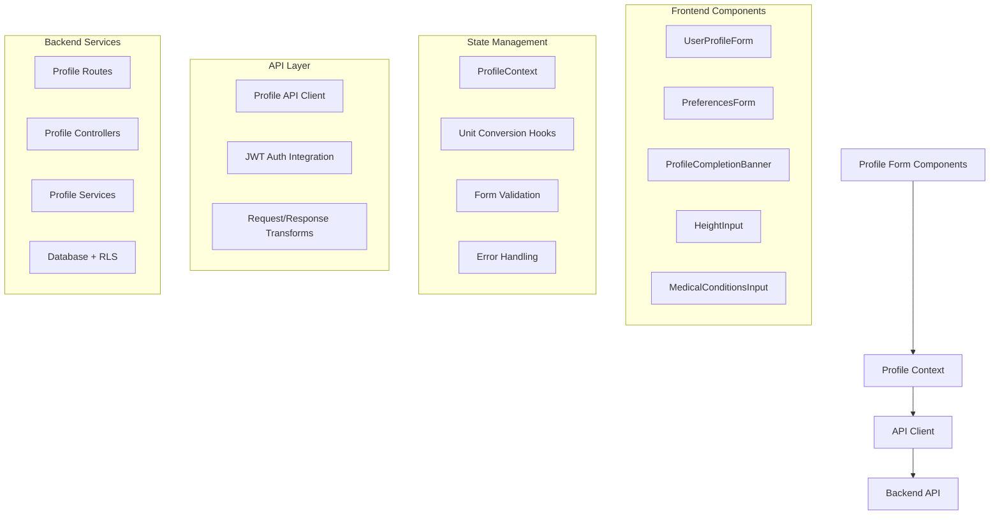
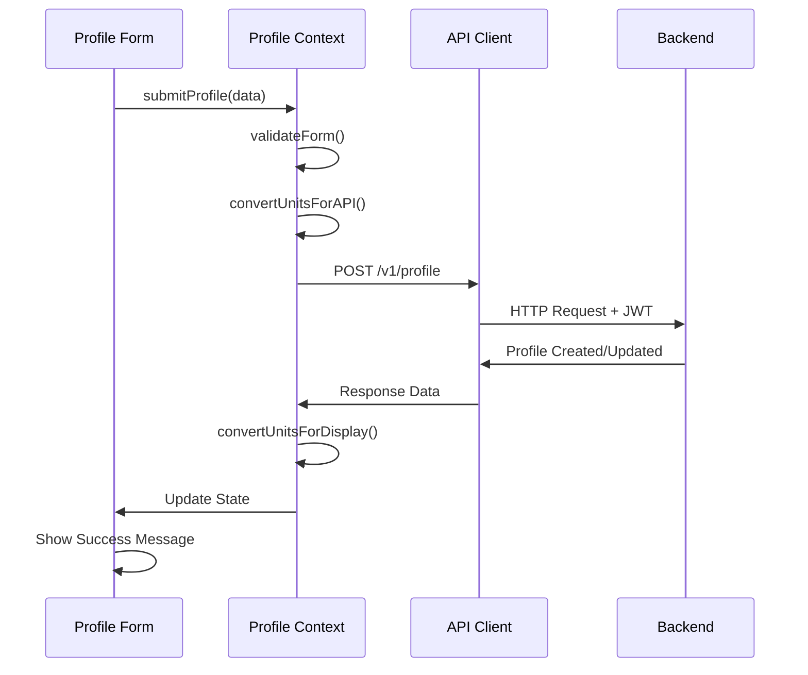
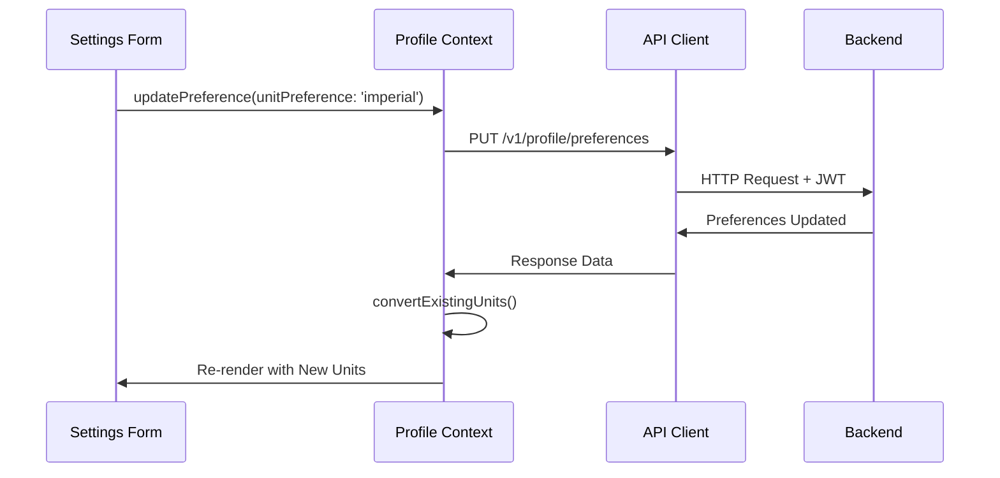

# User Profiles Feature Integration Guide

## Table of Contents
1. [Overview](#overview)
2. [Architecture & Data Flow](#architecture--data-flow)
3. [API Endpoints Reference](#api-endpoints-reference)
4. [State Management](#state-management)
5. [Implementation Guide](#implementation-guide)
6. [UI Components](#ui-components)
7. [Unit System Integration](#unit-system-integration)
8. [Error Handling](#error-handling)
9. [Testing Strategies](#testing-strategies)
10. [Troubleshooting](#troubleshooting)

---

## Overview

The User Profiles feature provides comprehensive user profile management with sophisticated unit conversion, healthcare data handling, and preference management. This feature serves as the foundation for personalized AI-powered workout and nutrition recommendations throughout the application.

### Key Capabilities
- **Complete Profile Management**: Full CRUD operations with partial update support
- **Dual Unit System**: Seamless metric/imperial conversion and storage
- **Healthcare Data Security**: HIPAA-compliant medical condition handling
- **Equipment Preference Mapping**: Complex UI-to-storage field mapping
- **Preference-Specific Operations**: Granular preference updates
- **Profile Completion Tracking**: Progressive profile building support

### Business Value
- Enables personalized AI recommendations
- Supports global user base with multiple unit systems
- Maintains healthcare data privacy compliance
- Provides flexible onboarding and profile completion flows

---

## Architecture & Data Flow

### Component Architecture



### Data Flow Patterns

#### Profile Creation Flow


#### Unit Preference Change Flow


### Authentication Integration

```javascript
// All profile operations require JWT authentication
const profileApiCall = async (endpoint, options = {}) => {
  const token = await getAuthToken();
  return fetch(`/api/v1/profile${endpoint}`, {
    ...options,
    headers: {
      'Authorization': `Bearer ${token}`,
      'Content-Type': 'application/json',
      ...options.headers
    }
  });
};
```

---

## API Endpoints Reference

### 1. GET /v1/profile
**Purpose**: Retrieve complete user profile

```typescript
interface GetProfileResponse {
  status: 'success';
  data: {
    id: string;
    userId: string;
    unitPreference: 'metric' | 'imperial';
    gender?: 'male' | 'female' | 'other' | 'prefer_not_to_say' | 'non-binary';
    age?: number; // 13-120
    name?: string; // 2-100 chars
    experienceLevel?: 'beginner' | 'intermediate' | 'advanced';
    medicalConditions?: string[]; // max 10, max 200 chars each
    goals?: string[];
    workoutFrequency?: string;
    equipment?: string[];
    height?: number | { feet: number; inches: number }; // format depends on unitPreference
    weight?: number; // kg or lbs based on unitPreference
    createdAt: string;
    updatedAt: string;
  };
}
```

**Usage Example**:
```typescript
const { data: profile } = await profileClient.getProfile();
```

**Error Responses**:
- `401`: Authentication required
- `404`: Profile not found
- `500`: Internal server error

---

### 2. POST /v1/profile
**Purpose**: Create new profile (or update if exists)

```typescript
interface CreateProfileRequest {
  unitPreference: 'metric' | 'imperial'; // REQUIRED
  name?: string;
  age?: number;
  gender?: 'male' | 'female' | 'other' | 'prefer_not_to_say' | 'non-binary';
  height?: number | { feet: number; inches: number };
  weight?: number;
  experienceLevel?: 'beginner' | 'intermediate' | 'advanced';
  goals?: string[];
  equipment?: string[];
  exercisePreferences?: string[]; // mapped to equipment field
  equipmentPreferences?: string[]; // mapped to equipment field
  medicalConditions?: string[];
  workoutFrequency?: string;
}
```

**Usage Example**:
```typescript
const profileData = {
  unitPreference: 'metric',
  name: 'John Doe',
  age: 30,
  height: 175.5,
  weight: 75.0,
  experienceLevel: 'intermediate',
  goals: ['weight_loss', 'muscle_gain'],
  equipment: ['dumbbells', 'resistance_bands'],
  medicalConditions: ['lower back pain']
};

const { data: profile } = await profileClient.createProfile(profileData);
```

**Error Responses**:
- `400`: Validation errors
- `401`: Authentication required
- `409`: Profile conflict or unit conversion error
- `500`: Internal server error

---

### 3. PUT /v1/profile
**Purpose**: Update existing profile (partial updates supported)

```typescript
interface UpdateProfileRequest {
  // All fields optional - partial update support
  name?: string;
  age?: number;
  gender?: 'male' | 'female' | 'other' | 'prefer_not_to_say' | 'non-binary';
  height?: number | { feet: number; inches: number };
  weight?: number;
  unitPreference?: 'metric' | 'imperial';
  experienceLevel?: 'beginner' | 'intermediate' | 'advanced';
  goals?: string[];
  equipment?: string[];
  medicalConditions?: string[];
  workoutFrequency?: string;
}
```

**Usage Example**:
```typescript
// Update only weight and goals
const updates = {
  weight: 72.0,
  goals: ['strength', 'endurance', 'flexibility']
};

const { data: profile } = await profileClient.updateProfile(updates);
```

---

### 4. GET /v1/profile/preferences
**Purpose**: Retrieve preference-only data

```typescript
interface GetPreferencesResponse {
  status: 'success';
  data: {
    userId: string;
    unitPreference: 'metric' | 'imperial';
    goals?: string[];
    equipment?: string[];
    experienceLevel?: 'beginner' | 'intermediate' | 'advanced';
    workoutFrequency?: string;
    updatedAt: string;
  };
}
```

**Usage Example**:
```typescript
const { data: preferences } = await profileClient.getPreferences();
```

---

### 5. PUT /v1/profile/preferences
**Purpose**: Update preferences only

```typescript
interface UpdatePreferencesRequest {
  unitPreference?: 'metric' | 'imperial';
  goals?: string[];
  equipment?: string[];
  experienceLevel?: 'beginner' | 'intermediate' | 'advanced';
  workoutFrequency?: string;
}
```

**Important**: 
- Requires `Content-Type: application/json` header
- At least one field must be provided

**Usage Example**:
```typescript
const preferenceUpdates = {
  unitPreference: 'imperial',
  goals: ['weight_loss', 'muscle_gain'],
  experienceLevel: 'beginner'
};

const { data: preferences } = await profileClient.updatePreferences(preferenceUpdates);
```

---

## State Management

### Profile Context Implementation

```typescript
interface ProfileState {
  profile: UserProfile | null;
  preferences: ProfilePreferences | null;
  loading: boolean;
  error: string | null;
  isProfileComplete: boolean;
}

interface ProfileContextValue extends ProfileState {
  // Profile operations
  getProfile: () => Promise<void>;
  createProfile: (data: CreateProfileRequest) => Promise<void>;
  updateProfile: (data: UpdateProfileRequest) => Promise<void>;
  
  // Preference operations
  getPreferences: () => Promise<void>;
  updatePreferences: (data: UpdatePreferencesRequest) => Promise<void>;
  
  // Utility functions
  clearError: () => void;
  checkProfileCompletion: () => boolean;
  
  // Unit conversion helpers
  convertHeight: (height: number | HeightObject, targetUnit: UnitSystem) => number | HeightObject;
  convertWeight: (weight: number, targetUnit: UnitSystem) => number;
  formatHeight: (height: number | HeightObject) => string;
  formatWeight: (weight: number) => string;
}
```

### Context Provider

```typescript
export const ProfileProvider: React.FC<{ children: React.ReactNode }> = ({ children }) => {
  const [state, dispatch] = useReducer(profileReducer, initialState);
  
  const getProfile = useCallback(async () => {
    dispatch({ type: 'SET_LOADING', payload: true });
    try {
      const response = await profileClient.getProfile();
      dispatch({ type: 'SET_PROFILE', payload: response.data });
    } catch (error) {
      dispatch({ type: 'SET_ERROR', payload: error.message });
    } finally {
      dispatch({ type: 'SET_LOADING', payload: false });
    }
  }, []);

  const updateProfile = useCallback(async (data: UpdateProfileRequest) => {
    dispatch({ type: 'SET_LOADING', payload: true });
    try {
      const response = await profileClient.updateProfile(data);
      dispatch({ type: 'UPDATE_PROFILE', payload: response.data });
    } catch (error) {
      dispatch({ type: 'SET_ERROR', payload: error.message });
    } finally {
      dispatch({ type: 'SET_LOADING', payload: false });
    }
  }, []);

  const updatePreferences = useCallback(async (data: UpdatePreferencesRequest) => {
    dispatch({ type: 'SET_LOADING', payload: true });
    try {
      const response = await profileClient.updatePreferences(data);
      dispatch({ type: 'UPDATE_PREFERENCES', payload: response.data });
      
      // If unit preference changed, convert existing profile data
      if (data.unitPreference && state.profile) {
        const convertedProfile = convertProfileUnits(state.profile, data.unitPreference);
        dispatch({ type: 'SET_PROFILE', payload: convertedProfile });
      }
    } catch (error) {
      dispatch({ type: 'SET_ERROR', payload: error.message });
    } finally {
      dispatch({ type: 'SET_LOADING', payload: false });
    }
  }, [state.profile]);

  const checkProfileCompletion = useCallback(() => {
    if (!state.profile) return false;
    
    const requiredFields = ['name', 'age', 'height', 'weight', 'experienceLevel', 'goals'];
    return requiredFields.every(field => state.profile[field] !== null && state.profile[field] !== undefined);
  }, [state.profile]);

  const value = {
    ...state,
    getProfile,
    updateProfile,
    updatePreferences,
    checkProfileCompletion,
    // ... other methods
  };

  return (
    <ProfileContext.Provider value={value}>
      {children}
    </ProfileContext.Provider>
  );
};
```

### Profile Reducer

```typescript
type ProfileAction =
  | { type: 'SET_LOADING'; payload: boolean }
  | { type: 'SET_ERROR'; payload: string | null }
  | { type: 'SET_PROFILE'; payload: UserProfile }
  | { type: 'UPDATE_PROFILE'; payload: UserProfile }
  | { type: 'SET_PREFERENCES'; payload: ProfilePreferences }
  | { type: 'UPDATE_PREFERENCES'; payload: ProfilePreferences }
  | { type: 'CLEAR_ERROR' };

const profileReducer = (state: ProfileState, action: ProfileAction): ProfileState => {
  switch (action.type) {
    case 'SET_LOADING':
      return { ...state, loading: action.payload };
    
    case 'SET_ERROR':
      return { ...state, error: action.payload, loading: false };
    
    case 'SET_PROFILE':
      return {
        ...state,
        profile: action.payload,
        loading: false,
        error: null,
        isProfileComplete: checkCompletion(action.payload)
      };
    
    case 'UPDATE_PROFILE':
      return {
        ...state,
        profile: action.payload,
        loading: false,
        error: null,
        isProfileComplete: checkCompletion(action.payload)
      };
    
    case 'UPDATE_PREFERENCES':
      return {
        ...state,
        preferences: action.payload,
        loading: false,
        error: null
      };
    
    case 'CLEAR_ERROR':
      return { ...state, error: null };
    
    default:
      return state;
  }
};
```

---

## Implementation Guide

### Step 1: API Client Setup

```typescript
// api/profileClient.ts
import { apiClient } from './base';

export const profileClient = {
  async getProfile(): Promise<GetProfileResponse> {
    const response = await apiClient.get('/profile');
    return response.data;
  },

  async createProfile(data: CreateProfileRequest): Promise<UserProfileResponse> {
    const response = await apiClient.post('/profile', data);
    return response.data;
  },

  async updateProfile(data: UpdateProfileRequest): Promise<UserProfileResponse> {
    const response = await apiClient.put('/profile', data);
    return response.data;
  },

  async getPreferences(): Promise<GetPreferencesResponse> {
    const response = await apiClient.get('/profile/preferences');
    return response.data;
  },

  async updatePreferences(data: UpdatePreferencesRequest): Promise<ProfilePreferencesResponse> {
    const response = await apiClient.put('/profile/preferences', data, {
      headers: { 'Content-Type': 'application/json' }
    });
    return response.data;
  }
};
```

### Step 2: Form Validation Setup

```typescript
// validation/profileSchemas.ts
import * as yup from 'yup';

export const profileCreationSchema = yup.object({
  unitPreference: yup.string().oneOf(['metric', 'imperial']).required(),
  name: yup.string().min(2).max(100).nullable(),
  age: yup.number().min(13).max(120).integer().nullable(),
  gender: yup.string().oneOf(['male', 'female', 'other', 'prefer_not_to_say', 'non-binary', '']).nullable(),
  height: yup.lazy((value) => {
    if (typeof value === 'object') {
      return yup.object({
        feet: yup.number().min(0).integer().required(),
        inches: yup.number().min(0).max(11).integer().required()
      });
    }
    return yup.number().min(0);
  }).nullable(),
  weight: yup.number().min(0).nullable(),
  experienceLevel: yup.string().oneOf(['beginner', 'intermediate', 'advanced']).nullable(),
  goals: yup.array().of(yup.string()).nullable(),
  equipment: yup.array().of(yup.string()).nullable(),
  medicalConditions: yup.array()
    .of(
      yup.string()
        .min(1)
        .max(200)
        .matches(/^[a-zA-Z0-9\s\-.,()_]+$/, 'Invalid characters in medical condition')
    )
    .max(10, 'Maximum 10 medical conditions allowed')
    .nullable(),
  workoutFrequency: yup.string().nullable()
});

export const preferenceUpdateSchema = yup.object({
  unitPreference: yup.string().oneOf(['metric', 'imperial']).optional(),
  goals: yup.array().of(yup.string()).optional(),
  equipment: yup.array().of(yup.string()).optional(),
  experienceLevel: yup.string().oneOf(['beginner', 'intermediate', 'advanced']).optional(),
  workoutFrequency: yup.string().optional()
}).test('at-least-one', 'At least one field is required', (value) => {
  return Object.keys(value || {}).length > 0;
});
```

### Step 3: Unit Conversion Utilities

```typescript
// utils/unitConversion.ts
export type UnitSystem = 'metric' | 'imperial';
export type HeightObject = { feet: number; inches: number };

export const convertHeight = (
  height: number | HeightObject, 
  fromUnit: UnitSystem, 
  toUnit: UnitSystem
): number | HeightObject => {
  if (fromUnit === toUnit) return height;
  
  if (fromUnit === 'imperial' && toUnit === 'metric') {
    if (typeof height === 'object') {
      const totalInches = (height.feet * 12) + height.inches;
      return Math.round(totalInches * 2.54 * 10) / 10;
    }
  }
  
  if (fromUnit === 'metric' && toUnit === 'imperial') {
    if (typeof height === 'number') {
      const totalInches = height / 2.54;
      const feet = Math.floor(totalInches / 12);
      const inches = Math.round(totalInches % 12);
      return { feet, inches };
    }
  }
  
  return height;
};

export const convertWeight = (
  weight: number, 
  fromUnit: UnitSystem, 
  toUnit: UnitSystem
): number => {
  if (fromUnit === toUnit) return weight;
  
  if (fromUnit === 'imperial' && toUnit === 'metric') {
    return Math.round(weight * 0.45359237 * 10) / 10;
  }
  
  if (fromUnit === 'metric' && toUnit === 'imperial') {
    return Math.round(weight * 2.20462262 * 10) / 10;
  }
  
  return weight;
};

export const formatHeight = (height: number | HeightObject, unit: UnitSystem): string => {
  if (unit === 'imperial' && typeof height === 'object') {
    return `${height.feet}'${height.inches}"`;
  }
  return `${height} cm`;
};

export const formatWeight = (weight: number, unit: UnitSystem): string => {
  return `${weight} ${unit === 'imperial' ? 'lbs' : 'kg'}`;
};
```

### Step 4: Profile Completion Hook

```typescript
// hooks/useProfileCompletion.ts
export const useProfileCompletion = () => {
  const { profile } = useProfile();
  
  const requiredFields = {
    personal: ['name', 'age', 'gender'],
    physical: ['height', 'weight', 'unitPreference'],
    fitness: ['experienceLevel', 'goals'],
    preferences: ['workoutFrequency', 'equipment']
  } as const;
  
  const getCompletionStatus = () => {
    if (!profile) return { percentage: 0, missingFields: [], completedSections: [] };
    
    const completedSections: string[] = [];
    const missingFields: string[] = [];
    
    Object.entries(requiredFields).forEach(([section, fields]) => {
      const sectionFields = fields.filter(field => profile[field] && profile[field] !== '');
      if (sectionFields.length === fields.length) {
        completedSections.push(section);
      } else {
        missingFields.push(...fields.filter(field => !profile[field] || profile[field] === ''));
      }
    });
    
    const totalFields = Object.values(requiredFields).flat().length;
    const completedFields = totalFields - missingFields.length;
    const percentage = Math.round((completedFields / totalFields) * 100);
    
    return { percentage, missingFields, completedSections };
  };
  
  return { getCompletionStatus, requiredFields };
};
```

---

## UI Components

### UserProfileForm Component

```typescript
// components/UserProfileForm.tsx
interface UserProfileFormProps {
  initialData?: Partial<UserProfile>;
  onSubmit: (data: CreateProfileRequest | UpdateProfileRequest) => Promise<void>;
  mode: 'create' | 'update';
}

export const UserProfileForm: React.FC<UserProfileFormProps> = ({
  initialData,
  onSubmit,
  mode
}) => {
  const { profile } = useProfile();
  const currentUnitSystem = profile?.unitPreference || 'metric';
  
  const form = useForm({
    resolver: yupResolver(mode === 'create' ? profileCreationSchema : profileUpdateSchema),
    defaultValues: {
      unitPreference: currentUnitSystem,
      ...initialData
    }
  });
  
  const watchedUnitPreference = form.watch('unitPreference');
  
  // Convert height when unit preference changes
  useEffect(() => {
    const currentHeight = form.getValues('height');
    if (currentHeight && watchedUnitPreference !== currentUnitSystem) {
      const convertedHeight = convertHeight(currentHeight, currentUnitSystem, watchedUnitPreference);
      form.setValue('height', convertedHeight);
    }
  }, [watchedUnitPreference]);
  
  const handleSubmit = async (data: FormData) => {
    try {
      await onSubmit(data);
      // Success handling
    } catch (error) {
      // Error handling
    }
  };
  
  return (
    <form onSubmit={form.handleSubmit(handleSubmit)} className="space-y-6">
      {/* Unit Preference */}
      <fieldset>
        <legend className="text-lg font-medium">Unit Preferences</legend>
        <RadioGroup {...form.register('unitPreference')}>
          <Radio value="metric">Metric (cm, kg)</Radio>
          <Radio value="imperial">Imperial (ft/in, lbs)</Radio>
        </RadioGroup>
      </fieldset>
      
      {/* Personal Information */}
      <fieldset>
        <legend className="text-lg font-medium">Personal Information</legend>
        
        <Input
          {...form.register('name')}
          label="Full Name"
          placeholder="Enter your full name"
          error={form.formState.errors.name?.message}
        />
        
        <Input
          {...form.register('age')}
          type="number"
          label="Age"
          placeholder="Enter your age"
          min={13}
          max={120}
          error={form.formState.errors.age?.message}
        />
        
        <Select {...form.register('gender')} label="Gender">
          <option value="">Select Gender</option>
          <option value="male">Male</option>
          <option value="female">Female</option>
          <option value="other">Other</option>
          <option value="non-binary">Non-binary</option>
          <option value="prefer_not_to_say">Prefer not to say</option>
        </Select>
      </fieldset>
      
      {/* Physical Measurements */}
      <fieldset>
        <legend className="text-lg font-medium">Physical Measurements</legend>
        
        <HeightInput
          value={form.watch('height')}
          onChange={(height) => form.setValue('height', height)}
          unitSystem={watchedUnitPreference}
          error={form.formState.errors.height?.message}
        />
        
        <Input
          {...form.register('weight')}
          type="number"
          label={`Weight (${watchedUnitPreference === 'imperial' ? 'lbs' : 'kg'})`}
          placeholder={`Enter weight in ${watchedUnitPreference === 'imperial' ? 'pounds' : 'kilograms'}`}
          step="0.1"
          min="0.1"
          error={form.formState.errors.weight?.message}
        />
      </fieldset>
      
      {/* Fitness Information */}
      <fieldset>
        <legend className="text-lg font-medium">Fitness Information</legend>
        
        <Select {...form.register('experienceLevel')} label="Experience Level">
          <option value="">Select Experience Level</option>
          <option value="beginner">Beginner</option>
          <option value="intermediate">Intermediate</option>
          <option value="advanced">Advanced</option>
        </Select>
        
        <MultiSelect
          {...form.register('goals')}
          label="Fitness Goals"
          options={FITNESS_GOALS_OPTIONS}
          placeholder="Select your fitness goals"
        />
        
        <MultiSelect
          {...form.register('equipment')}
          label="Available Equipment"
          options={EQUIPMENT_OPTIONS}
          placeholder="Select available equipment"
        />
        
        <Input
          {...form.register('workoutFrequency')}
          label="Workout Frequency"
          placeholder="e.g., 3-4 times per week"
        />
      </fieldset>
      
      {/* Medical Conditions */}
      <MedicalConditionsInput
        value={form.watch('medicalConditions') || []}
        onChange={(conditions) => form.setValue('medicalConditions', conditions)}
        error={form.formState.errors.medicalConditions?.message}
      />
      
      <Button type="submit" disabled={form.formState.isSubmitting}>
        {form.formState.isSubmitting ? 'Saving...' : `${mode === 'create' ? 'Create' : 'Update'} Profile`}
      </Button>
    </form>
  );
};
```

### HeightInput Component

```typescript
// components/HeightInput.tsx
interface HeightInputProps {
  value?: number | HeightObject;
  onChange: (height: number | HeightObject) => void;
  unitSystem: UnitSystem;
  error?: string;
}

export const HeightInput: React.FC<HeightInputProps> = ({
  value,
  onChange,
  unitSystem,
  error
}) => {
  if (unitSystem === 'imperial') {
    const heightObj = typeof value === 'object' ? value : { feet: 5, inches: 0 };
    
    return (
      <div className="space-y-2">
        <label className="block text-sm font-medium">Height</label>
        <div className="flex space-x-2">
          <Input
            type="number"
            value={heightObj.feet}
            onChange={(e) => onChange({
              ...heightObj,
              feet: parseInt(e.target.value) || 0
            })}
            placeholder="Feet"
            min={0}
            className="flex-1"
          />
          <Input
            type="number"
            value={heightObj.inches}
            onChange={(e) => onChange({
              ...heightObj,
              inches: parseInt(e.target.value) || 0
            })}
            placeholder="Inches"
            min={0}
            max={11}
            className="flex-1"
          />
        </div>
        {error && <p className="text-red-500 text-sm">{error}</p>}
      </div>
    );
  }
  
  return (
    <Input
      type="number"
      value={typeof value === 'number' ? value : 175}
      onChange={(e) => onChange(parseFloat(e.target.value) || 0)}
      label="Height (cm)"
      placeholder="Enter height in centimeters"
      min={0}
      step="0.1"
      error={error}
    />
  );
};
```

### MedicalConditionsInput Component

```typescript
// components/MedicalConditionsInput.tsx
interface MedicalConditionsInputProps {
  value: string[];
  onChange: (conditions: string[]) => void;
  error?: string;
}

export const MedicalConditionsInput: React.FC<MedicalConditionsInputProps> = ({
  value,
  onChange,
  error
}) => {
  const [inputValue, setInputValue] = useState('');
  const [validationError, setValidationError] = useState<string | null>(null);
  
  const validateCondition = (condition: string): string | null => {
    if (condition.length > 200) {
      return 'Medical condition must be 200 characters or less';
    }
    
    if (!/^[a-zA-Z0-9\s\-.,()_]+$/.test(condition)) {
      return 'Invalid characters. Use only letters, numbers, spaces, and basic punctuation';
    }
    
    if (/<[^>]*>|javascript:/i.test(condition)) {
      return 'Invalid input detected';
    }
    
    return null;
  };
  
  const addCondition = () => {
    const trimmed = inputValue.trim();
    if (!trimmed) return;
    
    if (value.length >= 10) {
      setValidationError('Maximum 10 medical conditions allowed');
      return;
    }
    
    const validationErr = validateCondition(trimmed);
    if (validationErr) {
      setValidationError(validationErr);
      return;
    }
    
    if (value.includes(trimmed)) {
      setValidationError('This condition is already added');
      return;
    }
    
    onChange([...value, trimmed]);
    setInputValue('');
    setValidationError(null);
  };
  
  const removeCondition = (index: number) => {
    onChange(value.filter((_, i) => i !== index));
  };
  
  return (
    <fieldset>
      <legend className="text-lg font-medium">Medical Conditions</legend>
      <p className="text-sm text-gray-600 mb-2">
        List any medical conditions or physical limitations that may affect your workouts
      </p>
      
      {/* Existing Conditions */}
      {value.length > 0 && (
        <div className="space-y-2 mb-4">
          {value.map((condition, index) => (
            <div key={index} className="flex items-center justify-between bg-gray-50 p-2 rounded">
              <span className="text-sm">{condition}</span>
              <Button
                type="button"
                variant="ghost"
                size="sm"
                onClick={() => removeCondition(index)}
              >
                Remove
              </Button>
            </div>
          ))}
        </div>
      )}
      
      {/* Add New Condition */}
      {value.length < 10 && (
        <div className="space-y-2">
          <div className="flex space-x-2">
            <Input
              value={inputValue}
              onChange={(e) => {
                setInputValue(e.target.value);
                setValidationError(null);
              }}
              placeholder="Enter medical condition"
              maxLength={200}
              onKeyPress={(e) => {
                if (e.key === 'Enter') {
                  e.preventDefault();
                  addCondition();
                }
              }}
              className="flex-1"
            />
            <Button type="button" onClick={addCondition}>
              Add
            </Button>
          </div>
          {validationError && <p className="text-red-500 text-sm">{validationError}</p>}
        </div>
      )}
      
      {error && <p className="text-red-500 text-sm">{error}</p>}
    </fieldset>
  );
};
```

### ProfileCompletionBanner Component

```typescript
// components/ProfileCompletionBanner.tsx
export const ProfileCompletionBanner: React.FC = () => {
  const { getCompletionStatus } = useProfileCompletion();
  const { percentage, missingFields } = getCompletionStatus();
  
  if (percentage === 100) return null;
  
  return (
    <div className="bg-blue-50 border border-blue-200 rounded-lg p-4 mb-6">
      <div className="flex items-center justify-between mb-2">
        <h3 className="text-blue-900 font-medium">Complete Your Profile</h3>
        <span className="text-blue-700 text-sm font-medium">{percentage}% Complete</span>
      </div>
      
      <div className="bg-blue-200 rounded-full h-2 mb-3">
        <div
          className="bg-blue-600 h-2 rounded-full transition-all duration-300"
          style={{ width: `${percentage}%` }}
        />
      </div>
      
      <p className="text-blue-800 text-sm mb-2">
        Complete your profile to get personalized workout and nutrition recommendations.
      </p>
      
      {missingFields.length > 0 && (
        <p className="text-blue-700 text-sm">
          Missing: {missingFields.join(', ')}
        </p>
      )}
      
      <Button variant="outline" size="sm" className="mt-2">
        Complete Profile
      </Button>
    </div>
  );
};
```

---

## Unit System Integration

### Dynamic Unit Conversion

```typescript
// hooks/useUnitConversion.ts
export const useUnitConversion = () => {
  const { profile, updatePreferences } = useProfile();
  const currentUnit = profile?.unitPreference || 'metric';
  
  const changeUnitSystem = async (newUnit: UnitSystem) => {
    if (newUnit === currentUnit) return;
    
    try {
      await updatePreferences({ unitPreference: newUnit });
      // Context handles the unit conversion of existing data
    } catch (error) {
      console.error('Failed to change unit system:', error);
    }
  };
  
  const getDisplayValues = (profile: UserProfile) => {
    return {
      height: formatHeight(profile.height, currentUnit),
      weight: formatWeight(profile.weight, currentUnit),
      unitSystem: currentUnit
    };
  };
  
  const convertForAPI = (formData: any) => {
    // API expects data in the format specified by unitPreference
    return formData;
  };
  
  return {
    currentUnit,
    changeUnitSystem,
    getDisplayValues,
    convertForAPI,
    formatHeight: (height: number | HeightObject) => formatHeight(height, currentUnit),
    formatWeight: (weight: number) => formatWeight(weight, currentUnit)
  };
};
```

### Unit System Selector

```typescript
// components/UnitSystemSelector.tsx
export const UnitSystemSelector: React.FC = () => {
  const { currentUnit, changeUnitSystem } = useUnitConversion();
  const [isChanging, setIsChanging] = useState(false);
  
  const handleUnitChange = async (newUnit: UnitSystem) => {
    setIsChanging(true);
    try {
      await changeUnitSystem(newUnit);
    } finally {
      setIsChanging(false);
    }
  };
  
  return (
    <div className="flex items-center space-x-4">
      <span className="text-sm font-medium">Units:</span>
      <RadioGroup
        value={currentUnit}
        onValueChange={handleUnitChange}
        disabled={isChanging}
        className="flex space-x-4"
      >
        <div className="flex items-center space-x-2">
          <Radio value="metric" id="metric" />
          <label htmlFor="metric" className="text-sm">Metric (cm, kg)</label>
        </div>
        <div className="flex items-center space-x-2">
          <Radio value="imperial" id="imperial" />
          <label htmlFor="imperial" className="text-sm">Imperial (ft/in, lbs)</label>
        </div>
      </RadioGroup>
      {isChanging && <Spinner size="sm" />}
    </div>
  );
};
```

---

## Error Handling

### Error Types and Handling

```typescript
// types/errors.ts
export interface ProfileError {
  type: 'validation' | 'authentication' | 'not_found' | 'conflict' | 'server';
  message: string;
  details?: Record<string, string>;
  field?: string;
}

export class ProfileValidationError extends Error {
  constructor(public errors: Record<string, string>) {
    super('Validation failed');
    this.name = 'ProfileValidationError';
  }
}

export class ProfileNotFoundError extends Error {
  constructor() {
    super('Profile not found');
    this.name = 'ProfileNotFoundError';
  }
}

export class UnitConversionError extends Error {
  constructor(message: string) {
    super(message);
    this.name = 'UnitConversionError';
  }
}
```

### Error Handling Hook

```typescript
// hooks/useProfileErrorHandler.ts
export const useProfileErrorHandler = () => {
  const [errors, setErrors] = useState<Record<string, string>>({});
  
  const handleError = (error: any) => {
    if (error.response?.status === 400) {
      // Validation errors
      const validationErrors = error.response.data.errors || {};
      setErrors(validationErrors);
      return {
        type: 'validation' as const,
        message: 'Please correct the validation errors',
        details: validationErrors
      };
    }
    
    if (error.response?.status === 401) {
      // Authentication error
      return {
        type: 'authentication' as const,
        message: 'Please log in to continue'
      };
    }
    
    if (error.response?.status === 404) {
      // Profile not found
      return {
        type: 'not_found' as const,
        message: 'Profile not found'
      };
    }
    
    if (error.response?.status === 409) {
      // Conflict error (profile exists, unit conversion error)
      return {
        type: 'conflict' as const,
        message: error.response.data.message || 'A conflict occurred'
      };
    }
    
    // Generic server error
    return {
      type: 'server' as const,
      message: 'An unexpected error occurred. Please try again.'
    };
  };
  
  const clearErrors = () => setErrors({});
  
  const getFieldError = (field: string) => errors[field];
  
  return {
    errors,
    handleError,
    clearErrors,
    getFieldError
  };
};
```

### Error Display Components

```typescript
// components/ErrorDisplay.tsx
interface ErrorDisplayProps {
  error: ProfileError | null;
  onDismiss?: () => void;
}

export const ErrorDisplay: React.FC<ErrorDisplayProps> = ({ error, onDismiss }) => {
  if (!error) return null;
  
  const getErrorIcon = () => {
    switch (error.type) {
      case 'validation':
        return <ExclamationTriangleIcon className="h-5 w-5 text-yellow-500" />;
      case 'authentication':
        return <LockClosedIcon className="h-5 w-5 text-red-500" />;
      case 'not_found':
        return <QuestionMarkCircleIcon className="h-5 w-5 text-blue-500" />;
      case 'conflict':
        return <ExclamationCircleIcon className="h-5 w-5 text-orange-500" />;
      default:
        return <XCircleIcon className="h-5 w-5 text-red-500" />;
    }
  };
  
  const getErrorColor = () => {
    switch (error.type) {
      case 'validation':
        return 'yellow';
      case 'authentication':
        return 'red';
      case 'not_found':
        return 'blue';
      case 'conflict':
        return 'orange';
      default:
        return 'red';
    }
  };
  
  const color = getErrorColor();
  
  return (
    <div className={`bg-${color}-50 border border-${color}-200 rounded-lg p-4`}>
      <div className="flex items-start">
        <div className="flex-shrink-0">{getErrorIcon()}</div>
        <div className="ml-3 flex-1">
          <h3 className={`text-sm font-medium text-${color}-800`}>
            {error.message}
          </h3>
          {error.details && (
            <div className="mt-2 text-sm text-gray-600">
              <ul className="list-disc list-inside space-y-1">
                {Object.entries(error.details).map(([field, message]) => (
                  <li key={field}>
                    <span className="font-medium">{field}:</span> {message}
                  </li>
                ))}
              </ul>
            </div>
          )}
        </div>
        {onDismiss && (
          <button
            onClick={onDismiss}
            className={`ml-3 text-${color}-400 hover:text-${color}-600`}
          >
            <XMarkIcon className="h-5 w-5" />
          </button>
        )}
      </div>
    </div>
  );
};
```

---

## Testing Strategies

### Component Testing

```typescript
// __tests__/UserProfileForm.test.tsx
import { render, screen, fireEvent, waitFor } from '@testing-library/react';
import { UserProfileForm } from '../UserProfileForm';
import { ProfileProvider } from '../contexts/ProfileContext';

const renderWithProvider = (component: React.ReactElement) => {
  return render(
    <ProfileProvider>
      {component}
    </ProfileProvider>
  );
};

describe('UserProfileForm', () => {
  const mockOnSubmit = jest.fn();
  
  beforeEach(() => {
    mockOnSubmit.mockClear();
  });
  
  it('renders all form fields', () => {
    renderWithProvider(
      <UserProfileForm mode="create" onSubmit={mockOnSubmit} />
    );
    
    expect(screen.getByLabelText(/unit preferences/i)).toBeInTheDocument();
    expect(screen.getByLabelText(/full name/i)).toBeInTheDocument();
    expect(screen.getByLabelText(/age/i)).toBeInTheDocument();
    expect(screen.getByLabelText(/height/i)).toBeInTheDocument();
    expect(screen.getByLabelText(/weight/i)).toBeInTheDocument();
  });
  
  it('changes height input format when unit preference changes', async () => {
    renderWithProvider(
      <UserProfileForm mode="create" onSubmit={mockOnSubmit} />
    );
    
    // Start with metric (single input)
    expect(screen.getByLabelText(/height \(cm\)/i)).toBeInTheDocument();
    
    // Switch to imperial
    fireEvent.click(screen.getByRole('radio', { name: /imperial/i }));
    
    await waitFor(() => {
      expect(screen.getByPlaceholderText(/feet/i)).toBeInTheDocument();
      expect(screen.getByPlaceholderText(/inches/i)).toBeInTheDocument();
    });
  });
  
  it('validates medical conditions input', async () => {
    renderWithProvider(
      <UserProfileForm mode="create" onSubmit={mockOnSubmit} />
    );
    
    const medicalInput = screen.getByPlaceholderText(/enter medical condition/i);
    const addButton = screen.getByText(/add/i);
    
    // Test invalid characters
    fireEvent.change(medicalInput, { target: { value: '<script>alert("xss")</script>' } });
    fireEvent.click(addButton);
    
    await waitFor(() => {
      expect(screen.getByText(/invalid input detected/i)).toBeInTheDocument();
    });
    
    // Test valid condition
    fireEvent.change(medicalInput, { target: { value: 'lower back pain' } });
    fireEvent.click(addButton);
    
    await waitFor(() => {
      expect(screen.getByText(/lower back pain/i)).toBeInTheDocument();
    });
  });
  
  it('submits form with correct data structure', async () => {
    renderWithProvider(
      <UserProfileForm mode="create" onSubmit={mockOnSubmit} />
    );
    
    // Fill form
    fireEvent.change(screen.getByLabelText(/full name/i), {
      target: { value: 'John Doe' }
    });
    fireEvent.change(screen.getByLabelText(/age/i), {
      target: { value: '30' }
    });
    fireEvent.change(screen.getByLabelText(/height \(cm\)/i), {
      target: { value: '175' }
    });
    fireEvent.change(screen.getByLabelText(/weight \(kg\)/i), {
      target: { value: '75' }
    });
    
    // Submit
    fireEvent.click(screen.getByRole('button', { name: /create profile/i }));
    
    await waitFor(() => {
      expect(mockOnSubmit).toHaveBeenCalledWith({
        unitPreference: 'metric',
        name: 'John Doe',
        age: 30,
        height: 175,
        weight: 75
      });
    });
  });
});
```

### API Integration Testing

```typescript
// __tests__/profileClient.test.ts
import { profileClient } from '../api/profileClient';
import { server } from '../mocks/server';
import { rest } from 'msw';

describe('profileClient', () => {
  it('creates profile with correct request format', async () => {
    const profileData = {
      unitPreference: 'metric' as const,
      name: 'John Doe',
      age: 30,
      height: 175,
      weight: 75
    };
    
    server.use(
      rest.post('/api/v1/profile', async (req, res, ctx) => {
        const body = await req.json();
        expect(body).toEqual(profileData);
        
        return res(ctx.json({
          status: 'success',
          data: { id: 'test-id', userId: 'user-id', ...profileData }
        }));
      })
    );
    
    const result = await profileClient.createProfile(profileData);
    expect(result.status).toBe('success');
    expect(result.data.name).toBe('John Doe');
  });
  
  it('handles validation errors correctly', async () => {
    server.use(
      rest.post('/api/v1/profile', (req, res, ctx) => {
        return res(
          ctx.status(400),
          ctx.json({
            status: 'error',
            message: 'Validation failed',
            errors: {
              age: 'Age must be between 13 and 120 years'
            }
          })
        );
      })
    );
    
    await expect(profileClient.createProfile({ unitPreference: 'metric', age: 5 }))
      .rejects.toThrow();
  });
  
  it('handles unit conversion in height field', async () => {
    const imperialHeight = { feet: 5, inches: 10 };
    
    server.use(
      rest.post('/api/v1/profile', async (req, res, ctx) => {
        const body = await req.json();
        expect(body.height).toEqual(imperialHeight);
        
        return res(ctx.json({
          status: 'success',
          data: {
            id: 'test-id',
            userId: 'user-id',
            unitPreference: 'imperial',
            height: imperialHeight
          }
        }));
      })
    );
    
    const result = await profileClient.createProfile({
      unitPreference: 'imperial',
      height: imperialHeight
    });
    
    expect(result.data.height).toEqual(imperialHeight);
  });
});
```

### Hook Testing

```typescript
// __tests__/useUnitConversion.test.tsx
import { renderHook, act } from '@testing-library/react';
import { useUnitConversion } from '../hooks/useUnitConversion';
import { ProfileProvider } from '../contexts/ProfileContext';

const wrapper = ({ children }: { children: React.ReactNode }) => (
  <ProfileProvider>{children}</ProfileProvider>
);

describe('useUnitConversion', () => {
  it('formats height correctly for metric system', () => {
    const { result } = renderHook(() => useUnitConversion(), { wrapper });
    
    const formatted = result.current.formatHeight(175);
    expect(formatted).toBe('175 cm');
  });
  
  it('formats height correctly for imperial system', () => {
    // Mock profile with imperial preference
    const { result } = renderHook(() => useUnitConversion(), { wrapper });
    
    const formatted = result.current.formatHeight({ feet: 5, inches: 10 });
    expect(formatted).toBe('5\'10"');
  });
  
  it('changes unit system correctly', async () => {
    const { result } = renderHook(() => useUnitConversion(), { wrapper });
    
    await act(async () => {
      await result.current.changeUnitSystem('imperial');
    });
    
    expect(result.current.currentUnit).toBe('imperial');
  });
});
```

---

## Troubleshooting

### Common Issues and Solutions

#### 1. Height Field Validation Errors
**Issue**: Height validation fails when switching between unit systems.
**Solution**: Ensure height is converted properly before validation.

```typescript
// Validate height based on current unit system
const validateHeight = (height: number | HeightObject, unit: UnitSystem) => {
  if (unit === 'imperial' && typeof height === 'object') {
    return height.feet >= 0 && height.inches >= 0 && height.inches <= 11;
  }
  if (unit === 'metric' && typeof height === 'number') {
    return height > 0;
  }
  return false;
};
```

#### 2. Medical Conditions XSS Prevention
**Issue**: Medical conditions input being rejected due to character validation.
**Solution**: Use proper regex pattern and provide clear error messages.

```typescript
// Allow only safe characters
const medicalConditionPattern = /^[a-zA-Z0-9\s\-.,()_]+$/;
const isValidCondition = medicalConditionPattern.test(condition);
```

#### 3. Unit Conversion State Issues
**Issue**: Profile data not updating when unit preference changes.
**Solution**: Ensure proper state management in ProfileContext.

```typescript
// In ProfileContext, handle unit preference changes
useEffect(() => {
  if (profile && previousUnitRef.current !== profile.unitPreference) {
    const convertedProfile = convertProfileUnits(profile, profile.unitPreference);
    setProfile(convertedProfile);
    previousUnitRef.current = profile.unitPreference;
  }
}, [profile?.unitPreference]);
```

#### 4. Form Submission with Empty Required Fields
**Issue**: Form submits with missing required fields.
**Solution**: Implement proper validation schema and client-side checks.

```typescript
const validationSchema = yup.object({
  unitPreference: yup.string().oneOf(['metric', 'imperial']).required('Unit preference is required'),
  // ... other validations
});
```

#### 5. API Request Content-Type Issues
**Issue**: Preferences endpoint returns 400 due to missing Content-Type header.
**Solution**: Explicitly set Content-Type for preferences requests.

```typescript
// Always include Content-Type for preferences
const updatePreferences = async (data) => {
  return apiClient.put('/profile/preferences', data, {
    headers: { 'Content-Type': 'application/json' }
  });
};
```

### Debug Checklist

1. **Authentication**: Verify JWT token is included in all requests
2. **Validation**: Check form validation matches backend Joi schemas
3. **Unit Conversion**: Ensure height/weight values match unit preference
4. **Medical Conditions**: Verify character pattern and length limits
5. **Equipment Field**: Check if multiple equipment fields are mapped correctly
6. **Content-Type**: Confirm preferences requests include proper headers
7. **State Management**: Verify ProfileContext updates correctly
8. **Error Handling**: Check error messages are displayed appropriately

---

This comprehensive guide provides everything needed to implement the User Profiles feature frontend integration, including sophisticated unit conversion, healthcare data handling, and robust error management. The implementation follows React best practices and integrates seamlessly with the existing authentication system. 