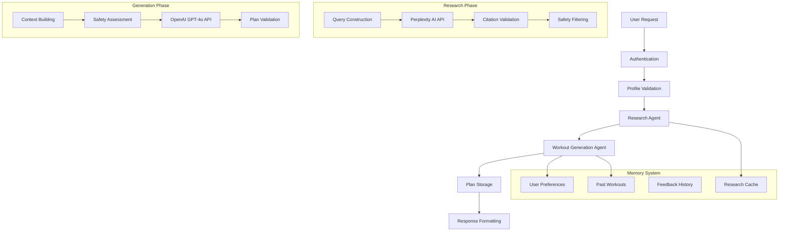
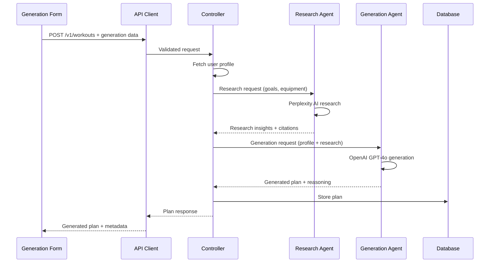
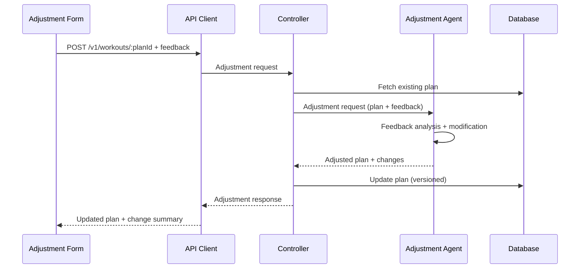

# Workout Generation Feature Integration Guide

## Table of Contents
1. [Overview](#overview)
2. [Architecture & Data Flow](#architecture--data-flow)
3. [API Endpoints Reference](#api-endpoints-reference)
4. [State Management](#state-management)
5. [Implementation Guide](#implementation-guide)
6. [UI Components](#ui-components)
7. [AI Integration Patterns](#ai-integration-patterns)
8. [Error Handling](#error-handling)
9. [Testing Strategies](#testing-strategies)
10. [Troubleshooting](#troubleshooting)

---

## Overview

The Workout Generation feature provides AI-powered workout plan creation using a sophisticated two-agent architecture. This feature combines evidence-based research with personalized plan generation to deliver safe, effective, and scientifically-backed workout plans tailored to individual user needs, medical conditions, and available equipment.

### Key Capabilities
- **AI-Powered Plan Generation**: Research-backed workout creation using dual AI agents
- **Intelligent Plan Adjustment**: Natural language feedback processing for plan modifications
- **Safety-First Approach**: Medical condition validation and contraindication checking
- **Memory-Enhanced Personalization**: User context storage for improved recommendations
- **Progressive Loading**: Real-time status updates during AI processing
- **Research Integration**: Perplexity AI research with citation validation

### Business Value
- Generates personalized workout plans in 15-45 seconds
- Incorporates scientific research and safety constraints
- Adapts to user feedback and preferences over time
- Reduces barriers to effective workout planning

---

## Architecture & Data Flow

### Two-Agent AI Architecture



### Data Flow Patterns

#### Generation Flow


#### Adjustment Flow


### Authentication Integration

```typescript
// All workout operations require JWT authentication
const workoutApiCall = async (endpoint: string, options: RequestInit = {}) => {
  const token = await getAuthToken();
  return fetch(`/api/v1/workouts${endpoint}`, {
    ...options,
    headers: {
      'Authorization': `Bearer ${token}`,
      'Content-Type': 'application/json',
      ...options.headers
    }
  });
};
```

---

## API Endpoints Reference

### 1. POST /v1/workouts
**Purpose**: Generate new AI-powered workout plan

```typescript
interface WorkoutGenerationRequest {
  fitnessLevel: 'beginner' | 'intermediate' | 'advanced';
  goals: ('weight_loss' | 'muscle_gain' | 'strength' | 'endurance' | 'flexibility' | 'general_fitness')[];
  equipment?: string[];
  restrictions?: string[];
  exerciseTypes?: ('cardio' | 'strength' | 'hiit' | 'yoga' | 'flexibility' | 'sports_specific')[];
  workoutFrequency?: string;
  targetDuration?: number; // 15-180 minutes
  experienceDetails?: {
    yearsTraining?: number;
    specificSports?: string[];
    currentRoutine?: string;
  };
}
```

**Usage Example**:
```typescript
const generationData: WorkoutGenerationRequest = {
  fitnessLevel: 'intermediate',
  goals: ['muscle_gain', 'strength'],
  equipment: ['dumbbells', 'barbell'],
  restrictions: ['lower_back_pain'],
  exerciseTypes: ['strength'],
  workoutFrequency: '4x per week',
  targetDuration: 75
};

const { data: plan } = await workoutClient.generatePlan(generationData);
```

**Response Structure**:
```typescript
interface WorkoutGenerationResponse {
  status: 'success';
  data: {
    id: string;
    name: string;
    planData: {
      exercises: Exercise[];
      weeklySchedule: {
        daysPerWeek: number;
        workoutDays: string[];
        restDays: string[];
      };
      researchInsights: string[];
      reasoning: string;
      warnings: string[];
      errors: string[];
    };
    aiGenerated: true;
    status: 'active';
    estimatedDuration: number;
    createdAt: string;
    updatedAt: string;
  };
}
```

**Rate Limiting**: 10 requests/hour per user

**Error Responses**:
- `400`: Validation errors (missing required fields, invalid values)
- `401`: Authentication required
- `429`: Rate limit exceeded (10 requests/hour)
- `500`: AI generation failed, internal server error

---

### 2. GET /v1/workouts
**Purpose**: Retrieve user's workout plans with pagination and filtering

```typescript
interface WorkoutListParams {
  limit?: number; // 1-100, default: 10
  offset?: number; // default: 0
  searchTerm?: string; // max 100 chars
  status?: 'draft' | 'active' | 'archived';
  difficulty?: 'beginner' | 'intermediate' | 'advanced';
  sortBy?: 'created_at' | 'updated_at' | 'name';
  sortOrder?: 'asc' | 'desc';
}
```

**Usage Example**:
```typescript
const plans = await workoutClient.getPlans({
  limit: 20,
  status: 'active',
  sortBy: 'created_at'
});
```

**Response Structure**:
```typescript
interface WorkoutPlansResponse {
  status: 'success';
  data: WorkoutPlanSummary[];
  pagination: {
    total: number;
    page: number;
    limit: number;
    hasNext: boolean;
    hasPrev: boolean;
  };
}
```

---

### 3. GET /v1/workouts/:planId
**Purpose**: Retrieve specific workout plan details

```typescript
const plan = await workoutClient.getPlan(planId);
```

**Response Structure**:
```typescript
interface WorkoutPlanResponse {
  status: 'success';
  data: WorkoutPlan;
}
```

---

### 4. POST /v1/workouts/:planId
**Purpose**: AI-powered plan adjustment based on user feedback

```typescript
interface WorkoutAdjustmentRequest {
  adjustments: {
    exercisesToAdd?: object[];
    exercisesToRemove?: string[];
    notesOrPreferences: string; // max 1000 chars
  };
}
```

**Usage Example**:
```typescript
const adjustmentData: WorkoutAdjustmentRequest = {
  adjustments: {
    notesOrPreferences: "The deadlifts are too heavy for my back. Can you replace them with Romanian deadlifts and reduce the weight progression?"
  }
};

const result = await workoutClient.adjustPlan(planId, adjustmentData);
```

**Response Structure**:
```typescript
interface WorkoutAdjustmentResponse {
  status: 'success';
  data: {
    adjustedPlan: WorkoutPlan;
    appliedChanges: {
      type: string;
      description: string;
      reasoning: string;
    }[];
    skippedChanges: {
      requestedChange: string;
      reason: string;
      alternative?: string;
    }[];
    feedbackSummary: string;
    adjustmentReasoning: string;
  };
}
```

---

### 5. DELETE /v1/workouts/:planId
**Purpose**: Delete workout plan (soft delete)

```typescript
await workoutClient.deletePlan(planId);
// Returns 204 No Content on success
```

---

## State Management

### Workout Context Implementation

```typescript
interface WorkoutState {
  plans: WorkoutPlan[];
  currentPlan: WorkoutPlan | null;
  generationProgress: GenerationProgress | null;
  loading: boolean;
  error: string | null;
  rateLimitInfo: {
    remaining: number;
    resetTime: Date | null;
  };
}

interface GenerationProgress {
  stage: 'initializing' | 'researching' | 'generating' | 'validating' | 'storing';
  message: string;
  progress: number; // 0-100
  estimatedTimeRemaining: number; // seconds
}

interface WorkoutContextValue extends WorkoutState {
  // Generation operations
  generatePlan: (data: WorkoutGenerationRequest) => Promise<WorkoutPlan>;
  adjustPlan: (planId: string, adjustments: WorkoutAdjustmentRequest) => Promise<WorkoutAdjustmentResponse>;
  
  // Plan management
  getPlans: (params?: WorkoutListParams) => Promise<void>;
  getPlan: (planId: string) => Promise<WorkoutPlan>;
  deletePlan: (planId: string) => Promise<void>;
  
  // Utility functions
  clearError: () => void;
  resetProgress: () => void;
  
  // Rate limiting helpers
  canGenerate: boolean;
  timeUntilNextGeneration: number;
}
```

### Context Provider Implementation

```typescript
export const WorkoutProvider: React.FC<{ children: React.ReactNode }> = ({ children }) => {
  const [state, dispatch] = useReducer(workoutReducer, initialState);
  
  const generatePlan = useCallback(async (data: WorkoutGenerationRequest) => {
    dispatch({ type: 'SET_LOADING', payload: true });
    dispatch({ type: 'RESET_PROGRESS' });
    
    try {
      // Start progress tracking
      dispatch({ 
        type: 'SET_PROGRESS', 
        payload: { 
          stage: 'initializing', 
          message: 'Preparing your request...', 
          progress: 0,
          estimatedTimeRemaining: 35
        }
      });

      const response = await workoutClient.generatePlan(data);
      
      dispatch({ type: 'ADD_PLAN', payload: response.data });
      dispatch({ type: 'SET_CURRENT_PLAN', payload: response.data });
      
      return response.data;
    } catch (error) {
      if (error.status === 429) {
        dispatch({ 
          type: 'SET_RATE_LIMIT', 
          payload: { 
            remaining: 0, 
            resetTime: new Date(Date.now() + 3600000) 
          }
        });
      }
      dispatch({ type: 'SET_ERROR', payload: error.message });
      throw error;
    } finally {
      dispatch({ type: 'SET_LOADING', payload: false });
      dispatch({ type: 'RESET_PROGRESS' });
    }
  }, []);

  const adjustPlan = useCallback(async (planId: string, adjustments: WorkoutAdjustmentRequest) => {
    dispatch({ type: 'SET_LOADING', payload: true });
    
    try {
      const response = await workoutClient.adjustPlan(planId, adjustments);
      
      dispatch({ type: 'UPDATE_PLAN', payload: response.data.adjustedPlan });
      if (state.currentPlan?.id === planId) {
        dispatch({ type: 'SET_CURRENT_PLAN', payload: response.data.adjustedPlan });
      }
      
      return response.data;
    } catch (error) {
      dispatch({ type: 'SET_ERROR', payload: error.message });
      throw error;
    } finally {
      dispatch({ type: 'SET_LOADING', payload: false });
    }
  }, [state.currentPlan]);

  const canGenerate = useMemo(() => {
    return state.rateLimitInfo.remaining > 0 || 
           (state.rateLimitInfo.resetTime && new Date() > state.rateLimitInfo.resetTime);
  }, [state.rateLimitInfo]);

  const timeUntilNextGeneration = useMemo(() => {
    if (canGenerate) return 0;
    if (!state.rateLimitInfo.resetTime) return 0;
    return Math.max(0, state.rateLimitInfo.resetTime.getTime() - Date.now()) / 1000;
  }, [state.rateLimitInfo.resetTime, canGenerate]);

  const value = {
    ...state,
    generatePlan,
    adjustPlan,
    canGenerate,
    timeUntilNextGeneration,
    // ... other methods
  };

  return (
    <WorkoutContext.Provider value={value}>
      {children}
    </WorkoutContext.Provider>
  );
};
```

### Workout Reducer

```typescript
type WorkoutAction =
  | { type: 'SET_LOADING'; payload: boolean }
  | { type: 'SET_ERROR'; payload: string | null }
  | { type: 'SET_PLANS'; payload: WorkoutPlan[] }
  | { type: 'ADD_PLAN'; payload: WorkoutPlan }
  | { type: 'UPDATE_PLAN'; payload: WorkoutPlan }
  | { type: 'DELETE_PLAN'; payload: string }
  | { type: 'SET_CURRENT_PLAN'; payload: WorkoutPlan | null }
  | { type: 'SET_PROGRESS'; payload: GenerationProgress }
  | { type: 'RESET_PROGRESS' }
  | { type: 'SET_RATE_LIMIT'; payload: { remaining: number; resetTime: Date | null } }
  | { type: 'CLEAR_ERROR' };

const workoutReducer = (state: WorkoutState, action: WorkoutAction): WorkoutState => {
  switch (action.type) {
    case 'SET_LOADING':
      return { ...state, loading: action.payload };
    
    case 'SET_ERROR':
      return { ...state, error: action.payload, loading: false };
    
    case 'SET_PLANS':
      return { ...state, plans: action.payload, loading: false, error: null };
    
    case 'ADD_PLAN':
      return {
        ...state,
        plans: [action.payload, ...state.plans],
        loading: false,
        error: null
      };
    
    case 'UPDATE_PLAN':
      return {
        ...state,
        plans: state.plans.map(plan => 
          plan.id === action.payload.id ? action.payload : plan
        ),
        loading: false,
        error: null
      };
    
    case 'SET_PROGRESS':
      return { ...state, generationProgress: action.payload };
    
    case 'RESET_PROGRESS':
      return { ...state, generationProgress: null };
    
    case 'SET_RATE_LIMIT':
      return { ...state, rateLimitInfo: action.payload };
    
    case 'CLEAR_ERROR':
      return { ...state, error: null };
    
    default:
      return state;
  }
};
```

---

## Implementation Guide

### Step 1: API Client Setup

```typescript
// api/workoutClient.ts
import { apiClient } from './base';

export const workoutClient = {
  async generatePlan(data: WorkoutGenerationRequest): Promise<WorkoutGenerationResponse> {
    const response = await apiClient.post('/workouts', data);
    return response.data;
  },

  async getPlans(params?: WorkoutListParams): Promise<WorkoutPlansResponse> {
    const queryParams = new URLSearchParams(params as any).toString();
    const response = await apiClient.get(`/workouts?${queryParams}`);
    return response.data;
  },

  async getPlan(planId: string): Promise<WorkoutPlanResponse> {
    const response = await apiClient.get(`/workouts/${planId}`);
    return response.data;
  },

  async adjustPlan(planId: string, adjustments: WorkoutAdjustmentRequest): Promise<WorkoutAdjustmentResponse> {
    const response = await apiClient.post(`/workouts/${planId}`, adjustments);
    return response.data;
  },

  async deletePlan(planId: string): Promise<void> {
    await apiClient.delete(`/workouts/${planId}`);
  }
};
```

### Step 2: Form Validation Setup

```typescript
// validation/workoutSchemas.ts
import * as yup from 'yup';

export const workoutGenerationSchema = yup.object({
  fitnessLevel: yup.string().oneOf(['beginner', 'intermediate', 'advanced']).required(),
  goals: yup.array()
    .of(yup.string().oneOf(['weight_loss', 'muscle_gain', 'strength', 'endurance', 'flexibility', 'general_fitness']))
    .min(1, 'At least one goal is required')
    .max(5, 'Maximum 5 goals allowed'),
  equipment: yup.array().of(yup.string()).nullable(),
  restrictions: yup.array().of(yup.string()).nullable(),
  exerciseTypes: yup.array()
    .of(yup.string().oneOf(['cardio', 'strength', 'hiit', 'yoga', 'flexibility', 'sports_specific']))
    .nullable(),
  workoutFrequency: yup.string().nullable(),
  targetDuration: yup.number().min(15).max(180).nullable(),
  experienceDetails: yup.object({
    yearsTraining: yup.number().min(0).max(50).nullable(),
    specificSports: yup.array().of(yup.string()).nullable(),
    currentRoutine: yup.string().nullable()
  }).nullable()
});

export const workoutAdjustmentSchema = yup.object({
  adjustments: yup.object({
    exercisesToAdd: yup.array().of(yup.object()).nullable(),
    exercisesToRemove: yup.array().of(yup.string()).nullable(),
    notesOrPreferences: yup.string()
      .required('Please describe what you\'d like to adjust')
      .max(1000, 'Feedback must be 1000 characters or less')
  }).required()
});
```

### Step 3: Progress Tracking Hook

```typescript
// hooks/useWorkoutProgress.ts
export const useWorkoutProgress = () => {
  const { generationProgress } = useWorkout();
  
  const progressMessages = {
    initializing: 'Setting up your workout generation...',
    researching: 'Researching evidence-based exercises...',
    generating: 'Creating your personalized plan...',
    validating: 'Validating safety and effectiveness...',
    storing: 'Saving your workout plan...'
  };
  
  const getProgressInfo = () => {
    if (!generationProgress) return null;
    
    return {
      ...generationProgress,
      message: progressMessages[generationProgress.stage] || generationProgress.message,
      isComplete: generationProgress.progress >= 100
    };
  };
  
  const formatTimeRemaining = (seconds: number) => {
    if (seconds < 60) return `${Math.round(seconds)}s`;
    const minutes = Math.floor(seconds / 60);
    const remainingSeconds = Math.round(seconds % 60);
    return `${minutes}m ${remainingSeconds}s`;
  };
  
  return {
    progress: getProgressInfo(),
    formatTimeRemaining,
    isGenerating: !!generationProgress
  };
};
```

### Step 4: Rate Limit Management Hook

```typescript
// hooks/useRateLimit.ts
export const useRateLimit = () => {
  const { rateLimitInfo, canGenerate, timeUntilNextGeneration } = useWorkout();
  
  const formatTimeUntilReset = () => {
    if (timeUntilNextGeneration <= 0) return null;
    
    const hours = Math.floor(timeUntilNextGeneration / 3600);
    const minutes = Math.floor((timeUntilNextGeneration % 3600) / 60);
    const seconds = Math.floor(timeUntilNextGeneration % 60);
    
    if (hours > 0) return `${hours}h ${minutes}m`;
    if (minutes > 0) return `${minutes}m ${seconds}s`;
    return `${seconds}s`;
  };
  
  const getRateLimitMessage = () => {
    if (canGenerate) return null;
    
    const timeLeft = formatTimeUntilReset();
    return `You've reached the generation limit (10 per hour). Try again in ${timeLeft}.`;
  };
  
  return {
    canGenerate,
    remainingGenerations: rateLimitInfo.remaining,
    timeUntilReset: formatTimeUntilReset(),
    rateLimitMessage: getRateLimitMessage()
  };
};
```

---

## UI Components

### WorkoutGenerationForm Component

```typescript
// components/WorkoutGenerationForm.tsx
interface WorkoutGenerationFormProps {
  onPlanGenerated?: (plan: WorkoutPlan) => void;
}

export const WorkoutGenerationForm: React.FC<WorkoutGenerationFormProps> = ({
  onPlanGenerated
}) => {
  const { generatePlan, loading } = useWorkout();
  const { canGenerate, rateLimitMessage } = useRateLimit();
  const { progress, isGenerating } = useWorkoutProgress();
  
  const form = useForm<WorkoutGenerationRequest>({
    resolver: yupResolver(workoutGenerationSchema),
    defaultValues: {
      fitnessLevel: 'intermediate',
      goals: [],
      equipment: [],
      restrictions: [],
      exerciseTypes: [],
      workoutFrequency: '',
      targetDuration: 60
    }
  });
  
  const handleSubmit = async (data: WorkoutGenerationRequest) => {
    try {
      const plan = await generatePlan(data);
      onPlanGenerated?.(plan);
      form.reset();
    } catch (error) {
      // Error handling in context
    }
  };
  
  if (isGenerating) {
    return <WorkoutGenerationProgress />;
  }
  
  return (
    <form onSubmit={form.handleSubmit(handleSubmit)} className="space-y-6">
      {/* Fitness Level */}
      <fieldset>
        <legend className="text-lg font-medium">Fitness Level</legend>
        <RadioGroup {...form.register('fitnessLevel')}>
          <Radio value="beginner">Beginner (0-1 years experience)</Radio>
          <Radio value="intermediate">Intermediate (1-3 years experience)</Radio>
          <Radio value="advanced">Advanced (3+ years experience)</Radio>
        </RadioGroup>
        {form.formState.errors.fitnessLevel && (
          <p className="text-red-500 text-sm">{form.formState.errors.fitnessLevel.message}</p>
        )}
      </fieldset>
      
      {/* Goals */}
      <fieldset>
        <legend className="text-lg font-medium">Fitness Goals</legend>
        <div className="grid grid-cols-2 gap-3">
          {GOAL_OPTIONS.map(goal => (
            <label key={goal.value} className="flex items-center space-x-2">
              <input
                type="checkbox"
                value={goal.value}
                {...form.register('goals')}
                className="rounded"
              />
              <span>{goal.label}</span>
            </label>
          ))}
        </div>
        {form.formState.errors.goals && (
          <p className="text-red-500 text-sm">{form.formState.errors.goals.message}</p>
        )}
      </fieldset>
      
      {/* Equipment */}
      <EquipmentSelector
        value={form.watch('equipment') || []}
        onChange={(equipment) => form.setValue('equipment', equipment)}
        error={form.formState.errors.equipment?.message}
      />
      
      {/* Physical Restrictions */}
      <RestrictionsInput
        value={form.watch('restrictions') || []}
        onChange={(restrictions) => form.setValue('restrictions', restrictions)}
        error={form.formState.errors.restrictions?.message}
      />
      
      {/* Exercise Types */}
      <fieldset>
        <legend className="text-lg font-medium">Exercise Types</legend>
        <div className="grid grid-cols-3 gap-3">
          {EXERCISE_TYPE_OPTIONS.map(type => (
            <label key={type.value} className="flex items-center space-x-2">
              <input
                type="checkbox"
                value={type.value}
                {...form.register('exerciseTypes')}
                className="rounded"
              />
              <span>{type.label}</span>
            </label>
          ))}
        </div>
      </fieldset>
      
      {/* Workout Frequency */}
      <div>
        <label className="block text-sm font-medium mb-2">Workout Frequency</label>
        <select {...form.register('workoutFrequency')} className="w-full border rounded-md p-2">
          <option value="">Select frequency</option>
          <option value="2x per week">2x per week</option>
          <option value="3x per week">3x per week</option>
          <option value="4x per week">4x per week</option>
          <option value="5x per week">5x per week</option>
          <option value="6x per week">6x per week</option>
        </select>
      </div>
      
      {/* Target Duration */}
      <div>
        <label className="block text-sm font-medium mb-2">Target Duration (minutes)</label>
        <input
          type="number"
          min={15}
          max={180}
          step={5}
          {...form.register('targetDuration')}
          className="w-full border rounded-md p-2"
        />
      </div>
      
      {/* Rate Limit Warning */}
      {!canGenerate && rateLimitMessage && (
        <div className="bg-yellow-50 border border-yellow-200 rounded-lg p-4">
          <p className="text-yellow-800">{rateLimitMessage}</p>
        </div>
      )}
      
      <Button
        type="submit"
        disabled={loading || !canGenerate || form.watch('goals')?.length === 0}
        className="w-full"
      >
        {loading ? 'Generating Plan...' : 'Generate Workout Plan'}
      </Button>
    </form>
  );
};
```

### WorkoutGenerationProgress Component

```typescript
// components/WorkoutGenerationProgress.tsx
export const WorkoutGenerationProgress: React.FC = () => {
  const { progress, formatTimeRemaining } = useWorkoutProgress();
  
  if (!progress) return null;
  
  return (
    <div className="bg-white rounded-lg border p-6 text-center">
      <div className="mb-4">
        <Spinner className="w-8 h-8 mx-auto mb-2" />
        <h3 className="text-lg font-medium">Generating Your Workout Plan</h3>
        <p className="text-gray-600">{progress.message}</p>
      </div>
      
      {/* Progress Bar */}
      <div className="bg-gray-200 rounded-full h-2 mb-4">
        <div
          className="bg-blue-600 h-2 rounded-full transition-all duration-500"
          style={{ width: `${progress.progress}%` }}
        />
      </div>
      
      {/* Progress Details */}
      <div className="flex justify-between text-sm text-gray-600">
        <span>{Math.round(progress.progress)}% complete</span>
        {progress.estimatedTimeRemaining > 0 && (
          <span>~{formatTimeRemaining(progress.estimatedTimeRemaining)} remaining</span>
        )}
      </div>
      
      {/* Stage Indicators */}
      <div className="mt-6 flex justify-between text-xs">
        {GENERATION_STAGES.map((stage, index) => (
          <div key={stage.key} className="flex flex-col items-center">
            <div className={`w-3 h-3 rounded-full ${
              getStageStatus(stage.key, progress.stage) === 'complete' 
                ? 'bg-green-500' 
                : getStageStatus(stage.key, progress.stage) === 'active'
                ? 'bg-blue-500'
                : 'bg-gray-300'
            }`} />
            <span className="mt-1 text-center">{stage.label}</span>
          </div>
        ))}
      </div>
    </div>
  );
};
```

### WorkoutPlanDisplay Component

```typescript
// components/WorkoutPlanDisplay.tsx
interface WorkoutPlanDisplayProps {
  plan: WorkoutPlan;
  onAdjust?: (adjustmentData: WorkoutAdjustmentRequest) => void;
  onDelete?: () => void;
}

export const WorkoutPlanDisplay: React.FC<WorkoutPlanDisplayProps> = ({
  plan,
  onAdjust,
  onDelete
}) => {
  const [showAdjustmentForm, setShowAdjustmentForm] = useState(false);
  const [adjustmentFeedback, setAdjustmentFeedback] = useState('');
  const { adjustPlan, loading } = useWorkout();
  
  const handleAdjustment = async () => {
    if (!adjustmentFeedback.trim()) return;
    
    try {
      const adjustmentData: WorkoutAdjustmentRequest = {
        adjustments: {
          notesOrPreferences: adjustmentFeedback
        }
      };
      
      await adjustPlan(plan.id, adjustmentData);
      setAdjustmentFeedback('');
      setShowAdjustmentForm(false);
      onAdjust?.(adjustmentData);
    } catch (error) {
      // Error handled by context
    }
  };
  
  return (
    <div className="bg-white rounded-lg border">
      {/* Plan Header */}
      <div className="p-6 border-b">
        <div className="flex justify-between items-start">
          <div>
            <h2 className="text-xl font-semibold">{plan.name}</h2>
            <p className="text-gray-600 mt-1">{plan.description}</p>
            <div className="flex items-center space-x-4 mt-2 text-sm text-gray-500">
              <span>Duration: {plan.estimatedDuration} min</span>
              <span>Difficulty: {plan.difficultyLevel}</span>
              <span>Created: {new Date(plan.createdAt).toLocaleDateString()}</span>
            </div>
          </div>
          <div className="flex space-x-2">
            <Button
              variant="outline"
              size="sm"
              onClick={() => setShowAdjustmentForm(true)}
            >
              Adjust Plan
            </Button>
            <Button
              variant="outline"
              size="sm"
              onClick={onDelete}
              className="text-red-600 hover:text-red-700"
            >
              Delete
            </Button>
          </div>
        </div>
      </div>
      
      {/* Research Insights */}
      {plan.planData.researchInsights && plan.planData.researchInsights.length > 0 && (
        <div className="p-6 border-b bg-blue-50">
          <h3 className="font-medium text-blue-900 mb-3">🔬 Research Insights</h3>
          <ul className="space-y-2">
            {plan.planData.researchInsights.map((insight, index) => (
              <li key={index} className="text-sm text-blue-800 flex items-start">
                <span className="w-2 h-2 bg-blue-400 rounded-full mt-2 mr-3 flex-shrink-0" />
                {insight}
              </li>
            ))}
          </ul>
        </div>
      )}
      
      {/* Weekly Schedule */}
      {plan.planData.weeklySchedule && (
        <div className="p-6 border-b">
          <h3 className="font-medium mb-3">📅 Weekly Schedule</h3>
          <div className="grid grid-cols-7 gap-2">
            {['Mon', 'Tue', 'Wed', 'Thu', 'Fri', 'Sat', 'Sun'].map(day => (
              <div key={day} className={`p-2 text-center text-sm rounded ${
                plan.planData.weeklySchedule.workoutDays?.includes(day.toLowerCase())
                  ? 'bg-green-100 text-green-800'
                  : 'bg-gray-100 text-gray-600'
              }`}>
                {day}
              </div>
            ))}
          </div>
        </div>
      )}
      
      {/* Exercises */}
      <div className="p-6">
        <h3 className="font-medium mb-4">💪 Exercises</h3>
        <div className="space-y-4">
          {plan.planData.exercises.map((exercise, index) => (
            <ExerciseCard key={index} exercise={exercise} />
          ))}
        </div>
      </div>
      
      {/* AI Reasoning */}
      {plan.planData.reasoning && (
        <div className="p-6 border-t bg-gray-50">
          <h3 className="font-medium mb-3">🤖 AI Reasoning</h3>
          <p className="text-sm text-gray-700">{plan.planData.reasoning}</p>
        </div>
      )}
      
      {/* Warnings */}
      {plan.planData.warnings && plan.planData.warnings.length > 0 && (
        <div className="p-6 border-t bg-yellow-50">
          <h3 className="font-medium text-yellow-900 mb-3">⚠️ Safety Warnings</h3>
          <ul className="space-y-1">
            {plan.planData.warnings.map((warning, index) => (
              <li key={index} className="text-sm text-yellow-800">• {warning}</li>
            ))}
          </ul>
        </div>
      )}
      
      {/* Adjustment Form */}
      {showAdjustmentForm && (
        <div className="p-6 border-t">
          <h3 className="font-medium mb-3">✏️ Request Adjustments</h3>
          <textarea
            value={adjustmentFeedback}
            onChange={(e) => setAdjustmentFeedback(e.target.value)}
            placeholder="Describe what you'd like to adjust about this plan..."
            maxLength={1000}
            rows={4}
            className="w-full border rounded-md p-3"
          />
          <div className="flex justify-end space-x-2 mt-3">
            <Button
              variant="outline"
              size="sm"
              onClick={() => setShowAdjustmentForm(false)}
            >
              Cancel
            </Button>
            <Button
              size="sm"
              onClick={handleAdjustment}
              disabled={loading || !adjustmentFeedback.trim()}
            >
              {loading ? 'Adjusting...' : 'Adjust Plan'}
            </Button>
          </div>
        </div>
      )}
    </div>
  );
};
```

---

## AI Integration Patterns

### Real-time Progress Tracking

```typescript
// hooks/useProgressPolling.ts
export const useProgressPolling = (generationId: string | null) => {
  const [progress, setProgress] = useState<GenerationProgress | null>(null);
  
  useEffect(() => {
    if (!generationId) return;
    
    const pollProgress = async () => {
      try {
        const response = await workoutClient.getGenerationProgress(generationId);
        setProgress(response.data);
        
        if (response.data.progress >= 100) {
          // Generation complete
          return;
        }
      } catch (error) {
        console.error('Progress polling failed:', error);
      }
    };
    
    const interval = setInterval(pollProgress, 2000);
    pollProgress(); // Initial call
    
    return () => clearInterval(interval);
  }, [generationId]);
  
  return progress;
};
```

### AI Agent Response Handling

```typescript
// utils/aiResponseHandler.ts
export class AIResponseHandler {
  static parseGenerationResponse(response: any) {
    return {
      plan: response.data,
      researchInsights: response.data.planData?.researchInsights || [],
      reasoning: response.data.planData?.reasoning || '',
      warnings: response.data.planData?.warnings || [],
      errors: response.data.planData?.errors || []
    };
  }
  
  static parseAdjustmentResponse(response: any) {
    return {
      adjustedPlan: response.data.adjustedPlan,
      appliedChanges: response.data.appliedChanges || [],
      skippedChanges: response.data.skippedChanges || [],
      reasoning: response.data.adjustmentReasoning || ''
    };
  }
  
  static formatResearchInsights(insights: string[]) {
    return insights.map(insight => ({
      text: insight,
      category: this.categorizeInsight(insight),
      icon: this.getInsightIcon(insight)
    }));
  }
  
  private static categorizeInsight(insight: string): string {
    if (insight.toLowerCase().includes('safety')) return 'safety';
    if (insight.toLowerCase().includes('research')) return 'research';
    if (insight.toLowerCase().includes('progression')) return 'progression';
    return 'general';
  }
}
```

### Memory System Integration

```typescript
// hooks/useWorkoutMemory.ts
export const useWorkoutMemory = () => {
  const { user } = useAuth();
  
  const storeUserPreference = async (exerciseName: string, rating: number) => {
    await workoutClient.storeMemory({
      userId: user.id,
      type: 'exercise_preference',
      data: { exerciseName, rating, timestamp: new Date().toISOString() }
    });
  };
  
  const getUserPreferences = async () => {
    const response = await workoutClient.getMemories({
      userId: user.id,
      type: 'exercise_preference'
    });
    
    return response.data.reduce((prefs, memory) => {
      prefs[memory.data.exerciseName] = memory.data.rating;
      return prefs;
    }, {} as Record<string, number>);
  };
  
  const getWorkoutHistory = async () => {
    const response = await workoutClient.getMemories({
      userId: user.id,
      type: 'workout_generation'
    });
    
    return response.data.map(memory => ({
      planId: memory.data.planId,
      generated: new Date(memory.data.timestamp),
      effectiveness: memory.data.userRating,
      goals: memory.data.goals
    }));
  };
  
  return {
    storeUserPreference,
    getUserPreferences,
    getWorkoutHistory
  };
};
```

### Streaming Response Pattern

```typescript
// hooks/useStreamingGeneration.ts
export const useStreamingGeneration = () => {
  const [streamData, setStreamData] = useState<{
    stage: string;
    message: string;
    progress: number;
  } | null>(null);
  
  const generateWithStreaming = async (data: WorkoutGenerationRequest) => {
    const response = await fetch('/api/v1/workouts/stream', {
      method: 'POST',
      headers: {
        'Authorization': `Bearer ${await getAuthToken()}`,
        'Content-Type': 'application/json'
      },
      body: JSON.stringify(data)
    });
    
    if (!response.body) throw new Error('No response body');
    
    const reader = response.body.getReader();
    const decoder = new TextDecoder();
    
    try {
      while (true) {
        const { done, value } = await reader.read();
        if (done) break;
        
        const chunk = decoder.decode(value);
        const lines = chunk.split('\n').filter(line => line.trim());
        
        for (const line of lines) {
          if (line.startsWith('data: ')) {
            const data = JSON.parse(line.slice(6));
            setStreamData(data);
            
            if (data.type === 'complete') {
              return data.plan;
            }
          }
        }
      }
    } finally {
      reader.releaseLock();
    }
  };
  
  return {
    streamData,
    generateWithStreaming
  };
};
```

---

## Error Handling

### Error Types and Handling

```typescript
// types/workoutErrors.ts
export interface WorkoutError {
  type: 'validation' | 'authentication' | 'rate_limit' | 'ai_failure' | 'server';
  message: string;
  details?: Record<string, any>;
  retryable?: boolean;
}

export class WorkoutGenerationError extends Error {
  constructor(
    public type: WorkoutError['type'],
    message: string,
    public details?: Record<string, any>,
    public retryable = false
  ) {
    super(message);
    this.name = 'WorkoutGenerationError';
  }
}

export class RateLimitError extends WorkoutGenerationError {
  constructor(
    message: string,
    public resetTime: Date
  ) {
    super('rate_limit', message, { resetTime }, false);
  }
}

export class AIFailureError extends WorkoutGenerationError {
  constructor(
    message: string,
    public agentType: 'research' | 'generation' | 'adjustment'
  ) {
    super('ai_failure', message, { agentType }, true);
  }
}
```

### Error Handling Hook

```typescript
// hooks/useWorkoutErrorHandler.ts
export const useWorkoutErrorHandler = () => {
  const [errors, setErrors] = useState<WorkoutError[]>([]);
  const { updateRateLimit } = useWorkout();
  
  const handleError = (error: any): WorkoutError => {
    let workoutError: WorkoutError;
    
    if (error.response?.status === 400) {
      workoutError = {
        type: 'validation',
        message: 'Please check your input and try again',
        details: error.response.data.errors || {},
        retryable: true
      };
    } else if (error.response?.status === 401) {
      workoutError = {
        type: 'authentication',
        message: 'Please log in to continue',
        retryable: false
      };
    } else if (error.response?.status === 429) {
      const resetTime = new Date(Date.now() + 3600000); // 1 hour from now
      updateRateLimit({ remaining: 0, resetTime });
      
      workoutError = {
        type: 'rate_limit',
        message: 'Generation limit reached. Try again in 1 hour.',
        details: { resetTime },
        retryable: false
      };
    } else if (error.response?.status === 500) {
      const errorData = error.response.data;
      if (errorData.errorCode === 'WORKOUT_GENERATION_ERROR') {
        workoutError = {
          type: 'ai_failure',
          message: `AI generation failed: ${errorData.message}`,
          details: { agentType: errorData.agentType },
          retryable: true
        };
      } else {
        workoutError = {
          type: 'server',
          message: 'Server error occurred. Please try again.',
          retryable: true
        };
      }
    } else {
      workoutError = {
        type: 'server',
        message: 'An unexpected error occurred',
        retryable: true
      };
    }
    
    setErrors(prev => [...prev, workoutError]);
    return workoutError;
  };
  
  const clearError = (index: number) => {
    setErrors(prev => prev.filter((_, i) => i !== index));
  };
  
  const clearAllErrors = () => setErrors([]);
  
  const retryableErrors = errors.filter(error => error.retryable);
  
  return {
    errors,
    handleError,
    clearError,
    clearAllErrors,
    retryableErrors
  };
};
```

### Error Display Components

```typescript
// components/WorkoutErrorDisplay.tsx
interface WorkoutErrorDisplayProps {
  error: WorkoutError;
  onRetry?: () => void;
  onDismiss?: () => void;
}

export const WorkoutErrorDisplay: React.FC<WorkoutErrorDisplayProps> = ({
  error,
  onRetry,
  onDismiss
}) => {
  const getErrorIcon = () => {
    switch (error.type) {
      case 'validation':
        return <ExclamationTriangleIcon className="h-5 w-5 text-yellow-500" />;
      case 'authentication':
        return <LockClosedIcon className="h-5 w-5 text-red-500" />;
      case 'rate_limit':
        return <ClockIcon className="h-5 w-5 text-orange-500" />;
      case 'ai_failure':
        return <CpuChipIcon className="h-5 w-5 text-purple-500" />;
      default:
        return <XCircleIcon className="h-5 w-5 text-red-500" />;
    }
  };
  
  const getErrorColor = () => {
    switch (error.type) {
      case 'validation': return 'yellow';
      case 'authentication': return 'red';
      case 'rate_limit': return 'orange';
      case 'ai_failure': return 'purple';
      default: return 'red';
    }
  };
  
  const color = getErrorColor();
  
  return (
    <div className={`bg-${color}-50 border border-${color}-200 rounded-lg p-4`}>
      <div className="flex items-start">
        <div className="flex-shrink-0">{getErrorIcon()}</div>
        <div className="ml-3 flex-1">
          <h3 className={`text-sm font-medium text-${color}-800`}>
            {error.message}
          </h3>
          {error.details && (
            <div className="mt-2 text-sm text-gray-600">
              {error.type === 'validation' && (
                <ul className="list-disc list-inside space-y-1">
                  {Object.entries(error.details).map(([field, message]) => (
                    <li key={field}>
                      <span className="font-medium">{field}:</span> {message}
                    </li>
                  ))}
                </ul>
              )}
              {error.type === 'rate_limit' && error.details.resetTime && (
                <p>Try again after {new Date(error.details.resetTime).toLocaleTimeString()}</p>
              )}
              {error.type === 'ai_failure' && (
                <p>Failed in {error.details.agentType} agent. This usually resolves on retry.</p>
              )}
            </div>
          )}
        </div>
        <div className="ml-3 flex space-x-2">
          {error.retryable && onRetry && (
            <Button
              size="sm"
              variant="outline"
              onClick={onRetry}
              className={`text-${color}-700 border-${color}-300`}
            >
              Retry
            </Button>
          )}
          {onDismiss && (
            <button
              onClick={onDismiss}
              className={`text-${color}-400 hover:text-${color}-600`}
            >
              <XMarkIcon className="h-5 w-5" />
            </button>
          )}
        </div>
      </div>
    </div>
  );
};
```

### Retry Logic Implementation

```typescript
// utils/retryLogic.ts
export class RetryHandler {
  static async withRetry<T>(
    operation: () => Promise<T>,
    maxAttempts: number = 3,
    baseDelay: number = 1000
  ): Promise<T> {
    let lastError: Error;
    
    for (let attempt = 1; attempt <= maxAttempts; attempt++) {
      try {
        return await operation();
      } catch (error) {
        lastError = error;
        
        // Don't retry on certain error types
        if (error.response?.status === 401 || error.response?.status === 429) {
          throw error;
        }
        
        if (attempt === maxAttempts) break;
        
        // Exponential backoff
        const delay = baseDelay * Math.pow(2, attempt - 1);
        await new Promise(resolve => setTimeout(resolve, delay));
      }
    }
    
    throw lastError;
  }
  
  static isRetryableError(error: any): boolean {
    const status = error.response?.status;
    return status >= 500 || status === 408 || status === 502 || status === 503 || status === 504;
  }
}
```

---

## Testing Strategies

### Component Testing

```typescript
// __tests__/WorkoutGenerationForm.test.tsx
import { render, screen, fireEvent, waitFor } from '@testing-library/react';
import { WorkoutGenerationForm } from '../WorkoutGenerationForm';
import { WorkoutProvider } from '../contexts/WorkoutContext';

const renderWithProvider = (component: React.ReactElement) => {
  return render(
    <WorkoutProvider>
      {component}
    </WorkoutProvider>
  );
};

describe('WorkoutGenerationForm', () => {
  const mockOnPlanGenerated = jest.fn();
  
  beforeEach(() => {
    mockOnPlanGenerated.mockClear();
  });
  
  it('renders all form fields', () => {
    renderWithProvider(
      <WorkoutGenerationForm onPlanGenerated={mockOnPlanGenerated} />
    );
    
    expect(screen.getByText(/fitness level/i)).toBeInTheDocument();
    expect(screen.getByText(/fitness goals/i)).toBeInTheDocument();
    expect(screen.getByText(/workout frequency/i)).toBeInTheDocument();
    expect(screen.getByRole('button', { name: /generate workout plan/i })).toBeInTheDocument();
  });
  
  it('requires at least one goal to be selected', async () => {
    renderWithProvider(
      <WorkoutGenerationForm onPlanGenerated={mockOnPlanGenerated} />
    );
    
    const generateButton = screen.getByRole('button', { name: /generate workout plan/i });
    expect(generateButton).toBeDisabled();
    
    // Select a goal
    fireEvent.click(screen.getByRole('checkbox', { name: /muscle gain/i }));
    expect(generateButton).toBeEnabled();
  });
  
  it('shows rate limit warning when limit exceeded', () => {
    // Mock rate limit state
    const mockState = {
      rateLimitInfo: { remaining: 0, resetTime: new Date(Date.now() + 3600000) },
      canGenerate: false
    };
    
    renderWithProvider(
      <WorkoutGenerationForm onPlanGenerated={mockOnPlanGenerated} />
    );
    
    expect(screen.getByText(/generation limit/i)).toBeInTheDocument();
  });
  
  it('submits form with correct data structure', async () => {
    const mockGeneratePlan = jest.fn().mockResolvedValue({
      id: 'test-plan-id',
      name: 'Test Plan'
    });
    
    renderWithProvider(
      <WorkoutGenerationForm onPlanGenerated={mockOnPlanGenerated} />
    );
    
    // Fill form
    fireEvent.click(screen.getByRole('radio', { name: /intermediate/i }));
    fireEvent.click(screen.getByRole('checkbox', { name: /muscle gain/i }));
    fireEvent.click(screen.getByRole('checkbox', { name: /strength/i }));
    
    // Submit
    fireEvent.click(screen.getByRole('button', { name: /generate workout plan/i }));
    
    await waitFor(() => {
      expect(mockGeneratePlan).toHaveBeenCalledWith({
        fitnessLevel: 'intermediate',
        goals: ['muscle_gain', 'strength'],
        equipment: [],
        restrictions: [],
        exerciseTypes: [],
        workoutFrequency: '',
        targetDuration: 60
      });
    });
  });
});
```

### API Integration Testing

```typescript
// __tests__/workoutClient.test.ts
import { workoutClient } from '../api/workoutClient';
import { server } from '../mocks/server';
import { rest } from 'msw';

describe('workoutClient', () => {
  it('generates workout plan with correct request format', async () => {
    const generationData = {
      fitnessLevel: 'intermediate' as const,
      goals: ['muscle_gain', 'strength'],
      equipment: ['dumbbells'],
      targetDuration: 60
    };
    
    server.use(
      rest.post('/api/v1/workouts', async (req, res, ctx) => {
        const body = await req.json();
        expect(body).toEqual(generationData);
        
        return res(ctx.json({
          status: 'success',
          data: {
            id: 'test-plan-id',
            name: 'Test Workout Plan',
            planData: {
              exercises: [{ name: 'Push-ups', sets: 3, reps: 10 }],
              researchInsights: ['Progressive overload is key'],
              reasoning: 'Plan designed for muscle gain'
            }
          }
        }));
      })
    );
    
    const result = await workoutClient.generatePlan(generationData);
    expect(result.status).toBe('success');
    expect(result.data.planData.exercises).toHaveLength(1);
  });
  
  it('handles rate limit errors correctly', async () => {
    server.use(
      rest.post('/api/v1/workouts', (req, res, ctx) => {
        return res(
          ctx.status(429),
          ctx.json({
            status: 'error',
            message: 'Rate limit exceeded',
            errorCode: 'RATE_LIMIT_ERROR'
          })
        );
      })
    );
    
    await expect(workoutClient.generatePlan({
      fitnessLevel: 'beginner',
      goals: ['weight_loss']
    })).rejects.toThrow();
  });
  
  it('adjusts workout plan correctly', async () => {
    const adjustmentData = {
      adjustments: {
        notesOrPreferences: 'Make it easier'
      }
    };
    
    server.use(
      rest.post('/api/v1/workouts/plan-id', async (req, res, ctx) => {
        const body = await req.json();
        expect(body).toEqual(adjustmentData);
        
        return res(ctx.json({
          status: 'success',
          data: {
            adjustedPlan: { id: 'plan-id', name: 'Adjusted Plan' },
            appliedChanges: [{ type: 'difficulty_reduction', description: 'Reduced intensity' }],
            skippedChanges: []
          }
        }));
      })
    );
    
    const result = await workoutClient.adjustPlan('plan-id', adjustmentData);
    expect(result.data.appliedChanges).toHaveLength(1);
  });
});
```

### Hook Testing

```typescript
// __tests__/useWorkoutProgress.test.tsx
import { renderHook, act } from '@testing-library/react';
import { useWorkoutProgress } from '../hooks/useWorkoutProgress';
import { WorkoutProvider } from '../contexts/WorkoutContext';

const wrapper = ({ children }: { children: React.ReactNode }) => (
  <WorkoutProvider>{children}</WorkoutProvider>
);

describe('useWorkoutProgress', () => {
  it('formats time remaining correctly', () => {
    const { result } = renderHook(() => useWorkoutProgress(), { wrapper });
    
    expect(result.current.formatTimeRemaining(30)).toBe('30s');
    expect(result.current.formatTimeRemaining(90)).toBe('1m 30s');
    expect(result.current.formatTimeRemaining(3665)).toBe('61m 5s');
  });
  
  it('returns null progress when not generating', () => {
    const { result } = renderHook(() => useWorkoutProgress(), { wrapper });
    
    expect(result.current.progress).toBeNull();
    expect(result.current.isGenerating).toBe(false);
  });
  
  it('tracks generation progress correctly', async () => {
    const { result } = renderHook(() => useWorkoutProgress(), { wrapper });
    
    // Simulate progress update
    act(() => {
      // This would be triggered by the WorkoutProvider
      // when progress is updated from the generation process
    });
    
    // Assert progress state changes
    expect(result.current.isGenerating).toBe(false);
  });
});
```

### End-to-End Testing

```typescript
// e2e/workoutGeneration.spec.ts
import { test, expect } from '@playwright/test';

test.describe('Workout Generation Flow', () => {
  test.beforeEach(async ({ page }) => {
    await page.goto('/dashboard');
    await page.click('text=Generate Workout');
  });
  
  test('generates workout plan successfully', async ({ page }) => {
    // Fill generation form
    await page.check('input[value="intermediate"]');
    await page.check('input[value="muscle_gain"]');
    await page.check('input[value="strength"]');
    await page.selectOption('select[name="workoutFrequency"]', '3x per week');
    
    // Submit form
    await page.click('button:has-text("Generate Workout Plan")');
    
    // Wait for progress indicators
    await expect(page.locator('text=Generating Your Workout Plan')).toBeVisible();
    await expect(page.locator('.progress-bar')).toBeVisible();
    
    // Wait for completion (with timeout)
    await expect(page.locator('text=Upper Body Strength Focus')).toBeVisible({ timeout: 60000 });
    
    // Verify plan components
    await expect(page.locator('text=Research Insights')).toBeVisible();
    await expect(page.locator('text=Exercises')).toBeVisible();
    await expect(page.locator('text=AI Reasoning')).toBeVisible();
  });
  
  test('handles rate limiting correctly', async ({ page }) => {
    // Mock rate limit response
    await page.route('/api/v1/workouts', async route => {
      await route.fulfill({
        status: 429,
        contentType: 'application/json',
        body: JSON.stringify({
          status: 'error',
          message: 'Rate limit exceeded'
        })
      });
    });
    
    await page.check('input[value="beginner"]');
    await page.check('input[value="weight_loss"]');
    await page.click('button:has-text("Generate Workout Plan")');
    
    await expect(page.locator('text=generation limit')).toBeVisible();
  });
  
  test('adjusts workout plan based on feedback', async ({ page }) => {
    // Assume we have a plan loaded
    await page.click('button:has-text("Adjust Plan")');
    
    await page.fill('textarea[placeholder*="adjust"]', 'Make the deadlifts easier on my back');
    await page.click('button:has-text("Adjust Plan")');
    
    // Wait for adjustment completion
    await expect(page.locator('text=Plan adjusted successfully')).toBeVisible({ timeout: 30000 });
    
    // Verify changes were applied
    await expect(page.locator('text=Applied Changes')).toBeVisible();
  });
});
```

---

## Troubleshooting

### Common Issues and Solutions

#### 1. Generation Timeout Issues
**Issue**: Workout generation takes longer than expected or times out.
**Solution**: Implement proper timeout handling and user feedback.

```typescript
// Increase timeout for complex generations
const generatePlan = async (data: WorkoutGenerationRequest) => {
  const controller = new AbortController();
  const timeoutId = setTimeout(() => controller.abort(), 60000); // 60 second timeout
  
  try {
    const response = await fetch('/api/v1/workouts', {
      method: 'POST',
      signal: controller.signal,
      // ... other options
    });
    
    clearTimeout(timeoutId);
    return response;
  } catch (error) {
    if (error.name === 'AbortError') {
      throw new WorkoutGenerationError('ai_failure', 'Generation timed out. Please try again.');
    }
    throw error;
  }
};
```

#### 2. Rate Limit State Inconsistency
**Issue**: Rate limit state not properly updated after reset time.
**Solution**: Implement proper rate limit state management.

```typescript
// Auto-reset rate limit state
useEffect(() => {
  if (!rateLimitInfo.resetTime) return;
  
  const timeUntilReset = rateLimitInfo.resetTime.getTime() - Date.now();
  if (timeUntilReset <= 0) {
    updateRateLimit({ remaining: 10, resetTime: null });
    return;
  }
  
  const timer = setTimeout(() => {
    updateRateLimit({ remaining: 10, resetTime: null });
  }, timeUntilReset);
  
  return () => clearTimeout(timer);
}, [rateLimitInfo.resetTime]);
```

#### 3. AI Response Parsing Errors
**Issue**: AI responses occasionally return malformed JSON or unexpected structure.
**Solution**: Implement robust response validation.

```typescript
// Validate AI response structure
const validateWorkoutPlan = (plan: any): plan is WorkoutPlan => {
  return (
    plan &&
    typeof plan.id === 'string' &&
    typeof plan.name === 'string' &&
    plan.planData &&
    Array.isArray(plan.planData.exercises) &&
    plan.planData.exercises.length > 0
  );
};

const parseGenerationResponse = (response: any) => {
  if (!validateWorkoutPlan(response.data)) {
    throw new WorkoutGenerationError(
      'ai_failure',
      'Generated plan structure is invalid. Please try again.'
    );
  }
  
  return response.data;
};
```

#### 4. Memory Context Issues
**Issue**: User preferences not being applied to new generations.
**Solution**: Verify memory system integration and context passing.

```typescript
// Debug memory integration
const debugMemoryUsage = async (userId: string) => {
  const memories = await workoutClient.getMemories({ userId, type: 'all' });
  console.log('User memories:', memories);
  
  const preferences = await workoutClient.getUserPreferences();
  console.log('Parsed preferences:', preferences);
  
  // Verify preferences are passed to generation
  const generationRequest = buildGenerationRequest(formData, preferences);
  console.log('Final generation request:', generationRequest);
};
```

#### 5. Progress Tracking Synchronization
**Issue**: Progress indicators not updating properly during generation.
**Solution**: Ensure proper WebSocket or polling implementation.

```typescript
// Robust progress tracking
const useProgressTracking = (generationId: string | null) => {
  const [progress, setProgress] = useState<GenerationProgress | null>(null);
  const [connectionStatus, setConnectionStatus] = useState<'connected' | 'disconnected' | 'error'>('disconnected');
  
  useEffect(() => {
    if (!generationId) return;
    
    // Try WebSocket first, fall back to polling
    const connectWebSocket = () => {
      const ws = new WebSocket(`wss://api.trainer.com/progress/${generationId}`);
      
      ws.onopen = () => setConnectionStatus('connected');
      ws.onmessage = (event) => {
        const progressData = JSON.parse(event.data);
        setProgress(progressData);
      };
      ws.onerror = () => {
        setConnectionStatus('error');
        // Fallback to polling
        startPolling();
      };
      ws.onclose = () => setConnectionStatus('disconnected');
      
      return ws;
    };
    
    const startPolling = () => {
      const pollInterval = setInterval(async () => {
        try {
          const response = await workoutClient.getGenerationProgress(generationId);
          setProgress(response.data);
          
          if (response.data.progress >= 100) {
            clearInterval(pollInterval);
          }
        } catch (error) {
          console.error('Progress polling error:', error);
        }
      }, 2000);
      
      return () => clearInterval(pollInterval);
    };
    
    const ws = connectWebSocket();
    return () => {
      ws?.close();
    };
  }, [generationId]);
  
  return { progress, connectionStatus };
};
```

### Debug Checklist

1. **Authentication**: Verify JWT token is valid and included in requests
2. **Rate Limiting**: Check rate limit headers and state management
3. **Form Validation**: Ensure form data matches API schema requirements
4. **AI Response**: Validate AI response structure and error handling
5. **Progress Tracking**: Verify WebSocket connection or polling implementation
6. **Memory Integration**: Check user preference storage and retrieval
7. **Error Handling**: Confirm proper error categorization and user feedback
8. **Performance**: Monitor generation times and timeout handling

---

This comprehensive guide provides everything needed to implement the Workout Generation feature frontend integration, including sophisticated AI agent coordination, real-time progress tracking, and robust error management. The implementation follows React best practices and integrates seamlessly with the existing authentication and state management systems. 