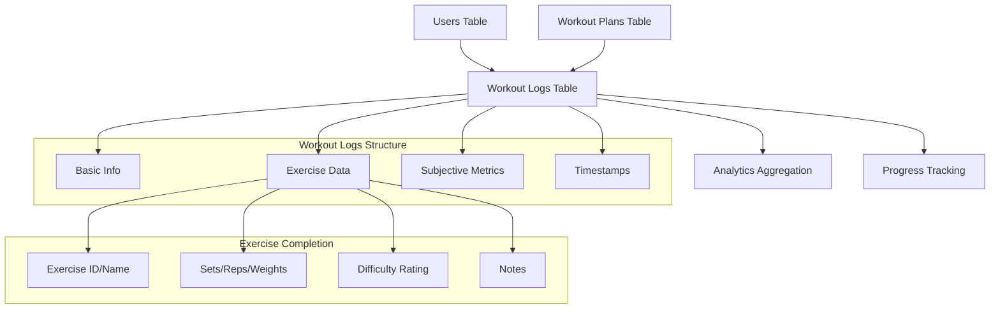
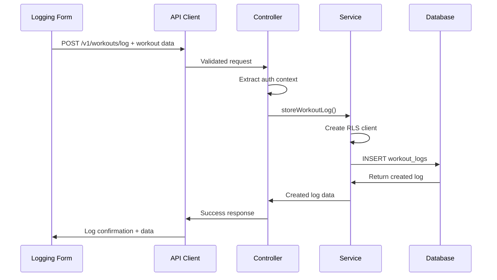
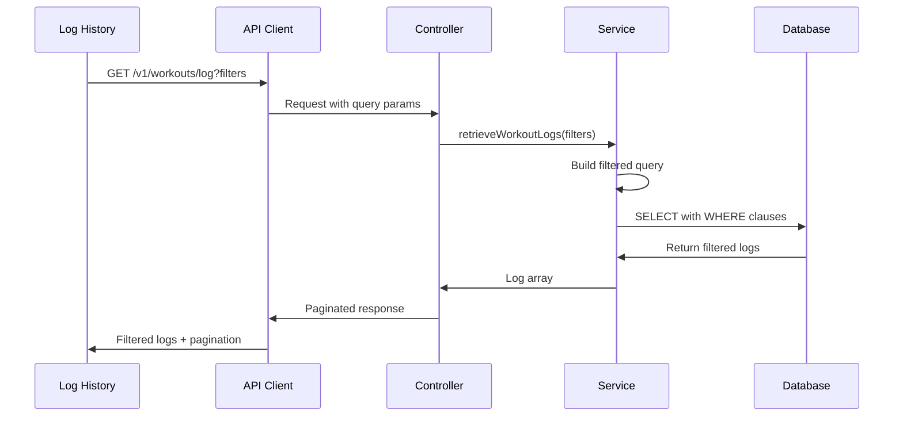
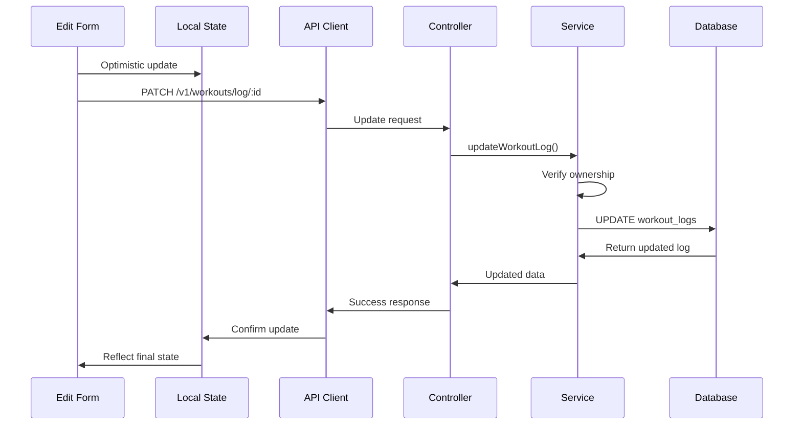

# Workout Logging Feature Integration Guide

## Table of Contents
1. [Overview](#overview)
2. [Architecture & Data Flow](#architecture--data-flow)
3. [API Endpoints Reference](#api-endpoints-reference)
4. [State Management](#state-management)
5. [Implementation Guide](#implementation-guide)
6. [UI Components](#ui-components)
7. [Real-time Updates](#real-time-updates)
8. [Error Handling](#error-handling)
9. [Testing Strategies](#testing-strategies)
10. [Troubleshooting](#troubleshooting)

---

## Overview

The Workout Logging feature provides comprehensive functionality for users to track and manage their completed workout sessions. This feature handles real-time workout tracking with detailed exercise completion data, subjective feedback capture, and historical log management with robust filtering capabilities. It integrates seamlessly with the workout management system to provide detailed analytics data.

### Key Capabilities
- **Real-time Workout Tracking**: Track exercises, sets, reps, and weights during workouts
- **Subjective Metrics Capture**: Difficulty, energy, and satisfaction ratings on 1-10 scales
- **Historical Log Management**: View, edit, and delete past workout sessions
- **Advanced Filtering**: Date range filtering, plan-based filtering, and pagination
- **Plan Integration**: Optional linking to generated workout plans
- **Data Integrity**: Comprehensive validation and foreign key relationships

### Business Value
- Enables detailed progress tracking and analytics
- Provides data for AI-driven insights and recommendations
- Supports habit formation through consistent logging
- Creates comprehensive fitness history for long-term analysis

---

## Architecture & Data Flow

### Database Relationship Architecture



### Data Flow Patterns

#### Log Creation Flow


#### Log Retrieval with Filtering


#### Update Flow with Optimistic UI


### Foreign Key Relationships

#### User Ownership (CASCADE)
```typescript
// user_id → auth.users.id (ON DELETE CASCADE)
// When user account is deleted, all workout logs are automatically deleted
```

#### Plan Association (SET NULL)
```typescript
// plan_id → workout_plans.id (ON DELETE SET NULL)
// When workout plan is deleted, logs persist but plan_id becomes null
```

### Authentication & Authorization

```typescript
// All operations require JWT authentication
const authenticatedRequest = async (endpoint: string, options: RequestInit = {}) => {
  const token = await getAuthToken();
  return fetch(`/api/v1/workouts/log${endpoint}`, {
    ...options,
    headers: {
      'Authorization': `Bearer ${token}`,
      'Content-Type': 'application/json',
      ...options.headers
    }
  });
};
```

---

## API Endpoints Reference

### 1. POST /v1/workouts/log
**Purpose**: Create a new workout log entry

```typescript
interface WorkoutLogCreateRequest {
  date: string; // YYYY-MM-DD format (required)
  plan_id?: string; // UUID reference to workout plan (optional)
  completed?: boolean; // Default: true
  exercises_completed: ExerciseCompleted[]; // Required, min 1 item
  overall_difficulty?: number; // 1-10 scale
  energy_level?: number; // 1-10 scale
  satisfaction?: number; // 1-10 scale
  feedback?: string; // Max 1000 characters
}

interface ExerciseCompleted {
  exercise_id: string; // Required - exercise identifier
  exercise_name: string; // Required - display name
  sets_completed: number; // Required - integer >= 1
  reps_completed: number[]; // Required - array of reps per set
  weights_used: number[]; // Required - array of weights per set
  felt_difficulty?: number; // Optional - 1-10 scale
  notes?: string; // Optional - max 500 characters
}
```

**Usage Example**:
```typescript
const logData: WorkoutLogCreateRequest = {
  date: '2025-01-15',
  plan_id: '550e8400-e29b-41d4-a716-446655440000',
  exercises_completed: [
    {
      exercise_id: 'bench-press',
      exercise_name: 'Bench Press',
      sets_completed: 3,
      reps_completed: [10, 8, 6],
      weights_used: [135, 155, 175],
      felt_difficulty: 7,
      notes: 'Good form on last set'
    },
    {
      exercise_id: 'squats',
      exercise_name: 'Squats',
      sets_completed: 3,
      reps_completed: [12, 10, 8],
      weights_used: [185, 205, 225],
      felt_difficulty: 8,
      notes: 'Depth improved'
    }
  ],
  overall_difficulty: 7,
  energy_level: 8,
  satisfaction: 9,
  feedback: 'Great workout, felt strong today'
};

const { data: log } = await workoutLogClient.createLog(logData);
```

**Response Structure**:
```typescript
interface WorkoutLogResponse {
  status: 'success';
  data: {
    id: string; // UUID
    user_id: string; // UUID
    plan_id: string | null; // UUID or null
    date: string; // YYYY-MM-DD
    completed: boolean;
    exercises_completed: ExerciseCompleted[];
    overall_difficulty: number | null;
    energy_level: number | null;
    satisfaction: number | null;
    feedback: string | null;
    created_at: string; // ISO timestamp
    updated_at: string; // ISO timestamp
  };
  message: 'Workout log saved successfully.';
}
```

**Rate Limiting**: 20 requests/hour per user

**Error Responses**:
- `400`: Validation errors (missing required fields, invalid data types)
- `401`: Authentication required
- `429`: Rate limit exceeded (20 requests/hour)
- `500`: Internal server error

---

### 2. GET /v1/workouts/log
**Purpose**: Retrieve paginated list of workout logs with filtering

```typescript
interface WorkoutLogListParams {
  limit?: number; // 1-100, default: 10
  offset?: number; // default: 0
  startDate?: string; // YYYY-MM-DD format
  endDate?: string; // YYYY-MM-DD format
  planId?: string; // UUID filter
}
```

**Usage Example**:
```typescript
const logs = await workoutLogClient.getLogs({
  limit: 20,
  startDate: '2025-01-01',
  endDate: '2025-01-31',
  planId: '550e8400-e29b-41d4-a716-446655440000'
});
```

**Response Structure**:
```typescript
interface WorkoutLogsListResponse {
  status: 'success';
  data: WorkoutLog[];
  message: 'Workout logs retrieved successfully.';
}
```

---

### 3. GET /v1/workouts/log/:logId
**Purpose**: Retrieve specific workout log by ID

```typescript
const log = await workoutLogClient.getLog(logId);
```

**Response Structure**:
```typescript
interface SingleWorkoutLogResponse {
  status: 'success';
  data: WorkoutLog;
  message: 'Workout log retrieved successfully.';
}
```

**Error Responses**:
- `401`: Authentication required
- `404`: Workout log not found or not owned by user
- `500`: Internal server error

---

### 4. PATCH /v1/workouts/log/:logId
**Purpose**: Update an existing workout log (partial updates)

```typescript
interface WorkoutLogUpdateRequest {
  plan_id?: string | null;
  date?: string;
  completed?: boolean;
  exercises_completed?: ExerciseCompleted[];
  overall_difficulty?: number;
  energy_level?: number;
  satisfaction?: number;
  feedback?: string;
}
```

**Usage Example**:
```typescript
const updates: WorkoutLogUpdateRequest = {
  overall_difficulty: 8,
  energy_level: 7,
  satisfaction: 8,
  feedback: 'Updated feedback after reflection'
};

const { data: updatedLog } = await workoutLogClient.updateLog(logId, updates);
```

**Rate Limiting**: 20 requests/hour per user

**Error Responses**:
- `400`: Validation errors
- `401`: Authentication required
- `404`: Workout log not found or not owned by user
- `429`: Rate limit exceeded
- `500`: Internal server error

---

### 5. DELETE /v1/workouts/log/:logId
**Purpose**: Permanently delete a workout log

```typescript
await workoutLogClient.deleteLog(logId);
// Returns 200 with success message
```

**Response Structure**:
```typescript
interface DeleteResponse {
  status: 'success';
  message: 'Workout log deleted successfully.';
}
```

**Error Responses**:
- `401`: Authentication required
- `404`: Workout log not found or not owned by user
- `500`: Internal server error

---

## State Management

### Workout Log State Structure

```typescript
interface WorkoutLogState {
  logs: WorkoutLog[];
  currentLog: WorkoutLog | null;
  activeSession: ActiveWorkoutSession | null;
  loading: boolean;
  error: string | null;
  filters: LogFilters;
  pagination: {
    total: number;
    offset: number;
    limit: number;
    hasMore: boolean;
  };
  rateLimitInfo: {
    remaining: number;
    resetTime: Date | null;
  };
}

interface ActiveWorkoutSession {
  sessionId: string;
  startTime: Date;
  exercises: SessionExercise[];
  currentExerciseIndex: number;
  isRestPeriod: boolean;
  restTimeRemaining?: number;
}

interface SessionExercise {
  exercise_id: string;
  exercise_name: string;
  plannedSets: number;
  completedSets: ExerciseSet[];
  currentSet: number;
  isCompleted: boolean;
}

interface ExerciseSet {
  reps: number;
  weight: number;
  completed: boolean;
  startTime?: Date;
  endTime?: Date;
}

interface LogFilters {
  dateRange: {
    start: string | null;
    end: string | null;
  };
  planId: string | null;
  completed: boolean | null;
  difficulty: {
    min: number | null;
    max: number | null;
  };
}
```

### Context Provider Implementation

```typescript
interface WorkoutLogContextValue extends WorkoutLogState {
  // Log management
  createLog: (data: WorkoutLogCreateRequest) => Promise<WorkoutLog>;
  updateLog: (logId: string, updates: WorkoutLogUpdateRequest) => Promise<WorkoutLog>;
  deleteLog: (logId: string) => Promise<void>;
  getLogs: (params?: WorkoutLogListParams) => Promise<void>;
  getLog: (logId: string) => Promise<WorkoutLog>;
  
  // Active session management
  startWorkoutSession: (exercises: SessionExercise[]) => void;
  completeSet: (exerciseIndex: number, setData: ExerciseSet) => void;
  skipSet: (exerciseIndex: number) => void;
  finishExercise: (exerciseIndex: number) => void;
  endWorkoutSession: () => Promise<WorkoutLog>;
  pauseWorkoutSession: () => void;
  resumeWorkoutSession: () => void;
  
  // Filtering and pagination
  setFilters: (filters: Partial<LogFilters>) => void;
  loadMoreLogs: () => Promise<void>;
  refreshLogs: () => Promise<void>;
  
  // Utility functions
  clearError: () => void;
  canCreateLog: boolean;
  timeUntilNextLog: number;
}

export const WorkoutLogProvider: React.FC<{ children: React.ReactNode }> = ({ children }) => {
  const [state, dispatch] = useReducer(workoutLogReducer, initialState);
  
  const createLog = useCallback(async (data: WorkoutLogCreateRequest) => {
    dispatch({ type: 'SET_LOADING', payload: true });
    
    try {
      const response = await workoutLogClient.createLog(data);
      dispatch({ type: 'ADD_LOG', payload: response.data });
      
      // Clear active session if completing from session
      if (state.activeSession) {
        dispatch({ type: 'CLEAR_ACTIVE_SESSION' });
      }
      
      return response.data;
    } catch (error) {
      if (error.status === 429) {
        dispatch({ 
          type: 'SET_RATE_LIMIT', 
          payload: { 
            remaining: 0, 
            resetTime: new Date(Date.now() + 3600000) // 1 hour
          }
        });
      }
      dispatch({ type: 'SET_ERROR', payload: error.message });
      throw error;
    } finally {
      dispatch({ type: 'SET_LOADING', payload: false });
    }
  }, [state.activeSession]);

  const updateLog = useCallback(async (logId: string, updates: WorkoutLogUpdateRequest) => {
    dispatch({ type: 'SET_LOADING', payload: true });
    
    try {
      const response = await workoutLogClient.updateLog(logId, updates);
      dispatch({ type: 'UPDATE_LOG', payload: response.data });
      
      if (state.currentLog?.id === logId) {
        dispatch({ type: 'SET_CURRENT_LOG', payload: response.data });
      }
      
      return response.data;
    } catch (error) {
      dispatch({ type: 'SET_ERROR', payload: error.message });
      throw error;
    } finally {
      dispatch({ type: 'SET_LOADING', payload: false });
    }
  }, [state.currentLog]);

  const startWorkoutSession = useCallback((exercises: SessionExercise[]) => {
    const session: ActiveWorkoutSession = {
      sessionId: generateSessionId(),
      startTime: new Date(),
      exercises: exercises.map(ex => ({
        ...ex,
        completedSets: [],
        currentSet: 0,
        isCompleted: false
      })),
      currentExerciseIndex: 0,
      isRestPeriod: false
    };
    
    dispatch({ type: 'START_WORKOUT_SESSION', payload: session });
  }, []);

  const completeSet = useCallback((exerciseIndex: number, setData: ExerciseSet) => {
    dispatch({ 
      type: 'COMPLETE_SET', 
      payload: { exerciseIndex, setData: { ...setData, completed: true, endTime: new Date() } }
    });
    
    // Start rest timer if not the last set
    const exercise = state.activeSession?.exercises[exerciseIndex];
    if (exercise && exercise.currentSet < exercise.plannedSets - 1) {
      dispatch({ type: 'START_REST_PERIOD', payload: 90 }); // 90 second default rest
    }
  }, [state.activeSession]);

  const endWorkoutSession = useCallback(async () => {
    if (!state.activeSession) throw new Error('No active workout session');
    
    const session = state.activeSession;
    const logData: WorkoutLogCreateRequest = {
      date: new Date().toISOString().split('T')[0],
      exercises_completed: session.exercises.map(exercise => ({
        exercise_id: exercise.exercise_id,
        exercise_name: exercise.exercise_name,
        sets_completed: exercise.completedSets.length,
        reps_completed: exercise.completedSets.map(set => set.reps),
        weights_used: exercise.completedSets.map(set => set.weight)
      }))
    };
    
    const createdLog = await createLog(logData);
    dispatch({ type: 'CLEAR_ACTIVE_SESSION' });
    
    return createdLog;
  }, [state.activeSession, createLog]);

  const canCreateLog = useMemo(() => {
    return state.rateLimitInfo.remaining > 0 || 
           (state.rateLimitInfo.resetTime && new Date() > state.rateLimitInfo.resetTime);
  }, [state.rateLimitInfo]);

  const timeUntilNextLog = useMemo(() => {
    if (canCreateLog) return 0;
    if (!state.rateLimitInfo.resetTime) return 0;
    return Math.max(0, state.rateLimitInfo.resetTime.getTime() - Date.now()) / 1000;
  }, [state.rateLimitInfo.resetTime, canCreateLog]);

  const value = {
    ...state,
    createLog,
    updateLog,
    deleteLog,
    getLogs,
    getLog,
    startWorkoutSession,
    completeSet,
    skipSet,
    finishExercise,
    endWorkoutSession,
    pauseWorkoutSession,
    resumeWorkoutSession,
    setFilters,
    loadMoreLogs,
    refreshLogs,
    clearError,
    canCreateLog,
    timeUntilNextLog
  };

  return (
    <WorkoutLogContext.Provider value={value}>
      {children}
    </WorkoutLogContext.Provider>
  );
};
```

### Workout Log Reducer

```typescript
type WorkoutLogAction =
  | { type: 'SET_LOADING'; payload: boolean }
  | { type: 'SET_ERROR'; payload: string | null }
  | { type: 'SET_LOGS'; payload: WorkoutLog[] }
  | { type: 'ADD_LOG'; payload: WorkoutLog }
  | { type: 'UPDATE_LOG'; payload: WorkoutLog }
  | { type: 'DELETE_LOG'; payload: string }
  | { type: 'SET_CURRENT_LOG'; payload: WorkoutLog | null }
  | { type: 'SET_FILTERS'; payload: Partial<LogFilters> }
  | { type: 'SET_PAGINATION'; payload: Partial<WorkoutLogState['pagination']> }
  | { type: 'START_WORKOUT_SESSION'; payload: ActiveWorkoutSession }
  | { type: 'COMPLETE_SET'; payload: { exerciseIndex: number; setData: ExerciseSet } }
  | { type: 'CLEAR_ACTIVE_SESSION' }
  | { type: 'SET_RATE_LIMIT'; payload: { remaining: number; resetTime: Date | null } }
  | { type: 'CLEAR_ERROR' };

const workoutLogReducer = (state: WorkoutLogState, action: WorkoutLogAction): WorkoutLogState => {
  switch (action.type) {
    case 'SET_LOADING':
      return { ...state, loading: action.payload };
    
    case 'SET_ERROR':
      return { ...state, error: action.payload, loading: false };
    
    case 'SET_LOGS':
      return { 
        ...state, 
        logs: action.payload, 
        loading: false, 
        error: null 
      };
    
    case 'ADD_LOG':
      return {
        ...state,
        logs: [action.payload, ...state.logs],
        loading: false,
        error: null
      };
    
    case 'UPDATE_LOG':
      return {
        ...state,
        logs: state.logs.map(log => 
          log.id === action.payload.id ? action.payload : log
        ),
        loading: false,
        error: null
      };
    
    case 'DELETE_LOG':
      return {
        ...state,
        logs: state.logs.filter(log => log.id !== action.payload),
        currentLog: state.currentLog?.id === action.payload ? null : state.currentLog,
        loading: false,
        error: null
      };
    
    case 'START_WORKOUT_SESSION':
      return {
        ...state,
        activeSession: action.payload
      };
    
    case 'COMPLETE_SET': {
      if (!state.activeSession) return state;
      
      const { exerciseIndex, setData } = action.payload;
      const updatedExercises = [...state.activeSession.exercises];
      updatedExercises[exerciseIndex] = {
        ...updatedExercises[exerciseIndex],
        completedSets: [...updatedExercises[exerciseIndex].completedSets, setData],
        currentSet: updatedExercises[exerciseIndex].currentSet + 1
      };
      
      return {
        ...state,
        activeSession: {
          ...state.activeSession,
          exercises: updatedExercises
        }
      };
    }
    
    case 'CLEAR_ACTIVE_SESSION':
      return {
        ...state,
        activeSession: null
      };
    
    case 'SET_RATE_LIMIT':
      return {
        ...state,
        rateLimitInfo: action.payload
      };
    
    case 'CLEAR_ERROR':
      return { ...state, error: null };
    
    default:
      return state;
  }
};
```

---

## Implementation Guide

### Step 1: API Client Setup

```typescript
// api/workoutLogClient.ts
import { apiClient } from './base';

export const workoutLogClient = {
  async createLog(data: WorkoutLogCreateRequest): Promise<WorkoutLogResponse> {
    const response = await apiClient.post('/workouts/log', data);
    return response.data;
  },

  async getLogs(params?: WorkoutLogListParams): Promise<WorkoutLogsListResponse> {
    const queryParams = new URLSearchParams(params as any).toString();
    const response = await apiClient.get(`/workouts/log?${queryParams}`);
    return response.data;
  },

  async getLog(logId: string): Promise<SingleWorkoutLogResponse> {
    const response = await apiClient.get(`/workouts/log/${logId}`);
    return response.data;
  },

  async updateLog(logId: string, updates: WorkoutLogUpdateRequest): Promise<WorkoutLogResponse> {
    const response = await apiClient.patch(`/workouts/log/${logId}`, updates);
    return response.data;
  },

  async deleteLog(logId: string): Promise<DeleteResponse> {
    const response = await apiClient.delete(`/workouts/log/${logId}`);
    return response.data;
  }
};
```

### Step 2: Form Validation Setup

```typescript
// validation/workoutLogSchemas.ts
import * as yup from 'yup';

export const exerciseCompletedSchema = yup.object({
  exercise_id: yup.string().required('Exercise ID is required'),
  exercise_name: yup.string().required('Exercise name is required'),
  sets_completed: yup.number().integer().min(1, 'Must complete at least 1 set').required(),
  reps_completed: yup.array()
    .of(yup.number().integer().min(0, 'Reps cannot be negative'))
    .min(1, 'Must have reps for each set')
    .required(),
  weights_used: yup.array()
    .of(yup.number().min(0, 'Weight cannot be negative'))
    .min(1, 'Must have weight for each set')
    .required(),
  felt_difficulty: yup.number()
    .integer()
    .min(1, 'Difficulty must be between 1-10')
    .max(10, 'Difficulty must be between 1-10')
    .nullable(),
  notes: yup.string().max(500, 'Notes cannot exceed 500 characters').nullable()
});

export const workoutLogCreateSchema = yup.object({
  date: yup.date().required('Date is required').max(new Date(), 'Cannot log future workouts'),
  plan_id: yup.string().uuid('Invalid plan ID format').nullable(),
  completed: yup.boolean().default(true),
  exercises_completed: yup.array()
    .of(exerciseCompletedSchema)
    .min(1, 'Must complete at least one exercise')
    .required(),
  overall_difficulty: yup.number()
    .integer()
    .min(1, 'Difficulty must be between 1-10')
    .max(10, 'Difficulty must be between 1-10')
    .nullable(),
  energy_level: yup.number()
    .integer()
    .min(1, 'Energy level must be between 1-10')
    .max(10, 'Energy level must be between 1-10')
    .nullable(),
  satisfaction: yup.number()
    .integer()
    .min(1, 'Satisfaction must be between 1-10')
    .max(10, 'Satisfaction must be between 1-10')
    .nullable(),
  feedback: yup.string().max(1000, 'Feedback cannot exceed 1000 characters').nullable()
});

export const workoutLogUpdateSchema = yup.object({
  plan_id: yup.string().uuid('Invalid plan ID format').nullable(),
  date: yup.date().max(new Date(), 'Cannot log future workouts'),
  completed: yup.boolean(),
  exercises_completed: yup.array().of(exerciseCompletedSchema).min(1),
  overall_difficulty: yup.number().integer().min(1).max(10).nullable(),
  energy_level: yup.number().integer().min(1).max(10).nullable(),
  satisfaction: yup.number().integer().min(1).max(10).nullable(),
  feedback: yup.string().max(1000).nullable()
}).test('at-least-one', 'At least one field must be updated', function(value) {
  return Object.keys(value || {}).length > 0;
});

export const workoutLogFiltersSchema = yup.object({
  limit: yup.number().integer().min(1).max(100).default(10),
  offset: yup.number().integer().min(0).default(0),
  startDate: yup.date().nullable(),
  endDate: yup.date().nullable(),
  planId: yup.string().uuid('Invalid plan ID format').nullable()
});
```

### Step 3: Rate Limit Management Hook

```typescript
// hooks/useWorkoutLogRateLimit.ts
export const useWorkoutLogRateLimit = () => {
  const { rateLimitInfo, canCreateLog, timeUntilNextLog } = useWorkoutLog();
  
  const formatTimeUntilReset = () => {
    if (timeUntilNextLog <= 0) return null;
    
    const hours = Math.floor(timeUntilNextLog / 3600);
    const minutes = Math.floor((timeUntilNextLog % 3600) / 60);
    const seconds = Math.floor(timeUntilNextLog % 60);
    
    if (hours > 0) return `${hours}h ${minutes}m`;
    if (minutes > 0) return `${minutes}m ${seconds}s`;
    return `${seconds}s`;
  };
  
  const getRateLimitMessage = () => {
    if (canCreateLog) return null;
    
    const timeLeft = formatTimeUntilReset();
    return `You've reached the logging limit (20 per hour). Try again in ${timeLeft}.`;
  };
  
  return {
    canCreateLog,
    remainingLogs: rateLimitInfo.remaining,
    timeUntilReset: formatTimeUntilReset(),
    rateLimitMessage: getRateLimitMessage()
  };
};
```

### Step 4: Active Session Management Hook

```typescript
// hooks/useActiveWorkoutSession.ts
export const useActiveWorkoutSession = () => {
  const { 
    activeSession, 
    startWorkoutSession, 
    completeSet, 
    endWorkoutSession,
    pauseWorkoutSession,
    resumeWorkoutSession 
  } = useWorkoutLog();
  
  const getCurrentExercise = () => {
    if (!activeSession) return null;
    return activeSession.exercises[activeSession.currentExerciseIndex];
  };
  
  const getSessionProgress = () => {
    if (!activeSession) return { completed: 0, total: 0, percentage: 0 };
    
    const totalSets = activeSession.exercises.reduce((sum, ex) => sum + ex.plannedSets, 0);
    const completedSets = activeSession.exercises.reduce((sum, ex) => sum + ex.completedSets.length, 0);
    
    return {
      completed: completedSets,
      total: totalSets,
      percentage: totalSets > 0 ? (completedSets / totalSets) * 100 : 0
    };
  };
  
  const getSessionDuration = () => {
    if (!activeSession) return 0;
    return Math.floor((Date.now() - activeSession.startTime.getTime()) / 1000);
  };
  
  const moveToNextExercise = () => {
    if (!activeSession || activeSession.currentExerciseIndex >= activeSession.exercises.length - 1) {
      return false; // Session complete
    }
    
    const nextIndex = activeSession.currentExerciseIndex + 1;
    // This would trigger a dispatch to update currentExerciseIndex
    return true;
  };
  
  return {
    activeSession,
    currentExercise: getCurrentExercise(),
    progress: getSessionProgress(),
    duration: getSessionDuration(),
    startWorkoutSession,
    completeSet,
    endWorkoutSession,
    pauseWorkoutSession,
    resumeWorkoutSession,
    moveToNextExercise,
    isActive: !!activeSession
  };
};
```

---

## UI Components

### WorkoutLogCreationForm Component

```typescript
// components/WorkoutLogCreationForm.tsx
interface WorkoutLogCreationFormProps {
  initialData?: Partial<WorkoutLogCreateRequest>;
  planId?: string;
  onLogCreated?: (log: WorkoutLog) => void;
}

export const WorkoutLogCreationForm: React.FC<WorkoutLogCreationFormProps> = ({
  initialData,
  planId,
  onLogCreated
}) => {
  const { createLog, loading } = useWorkoutLog();
  const { canCreateLog, rateLimitMessage } = useWorkoutLogRateLimit();
  
  const form = useForm<WorkoutLogCreateRequest>({
    resolver: yupResolver(workoutLogCreateSchema),
    defaultValues: {
      date: new Date().toISOString().split('T')[0],
      plan_id: planId || initialData?.plan_id || null,
      completed: true,
      exercises_completed: initialData?.exercises_completed || [
        {
          exercise_id: '',
          exercise_name: '',
          sets_completed: 1,
          reps_completed: [0],
          weights_used: [0]
        }
      ],
      overall_difficulty: initialData?.overall_difficulty || null,
      energy_level: initialData?.energy_level || null,
      satisfaction: initialData?.satisfaction || null,
      feedback: initialData?.feedback || ''
    }
  });
  
  const { fields, append, remove } = useFieldArray({
    control: form.control,
    name: 'exercises_completed'
  });
  
  const handleSubmit = async (data: WorkoutLogCreateRequest) => {
    try {
      const log = await createLog(data);
      onLogCreated?.(log);
      form.reset();
    } catch (error) {
      // Error handling in context
    }
  };
  
  return (
    <form onSubmit={form.handleSubmit(handleSubmit)} className="space-y-6">
      {/* Date and Plan Selection */}
      <div className="grid grid-cols-2 gap-4">
        <div>
          <label className="block text-sm font-medium mb-2">Workout Date</label>
          <input
            type="date"
            {...form.register('date')}
            max={new Date().toISOString().split('T')[0]}
            className="w-full border rounded-md p-2"
          />
          {form.formState.errors.date && (
            <p className="text-red-500 text-sm mt-1">{form.formState.errors.date.message}</p>
          )}
        </div>
        
        <div>
          <label className="block text-sm font-medium mb-2">Workout Plan (Optional)</label>
          <WorkoutPlanSelector
            value={form.watch('plan_id')}
            onChange={(planId) => form.setValue('plan_id', planId)}
            allowClear
          />
        </div>
      </div>
      
      {/* Exercises Section */}
      <div>
        <div className="flex justify-between items-center mb-4">
          <h3 className="text-lg font-medium">Exercises Completed</h3>
          <Button
            type="button"
            variant="outline"
            onClick={() => append({
              exercise_id: '',
              exercise_name: '',
              sets_completed: 1,
              reps_completed: [0],
              weights_used: [0]
            })}
          >
            Add Exercise
          </Button>
        </div>
        
        {fields.map((field, index) => (
          <ExerciseCompletedInput
            key={field.id}
            index={index}
            control={form.control}
            onRemove={() => fields.length > 1 && remove(index)}
            errors={form.formState.errors.exercises_completed?.[index]}
          />
        ))}
      </div>
      
      {/* Subjective Metrics */}
      <div className="grid grid-cols-3 gap-4">
        <RatingInput
          label="Overall Difficulty"
          value={form.watch('overall_difficulty')}
          onChange={(value) => form.setValue('overall_difficulty', value)}
          min={1}
          max={10}
          optional
        />
        <RatingInput
          label="Energy Level"
          value={form.watch('energy_level')}
          onChange={(value) => form.setValue('energy_level', value)}
          min={1}
          max={10}
          optional
        />
        <RatingInput
          label="Satisfaction"
          value={form.watch('satisfaction')}
          onChange={(value) => form.setValue('satisfaction', value)}
          min={1}
          max={10}
          optional
        />
      </div>
      
      {/* Feedback */}
      <div>
        <label className="block text-sm font-medium mb-2">Workout Feedback</label>
        <textarea
          {...form.register('feedback')}
          rows={4}
          maxLength={1000}
          placeholder="How did the workout feel? Any notes or observations..."
          className="w-full border rounded-md p-3"
        />
        <div className="text-sm text-gray-500 mt-1">
          {form.watch('feedback')?.length || 0}/1000 characters
        </div>
      </div>
      
      {/* Rate Limit Warning */}
      {!canCreateLog && rateLimitMessage && (
        <div className="bg-yellow-50 border border-yellow-200 rounded-lg p-4">
          <p className="text-yellow-800">{rateLimitMessage}</p>
        </div>
      )}
      
      <Button
        type="submit"
        disabled={loading || !canCreateLog}
        className="w-full"
      >
        {loading ? 'Saving Workout...' : 'Save Workout Log'}
      </Button>
    </form>
  );
};
```

### ExerciseCompletedInput Component

```typescript
// components/ExerciseCompletedInput.tsx
interface ExerciseCompletedInputProps {
  index: number;
  control: Control<WorkoutLogCreateRequest>;
  onRemove: () => void;
  errors?: FieldError;
}

export const ExerciseCompletedInput: React.FC<ExerciseCompletedInputProps> = ({
  index,
  control,
  onRemove,
  errors
}) => {
  const { fields: repsFields, append: appendRep, remove: removeRep } = useFieldArray({
    control,
    name: `exercises_completed.${index}.reps_completed`
  });
  
  const { fields: weightsFields, append: appendWeight, remove: removeWeight } = useFieldArray({
    control,
    name: `exercises_completed.${index}.weights_used`
  });
  
  const setsCompleted = useWatch({
    control,
    name: `exercises_completed.${index}.sets_completed`
  });
  
  // Sync reps and weights arrays with sets_completed
  useEffect(() => {
    const currentReps = repsFields.length;
    const currentWeights = weightsFields.length;
    
    if (setsCompleted > currentReps) {
      for (let i = currentReps; i < setsCompleted; i++) {
        appendRep(0);
      }
    } else if (setsCompleted < currentReps) {
      for (let i = currentReps - 1; i >= setsCompleted; i--) {
        removeRep(i);
      }
    }
    
    if (setsCompleted > currentWeights) {
      for (let i = currentWeights; i < setsCompleted; i++) {
        appendWeight(0);
      }
    } else if (setsCompleted < currentWeights) {
      for (let i = currentWeights - 1; i >= setsCompleted; i--) {
        removeWeight(i);
      }
    }
  }, [setsCompleted, repsFields.length, weightsFields.length]);
  
  return (
    <div className="border rounded-lg p-4 mb-4">
      <div className="flex justify-between items-start mb-4">
        <h4 className="font-medium">Exercise {index + 1}</h4>
        <Button
          type="button"
          variant="ghost"
          size="sm"
          onClick={onRemove}
          className="text-red-600 hover:text-red-700"
        >
          Remove
        </Button>
      </div>
      
      {/* Exercise Selection */}
      <div className="grid grid-cols-2 gap-4 mb-4">
        <div>
          <label className="block text-sm font-medium mb-1">Exercise</label>
          <ExerciseSelector
            control={control}
            name={`exercises_completed.${index}.exercise_id`}
            nameField={`exercises_completed.${index}.exercise_name`}
          />
        </div>
        
        <div>
          <label className="block text-sm font-medium mb-1">Sets Completed</label>
          <Controller
            control={control}
            name={`exercises_completed.${index}.sets_completed`}
            render={({ field }) => (
              <input
                type="number"
                min={1}
                max={20}
                {...field}
                onChange={(e) => field.onChange(parseInt(e.target.value) || 1)}
                className="w-full border rounded-md p-2"
              />
            )}
          />
        </div>
      </div>
      
      {/* Sets Details */}
      <div className="space-y-2">
        <h5 className="text-sm font-medium">Set Details</h5>
        {Array.from({ length: setsCompleted }).map((_, setIndex) => (
          <div key={setIndex} className="grid grid-cols-3 gap-2 items-center">
            <div className="text-sm font-medium">Set {setIndex + 1}:</div>
            <div>
              <Controller
                control={control}
                name={`exercises_completed.${index}.reps_completed.${setIndex}`}
                render={({ field }) => (
                  <input
                    type="number"
                    min={0}
                    placeholder="Reps"
                    {...field}
                    onChange={(e) => field.onChange(parseInt(e.target.value) || 0)}
                    className="w-full border rounded-md p-1 text-sm"
                  />
                )}
              />
            </div>
            <div>
              <Controller
                control={control}
                name={`exercises_completed.${index}.weights_used.${setIndex}`}
                render={({ field }) => (
                  <input
                    type="number"
                    min={0}
                    step={0.5}
                    placeholder="Weight"
                    {...field}
                    onChange={(e) => field.onChange(parseFloat(e.target.value) || 0)}
                    className="w-full border rounded-md p-1 text-sm"
                  />
                )}
              />
            </div>
          </div>
        ))}
      </div>
      
      {/* Optional Fields */}
      <div className="grid grid-cols-2 gap-4 mt-4">
        <div>
          <label className="block text-sm font-medium mb-1">Difficulty (1-10)</label>
          <Controller
            control={control}
            name={`exercises_completed.${index}.felt_difficulty`}
            render={({ field }) => (
              <RatingInput
                value={field.value}
                onChange={field.onChange}
                min={1}
                max={10}
                optional
                size="sm"
              />
            )}
          />
        </div>
        
        <div>
          <label className="block text-sm font-medium mb-1">Notes</label>
          <Controller
            control={control}
            name={`exercises_completed.${index}.notes`}
            render={({ field }) => (
              <textarea
                {...field}
                rows={2}
                maxLength={500}
                placeholder="Exercise notes..."
                className="w-full border rounded-md p-2 text-sm"
              />
            )}
          />
        </div>
      </div>
      
      {errors && (
        <div className="mt-2 text-red-500 text-sm">
          Error in exercise {index + 1}: {errors.message}
        </div>
      )}
    </div>
  );
};
```

### WorkoutLogsList Component

```typescript
// components/WorkoutLogsList.tsx
interface WorkoutLogsListProps {
  showFilters?: boolean;
  onLogSelect?: (log: WorkoutLog) => void;
}

export const WorkoutLogsList: React.FC<WorkoutLogsListProps> = ({
  showFilters = true,
  onLogSelect
}) => {
  const { 
    logs, 
    loading, 
    filters, 
    setFilters, 
    loadMoreLogs, 
    refreshLogs,
    pagination
  } = useWorkoutLog();
  
  const [localFilters, setLocalFilters] = useState(filters);
  
  const handleFilterChange = useDebouncedCallback((newFilters: Partial<LogFilters>) => {
    setFilters(newFilters);
  }, 500);
  
  useEffect(() => {
    handleFilterChange(localFilters);
  }, [localFilters]);
  
  return (
    <div className="space-y-6">
      {/* Filters */}
      {showFilters && (
        <WorkoutLogFilters
          filters={localFilters}
          onChange={setLocalFilters}
          onReset={() => {
            const resetFilters = {
              dateRange: { start: null, end: null },
              planId: null,
              completed: null,
              difficulty: { min: null, max: null }
            };
            setLocalFilters(resetFilters);
            setFilters(resetFilters);
          }}
        />
      )}
      
      {/* Logs List */}
      <div className="space-y-4">
        {loading && logs.length === 0 ? (
          <div className="space-y-4">
            {Array.from({ length: 5 }).map((_, i) => (
              <WorkoutLogSkeleton key={i} />
            ))}
          </div>
        ) : logs.length === 0 ? (
          <EmptyState
            title="No workout logs found"
            description="Start logging your workouts to see them here."
            action={
              <Button onClick={() => onLogSelect?.(null)}>
                Log Your First Workout
              </Button>
            }
          />
        ) : (
          <>
            {logs.map((log) => (
              <WorkoutLogCard
                key={log.id}
                log={log}
                onClick={() => onLogSelect?.(log)}
              />
            ))}
            
            {/* Load More */}
            {pagination.hasMore && (
              <div className="text-center">
                <Button
                  variant="outline"
                  onClick={loadMoreLogs}
                  disabled={loading}
                >
                  {loading ? 'Loading...' : 'Load More'}
                </Button>
              </div>
            )}
          </>
        )}
      </div>
      
      {/* Refresh Button */}
      <div className="text-center">
        <Button
          variant="ghost"
          onClick={refreshLogs}
          disabled={loading}
        >
          <RefreshIcon className="w-4 h-4 mr-2" />
          Refresh
        </Button>
      </div>
    </div>
  );
};
```

### WorkoutLogCard Component

```typescript
// components/WorkoutLogCard.tsx
interface WorkoutLogCardProps {
  log: WorkoutLog;
  onClick?: () => void;
  showActions?: boolean;
}

export const WorkoutLogCard: React.FC<WorkoutLogCardProps> = ({
  log,
  onClick,
  showActions = true
}) => {
  const { updateLog, deleteLog } = useWorkoutLog();
  const [showDeleteConfirm, setShowDeleteConfirm] = useState(false);
  
  const totalSets = log.exercises_completed.reduce((sum, ex) => sum + ex.sets_completed, 0);
  const totalVolume = log.exercises_completed.reduce((sum, ex) => 
    sum + ex.weights_used.reduce((setSum, weight, i) => setSum + (weight * ex.reps_completed[i]), 0), 0
  );
  
  const handleQuickUpdate = async (field: string, value: any) => {
    try {
      await updateLog(log.id, { [field]: value });
    } catch (error) {
      // Error handling in context
    }
  };
  
  const handleDelete = async () => {
    try {
      await deleteLog(log.id);
      setShowDeleteConfirm(false);
    } catch (error) {
      // Error handling in context
    }
  };
  
  return (
    <div className="border rounded-lg bg-white shadow-sm hover:shadow-md transition-shadow">
      <div className="p-4">
        {/* Header */}
        <div className="flex justify-between items-start mb-3">
          <div>
            <h3 className="font-semibold text-lg">
              {new Date(log.date).toLocaleDateString('en-US', {
                weekday: 'long',
                year: 'numeric',
                month: 'long',
                day: 'numeric'
              })}
            </h3>
            {log.plan_id && (
              <p className="text-sm text-gray-600">From workout plan</p>
            )}
          </div>
          
          {showActions && (
            <div className="flex space-x-2">
              <Button variant="ghost" size="sm" onClick={onClick}>
                <EyeIcon className="w-4 h-4" />
              </Button>
              <DropdownMenu>
                <DropdownMenuTrigger asChild>
                  <Button variant="ghost" size="sm">
                    <MoreVerticalIcon className="w-4 h-4" />
                  </Button>
                </DropdownMenuTrigger>
                <DropdownMenuContent>
                  <DropdownMenuItem onClick={onClick}>
                    View Details
                  </DropdownMenuItem>
                  <DropdownMenuItem onClick={onClick}>
                    Edit Log
                  </DropdownMenuItem>
                  <DropdownMenuSeparator />
                  <DropdownMenuItem 
                    onClick={() => setShowDeleteConfirm(true)}
                    className="text-red-600"
                  >
                    Delete Log
                  </DropdownMenuItem>
                </DropdownMenuContent>
              </DropdownMenu>
            </div>
          )}
        </div>
        
        {/* Exercise Summary */}
        <div className="grid grid-cols-3 gap-4 mb-4 text-sm">
          <div>
            <span className="text-gray-600">Exercises:</span>
            <span className="font-medium ml-1">{log.exercises_completed.length}</span>
          </div>
          <div>
            <span className="text-gray-600">Total Sets:</span>
            <span className="font-medium ml-1">{totalSets}</span>
          </div>
          <div>
            <span className="text-gray-600">Volume:</span>
            <span className="font-medium ml-1">{totalVolume.toLocaleString()} lbs</span>
          </div>
        </div>
        
        {/* Exercises Preview */}
        <div className="mb-4">
          <div className="flex flex-wrap gap-2">
            {log.exercises_completed.slice(0, 3).map((exercise, index) => (
              <div key={index} className="bg-blue-50 px-2 py-1 rounded text-sm">
                {exercise.exercise_name}
              </div>
            ))}
            {log.exercises_completed.length > 3 && (
              <div className="bg-gray-100 px-2 py-1 rounded text-sm">
                +{log.exercises_completed.length - 3} more
              </div>
            )}
          </div>
        </div>
        
        {/* Subjective Metrics */}
        <div className="grid grid-cols-3 gap-4 mb-4">
          <QuickRatingUpdate
            label="Difficulty"
            value={log.overall_difficulty}
            onChange={(value) => handleQuickUpdate('overall_difficulty', value)}
            color="red"
          />
          <QuickRatingUpdate
            label="Energy"
            value={log.energy_level}
            onChange={(value) => handleQuickUpdate('energy_level', value)}
            color="yellow"
          />
          <QuickRatingUpdate
            label="Satisfaction"
            value={log.satisfaction}
            onChange={(value) => handleQuickUpdate('satisfaction', value)}
            color="green"
          />
        </div>
        
        {/* Feedback Preview */}
        {log.feedback && (
          <div className="bg-gray-50 p-3 rounded text-sm">
            <p className="text-gray-700 line-clamp-2">{log.feedback}</p>
          </div>
        )}
        
        {/* Footer */}
        <div className="flex justify-between items-center mt-4 text-xs text-gray-500">
          <span>Logged {new Date(log.created_at).toLocaleDateString()}</span>
          {log.updated_at !== log.created_at && (
            <span>Updated {new Date(log.updated_at).toLocaleDateString()}</span>
          )}
        </div>
      </div>
      
      {/* Delete Confirmation Modal */}
      <ConfirmDialog
        open={showDeleteConfirm}
        onOpenChange={setShowDeleteConfirm}
        title="Delete Workout Log"
        description="Are you sure you want to delete this workout log? This action cannot be undone."
        confirmText="Delete"
        confirmVariant="destructive"
        onConfirm={handleDelete}
      />
    </div>
  );
};
```

### ActiveWorkoutSession Component

```typescript
// components/ActiveWorkoutSession.tsx
export const ActiveWorkoutSession: React.FC = () => {
  const {
    activeSession,
    currentExercise,
    progress,
    duration,
    completeSet,
    endWorkoutSession,
    pauseWorkoutSession,
    resumeWorkoutSession,
    moveToNextExercise
  } = useActiveWorkoutSession();
  
  const [currentSetData, setCurrentSetData] = useState<{
    reps: number;
    weight: number;
  }>({ reps: 0, weight: 0 });
  
  const [isResting, setIsResting] = useState(false);
  const [restTimer, setRestTimer] = useState(0);
  
  if (!activeSession || !currentExercise) {
    return null;
  }
  
  const handleCompleteSet = () => {
    const setData: ExerciseSet = {
      reps: currentSetData.reps,
      weight: currentSetData.weight,
      completed: true,
      startTime: new Date(),
      endTime: new Date()
    };
    
    completeSet(activeSession.currentExerciseIndex, setData);
    
    // Reset form and start rest timer
    setCurrentSetData({ reps: 0, weight: 0 });
    if (currentExercise.currentSet < currentExercise.plannedSets - 1) {
      setIsResting(true);
      setRestTimer(90); // 90 second rest
    } else {
      // Move to next exercise or complete workout
      if (!moveToNextExercise()) {
        // Workout complete
        endWorkoutSession();
      }
    }
  };
  
  const formatDuration = (seconds: number) => {
    const hours = Math.floor(seconds / 3600);
    const minutes = Math.floor((seconds % 3600) / 60);
    const secs = seconds % 60;
    
    if (hours > 0) {
      return `${hours}:${minutes.toString().padStart(2, '0')}:${secs.toString().padStart(2, '0')}`;
    }
    return `${minutes}:${secs.toString().padStart(2, '0')}`;
  };
  
  return (
    <div className="fixed bottom-0 left-0 right-0 bg-white border-t shadow-lg p-4 z-50">
      {/* Session Header */}
      <div className="flex justify-between items-center mb-4">
        <div>
          <h3 className="font-semibold">Active Workout</h3>
          <p className="text-sm text-gray-600">Duration: {formatDuration(duration)}</p>
        </div>
        <div className="flex space-x-2">
          <Button variant="outline" size="sm" onClick={pauseWorkoutSession}>
            Pause
          </Button>
          <Button variant="destructive" size="sm" onClick={endWorkoutSession}>
            End Workout
          </Button>
        </div>
      </div>
      
      {/* Progress Bar */}
      <div className="mb-4">
        <div className="flex justify-between text-sm mb-1">
          <span>Progress</span>
          <span>{progress.completed}/{progress.total} sets</span>
        </div>
        <div className="bg-gray-200 rounded-full h-2">
          <div
            className="bg-blue-600 h-2 rounded-full transition-all duration-300"
            style={{ width: `${progress.percentage}%` }}
          />
        </div>
      </div>
      
      {/* Current Exercise */}
      <div className="mb-4">
        <h4 className="font-medium mb-2">{currentExercise.exercise_name}</h4>
        <p className="text-sm text-gray-600">
          Set {currentExercise.currentSet + 1} of {currentExercise.plannedSets}
        </p>
      </div>
      
      {/* Rest Timer */}
      {isResting ? (
        <div className="text-center">
          <div className="text-3xl font-bold text-blue-600 mb-2">
            {formatDuration(restTimer)}
          </div>
          <p className="text-sm text-gray-600 mb-4">Rest time remaining</p>
          <Button
            onClick={() => {
              setIsResting(false);
              setRestTimer(0);
            }}
            className="w-full"
          >
            Skip Rest
          </Button>
        </div>
      ) : (
        /* Set Input */
        <div className="grid grid-cols-3 gap-3">
          <div>
            <label className="block text-sm font-medium mb-1">Reps</label>
            <input
              type="number"
              min={0}
              value={currentSetData.reps}
              onChange={(e) => setCurrentSetData(prev => ({
                ...prev,
                reps: parseInt(e.target.value) || 0
              }))}
              className="w-full border rounded-md p-2"
            />
          </div>
          <div>
            <label className="block text-sm font-medium mb-1">Weight</label>
            <input
              type="number"
              min={0}
              step={0.5}
              value={currentSetData.weight}
              onChange={(e) => setCurrentSetData(prev => ({
                ...prev,
                weight: parseFloat(e.target.value) || 0
              }))}
              className="w-full border rounded-md p-2"
            />
          </div>
          <div className="flex items-end">
            <Button
              onClick={handleCompleteSet}
              disabled={currentSetData.reps === 0}
              className="w-full"
            >
              Complete Set
            </Button>
          </div>
        </div>
      )}
    </div>
  );
};
```

---

## Real-time Updates

### Live Workout Tracking

```typescript
// hooks/useWorkoutTimer.ts
export const useWorkoutTimer = () => {
  const [startTime, setStartTime] = useState<Date | null>(null);
  const [duration, setDuration] = useState(0);
  const [isRunning, setIsRunning] = useState(false);
  
  useEffect(() => {
    let interval: NodeJS.Timeout;
    
    if (isRunning && startTime) {
      interval = setInterval(() => {
        setDuration(Math.floor((Date.now() - startTime.getTime()) / 1000));
      }, 1000);
    }
    
    return () => clearInterval(interval);
  }, [isRunning, startTime]);
  
  const start = () => {
    setStartTime(new Date());
    setIsRunning(true);
  };
  
  const pause = () => {
    setIsRunning(false);
  };
  
  const resume = () => {
    if (startTime) {
      // Adjust start time to account for paused duration
      const pausedDuration = Date.now() - startTime.getTime() - (duration * 1000);
      setStartTime(new Date(Date.now() - (duration * 1000)));
      setIsRunning(true);
    }
  };
  
  const reset = () => {
    setStartTime(null);
    setDuration(0);
    setIsRunning(false);
  };
  
  return {
    duration,
    isRunning,
    start,
    pause,
    resume,
    reset,
    formatDuration: (seconds: number) => {
      const hours = Math.floor(seconds / 3600);
      const minutes = Math.floor((seconds % 3600) / 60);
      const secs = seconds % 60;
      
      if (hours > 0) {
        return `${hours}:${minutes.toString().padStart(2, '0')}:${secs.toString().padStart(2, '0')}`;
      }
      return `${minutes}:${secs.toString().padStart(2, '0')}`;
    }
  };
};
```

### Optimistic UI Updates

```typescript
// hooks/useOptimisticWorkoutLog.ts
export const useOptimisticWorkoutLog = () => {
  const { logs, updateLog, deleteLog } = useWorkoutLog();
  const [optimisticUpdates, setOptimisticUpdates] = useState<Map<string, Partial<WorkoutLog>>>(new Map());
  
  const optimisticUpdate = async (logId: string, updates: Partial<WorkoutLog>) => {
    // Apply optimistic update
    setOptimisticUpdates(prev => new Map(prev).set(logId, { ...prev.get(logId), ...updates }));
    
    try {
      // Perform actual update
      await updateLog(logId, updates);
      // Clear optimistic update on success
      setOptimisticUpdates(prev => {
        const newMap = new Map(prev);
        newMap.delete(logId);
        return newMap;
      });
    } catch (error) {
      // Revert optimistic update on failure
      setOptimisticUpdates(prev => {
        const newMap = new Map(prev);
        newMap.delete(logId);
        return newMap;
      });
      throw error;
    }
  };
  
  const optimisticDelete = async (logId: string) => {
    // Apply optimistic delete (remove from local state)
    setOptimisticUpdates(prev => new Map(prev).set(logId, { deleted: true } as any));
    
    try {
      await deleteLog(logId);
      setOptimisticUpdates(prev => {
        const newMap = new Map(prev);
        newMap.delete(logId);
        return newMap;
      });
    } catch (error) {
      // Revert optimistic delete
      setOptimisticUpdates(prev => {
        const newMap = new Map(prev);
        newMap.delete(logId);
        return newMap;
      });
      throw error;
    }
  };
  
  // Merge optimistic updates with actual logs
  const getOptimisticLogs = () => {
    return logs
      .filter(log => !optimisticUpdates.get(log.id)?.deleted)
      .map(log => {
        const updates = optimisticUpdates.get(log.id);
        return updates ? { ...log, ...updates } : log;
      });
  };
  
  return {
    logs: getOptimisticLogs(),
    optimisticUpdate,
    optimisticDelete,
    hasPendingUpdates: optimisticUpdates.size > 0
  };
};
```

### Background Sync for Offline Support

```typescript
// utils/offlineSync.ts
interface PendingLogOperation {
  type: 'create' | 'update' | 'delete';
  data: any;
  timestamp: number;
  retryCount: number;
}

export class WorkoutLogOfflineSync {
  private static readonly STORAGE_KEY = 'workout_logs_offline_queue';
  private static readonly MAX_RETRIES = 3;
  
  static addPendingOperation(operation: Omit<PendingLogOperation, 'timestamp' | 'retryCount'>) {
    const queue = this.getPendingOperations();
    const newOperation: PendingLogOperation = {
      ...operation,
      timestamp: Date.now(),
      retryCount: 0
    };
    
    queue.push(newOperation);
    localStorage.setItem(this.STORAGE_KEY, JSON.stringify(queue));
  }
  
  static getPendingOperations(): PendingLogOperation[] {
    const stored = localStorage.getItem(this.STORAGE_KEY);
    return stored ? JSON.parse(stored) : [];
  }
  
  static async syncPendingOperations() {
    const queue = this.getPendingOperations();
    const results: { success: boolean; operation: PendingLogOperation }[] = [];
    
    for (const operation of queue) {
      try {
        await this.executeOperation(operation);
        results.push({ success: true, operation });
      } catch (error) {
        operation.retryCount++;
        if (operation.retryCount >= this.MAX_RETRIES) {
          console.error('Max retries exceeded for operation:', operation);
          results.push({ success: false, operation });
        } else {
          results.push({ success: false, operation });
        }
      }
    }
    
    // Remove successful operations and failed operations that exceeded max retries
    const remainingQueue = queue.filter(op => {
      const result = results.find(r => r.operation === op);
      return result && !result.success && op.retryCount < this.MAX_RETRIES;
    });
    
    localStorage.setItem(this.STORAGE_KEY, JSON.stringify(remainingQueue));
    
    return results;
  }
  
  private static async executeOperation(operation: PendingLogOperation) {
    switch (operation.type) {
      case 'create':
        return await workoutLogClient.createLog(operation.data);
      case 'update':
        return await workoutLogClient.updateLog(operation.data.id, operation.data.updates);
      case 'delete':
        return await workoutLogClient.deleteLog(operation.data.id);
      default:
        throw new Error(`Unknown operation type: ${operation.type}`);
    }
  }
  
  static clearPendingOperations() {
    localStorage.removeItem(this.STORAGE_KEY);
  }
  
  static getPendingCount(): number {
    return this.getPendingOperations().length;
  }
}

// Auto-sync when coming back online
window.addEventListener('online', () => {
  WorkoutLogOfflineSync.syncPendingOperations();
});
```

---

## Error Handling

### Error Types and Classification

```typescript
// types/workoutLogErrors.ts
export interface WorkoutLogError {
  type: 'validation' | 'authentication' | 'not_found' | 'rate_limit' | 'server' | 'network';
  message: string;
  details?: Record<string, any>;
  retryable?: boolean;
}

export class WorkoutLogValidationError extends Error {
  constructor(
    message: string,
    public fieldErrors: Record<string, string> = {}
  ) {
    super(message);
    this.name = 'WorkoutLogValidationError';
  }
}

export class WorkoutLogNotFoundError extends Error {
  constructor(
    message: string,
    public logId: string
  ) {
    super(message);
    this.name = 'WorkoutLogNotFoundError';
  }
}

export class WorkoutLogRateLimitError extends Error {
  constructor(
    message: string,
    public resetTime: Date
  ) {
    super(message);
    this.name = 'WorkoutLogRateLimitError';
  }
}

export class WorkoutLogNetworkError extends Error {
  constructor(
    message: string,
    public isOffline: boolean = false
  ) {
    super(message);
    this.name = 'WorkoutLogNetworkError';
  }
}
```

### Error Handling Hook

```typescript
// hooks/useWorkoutLogErrorHandler.ts
export const useWorkoutLogErrorHandler = () => {
  const [errors, setErrors] = useState<WorkoutLogError[]>([]);
  const { updateRateLimit } = useWorkoutLog();
  
  const handleError = (error: any): WorkoutLogError => {
    let workoutLogError: WorkoutLogError;
    
    if (error.response?.status === 400) {
      workoutLogError = {
        type: 'validation',
        message: 'Please check your input and try again',
        details: error.response.data.errors || {},
        retryable: true
      };
    } else if (error.response?.status === 401) {
      workoutLogError = {
        type: 'authentication',
        message: 'Please log in to continue',
        retryable: false
      };
    } else if (error.response?.status === 404) {
      workoutLogError = {
        type: 'not_found',
        message: 'Workout log not found',
        retryable: false
      };
    } else if (error.response?.status === 429) {
      const resetTime = new Date(Date.now() + 3600000); // 1 hour from now
      updateRateLimit({ remaining: 0, resetTime });
      
      workoutLogError = {
        type: 'rate_limit',
        message: 'Logging limit reached. Try again in 1 hour.',
        details: { resetTime },
        retryable: false
      };
    } else if (error.response?.status >= 500) {
      workoutLogError = {
        type: 'server',
        message: 'Server error occurred. Please try again.',
        retryable: true
      };
    } else if (!navigator.onLine) {
      workoutLogError = {
        type: 'network',
        message: 'You are offline. Changes will sync when reconnected.',
        details: { isOffline: true },
        retryable: true
      };
    } else {
      workoutLogError = {
        type: 'network',
        message: 'Network error occurred',
        retryable: true
      };
    }
    
    setErrors(prev => [...prev, workoutLogError]);
    return workoutLogError;
  };
  
  const clearError = (index: number) => {
    setErrors(prev => prev.filter((_, i) => i !== index));
  };
  
  const clearAllErrors = () => setErrors([]);
  
  const retryableErrors = errors.filter(error => error.retryable);
  
  return {
    errors,
    handleError,
    clearError,
    clearAllErrors,
    retryableErrors
  };
};
```

### Error Display Components

```typescript
// components/WorkoutLogErrorDisplay.tsx
interface WorkoutLogErrorDisplayProps {
  error: WorkoutLogError;
  onRetry?: () => void;
  onDismiss?: () => void;
}

export const WorkoutLogErrorDisplay: React.FC<WorkoutLogErrorDisplayProps> = ({
  error,
  onRetry,
  onDismiss
}) => {
  const getErrorIcon = () => {
    switch (error.type) {
      case 'validation':
        return <ExclamationTriangleIcon className="h-5 w-5 text-yellow-500" />;
      case 'authentication':
        return <LockClosedIcon className="h-5 w-5 text-red-500" />;
      case 'not_found':
        return <QuestionMarkCircleIcon className="h-5 w-5 text-orange-500" />;
      case 'rate_limit':
        return <ClockIcon className="h-5 w-5 text-orange-500" />;
      case 'network':
        return <WifiIcon className="h-5 w-5 text-purple-500" />;
      default:
        return <XCircleIcon className="h-5 w-5 text-red-500" />;
    }
  };
  
  const getErrorColor = () => {
    switch (error.type) {
      case 'validation': return 'yellow';
      case 'authentication': return 'red';
      case 'not_found': return 'orange';
      case 'rate_limit': return 'orange';
      case 'network': return 'purple';
      default: return 'red';
    }
  };
  
  const color = getErrorColor();
  
  return (
    <div className={`bg-${color}-50 border border-${color}-200 rounded-lg p-4`}>
      <div className="flex items-start">
        <div className="flex-shrink-0">{getErrorIcon()}</div>
        <div className="ml-3 flex-1">
          <h3 className={`text-sm font-medium text-${color}-800`}>
            {error.message}
          </h3>
          {error.details && (
            <div className="mt-2 text-sm text-gray-600">
              {error.type === 'validation' && Object.keys(error.details).length > 0 && (
                <ul className="list-disc list-inside space-y-1">
                  {Object.entries(error.details).map(([field, message]) => (
                    <li key={field}>
                      <span className="font-medium">{field}:</span> {message}
                    </li>
                  ))}
                </ul>
              )}
              {error.type === 'rate_limit' && error.details.resetTime && (
                <p>Try again after {new Date(error.details.resetTime).toLocaleTimeString()}</p>
              )}
              {error.type === 'network' && error.details.isOffline && (
                <p>Your changes are saved locally and will sync when you're back online.</p>
              )}
            </div>
          )}
        </div>
        <div className="ml-3 flex space-x-2">
          {error.retryable && onRetry && (
            <Button
              size="sm"
              variant="outline"
              onClick={onRetry}
              className={`text-${color}-700 border-${color}-300`}
            >
              Retry
            </Button>
          )}
          {onDismiss && (
            <button
              onClick={onDismiss}
              className={`text-${color}-400 hover:text-${color}-600`}
            >
              <XMarkIcon className="h-5 w-5" />
            </button>
          )}
        </div>
      </div>
    </div>
  );
};
```

### Retry Logic Implementation

```typescript
// utils/retryLogic.ts
export class WorkoutLogRetryHandler {
  static async withRetry<T>(
    operation: () => Promise<T>,
    maxAttempts: number = 3,
    baseDelay: number = 1000
  ): Promise<T> {
    let lastError: Error;
    
    for (let attempt = 1; attempt <= maxAttempts; attempt++) {
      try {
        return await operation();
      } catch (error) {
        lastError = error;
        
        // Don't retry certain error types
        if (error.response?.status === 401 || 
            error.response?.status === 404 || 
            error.response?.status === 429) {
          throw error;
        }
        
        if (attempt === maxAttempts) break;
        
        // Exponential backoff with jitter
        const delay = baseDelay * Math.pow(2, attempt - 1) + Math.random() * 1000;
        await new Promise(resolve => setTimeout(resolve, delay));
      }
    }
    
    throw lastError;
  }
  
  static isRetryableError(error: any): boolean {
    const status = error.response?.status;
    return status >= 500 || status === 408 || status === 502 || status === 503 || status === 504 || !navigator.onLine;
  }
}
```

---

## Testing Strategies

### Component Testing

```typescript
// __tests__/WorkoutLogCreationForm.test.tsx
import { render, screen, fireEvent, waitFor } from '@testing-library/react';
import { WorkoutLogCreationForm } from '../WorkoutLogCreationForm';
import { WorkoutLogProvider } from '../contexts/WorkoutLogContext';

const renderWithProvider = (component: React.ReactElement) => {
  return render(
    <WorkoutLogProvider>
      {component}
    </WorkoutLogProvider>
  );
};

describe('WorkoutLogCreationForm', () => {
  const mockOnLogCreated = jest.fn();
  
  beforeEach(() => {
    mockOnLogCreated.mockClear();
  });
  
  it('renders form fields correctly', () => {
    renderWithProvider(
      <WorkoutLogCreationForm onLogCreated={mockOnLogCreated} />
    );
    
    expect(screen.getByLabelText(/workout date/i)).toBeInTheDocument();
    expect(screen.getByText(/exercises completed/i)).toBeInTheDocument();
    expect(screen.getByLabelText(/overall difficulty/i)).toBeInTheDocument();
    expect(screen.getByRole('button', { name: /save workout log/i })).toBeInTheDocument();
  });
  
  it('requires at least one exercise', async () => {
    renderWithProvider(
      <WorkoutLogCreationForm onLogCreated={mockOnLogCreated} />
    );
    
    const submitButton = screen.getByRole('button', { name: /save workout log/i });
    fireEvent.click(submitButton);
    
    await waitFor(() => {
      expect(screen.getByText(/must complete at least one exercise/i)).toBeInTheDocument();
    });
  });
  
  it('validates exercise data requirements', async () => {
    renderWithProvider(
      <WorkoutLogCreationForm onLogCreated={mockOnLogCreated} />
    );
    
    // Try to submit with empty exercise data
    fireEvent.click(screen.getByRole('button', { name: /save workout log/i }));
    
    await waitFor(() => {
      expect(screen.getByText(/exercise name is required/i)).toBeInTheDocument();
    });
  });
  
  it('creates log successfully with valid data', async () => {
    const mockCreateLog = jest.fn().mockResolvedValue({
      id: 'test-log-id',
      date: '2025-01-15',
      exercises_completed: []
    });
    
    renderWithProvider(
      <WorkoutLogCreationForm onLogCreated={mockOnLogCreated} />
    );
    
    // Fill required fields
    fireEvent.change(screen.getByLabelText(/workout date/i), {
      target: { value: '2025-01-15' }
    });
    
    // Add exercise data
    fireEvent.change(screen.getByPlaceholderText(/exercise name/i), {
      target: { value: 'Bench Press' }
    });
    
    fireEvent.change(screen.getByPlaceholderText(/reps/i), {
      target: { value: '10' }
    });
    
    fireEvent.change(screen.getByPlaceholderText(/weight/i), {
      target: { value: '135' }
    });
    
    fireEvent.click(screen.getByRole('button', { name: /save workout log/i }));
    
    await waitFor(() => {
      expect(mockCreateLog).toHaveBeenCalled();
    });
  });
  
  it('handles rate limiting correctly', () => {
    const mockState = {
      rateLimitInfo: { remaining: 0, resetTime: new Date(Date.now() + 3600000) },
      canCreateLog: false
    };
    
    renderWithProvider(
      <WorkoutLogCreationForm onLogCreated={mockOnLogCreated} />
    );
    
    expect(screen.getByText(/logging limit reached/i)).toBeInTheDocument();
    expect(screen.getByRole('button', { name: /save workout log/i })).toBeDisabled();
  });
});
```

### API Integration Testing

```typescript
// __tests__/workoutLogClient.test.ts
import { workoutLogClient } from '../api/workoutLogClient';
import { server } from '../mocks/server';
import { rest } from 'msw';

describe('workoutLogClient', () => {
  it('creates workout log with correct request format', async () => {
    const logData = {
      date: '2025-01-15',
      exercises_completed: [
        {
          exercise_id: 'bench-press',
          exercise_name: 'Bench Press',
          sets_completed: 3,
          reps_completed: [10, 8, 6],
          weights_used: [135, 155, 175]
        }
      ]
    };
    
    server.use(
      rest.post('/api/v1/workouts/log', async (req, res, ctx) => {
        const body = await req.json();
        expect(body).toEqual(logData);
        
        return res(ctx.json({
          status: 'success',
          data: {
            id: 'test-log-id',
            ...logData,
            user_id: 'user-123',
            created_at: '2025-01-15T18:30:00Z',
            updated_at: '2025-01-15T18:30:00Z'
          },
          message: 'Workout log saved successfully.'
        }));
      })
    );
    
    const result = await workoutLogClient.createLog(logData);
    expect(result.status).toBe('success');
    expect(result.data.exercises_completed).toHaveLength(1);
  });
  
  it('handles validation errors correctly', async () => {
    server.use(
      rest.post('/api/v1/workouts/log', (req, res, ctx) => {
        return res(
          ctx.status(400),
          ctx.json({
            status: 'error',
            message: 'Validation failed',
            errors: {
              date: 'Date is required',
              exercises_completed: 'Must complete at least one exercise'
            }
          })
        );
      })
    );
    
    await expect(workoutLogClient.createLog({})).rejects.toThrow();
  });
  
  it('retrieves logs with filters correctly', async () => {
    const filters = {
      startDate: '2025-01-01',
      endDate: '2025-01-31',
      limit: 20
    };
    
    server.use(
      rest.get('/api/v1/workouts/log', (req, res, ctx) => {
        const url = new URL(req.url);
        expect(url.searchParams.get('startDate')).toBe('2025-01-01');
        expect(url.searchParams.get('endDate')).toBe('2025-01-31');
        expect(url.searchParams.get('limit')).toBe('20');
        
        return res(ctx.json({
          status: 'success',
          data: [
            { id: 'log-1', date: '2025-01-15' },
            { id: 'log-2', date: '2025-01-10' }
          ],
          message: 'Workout logs retrieved successfully.'
        }));
      })
    );
    
    const result = await workoutLogClient.getLogs(filters);
    expect(result.data).toHaveLength(2);
  });
  
  it('updates log correctly', async () => {
    const updates = {
      overall_difficulty: 8,
      satisfaction: 9
    };
    
    server.use(
      rest.patch('/api/v1/workouts/log/log-123', async (req, res, ctx) => {
        const body = await req.json();
        expect(body).toEqual(updates);
        
        return res(ctx.json({
          status: 'success',
          data: {
            id: 'log-123',
            ...updates,
            updated_at: new Date().toISOString()
          },
          message: 'Workout log updated successfully.'
        }));
      })
    );
    
    const result = await workoutLogClient.updateLog('log-123', updates);
    expect(result.data.overall_difficulty).toBe(8);
    expect(result.data.satisfaction).toBe(9);
  });
});
```

### Hook Testing

```typescript
// __tests__/useActiveWorkoutSession.test.tsx
import { renderHook, act } from '@testing-library/react';
import { useActiveWorkoutSession } from '../hooks/useActiveWorkoutSession';
import { WorkoutLogProvider } from '../contexts/WorkoutLogContext';

const wrapper = ({ children }: { children: React.ReactNode }) => (
  <WorkoutLogProvider>{children}</WorkoutLogProvider>
);

describe('useActiveWorkoutSession', () => {
  it('starts workout session correctly', () => {
    const { result } = renderHook(() => useActiveWorkoutSession(), { wrapper });
    
    const exercises = [
      {
        exercise_id: 'bench-press',
        exercise_name: 'Bench Press',
        plannedSets: 3,
        completedSets: [],
        currentSet: 0,
        isCompleted: false
      }
    ];
    
    act(() => {
      result.current.startWorkoutSession(exercises);
    });
    
    expect(result.current.isActive).toBe(true);
    expect(result.current.activeSession?.exercises).toHaveLength(1);
    expect(result.current.currentExercise?.exercise_name).toBe('Bench Press');
  });
  
  it('tracks progress correctly', () => {
    const { result } = renderHook(() => useActiveWorkoutSession(), { wrapper });
    
    // Start session with 2 exercises, 3 sets each = 6 total sets
    act(() => {
      result.current.startWorkoutSession([
        { exercise_id: '1', exercise_name: 'Exercise 1', plannedSets: 3, completedSets: [], currentSet: 0, isCompleted: false },
        { exercise_id: '2', exercise_name: 'Exercise 2', plannedSets: 3, completedSets: [], currentSet: 0, isCompleted: false }
      ]);
    });
    
    expect(result.current.progress.total).toBe(6);
    expect(result.current.progress.completed).toBe(0);
    expect(result.current.progress.percentage).toBe(0);
    
    // Complete one set
    act(() => {
      result.current.completeSet(0, { reps: 10, weight: 135, completed: true });
    });
    
    expect(result.current.progress.completed).toBe(1);
    expect(result.current.progress.percentage).toBeCloseTo(16.67, 1);
  });
  
  it('calculates session duration correctly', () => {
    jest.useFakeTimers();
    const { result } = renderHook(() => useActiveWorkoutSession(), { wrapper });
    
    act(() => {
      result.current.startWorkoutSession([]);
    });
    
    // Advance time by 5 minutes
    act(() => {
      jest.advanceTimersByTime(5 * 60 * 1000);
    });
    
    expect(result.current.duration).toBe(300); // 5 minutes in seconds
    
    jest.useRealTimers();
  });
});
```

### End-to-End Testing

```typescript
// e2e/workoutLogging.spec.ts
import { test, expect } from '@playwright/test';

test.describe('Workout Logging Flow', () => {
  test.beforeEach(async ({ page }) => {
    await page.goto('/dashboard');
    await page.click('text=Log Workout');
  });
  
  test('creates workout log successfully', async ({ page }) => {
    // Fill workout date
    await page.fill('input[type="date"]', '2025-01-15');
    
    // Add exercise
    await page.fill('input[placeholder*="exercise name"]', 'Bench Press');
    await page.fill('input[placeholder="Reps"]', '10');
    await page.fill('input[placeholder="Weight"]', '135');
    
    // Add subjective ratings
    await page.click('[data-testid="difficulty-rating-7"]');
    await page.click('[data-testid="energy-rating-8"]');
    await page.click('[data-testid="satisfaction-rating-9"]');
    
    // Add feedback
    await page.fill('textarea[placeholder*="workout feel"]', 'Great workout today!');
    
    // Submit
    await page.click('button:has-text("Save Workout Log")');
    
    // Verify success
    await expect(page.locator('text=Workout log saved successfully')).toBeVisible();
    await expect(page.locator('text=Bench Press')).toBeVisible();
  });
  
  test('handles rate limiting correctly', async ({ page }) => {
    // Mock rate limit response
    await page.route('/api/v1/workouts/log', async route => {
      await route.fulfill({
        status: 429,
        contentType: 'application/json',
        body: JSON.stringify({
          status: 'error',
          message: 'Rate limit exceeded'
        })
      });
    });
    
    await page.fill('input[type="date"]', '2025-01-15');
    await page.fill('input[placeholder*="exercise name"]', 'Push-ups');
    await page.click('button:has-text("Save Workout Log")');
    
    await expect(page.locator('text=logging limit reached')).toBeVisible();
  });
  
  test('active workout session flow', async ({ page }) => {
    // Start workout session
    await page.click('text=Start Live Workout');
    
    // Add exercises to session
    await page.click('text=Add Exercise');
    await page.fill('input[placeholder*="exercise name"]', 'Squats');
    await page.fill('input[placeholder*="sets"]', '3');
    
    await page.click('text=Start Workout');
    
    // Complete sets
    await page.fill('input[placeholder="Reps"]', '12');
    await page.fill('input[placeholder="Weight"]', '185');
    await page.click('button:has-text("Complete Set")');
    
    // Verify progress
    await expect(page.locator('text=1/3 sets')).toBeVisible();
    
    // End workout
    await page.click('button:has-text("End Workout")');
    await expect(page.locator('text=Workout completed')).toBeVisible();
  });
  
  test('filters and pagination work correctly', async ({ page }) => {
    await page.goto('/dashboard/workout-logs');
    
    // Set date filter
    await page.fill('input[name="startDate"]', '2025-01-01');
    await page.fill('input[name="endDate"]', '2025-01-31');
    
    // Verify filtered results
    await expect(page.locator('[data-testid="log-card"]')).toBeVisible();
    
    // Test pagination
    if (await page.locator('button:has-text("Load More")').isVisible()) {
      await page.click('button:has-text("Load More")');
      await expect(page.locator('[data-testid="log-card"]')).toHaveCount(20);
    }
  });
});
```

---

## Troubleshooting

### Common Issues and Solutions

#### 1. Rate Limiting Issues
**Issue**: Users hitting the 20 logs/hour rate limit.
**Solution**: Implement client-side queuing and better user feedback.

```typescript
// Client-side rate limit tracking
const useRateLimitQueue = () => {
  const [queue, setQueue] = useState<WorkoutLogCreateRequest[]>([]);
  
  const queueLog = (data: WorkoutLogCreateRequest) => {
    setQueue(prev => [...prev, data]);
    // Show user that log is queued
  };
  
  const processQueue = async () => {
    // Process queue when rate limit resets
    for (const logData of queue) {
      try {
        await workoutLogClient.createLog(logData);
        setQueue(prev => prev.filter(item => item !== logData));
      } catch (error) {
        if (error.status === 429) break; // Still rate limited
      }
    }
  };
  
  return { queueLog, processQueue, queueSize: queue.length };
};
```

#### 2. Exercise Data Synchronization
**Issue**: Reps and weights arrays getting out of sync with sets_completed.
**Solution**: Implement proper form synchronization.

```typescript
// Sync arrays with sets count
useEffect(() => {
  const sets = watch(`exercises_completed.${index}.sets_completed`);
  const currentReps = getValues(`exercises_completed.${index}.reps_completed`);
  const currentWeights = getValues(`exercises_completed.${index}.weights_used`);
  
  // Adjust arrays to match sets count
  if (sets > currentReps.length) {
    const newReps = [...currentReps, ...Array(sets - currentReps.length).fill(0)];
    setValue(`exercises_completed.${index}.reps_completed`, newReps);
  } else if (sets < currentReps.length) {
    setValue(`exercises_completed.${index}.reps_completed`, currentReps.slice(0, sets));
  }
  
  // Similar logic for weights
}, [watch(`exercises_completed.${index}.sets_completed`)]);
```

#### 3. Offline Sync Conflicts
**Issue**: Conflicting edits when syncing offline changes.
**Solution**: Implement conflict resolution UI.

```typescript
// Conflict resolution component
const ConflictResolver = ({ localData, serverData, onResolve }) => {
  const [resolution, setResolution] = useState('server'); // 'local', 'server', 'merge'
  
  const handleResolve = () => {
    switch (resolution) {
      case 'local':
        onResolve(localData);
        break;
      case 'server':
        onResolve(serverData);
        break;
      case 'merge':
        onResolve(mergeLogData(localData, serverData));
        break;
    }
  };
  
  return (
    <div className="conflict-resolver">
      <h3>Sync Conflict Detected</h3>
      <div className="options">
        <label>
          <input 
            type="radio" 
            checked={resolution === 'local'} 
            onChange={() => setResolution('local')} 
          />
          Keep local changes
        </label>
        <label>
          <input 
            type="radio" 
            checked={resolution === 'server'} 
            onChange={() => setResolution('server')} 
          />
          Use server version
        </label>
      </div>
      <Button onClick={handleResolve}>Resolve Conflict</Button>
    </div>
  );
};
```

#### 4. Memory Leaks in Active Sessions
**Issue**: Active workout sessions not being properly cleaned up.
**Solution**: Implement proper cleanup in session hooks.

```typescript
// Proper cleanup in session hook
useEffect(() => {
  return () => {
    // Cleanup timers and intervals
    if (restTimer) {
      clearInterval(restTimer);
    }
    if (sessionTimer) {
      clearInterval(sessionTimer);
    }
  };
}, []);

// Auto-save session data
useEffect(() => {
  if (activeSession) {
    const saveData = {
      sessionId: activeSession.sessionId,
      exercises: activeSession.exercises,
      startTime: activeSession.startTime.toISOString()
    };
    localStorage.setItem('activeWorkoutSession', JSON.stringify(saveData));
  } else {
    localStorage.removeItem('activeWorkoutSession');
  }
}, [activeSession]);
```

#### 5. Performance Issues with Large Log Lists
**Issue**: Slow rendering with many workout logs.
**Solution**: Implement virtualization and efficient filtering.

```typescript
// Virtual scrolling for large lists
import { FixedSizeList as List } from 'react-window';

const VirtualizedLogsList = ({ logs }) => {
  const Row = ({ index, style }) => (
    <div style={style}>
      <WorkoutLogCard log={logs[index]} />
    </div>
  );
  
  return (
    <List
      height={600}
      itemCount={logs.length}
      itemSize={150}
      overscanCount={5}
    >
      {Row}
    </List>
  );
};
```

### Debug Checklist

1. **Authentication**: Verify JWT token is valid and included in requests
2. **Rate Limiting**: Check rate limit headers and local state management
3. **Form Validation**: Ensure form data matches API schema requirements
4. **Date Formats**: Verify dates are in YYYY-MM-DD format
5. **Exercise Arrays**: Check reps_completed and weights_used array lengths match sets_completed
6. **Network State**: Verify online/offline detection and sync behavior
7. **Memory Management**: Check for proper cleanup of timers and sessions
8. **Error Handling**: Confirm proper error categorization and user feedback

---

This comprehensive guide provides everything needed to implement the Workout Logging feature frontend integration, including detailed form handling, real-time session tracking, robust error management, and offline sync capabilities. The implementation follows React best practices and integrates seamlessly with the existing authentication and state management systems. 