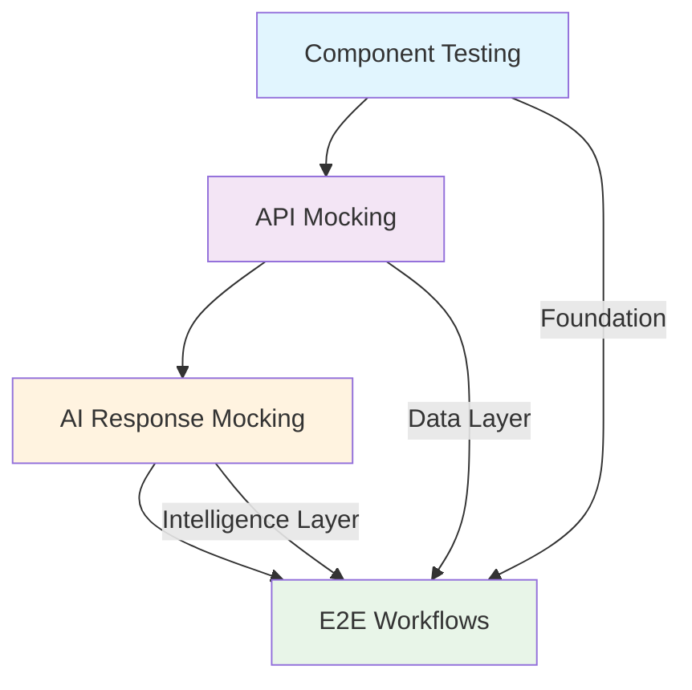

# Testing Strategy for trAIner AI Fitness App

## Overview

This directory contains comprehensive testing documentation for the trAIner AI Fitness App frontend. Our testing strategy emphasizes user-centric testing, realistic interactions, and maintainable patterns that ensure production-ready quality across all components and workflows.

## Testing Philosophy

### Core Principles

**User-Centric Testing**: Test components and workflows as users experience them, focusing on behavior over implementation details.

**Layered Testing Approach**: Progressive testing from isolated components to complete user journeys ensures comprehensive coverage.

**Realistic Simulation**: Use realistic data, timing, and interaction patterns that mirror production environments.

**Cross-Feature Integration**: Validate that individual features work seamlessly together in complete user workflows.

**Performance & Accessibility First**: Ensure all testing validates performance targets and accessibility compliance.

## Testing Architecture

### Four-Layer Testing Strategy



### Integration Points

- **Component tests** leverage **API mocking** for realistic backend responses
- **AI response mocking** provides intelligent behaviors for both component and E2E tests
- **E2E workflows** validate the integration of all testing approaches in complete user journeys

## Testing Documents

### 1. [Component Testing Guide](./component-testing.md)

**Focus**: Testing individual React components in isolation with realistic dependencies.

**Key Features**:
- React Testing Library patterns and best practices
- Component isolation strategies with mock providers
- Test fixture factories for consistent data generation
- Accessibility testing with automated and manual validation
- Performance testing for complex components
- Offline-first and progressive enhancement testing
- Mobile-specific interaction testing

**When to Use**: 
- Testing individual component behavior
- Validating user interactions and form handling
- Ensuring accessibility compliance
- Performance validation for complex components

### 2. [API Mocking Guide](./api-mocking.md)

**Focus**: Comprehensive API simulation using Mock Service Worker (MSW) for realistic backend interactions.

**Key Features**:
- MSW setup and handler organization patterns
- Supabase-specific mocking (Auth, Database, Real-time)
- File upload and binary data simulation
- Error scenario coverage and rate limiting
- Test data fixture management
- Feature flag integration

**When to Use**:
- Component tests requiring backend data
- Development environment simulation
- Integration testing with controlled responses
- Testing error handling and edge cases

### 3. [AI Response Mocking Guide](./ai-response-mocking.md)

**Focus**: Simulating AI agent responses, streaming interactions, and intelligent behaviors.

**Key Features**:
- Agent-specific response patterns (Workout, Nutrition, Research, Analytics)
- OpenAI and Perplexity AI response simulation
- Streaming response simulation with Server-Sent Events
- Tiered mocking complexity (Simple → Detailed → Streaming)
- AI-specific testing scenarios (token limits, safety filters)
- Reasoning chain and context memory mocking

**When to Use**:
- Testing AI-powered components
- Validating streaming response UI
- Testing reasoning visualization components
- Cost-effective AI development without API charges

### 4. [E2E Workflow Testing Guide](./e2e-workflows.md)

**Focus**: Complete user journey validation using Playwright for end-to-end testing.

**Key Features**:
- Critical user journeys (onboarding, workout generation, progress tracking)
- Cross-feature integration workflows
- Performance benchmarks and monitoring
- Visual regression testing with Chromatic
- Accessibility compliance validation (WCAG 2.1 AA)
- Test infrastructure and data management

**When to Use**:
- Validating complete user workflows
- Integration testing across multiple features
- Performance and accessibility compliance
- Regression prevention for critical paths

## Quick Start Guide

### 1. Setting Up Component Tests

```typescript
// __tests__/components/my-component.test.tsx
import { render, screen, userEvent } from '../test-utils';
import { MyComponent } from '../../components/MyComponent';

describe('MyComponent', () => {
  it('renders and handles user interaction', async () => {
    const user = userEvent.setup();
    
    render(<MyComponent />);
    
    await user.click(screen.getByRole('button', { name: /submit/i }));
    
    expect(screen.getByText(/success/i)).toBeInTheDocument();
  });
});
```

### 2. Using API Mocking

```typescript
// Use MSW handlers for realistic backend simulation
import { server } from '../__mocks__/msw';
import { workoutHandlers } from '../__mocks__/msw/handlers/workouts';

beforeEach(() => {
  server.use(...workoutHandlers);
});
```

### 3. Implementing AI Response Mocking

```typescript
// Mock AI streaming responses
import { StreamingWorkoutMock } from '../__mocks__/ai-responses';

const mockStream = new StreamingWorkoutMock();
mockStream.start(); // Begin streaming simulation
```

### 4. Running E2E Tests

```typescript
// test('complete user workflow', async ({ page }) => {
  await page.goto('/workouts/generate');
  await page.click('[data-testid="generate-workout"]');
  await expect(page.locator('[data-testid="workout-plan"]')).toBeVisible();
});
```

## Testing Workflow

### Development Testing Process

1. **Component Development**
   ```bash
   npm run test:components -- --watch
   ```
   - Write component tests first (TDD approach)
   - Use API mocking for realistic data
   - Validate accessibility and performance

2. **Integration Testing**
   ```bash
   npm run test:integration
   ```
   - Test component interactions with mocked APIs
   - Validate cross-component communication
   - Test error scenarios and edge cases

3. **AI Feature Testing**
   ```bash
   npm run test:ai
   ```
   - Use AI response mocking for development
   - Test streaming responses and reasoning display
   - Validate intelligent behavior patterns

4. **End-to-End Validation**
   ```bash
   npm run test:e2e
   ```
   - Complete user journey testing
   - Performance and accessibility validation
   - Cross-browser compatibility testing

### CI/CD Integration

```yaml
# .github/workflows/testing.yml
- name: Component Tests
  run: npm run test:components
  
- name: Integration Tests  
  run: npm run test:integration
  
- name: E2E Tests
  run: npm run test:e2e:ci
  
- name: Performance Tests
  run: npm run test:lighthouse
```

## Testing Standards

### Performance Targets

- **Component Rendering**: < 100ms for complex components
- **User Interactions**: < 50ms response time
- **API Responses**: < 2 seconds for mocked endpoints
- **AI Streaming**: < 30 seconds for complete responses
- **Page Load**: < 3 seconds First Contentful Paint

### Accessibility Requirements

- **WCAG 2.1 AA Compliance**: All components and workflows
- **Keyboard Navigation**: Complete app functionality without mouse
- **Screen Reader Support**: Proper ARIA labels and live regions
- **Color Contrast**: Minimum 4.5:1 ratio for normal text
- **Touch Targets**: Minimum 44px for mobile interactions

### Code Coverage Targets

- **Component Tests**: 80%+ coverage for critical user paths
- **Integration Tests**: 100% coverage for API interactions
- **E2E Tests**: 100% coverage for critical user journeys
- **AI Features**: 90%+ coverage including error scenarios

## Best Practices

### DO's ✅

- **Test user behavior**, not implementation details
- **Use real user events** with `@testing-library/user-event`
- **Create reusable test fixtures** with factory patterns
- **Test accessibility** with automated tools and manual validation
- **Mock external dependencies** while keeping component logic real
- **Test error states** and loading conditions thoroughly
- **Use proper cleanup** to prevent test interference
- **Follow cross-document integration patterns**

### DON'Ts ❌

- **Don't test implementation details** like state variables
- **Don't use shallow rendering** - use full rendering with providers
- **Don't mock React Testing Library queries**
- **Don't ignore accessibility** in your testing strategy
- **Don't forget cleanup** - always clean up subscriptions and mocks
- **Don't hardcode test data** - use factories for maintainability
- **Don't skip cross-feature integration testing**

## Troubleshooting

### Common Issues

**MSW Handlers Not Working**:
```typescript
// Ensure MSW is properly initialized
beforeAll(() => server.listen());
afterEach(() => server.resetHandlers());
afterAll(() => server.close());
```

**Component Tests Failing**:
```typescript
// Check provider setup in test-utils
const AllTheProviders = ({ children }) => (
  <AuthProvider>
    <ThemeProvider>
      {children}
    </ThemeProvider>
  </AuthProvider>
);
```

**E2E Tests Flaky**:
```typescript
// Use proper wait conditions
await expect(page.locator('[data-testid="element"]')).toBeVisible();
// Instead of arbitrary timeouts
```

### Debug Commands

```bash
# Run tests with debug output
npm run test:debug

# Run specific test file
npm run test -- ComponentName.test.tsx

# Run E2E tests in headed mode
npm run test:e2e -- --headed

# Generate test coverage report
npm run test:coverage
```

## Contributing

When adding new features or components:

1. **Write component tests first** following patterns in `component-testing.md`
2. **Add API mocking** for any new endpoints using patterns in `api-mocking.md`
3. **Include AI mocking** for intelligent features using `ai-response-mocking.md`
4. **Add E2E coverage** for new user workflows using `e2e-workflows.md`
5. **Update this README** if adding new testing patterns or tools

## Resources

- [React Testing Library Documentation](https://testing-library.com/docs/react-testing-library/intro/)
- [Mock Service Worker Documentation](https://mswjs.io/docs/)
- [Playwright Documentation](https://playwright.dev/)
- [Accessibility Testing Guide](https://web.dev/accessibility/)
- [Jest Documentation](https://jestjs.io/docs/getting-started)

---

**Last Updated**: January 2025  
**Version**: 1.0.0  
**Maintainer**: trAIner Development Team

This testing strategy ensures comprehensive, maintainable, and production-ready quality for the trAIner AI Fitness App through systematic validation at every level. 