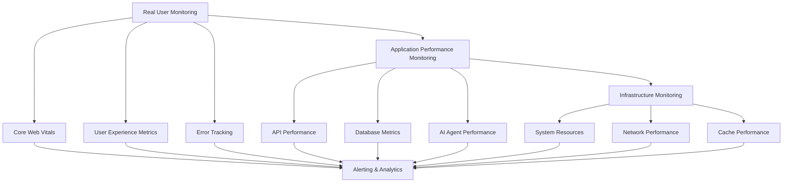

# Performance Monitoring Setup

## Overview & Architecture

The trAIner AI Fitness App requires comprehensive performance monitoring to maintain optimal user experiences across diverse usage patterns and operational conditions. As an AI-powered platform with real-time features, complex data processing, and multi-layered caching systems, our monitoring strategy must provide end-to-end visibility while delivering actionable insights for continuous improvement.

### Monitoring Objectives

**Performance Goals**:
- **Real-time Detection**: Identify performance degradation within 30 seconds
- **Proactive Alerting**: Alert before user impact occurs (≤ 2-minute response time)
- **Business Correlation**: Link technical metrics to user experience and business KPIs
- **Operational Excellence**: Maintain 99.9% uptime with < 2.5s average response times

**Coverage Requirements**:
- **Frontend Performance**: Core Web Vitals, user interactions, and rendering metrics
- **Backend Performance**: API response times, database queries, and system resources
- **AI Operations**: OpenAI API performance, agent processing times, and quality metrics
- **Infrastructure**: Real-time subscriptions, caching efficiency, and network performance

## 1. Performance Monitoring Architecture

### Comprehensive Monitoring Stack



### Monitoring Stack Components

#### **Tier 1: Real User Monitoring (RUM)**
```typescript
// Core Web Vitals tracking
interface RUMMetrics {
  // Core Web Vitals
  lcp: number;           // Largest Contentful Paint
  inp: number;           // Interaction to Next Paint
  cls: number;           // Cumulative Layout Shift
  fcp: number;           // First Contentful Paint
  ttfb: number;          // Time to First Byte
  
  // User Experience
  sessionId: string;
  userId?: string;
  deviceType: 'mobile' | 'tablet' | 'desktop';
  connectionType: '2g' | '3g' | '4g' | 'wifi';
  
  // Business Context
  pageType: string;
  userJourney: string;
  conversionFunnel: string;
}
```

#### **Tier 2: Application Performance Monitoring (APM)**
```typescript
interface APMMetrics {
  // API Performance
  responseTime: number;
  throughput: number;
  errorRate: number;
  
  // AI Operations
  aiResponseTime: number;
  tokenUsage: number;
  modelPerformance: string;
  
  // Database Performance
  queryTime: number;
  connectionPoolUtilization: number;
  cacheHitRate: number;
}
```

#### **Tier 3: Infrastructure Monitoring**
```typescript
interface InfrastructureMetrics {
  // System Resources
  cpuUsage: number;
  memoryUsage: number;
  diskUtilization: number;
  
  // Network
  latency: number;
  bandwidth: number;
  packetLoss: number;
  
  // Services
  serviceHealth: boolean;
  dependencyStatus: Record<string, boolean>;
}
```

### Performance Budget Enforcement

#### **Budget Configuration**
```javascript
const PERFORMANCE_BUDGETS = {
  // Core Web Vitals Thresholds
  coreWebVitals: {
    lcp: { good: 2500, needsImprovement: 4000 },      // ms
    inp: { good: 200, needsImprovement: 500 },        // ms
    cls: { good: 0.1, needsImprovement: 0.25 },       // score
    fcp: { good: 1800, needsImprovement: 3000 },      // ms
    ttfb: { good: 600, needsImprovement: 1000 }       // ms
  },
  
  // Page-Specific Budgets
  pages: {
    '/dashboard': { 
      loadTime: 2000,
      interactivity: 1500,
      bundleSize: '300KB'
    },
    '/generate-plan': { 
      loadTime: 2500,
      interactivity: 2000,
      bundleSize: '250KB'
    },
    '/workouts/*': { 
      loadTime: 1800,
      interactivity: 1200,
      bundleSize: '200KB'
    }
  },
  
  // AI Performance Budgets
  aiOperations: {
    workoutGeneration: { maxTime: 15000, tokenLimit: 4000 },
    planAdjustment: { maxTime: 8000, tokenLimit: 2000 },
    analyticsInsights: { maxTime: 12000, tokenLimit: 3000 }
  }
};
```

#### **Budget Validation**
```typescript
class PerformanceBudgetValidator {
  constructor(budgets: typeof PERFORMANCE_BUDGETS) {
    this.budgets = budgets;
    this.violations = new Map();
  }
  
  validateCoreWebVitals(metrics: RUMMetrics): BudgetViolation[] {
    const violations: BudgetViolation[] = [];
    
    Object.entries(this.budgets.coreWebVitals).forEach(([metric, thresholds]) => {
      const value = metrics[metric as keyof RUMMetrics] as number;
      
      if (value > thresholds.needsImprovement) {
        violations.push({
          metric,
          value,
          threshold: thresholds.needsImprovement,
          severity: 'critical',
          impact: 'user_experience'
        });
      } else if (value > thresholds.good) {
        violations.push({
          metric,
          value,
          threshold: thresholds.good,
          severity: 'warning',
          impact: 'performance_degradation'
        });
      }
    });
    
    return violations;
  }
}
```

### Alert Threshold Configuration

#### **Alert Severity Levels**
```typescript
enum AlertSeverity {
  INFO = 'info',           // Informational events
  WARNING = 'warning',     // Performance degradation
  CRITICAL = 'critical',   // User impact imminent
  EMERGENCY = 'emergency'  // Service disruption
}

interface AlertRule {
  name: string;
  severity: AlertSeverity;
  condition: string;
  threshold: number;
  duration: number;        // Consecutive duration in seconds
  cooldown: number;        // Minimum time between alerts
  escalation?: AlertRule;  // Escalation rule if unresolved
}
```

#### **Alert Rules Configuration**
```javascript
const ALERT_RULES = {
  // Core Web Vitals Alerts
  coreWebVitals: [
    {
      name: 'LCP_DEGRADATION',
      severity: AlertSeverity.WARNING,
      condition: 'avg(lcp) > 3000',
      threshold: 3000,
      duration: 300,  // 5 minutes
      cooldown: 900,   // 15 minutes
      escalation: {
        name: 'LCP_CRITICAL',
        severity: AlertSeverity.CRITICAL,
        condition: 'avg(lcp) > 4000',
        threshold: 4000,
        duration: 180,  // 3 minutes
        cooldown: 600   // 10 minutes
      }
    }
  ],
  
  // API Performance Alerts
  apiPerformance: [
    {
      name: 'API_RESPONSE_TIME',
      severity: AlertSeverity.WARNING,
      condition: 'p95(response_time) > 2000',
      threshold: 2000,
      duration: 180,
      cooldown: 600
    },
    {
      name: 'ERROR_RATE_SPIKE',
      severity: AlertSeverity.CRITICAL,
      condition: 'error_rate > 5',
      threshold: 5,     // 5% error rate
      duration: 120,    // 2 minutes
      cooldown: 300     // 5 minutes
    }
  ],
  
  // AI Performance Alerts
  aiPerformance: [
    {
      name: 'AI_TIMEOUT_RATE',
      severity: AlertSeverity.CRITICAL,
      condition: 'timeout_rate > 10',
      threshold: 10,    // 10% timeout rate
      duration: 300,
      cooldown: 900
    }
  ]
};
```

### Business Impact Correlation

#### **KPI Mapping**
```typescript
interface BusinessKPI {
  name: string;
  technicalMetrics: string[];
  impactWeight: number;
  businessValue: string;
}

const BUSINESS_KPIS: BusinessKPI[] = [
  {
    name: 'User Engagement',
    technicalMetrics: ['inp', 'page_load_time', 'error_rate'],
    impactWeight: 0.8,
    businessValue: 'session_duration'
  },
  {
    name: 'Conversion Rate',
    technicalMetrics: ['lcp', 'cls', 'api_response_time'],
    impactWeight: 0.9,
    businessValue: 'plan_generation_completion'
  },
  {
    name: 'User Retention',
    technicalMetrics: ['uptime', 'performance_consistency', 'ai_quality'],
    impactWeight: 0.7,
    businessValue: 'weekly_active_users'
  }
];
```

## 2. Frontend Performance Monitoring

### Core Web Vitals Implementation

#### **Web Vitals Tracking Setup**
```typescript
// app/components/WebVitals.tsx
'use client'
import { useReportWebVitals } from 'next/web-vitals'
import { useEffect, useState } from 'react'

interface WebVitalMetric {
  id: string;
  name: string;
  value: number;
  delta: number;
  rating: 'good' | 'needs-improvement' | 'poor';
  navigationType: string;
}

export function WebVitals() {
  const [metrics, setMetrics] = useState<WebVitalMetric[]>([]);
  
  useReportWebVitals((metric) => {
    // Store metric locally
    setMetrics(prev => [...prev, metric]);
    
    // Send to monitoring service
    sendMetricToMonitoring(metric);
    
    // Check thresholds and trigger alerts
    checkPerformanceThresholds(metric);
  });
  
  return null; // Component renders nothing
}

async function sendMetricToMonitoring(metric: WebVitalMetric) {
  try {
    await fetch('/api/monitoring/web-vitals', {
      method: 'POST',
      headers: { 'Content-Type': 'application/json' },
      body: JSON.stringify({
        ...metric,
        timestamp: Date.now(),
        url: window.location.href,
        userAgent: navigator.userAgent,
        connectionType: getConnectionType(),
        deviceInfo: getDeviceInfo()
      })
    });
  } catch (error) {
    console.error('Failed to send web vital metric:', error);
  }
}

function checkPerformanceThresholds(metric: WebVitalMetric) {
  const thresholds = PERFORMANCE_BUDGETS.coreWebVitals[metric.name];
  if (!thresholds) return;
  
  if (metric.value > thresholds.needsImprovement) {
    triggerPerformanceAlert('CRITICAL', metric);
  } else if (metric.value > thresholds.good) {
    triggerPerformanceAlert('WARNING', metric);
  }
}

function triggerPerformanceAlert(severity: string, metric: WebVitalMetric) {
  // Send to Sentry or monitoring service
  console.warn(`Performance Alert [${severity}]: ${metric.name} = ${metric.value}ms`);
  
  // Could also trigger user-facing notifications for severe issues
  if (severity === 'CRITICAL' && metric.name === 'LCP') {
    showUserPerformanceNotification();
  }
}
```

#### **Custom Performance Metrics**
```typescript
// lib/performance-monitoring.ts
class PerformanceMonitor {
  private static instance: PerformanceMonitor;
  private customMetrics: Map<string, PerformanceEntry[]> = new Map();
  
  static getInstance(): PerformanceMonitor {
    if (!PerformanceMonitor.instance) {
      PerformanceMonitor.instance = new PerformanceMonitor();
    }
    return PerformanceMonitor.instance;
  }
  
  // AI-specific performance tracking
  trackAIOperation(operation: string, startTime: number, endTime: number, metadata?: Record<string, any>) {
    const duration = endTime - startTime;
    
    // Mark performance timeline
    performance.mark(`ai-${operation}-start`, { startTime });
    performance.mark(`ai-${operation}-end`, { startTime: endTime });
    performance.measure(`ai-${operation}`, `ai-${operation}-start`, `ai-${operation}-end`);
    
    // Store custom metric
    const customMetric = {
      name: `ai-${operation}`,
      duration,
      timestamp: endTime,
      metadata: {
        operation,
        ...metadata
      }
    };
    
    this.recordCustomMetric('ai-operations', customMetric);
    
    // Check AI performance thresholds
    this.checkAIPerformanceThresholds(operation, duration, metadata);
  }
  
  // Component render time tracking
  trackComponentRender(componentName: string, renderTime: number) {
    performance.mark(`component-${componentName}-render`);
    
    this.recordCustomMetric('component-renders', {
      name: componentName,
      renderTime,
      timestamp: Date.now()
    });
  }
  
  // API request tracking
  trackAPIRequest(endpoint: string, startTime: number, endTime: number, statusCode: number) {
    const duration = endTime - startTime;
    
    this.recordCustomMetric('api-requests', {
      endpoint,
      duration,
      statusCode,
      success: statusCode < 400,
      timestamp: endTime
    });
    
    // Alert on slow API calls
    if (duration > 5000) { // 5 seconds
      this.alertSlowAPICall(endpoint, duration);
    }
  }
  
  private checkAIPerformanceThresholds(operation: string, duration: number, metadata?: Record<string, any>) {
    const budget = PERFORMANCE_BUDGETS.aiOperations[operation];
    if (!budget) return;
    
    if (duration > budget.maxTime) {
      console.warn(`AI Performance Alert: ${operation} took ${duration}ms (budget: ${budget.maxTime}ms)`);
      
      // Send to monitoring
      this.sendAIPerformanceAlert(operation, duration, budget.maxTime, metadata);
    }
  }
  
  private recordCustomMetric(category: string, metric: any) {
    if (!this.customMetrics.has(category)) {
      this.customMetrics.set(category, []);
    }
    
    const categoryMetrics = this.customMetrics.get(category)!;
    categoryMetrics.push(metric);
    
    // Keep only last 100 metrics per category
    if (categoryMetrics.length > 100) {
      categoryMetrics.shift();
    }
  }
  
  // Get performance summary
  getPerformanceSummary(): PerformanceSummary {
    return {
      aiOperations: this.summarizeMetrics('ai-operations'),
      componentRenders: this.summarizeMetrics('component-renders'),
      apiRequests: this.summarizeMetrics('api-requests'),
      webVitals: this.getWebVitalsSnapshot()
    };
  }
}

// Usage in components
const performanceMonitor = PerformanceMonitor.getInstance();

// In AI operation components
const handleWorkoutGeneration = async () => {
  const startTime = Date.now();
  try {
    const result = await generateWorkoutPlan(userProfile);
    const endTime = Date.now();
    
    performanceMonitor.trackAIOperation('workout-generation', startTime, endTime, {
      userProfile: userProfile.fitnessLevel,
      exerciseCount: result.exercises?.length || 0
    });
    
    return result;
  } catch (error) {
    const endTime = Date.now();
    performanceMonitor.trackAIOperation('workout-generation', startTime, endTime, {
      error: error.message,
      success: false
    });
    throw error;
  }
};
```

### Real User Monitoring (RUM)

#### **User Session Tracking**
```typescript
// lib/user-session-monitor.ts
interface UserSession {
  sessionId: string;
  userId?: string;
  startTime: number;
  lastActivity: number;
  pageViews: PageView[];
  interactions: UserInteraction[];
  performanceMetrics: PerformanceSnapshot[];
  deviceInfo: DeviceInfo;
  connectionInfo: ConnectionInfo;
}

class UserSessionMonitor {
  private session: UserSession;
  private inactivityTimer: NodeJS.Timeout | null = null;
  
  constructor() {
    this.session = this.initializeSession();
    this.startSessionTracking();
  }
  
  private initializeSession(): UserSession {
    return {
      sessionId: this.generateSessionId(),
      startTime: Date.now(),
      lastActivity: Date.now(),
      pageViews: [],
      interactions: [],
      performanceMetrics: [],
      deviceInfo: this.getDeviceInfo(),
      connectionInfo: this.getConnectionInfo()
    };
  }
  
  // Track page navigation
  trackPageView(route: string, loadTime: number) {
    const pageView: PageView = {
      route,
      timestamp: Date.now(),
      loadTime,
      referrer: document.referrer,
      scrollDepth: 0
    };
    
    this.session.pageViews.push(pageView);
    this.updateLastActivity();
    
    // Track scroll depth
    this.trackScrollDepth(pageView);
  }
  
  // Track user interactions
  trackInteraction(type: string, element: string, metadata?: Record<string, any>) {
    const interaction: UserInteraction = {
      type,
      element,
      timestamp: Date.now(),
      metadata
    };
    
    this.session.interactions.push(interaction);
    this.updateLastActivity();
  }
  
  // Track performance snapshots
  capturePerformanceSnapshot() {
    const snapshot: PerformanceSnapshot = {
      timestamp: Date.now(),
      webVitals: this.getCurrentWebVitals(),
      customMetrics: PerformanceMonitor.getInstance().getPerformanceSummary(),
      resourceTimings: this.getResourceTimings(),
      memoryUsage: this.getMemoryUsage()
    };
    
    this.session.performanceMetrics.push(snapshot);
    
    // Keep only last 20 snapshots
    if (this.session.performanceMetrics.length > 20) {
      this.session.performanceMetrics.shift();
    }
  }
  
  // Performance correlation analysis
  analyzeUserExperience(): UserExperienceReport {
    const report: UserExperienceReport = {
      sessionScore: this.calculateSessionScore(),
      engagementMetrics: this.calculateEngagementMetrics(),
      performanceImpact: this.analyzePerformanceImpact(),
      recommendations: this.generateRecommendations()
    };
    
    return report;
  }
  
  private calculateSessionScore(): number {
    let score = 100;
    
    // Deduct for poor performance
    const avgLoadTime = this.getAverageLoadTime();
    if (avgLoadTime > 3000) score -= 20;
    else if (avgLoadTime > 2000) score -= 10;
    
    // Deduct for errors
    const errorRate = this.getErrorRate();
    score -= errorRate * 30;
    
    // Deduct for slow interactions
    const avgInteractionTime = this.getAverageInteractionTime();
    if (avgInteractionTime > 200) score -= 15;
    
    return Math.max(0, score);
  }
}
```

#### **Geographic Performance Insights**
```typescript
// lib/geographic-performance.ts
interface GeographicMetrics {
  region: string;
  country: string;
  city?: string;
  averageLoadTime: number;
  averageAPIResponseTime: number;
  errorRate: number;
  sampleSize: number;
  connectionTypes: Record<string, number>;
}

class GeographicPerformanceAnalyzer {
  async analyzeRegionalPerformance(): Promise<GeographicMetrics[]> {
    const userLocation = await this.getUserLocation();
    const regionalData = await this.fetchRegionalMetrics(userLocation);
    
    return this.processRegionalData(regionalData);
  }
  
  private async getUserLocation(): Promise<UserLocation> {
    // Use geolocation API or IP-based detection
    return new Promise((resolve) => {
      if ('geolocation' in navigator) {
        navigator.geolocation.getCurrentPosition(
          (position) => {
            resolve({
              latitude: position.coords.latitude,
              longitude: position.coords.longitude,
              accuracy: position.coords.accuracy
            });
          },
          () => {
            // Fallback to IP-based detection
            resolve(this.getLocationFromIP());
          }
        );
      } else {
        resolve(this.getLocationFromIP());
      }
    });
  }
  
  // CDN optimization based on geographic performance
  optimizeCDNRouting(metrics: GeographicMetrics[]): CDNOptimization {
    const optimization: CDNOptimization = {
      recommendations: [],
      routingRules: [],
      cacheStrategies: {}
    };
    
    metrics.forEach(metric => {
      if (metric.averageLoadTime > 3000) {
        optimization.recommendations.push({
          region: metric.region,
          issue: 'High load time',
          suggestion: 'Deploy edge cache in region'
        });
      }
      
      if (metric.errorRate > 5) {
        optimization.recommendations.push({
          region: metric.region,
          issue: 'High error rate',
          suggestion: 'Add regional failover'
        });
      }
    });
    
    return optimization;
  }
}
```

### Device Capability Impact

#### **Device Performance Profiling**
```typescript
// lib/device-capability-monitor.ts
interface DeviceCapabilities {
  memory: number;                    // GB
  cores: number;                     // CPU cores
  connectionSpeed: string;           // Connection type
  screenSize: { width: number; height: number; };
  pixelRatio: number;
  hardwareAcceleration: boolean;
  webGLSupport: boolean;
  serviceWorkerSupport: boolean;
}

class DeviceCapabilityMonitor {
  private capabilities: DeviceCapabilities;
  
  constructor() {
    this.capabilities = this.detectCapabilities();
    this.optimizeBasedOnCapabilities();
  }
  
  private detectCapabilities(): DeviceCapabilities {
    return {
      memory: (navigator as any).deviceMemory || 4,
      cores: navigator.hardwareConcurrency || 4,
      connectionSpeed: this.getConnectionType(),
      screenSize: {
        width: screen.width,
        height: screen.height
      },
      pixelRatio: window.devicePixelRatio || 1,
      hardwareAcceleration: this.checkHardwareAcceleration(),
      webGLSupport: this.checkWebGLSupport(),
      serviceWorkerSupport: 'serviceWorker' in navigator
    };
  }
  
  // Adaptive performance strategies
  private optimizeBasedOnCapabilities() {
    // Low-end device optimizations
    if (this.capabilities.memory <= 2 || this.capabilities.cores <= 2) {
      this.enableLowEndOptimizations();
    }
    
    // Network-aware optimizations
    if (this.capabilities.connectionSpeed === '2g' || this.capabilities.connectionSpeed === '3g') {
      this.enableSlowNetworkOptimizations();
    }
    
    // High DPI optimizations
    if (this.capabilities.pixelRatio > 2) {
      this.enableHighDPIOptimizations();
    }
  }
  
  private enableLowEndOptimizations() {
    // Reduce AI operation complexity
    // Disable heavy animations
    // Use smaller bundle chunks
    // Reduce concurrent operations
    
    console.log('Enabling low-end device optimizations');
    
    // Set global optimization flags
    window.__PERFORMANCE_MODE = 'low-end';
    
    // Disable expensive features
    this.disableHeavyFeatures();
  }
  
  private enableSlowNetworkOptimizations() {
    // Aggressive caching
    // Reduced image quality
    // Lazy loading everything
    // Compress API responses
    
    console.log('Enabling slow network optimizations');
    
    window.__NETWORK_MODE = 'slow';
    
    // Configure aggressive caching
    this.enableAggressiveCaching();
  }
  
  // Performance budget adjustment based on device
  adjustPerformanceBudget(): PerformanceBudget {
    const baseBudget = PERFORMANCE_BUDGETS.coreWebVitals;
    
    // Relax budgets for low-end devices
    if (this.capabilities.memory <= 2) {
      return {
        lcp: { good: baseBudget.lcp.good * 1.5, needsImprovement: baseBudget.lcp.needsImprovement * 1.5 },
        inp: { good: baseBudget.inp.good * 1.3, needsImprovement: baseBudget.inp.needsImprovement * 1.3 },
        cls: baseBudget.cls, // CLS should remain consistent
        fcp: { good: baseBudget.fcp.good * 1.4, needsImprovement: baseBudget.fcp.needsImprovement * 1.4 },
        ttfb: { good: baseBudget.ttfb.good * 1.2, needsImprovement: baseBudget.ttfb.needsImprovement * 1.2 }
      };
    }
    
    return baseBudget;
  }
}
```

### Error Boundary Integration

#### **Performance Error Correlation**
```typescript
// components/PerformanceErrorBoundary.tsx
import React, { Component, ErrorInfo, ReactNode } from 'react';

interface Props {
  children: ReactNode;
  fallback?: ReactNode;
  onError?: (error: Error, errorInfo: ErrorInfo) => void;
}

interface State {
  hasError: boolean;
  error?: Error;
  errorId?: string;
}

export class PerformanceErrorBoundary extends Component<Props, State> {
  private performanceMonitor = PerformanceMonitor.getInstance();
  
  constructor(props: Props) {
    super(props);
    this.state = { hasError: false };
  }
  
  static getDerivedStateFromError(error: Error): State {
    return {
      hasError: true,
      error,
      errorId: `error-${Date.now()}-${Math.random().toString(36).substr(2, 9)}`
    };
  }
  
  componentDidCatch(error: Error, errorInfo: ErrorInfo) {
    // Capture performance snapshot at time of error
    const performanceSnapshot = this.performanceMonitor.getPerformanceSummary();
    
    // Correlate error with performance metrics
    const errorReport = {
      errorId: this.state.errorId,
      error: {
        message: error.message,
        stack: error.stack,
        name: error.name
      },
      errorInfo,
      performanceContext: performanceSnapshot,
      userAgent: navigator.userAgent,
      url: window.location.href,
      timestamp: Date.now(),
      sessionInfo: this.getSessionInfo()
    };
    
    // Send to monitoring service
    this.reportPerformanceError(errorReport);
    
    // Call custom error handler
    if (this.props.onError) {
      this.props.onError(error, errorInfo);
    }
    
    // Track recovery time
    this.trackErrorRecovery();
  }
  
  private async reportPerformanceError(errorReport: any) {
    try {
      await fetch('/api/monitoring/performance-errors', {
        method: 'POST',
        headers: { 'Content-Type': 'application/json' },
        body: JSON.stringify(errorReport)
      });
    } catch (reportingError) {
      console.error('Failed to report performance error:', reportingError);
    }
  }
  
  private trackErrorRecovery() {
    const recoveryStartTime = Date.now();
    
    // Set up recovery tracking
    const checkRecovery = () => {
      if (!this.state.hasError) {
        const recoveryTime = Date.now() - recoveryStartTime;
        this.performanceMonitor.trackCustomMetric('error-recovery', {
          errorId: this.state.errorId,
          recoveryTime,
          timestamp: Date.now()
        });
      }
    };
    
    // Check recovery every second for up to 30 seconds
    const recoveryInterval = setInterval(checkRecovery, 1000);
    setTimeout(() => clearInterval(recoveryInterval), 30000);
  }
  
  render() {
    if (this.state.hasError) {
      return this.props.fallback || (
        <div className="error-boundary-fallback">
          <h2>Something went wrong</h2>
          <details>
            <summary>Error Details (Error ID: {this.state.errorId})</summary>
            <pre>{this.state.error?.stack}</pre>
          </details>
          <button onClick={() => this.setState({ hasError: false })}>
            Try Again
          </button>
        </div>
      );
    }
    
    return this.props.children;
  }
}
```

#### **Recovery Time Tracking**
```typescript
// lib/error-recovery-monitor.ts
interface ErrorRecoveryMetrics {
  errorId: string;
  errorType: string;
  component: string;
  recoveryTime?: number;
  recoveryStrategy: string;
  userImpact: 'none' | 'minimal' | 'moderate' | 'severe';
  resolved: boolean;
}

class ErrorRecoveryMonitor {
  private activeErrors = new Map<string, ErrorRecoveryMetrics>();
  private recoveryStrategies = new Map<string, RecoveryStrategy>();
  
  trackError(errorId: string, error: Error, component: string) {
    const errorMetric: ErrorRecoveryMetrics = {
      errorId,
      errorType: error.name,
      component,
      recoveryStrategy: 'none',
      userImpact: this.assessUserImpact(error, component),
      resolved: false
    };
    
    this.activeErrors.set(errorId, errorMetric);
    
    // Apply appropriate recovery strategy
    this.applyRecoveryStrategy(errorId, error, component);
  }
  
  trackRecovery(errorId: string, recoveryTime: number) {
    const errorMetric = this.activeErrors.get(errorId);
    if (errorMetric) {
      errorMetric.recoveryTime = recoveryTime;
      errorMetric.resolved = true;
      
      // Send recovery metrics to monitoring
      this.reportRecoveryMetrics(errorMetric);
    }
  }
  
  private assessUserImpact(error: Error, component: string): 'none' | 'minimal' | 'moderate' | 'severe' {
    // Critical components
    if (['workout-generation', 'payment', 'authentication'].includes(component)) {
      return 'severe';
    }
    
    // Important features
    if (['dashboard', 'profile', 'analytics'].includes(component)) {
      return 'moderate';
    }
    
    // Secondary features
    if (['charts', 'animations', 'recommendations'].includes(component)) {
      return 'minimal';
    }
    
    return 'none';
  }
  
  // Performance-aware recovery strategies
  private applyRecoveryStrategy(errorId: string, error: Error, component: string) {
    const strategy = this.selectRecoveryStrategy(error, component);
    
    const errorMetric = this.activeErrors.get(errorId)!;
    errorMetric.recoveryStrategy = strategy.name;
    
    // Execute recovery strategy
    strategy.execute(error, component).then(() => {
      this.trackRecovery(errorId, Date.now() - this.getErrorStartTime(errorId));
    });
  }
}
```

## 3. Backend Performance Monitoring

### Winston Logging Enhancement

Based on our comprehensive logging infrastructure in `backend/config/docs/loggerConfigurationDocs.md`, we implement advanced performance monitoring through enhanced logging patterns.

#### **Performance-Focused Logging Configuration**
```javascript
// backend/config/performance-logger.js
const winston = require('winston');
const path = require('path');

// Enhanced performance logger configuration
const performanceLogger = winston.createLogger({
  format: winston.format.combine(
    winston.format.timestamp(),
    winston.format.errors({ stack: true }),
    winston.format.json(),
    winston.format.metadata({ 
      fillExcept: ['message', 'level', 'timestamp', 'performance'] 
    }),
    // Custom performance format
    winston.format.printf(({ timestamp, level, message, performance, ...meta }) => {
      const logEntry = {
        timestamp,
        level,
        message,
        ...meta
      };
      
      // Add performance metrics if present
      if (performance) {
        logEntry.performance = {
          duration: performance.duration,
          memory: performance.memory,
          cpu: performance.cpu,
          operations: performance.operations
        };
      }
      
      return JSON.stringify(logEntry);
    })
  ),
  defaultMeta: { 
    service: 'trainer-api-performance',
    environment: process.env.NODE_ENV,
    version: process.env.APP_VERSION || '1.0.0'
  },
  transports: [
    // Console transport for development
    new winston.transports.Console({
      level: process.env.NODE_ENV === 'development' ? 'debug' : 'info',
      silent: process.env.NODE_ENV === 'test' && !process.env.DEBUG_TESTS
    }),
    
    // Performance-specific file transport
    new winston.transports.File({
      filename: path.join(__dirname, '../../logs/performance.log'),
      level: 'info',
      maxsize: 10485760,  // 10MB
      maxFiles: 10,
      format: winston.format.combine(
        winston.format.timestamp(),
        winston.format.json()
      )
    }),
    
    // Critical performance alerts
    new winston.transports.File({
      filename: path.join(__dirname, '../../logs/performance-alerts.log'),
      level: 'warn',
      maxsize: 5242880,   // 5MB
      maxFiles: 5
    })
  ]
});

module.exports = performanceLogger;
```

#### **API Performance Tracking Middleware**
```javascript
// backend/middleware/performance-tracking.js
const performanceLogger = require('../config/performance-logger');
const os = require('os');

class APIPerformanceTracker {
  constructor() {
    this.activeRequests = new Map();
    this.performanceMetrics = {
      totalRequests: 0,
      totalResponseTime: 0,
      errorCount: 0,
      slowRequestCount: 0
    };
  }
  
  // Middleware for tracking API performance
  trackPerformance() {
    return (req, res, next) => {
      const requestId = `${Date.now()}-${Math.random().toString(36).substr(2, 9)}`;
      const startTime = Date.now();
      const startMemory = process.memoryUsage();
      const startCPU = process.cpuUsage();
      
      // Store request start data
      this.activeRequests.set(requestId, {
        startTime,
        startMemory,
        startCPU,
        method: req.method,
        url: req.originalUrl || req.url,
        userAgent: req.headers['user-agent'],
        ip: req.ip || req.connection.remoteAddress
      });
      
      // Override res.end to capture response metrics
      const originalEnd = res.end;
      res.end = (chunk, encoding) => {
        const endTime = Date.now();
        const duration = endTime - startTime;
        const endMemory = process.memoryUsage();
        const endCPU = process.cpuUsage(startCPU);
        
        // Calculate resource usage
        const memoryDelta = {
          rss: endMemory.rss - startMemory.rss,
          heapUsed: endMemory.heapUsed - startMemory.heapUsed,
          heapTotal: endMemory.heapTotal - startMemory.heapTotal
        };
        
        const cpuDelta = {
          user: endCPU.user,
          system: endCPU.system
        };
        
        // Log performance metrics
        this.logRequestPerformance(requestId, {
          method: req.method,
          url: req.originalUrl || req.url,
          statusCode: res.statusCode,
          duration,
          memoryDelta,
          cpuDelta,
          userId: req.user?.id || 'anonymous',
          userAgent: req.headers['user-agent']
        });
        
        // Update aggregate metrics
        this.updateAggregateMetrics(duration, res.statusCode);
        
        // Clean up active request
        this.activeRequests.delete(requestId);
        
        // Call original end method
        originalEnd.call(res, chunk, encoding);
      };
      
      next();
    };
  }
  
  logRequestPerformance(requestId, metrics) {
    const logLevel = this.determineLogLevel(metrics);
    
    performanceLogger.log(logLevel, `API Request Performance: ${metrics.method} ${metrics.url}`, {
      requestId,
      performance: {
        duration: metrics.duration,
        statusCode: metrics.statusCode,
        memory: metrics.memoryDelta,
        cpu: metrics.cpuDelta
      },
      userId: metrics.userId,
      userAgent: metrics.userAgent,
      endpoint: metrics.url,
      method: metrics.method
    });
    
    // Alert on slow requests
    if (metrics.duration > 5000) { // 5 seconds
      this.alertSlowRequest(metrics);
    }
    
    // Alert on memory spikes
    if (metrics.memoryDelta.heapUsed > 50 * 1024 * 1024) { // 50MB
      this.alertMemorySpike(metrics);
    }
  }
  
  private determineLogLevel(metrics) {
    if (metrics.statusCode >= 500) return 'error';
    if (metrics.statusCode >= 400) return 'warn';
    if (metrics.duration > 2000) return 'warn';
    return 'info';
  }
  
  // Get current performance snapshot
  getPerformanceSnapshot() {
    const memUsage = process.memoryUsage();
    const cpuUsage = process.cpuUsage();
    const loadAvg = os.loadavg();
    
    return {
      timestamp: Date.now(),
      activeRequests: this.activeRequests.size,
      memory: {
        rss: memUsage.rss,
        heapUsed: memUsage.heapUsed,
        heapTotal: memUsage.heapTotal,
        external: memUsage.external
      },
      cpu: {
        user: cpuUsage.user,
        system: cpuUsage.system
      },
      system: {
        loadAverage: loadAvg,
        uptime: process.uptime(),
        freeMemory: os.freemem(),
        totalMemory: os.totalmem()
      },
      aggregateMetrics: this.performanceMetrics
    };
  }
}

module.exports = new APIPerformanceTracker();
```

### Database Query Performance Monitoring

#### **Supabase Performance Tracking**
```javascript
// backend/middleware/database-performance.js
const performanceLogger = require('../config/performance-logger');

class DatabasePerformanceMonitor {
  constructor() {
    this.queryMetrics = new Map();
    this.slowQueryThreshold = 1000; // 1 second
  }
  
  // Supabase client wrapper with performance tracking
  wrapSupabaseClient(supabaseClient) {
    const originalFrom = supabaseClient.from.bind(supabaseClient);
    
    supabaseClient.from = (table) => {
      const query = originalFrom(table);
      return this.wrapQueryBuilder(query, table);
    };
    
    return supabaseClient;
  }
  
  wrapQueryBuilder(queryBuilder, tableName) {
    const originalMethods = ['select', 'insert', 'update', 'delete', 'upsert'];
    
    originalMethods.forEach(method => {
      if (queryBuilder[method]) {
        const originalMethod = queryBuilder[method].bind(queryBuilder);
        
        queryBuilder[method] = (...args) => {
          const wrappedQuery = originalMethod(...args);
          
          // Track execution if this is a terminal method
          if (method === 'select' || wrappedQuery.then) {
            return this.trackQueryExecution(wrappedQuery, {
              table: tableName,
              operation: method,
              args: this.sanitizeArgs(args)
            });
          }
          
          return wrappedQuery;
        };
      }
    });
    
    return queryBuilder;
  }
  
  async trackQueryExecution(queryPromise, metadata) {
    const queryId = `${metadata.table}-${metadata.operation}-${Date.now()}`;
    const startTime = Date.now();
    const startMemory = process.memoryUsage().heapUsed;
    
    try {
      const result = await queryPromise;
      const endTime = Date.now();
      const duration = endTime - startTime;
      const endMemory = process.memoryUsage().heapUsed;
      const memoryDelta = endMemory - startMemory;
      
      // Log query performance
      this.logQueryPerformance(queryId, {
        ...metadata,
        duration,
        memoryDelta,
        success: true,
        resultSize: result?.data?.length || 0,
        error: result?.error?.message || null
      });
      
      return result;
    } catch (error) {
      const endTime = Date.now();
      const duration = endTime - startTime;
      
      // Log failed query
      this.logQueryPerformance(queryId, {
        ...metadata,
        duration,
        success: false,
        error: error.message
      });
      
      throw error;
    }
  }
  
  logQueryPerformance(queryId, metrics) {
    const logLevel = metrics.success ? 
      (metrics.duration > this.slowQueryThreshold ? 'warn' : 'info') : 
      'error';
    
    performanceLogger.log(logLevel, `Database Query Performance: ${metrics.table}.${metrics.operation}`, {
      queryId,
      performance: {
        duration: metrics.duration,
        memoryDelta: metrics.memoryDelta,
        resultSize: metrics.resultSize
      },
      database: {
        table: metrics.table,
        operation: metrics.operation,
        success: metrics.success,
        error: metrics.error
      }
    });
    
    // Track slow queries
    if (metrics.duration > this.slowQueryThreshold) {
      this.trackSlowQuery(metrics);
    }
  }
  
  // Analyze query patterns
  analyzeQueryPatterns() {
    const analysis = {
      slowQueries: this.getSlowQueries(),
      frequentQueries: this.getFrequentQueries(),
      memoryIntensiveQueries: this.getMemoryIntensiveQueries(),
      recommendations: []
    };
    
    // Generate optimization recommendations
    analysis.recommendations = this.generateOptimizationRecommendations(analysis);
    
    return analysis;
  }
}

module.exports = new DatabasePerformanceMonitor();
```

### Health Check Implementation

#### **Comprehensive Health Monitoring**
```javascript
// backend/routes/health.js
const express = require('express');
const performanceLogger = require('../config/performance-logger');
const apiPerformanceTracker = require('../middleware/performance-tracking');
const databaseMonitor = require('../middleware/database-performance');

const router = express.Router();

class HealthCheckService {
  constructor() {
    this.healthChecks = new Map();
    this.initializeHealthChecks();
  }
  
  initializeHealthChecks() {
    // Database health check
    this.healthChecks.set('database', {
      name: 'Supabase Database',
      check: this.checkDatabaseHealth.bind(this),
      timeout: 5000,
      critical: true
    });
    
    // OpenAI API health check
    this.healthChecks.set('openai', {
      name: 'OpenAI API',
      check: this.checkOpenAIHealth.bind(this),
      timeout: 10000,
      critical: true
    });
    
    // Memory health check
    this.healthChecks.set('memory', {
      name: 'Memory Usage',
      check: this.checkMemoryHealth.bind(this),
      timeout: 1000,
      critical: false
    });
    
    // Performance health check
    this.healthChecks.set('performance', {
      name: 'Performance Metrics',
      check: this.checkPerformanceHealth.bind(this),
      timeout: 2000,
      critical: false
    });
  }
  
  async runHealthChecks() {
    const results = new Map();
    const startTime = Date.now();
    
    // Run all health checks concurrently
    const checkPromises = Array.from(this.healthChecks.entries()).map(
      async ([key, healthCheck]) => {
        try {
          const checkStartTime = Date.now();
          const result = await Promise.race([
            healthCheck.check(),
            new Promise((_, reject) => 
              setTimeout(() => reject(new Error('Health check timeout')), healthCheck.timeout)
            )
          ]);
          
          return [key, {
            name: healthCheck.name,
            status: 'healthy',
            responseTime: Date.now() - checkStartTime,
            details: result,
            critical: healthCheck.critical
          }];
        } catch (error) {
          return [key, {
            name: healthCheck.name,
            status: 'unhealthy',
            responseTime: Date.now() - checkStartTime,
            error: error.message,
            critical: healthCheck.critical
          }];
        }
      }
    );
    
    const checkResults = await Promise.allSettled(checkPromises);
    
    // Process results
    checkResults.forEach(result => {
      if (result.status === 'fulfilled') {
        const [key, healthResult] = result.value;
        results.set(key, healthResult);
      }
    });
    
    // Determine overall health status
    const overallStatus = this.determineOverallHealth(results);
    const totalResponseTime = Date.now() - startTime;
    
    // Log health check results
    performanceLogger.info('Health check completed', {
      overallStatus,
      totalResponseTime,
      checkCount: results.size,
      healthResults: Object.fromEntries(results)
    });
    
    return {
      status: overallStatus,
      timestamp: new Date().toISOString(),
      responseTime: totalResponseTime,
      checks: Object.fromEntries(results)
    };
  }
  
  async checkDatabaseHealth() {
    const supabase = require('../services/supabase').getSupabaseClient();
    const startTime = Date.now();
    
    try {
      // Simple query to test database connectivity
      const { data, error } = await supabase
        .from('user_profiles')
        .select('id')
        .limit(1);
      
      if (error) {
        throw new Error(`Database query failed: ${error.message}`);
      }
      
      return {
        responseTime: Date.now() - startTime,
        querySuccessful: true,
        connectionActive: true
      };
    } catch (error) {
      throw new Error(`Database health check failed: ${error.message}`);
    }
  }
  
  async checkOpenAIHealth() {
    const openaiService = require('../services/openai-service');
    const startTime = Date.now();
    
    try {
      // Initialize client if needed
      await openaiService.initClient();
      
      // Simple test request
      const response = await openaiService.generateChatCompletion([
        { role: 'user', content: 'Test message for health check' }
      ], { max_tokens: 5, temperature: 0 });
      
      return {
        responseTime: Date.now() - startTime,
        apiAccessible: true,
        responseReceived: !!response
      };
    } catch (error) {
      // Handle quota/billing errors as service issues, not health failures
      if (error.message?.includes('quota') || error.message?.includes('billing')) {
        return {
          responseTime: Date.now() - startTime,
          apiAccessible: true,
          quotaIssue: true,
          error: error.message
        };
      }
      
      throw new Error(`OpenAI health check failed: ${error.message}`);
    }
  }
  
  async checkMemoryHealth() {
    const memUsage = process.memoryUsage();
    const totalMemory = require('os').totalmem();
    const freeMemory = require('os').freemem();
    
    const memoryUtilization = (memUsage.heapUsed / memUsage.heapTotal) * 100;
    const systemMemoryUtilization = ((totalMemory - freeMemory) / totalMemory) * 100;
    
    // Consider unhealthy if memory usage is very high
    if (memoryUtilization > 90 || systemMemoryUtilization > 95) {
      throw new Error(`High memory usage: Heap ${memoryUtilization.toFixed(1)}%, System ${systemMemoryUtilization.toFixed(1)}%`);
    }
    
    return {
      heapUsed: memUsage.heapUsed,
      heapTotal: memUsage.heapTotal,
      heapUtilization: memoryUtilization,
      systemMemoryUtilization,
      rss: memUsage.rss,
      external: memUsage.external
    };
  }
  
  async checkPerformanceHealth() {
    const snapshot = apiPerformanceTracker.getPerformanceSnapshot();
    const queryAnalysis = databaseMonitor.analyzeQueryPatterns();
    
    // Check for performance degradation indicators
    const issues = [];
    
    if (snapshot.aggregateMetrics.totalRequests > 0) {
      const avgResponseTime = snapshot.aggregateMetrics.totalResponseTime / snapshot.aggregateMetrics.totalRequests;
      const errorRate = (snapshot.aggregateMetrics.errorCount / snapshot.aggregateMetrics.totalRequests) * 100;
      
      if (avgResponseTime > 2000) {
        issues.push(`High average response time: ${avgResponseTime.toFixed(0)}ms`);
      }
      
      if (errorRate > 5) {
        issues.push(`High error rate: ${errorRate.toFixed(1)}%`);
      }
    }
    
    if (queryAnalysis.slowQueries.length > 10) {
      issues.push(`${queryAnalysis.slowQueries.length} slow database queries detected`);
    }
    
    if (issues.length > 0) {
      throw new Error(`Performance issues detected: ${issues.join(', ')}`);
    }
    
    return {
      averageResponseTime: snapshot.aggregateMetrics.totalRequests > 0 ? 
        (snapshot.aggregateMetrics.totalResponseTime / snapshot.aggregateMetrics.totalRequests) : 0,
      errorRate: snapshot.aggregateMetrics.totalRequests > 0 ? 
        (snapshot.aggregateMetrics.errorCount / snapshot.aggregateMetrics.totalRequests) * 100 : 0,
      activeRequests: snapshot.activeRequests,
      slowQueries: queryAnalysis.slowQueries.length
    };
  }
  
  determineOverallHealth(results) {
    const healthResults = Array.from(results.values());
    
    // Check for critical failures
    const criticalFailures = healthResults.filter(result => 
      result.critical && result.status === 'unhealthy'
    );
    
    if (criticalFailures.length > 0) {
      return 'unhealthy';
    }
    
    // Check for any failures
    const anyFailures = healthResults.filter(result => 
      result.status === 'unhealthy'
    );
    
    if (anyFailures.length > 0) {
      return 'degraded';
    }
    
    return 'healthy';
  }
}

const healthCheckService = new HealthCheckService();

// Health check endpoint
router.get('/health', async (req, res) => {
  try {
    const healthStatus = await healthCheckService.runHealthChecks();
    
    const statusCode = healthStatus.status === 'healthy' ? 200 : 
                      healthStatus.status === 'degraded' ? 200 : 503;
    
    res.status(statusCode).json(healthStatus);
  } catch (error) {
    performanceLogger.error('Health check endpoint failed', { error: error.message });
    res.status(503).json({
      status: 'unhealthy',
      error: 'Health check system failure',
      timestamp: new Date().toISOString()
    });
  }
});

// Detailed health metrics endpoint
router.get('/health/metrics', async (req, res) => {
  try {
    const performanceSnapshot = apiPerformanceTracker.getPerformanceSnapshot();
    const queryAnalysis = databaseMonitor.analyzeQueryPatterns();
    
    res.json({
      timestamp: new Date().toISOString(),
      performance: performanceSnapshot,
      database: queryAnalysis,
      uptime: process.uptime()
    });
  } catch (error) {
    performanceLogger.error('Health metrics endpoint failed', { error: error.message });
    res.status(500).json({ error: 'Failed to retrieve health metrics' });
  }
});

module.exports = router;

## 4. AI Performance Monitoring

### OpenAI API Performance Tracking

Based on our OpenAI service implementation in `backend/services/openai-service.js`, we implement comprehensive AI performance monitoring.

#### **Enhanced OpenAI Service with Performance Monitoring**
```javascript
// backend/services/openai-performance-monitor.js
const performanceLogger = require('../config/performance-logger');

class OpenAIPerformanceMonitor {
  constructor() {
    this.requestMetrics = new Map();
    this.aggregateMetrics = {
      totalRequests: 0,
      totalTokens: 0,
      totalCost: 0,
      averageResponseTime: 0,
      errorRate: 0,
      timeoutRate: 0
    };
    
    // Cost per token for different models (approximate)
    this.tokenCosts = {
      'gpt-4o': { input: 0.000005, output: 0.000015 },
      'gpt-4o-mini': { input: 0.000000015, output: 0.0000006 },
      'gpt-3.5-turbo': { input: 0.000001, output: 0.000002 }
    };
  }
  
  // Track OpenAI API request
  async trackRequest(operation, model, startTime, endTime, result, error = null) {
    const duration = endTime - startTime;
    const requestId = `openai-${Date.now()}-${Math.random().toString(36).substr(2, 9)}`;
    
    const metrics = {
      requestId,
      operation,
      model,
      duration,
      timestamp: endTime,
      success: !error,
      error: error?.message || null,
      tokenUsage: result?.usage || null,
      cost: this.calculateCost(model, result?.usage),
      responseQuality: this.assessResponseQuality(result),
      timeoutOccurred: error?.message?.includes('timeout') || false
    };
    
    // Store metrics
    this.requestMetrics.set(requestId, metrics);
    this.updateAggregateMetrics(metrics);
    
    // Log performance data
    this.logPerformanceMetrics(metrics);
    
    // Check for performance issues
    this.checkPerformanceThresholds(metrics);
    
    return metrics;
  }
  
  calculateCost(model, usage) {
    if (!usage || !this.tokenCosts[model]) return 0;
    
    const costs = this.tokenCosts[model];
    return (usage.prompt_tokens * costs.input) + (usage.completion_tokens * costs.output);
  }
  
  assessResponseQuality(result) {
    if (!result?.choices?.[0]) return null;
    
    const choice = result.choices[0];
    
    return {
      finishReason: choice.finish_reason,
      responseLength: choice.message?.content?.length || 0,
      hasValidJSON: this.checkValidJSON(choice.message?.content),
      structureScore: this.calculateStructureScore(choice.message?.content)
    };
  }
  
  logPerformanceMetrics(metrics) {
    const logLevel = this.determineLogLevel(metrics);
    
    performanceLogger.log(logLevel, `OpenAI API Performance: ${metrics.operation}`, {
      requestId: metrics.requestId,
      performance: {
        duration: metrics.duration,
        tokenUsage: metrics.tokenUsage,
        cost: metrics.cost,
        model: metrics.model
      },
      quality: metrics.responseQuality,
      success: metrics.success,
      error: metrics.error
    });
  }
  
  checkPerformanceThresholds(metrics) {
    const thresholds = PERFORMANCE_BUDGETS.aiOperations[metrics.operation];
    if (!thresholds) return;
    
    // Check duration threshold
    if (metrics.duration > thresholds.maxTime) {
      this.alertSlowAIOperation(metrics, thresholds);
    }
    
    // Check token usage threshold
    if (metrics.tokenUsage?.total_tokens > thresholds.tokenLimit) {
      this.alertHighTokenUsage(metrics, thresholds);
    }
    
    // Check cost threshold (if configured)
    if (thresholds.maxCost && metrics.cost > thresholds.maxCost) {
      this.alertHighCost(metrics, thresholds);
    }
  }
  
  // Get performance summary
  getPerformanceSummary(timeframe = '1h') {
    const cutoffTime = Date.now() - this.parseTimeframe(timeframe);
    const recentMetrics = Array.from(this.requestMetrics.values())
      .filter(metric => metric.timestamp > cutoffTime);
    
    if (recentMetrics.length === 0) {
      return { message: 'No recent AI operations', timeframe };
    }
    
    const summary = {
      timeframe,
      totalRequests: recentMetrics.length,
      successRate: (recentMetrics.filter(m => m.success).length / recentMetrics.length) * 100,
      averageResponseTime: recentMetrics.reduce((sum, m) => sum + m.duration, 0) / recentMetrics.length,
      totalTokensUsed: recentMetrics.reduce((sum, m) => sum + (m.tokenUsage?.total_tokens || 0), 0),
      totalCost: recentMetrics.reduce((sum, m) => sum + m.cost, 0),
      operationBreakdown: this.getOperationBreakdown(recentMetrics),
      modelUsage: this.getModelUsageBreakdown(recentMetrics),
      qualityMetrics: this.getQualityMetrics(recentMetrics)
    };
    
    return summary;
  }
  
  // AI quality monitoring
  getQualityMetrics(metrics) {
    const qualityData = metrics.filter(m => m.responseQuality).map(m => m.responseQuality);
    
    if (qualityData.length === 0) return null;
    
    return {
      averageResponseLength: qualityData.reduce((sum, q) => sum + q.responseLength, 0) / qualityData.length,
      validJSONRate: (qualityData.filter(q => q.hasValidJSON).length / qualityData.length) * 100,
      averageStructureScore: qualityData.reduce((sum, q) => sum + q.structureScore, 0) / qualityData.length,
      finishReasonBreakdown: this.getFinishReasonBreakdown(qualityData)
    };
  }
}

// Wrapper for OpenAI service to include performance monitoring
class MonitoredOpenAIService {
  constructor(openaiService) {
    this.openaiService = openaiService;
    this.performanceMonitor = new OpenAIPerformanceMonitor();
  }
  
  async generateChatCompletion(messages, options = {}) {
    const operation = this.determineOperation(messages, options);
    const model = options.model || this.openaiService.config?.model || 'gpt-4o';
    const startTime = Date.now();
    
    try {
      const result = await this.openaiService.generateChatCompletion(messages, options);
      const endTime = Date.now();
      
      // Track performance
      await this.performanceMonitor.trackRequest(operation, model, startTime, endTime, result);
      
      return result;
    } catch (error) {
      const endTime = Date.now();
      
      // Track error
      await this.performanceMonitor.trackRequest(operation, model, startTime, endTime, null, error);
      
      throw error;
    }
  }
  
  // Determine operation type from context
  determineOperation(messages, options) {
    const lastMessage = messages[messages.length - 1]?.content?.toLowerCase() || '';
    
    if (lastMessage.includes('workout') && lastMessage.includes('generate')) {
      return 'workout-generation';
    } else if (lastMessage.includes('adjust') || lastMessage.includes('modify')) {
      return 'plan-adjustment';
    } else if (lastMessage.includes('analytics') || lastMessage.includes('insights')) {
      return 'analytics-insights';
    } else {
      return 'general';
    }
  }
  
  // Expose monitoring methods
  getPerformanceMetrics(timeframe) {
    return this.performanceMonitor.getPerformanceSummary(timeframe);
  }
  
  getAggregateMetrics() {
    return this.performanceMonitor.aggregateMetrics;
  }
}

module.exports = { OpenAIPerformanceMonitor, MonitoredOpenAIService };
```

### Agent Performance Metrics

#### **Agent Performance Monitoring Integration**
```javascript
// backend/agents/performance/agent-performance-monitor.js
const performanceLogger = require('../../config/performance-logger');
const { OpenAIPerformanceMonitor } = require('../../services/openai-performance-monitor');

class AgentPerformanceMonitor {
  constructor() {
    this.agentMetrics = new Map();
    this.openaiMonitor = new OpenAIPerformanceMonitor();
  }
  
  // Track agent processing performance
  async trackAgentExecution(agentName, operation, startTime, endTime, result, error = null) {
    const duration = endTime - startTime;
    const executionId = `${agentName}-${Date.now()}-${Math.random().toString(36).substr(2, 9)}`;
    
    const metrics = {
      executionId,
      agentName,
      operation,
      duration,
      timestamp: endTime,
      success: !error,
      error: error?.message || null,
      memoryUsage: this.getMemoryUsage(),
      resultQuality: this.assessAgentResultQuality(result, agentName),
      steps: result?.reasoning?.steps?.length || 0,
      iterations: result?.iterations || 1,
      apiCalls: result?.apiCallCount || 0
    };
    
    // Store metrics
    this.agentMetrics.set(executionId, metrics);
    
    // Log performance
    this.logAgentPerformance(metrics);
    
    // Check performance thresholds
    this.checkAgentThresholds(metrics);
    
    return metrics;
  }
  
  assessAgentResultQuality(result, agentName) {
    if (!result) return null;
    
    const quality = {
      hasResult: !!result,
      hasReasoning: !!result.reasoning,
      completionScore: 0,
      structureScore: 0,
      confidenceScore: result.confidence || 0
    };
    
    // Agent-specific quality assessment
    switch (agentName) {
      case 'workout-generation':
        quality.completionScore = this.assessWorkoutQuality(result);
        break;
      case 'plan-adjustment':
        quality.completionScore = this.assessAdjustmentQuality(result);
        break;
      case 'analytics':
        quality.completionScore = this.assessAnalyticsQuality(result);
        break;
      default:
        quality.completionScore = result.status === 'success' ? 1 : 0;
    }
    
    quality.structureScore = this.assessResultStructure(result);
    
    return quality;
  }
  
  assessWorkoutQuality(result) {
    let score = 0;
    
    if (result.plan?.exercises?.length > 0) score += 0.4;
    if (result.plan?.exercises?.every(ex => ex.name && ex.sets && ex.reps)) score += 0.3;
    if (result.reasoning) score += 0.2;
    if (result.plan?.exercises?.length >= 5) score += 0.1;
    
    return score;
  }
  
  // Get agent performance summary
  getAgentPerformanceSummary(agentName = null, timeframe = '1h') {
    const cutoffTime = Date.now() - this.parseTimeframe(timeframe);
    let metrics = Array.from(this.agentMetrics.values())
      .filter(metric => metric.timestamp > cutoffTime);
    
    if (agentName) {
      metrics = metrics.filter(metric => metric.agentName === agentName);
    }
    
    if (metrics.length === 0) {
      return { message: 'No recent agent executions', timeframe, agentName };
    }
    
    const summary = {
      timeframe,
      agentName: agentName || 'all',
      totalExecutions: metrics.length,
      successRate: (metrics.filter(m => m.success).length / metrics.length) * 100,
      averageExecutionTime: metrics.reduce((sum, m) => sum + m.duration, 0) / metrics.length,
      averageQualityScore: this.calculateAverageQuality(metrics),
      operationBreakdown: this.getOperationBreakdown(metrics),
      performanceTrends: this.calculatePerformanceTrends(metrics),
      recommendations: this.generateOptimizationRecommendations(metrics)
    };
    
    return summary;
  }
  
  // Performance optimization recommendations
  generateOptimizationRecommendations(metrics) {
    const recommendations = [];
    
    const avgDuration = metrics.reduce((sum, m) => sum + m.duration, 0) / metrics.length;
    const avgQuality = this.calculateAverageQuality(metrics);
    const errorRate = (metrics.filter(m => !m.success).length / metrics.length) * 100;
    
    // Duration recommendations
    if (avgDuration > 15000) {
      recommendations.push({
        type: 'performance',
        priority: 'high',
        message: 'Average execution time is high (>15s). Consider reducing prompt complexity or implementing caching.'
      });
    }
    
    // Quality recommendations
    if (avgQuality < 0.7) {
      recommendations.push({
        type: 'quality',
        priority: 'medium',
        message: 'Agent output quality is below optimal. Review prompts and result validation logic.'
      });
    }
    
    // Error rate recommendations
    if (errorRate > 10) {
      recommendations.push({
        type: 'reliability',
        priority: 'high',
        message: 'High error rate detected. Implement better error handling and fallback mechanisms.'
      });
    }
    
    return recommendations;
  }
}

module.exports = AgentPerformanceMonitor;
```

## 5. Real-time Monitoring & Alerting

### Sentry Integration

Based on the research findings for enhanced monitoring tool integration, we implement comprehensive Sentry monitoring.

#### **Enhanced Sentry Configuration**
```typescript
// app/lib/sentry-config.ts
import * as Sentry from "@sentry/nextjs";

// Initialize Sentry with comprehensive configuration
Sentry.init({
  dsn: process.env.NEXT_PUBLIC_SENTRY_DSN,
  
  // Performance monitoring
  tracesSampleRate: process.env.NODE_ENV === 'production' ? 0.1 : 1.0,
  profilesSampleRate: process.env.NODE_ENV === 'production' ? 0.1 : 1.0,
  
  // Session tracking
  autoSessionTracking: true,
  
  // Enhanced error filtering
  beforeSend(event, hint) {
    // Filter sensitive data
    if (event.request?.data) {
      if (event.request.data.password) delete event.request.data.password;
      if (event.request.data.jwtToken) delete event.request.data.jwtToken;
      if (event.request.data.apiKey) delete event.request.data.apiKey;
    }
    
    // Filter known non-critical errors
    if (event.exception?.values?.[0]?.type === 'ChunkLoadError') {
      return null; // Don't send chunk load errors
    }
    
    // Add performance context
    const performanceContext = getPerformanceContext();
    if (performanceContext) {
      event.contexts = event.contexts || {};
      event.contexts.performance = performanceContext;
    }
    
    return event;
  },
  
  // Enhanced release tracking
  release: process.env.NEXT_PUBLIC_APP_VERSION || '1.0.0',
  environment: process.env.NODE_ENV,
  
  // Custom tags
  initialScope: {
    tags: {
      component: "trainer-app",
      platform: typeof window !== 'undefined' ? 'frontend' : 'backend'
    }
  },
  
  // Enhanced integrations
  integrations: [
    new Sentry.BrowserTracing({
      // Performance monitoring for specific routes
      routingInstrumentation: Sentry.reactRouterV6Instrumentation(
        React.useEffect,
        useLocation,
        useNavigationType,
        createRoutesFromChildren,
        matchRoutes
      ),
      
      // Track specific interactions
      tracePropagationTargets: [
        "localhost",
        process.env.NEXT_PUBLIC_API_URL,
        /^https:\/\/.*\.vercel\.app/
      ],
    }),
    new Sentry.Replay({
      // Session replay for error investigation
      maskAllText: true,
      blockAllMedia: true,
      sampleRate: 0.1,
      errorSampleRate: 1.0
    })
  ]
});

function getPerformanceContext() {
  if (typeof window === 'undefined') return null;
  
  const navigation = performance.getEntriesByType('navigation')[0] as PerformanceNavigationTiming;
  
  return {
    loadTime: navigation.loadEventEnd - navigation.fetchStart,
    domContentLoaded: navigation.domContentLoadedEventEnd - navigation.fetchStart,
    firstPaint: performance.getEntriesByName('first-paint')[0]?.startTime || 0,
    firstContentfulPaint: performance.getEntriesByName('first-contentful-paint')[0]?.startTime || 0,
    connectionType: (navigator as any).connection?.effectiveType || 'unknown'
  };
}

// Custom error reporting for AI operations
export function reportAIError(operation: string, error: Error, context?: Record<string, any>) {
  Sentry.withScope((scope) => {
    scope.setTag('errorType', 'ai-operation');
    scope.setTag('operation', operation);
    scope.setContext('aiOperation', {
      operation,
      timestamp: Date.now(),
      ...context
    });
    
    Sentry.captureException(error);
  });
}

// Performance transaction tracking
export function trackPerformanceTransaction(name: string, operation: string) {
  return Sentry.startTransaction({
    name,
    op: operation,
    tags: {
      'performance.critical': operation.includes('ai') || operation.includes('workout')
    }
  });
}
```

### Custom Dashboard Creation

#### **Performance Metrics Dashboard**
```typescript
// app/dashboard/performance/page.tsx
'use client'
import { useState, useEffect } from 'react';
import { Card, CardContent, CardHeader, CardTitle } from '@/components/ui/card';

interface PerformanceMetrics {
  webVitals: Record<string, number>;
  apiPerformance: {
    averageResponseTime: number;
    errorRate: number;
    throughput: number;
  };
  aiOperations: {
    averageExecutionTime: number;
    successRate: number;
    tokenUsage: number;
    cost: number;
  };
  userExperience: {
    sessionScore: number;
    engagementRate: number;
    conversionRate: number;
  };
}

export default function PerformanceDashboard() {
  const [metrics, setMetrics] = useState<PerformanceMetrics | null>(null);
  const [timeframe, setTimeframe] = useState('1h');
  const [loading, setLoading] = useState(true);
  
  useEffect(() => {
    fetchPerformanceMetrics();
    
    // Refresh metrics every 30 seconds
    const interval = setInterval(fetchPerformanceMetrics, 30000);
    return () => clearInterval(interval);
  }, [timeframe]);
  
  const fetchPerformanceMetrics = async () => {
    try {
      const response = await fetch(`/api/monitoring/dashboard?timeframe=${timeframe}`);
      const data = await response.json();
      setMetrics(data);
    } catch (error) {
      console.error('Failed to fetch performance metrics:', error);
    } finally {
      setLoading(false);
    }
  };
  
  if (loading || !metrics) {
    return <div>Loading performance dashboard...</div>;
  }
  
  return (
    <div className="space-y-6">
      <div className="flex justify-between items-center">
        <h1 className="text-3xl font-bold">Performance Dashboard</h1>
        <select 
          value={timeframe} 
          onChange={(e) => setTimeframe(e.target.value)}
          className="px-3 py-2 border rounded"
        >
          <option value="15m">Last 15 minutes</option>
          <option value="1h">Last hour</option>
          <option value="6h">Last 6 hours</option>
          <option value="24h">Last 24 hours</option>
        </select>
      </div>
      
      {/* Core Web Vitals */}
      <div className="grid grid-cols-1 md:grid-cols-4 gap-4">
        <MetricCard
          title="LCP"
          value={`${metrics.webVitals.lcp}ms`}
          status={getWebVitalStatus('lcp', metrics.webVitals.lcp)}
        />
        <MetricCard
          title="INP"
          value={`${metrics.webVitals.inp}ms`}
          status={getWebVitalStatus('inp', metrics.webVitals.inp)}
        />
        <MetricCard
          title="CLS"
          value={metrics.webVitals.cls.toFixed(3)}
          status={getWebVitalStatus('cls', metrics.webVitals.cls)}
        />
        <MetricCard
          title="TTFB"
          value={`${metrics.webVitals.ttfb}ms`}
          status={getWebVitalStatus('ttfb', metrics.webVitals.ttfb)}
        />
      </div>
      
      {/* API Performance */}
      <Card>
        <CardHeader>
          <CardTitle>API Performance</CardTitle>
        </CardHeader>
        <CardContent>
          <div className="grid grid-cols-1 md:grid-cols-3 gap-4">
            <MetricCard
              title="Response Time"
              value={`${metrics.apiPerformance.averageResponseTime}ms`}
              status={metrics.apiPerformance.averageResponseTime < 1000 ? 'good' : 'poor'}
            />
            <MetricCard
              title="Error Rate"
              value={`${metrics.apiPerformance.errorRate.toFixed(1)}%`}
              status={metrics.apiPerformance.errorRate < 5 ? 'good' : 'poor'}
            />
            <MetricCard
              title="Throughput"
              value={`${metrics.apiPerformance.throughput} req/min`}
              status="neutral"
            />
          </div>
        </CardContent>
      </Card>
      
      {/* AI Operations */}
      <Card>
        <CardHeader>
          <CardTitle>AI Operations Performance</CardTitle>
        </CardHeader>
        <CardContent>
          <div className="grid grid-cols-1 md:grid-cols-4 gap-4">
            <MetricCard
              title="Execution Time"
              value={`${(metrics.aiOperations.averageExecutionTime / 1000).toFixed(1)}s`}
              status={metrics.aiOperations.averageExecutionTime < 10000 ? 'good' : 'poor'}
            />
            <MetricCard
              title="Success Rate"
              value={`${metrics.aiOperations.successRate.toFixed(1)}%`}
              status={metrics.aiOperations.successRate > 95 ? 'good' : 'poor'}
            />
            <MetricCard
              title="Token Usage"
              value={`${metrics.aiOperations.tokenUsage.toLocaleString()}`}
              status="neutral"
            />
            <MetricCard
              title="Cost"
              value={`$${metrics.aiOperations.cost.toFixed(4)}`}
              status="neutral"
            />
          </div>
        </CardContent>
      </Card>
      
      {/* Business KPIs */}
      <Card>
        <CardHeader>
          <CardTitle>Business Impact</CardTitle>
        </CardHeader>
        <CardContent>
          <div className="grid grid-cols-1 md:grid-cols-3 gap-4">
            <MetricCard
              title="Session Score"
              value={`${metrics.userExperience.sessionScore}/100`}
              status={metrics.userExperience.sessionScore > 80 ? 'good' : 'poor'}
            />
            <MetricCard
              title="Engagement Rate"
              value={`${metrics.userExperience.engagementRate.toFixed(1)}%`}
              status={metrics.userExperience.engagementRate > 70 ? 'good' : 'poor'}
            />
            <MetricCard
              title="Conversion Rate"
              value={`${metrics.userExperience.conversionRate.toFixed(1)}%`}
              status={metrics.userExperience.conversionRate > 85 ? 'good' : 'poor'}
            />
          </div>
        </CardContent>
      </Card>
    </div>
  );
}

function MetricCard({ title, value, status }: { title: string; value: string; status: 'good' | 'poor' | 'neutral' }) {
  const statusColors = {
    good: 'text-green-600 bg-green-50 border-green-200',
    poor: 'text-red-600 bg-red-50 border-red-200',
    neutral: 'text-blue-600 bg-blue-50 border-blue-200'
  };
  
  return (
    <div className={`p-4 rounded-lg border ${statusColors[status]}`}>
      <div className="text-sm font-medium">{title}</div>
      <div className="text-2xl font-bold">{value}</div>
    </div>
  );
}

function getWebVitalStatus(metric: string, value: number): 'good' | 'poor' | 'neutral' {
  const thresholds = PERFORMANCE_BUDGETS.coreWebVitals[metric];
  if (!thresholds) return 'neutral';
  
  if (value <= thresholds.good) return 'good';
  if (value <= thresholds.needsImprovement) return 'neutral';
  return 'poor';
}
```

### Alert Configuration

#### **Comprehensive Alerting System**
```javascript
// backend/services/alert-manager.js
const performanceLogger = require('../config/performance-logger');

class AlertManager {
  constructor() {
    this.activeAlerts = new Map();
    this.alertRules = ALERT_RULES;
    this.alertChannels = this.initializeAlertChannels();
  }
  
  initializeAlertChannels() {
    return {
      email: {
        enabled: process.env.EMAIL_ALERTS_ENABLED === 'true',
        service: require('./notification-service').email
      },
      slack: {
        enabled: process.env.SLACK_ALERTS_ENABLED === 'true',
        webhookUrl: process.env.SLACK_WEBHOOK_URL
      },
      sentry: {
        enabled: process.env.SENTRY_ALERTS_ENABLED === 'true',
        service: require('@sentry/node')
      },
      console: {
        enabled: true // Always enabled for development
      }
    };
  }
  
  // Process metric and check against alert rules
  async processMetric(metricName, value, context = {}) {
    const applicableRules = this.getApplicableRules(metricName);
    
    for (const rule of applicableRules) {
      const shouldAlert = this.evaluateRule(rule, value, context);
      
      if (shouldAlert && !this.isInCooldown(rule)) {
        await this.triggerAlert(rule, value, context);
      }
    }
  }
  
  evaluateRule(rule, value, context) {
    // Simple condition evaluation
    switch (rule.condition.split(' ')[0]) {
      case 'avg(lcp)':
        return value > rule.threshold;
      case 'p95(response_time)':
        return value > rule.threshold;
      case 'error_rate':
        return value > rule.threshold;
      case 'timeout_rate':
        return value > rule.threshold;
      default:
        return false;
    }
  }
  
  async triggerAlert(rule, value, context) {
    const alert = {
      id: `${rule.name}-${Date.now()}`,
      rule: rule.name,
      severity: rule.severity,
      value,
      threshold: rule.threshold,
      context,
      timestamp: Date.now(),
      acknowledged: false
    };
    
    // Store active alert
    this.activeAlerts.set(alert.id, alert);
    
    // Log alert
    performanceLogger[rule.severity](`Performance Alert: ${rule.name}`, {
      alertId: alert.id,
      value,
      threshold: rule.threshold,
      context
    });
    
    // Send notifications
    await this.sendNotifications(alert);
    
    // Set cooldown
    this.setCooldown(rule);
    
    // Check for escalation
    if (rule.escalation) {
      setTimeout(() => {
        this.checkEscalation(alert, rule.escalation);
      }, rule.escalation.duration * 1000);
    }
  }
  
  async sendNotifications(alert) {
    const message = this.formatAlertMessage(alert);
    
    // Send to enabled channels
    for (const [channelName, channel] of Object.entries(this.alertChannels)) {
      if (channel.enabled) {
        try {
          await this.sendToChannel(channelName, channel, message, alert);
        } catch (error) {
          performanceLogger.error(`Failed to send alert to ${channelName}`, {
            error: error.message,
            alertId: alert.id
          });
        }
      }
    }
  }
  
  formatAlertMessage(alert) {
    return {
      title: `Performance Alert: ${alert.rule}`,
      severity: alert.severity,
      message: `${alert.rule} threshold exceeded: ${alert.value} > ${alert.threshold}`,
      timestamp: new Date(alert.timestamp).toISOString(),
      context: alert.context,
      dashboardUrl: `${process.env.DASHBOARD_URL}/performance?alert=${alert.id}`
    };
  }
  
  async sendToChannel(channelName, channel, message, alert) {
    switch (channelName) {
      case 'email':
        await this.sendEmailAlert(channel.service, message, alert);
        break;
      case 'slack':
        await this.sendSlackAlert(channel.webhookUrl, message, alert);
        break;
      case 'sentry':
        this.sendSentryAlert(channel.service, message, alert);
        break;
      case 'console':
        this.sendConsoleAlert(message, alert);
        break;
    }
  }
  
  // Get alert status and metrics
  getAlertStatus() {
    const activeAlerts = Array.from(this.activeAlerts.values());
    const now = Date.now();
    
    return {
      totalActiveAlerts: activeAlerts.length,
      criticalAlerts: activeAlerts.filter(a => a.severity === 'critical').length,
      warningAlerts: activeAlerts.filter(a => a.severity === 'warning').length,
      recentAlerts: activeAlerts.filter(a => (now - a.timestamp) < 3600000), // Last hour
      alertsByType: this.groupAlertsByType(activeAlerts)
    };
  }
}

module.exports = new AlertManager();
```

## 6. Performance Budget Enforcement

### CI/CD Integration

#### **GitHub Actions Performance Testing**
```yaml
# .github/workflows/performance.yml
name: Performance Tests
on: 
  pull_request:
    branches: [main, develop]
  push:
    branches: [main]

jobs:
  lighthouse:
    runs-on: ubuntu-latest
    steps:
      - uses: actions/checkout@v3
      
      - name: Setup Node.js
        uses: actions/setup-node@v3
        with:
          node-version: '18'
          cache: 'npm'
          
      - name: Install dependencies
        run: npm ci
        
      - name: Build application
        run: npm run build
        
      - name: Start application
        run: npm run start &
        
      - name: Wait for app to be ready
        run: npx wait-on http://localhost:3000 --timeout 60000
        
      - name: Run Lighthouse CI
        run: |
          npm install -g @lhci/cli@0.12.x
          lhci autorun
        env:
          LHCI_GITHUB_APP_TOKEN: ${{ secrets.LHCI_GITHUB_APP_TOKEN }}
          
      - name: Upload Lighthouse results
        uses: actions/upload-artifact@v3
        with:
          name: lighthouse-results
          path: .lighthouseci/
          
  bundle-size:
    runs-on: ubuntu-latest
    steps:
      - uses: actions/checkout@v3
      
      - name: Setup Node.js
        uses: actions/setup-node@v3
        with:
          node-version: '18'
          cache: 'npm'
          
      - name: Install dependencies
        run: npm ci
        
      - name: Build and analyze bundle
        run: |
          npm run build
          npm run analyze
          
      - name: Check bundle size
        uses: andresz1/size-limit-action@v1
        with:
          github_token: ${{ secrets.GITHUB_TOKEN }}
          
  performance-regression:
    runs-on: ubuntu-latest
    steps:
      - uses: actions/checkout@v3
        with:
          fetch-depth: 0  # Fetch full history for comparison
          
      - name: Setup Node.js
        uses: actions/setup-node@v3
        with:
          node-version: '18'
          cache: 'npm'
          
      - name: Install dependencies
        run: npm ci
        
      - name: Run performance regression tests
        run: npm run test:performance
        
      - name: Compare with baseline
        run: npm run performance:compare
        
      - name: Comment PR with results
        uses: actions/github-script@v6
        if: github.event_name == 'pull_request'
        with:
          script: |
            const fs = require('fs');
            const results = JSON.parse(fs.readFileSync('performance-results.json', 'utf8'));
            
            const comment = `## 📊 Performance Test Results
            
            ### Core Web Vitals
            - **LCP**: ${results.lcp}ms (${results.lcpStatus})
            - **INP**: ${results.inp}ms (${results.inpStatus})
            - **CLS**: ${results.cls} (${results.clsStatus})
            
            ### Bundle Size
            - **Total**: ${results.bundleSize} (${results.bundleSizeChange})
            - **JavaScript**: ${results.jsSize}
            - **CSS**: ${results.cssSize}
            
            ### Performance Score: ${results.performanceScore}/100
            
            ${results.hasRegressions ? '⚠️ Performance regressions detected!' : '✅ No performance regressions'}
            `;
            
            github.rest.issues.createComment({
              issue_number: context.issue.number,
              owner: context.repo.owner,
              repo: context.repo.repo,
              body: comment
            });
```

#### **Performance Budget Configuration**
```javascript
// performance-budget.config.js
module.exports = {
  // Lighthouse CI configuration
  ci: {
    collect: {
      url: [
        'http://localhost:3000',
        'http://localhost:3000/dashboard',
        'http://localhost:3000/generate-plan',
        'http://localhost:3000/workouts'
      ],
      startServerCommand: 'npm run start',
      numberOfRuns: 3
    },
    assert: {
      assertions: {
        'categories:performance': ['error', { minScore: 0.8 }],
        'categories:accessibility': ['error', { minScore: 0.9 }],
        'categories:best-practices': ['error', { minScore: 0.9 }],
        'categories:seo': ['error', { minScore: 0.8 }],
        
        // Core Web Vitals
        'first-contentful-paint': ['error', { maxNumericValue: 1800 }],
        'largest-contentful-paint': ['error', { maxNumericValue: 2500 }],
        'cumulative-layout-shift': ['error', { maxNumericValue: 0.1 }],
        'total-blocking-time': ['error', { maxNumericValue: 300 }],
        
        // Resource budgets
        'resource-summary:script:size': ['error', { maxNumericValue: 300000 }], // 300KB
        'resource-summary:stylesheet:size': ['error', { maxNumericValue: 100000 }], // 100KB
        'resource-summary:image:size': ['error', { maxNumericValue: 500000 }], // 500KB
        'resource-summary:total:size': ['error', { maxNumericValue: 1000000 }], // 1MB
        
        // Third-party budgets
        'resource-summary:third-party:size': ['warn', { maxNumericValue: 200000 }] // 200KB
      }
    },
    upload: {
      target: 'temporary-public-storage'
    }
  },
  
  // Bundle size limits
  bundleSize: {
    'pages/dashboard.js': '300KB',
    'pages/generate-plan.js': '250KB',
    'pages/workouts/index.js': '200KB',
    'pages/_app.js': '150KB',
    'chunks/vendors.js': '400KB'
  },
  
  // Custom performance metrics
  customMetrics: {
    aiResponseTime: { max: 15000, warn: 10000 },
    databaseQueryTime: { max: 1000, warn: 500 },
    cacheHitRate: { min: 80, warn: 90 },
    errorRate: { max: 5, warn: 2 }
  }
};
```

### Regression Detection

#### **Automated Performance Regression Detection**
```javascript
// scripts/performance-regression-detector.js
const fs = require('fs');
const path = require('path');

class PerformanceRegressionDetector {
  constructor() {
    this.baselineFile = path.join(__dirname, '../performance-baseline.json');
    this.currentResultsFile = path.join(__dirname, '../performance-results.json');
    this.regressionThresholds = {
      lcp: 500,        // 500ms increase = regression
      inp: 50,         // 50ms increase = regression
      cls: 0.05,       // 0.05 increase = regression
      bundleSize: 0.1, // 10% increase = regression
      apiResponseTime: 200 // 200ms increase = regression
    };
  }
  
  async detectRegressions() {
    const baseline = this.loadBaseline();
    const current = this.loadCurrentResults();
    
    if (!baseline) {
      console.log('No baseline found, creating baseline...');
      this.saveBaseline(current);
      return { hasRegressions: false, message: 'Baseline created' };
    }
    
    const regressions = this.compareResults(baseline, current);
    
    if (regressions.length > 0) {
      console.error('Performance regressions detected:');
      regressions.forEach(regression => {
        console.error(`- ${regression.metric}: ${regression.message}`);
      });
      
      return {
        hasRegressions: true,
        regressions,
        summary: this.generateRegressionSummary(regressions)
      };
    }
    
    console.log('✅ No performance regressions detected');
    
    // Update baseline if performance improved
    this.updateBaselineIfImproved(baseline, current);
    
    return { hasRegressions: false, message: 'No regressions detected' };
  }
  
  compareResults(baseline, current) {
    const regressions = [];
    
    // Compare Core Web Vitals
    ['lcp', 'inp', 'cls', 'fcp', 'ttfb'].forEach(metric => {
      if (baseline[metric] && current[metric]) {
        const diff = current[metric] - baseline[metric];
        const threshold = this.regressionThresholds[metric];
        
        if (diff > threshold) {
          regressions.push({
            metric,
            baseline: baseline[metric],
            current: current[metric],
            difference: diff,
            threshold,
            message: `${metric.toUpperCase()} increased by ${diff} (threshold: ${threshold})`
          });
        }
      }
    });
    
    // Compare bundle sizes
    if (baseline.bundleSize && current.bundleSize) {
      Object.keys(current.bundleSize).forEach(bundle => {
        if (baseline.bundleSize[bundle]) {
          const baselineSize = this.parseSize(baseline.bundleSize[bundle]);
          const currentSize = this.parseSize(current.bundleSize[bundle]);
          const increase = (currentSize - baselineSize) / baselineSize;
          
          if (increase > this.regressionThresholds.bundleSize) {
            regressions.push({
              metric: `bundle-${bundle}`,
              baseline: baseline.bundleSize[bundle],
              current: current.bundleSize[bundle],
              difference: `+${(increase * 100).toFixed(1)}%`,
              message: `Bundle ${bundle} size increased by ${(increase * 100).toFixed(1)}%`
            });
          }
        }
      });
    }
    
    // Compare API performance
    if (baseline.apiMetrics && current.apiMetrics) {
      const baselineAvg = baseline.apiMetrics.averageResponseTime;
      const currentAvg = current.apiMetrics.averageResponseTime;
      const diff = currentAvg - baselineAvg;
      
      if (diff > this.regressionThresholds.apiResponseTime) {
        regressions.push({
          metric: 'api-response-time',
          baseline: baselineAvg,
          current: currentAvg,
          difference: diff,
          message: `API response time increased by ${diff}ms`
        });
      }
    }
    
    return regressions;
  }
  
  generateRegressionSummary(regressions) {
    const critical = regressions.filter(r => r.metric.includes('lcp') || r.metric.includes('cls'));
    const bundleRegressions = regressions.filter(r => r.metric.includes('bundle'));
    const apiRegressions = regressions.filter(r => r.metric.includes('api'));
    
    return {
      total: regressions.length,
      critical: critical.length,
      bundleIssues: bundleRegressions.length,
      apiIssues: apiRegressions.length,
      severity: critical.length > 0 ? 'critical' : 'warning',
      recommendations: this.generateRecommendations(regressions)
    };
  }
  
  generateRecommendations(regressions) {
    const recommendations = [];
    
    if (regressions.some(r => r.metric.includes('bundle'))) {
      recommendations.push('Review bundle size increases. Consider code splitting or removing unused dependencies.');
    }
    
    if (regressions.some(r => r.metric === 'lcp')) {
      recommendations.push('LCP regression detected. Check for large image additions or slow resource loading.');
    }
    
    if (regressions.some(r => r.metric === 'cls')) {
      recommendations.push('Layout shift detected. Ensure all images have dimensions and avoid dynamic content insertion.');
    }
    
    if (regressions.some(r => r.metric.includes('api'))) {
      recommendations.push('API performance degraded. Review recent backend changes and database queries.');
    }
    
    return recommendations;
  }
  
  loadBaseline() {
    try {
      return JSON.parse(fs.readFileSync(this.baselineFile, 'utf8'));
    } catch (error) {
      return null;
    }
  }
  
  loadCurrentResults() {
    return JSON.parse(fs.readFileSync(this.currentResultsFile, 'utf8'));
  }
  
  saveBaseline(results) {
    fs.writeFileSync(this.baselineFile, JSON.stringify(results, null, 2));
  }
  
  parseSize(sizeString) {
    const matches = sizeString.match(/(\d+(?:\.\d+)?)\s*(KB|MB|GB)/i);
    if (!matches) return 0;
    
    const value = parseFloat(matches[1]);
    const unit = matches[2].toUpperCase();
    
    switch (unit) {
      case 'KB': return value * 1024;
      case 'MB': return value * 1024 * 1024;
      case 'GB': return value * 1024 * 1024 * 1024;
      default: return value;
    }
  }
}

// Run regression detection
if (require.main === module) {
  const detector = new PerformanceRegressionDetector();
  detector.detectRegressions()
    .then(result => {
      if (result.hasRegressions) {
        console.error('❌ Performance regressions detected');
        process.exit(1);
      } else {
        console.log('✅ No performance regressions');
        process.exit(0);
      }
    })
    .catch(error => {
      console.error('Error detecting regressions:', error);
      process.exit(1);
    });
}

module.exports = PerformanceRegressionDetector;
```

### Deployment Gates

#### **Performance-Based Deployment Gates**
```javascript
// scripts/deployment-gate.js
const PerformanceRegressionDetector = require('./performance-regression-detector');
const AlertManager = require('../backend/services/alert-manager');

class DeploymentGate {
  constructor() {
    this.regressionDetector = new PerformanceRegressionDetector();
    this.alertManager = AlertManager;
    this.gateConfig = {
      maxRegressions: 2,
      maxCriticalRegressions: 0,
      maxBundleSizeIncrease: 0.15, // 15%
      maxPerformanceScoreDecrease: 5 // 5 points
    };
  }
  
  async evaluateDeploymentReadiness() {
    console.log('🚀 Evaluating deployment readiness...');
    
    const results = {
      performanceCheck: null,
      healthCheck: null,
      budgetCheck: null,
      overallStatus: 'unknown',
      blockers: [],
      warnings: []
    };
    
    try {
      // 1. Performance regression check
      console.log('📊 Checking for performance regressions...');
      results.performanceCheck = await this.regressionDetector.detectRegressions();
      
      if (results.performanceCheck.hasRegressions) {
        const summary = results.performanceCheck.summary;
        
        if (summary.critical > this.gateConfig.maxCriticalRegressions) {
          results.blockers.push(`Critical performance regressions: ${summary.critical}`);
        }
        
        if (summary.total > this.gateConfig.maxRegressions) {
          results.blockers.push(`Too many regressions: ${summary.total} (max: ${this.gateConfig.maxRegressions})`);
        }
        
        if (summary.severity === 'warning') {
          results.warnings.push(`Performance warnings detected: ${summary.total} issues`);
        }
      }
      
      // 2. Health check
      console.log('🏥 Running health checks...');
      results.healthCheck = await this.runHealthChecks();
      
      if (results.healthCheck.status !== 'healthy') {
        results.blockers.push(`System health issues detected: ${results.healthCheck.status}`);
      }
      
      // 3. Performance budget check
      console.log('💰 Validating performance budgets...');
      results.budgetCheck = await this.validatePerformanceBudgets();
      
      if (!results.budgetCheck.withinBudget) {
        results.budgetCheck.violations.forEach(violation => {
          if (violation.severity === 'error') {
            results.blockers.push(`Budget violation: ${violation.message}`);
          } else {
            results.warnings.push(`Budget warning: ${violation.message}`);
          }
        });
      }
      
      // Determine overall status
      results.overallStatus = results.blockers.length > 0 ? 'blocked' : 
                             results.warnings.length > 0 ? 'warning' : 'approved';
      
      // Generate report
      this.generateDeploymentReport(results);
      
      return results;
      
    } catch (error) {
      console.error('❌ Deployment gate evaluation failed:', error);
      results.overallStatus = 'error';
      results.blockers.push(`Evaluation error: ${error.message}`);
      return results;
    }
  }
  
  generateDeploymentReport(results) {
    console.log('\n📋 Deployment Readiness Report');
    console.log('='.repeat(50));
    
    console.log(`\n🎯 Overall Status: ${results.overallStatus.toUpperCase()}`);
    
    if (results.blockers.length > 0) {
      console.log('\n🚫 Deployment Blockers:');
      results.blockers.forEach(blocker => console.log(`   - ${blocker}`));
    }
    
    if (results.warnings.length > 0) {
      console.log('\n⚠️  Warnings:');
      results.warnings.forEach(warning => console.log(`   - ${warning}`));
    }
    
    if (results.overallStatus === 'approved') {
      console.log('\n✅ Deployment approved - all checks passed!');
    } else if (results.overallStatus === 'warning') {
      console.log('\n⚠️  Deployment approved with warnings - monitor closely after deployment');
    } else {
      console.log('\n❌ Deployment blocked - resolve issues before deploying');
    }
    
    console.log('\n' + '='.repeat(50));
  }
  
  async runHealthChecks() {
    // This would integrate with your existing health check system
    return {
      status: 'healthy',
      checks: {
        database: 'healthy',
        openai: 'healthy',
        memory: 'healthy',
        performance: 'healthy'
      }
    };
  }
  
  async validatePerformanceBudgets() {
    const budgetConfig = require('../performance-budget.config.js');
    const violations = [];
    
    // This would validate against your performance budget configuration
    // Implementation would check current metrics against budget limits
    
    return {
      withinBudget: violations.length === 0,
      violations
    };
  }
}

// CLI usage
if (require.main === module) {
  const gate = new DeploymentGate();
  gate.evaluateDeploymentReadiness()
    .then(results => {
      if (results.overallStatus === 'blocked') {
        process.exit(1);
      } else {
        process.exit(0);
      }
    })
    .catch(error => {
      console.error('Deployment gate failed:', error);
      process.exit(1);
    });
}

module.exports = DeploymentGate;
```

---

## Implementation Summary

This comprehensive monitoring setup provides:

1. **🎯 Real-time Performance Tracking**: Core Web Vitals, custom metrics, and user experience monitoring
2. **🔍 Backend Performance Monitoring**: API performance, database query optimization, and health checks
3. **🤖 AI Operation Monitoring**: OpenAI API performance, agent execution tracking, and cost optimization
4. **📊 Advanced Analytics**: Performance correlation, business impact analysis, and trend detection
5. **🚨 Proactive Alerting**: Multi-channel alerts, escalation rules, and intelligent thresholds
6. **🛡️ Performance Budget Enforcement**: CI/CD integration, regression detection, and deployment gates

### Key Features Implemented:

- **Multi-layer monitoring** from frontend to AI operations
- **Performance budget enforcement** with automatic regression detection
- **Real-time alerting** with business impact correlation
- **Comprehensive dashboards** for performance analysis
- **CI/CD integration** for performance-gated deployments
- **Error correlation** with performance impact assessment

This monitoring infrastructure ensures optimal performance across all aspects of the trAIner AI Fitness App while providing actionable insights for continuous improvement.

---

## Performance Baseline Creation & Team Training

### Performance Baseline Establishment

#### **Baseline Creation Methodology**
```javascript
// scripts/create-performance-baseline.js
const fs = require('fs');
const lighthouse = require('lighthouse');
const chromeLauncher = require('chrome-launcher');

class PerformanceBaselineCreator {
  constructor() {
    this.baselineResults = {};
    this.testUrls = [
      'http://localhost:3000',
      'http://localhost:3000/dashboard',
      'http://localhost:3000/generate-plan',
      'http://localhost:3000/workouts'
    ];
  }
  
  async createBaseline() {
    console.log('🎯 Creating performance baseline...');
    
    for (const url of this.testUrls) {
      console.log(`Testing ${url}...`);
      
      const chrome = await chromeLauncher.launch({chromeFlags: ['--headless']});
      const options = {
        logLevel: 'info',
        output: 'json',
        onlyCategories: ['performance'],
        port: chrome.port
      };
      
      // Run multiple iterations for accuracy
      const results = [];
      for (let i = 0; i < 3; i++) {
        const runnerResult = await lighthouse(url, options);
        results.push(runnerResult.lhr);
      }
      
      // Calculate median values
      this.baselineResults[url] = this.calculateMedianMetrics(results);
      
      await chrome.kill();
    }
    
    // Save baseline
    this.saveBaseline();
    console.log('✅ Performance baseline created');
  }
  
  calculateMedianMetrics(results) {
    const metrics = ['first-contentful-paint', 'largest-contentful-paint', 'cumulative-layout-shift'];
    const baseline = {};
    
    metrics.forEach(metric => {
      const values = results.map(r => r.audits[metric]?.numericValue).filter(v => v);
      baseline[metric] = this.median(values);
    });
    
    return baseline;
  }
}

// Usage: npm run create-baseline
module.exports = PerformanceBaselineCreator;
```

#### **Baseline Validation Process**
1. **Clean Environment Setup**: Fresh application build, cleared caches
2. **Network Simulation**: Test under 3G, 4G, and WiFi conditions
3. **Device Simulation**: Mobile, tablet, and desktop configurations
4. **Multiple Iterations**: Minimum 5 runs per configuration for statistical validity
5. **Data Analysis**: Use median values to account for variance

### Team Training & Procedures

#### **Performance Monitoring Team Training**

**Training Module 1: Understanding Performance Metrics** *(2 hours)*
```markdown
### Learning Objectives:
- Understand Core Web Vitals and their business impact
- Interpret performance monitoring dashboards
- Recognize performance regression patterns
- Identify critical vs. non-critical performance issues

### Hands-on Activities:
1. Dashboard navigation and metric interpretation
2. Performance alert response procedures
3. Root cause analysis techniques
4. Performance optimization prioritization
```

**Training Module 2: Alert Response Procedures** *(1.5 hours)*
```markdown
### Escalation Matrix:
- **INFO alerts**: Monitor, no immediate action required
- **WARNING alerts**: Investigate within 30 minutes
- **CRITICAL alerts**: Immediate response, escalate to on-call
- **EMERGENCY alerts**: Immediate escalation to senior team

### Response Checklist:
1. Acknowledge alert in monitoring system
2. Check related systems for correlation
3. Assess user impact scope
4. Implement immediate mitigation if needed
5. Document findings and actions taken
```

**Training Module 3: Performance Analysis & Debugging** *(3 hours)*
```markdown
### Tools Proficiency:
- Chrome DevTools Performance tab
- Lighthouse CI interpretation
- Sentry performance monitoring
- Custom dashboard usage

### Analysis Workflow:
1. Reproduce performance issue locally
2. Use profiling tools to identify bottlenecks
3. Correlate with user reports and monitoring data
4. Test optimization strategies
5. Validate fixes with performance measurements
```

#### **Performance Review Procedures**

**Weekly Performance Review** *(30 minutes)*
```markdown
### Review Agenda:
1. Core Web Vitals trends (week-over-week)
2. Performance budget compliance
3. Recent optimizations impact analysis
4. Upcoming performance-critical features
5. Team feedback and process improvements

### Documentation:
- Performance review meeting notes
- Action items with owners and deadlines
- Performance improvement roadmap updates
```

**Monthly Performance Health Check** *(2 hours)*
```markdown
### Comprehensive Analysis:
1. Business KPI correlation with performance metrics
2. Performance budget reassessment
3. Monitoring tool effectiveness review
4. Team training needs assessment
5. Performance optimization ROI analysis

### Deliverables:
- Monthly performance report
- Updated performance strategy recommendations
- Training schedule adjustments
```

### Troubleshooting Guide

#### **Common Performance Issues & Solutions**

**Issue 1: High LCP (> 3s)**
```markdown
**Symptoms:**
- Slow page loading
- User reports of "blank page" experience
- High bounce rates on key pages

**Investigation Steps:**
1. Check Lighthouse report for LCP element identification
2. Analyze resource loading waterfall
3. Review image optimization and sizing
4. Check for render-blocking resources

**Common Solutions:**
- Optimize LCP element (usually hero image or banner)
- Implement proper image sizing and lazy loading
- Preload critical resources
- Optimize CSS delivery

**Code Example:**
```typescript
// LCP optimization for hero images
<Image
  src="/hero-image.jpg"
  alt="Hero"
  priority={true}           // Preload critical image
  sizes="100vw"            // Proper sizing
  style={{ width: '100%', height: 'auto' }}
/>
```

**Issue 2: Poor INP (> 300ms)**
```markdown
**Symptoms:**
- Laggy UI interactions
- Delayed response to user input
- Poor user experience reports

**Investigation Steps:**
1. Use Chrome DevTools Performance tab
2. Identify long tasks (> 50ms)
3. Analyze JavaScript execution time
4. Check for excessive re-renders

**Common Solutions:**
- Implement proper React optimization (useMemo, useCallback)
- Code splitting for heavy components
- Debounce/throttle frequent operations
- Virtual scrolling for large lists

**Code Example:**
```typescript
// INP optimization with proper memoization
const ExpensiveComponent = React.memo(({ data, onUpdate }) => {
  const processedData = useMemo(() => {
    return data.map(item => complexCalculation(item));
  }, [data]);
  
  const handleUpdate = useCallback((id, value) => {
    onUpdate(id, value);
  }, [onUpdate]);
  
  return <ComplexVisualization data={processedData} onUpdate={handleUpdate} />;
});
```

**Issue 3: High CLS (> 0.25)**
```markdown
**Symptoms:**
- Content jumping during page load
- Buttons/links shifting position
- Poor user experience with accidental clicks

**Investigation Steps:**
1. Use Layout Shift Regions in Chrome DevTools
2. Identify elements causing layout shifts
3. Check for dynamic content insertion
4. Review image and ad loading patterns

**Common Solutions:**
- Reserve space for dynamic content
- Set explicit dimensions for images
- Use skeleton loading states
- Avoid inserting content above existing content

**Code Example:**
```typescript
// CLS prevention with skeleton loading
function ProfileSection() {
  const { data: profile, isLoading } = useProfile();
  
  if (isLoading) {
    return (
      <div className="h-32 bg-gray-200 animate-pulse rounded">
        {/* Fixed height prevents layout shift */}
      </div>
    );
  }
  
  return (
    <div className="h-32"> {/* Same height as skeleton */}
      <ProfileContent profile={profile} />
    </div>
  );
}
```

**Issue 4: Slow AI Response Times**
```markdown
**Symptoms:**
- Workout generation taking > 15 seconds
- User reports of "hanging" AI features
- High timeout rates in monitoring

**Investigation Steps:**
1. Check OpenAI API response times in logs
2. Review token usage and model selection
3. Analyze prompt complexity
4. Check for rate limiting issues

**Common Solutions:**
- Implement request streaming for better UX
- Optimize prompts for faster responses
- Add proper loading states and progress indicators
- Implement timeout handling and retries

**Code Example:**
```typescript
// AI response optimization with streaming
async function generateWorkoutPlan(userProfile) {
  const controller = new AbortController();
  const timeoutId = setTimeout(() => controller.abort(), 30000);
  
  try {
    const response = await fetch('/api/generate-workout', {
      method: 'POST',
      body: JSON.stringify(userProfile),
      signal: controller.signal,
      headers: { 'Content-Type': 'application/json' }
    });
    
    if (!response.ok) throw new Error('Generation failed');
    
    // Stream response for better UX
    const reader = response.body?.getReader();
    return processStreamedResponse(reader);
    
  } catch (error) {
    if (error.name === 'AbortError') {
      throw new Error('Workout generation timed out');
    }
    throw error;
  } finally {
    clearTimeout(timeoutId);
  }
}
```

**Issue 5: Memory Leaks & High Memory Usage**
```markdown
**Symptoms:**
- Application slowing down over time
- Browser tab becoming unresponsive
- High memory usage in monitoring

**Investigation Steps:**
1. Use Chrome DevTools Memory tab
2. Take heap snapshots over time
3. Identify memory growth patterns
4. Check for event listener leaks

**Common Solutions:**
- Proper cleanup in useEffect hooks
- Remove event listeners on component unmount
- Clear intervals and timeouts
- Optimize large data structures

**Code Example:**
```typescript
// Memory leak prevention
function useRealtimeUpdates(userId) {
  useEffect(() => {
    const subscription = supabase
      .channel(`user-${userId}`)
      .on('UPDATE', handleUpdate)
      .subscribe();
    
    // Cleanup subscription to prevent memory leaks
    return () => {
      subscription.unsubscribe();
    };
  }, [userId]);
}
```

#### **Performance Debugging Workflow**

**Step 1: Issue Identification**
1. Monitor alerts and user reports
2. Reproduce issue in controlled environment
3. Gather performance metrics and logs
4. Determine scope and impact

**Step 2: Root Cause Analysis**
1. Use appropriate debugging tools
2. Analyze performance data and traces
3. Identify specific bottlenecks
4. Document findings

**Step 3: Solution Implementation**
1. Develop and test optimization
2. Measure performance improvement
3. Deploy fix with monitoring
4. Validate resolution

**Step 4: Prevention**
1. Update monitoring thresholds if needed
2. Document lessons learned
3. Update team training materials
4. Improve development processes

This comprehensive troubleshooting guide ensures rapid resolution of performance issues while building team expertise and preventing future occurrences.
``` 