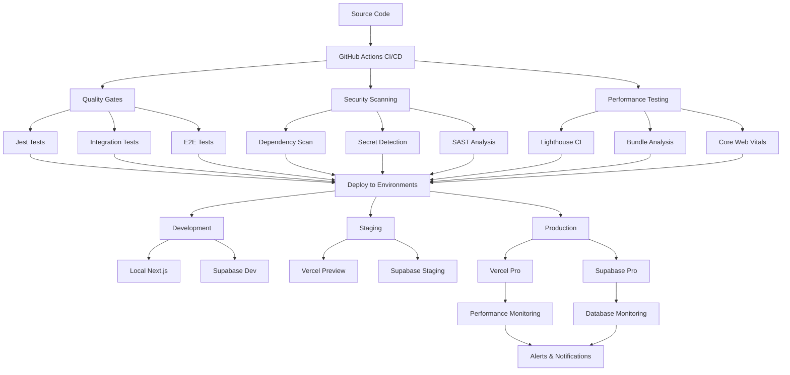

# Deployment Documentation Overview

## 🚀 Complete Deployment Strategy for trAIner AI Fitness App

This directory contains comprehensive deployment documentation designed for **solo developer workflows** while maintaining enterprise-grade reliability, security, and performance. Our deployment strategy leverages **Vercel Pro**, **Supabase Pro**, and **GitHub Actions** to deliver automated, scalable, and secure deployments.

---

## 📋 Documentation Structure

### [📦 Build Configuration Guide](./build-configuration.md)
**Comprehensive Next.js 14 build optimization and environment-specific configuration**

**Key Features:**
- ✅ Next.js 14 with Partial Pre-rendering (PPR) and React Compiler
- ✅ Environment-specific build profiles (dev/staging/production)
- ✅ Performance budget enforcement (LCP < 2.5s, Bundle < 500KB)
- ✅ TypeScript optimization with path aliases
- ✅ Bundle analysis and optimization strategies
- ✅ Vercel Pro integration patterns

**Performance Targets:**
- Build Time: < 2 minutes (dev), < 5 minutes (prod)
- Bundle Size: < 500KB initial JavaScript
- Core Web Vitals: LCP < 2.5s, INP < 200ms, CLS < 0.1

### [🌍 Environment Management Guide](./environment-management.md)
**Three-tier environment architecture with Pro-tier service integration**

**Key Features:**
- ✅ Development, Staging, and Production environments
- ✅ Vercel Pro environment management and team features
- ✅ Supabase Pro multi-project setup with branch databases
- ✅ Comprehensive environment variables matrix (40+ variables)
- ✅ Security & compliance integration (GDPR, health data protection)
- ✅ Automated environment synchronization and validation

**Environment Architecture:**
- **Development**: Local Next.js + Supabase Dev (RLS disabled, verbose logging)
- **Staging**: Vercel Preview + Supabase Staging (production-like RLS, full monitoring)
- **Production**: Vercel Pro + Supabase Pro (strict security, comprehensive monitoring)

### [⚙️ CI/CD Setup Guide](./ci-cd-setup.md)
**Automated deployment pipeline with comprehensive quality gates**

**Key Features:**
- ✅ GitHub Actions workflow with quality gates, security scanning, and performance testing
- ✅ Weekly deployment strategy optimized for solo developers
- ✅ Performance monitoring integration with existing monitoring system
- ✅ Multi-layered security implementation (SAST, dependency scanning, secret detection)
- ✅ Vercel Pro and Supabase Pro monitoring integration
- ✅ Comprehensive troubleshooting and emergency procedures

**Deployment Strategy:**
- **Monday-Wednesday**: Feature deployments and major updates
- **Thursday**: Performance improvements and bug fixes
- **Friday**: Emergency fixes only (stability focus)
- **Continuous**: Automatic preview deployments for all PRs

---

## 🏗️ Architecture Overview



---

## 🎯 Deployment Workflow

### 1. Development Phase
```bash
# Local development
npm run dev                    # Start development server
npm run test                   # Run unit tests
npm run test:integration       # Run integration tests
npm run type-check             # TypeScript validation
```

### 2. Quality Assurance
```bash
# Automated in CI/CD
npm run test:coverage          # Coverage requirements (80%+ statements)
npm run test:security          # Security validation
npm run test:performance       # AI performance testing
npm run lint                   # Code quality checks
```

### 3. Build & Optimization
```bash
# Environment-specific builds
npm run build:dev              # Development build with source maps
npm run build:staging          # Staging build with monitoring
npm run build                  # Production build (optimized)
npm run analyze                # Bundle analysis
```

### 4. Deployment Pipeline
```yaml
# Automated via GitHub Actions
PR Creation → Preview Deployment (Vercel)
Staging Push → Staging Environment
Main Push → Production Deployment
```

### 5. Post-Deployment Monitoring
- **Health Checks**: Automated endpoint validation
- **Performance Monitoring**: Core Web Vitals tracking
- **Error Tracking**: Real-time error detection
- **Security Monitoring**: Continuous vulnerability scanning

---

## 🔒 Security & Compliance

### Security Layers
- **Dependency Scanning**: npm audit + Snyk integration
- **Secret Detection**: GitGuardian + TruffleHog
- **Static Analysis**: CodeQL + SonarCloud
- **Container Security**: Trivy + Grype (if using Docker)

### Compliance Features
- **GDPR Compliance**: Data protection validation
- **Health Data Protection**: AES-256-GCM encryption
- **Audit Logging**: Comprehensive access tracking
- **Data Retention**: Automated policy enforcement

### Secret Management
- **Environment-based Access**: Separate secrets per environment
- **Rotation Strategy**: Quarterly high-sensitivity, bi-annual medium-sensitivity
- **Encryption**: All secrets encrypted at rest
- **Access Control**: Role-based secret access

---

## 📊 Performance Monitoring

### Integration Points
- **Vercel Pro Analytics**: Real-time performance monitoring
- **Supabase Pro Dashboard**: Database performance metrics
- **Custom Monitoring**: Integration with `/docs/frontend-integration/05-performance/monitoring-setup.md`
- **Alert System**: Slack, email, and Sentry integration

### Performance Budgets
- **JavaScript Bundle**: 500KB limit
- **CSS Bundle**: 100KB limit
- **Image Optimization**: WebP/AVIF formats
- **Core Web Vitals**: Automated validation

### Monitoring Scope
- **Frontend Performance**: Real User Monitoring (RUM)
- **Backend Performance**: API response times
- **AI Operations**: OpenAI/Perplexity API performance
- **Infrastructure**: Database and caching performance

---

## 🛠️ Service Integration

### Vercel Pro Features Utilized
- ✅ **Real User Monitoring**: Performance insights
- ✅ **Web Vitals**: Automated Core Web Vitals tracking
- ✅ **Team Features**: Collaborative deployment management
- ✅ **Advanced Analytics**: Audience insights and conversion tracking
- ✅ **Edge Configuration**: Dynamic configuration updates
- ✅ **Security Headers**: Automated security enforcement

### Supabase Pro Features Utilized
- ✅ **Database Observability**: Real-time performance monitoring
- ✅ **Point-in-Time Recovery**: 30-day backup retention
- ✅ **Branch Databases**: Isolated staging environments
- ✅ **Advanced Monitoring**: Slow query analysis
- ✅ **Compliance Features**: SOC 2 Type 2 + GDPR compliance
- ✅ **Connection Pooling**: Optimized database performance

---

## 🚨 Emergency Procedures

### Hotfix Deployment
```bash
# Emergency hotfix process
git checkout main
git checkout -b hotfix/critical-issue
# Make minimal fix
git push origin hotfix/critical-issue
gh workflow run emergency-deploy.yml --ref hotfix/critical-issue
```

### Rollback Procedures
```bash
# Automatic rollback triggers
# - Health check failures (3 consecutive)
# - Error rate > 10% for 5 minutes
# - Core Web Vitals regression > 50%

# Manual rollback
vercel ls --scope=team --limit=2
vercel promote [previous-deployment-id] --scope=team
```

### Support Contacts
- **Vercel Support**: https://vercel.com/help
- **Supabase Support**: https://supabase.com/support
- **Emergency Escalation**: Critical issues require immediate response (< 15 minutes)

---

## 📈 Success Metrics

### DORA Metrics Targets
- **Deployment Frequency**: Weekly (High performance tier)
- **Lead Time for Changes**: < 1 day (same day deployment)
- **Change Failure Rate**: < 5% (minimal deployment issues)
- **Time to Restore Service**: < 1 hour (rapid recovery)

### Performance Metrics
- **Build-to-Deploy Time**: < 10 minutes end-to-end
- **Automated Test Coverage**: 95%+ coverage across all test types
- **Zero Deployment Downtime**: Seamless deployments
- **99.9% Uptime**: Production availability target

### Business Metrics
- **Compliance Adherence**: 100% GDPR and health data protection
- **Security Incident Rate**: Zero critical security issues
- **Developer Productivity**: Single-command deployment process
- **Monitoring Coverage**: Comprehensive observability across all services

---

## 🔄 Continuous Improvement

### Weekly Review Process
- **Monday**: Review previous week's deployment metrics
- **Wednesday**: Performance optimization opportunities
- **Friday**: Security and compliance audit
- **Monthly**: Documentation updates and process refinement

### Optimization Areas
- **Build Performance**: Continuous optimization of build times
- **Bundle Size**: Regular analysis and optimization
- **Security Posture**: Ongoing security enhancement
- **Developer Experience**: Streamlining deployment workflows

---

This deployment documentation provides the complete foundation for reliable, secure, and performant deployments of the trAIner AI Fitness App. The system is designed to scale with growth while maintaining the simplicity required for solo developer workflows.

For implementation support, refer to the individual guide documentation for detailed instructions and troubleshooting assistance. 