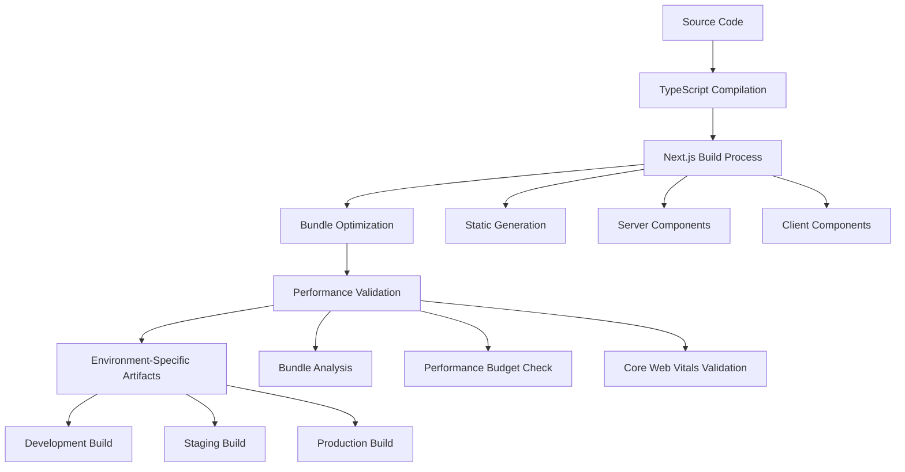

# Build Configuration Guide

## Table of Contents
1. [Overview](#overview)
2. [Next.js 14 Build Optimization](#nextjs-14-build-optimization)
3. [Environment-Specific Build Profiles](#environment-specific-build-profiles)
4. [Performance Budget Enforcement](#performance-budget-enforcement)
5. [TypeScript Build Configuration](#typescript-build-configuration)
6. [Bundle Analysis & Optimization](#bundle-analysis--optimization)
7. [CI/CD Integration](#cicd-integration)
8. [Troubleshooting](#troubleshooting)

## Overview

The trAIner AI Fitness App build configuration leverages Next.js 14 with advanced optimization features, designed to deliver optimal performance across development, staging, and production environments. Our build system integrates with Vercel Pro and Supabase Pro services while maintaining strict performance budgets and comprehensive TypeScript support.

### Build System Architecture



### Key Performance Targets

- **Build Time**: < 2 minutes for development, < 5 minutes for production
- **Bundle Size**: < 500KB for initial JavaScript bundle
- **Core Web Vitals**: LCP < 2.5s, INP < 200ms, CLS < 0.1
- **First Contentful Paint**: < 1.8s
- **Time to Interactive**: < 3.5s

## Next.js 14 Build Optimization

### Enhanced Configuration

Our `next.config.mjs` leverages Next.js 14's latest features for optimal performance:

```typescript
/** @type {import('next').NextConfig} */
const nextConfig = {
  // Performance optimizations for Vercel Pro
  experimental: {
    ppr: true,              // Partial Pre-rendering for optimal loading
    reactCompiler: true,    // React Compiler integration
    serverActions: {
      allowedOrigins: ['localhost:3000', '*.vercel.app'],
      bodySizeLimit: '2mb'
    },
    optimizePackageImports: [
      '@radix-ui/react-icons',
      'lucide-react',
      'recharts'
    ]
  },
  
  // Bundle optimization
  webpack: (config, { buildId, dev, isServer, defaultLoaders, webpack }) => {
    // Bundle analyzer integration for Vercel Pro
    if (process.env.ANALYZE === 'true') {
      const BundleAnalyzerPlugin = require('webpack-bundle-analyzer').BundleAnalyzerPlugin;
      config.plugins.push(new BundleAnalyzerPlugin({
        analyzerMode: 'static',
        openAnalyzer: false,
        reportFilename: isServer ? '../analyze/server.html' : './analyze/client.html'
      }));
    }
    
    // Optimize imports for better tree shaking
    config.resolve.alias = {
      ...config.resolve.alias,
      '@/components': path.resolve(__dirname, 'components'),
      '@/lib': path.resolve(__dirname, 'lib'),
      '@/utils': path.resolve(__dirname, 'utils'),
    };
    
    // AI-specific optimizations
    config.resolve.fallback = {
      ...config.resolve.fallback,
      fs: false,
      net: false,
      tls: false,
    };
    
    return config;
  },
  
  // Image optimization for fitness app
  images: {
    domains: ['supabase.co', 'amazonaws.com', 'avatars.githubusercontent.com'],
    formats: ['image/webp', 'image/avif'],
    deviceSizes: [640, 750, 828, 1080, 1200, 1920, 2048, 3840],
    imageSizes: [16, 32, 48, 64, 96, 128, 256, 384],
    minimumCacheTTL: 60 * 60 * 24 * 7, // 7 days
  },
  
  // Compression and headers
  compress: true,
  poweredByHeader: false,
  
  // Environment-specific configurations
  env: {
    NEXT_PUBLIC_APP_VERSION: process.env.npm_package_version,
    NEXT_PUBLIC_BUILD_TIME: new Date().toISOString(),
  },
  
  // Output configuration for different deployment targets
  output: process.env.NODE_ENV === 'production' ? 'standalone' : undefined,
  
  // Redirects and rewrites for fitness app routing
  async redirects() {
    return [
      {
        source: '/workout',
        destination: '/workouts',
        permanent: true,
      },
      {
        source: '/profile',
        destination: '/account',
        permanent: false,
      },
    ];
  },
  
  // Headers for security and performance
  async headers() {
    return [
      {
        source: '/(.*)',
        headers: [
          {
            key: 'X-Frame-Options',
            value: 'DENY',
          },
          {
            key: 'X-Content-Type-Options',
            value: 'nosniff',
          },
          {
            key: 'Referrer-Policy',
            value: 'strict-origin-when-cross-origin',
          },
        ],
      },
      {
        source: '/api/(.*)',
        headers: [
          {
            key: 'Cache-Control',
            value: 'no-store, max-age=0',
          },
        ],
      },
    ];
  },
};

export default nextConfig;
```

### App Router Optimization

Leveraging Next.js 14's App Router for enhanced performance:

```typescript
// app/layout.tsx - Root layout optimization
import { Inter } from 'next/font/google';
import { Metadata, Viewport } from 'next';

const inter = Inter({
  subsets: ['latin'],
  display: 'swap',
  preload: true,
  variable: '--font-inter',
});

export const viewport: Viewport = {
  width: 'device-width',
  initialScale: 1,
  maximumScale: 5,
  userScalable: true,
};

export const metadata: Metadata = {
  title: {
    default: 'trAIner - AI-Powered Fitness App',
    template: '%s | trAIner',
  },
  description: 'Personalized workout plans powered by AI for optimal fitness results.',
  keywords: ['fitness', 'AI', 'workout', 'nutrition', 'health'],
  authors: [{ name: 'trAIner Team' }],
  openGraph: {
    type: 'website',
    locale: 'en_US',
    url: 'https://trainer-app.vercel.app',
    siteName: 'trAIner',
    images: [
      {
        url: '/og-image.jpg',
        width: 1200,
        height: 630,
        alt: 'trAIner - AI-Powered Fitness App',
      },
    ],
  },
  twitter: {
    card: 'summary_large_image',
    title: 'trAIner - AI-Powered Fitness App',
    description: 'Personalized workout plans powered by AI for optimal fitness results.',
    images: ['/twitter-image.jpg'],
  },
  robots: {
    index: true,
    follow: true,
    googleBot: {
      index: true,
      follow: true,
      'max-video-preview': -1,
      'max-image-preview': 'large',
      'max-snippet': -1,
    },
  },
};
```

### Static Generation Strategy

```typescript
// Optimized page generation strategies
export const dynamic = 'force-dynamic'; // For dashboard pages
export const revalidate = 3600; // 1 hour for static content
export const fetchCache = 'force-cache'; // For workout templates

// Generate static paths for workout categories
export async function generateStaticParams() {
  const categories = ['strength', 'cardio', 'flexibility', 'hiit'];
  return categories.map(category => ({ category }));
}
```

## Environment-Specific Build Profiles

### Development Build Profile

Optimized for fast iteration and comprehensive debugging:

```json
// package.json - Development scripts
{
  "scripts": {
    "dev": "next dev --turbo",
    "dev:debug": "NODE_OPTIONS='--inspect' next dev",
    "dev:analyze": "ANALYZE=true next dev",
    "build:dev": "NODE_ENV=development next build",
  }
}
```

**Development Configuration:**
```typescript
// next.config.mjs - Development overrides
const isDevelopment = process.env.NODE_ENV === 'development';

const devConfig = {
  // Fast refresh and hot reloading
  reactStrictMode: true,
  swcMinify: false,
  
  // Enhanced debugging
  generateBuildId: () => 'development',
  
  // Source maps for debugging
  webpack: (config, { dev }) => {
    if (dev) {
      config.devtool = 'eval-cheap-module-source-map';
    }
    return config;
  },
  
  // Development-specific headers
  async headers() {
    return [
      {
        source: '/(.*)',
        headers: [
          {
            key: 'Cache-Control',
            value: 'no-cache, no-store, must-revalidate',
          },
        ],
      },
    ];
  },
};
```

### Staging Build Profile

Production-like environment with debugging capabilities:

```json
// package.json - Staging scripts
{
  "scripts": {
    "build:staging": "NODE_ENV=staging next build",
    "start:staging": "NODE_ENV=staging next start",
    "analyze:staging": "NODE_ENV=staging ANALYZE=true next build",
  }
}
```

**Staging Configuration:**
```typescript
const isstaging = process.env.NODE_ENV === 'staging';

const stagingConfig = {
  // Production optimizations with debugging
  swcMinify: true,
  compress: true,
  
  // Source maps for staging debugging
  productionBrowserSourceMaps: true,
  
  // Performance monitoring
  experimental: {
    instrumentationHook: true,
  },
  
  // Staging-specific environment variables
  env: {
    NEXT_PUBLIC_ENVIRONMENT: 'staging',
    NEXT_PUBLIC_DEBUG_MODE: 'true',
  },
};
```

### Production Build Profile

Fully optimized for performance and security:

```json
// package.json - Production scripts
{
  "scripts": {
    "build": "NODE_ENV=production next build",
    "start": "NODE_ENV=production next start",
    "build:analyze": "NODE_ENV=production ANALYZE=true next build",
  }
}
```

**Production Configuration:**
```typescript
const isProduction = process.env.NODE_ENV === 'production';

const productionConfig = {
  // Maximum optimization
  swcMinify: true,
  compress: true,
  
  // No source maps in production
  productionBrowserSourceMaps: false,
  
  // Strict CSP headers
  async headers() {
    return [
      {
        source: '/(.*)',
        headers: [
          {
            key: 'Content-Security-Policy',
            value: "default-src 'self'; script-src 'self' 'unsafe-eval' 'unsafe-inline' https://vercel.live; style-src 'self' 'unsafe-inline'; img-src 'self' data: https:; connect-src 'self' https://*.supabase.co https://api.openai.com;",
          },
          {
            key: 'Strict-Transport-Security',
            value: 'max-age=31536000; includeSubDomains',
          },
        ],
      },
    ];
  },
  
  // Production environment variables
  env: {
    NEXT_PUBLIC_ENVIRONMENT: 'production',
    NEXT_PUBLIC_DEBUG_MODE: 'false',
  },
};
```

## Performance Budget Enforcement

### Lighthouse CI Configuration

Integration with existing performance monitoring system:

```javascript
// .lighthouserc.js
module.exports = {
  ci: {
    collect: {
      url: [
        'http://localhost:3000',
        'http://localhost:3000/login',
        'http://localhost:3000/dashboard',
        'http://localhost:3000/workouts',
        'http://localhost:3000/nutrition',
      ],
      startServerCommand: 'npm run start',
      numberOfRuns: 3,
    },
    assert: {
      assertions: {
        'categories:performance': ['error', { minScore: 0.9 }],
        'categories:accessibility': ['error', { minScore: 0.9 }],
        'categories:best-practices': ['error', { minScore: 0.9 }],
        'categories:seo': ['error', { minScore: 0.9 }],
        
        // Core Web Vitals thresholds
        'largest-contentful-paint': ['error', { maxNumericValue: 2500 }],
        'cumulative-layout-shift': ['error', { maxNumericValue: 0.1 }],
        'first-contentful-paint': ['error', { maxNumericValue: 1800 }],
        'speed-index': ['error', { maxNumericValue: 3400 }],
        'interactive': ['error', { maxNumericValue: 3500 }],
        
        // Bundle size thresholds
        'total-byte-weight': ['error', { maxNumericValue: 1000000 }], // 1MB
        'unused-javascript': ['warn', { maxNumericValue: 200000 }], // 200KB
        'unused-css-rules': ['warn', { maxNumericValue: 50000 }], // 50KB
      },
    },
    upload: {
      target: 'temporary-public-storage',
    },
  },
};
```

### Bundle Size Monitoring

```json
// performance-budget.json
{
  "budget": [
    {
      "path": "/_next/static/chunks/*.js",
      "maximumFileSizeByte": 250000,
      "maximumWarning": 200000
    },
    {
      "path": "/_next/static/css/*.css",
      "maximumFileSizeByte": 50000,
      "maximumWarning": 40000
    },
    {
      "path": "/",
      "timings": [
        {
          "metric": "interactive",
          "budget": 3500,
          "tolerance": 500
        },
        {
          "metric": "first-contentful-paint",
          "budget": 1800,
          "tolerance": 200
        }
      ],
      "resourceSizes": [
        {
          "resourceType": "script",
          "budget": 500,
          "tolerance": 50
        },
        {
          "resourceType": "stylesheet",
          "budget": 50,
          "tolerance": 10
        }
      ]
    }
  ]
}
```

### Build-Time Performance Validation

```javascript
// scripts/validate-performance.js
const { execSync } = require('child_process');
const fs = require('fs');
const path = require('path');

async function validateBuildPerformance() {
  console.log('🔍 Validating build performance...');
  
  // Check bundle sizes
  const buildDir = path.join(process.cwd(), '.next');
  const statsFile = path.join(buildDir, 'build-manifest.json');
  
  if (fs.existsSync(statsFile)) {
    const buildManifest = JSON.parse(fs.readFileSync(statsFile, 'utf8'));
    const bundles = buildManifest.pages;
    
    // Validate bundle sizes
    for (const [page, files] of Object.entries(bundles)) {
      const totalSize = files.reduce((acc, file) => {
        const filePath = path.join(buildDir, 'static', file);
        return fs.existsSync(filePath) ? acc + fs.statSync(filePath).size : acc;
      }, 0);
      
      if (totalSize > 500000) { // 500KB threshold
        console.error(`❌ Bundle size exceeded for ${page}: ${(totalSize / 1024).toFixed(2)}KB`);
        process.exit(1);
      }
    }
  }
  
  // Run Lighthouse CI
  try {
    execSync('npx lhci autorun', { stdio: 'inherit' });
    console.log('✅ Performance validation passed');
  } catch (error) {
    console.error('❌ Performance validation failed');
    process.exit(1);
  }
}

if (require.main === module) {
  validateBuildPerformance();
}

module.exports = { validateBuildPerformance };
```

## TypeScript Build Configuration

### Enhanced TypeScript Configuration

```json
// tsconfig.json - Production-optimized configuration
{
  "compilerOptions": {
    "target": "ES2022",
    "lib": ["dom", "dom.iterable", "ES2022"],
    "allowJs": true,
    "skipLibCheck": true,
    "strict": true,
    "noEmit": true,
    "esModuleInterop": true,
    "module": "esnext",
    "moduleResolution": "bundler",
    "resolveJsonModule": true,
    "isolatedModules": true,
    "jsx": "preserve",
    
    // Build optimization
    "incremental": true,
    "tsBuildInfoFile": ".next/tsbuildinfo",
    
    // Type checking optimization
    "skipLibCheck": true,
    "forceConsistentCasingInFileNames": true,
    
    // Path mapping for better imports
    "baseUrl": ".",
    "paths": {
      "@/*": ["./*"],
      "@/components/*": ["components/*"],
      "@/lib/*": ["lib/*"],
      "@/utils/*": ["utils/*"],
      "@/contexts/*": ["contexts/*"],
      "@/hooks/*": ["hooks/*"],
      "@/types/*": ["types/*"]
    },
    
    // Next.js plugin
    "plugins": [
      {
        "name": "next"
      }
    ],
    
    // Type definitions
    "types": ["jest", "node", "@playwright/test", "@types/testing-library__jest-dom"]
  },
  "include": [
    "next-env.d.ts",
    "**/*.ts",
    "**/*.tsx",
    ".next/types/**/*.ts",
    "global.d.ts"
  ],
  "exclude": [
    "node_modules",
    ".next",
    "out",
    "build",
    "dist",
    "backend/**/*"
  ]
}
```

### Build-Time Type Checking

```json
// tsconfig.build.json - Strict build-time configuration
{
  "extends": "./tsconfig.json",
  "compilerOptions": {
    "noEmit": true,
    "strict": true,
    "noUnusedLocals": true,
    "noUnusedParameters": true,
    "exactOptionalPropertyTypes": true,
    "noImplicitReturns": true,
    "noFallthroughCasesInSwitch": true,
    "noUncheckedIndexedAccess": true
  },
  "include": [
    "app/**/*",
    "components/**/*",
    "lib/**/*",
    "utils/**/*",
    "contexts/**/*",
    "hooks/**/*",
    "types/**/*"
  ]
}
```

### Type Generation for API Integration

```typescript
// scripts/generate-types.ts
import { createClient } from '@supabase/supabase-js';
import { writeFileSync } from 'fs';
import { exec } from 'child_process';

async function generateDatabaseTypes() {
  console.log('📝 Generating database types...');
  
  // Generate Supabase types
  exec('supabase gen types typescript --project-id YOUR_PROJECT_REF > types/database.types.ts', 
    (error, stdout, stderr) => {
      if (error) {
        console.error('Error generating database types:', error);
        return;
      }
      console.log('✅ Database types generated');
    }
  );
}

// Generate API response types from OpenAPI schema
async function generateAPITypes() {
  console.log('📝 Generating API types...');
  
  exec('npx openapi-typescript docs/openapi.yaml -o types/api.types.ts', 
    (error, stdout, stderr) => {
      if (error) {
        console.error('Error generating API types:', error);
        return;
      }
      console.log('✅ API types generated');
    }
  );
}

if (require.main === module) {
  generateDatabaseTypes();
  generateAPITypes();
}
```

## Bundle Analysis & Optimization

### Webpack Bundle Analyzer Integration

```javascript
// next.config.mjs - Bundle analyzer configuration
const withBundleAnalyzer = require('@next/bundle-analyzer')({
  enabled: process.env.ANALYZE === 'true',
  openAnalyzer: false,
});

// Analyze specific chunks
const analyzeBundles = (config, { isServer }) => {
  if (process.env.ANALYZE === 'true') {
    const BundleAnalyzerPlugin = require('webpack-bundle-analyzer').BundleAnalyzerPlugin;
    
    config.plugins.push(
      new BundleAnalyzerPlugin({
        analyzerMode: 'static',
        reportFilename: isServer 
          ? '../analyze/server.html' 
          : './analyze/client.html',
        openAnalyzer: false,
        generateStatsFile: true,
        statsFilename: isServer 
          ? '../analyze/server-stats.json' 
          : './analyze/client-stats.json',
      })
    );
  }
  
  return config;
};
```

### Optimization Strategies

```typescript
// lib/optimization/lazy-imports.ts
import dynamic from 'next/dynamic';
import { Suspense } from 'react';

// Lazy load heavy components
export const WorkoutVisualization = dynamic(
  () => import('@/components/workout/workout-visualization'),
  {
    loading: () => <div className="animate-pulse h-64 bg-gray-200 rounded" />,
    ssr: false,
  }
);

export const NutritionChart = dynamic(
  () => import('@/components/nutrition/nutrition-chart'),
  {
    loading: () => <div className="animate-pulse h-48 bg-gray-200 rounded" />,
    ssr: false,
  }
);

// Code splitting for AI components
export const AIReasoningVisualization = dynamic(
  () => import('@/components/ai/ai-reasoning-visualization'),
  {
    loading: () => <div>Loading AI insights...</div>,
    ssr: false,
  }
);
```

### Tree Shaking Optimization

```typescript
// lib/optimization/imports.ts
// Optimized imports for better tree shaking

// ❌ Bad - imports entire library
import * as Icons from 'lucide-react';

// ✅ Good - specific imports
import { User, Settings, Activity } from 'lucide-react';

// ❌ Bad - imports entire utility library
import _ from 'lodash';

// ✅ Good - specific utility imports
import { debounce } from 'lodash/debounce';
import { throttle } from 'lodash/throttle';

// ❌ Bad - imports entire date library
import moment from 'moment';

// ✅ Good - modern date library with better tree shaking
import { format, parseISO } from 'date-fns';
```

## CI/CD Integration

### GitHub Actions Build Workflow

```yaml
# .github/workflows/build-and-test.yml
name: Build and Test

on:
  push:
    branches: [main, staging]
  pull_request:
    branches: [main]

jobs:
  build-and-test:
    runs-on: ubuntu-latest
    
    strategy:
      matrix:
        node-version: [18.x, 20.x]
        
    steps:
      - name: Checkout code
        uses: actions/checkout@v4
        
      - name: Setup Node.js ${{ matrix.node-version }}
        uses: actions/setup-node@v4
        with:
          node-version: ${{ matrix.node-version }}
          cache: 'npm'
          
      - name: Install dependencies
        run: npm ci
        
      - name: Type checking
        run: npx tsc --noEmit
        
      - name: Lint code
        run: npm run lint
        
      - name: Run tests
        run: npm run test
        
      - name: Build application
        run: npm run build
        env:
          NEXT_PUBLIC_SUPABASE_URL: ${{ secrets.NEXT_PUBLIC_SUPABASE_URL }}
          NEXT_PUBLIC_SUPABASE_ANON_KEY: ${{ secrets.NEXT_PUBLIC_SUPABASE_ANON_KEY }}
          
      - name: Run bundle analysis
        run: npm run analyze
        env:
          ANALYZE: true
          
      - name: Performance validation
        run: node scripts/validate-performance.js
        
      - name: Upload build artifacts
        uses: actions/upload-artifact@v3
        with:
          name: build-${{ matrix.node-version }}
          path: .next/
```

### Vercel Build Configuration

```json
// vercel.json
{
  "buildCommand": "npm run build",
  "outputDirectory": ".next",
  "installCommand": "npm ci",
  "devCommand": "npm run dev",
  "framework": "nextjs",
  "regions": ["iad1"],
  "functions": {
    "app/api/**/*.ts": {
      "maxDuration": 30
    }
  },
  "headers": [
    {
      "source": "/(.*)",
      "headers": [
        {
          "key": "X-Frame-Options",
          "value": "DENY"
        },
        {
          "key": "X-Content-Type-Options",
          "value": "nosniff"
        }
      ]
    }
  ],
  "rewrites": [
    {
      "source": "/api/(.*)",
      "destination": "/api/$1"
    }
  ]
}
```

## Troubleshooting

### Common Build Issues

#### 1. Bundle Size Exceeded
```bash
# Analyze bundle composition
npm run analyze

# Check specific chunks
npx webpack-bundle-analyzer .next/static/chunks/*.js

# Solution: Implement code splitting
# See: Bundle Analysis & Optimization section
```

#### 2. TypeScript Build Errors
```bash
# Check for type errors
npx tsc --noEmit

# Generate missing types
npm run generate-types

# Clear TypeScript cache
rm -rf .next/tsbuildinfo
```

#### 3. Performance Budget Failures
```bash
# Run Lighthouse locally
npx lighthouse http://localhost:3000 --view

# Check Core Web Vitals
npm run test:performance

# Solution: Review Performance Budget Enforcement section
```

#### 4. Memory Issues During Build
```bash
# Increase Node.js memory limit
NODE_OPTIONS="--max-old-space-size=4096" npm run build

# Alternative: Use production build
NODE_ENV=production npm run build
```

### Build Optimization Checklist

- [ ] Next.js 14 features enabled (PPR, React Compiler)
- [ ] Bundle analyzer configured and run
- [ ] Performance budgets set and enforced
- [ ] TypeScript strict mode enabled
- [ ] Tree shaking optimized
- [ ] Dynamic imports implemented for heavy components
- [ ] Image optimization configured
- [ ] Security headers implemented
- [ ] Environment-specific builds working
- [ ] CI/CD pipeline integrated

### Performance Monitoring

The build configuration integrates with our comprehensive performance monitoring system documented in `/docs/frontend-integration/05-performance/monitoring-setup.md`. Key integration points:

- **Real-time monitoring** during build process
- **Performance regression detection** in CI/CD
- **Bundle size tracking** over time
- **Core Web Vitals validation** before deployment

For detailed monitoring setup and configuration, refer to the Performance Monitoring Setup guide. 