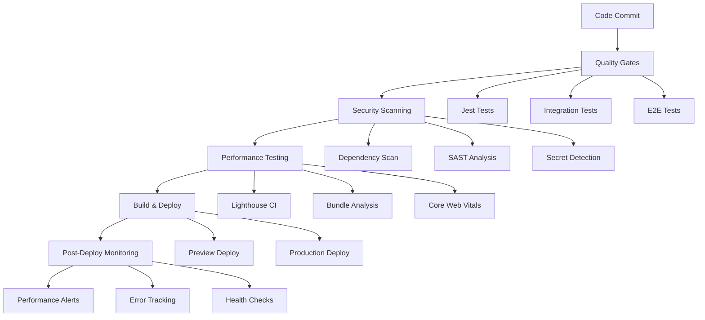

# CI/CD Setup Guide

## Table of Contents
1. [Overview](#overview)
2. [GitHub Actions Workflow Architecture](#github-actions-workflow-architecture)
3. [Weekly Deployment Strategy](#weekly-deployment-strategy)
4. [Performance Monitoring Integration](#performance-monitoring-integration)
5. [Security Implementation](#security-implementation)
6. [Monitoring and Alerting Integration](#monitoring-and-alerting-integration)
7. [Environment-Specific Configurations](#environment-specific-configurations)
8. [Troubleshooting](#troubleshooting)

## Overview

The trAIner AI Fitness App implements a sophisticated CI/CD pipeline designed for **solo developer workflows** while maintaining enterprise-grade reliability and security. Our system leverages **GitHub Actions**, **Vercel Pro**, and **Supabase Pro** to deliver automated deployments with comprehensive quality gates, performance monitoring, and security validations.

### CI/CD Philosophy



### Key Principles

- **Quality First**: No deployment without passing all quality gates
- **Security by Design**: Multiple security validation layers
- **Performance Awareness**: Regression detection and budgets
- **Solo Developer Optimized**: Minimal manual intervention required
- **Vercel Pro Integration**: Leveraging team features and advanced monitoring

## GitHub Actions Workflow Architecture

### Complete Workflow Configuration

Our comprehensive GitHub Actions workflow provides automated quality gates, security scanning, and deployment automation:

```yaml
# .github/workflows/deploy.yml
name: Deploy trAIner App

on:
  push:
    branches: [main, staging]
  pull_request:
    branches: [main]

env:
  NODE_VERSION: '18'
  VERCEL_ORG_ID: ${{ secrets.VERCEL_ORG_ID }}
  VERCEL_PROJECT_ID: ${{ secrets.VERCEL_PROJECT_ID }}

jobs:
  quality-gates:
    name: Quality Gates
    runs-on: ubuntu-latest
    timeout-minutes: 20
    
    steps:
      - name: Checkout Repository
        uses: actions/checkout@v4
        with:
          fetch-depth: 0
      
      - name: Setup Node.js
        uses: actions/setup-node@v4
        with:
          node-version: ${{ env.NODE_VERSION }}
          cache: 'npm'
      
      - name: Install Dependencies
        run: npm ci
        
      - name: Validate Package Lock
        run: npm audit --audit-level=high
        
      - name: Code Quality Checks
        run: |
          npm run lint
          npm run type-check
          
      - name: Run Unit Tests
        run: npm run test:coverage
        
      - name: Run Integration Tests
        run: npm run test:integration
        env:
          RUN_INTEGRATION_TESTS: true
          
      - name: Run Security Tests
        run: npm run test:security
        
      - name: Backend Coverage Check
        run: npm run test:backend-coverage
        
      - name: Upload Test Results
        uses: codecov/codecov-action@v3
        if: always()
        with:
          files: ./coverage/lcov.info
          fail_ci_if_error: false

  security-scanning:
    name: Security Scanning
    runs-on: ubuntu-latest
    timeout-minutes: 15
    
    steps:
      - uses: actions/checkout@v4
        with:
          fetch-depth: 0
          
      - name: Run Dependency Security Scan
        uses: securecodewarrior/github-action-add-sarif@v1
        with:
          sarif-file: 'dependency-scan-results.sarif'
          
      - name: Secret Detection
        uses: gitguardian/ggshield-action@v1
        env:
          GITGUARDIAN_API_KEY: ${{ secrets.GITGUARDIAN_API_KEY }}
        with:
          args: secret scan path .
          
      - name: Container Security Scan
        if: hashFiles('Dockerfile') != ''
        uses: aquasecurity/trivy-action@master
        with:
          scan-type: 'fs'
          scan-ref: '.'
          format: 'sarif'
          output: 'trivy-results.sarif'
          
      - name: Upload Security Results
        uses: github/codeql-action/upload-sarif@v2
        if: always()
        with:
          sarif_file: 'dependency-scan-results.sarif'

  performance-testing:
    name: Performance Testing
    runs-on: ubuntu-latest
    timeout-minutes: 25
    needs: [quality-gates]
    
    steps:
      - uses: actions/checkout@v4
      
      - name: Setup Node.js
        uses: actions/setup-node@v4
        with:
          node-version: ${{ env.NODE_VERSION }}
          cache: 'npm'
          
      - name: Install Dependencies
        run: npm ci
        
      - name: Build Application
        run: npm run build
        env:
          ANALYZE: true
          
      - name: Bundle Size Analysis
        run: |
          npm run analyze
          node scripts/check-bundle-size.js
          
      - name: Lighthouse CI
        uses: treosh/lighthouse-ci-action@v10
        with:
          configPath: './.lighthouserc.js'
          uploadArtifacts: true
          temporaryPublicStorage: true
          
      - name: Core Web Vitals Check
        run: |
          npm run test:performance
          node scripts/validate-core-web-vitals.js
          
      - name: AI Performance Testing
        run: npm run test:ai-performance
        env:
          OPENAI_API_KEY: ${{ secrets.OPENAI_API_KEY_TEST }}
          PERPLEXITY_API_KEY: ${{ secrets.PERPLEXITY_API_KEY_TEST }}

  deploy-preview:
    name: Deploy Preview
    if: github.event_name == 'pull_request'
    needs: [quality-gates, security-scanning, performance-testing]
    runs-on: ubuntu-latest
    timeout-minutes: 10
    
    environment:
      name: preview
      url: ${{ steps.deploy.outputs.preview-url }}
    
    steps:
      - uses: actions/checkout@v4
      
      - name: Deploy to Vercel Preview
        id: deploy
        uses: amondnet/vercel-action@v25
        with:
          vercel-token: ${{ secrets.VERCEL_TOKEN }}
          vercel-org-id: ${{ secrets.VERCEL_ORG_ID }}
          vercel-project-id: ${{ secrets.VERCEL_PROJECT_ID }}
          scope: ${{ secrets.VERCEL_TEAM_ID }}
          working-directory: './'
          
      - name: Preview Health Check
        run: |
          sleep 30
          curl -f ${{ steps.deploy.outputs.preview-url }}/api/health
          
      - name: Comment Preview URL
        uses: actions/github-script@v6
        with:
          script: |
            github.rest.issues.createComment({
              issue_number: context.issue.number,
              owner: context.repo.owner,
              repo: context.repo.repo,
              body: '🚀 Preview deployed to: ${{ steps.deploy.outputs.preview-url }}'
            })

  deploy-staging:
    name: Deploy to Staging
    if: github.ref == 'refs/heads/staging'
    needs: [quality-gates, security-scanning, performance-testing]
    runs-on: ubuntu-latest
    timeout-minutes: 15
    
    environment:
      name: staging
      url: https://trainer-app-staging.vercel.app
    
    steps:
      - uses: actions/checkout@v4
      
      - name: Deploy to Vercel Staging
        uses: amondnet/vercel-action@v25
        with:
          vercel-token: ${{ secrets.VERCEL_TOKEN }}
          vercel-org-id: ${{ secrets.VERCEL_ORG_ID }}
          vercel-project-id: ${{ secrets.VERCEL_PROJECT_ID }}
          vercel-args: '--target staging'
          scope: ${{ secrets.VERCEL_TEAM_ID }}
        env:
          VERCEL_ENV: staging
          
      - name: Staging Health Check
        run: |
          sleep 45
          curl -f https://trainer-app-staging.vercel.app/api/health
          
      - name: Run Staging E2E Tests
        run: npm run test:e2e:staging
        env:
          STAGING_URL: https://trainer-app-staging.vercel.app

  deploy-production:
    name: Deploy to Production
    if: github.ref == 'refs/heads/main'
    needs: [quality-gates, security-scanning, performance-testing]
    runs-on: ubuntu-latest
    timeout-minutes: 20
    
    environment:
      name: production
      url: https://trainer-app.com
    
    steps:
      - uses: actions/checkout@v4
      
      - name: Deploy to Vercel Production
        uses: amondnet/vercel-action@v25
        with:
          vercel-token: ${{ secrets.VERCEL_TOKEN }}
          vercel-org-id: ${{ secrets.VERCEL_ORG_ID }}
          vercel-project-id: ${{ secrets.VERCEL_PROJECT_ID }}
          vercel-args: '--prod'
          scope: ${{ secrets.VERCEL_TEAM_ID }}
        env:
          VERCEL_ENV: production
          
      - name: Production Health Check
        run: |
          sleep 60
          curl -f https://trainer-app.com/api/health
          
      - name: Run Production Smoke Tests
        run: npm run test:smoke:production
        env:
          PRODUCTION_URL: https://trainer-app.com
          
      - name: Notify Deployment Success
        uses: 8398a7/action-slack@v3
        if: success()
        with:
          status: success
          text: '✅ Production deployment successful!'
        env:
          SLACK_WEBHOOK_URL: ${{ secrets.SLACK_WEBHOOK_URL }}
          
      - name: Notify Deployment Failure
        uses: 8398a7/action-slack@v3
        if: failure()
        with:
          status: failure
          text: '❌ Production deployment failed!'
        env:
          SLACK_WEBHOOK_URL: ${{ secrets.SLACK_WEBHOOK_URL }}
```

### Workflow Features

#### **Quality Gates**
- **Unit Tests**: Jest with coverage requirements (80% statements, 70% branches)
- **Integration Tests**: Full backend integration testing
- **Security Tests**: Dedicated security validation suite
- **Type Checking**: Full TypeScript validation
- **Linting**: ESLint with fitness app specific rules

#### **Security Scanning**
- **Dependency Scanning**: npm audit with high-severity threshold
- **Secret Detection**: GitGuardian integration for leaked secrets
- **Container Scanning**: Trivy for Docker image vulnerabilities
- **SARIF Upload**: Security results integrated with GitHub Security tab

#### **Performance Validation**
- **Bundle Analysis**: Webpack bundle analyzer with size limits
- **Lighthouse CI**: Automated Core Web Vitals validation
- **AI Performance**: OpenAI/Perplexity API response time testing
- **Health Checks**: Post-deployment endpoint validation

## Weekly Deployment Strategy

### DORA Metrics Optimization

Based on research and solo developer best practices, our deployment strategy targets **High DORA Performance**:

```typescript
interface DORAMetrics {
  deploymentFrequency: 'weekly' | 'bi-weekly';     // Target: Weekly
  leadTimeForChanges: '<1 day';                    // Target: Same day
  changeFailureRate: '<5%';                       // Target: <5%
  timeToRestoreService: '<1 hour';                // Target: <1 hour
}
```

### Deployment Schedule

#### **Weekly Cadence**
```markdown
**Monday (Feature Day)**
- New feature deployments
- Major functionality updates
- AI agent improvements

**Tuesday (Enhancement Day)**  
- UI/UX improvements
- Performance optimizations
- Bug fixes from previous week

**Wednesday (Integration Day)**
- Third-party integrations
- API updates
- Database migrations

**Thursday (Quality Day)**
- Performance improvements
- Security updates
- Documentation updates

**Friday (Stability Day)**
- Emergency fixes only
- Hotfix deployments
- Critical security patches

**Weekend (Planning)**
- Monitoring review
- Performance analysis
- Next week planning
```

#### **Deployment Types**

**Feature Deployments** (Monday-Wednesday):
```yaml
Feature Deployment:
  trigger: main branch push
  environments: staging → production
  gates: all quality + performance
  rollback: automatic on failure
  monitoring: enhanced alerting (4 hours)
```

**Hotfix Deployments** (Thursday-Friday):
```yaml
Hotfix Deployment:
  trigger: hotfix/* branch
  environments: direct to production
  gates: security + critical tests only
  rollback: manual approval required
  monitoring: immediate alerting
```

**Preview Deployments** (Continuous):
```yaml
Preview Deployment:
  trigger: any PR
  environments: preview only
  gates: quality + basic security
  rollback: automatic cleanup
  monitoring: basic health checks
```

### Automation Features

#### **Automatic Preview Deployments**
- **Every PR**: Automatic preview deployment with unique URL
- **Branch Cleanup**: Automatic preview cleanup on PR close/merge
- **Comment Integration**: PR comments with deployment status and URLs
- **Health Checks**: Automatic endpoint validation post-deployment

#### **Performance Regression Gates**
- **Bundle Size**: Automatic failure if bundle increases >10%
- **Lighthouse Scores**: Minimum thresholds for Core Web Vitals
- **API Performance**: Response time regression detection
- **Memory Usage**: Memory leak detection in long-running tests

#### **Security Gates**
- **Dependency Scanning**: Block deployments with high-severity vulnerabilities
- **Secret Detection**: Prevent commits with exposed secrets
- **Container Security**: Scan Docker images for known vulnerabilities
- **Code Analysis**: SAST analysis for common security issues

## Performance Monitoring Integration

### Integration with Existing Monitoring System

Our CI/CD pipeline integrates seamlessly with the comprehensive monitoring system documented in `/docs/frontend-integration/05-performance/monitoring-setup.md`:

```typescript
// .lighthouserc.js - Performance Budget Configuration
module.exports = {
  ci: {
    collect: {
      url: [
        'http://localhost:3000',
        'http://localhost:3000/auth/signin',
        'http://localhost:3000/dashboard',
        'http://localhost:3000/workouts',
        'http://localhost:3000/profile'
      ],
      startServerCommand: 'npm run start',
      startServerReadyPattern: 'ready on',
      startServerReadyTimeout: 20000,
    },
    assert: {
      assertions: {
        // Core Web Vitals thresholds from monitoring-setup.md
        'categories:performance': ['error', {minScore: 0.85}],
        'categories:accessibility': ['error', {minScore: 0.95}],
        'categories:best-practices': ['error', {minScore: 0.9}],
        'categories:seo': ['error', {minScore: 0.9}],
        
        // Specific metrics aligned with existing monitoring
        'metrics:largest-contentful-paint': ['error', {maxNumericValue: 2500}],
        'metrics:cumulative-layout-shift': ['error', {maxNumericValue: 0.1}],
        'metrics:total-blocking-time': ['error', {maxNumericValue: 200}],
        'metrics:first-contentful-paint': ['error', {maxNumericValue: 1800}],
        
        // Bundle size limits
        'resource-summary:script:size': ['error', {maxNumericValue: 512000}], // 500KB
        'resource-summary:total:size': ['error', {maxNumericValue: 2048000}], // 2MB
      },
    },
    upload: {
      target: 'temporary-public-storage',
    },
  },
};
```

### Performance Budget Enforcement

```javascript
// scripts/check-bundle-size.js
const fs = require('fs');
const path = require('path');

const BUNDLE_SIZE_LIMITS = {
  // JavaScript bundles
  'pages/_app.js': 250 * 1024,      // 250KB
  'pages/index.js': 100 * 1024,     // 100KB
  'chunks/main.js': 200 * 1024,     // 200KB
  
  // CSS bundles
  'static/css/main.css': 50 * 1024, // 50KB
  
  // Total limits
  totalJavaScript: 500 * 1024,      // 500KB
  totalCSS: 100 * 1024,             // 100KB
};

function checkBundleSize() {
  const buildDir = path.join(__dirname, '../.next');
  const stats = analyzeBuildOutput(buildDir);
  
  let hasErrors = false;
  
  // Check individual file limits
  for (const [file, limit] of Object.entries(BUNDLE_SIZE_LIMITS)) {
    if (file.startsWith('total')) continue;
    
    const actualSize = getFileSize(buildDir, file);
    if (actualSize > limit) {
      console.error(`❌ Bundle size limit exceeded: ${file}`);
      console.error(`   Actual: ${formatSize(actualSize)}, Limit: ${formatSize(limit)}`);
      hasErrors = true;
    } else {
      console.log(`✅ ${file}: ${formatSize(actualSize)} (under ${formatSize(limit)})`);
    }
  }
  
  // Check total limits
  const totalJS = calculateTotalJavaScript(stats);
  const totalCSS = calculateTotalCSS(stats);
  
  if (totalJS > BUNDLE_SIZE_LIMITS.totalJavaScript) {
    console.error(`❌ Total JavaScript size exceeded: ${formatSize(totalJS)}`);
    hasErrors = true;
  }
  
  if (totalCSS > BUNDLE_SIZE_LIMITS.totalCSS) {
    console.error(`❌ Total CSS size exceeded: ${formatSize(totalCSS)}`);
    hasErrors = true;
  }
  
  if (hasErrors) {
    process.exit(1);
  }
  
  console.log('✅ All bundle size checks passed');
}

checkBundleSize();
```

### Core Web Vitals Validation

```javascript
// scripts/validate-core-web-vitals.js
const lighthouse = require('lighthouse');
const chromeLauncher = require('chrome-launcher');

const CORE_WEB_VITALS_THRESHOLDS = {
  // From monitoring-setup.md specifications
  largestContentfulPaint: 2500,    // 2.5s
  cumulativeLayoutShift: 0.1,      // 0.1
  totalBlockingTime: 200,          // 200ms
  firstContentfulPaint: 1800,      // 1.8s
  timeToInteractive: 3500,         // 3.5s
};

async function validateCoreWebVitals(url = 'http://localhost:3000') {
  const chrome = await chromeLauncher.launch({chromeFlags: ['--headless']});
  const options = {
    logLevel: 'info',
    output: 'json',
    onlyCategories: ['performance'],
    port: chrome.port,
  };
  
  const runnerResult = await lighthouse(url, options);
  const metrics = runnerResult.lhr.audits;
  
  let hasErrors = false;
  
  // Validate each Core Web Vital
  const validations = [
    {
      name: 'Largest Contentful Paint',
      actual: metrics['largest-contentful-paint'].numericValue,
      threshold: CORE_WEB_VITALS_THRESHOLDS.largestContentfulPaint,
    },
    {
      name: 'Cumulative Layout Shift',
      actual: metrics['cumulative-layout-shift'].numericValue,
      threshold: CORE_WEB_VITALS_THRESHOLDS.cumulativeLayoutShift,
    },
    {
      name: 'Total Blocking Time',
      actual: metrics['total-blocking-time'].numericValue,
      threshold: CORE_WEB_VITALS_THRESHOLDS.totalBlockingTime,
    },
    {
      name: 'First Contentful Paint',
      actual: metrics['first-contentful-paint'].numericValue,
      threshold: CORE_WEB_VITALS_THRESHOLDS.firstContentfulPaint,
    },
  ];
  
  validations.forEach(({ name, actual, threshold }) => {
    if (actual > threshold) {
      console.error(`❌ ${name}: ${actual}ms (threshold: ${threshold}ms)`);
      hasErrors = true;
    } else {
      console.log(`✅ ${name}: ${actual}ms (under ${threshold}ms)`);
    }
  });
  
  await chrome.kill();
  
  if (hasErrors) {
    console.error('\n❌ Core Web Vitals validation failed');
    process.exit(1);
  }
  
  console.log('\n✅ All Core Web Vitals validations passed');
}

if (require.main === module) {
  validateCoreWebVitals();
}
```

### AI Performance Testing

```javascript
// scripts/test-ai-performance.js
const { performance } = require('perf_hooks');

const AI_PERFORMANCE_THRESHOLDS = {
  openaiResponseTime: 5000,      // 5 seconds
  perplexityResponseTime: 8000,  // 8 seconds
  agentProcessingTime: 10000,    // 10 seconds
  concurrentRequests: 3,         // 3 simultaneous requests
};

async function testAIPerformance() {
  const results = {
    openai: [],
    perplexity: [],
    concurrent: [],
  };
  
  // Test OpenAI response time
  for (let i = 0; i < 3; i++) {
    const start = performance.now();
    try {
      await fetch('/api/test/openai-health');
      const duration = performance.now() - start;
      results.openai.push(duration);
    } catch (error) {
      console.warn(`OpenAI test ${i + 1} failed:`, error.message);
    }
  }
  
  // Test Perplexity response time  
  for (let i = 0; i < 3; i++) {
    const start = performance.now();
    try {
      await fetch('/api/test/perplexity-health');
      const duration = performance.now() - start;
      results.perplexity.push(duration);
    } catch (error) {
      console.warn(`Perplexity test ${i + 1} failed:`, error.message);
    }
  }
  
  // Test concurrent requests
  const concurrentPromises = Array(AI_PERFORMANCE_THRESHOLDS.concurrentRequests)
    .fill()
    .map(async () => {
      const start = performance.now();
      await fetch('/api/test/agent-health');
      return performance.now() - start;
    });
    
  try {
    const concurrentResults = await Promise.all(concurrentPromises);
    results.concurrent = concurrentResults;
  } catch (error) {
    console.warn('Concurrent test failed:', error.message);
  }
  
  // Validate results
  const avgOpenAI = average(results.openai);
  const avgPerplexity = average(results.perplexity);
  const avgConcurrent = average(results.concurrent);
  
  let hasErrors = false;
  
  if (avgOpenAI > AI_PERFORMANCE_THRESHOLDS.openaiResponseTime) {
    console.error(`❌ OpenAI response time: ${avgOpenAI.toFixed(0)}ms (threshold: ${AI_PERFORMANCE_THRESHOLDS.openaiResponseTime}ms)`);
    hasErrors = true;
  } else {
    console.log(`✅ OpenAI response time: ${avgOpenAI.toFixed(0)}ms`);
  }
  
  if (avgPerplexity > AI_PERFORMANCE_THRESHOLDS.perplexityResponseTime) {
    console.error(`❌ Perplexity response time: ${avgPerplexity.toFixed(0)}ms (threshold: ${AI_PERFORMANCE_THRESHOLDS.perplexityResponseTime}ms)`);
    hasErrors = true;
  } else {
    console.log(`✅ Perplexity response time: ${avgPerplexity.toFixed(0)}ms`);
  }
  
  if (avgConcurrent > AI_PERFORMANCE_THRESHOLDS.agentProcessingTime) {
    console.error(`❌ Concurrent processing time: ${avgConcurrent.toFixed(0)}ms (threshold: ${AI_PERFORMANCE_THRESHOLDS.agentProcessingTime}ms)`);
    hasErrors = true;
  } else {
    console.log(`✅ Concurrent processing time: ${avgConcurrent.toFixed(0)}ms`);
  }
  
  if (hasErrors) {
    process.exit(1);
  }
  
  console.log('✅ All AI performance tests passed');
}

function average(arr) {
  return arr.length > 0 ? arr.reduce((a, b) => a + b, 0) / arr.length : 0;
}

if (require.main === module) {
  testAIPerformance();
}
```

## Security Implementation

### Comprehensive Security Gates

Our CI/CD pipeline implements multiple layers of security validation, ensuring comprehensive protection for user data and AI operations:

```yaml
# .github/workflows/security.yml
name: Security Validation

on:
  push:
    branches: [main, staging]
  pull_request:
    branches: [main]
  schedule:
    - cron: '0 2 * * 1'  # Weekly security scan

jobs:
  dependency-security:
    name: Dependency Security Scan
    runs-on: ubuntu-latest
    
    steps:
      - uses: actions/checkout@v4
      
      - name: Setup Node.js
        uses: actions/setup-node@v4
        with:
          node-version: '18'
          cache: 'npm'
      
      - name: Install Dependencies
        run: npm ci
        
      - name: Run npm audit
        run: npm audit --audit-level=high
        
      - name: Security Dependency Check
        uses: securecodewarrior/github-action-add-sarif@v1
        with:
          sarif-file: 'dependency-scan.sarif'
          
      - name: Snyk Security Scan
        uses: snyk/actions/node@master
        env:
          SNYK_TOKEN: ${{ secrets.SNYK_TOKEN }}
        with:
          args: --severity-threshold=high
          
      - name: Upload Snyk Results
        uses: github/codeql-action/upload-sarif@v2
        if: always()
        with:
          sarif_file: snyk.sarif

  secret-detection:
    name: Secret Detection
    runs-on: ubuntu-latest
    
    steps:
      - uses: actions/checkout@v4
        with:
          fetch-depth: 0
          
      - name: GitGuardian Security Scan
        uses: gitguardian/ggshield-action@v1
        env:
          GITGUARDIAN_API_KEY: ${{ secrets.GITGUARDIAN_API_KEY }}
        with:
          args: secret scan path . --recursive --show-secrets
          
      - name: TruffleHog Secret Scan
        uses: trufflesecurity/trufflehog@main
        with:
          path: ./
          base: main
          head: HEAD
          extra_args: --debug --only-verified

  static-analysis:
    name: Static Application Security Testing
    runs-on: ubuntu-latest
    
    steps:
      - uses: actions/checkout@v4
        with:
          fetch-depth: 0
          
      - name: Initialize CodeQL
        uses: github/codeql-action/init@v2
        with:
          languages: javascript
          
      - name: Autobuild
        uses: github/codeql-action/autobuild@v2
        
      - name: Perform CodeQL Analysis
        uses: github/codeql-action/analyze@v2
        
      - name: SonarCloud Security Scan
        uses: SonarSource/sonarcloud-github-action@master
        env:
          GITHUB_TOKEN: ${{ secrets.GITHUB_TOKEN }}
          SONAR_TOKEN: ${{ secrets.SONAR_TOKEN }}

  container-security:
    name: Container Security
    runs-on: ubuntu-latest
    if: hashFiles('Dockerfile') != ''
    
    steps:
      - uses: actions/checkout@v4
      
      - name: Build Docker Image
        run: docker build -t trainer-app:${{ github.sha }} .
        
      - name: Trivy Container Scan
        uses: aquasecurity/trivy-action@master
        with:
          image-ref: 'trainer-app:${{ github.sha }}'
          format: 'sarif'
          output: 'trivy-results.sarif'
          
      - name: Grype Container Scan
        uses: anchore/scan-action@v3
        with:
          image: 'trainer-app:${{ github.sha }}'
          fail-build: true
          severity-cutoff: high
          
      - name: Upload Container Security Results
        uses: github/codeql-action/upload-sarif@v2
        if: always()
        with:
          sarif_file: 'trivy-results.sarif'
```

### Secret Management Strategy

#### **Environment-Based Secret Access**

```yaml
# Environment-specific secret configuration
production:
  environment: production
  secrets:
    # Supabase Pro Configuration
    SUPABASE_SERVICE_ROLE_KEY: ${{ secrets.SUPABASE_SERVICE_ROLE_KEY_PROD }}
    SUPABASE_ACCESS_TOKEN: ${{ secrets.SUPABASE_ACCESS_TOKEN_PROD }}
    
    # AI Services
    OPENAI_API_KEY: ${{ secrets.OPENAI_API_KEY_PROD }}
    PERPLEXITY_API_KEY: ${{ secrets.PERPLEXITY_API_KEY_PROD }}
    
    # Vercel Pro Configuration
    VERCEL_TOKEN: ${{ secrets.VERCEL_TOKEN_PROD }}
    VERCEL_ORG_ID: ${{ secrets.VERCEL_ORG_ID }}
    VERCEL_PROJECT_ID: ${{ secrets.VERCEL_PROJECT_ID }}
    
    # Monitoring & Analytics
    SENTRY_DSN: ${{ secrets.SENTRY_DSN_PROD }}
    SENTRY_AUTH_TOKEN: ${{ secrets.SENTRY_AUTH_TOKEN }}
    
    # Security
    ENCRYPTION_KEY: ${{ secrets.ENCRYPTION_KEY_PROD }}
    JWT_SECRET: ${{ secrets.JWT_SECRET_PROD }}

staging:
  environment: staging
  secrets:
    # Staging-specific secrets with limited scope
    SUPABASE_SERVICE_ROLE_KEY: ${{ secrets.SUPABASE_SERVICE_ROLE_KEY_STAGING }}
    OPENAI_API_KEY: ${{ secrets.OPENAI_API_KEY_STAGING }}
    PERPLEXITY_API_KEY: ${{ secrets.PERPLEXITY_API_KEY_STAGING }}
```

#### **Secret Rotation Strategy**

```javascript
// scripts/rotate-secrets.js
const secretRotationSchedule = {
  // High-sensitivity secrets (quarterly rotation)
  highSensitivity: [
    'SUPABASE_SERVICE_ROLE_KEY',
    'JWT_SECRET',
    'ENCRYPTION_KEY'
  ],
  
  // Medium-sensitivity secrets (bi-annual rotation)
  mediumSensitivity: [
    'OPENAI_API_KEY',
    'PERPLEXITY_API_KEY',
    'SENTRY_AUTH_TOKEN'
  ],
  
  // Low-sensitivity secrets (annual rotation)
  lowSensitivity: [
    'VERCEL_TOKEN',
    'ANALYTICS_API_KEY'
  ]
};

async function rotateSecrets(environment, sensitivityLevel) {
  const secrets = secretRotationSchedule[sensitivityLevel];
  
  for (const secret of secrets) {
    console.log(`Rotating ${secret} for ${environment}...`);
    
    // Generate new secret
    const newSecret = await generateNewSecret(secret);
    
    // Update in GitHub Secrets
    await updateGitHubSecret(secret, newSecret, environment);
    
    // Update in Vercel
    await updateVercelEnvironmentVariable(secret, newSecret, environment);
    
    // Update in Supabase (if applicable)
    if (secret.startsWith('SUPABASE_')) {
      await updateSupabaseSecret(secret, newSecret, environment);
    }
    
    console.log(`✅ ${secret} rotated successfully`);
  }
}
```

### Security Compliance Integration

#### **GDPR Compliance Validation**

```javascript
// scripts/validate-gdpr-compliance.js
const gdprRequirements = {
  dataProcessing: {
    lawfulBasis: ['consent', 'contract', 'legitimate_interest'],
    dataMinimization: true,
    purposeLimitation: true,
    accuracyMaintenance: true,
    storageLimitation: true,
    integrityConfidentiality: true,
    accountability: true
  },
  
  userRights: {
    rightToAccess: true,
    rightToRectification: true,
    rightToErasure: true,
    rightToRestriction: true,
    rightToPortability: true,
    rightToObject: true,
    rightsRelatedToDecisionMaking: true
  },
  
  technicalMeasures: {
    encryptionAtRest: true,
    encryptionInTransit: true,
    accessControls: true,
    auditLogging: true,
    dataBackups: true,
    incidentResponse: true
  }
};

function validateGDPRCompliance() {
  let complianceScore = 0;
  let totalRequirements = 0;
  
  // Validate each compliance category
  for (const [category, requirements] of Object.entries(gdprRequirements)) {
    console.log(`\n📋 Validating ${category}...`);
    
    for (const [requirement, required] of Object.entries(requirements)) {
      totalRequirements++;
      
      const isCompliant = validateRequirement(category, requirement, required);
      if (isCompliant) {
        complianceScore++;
        console.log(`✅ ${requirement}: Compliant`);
      } else {
        console.error(`❌ ${requirement}: Non-compliant`);
      }
    }
  }
  
  const compliancePercentage = (complianceScore / totalRequirements) * 100;
  
  if (compliancePercentage < 100) {
    console.error(`\n❌ GDPR Compliance: ${compliancePercentage.toFixed(1)}%`);
    process.exit(1);
  }
  
  console.log(`\n✅ GDPR Compliance: 100%`);
}
```

#### **Health Data Protection**

```javascript
// scripts/validate-health-data-protection.js
const healthDataProtection = {
  dataClassification: {
    personalData: ['name', 'email', 'age', 'gender'],
    healthData: ['weight', 'height', 'medical_conditions', 'workout_logs'],
    behavioralData: ['app_usage', 'ai_interactions', 'preferences']
  },
  
  protectionMeasures: {
    encryption: {
      algorithm: 'AES-256-GCM',
      keyManagement: 'HSM',
      keyRotation: 'quarterly'
    },
    
    accessControls: {
      rowLevelSecurity: true,
      multiFactorAuth: true,
      roleBasedAccess: true,
      auditLogging: true
    },
    
    dataRetention: {
      userProfiles: '24_months_after_last_activity',
      workoutLogs: '12_months',
      analyticsData: '6_months_anonymized',
      auditLogs: '7_years'
    }
  }
};

function validateHealthDataProtection() {
  // Validate encryption implementation
  const encryptionValid = validateEncryption();
  
  // Validate access controls
  const accessControlsValid = validateAccessControls();
  
  // Validate data retention policies
  const retentionValid = validateDataRetention();
  
  if (!encryptionValid || !accessControlsValid || !retentionValid) {
    console.error('❌ Health data protection validation failed');
    process.exit(1);
  }
  
  console.log('✅ Health data protection validation passed');
}
```

## Monitoring and Alerting Integration

### Vercel Pro Monitoring Integration

Our CI/CD pipeline integrates with Vercel Pro's advanced monitoring capabilities:

```typescript
// config/monitoring-integration.ts
interface VercelProMonitoring {
  analytics: {
    realUserMonitoring: boolean;
    webVitals: boolean;
    audienceInsights: boolean;
    conversionTracking: boolean;
  };
  
  performance: {
    edgeConfig: boolean;
    imageOptimization: boolean;
    incrementalStaticRegeneration: boolean;
    serverlessEdgeRuntime: boolean;
  };
  
  security: {
    ddosProtection: boolean;
    webApplicationFirewall: boolean;
    attackChallengeMode: boolean;
    securityHeaders: boolean;
  };
  
  logging: {
    functionLogs: boolean;
    edgeLogs: boolean;
    integrationLogs: boolean;
    realTimeInsights: boolean;
  };
}

const vercelProConfig: VercelProMonitoring = {
  analytics: {
    realUserMonitoring: true,
    webVitals: true,
    audienceInsights: true,
    conversionTracking: true,
  },
  
  performance: {
    edgeConfig: true,
    imageOptimization: true,
    incrementalStaticRegeneration: true,
    serverlessEdgeRuntime: true,
  },
  
  security: {
    ddosProtection: true,
    webApplicationFirewall: true,
    attackChallengeMode: true,
    securityHeaders: true,
  },
  
  logging: {
    functionLogs: true,
    edgeLogs: true,
    integrationLogs: true,
    realTimeInsights: true,
  },
};
```

### Supabase Pro Monitoring Integration

```typescript
// config/supabase-monitoring.ts
interface SupabaseProMonitoring {
  database: {
    connectionPooling: boolean;
    readReplicas: boolean;
    pointInTimeRecovery: boolean;
    customBackupRetention: string;
  };
  
  monitoring: {
    databaseObservability: boolean;
    slowQueryAnalysis: boolean;
    connectionMetrics: boolean;
    resourceUtilization: boolean;
  };
  
  alerts: {
    databasePerformance: boolean;
    connectionLimits: boolean;
    storageThresholds: boolean;
    securityEvents: boolean;
  };
  
  compliance: {
    soc2Type2: boolean;
    hipaaEligible: boolean;
    gdprCompliant: boolean;
    auditLogging: boolean;
  };
}

const supabaseProConfig: SupabaseProMonitoring = {
  database: {
    connectionPooling: true,
    readReplicas: true,
    pointInTimeRecovery: true,
    customBackupRetention: '30_days',
  },
  
  monitoring: {
    databaseObservability: true,
    slowQueryAnalysis: true,
    connectionMetrics: true,
    resourceUtilization: true,
  },
  
  alerts: {
    databasePerformance: true,
    connectionLimits: true,
    storageThresholds: true,
    securityEvents: true,
  },
  
  compliance: {
    soc2Type2: true,
    hipaaEligible: false,  // Not required for fitness data
    gdprCompliant: true,
    auditLogging: true,
  },
};
```

### Custom Alert Configuration

```yaml
# .github/workflows/monitoring-alerts.yml
name: Monitoring and Alerting

on:
  schedule:
    - cron: '*/5 * * * *'  # Every 5 minutes
  workflow_run:
    workflows: ["Deploy trAIner App"]
    types: [completed]

jobs:
  health-monitoring:
    name: Application Health Monitoring
    runs-on: ubuntu-latest
    
    steps:
      - name: Production Health Check
        run: |
          RESPONSE=$(curl -s -o /dev/null -w "%{http_code}" https://trainer-app.com/api/health)
          if [ $RESPONSE -ne 200 ]; then
            echo "❌ Production health check failed: HTTP $RESPONSE"
            exit 1
          fi
          echo "✅ Production health check passed"
          
      - name: Database Performance Check
        run: |
          RESPONSE_TIME=$(curl -s -w "%{time_total}" -o /dev/null https://trainer-app.com/api/health/database)
          THRESHOLD=2.0
          if (( $(echo "$RESPONSE_TIME > $THRESHOLD" | bc -l) )); then
            echo "❌ Database response time exceeded threshold: ${RESPONSE_TIME}s > ${THRESHOLD}s"
            exit 1
          fi
          echo "✅ Database performance check passed: ${RESPONSE_TIME}s"
          
      - name: AI Services Health Check
        run: |
          # OpenAI API Health
          OPENAI_STATUS=$(curl -s https://trainer-app.com/api/health/openai | jq -r '.status')
          if [ "$OPENAI_STATUS" != "healthy" ]; then
            echo "❌ OpenAI service unhealthy: $OPENAI_STATUS"
            exit 1
          fi
          
          # Perplexity API Health
          PERPLEXITY_STATUS=$(curl -s https://trainer-app.com/api/health/perplexity | jq -r '.status')
          if [ "$PERPLEXITY_STATUS" != "healthy" ]; then
            echo "❌ Perplexity service unhealthy: $PERPLEXITY_STATUS"
            exit 1
          fi
          
          echo "✅ AI services health check passed"
          
      - name: Send Alert on Failure
        if: failure()
        uses: 8398a7/action-slack@v3
        with:
          status: failure
          text: '🚨 Production health monitoring failed!'
          webhook_url: ${{ secrets.SLACK_WEBHOOK_URL }}

  performance-monitoring:
    name: Performance Monitoring
    runs-on: ubuntu-latest
    
    steps:
      - name: Core Web Vitals Check
        run: |
          # Run Lighthouse CI against production
          npx lhci autorun --collect.url=https://trainer-app.com
          
      - name: Bundle Size Monitoring
        run: |
          # Check bundle size hasn't increased significantly
          CURRENT_SIZE=$(curl -s https://trainer-app.com/_next/static/chunks/main.js | wc -c)
          BASELINE_SIZE=204800  # 200KB baseline
          THRESHOLD=$(($BASELINE_SIZE * 110 / 100))  # 10% increase threshold
          
          if [ $CURRENT_SIZE -gt $THRESHOLD ]; then
            echo "❌ Bundle size increased significantly: ${CURRENT_SIZE} bytes > ${THRESHOLD} bytes"
            exit 1
          fi
          echo "✅ Bundle size within acceptable range: ${CURRENT_SIZE} bytes"
          
      - name: Send Performance Alert
        if: failure()
        uses: 8398a7/action-slack@v3
        with:
          status: failure
          text: '📉 Performance regression detected!'
          webhook_url: ${{ secrets.SLACK_WEBHOOK_URL }}

  security-monitoring:
    name: Security Monitoring
    runs-on: ubuntu-latest
    
    steps:
      - name: SSL Certificate Check
        run: |
          EXPIRY=$(echo | openssl s_client -servername trainer-app.com -connect trainer-app.com:443 2>/dev/null | openssl x509 -noout -dates | grep 'notAfter' | cut -d'=' -f2)
          EXPIRY_EPOCH=$(date -d "$EXPIRY" +%s)
          CURRENT_EPOCH=$(date +%s)
          DAYS_UNTIL_EXPIRY=$(( ($EXPIRY_EPOCH - $CURRENT_EPOCH) / 86400 ))
          
          if [ $DAYS_UNTIL_EXPIRY -lt 30 ]; then
            echo "⚠️ SSL certificate expires in $DAYS_UNTIL_EXPIRY days"
            # Send warning but don't fail
          else
            echo "✅ SSL certificate valid for $DAYS_UNTIL_EXPIRY days"
          fi
          
      - name: Security Headers Check
        run: |
          HEADERS=$(curl -s -I https://trainer-app.com)
          
          # Check required security headers
          if ! echo "$HEADERS" | grep -q "X-Frame-Options"; then
            echo "❌ Missing X-Frame-Options header"
            exit 1
          fi
          
          if ! echo "$HEADERS" | grep -q "X-Content-Type-Options"; then
            echo "❌ Missing X-Content-Type-Options header"
            exit 1
          fi
          
          if ! echo "$HEADERS" | grep -q "Strict-Transport-Security"; then
            echo "❌ Missing HSTS header"
            exit 1
          fi
          
          echo "✅ All required security headers present"
          
      - name: Send Security Alert
        if: failure()
        uses: 8398a7/action-slack@v3
        with:
          status: failure
          text: '🔒 Security monitoring alert!'
          webhook_url: ${{ secrets.SLACK_WEBHOOK_URL }}
```

### Notification Configuration

```javascript
// config/notification-integrations.js
const notificationChannels = {
  slack: {
    webhookUrl: process.env.SLACK_WEBHOOK_URL,
    channels: {
      deployments: '#deployments',
      alerts: '#alerts',
      performance: '#performance',
      security: '#security'
    }
  },
  
  email: {
    smtp: {
      host: process.env.SMTP_HOST,
      port: 587,
      secure: false,
      auth: {
        user: process.env.SMTP_USER,
        pass: process.env.SMTP_PASS
      }
    },
    recipients: {
      critical: ['admin@trainer-app.com'],
      performance: ['dev@trainer-app.com'],
      security: ['security@trainer-app.com']
    }
  },
  
  sentry: {
    dsn: process.env.SENTRY_DSN,
    environment: process.env.NODE_ENV,
    integrations: [
      'vercel',
      'supabase',
      'openai',
      'performance'
    ]
  }
};

async function sendAlert(type, severity, message, metadata = {}) {
  const timestamp = new Date().toISOString();
  
  // Format alert payload
  const alert = {
    type,
    severity,
    message,
    timestamp,
    metadata,
    environment: process.env.NODE_ENV,
    service: 'trainer-app'
  };
  
  // Send to appropriate channels based on severity
  switch (severity) {
    case 'critical':
      await sendSlackAlert(alert, notificationChannels.slack.channels.alerts);
      await sendEmailAlert(alert, notificationChannels.email.recipients.critical);
      await sendSentryAlert(alert);
      break;
      
    case 'warning':
      await sendSlackAlert(alert, notificationChannels.slack.channels.performance);
      await sendSentryAlert(alert);
      break;
      
    case 'info':
      await sendSlackAlert(alert, notificationChannels.slack.channels.deployments);
      break;
  }
}
```

## Environment-Specific Configurations

### Development Environment Configuration

```yaml
# .github/workflows/development.yml
name: Development Environment

on:
  push:
    branches: [develop, feature/*]
  pull_request:
    branches: [develop]

env:
  NODE_ENV: development
  VERCEL_ENV: development

jobs:
  development-validation:
    name: Development Validation
    runs-on: ubuntu-latest
    timeout-minutes: 15
    
    steps:
      - uses: actions/checkout@v4
      
      - name: Setup Node.js
        uses: actions/setup-node@v4
        with:
          node-version: '18'
          cache: 'npm'
      
      - name: Install Dependencies
        run: npm ci
        
      - name: Run Development Tests
        run: |
          npm run test
          npm run test:vitest
          
      - name: Code Quality Checks
        run: |
          npm run lint
          npm run type-check
          
      - name: Build Verification
        run: npm run build
        env:
          NEXT_PUBLIC_SUPABASE_URL: ${{ secrets.SUPABASE_URL_DEV }}
          NEXT_PUBLIC_SUPABASE_ANON_KEY: ${{ secrets.SUPABASE_ANON_KEY_DEV }}
          
      - name: Development Health Check
        run: |
          npm run start &
          sleep 10
          curl -f http://localhost:3000/api/health
          pkill -f "npm run start"
```

### Staging Environment Configuration

```yaml
# .github/workflows/staging.yml
name: Staging Environment

on:
  push:
    branches: [staging]

env:
  NODE_ENV: staging
  VERCEL_ENV: staging

jobs:
  staging-deployment:
    name: Staging Deployment
    runs-on: ubuntu-latest
    timeout-minutes: 20
    
    environment:
      name: staging
      url: https://trainer-app-staging.vercel.app
    
    steps:
      - uses: actions/checkout@v4
      
      - name: Run Staging Quality Gates
        run: |
          npm ci
          npm run test:coverage
          npm run test:integration
          
      - name: Deploy to Staging
        uses: amondnet/vercel-action@v25
        with:
          vercel-token: ${{ secrets.VERCEL_TOKEN }}
          vercel-org-id: ${{ secrets.VERCEL_ORG_ID }}
          vercel-project-id: ${{ secrets.VERCEL_PROJECT_ID }}
          vercel-args: '--target staging'
          scope: ${{ secrets.VERCEL_TEAM_ID }}
        env:
          # Staging environment variables
          NEXT_PUBLIC_SUPABASE_URL: ${{ secrets.SUPABASE_URL_STAGING }}
          NEXT_PUBLIC_SUPABASE_ANON_KEY: ${{ secrets.SUPABASE_ANON_KEY_STAGING }}
          SUPABASE_SERVICE_ROLE_KEY: ${{ secrets.SUPABASE_SERVICE_ROLE_KEY_STAGING }}
          OPENAI_API_KEY: ${{ secrets.OPENAI_API_KEY_STAGING }}
          PERPLEXITY_API_KEY: ${{ secrets.PERPLEXITY_API_KEY_STAGING }}
          
      - name: Staging E2E Tests
        run: npm run test:e2e:staging
        env:
          STAGING_URL: https://trainer-app-staging.vercel.app
          
      - name: Staging Performance Tests
        run: |
          npx lhci autorun --collect.url=https://trainer-app-staging.vercel.app
          node scripts/validate-core-web-vitals.js https://trainer-app-staging.vercel.app
```

### Production Environment Configuration

```yaml
# Production environment configuration in main deploy.yml
production:
  environment: production
  
  # Enhanced security for production
  security:
    secrets:
      SUPABASE_SERVICE_ROLE_KEY: ${{ secrets.SUPABASE_SERVICE_ROLE_KEY_PROD }}
      SUPABASE_ACCESS_TOKEN: ${{ secrets.SUPABASE_ACCESS_TOKEN_PROD }}
      OPENAI_API_KEY: ${{ secrets.OPENAI_API_KEY_PROD }}
      PERPLEXITY_API_KEY: ${{ secrets.PERPLEXITY_API_KEY_PROD }}
      ENCRYPTION_KEY: ${{ secrets.ENCRYPTION_KEY_PROD }}
      JWT_SECRET: ${{ secrets.JWT_SECRET_PROD }}
      
    # Row Level Security enabled
    database:
      rlsEnabled: true
      backupRetention: '30_days'
      pointInTimeRecovery: true
      
    # Enhanced monitoring
    monitoring:
      realTimeAlerts: true
      performanceThresholds: 'strict'
      securityScanning: 'comprehensive'
      
  # Production-specific build configuration
  build:
    optimization: 'maximum'
    bundleAnalysis: true
    compressionLevel: 9
    imageOptimization: true
    
  # Production deployment gates
  gates:
    requiredChecks:
      - quality-gates
      - security-scanning
      - performance-testing
      - staging-validation
    approvals:
      required: false  # Solo developer - no manual approvals needed
    rollback:
      automatic: true
      triggers: ['health_check_failure', 'error_rate_spike']
```

### Environment Variable Management

```javascript
// scripts/manage-environment-variables.js
const environmentConfigurations = {
  development: {
    supabase: {
      url: 'https://dev-project.supabase.co',
      anonKey: 'dev-anon-key',
      serviceRoleKey: 'dev-service-role-key'
    },
    ai: {
      openaiApiKey: 'dev-openai-key',
      perplexityApiKey: 'dev-perplexity-key'
    },
    features: {
      enableAnalytics: false,
      enableProfiling: true,
      enableDebugMode: true
    }
  },
  
  staging: {
    supabase: {
      url: 'https://staging-project.supabase.co',
      anonKey: 'staging-anon-key',
      serviceRoleKey: 'staging-service-role-key'
    },
    ai: {
      openaiApiKey: 'staging-openai-key',
      perplexityApiKey: 'staging-perplexity-key'
    },
    features: {
      enableAnalytics: true,
      enableProfiling: true,
      enableDebugMode: false
    }
  },
  
  production: {
    supabase: {
      url: 'https://prod-project.supabase.co',
      anonKey: 'prod-anon-key',
      serviceRoleKey: 'prod-service-role-key'
    },
    ai: {
      openaiApiKey: 'prod-openai-key',
      perplexityApiKey: 'prod-perplexity-key'
    },
    features: {
      enableAnalytics: true,
      enableProfiling: false,
      enableDebugMode: false
    }
  }
};

async function syncEnvironmentVariables(environment, platform) {
  const config = environmentConfigurations[environment];
  
  if (platform === 'vercel') {
    // Sync to Vercel
    for (const [category, variables] of Object.entries(config)) {
      for (const [key, value] of Object.entries(variables)) {
        const envVarName = `${category.toUpperCase()}_${key.toUpperCase()}`;
        await setVercelEnvironmentVariable(envVarName, value, environment);
      }
    }
  }
  
  if (platform === 'github') {
    // Sync to GitHub Secrets
    for (const [category, variables] of Object.entries(config)) {
      for (const [key, value] of Object.entries(variables)) {
        const secretName = `${category.toUpperCase()}_${key.toUpperCase()}_${environment.toUpperCase()}`;
        await setGitHubSecret(secretName, value);
      }
    }
  }
}

async function validateEnvironmentSync() {
  const environments = ['development', 'staging', 'production'];
  
  for (const env of environments) {
    console.log(`\n📋 Validating ${env} environment...`);
    
    // Validate Vercel environment variables
    const vercelVars = await getVercelEnvironmentVariables(env);
    const expectedVars = getExpectedVariables(env);
    
    const missingVars = expectedVars.filter(v => !vercelVars.includes(v));
    if (missingVars.length > 0) {
      console.error(`❌ Missing Vercel variables in ${env}:`, missingVars);
    } else {
      console.log(`✅ All Vercel variables present in ${env}`);
    }
    
    // Validate GitHub secrets
    const githubSecrets = await getGitHubSecrets();
    const expectedSecrets = getExpectedSecrets(env);
    
    const missingSecrets = expectedSecrets.filter(s => !githubSecrets.includes(s));
    if (missingSecrets.length > 0) {
      console.error(`❌ Missing GitHub secrets for ${env}:`, missingSecrets);
    } else {
      console.log(`✅ All GitHub secrets present for ${env}`);
    }
  }
}
```

## Troubleshooting

### Common CI/CD Issues

#### **Build Failures**

```markdown
**Issue**: Build fails with "Module not found" errors
**Symptoms**: 
- Cannot find module './components/...'
- Module resolution errors
- Import/export errors

**Diagnosis**:
1. Check tsconfig.json path mappings
2. Verify file case sensitivity (Linux vs macOS)
3. Check for circular dependencies

**Solution**:
```bash
# Verify path mappings
npm run type-check

# Check for circular dependencies  
npx madge --circular src/

# Fix case sensitivity issues
find . -name "*.ts" -o -name "*.tsx" | xargs grep -l "import.*[A-Z]"
```

#### **Test Failures**

```markdown
**Issue**: Tests fail in CI but pass locally
**Symptoms**:
- Database connection errors
- Environment variable issues
- Timing-related failures

**Diagnosis**:
1. Check environment variables in CI
2. Verify test database configuration
3. Check for race conditions

**Solution**:
```bash
# Debug environment variables
echo "Environment check:"
echo "NODE_ENV: $NODE_ENV"
echo "SUPABASE_URL: ${SUPABASE_URL:0:20}..."

# Increase timeouts for CI
export TEST_TIMEOUT=30000

# Run tests with verbose output
npm run test -- --verbose --detectOpenHandles
```

#### **Performance Test Failures**

```markdown
**Issue**: Lighthouse CI fails with performance scores
**Symptoms**:
- Performance score below 85
- Large Contentful Paint > 2.5s
- Cumulative Layout Shift > 0.1

**Diagnosis**:
1. Check bundle size increases
2. Verify image optimization
3. Check for render-blocking resources

**Solution**:
```bash
# Analyze bundle size
npm run analyze

# Check for performance regressions
node scripts/check-bundle-size.js

# Validate Core Web Vitals
node scripts/validate-core-web-vitals.js
```

#### **Security Scan Failures**

```markdown
**Issue**: Security scans detect vulnerabilities
**Symptoms**:
- High-severity npm audit issues
- Secret detection alerts
- Container security issues

**Diagnosis**:
1. Check npm audit output
2. Verify secret management
3. Check container base images

**Solution**:
```bash
# Fix npm vulnerabilities
npm audit fix --audit-level=high

# Check for secrets in code
git log --all --grep="password\|key\|secret" --oneline

# Update container base images
docker build --no-cache -t trainer-app:latest .
```

### Deployment Issues

#### **Vercel Deployment Failures**

```markdown
**Issue**: Vercel deployment fails or times out
**Symptoms**:
- Build timeout after 45 minutes
- Function execution timeout
- Environment variable errors

**Diagnosis**:
1. Check Vercel build logs
2. Verify function sizes
3. Check environment variable configuration

**Solution**:
```bash
# Check Vercel status
vercel --debug

# Optimize build performance
# Add to next.config.mjs:
module.exports = {
  experimental: {
    workerThreads: false,
    esmExternals: true
  },
  webpack: (config) => {
    config.externals.push('pino-pretty', 'lokijs', 'encoding');
    return config;
  }
};

# Check function bundle sizes
vercel inspect [deployment-url]
```

#### **Database Migration Issues**

```markdown
**Issue**: Database migrations fail during deployment
**Symptoms**:
- Migration timeout errors
- Schema conflicts
- Data consistency issues

**Diagnosis**:
1. Check migration logs in Supabase
2. Verify migration order
3. Check for data conflicts

**Solution**:
```sql
-- Check migration status
SELECT * FROM supabase_migrations.schema_migrations 
ORDER BY version DESC LIMIT 10;

-- Manually run failed migration
-- (Execute specific migration SQL)

-- Rollback if necessary
-- (Execute rollback SQL)
```

#### **Environment Configuration Issues**

```markdown
**Issue**: Wrong environment variables in deployment
**Symptoms**:
- Connecting to wrong database
- Using development API keys
- Feature flags not working

**Diagnosis**:
1. Check Vercel environment variables
2. Verify environment targeting
3. Check variable precedence

**Solution**:
```bash
# List Vercel environment variables
vercel env ls

# Update environment variable for specific environment
vercel env add NEXT_PUBLIC_SUPABASE_URL production

# Pull environment variables for local testing
vercel env pull .env.local
```

### Performance Issues

#### **Slow Build Times**

```markdown
**Issue**: CI builds take too long (>20 minutes)
**Symptoms**:
- npm install timeout
- Webpack compilation slow
- Test execution timeout

**Optimization strategies**:

1. **Dependency Optimization**:
```json
// package.json
{
  "resolutions": {
    "@types/react": "^18.0.0",
    "@types/react-dom": "^18.0.0"
  }
}
```

2. **Build Caching**:
```yaml
# .github/workflows/deploy.yml
- name: Cache node modules
  uses: actions/cache@v3
  with:
    path: ~/.npm
    key: ${{ runner.os }}-node-${{ hashFiles('**/package-lock.json') }}
    restore-keys: |
      ${{ runner.os }}-node-
```

3. **Parallel Testing**:
```json
// jest.config.js
module.exports = {
  maxWorkers: "50%",
  testTimeout: 30000
};
```

#### **Memory Issues**

```markdown
**Issue**: Out of memory errors during build/test
**Symptoms**:
- FATAL ERROR: Ineffective mark-compacts near heap limit
- Process killed with exit code 137
- Tests fail randomly

**Solution**:
```yaml
# .github/workflows/deploy.yml
- name: Setup Node.js with increased memory
  uses: actions/setup-node@v4
  with:
    node-version: '18'
    cache: 'npm'
  env:
    NODE_OPTIONS: '--max_old_space_size=4096'

- name: Run tests with memory limit
  run: npm run test
  env:
    NODE_OPTIONS: '--max_old_space_size=4096'
```

### Monitoring and Alerting Issues

#### **False Positive Alerts**

```markdown
**Issue**: Too many false positive alerts
**Symptoms**:
- Alert fatigue
- Ignored critical alerts
- Noisy monitoring channels

**Optimization**:
```javascript
// config/alert-thresholds.js
const alertThresholds = {
  // Adjusted thresholds to reduce noise
  healthCheck: {
    failureCount: 3,      // Require 3 consecutive failures
    timeWindow: 300,      // Within 5 minutes
    cooldown: 900         // 15 minute cooldown between alerts
  },
  
  performance: {
    responseTime: 3000,   // Increased from 2000ms
    errorRate: 0.05,      // 5% error rate threshold
    samples: 10           // Require 10 samples before alerting
  }
};
```

#### **Missing Critical Alerts**

```markdown
**Issue**: Critical issues not triggering alerts
**Symptoms**:
- Production outages not detected
- Performance degradation missed
- Security incidents unreported

**Enhanced Monitoring**:
```yaml
# .github/workflows/enhanced-monitoring.yml
- name: Critical Service Health Check
  run: |
    # Check multiple endpoints
    for endpoint in /api/health /api/health/database /api/health/ai; do
      if ! curl -f "https://trainer-app.com$endpoint"; then
        echo "CRITICAL: $endpoint failed"
        exit 1
      fi
    done
    
    # Check response times
    RESPONSE_TIME=$(curl -w "%{time_total}" -o /dev/null -s https://trainer-app.com)
    if (( $(echo "$RESPONSE_TIME > 5.0" | bc -l) )); then
      echo "CRITICAL: Response time $RESPONSE_TIME > 5.0s"
      exit 1
    fi
```

### Emergency Procedures

#### **Production Hotfix Deployment**

```markdown
**Emergency Hotfix Process**:

1. **Create hotfix branch**:
```bash
git checkout main
git pull origin main
git checkout -b hotfix/critical-issue-description
```

2. **Make minimal changes**:
- Fix only the critical issue
- Avoid feature additions
- Include tests for the fix

3. **Deploy via emergency workflow**:
```bash
git push origin hotfix/critical-issue-description

# Trigger emergency deployment
gh workflow run emergency-deploy.yml \
  --ref hotfix/critical-issue-description \
  --field environment=production \
  --field skip_non_critical_tests=true
```

4. **Monitor deployment**:
```bash
# Watch deployment status
vercel --logs

# Monitor health checks
watch -n 5 'curl -s https://trainer-app.com/api/health | jq'
```

#### **Rollback Procedures**

```markdown
**Automatic Rollback Triggers**:
- Health check failures (3 consecutive)
- Error rate > 10% for 5 minutes
- Core Web Vitals regression > 50%

**Manual Rollback Process**:
```bash
# Get previous deployment
PREVIOUS_DEPLOYMENT=$(vercel ls --scope=team --limit=2 | grep trainer-app | tail -1 | awk '{print $1}')

# Promote previous deployment
vercel promote $PREVIOUS_DEPLOYMENT --scope=team

# Verify rollback
curl -f https://trainer-app.com/api/health
```

### Support and Escalation

#### **Contact Information**

```markdown
**Solo Developer Contact**:
- Primary: your-email@domain.com
- Emergency: your-emergency-contact
- Slack: #trainer-app-alerts

**Service Providers**:
- Vercel Support: https://vercel.com/help
- Supabase Support: https://supabase.com/support
- OpenAI Support: https://help.openai.com

**Monitoring Services**:
- Sentry: https://sentry.io
- Uptime monitoring: https://status.trainer-app.com
```

#### **Escalation Matrix**

```markdown
**Severity Levels**:

1. **CRITICAL** (P0):
   - Production completely down
   - Data loss or security breach
   - Financial impact
   - Response time: Immediate (within 15 minutes)

2. **HIGH** (P1):
   - Major feature broken
   - Performance severely degraded
   - User impact significant
   - Response time: Within 1 hour

3. **MEDIUM** (P2):
   - Minor feature issues
   - Performance slightly degraded
   - Limited user impact
   - Response time: Within 4 hours

4. **LOW** (P3):
   - Cosmetic issues
   - Documentation updates
   - Enhancement requests
   - Response time: Within 24 hours
```

This comprehensive CI/CD setup guide provides the foundation for reliable, secure, and performant deployments of the trAIner AI Fitness App. The system is designed to scale with your needs while maintaining the simplicity required for solo developer workflows. 