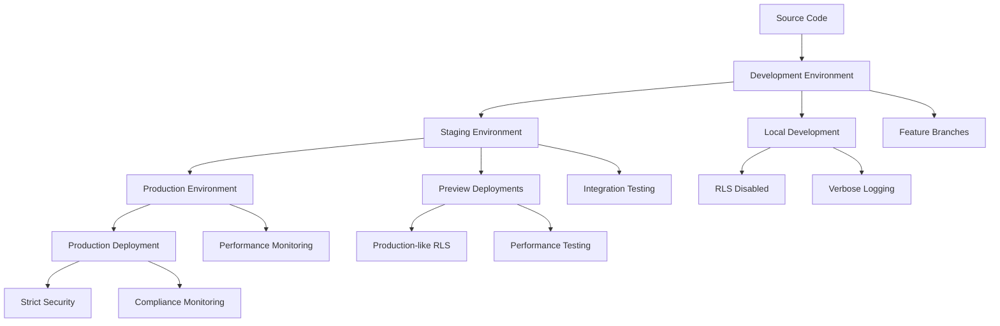

# Environment Management Guide

## Table of Contents
1. [Overview](#overview)
2. [Three-Tier Environment Architecture](#three-tier-environment-architecture)
3. [Comprehensive Environment Variables Matrix](#comprehensive-environment-variables-matrix)
4. [Vercel Pro Environment Management](#vercel-pro-environment-management)
5. [Supabase Pro Multi-Project Setup](#supabase-pro-multi-project-setup)
6. [Security & Compliance Integration](#security--compliance-integration)
7. [Environment Synchronization & Validation](#environment-synchronization--validation)
8. [Troubleshooting](#troubleshooting)

## Overview

The trAIner AI Fitness App implements a sophisticated three-tier environment architecture designed to maximize development velocity while ensuring production security and compliance. Our environment management strategy leverages **Vercel Pro** and **Supabase Pro** features to provide seamless deployment workflows, comprehensive monitoring, and robust data protection across development, staging, and production environments.

### Environment Management Philosophy



### Key Environment Characteristics

| Environment | Purpose | RLS Status | Monitoring | Data Retention |
|-------------|---------|------------|------------|----------------|
| **Development** | Local testing, feature development | Disabled | Basic logging | 7 days |
| **Staging** | Integration testing, preview deployments | Production-like | Full monitoring | 30 days |
| **Production** | Live application, real users | Strict enforcement | Comprehensive | Per compliance |

## Three-Tier Environment Architecture

### Development Environment

**Purpose**: Fast iteration, comprehensive debugging, and feature development

**Infrastructure Configuration:**
```yaml
Environment: Development
Platform: Local Next.js development server
Database: Supabase Development Project (Pro tier)
Authentication: Development keys with relaxed validation
Caching: Disabled for real-time updates
Logging: Verbose debugging enabled
```

**Key Features:**
- **RLS Disabled**: Simplified database queries for debugging
- **Hot Reloading**: Instant feedback on code changes
- **Source Maps**: Full debugging capabilities
- **Mock Data**: Synthetic datasets for testing
- **Relaxed Validation**: Faster development cycles

**Configuration Example:**
```typescript
// Development environment configuration
const developmentConfig = {
  database: {
    url: process.env.SUPABASE_URL_DEV,
    anonKey: process.env.SUPABASE_ANON_KEY_DEV,
    serviceKey: process.env.SUPABASE_SERVICE_ROLE_KEY_DEV,
    rls: false, // Disabled for easier debugging
  },
  api: {
    openai: {
      key: process.env.OPENAI_API_KEY_DEV,
      model: 'gpt-3.5-turbo', // Faster, cheaper model for dev
    },
    perplexity: {
      key: process.env.PERPLEXITY_API_KEY_DEV,
      endpoint: 'https://api.perplexity.ai/chat/completions',
    },
  },
  monitoring: {
    level: 'debug',
    realtime: true,
    performance: false,
  },
  features: {
    aiCaching: false, // Always fresh responses in dev
    rateLimiting: false,
    errorReporting: false,
  },
};
```

### Staging Environment

**Purpose**: Production-like testing, preview deployments, and integration validation

**Infrastructure Configuration:**
```yaml
Environment: Staging
Platform: Vercel Preview Deployments (Pro tier)
Database: Supabase Staging Project with branch database
Authentication: Production-like validation with debug symbols
Caching: Production configuration with cache invalidation
Logging: Structured logging with performance metrics
```

**Key Features:**
- **Branch Database**: Automatic database branching for preview deployments
- **Production-like RLS**: Security policies enabled but with debugging
- **Performance Monitoring**: Full monitoring stack enabled
- **Preview URLs**: Automatic deployment URLs for each PR
- **Compliance Testing**: GDPR and data protection validation

**Configuration Example:**
```typescript
// Staging environment configuration
const stagingConfig = {
  database: {
    url: process.env.SUPABASE_URL_STAGING,
    anonKey: process.env.SUPABASE_ANON_KEY_STAGING,
    serviceKey: process.env.SUPABASE_SERVICE_ROLE_KEY_STAGING,
    rls: true, // Enabled for production-like testing
    branchDatabase: true, // Supabase Pro feature
  },
  api: {
    openai: {
      key: process.env.OPENAI_API_KEY_STAGING,
      model: 'gpt-4', // Production model for accurate testing
    },
    perplexity: {
      key: process.env.PERPLEXITY_API_KEY_STAGING,
      endpoint: 'https://api.perplexity.ai/chat/completions',
    },
  },
  monitoring: {
    level: 'info',
    realtime: true,
    performance: true,
    sentry: true,
  },
  features: {
    aiCaching: true,
    rateLimiting: true, // Test rate limiting behavior
    errorReporting: true,
  },
  compliance: {
    gdpr: true,
    dataRetention: '30 days',
    auditLogging: true,
  },
};
```

### Production Environment

**Purpose**: Live application serving real users with maximum security and performance

**Infrastructure Configuration:**
```yaml
Environment: Production
Platform: Vercel Production Deployment (Pro tier)
Database: Supabase Production Project with strict RLS
Authentication: Maximum security with audit logging
Caching: Optimized multi-layer caching strategy
Logging: Security-focused with compliance monitoring
```

**Key Features:**
- **Strict RLS**: Maximum security enforcement
- **Edge Caching**: Global CDN with intelligent caching
- **Advanced Monitoring**: Real-time alerts and performance tracking
- **Compliance Enforcement**: GDPR, data protection, and audit trails
- **Disaster Recovery**: Point-in-time recovery and automated backups

**Configuration Example:**
```typescript
// Production environment configuration
const productionConfig = {
  database: {
    url: process.env.SUPABASE_URL,
    anonKey: process.env.SUPABASE_ANON_KEY,
    serviceKey: process.env.SUPABASE_SERVICE_ROLE_KEY,
    rls: true, // Strictly enforced
    pointInTimeRecovery: true, // Supabase Pro feature
    backupRetention: '7 days', // Pro tier backup retention
  },
  api: {
    openai: {
      key: process.env.OPENAI_API_KEY,
      model: 'gpt-4',
      rateLimiting: true,
    },
    perplexity: {
      key: process.env.PERPLEXITY_API_KEY,
      endpoint: 'https://api.perplexity.ai/chat/completions',
      rateLimiting: true,
    },
  },
  monitoring: {
    level: 'error',
    realtime: true,
    performance: true,
    security: true,
    compliance: true,
  },
  features: {
    aiCaching: true,
    rateLimiting: true,
    errorReporting: true,
    securityHeaders: true,
  },
  compliance: {
    gdpr: true,
    dataRetention: 'per_policy',
    auditLogging: true,
    encryptionAtRest: true,
    encryptionInTransit: true,
  },
};
```

## Comprehensive Environment Variables Matrix

### Frontend Environment Variables

Based on the current backend environment configuration patterns from `/backend/config/env.js`, our frontend environment variables follow a structured validation approach:

```typescript
// Environment variables schema validation
import Joi from 'joi';

const frontendEnvSchema = Joi.object({
  // Core Application
  NODE_ENV: Joi.string()
    .valid('development', 'staging', 'production')
    .default('development'),
  NEXT_PUBLIC_APP_ENV: Joi.string()
    .valid('development', 'staging', 'production')
    .required(),
  NEXT_PUBLIC_APP_VERSION: Joi.string()
    .default(process.env.npm_package_version),
  
  // Supabase Configuration (Pro Tier)
  NEXT_PUBLIC_SUPABASE_URL: Joi.string()
    .uri()
    .required()
    .description('Supabase project URL'),
  NEXT_PUBLIC_SUPABASE_ANON_KEY: Joi.string()
    .required()
    .description('Supabase anonymous key for client-side operations'),
  SUPABASE_SERVICE_ROLE_KEY: Joi.string()
    .required()
    .description('Supabase service role key for server-side operations'),
  SUPABASE_ACCESS_TOKEN: Joi.string()
    .optional()
    .description('Supabase Pro API access token'),
  SUPABASE_PROJECT_REF: Joi.string()
    .required()
    .description('Supabase project reference ID'),
  
  // AI Services
  OPENAI_API_KEY: Joi.string()
    .required()
    .description('OpenAI API key for workout generation and adjustments'),
  PERPLEXITY_API_KEY: Joi.string()
    .required()
    .description('Perplexity AI API key for exercise research'),
  
  // Vercel Pro Configuration
  NEXT_PUBLIC_VERCEL_ENV: Joi.string()
    .optional()
    .description('Vercel environment (injected automatically)'),
  NEXT_PUBLIC_VERCEL_URL: Joi.string()
    .optional()
    .description('Vercel deployment URL (injected automatically)'),
  VERCEL_TOKEN: Joi.string()
    .optional()
    .description('Vercel CLI automation token'),
  VERCEL_ORG_ID: Joi.string()
    .optional()
    .description('Vercel organization ID'),
  VERCEL_PROJECT_ID: Joi.string()
    .optional()
    .description('Vercel project ID'),
  
  // Analytics & Monitoring (Pro Tier)
  NEXT_PUBLIC_VERCEL_ANALYTICS_ID: Joi.string()
    .optional()
    .description('Vercel Analytics tracking ID'),
  SENTRY_DSN: Joi.string()
    .uri()
    .optional()
    .description('Sentry error tracking DSN'),
  SENTRY_AUTH_TOKEN: Joi.string()
    .optional()
    .description('Sentry authentication token'),
  SENTRY_ORG: Joi.string()
    .optional()
    .description('Sentry organization slug'),
  SENTRY_PROJECT: Joi.string()
    .optional()
    .description('Sentry project slug'),
  
  // Application URLs
  NEXT_PUBLIC_SITE_URL: Joi.string()
    .uri()
    .required()
    .description('Canonical site URL for metadata and redirects'),
  NEXT_PUBLIC_API_URL: Joi.string()
    .uri()
    .optional()
    .description('Backend API URL if different from site URL'),
  
  // Feature Flags
  NEXT_PUBLIC_ENABLE_ANALYTICS: Joi.boolean()
    .default(false)
    .description('Enable user analytics and tracking'),
  NEXT_PUBLIC_ENABLE_AI_CACHING: Joi.boolean()
    .default(true)
    .description('Enable AI response caching'),
  NEXT_PUBLIC_DEBUG_MODE: Joi.boolean()
    .default(false)
    .description('Enable debug mode for development'),
  
  // Security & Compliance
  NEXT_PUBLIC_CSP_NONCE: Joi.string()
    .optional()
    .description('Content Security Policy nonce'),
  ENCRYPTION_KEY: Joi.string()
    .required()
    .description('Encryption key for sensitive data'),
  JWT_SECRET: Joi.string()
    .required()
    .description('JWT signing secret'),
  
  // Rate Limiting
  RATE_LIMIT_WINDOW_MS: Joi.number()
    .default(900000) // 15 minutes
    .description('Rate limiting window in milliseconds'),
  RATE_LIMIT_MAX_REQUESTS: Joi.number()
    .default(100)
    .description('Maximum requests per window'),
});
```

### Environment-Specific Variable Configuration

#### Development Environment Variables
```bash
# Development .env.local
NODE_ENV=development
NEXT_PUBLIC_APP_ENV=development
NEXT_PUBLIC_DEBUG_MODE=true

# Supabase Development Project
NEXT_PUBLIC_SUPABASE_URL=https://dev-xxx.supabase.co
NEXT_PUBLIC_SUPABASE_ANON_KEY=eyJ... # Development anon key
SUPABASE_SERVICE_ROLE_KEY=eyJ... # Development service key
SUPABASE_PROJECT_REF=dev-xxx

# AI Services (Development keys with higher rate limits)
OPENAI_API_KEY=sk-dev-xxx
PERPLEXITY_API_KEY=pplx-dev-xxx

# Application URLs
NEXT_PUBLIC_SITE_URL=http://localhost:3000

# Feature Flags (Development)
NEXT_PUBLIC_ENABLE_ANALYTICS=false
NEXT_PUBLIC_ENABLE_AI_CACHING=false

# Development secrets (can be dummy values)
ENCRYPTION_KEY=dev-encryption-key-32-chars
JWT_SECRET=dev-jwt-secret-key
```

#### Staging Environment Variables
```bash
# Staging .env.staging
NODE_ENV=staging
NEXT_PUBLIC_APP_ENV=staging
NEXT_PUBLIC_DEBUG_MODE=true

# Supabase Staging Project (with branch database)
NEXT_PUBLIC_SUPABASE_URL=https://staging-xxx.supabase.co
NEXT_PUBLIC_SUPABASE_ANON_KEY=eyJ... # Staging anon key
SUPABASE_SERVICE_ROLE_KEY=eyJ... # Staging service key
SUPABASE_PROJECT_REF=staging-xxx

# AI Services (Production keys with staging quotas)
OPENAI_API_KEY=sk-staging-xxx
PERPLEXITY_API_KEY=pplx-staging-xxx

# Vercel Pro Configuration
NEXT_PUBLIC_VERCEL_ENV=${VERCEL_ENV}
NEXT_PUBLIC_VERCEL_URL=${VERCEL_URL}
VERCEL_TOKEN=${VERCEL_TOKEN}

# Analytics & Monitoring
NEXT_PUBLIC_VERCEL_ANALYTICS_ID=analytics-staging-id
SENTRY_DSN=https://staging-xxx@sentry.io/xxx
SENTRY_AUTH_TOKEN=${SENTRY_AUTH_TOKEN}

# Application URLs
NEXT_PUBLIC_SITE_URL=https://trainer-app-staging.vercel.app

# Feature Flags (Staging)
NEXT_PUBLIC_ENABLE_ANALYTICS=true
NEXT_PUBLIC_ENABLE_AI_CACHING=true

# Staging secrets (production-like)
ENCRYPTION_KEY=${ENCRYPTION_KEY_STAGING}
JWT_SECRET=${JWT_SECRET_STAGING}
```

#### Production Environment Variables
```bash
# Production .env.production
NODE_ENV=production
NEXT_PUBLIC_APP_ENV=production
NEXT_PUBLIC_DEBUG_MODE=false

# Supabase Production Project (strict RLS)
NEXT_PUBLIC_SUPABASE_URL=https://xxx.supabase.co
NEXT_PUBLIC_SUPABASE_ANON_KEY=eyJ... # Production anon key
SUPABASE_SERVICE_ROLE_KEY=eyJ... # Production service key
SUPABASE_ACCESS_TOKEN=sbp_xxx # Pro tier API access
SUPABASE_PROJECT_REF=xxx

# AI Services (Production keys with full quotas)
OPENAI_API_KEY=sk-xxx
PERPLEXITY_API_KEY=pplx-xxx

# Vercel Pro Configuration
NEXT_PUBLIC_VERCEL_ENV=${VERCEL_ENV}
NEXT_PUBLIC_VERCEL_URL=${VERCEL_URL}
VERCEL_ORG_ID=${VERCEL_ORG_ID}
VERCEL_PROJECT_ID=${VERCEL_PROJECT_ID}

# Analytics & Monitoring (Production)
NEXT_PUBLIC_VERCEL_ANALYTICS_ID=analytics-prod-id
SENTRY_DSN=https://xxx@sentry.io/xxx
SENTRY_AUTH_TOKEN=${SENTRY_AUTH_TOKEN}
SENTRY_ORG=trainer-app
SENTRY_PROJECT=trainer-frontend

# Application URLs
NEXT_PUBLIC_SITE_URL=https://trainer-app.com

# Feature Flags (Production)
NEXT_PUBLIC_ENABLE_ANALYTICS=true
NEXT_PUBLIC_ENABLE_AI_CACHING=true

# Production secrets (highly secure)
ENCRYPTION_KEY=${ENCRYPTION_KEY_PRODUCTION}
JWT_SECRET=${JWT_SECRET_PRODUCTION}

# Rate Limiting (Production settings)
RATE_LIMIT_WINDOW_MS=900000 # 15 minutes
RATE_LIMIT_MAX_REQUESTS=50 # Lower limit for production
```

## Vercel Pro Environment Management

### Advanced Vercel Pro Features

Leveraging Vercel Pro capabilities for sophisticated environment management:

```bash
# Vercel CLI environment management
# Install Vercel CLI with Pro features
npm i -g vercel@latest

# Login and configure team access
vercel login
vercel teams switch trainer-app-team

# Environment-specific deployment commands
vercel env add NEXT_PUBLIC_SUPABASE_URL production
vercel env add NEXT_PUBLIC_SUPABASE_URL preview  
vercel env add NEXT_PUBLIC_SUPABASE_URL development

# Encrypted environment variables (Pro feature)
vercel env add SUPABASE_SERVICE_ROLE_KEY production --sensitive
vercel env add OPENAI_API_KEY production --sensitive
vercel env add JWT_SECRET production --sensitive

# Bulk environment variable import
vercel env pull .env.vercel.local
vercel env push .env.production production
```

### Vercel Environment Configuration

```typescript
// vercel-env-config.ts
export const vercelEnvironmentConfig = {
  // Automatic environment detection
  environment: process.env.VERCEL_ENV || 'development',
  
  // Dynamic URL configuration
  siteUrl: process.env.VERCEL_ENV === 'production' 
    ? 'https://trainer-app.com'
    : process.env.VERCEL_URL 
      ? `https://${process.env.VERCEL_URL}`
      : 'http://localhost:3000',
  
  // Branch-based configuration
  isPreview: process.env.VERCEL_ENV === 'preview',
  isProduction: process.env.VERCEL_ENV === 'production',
  
  // Vercel Pro features
  analytics: {
    enabled: process.env.NEXT_PUBLIC_VERCEL_ANALYTICS_ID ? true : false,
    id: process.env.NEXT_PUBLIC_VERCEL_ANALYTICS_ID,
  },
  
  // Edge functions configuration
  functions: {
    region: process.env.VERCEL_ENV === 'production' ? 'iad1' : 'auto',
    timeout: process.env.VERCEL_ENV === 'production' ? 30 : 60,
  },
};
```

### Preview Deployment Configuration

```yaml
# vercel.json - Preview deployment configuration
{
  "github": {
    "enabled": true,
    "autoAlias": true,
    "silent": false
  },
  "env": {
    "NEXT_PUBLIC_APP_ENV": "preview",
    "NEXT_PUBLIC_ENABLE_ANALYTICS": "true"
  },
  "build": {
    "env": {
      "NODE_ENV": "staging"
    }
  },
  "functions": {
    "app/api/**/*.ts": {
      "maxDuration": 60
    }
  },
  "headers": [
    {
      "source": "/(.*)",
      "headers": [
        {
          "key": "X-Robots-Tag",
          "value": "noindex, nofollow"
        }
      ]
    }
  ]
}
```

### Team Environment Management

```bash
# Team-based environment variable management
# Create team-specific environments
vercel teams switch trainer-app-team

# Environment variable inheritance
vercel env add DATABASE_URL production --sensitive
vercel env add DATABASE_URL preview --sensitive --inherit-from=production
vercel env add DATABASE_URL development --local-only

# Audit and compliance
vercel env ls --output=json > environment-audit.json
vercel env history ENCRYPTION_KEY production
```

## Supabase Pro Multi-Project Setup

### Multi-Organization Architecture

Leveraging Supabase Pro's organizational features for environment isolation:

```typescript
// supabase-config.ts
export const supabaseEnvironmentConfig = {
  development: {
    url: process.env.NEXT_PUBLIC_SUPABASE_URL_DEV!,
    anonKey: process.env.NEXT_PUBLIC_SUPABASE_ANON_KEY_DEV!,
    serviceKey: process.env.SUPABASE_SERVICE_ROLE_KEY_DEV!,
    organization: 'trainer-app-dev',
    project: 'trainer-dev',
    features: {
      rls: false,
      realtime: true,
      storage: true,
      auth: true,
    },
  },
  staging: {
    url: process.env.NEXT_PUBLIC_SUPABASE_URL_STAGING!,
    anonKey: process.env.NEXT_PUBLIC_SUPABASE_ANON_KEY_STAGING!,
    serviceKey: process.env.SUPABASE_SERVICE_ROLE_KEY_STAGING!,
    organization: 'trainer-app-staging',
    project: 'trainer-staging',
    features: {
      rls: true,
      realtime: true,
      storage: true,
      auth: true,
      branchDatabase: true, // Pro feature
    },
  },
  production: {
    url: process.env.NEXT_PUBLIC_SUPABASE_URL!,
    anonKey: process.env.NEXT_PUBLIC_SUPABASE_ANON_KEY!,
    serviceKey: process.env.SUPABASE_SERVICE_ROLE_KEY!,
    organization: 'trainer-app-prod',
    project: 'trainer-prod',
    features: {
      rls: true,
      realtime: true,
      storage: true,
      auth: true,
      pointInTimeRecovery: true, // Pro feature
      advancedMonitoring: true, // Pro feature
    },
  },
};
```

### Branch Database Configuration

```typescript
// branch-database-config.ts
export class BranchDatabaseManager {
  private supabaseAccessToken: string;
  
  constructor() {
    this.supabaseAccessToken = process.env.SUPABASE_ACCESS_TOKEN!;
  }
  
  async createBranchDatabase(branchName: string, baseBranch = 'main') {
    const response = await fetch(
      `https://api.supabase.com/v1/projects/${process.env.SUPABASE_PROJECT_REF}/branches`,
      {
        method: 'POST',
        headers: {
          'Authorization': `Bearer ${this.supabaseAccessToken}`,
          'Content-Type': 'application/json',
        },
        body: JSON.stringify({
          name: branchName,
          parent_id: baseBranch,
        }),
      }
    );
    
    if (!response.ok) {
      throw new Error(`Failed to create branch database: ${response.statusText}`);
    }
    
    return response.json();
  }
  
  async deleteBranchDatabase(branchId: string) {
    const response = await fetch(
      `https://api.supabase.com/v1/projects/${process.env.SUPABASE_PROJECT_REF}/branches/${branchId}`,
      {
        method: 'DELETE',
        headers: {
          'Authorization': `Bearer ${this.supabaseAccessToken}`,
        },
      }
    );
    
    if (!response.ok) {
      throw new Error(`Failed to delete branch database: ${response.statusText}`);
    }
    
    return true;
  }
}
```

### Advanced Monitoring Configuration

```typescript
// supabase-monitoring.ts
export const supabaseMonitoringConfig = {
  production: {
    // Point-in-time Recovery (Pro feature)
    pitr: {
      enabled: true,
      retentionPeriod: '7 days',
      automaticBackups: true,
    },
    
    // Advanced monitoring (Pro feature)
    monitoring: {
      realTimeMetrics: true,
      performanceInsights: true,
      queryAnalytics: true,
      connectionPooling: {
        enabled: true,
        maxConnections: 60, // Pro tier limit
        poolMode: 'transaction',
      },
    },
    
    // Security configuration
    security: {
      rls: {
        enabled: true,
        strictMode: true,
        auditLogging: true,
      },
      auth: {
        multiFactorAuth: true,
        sessionTimeout: '24h',
        passwordPolicy: 'strict',
      },
    },
    
    // Compliance settings
    compliance: {
      gdpr: {
        enabled: true,
        dataRetention: 'automatic',
        rightToBeDeleted: true,
      },
      auditLog: {
        enabled: true,
        retentionPeriod: '1 year',
      },
    },
  },
  
  staging: {
    // Production-like but with relaxed settings
    pitr: {
      enabled: true,
      retentionPeriod: '3 days',
      automaticBackups: true,
    },
    monitoring: {
      realTimeMetrics: true,
      performanceInsights: true,
      queryAnalytics: false,
    },
    security: {
      rls: {
        enabled: true,
        strictMode: false, // Allow debugging
        auditLogging: true,
      },
    },
  },
  
  development: {
    // Minimal monitoring for development
    monitoring: {
      realTimeMetrics: false,
      performanceInsights: false,
      queryAnalytics: false,
    },
    security: {
      rls: {
        enabled: false, // Disabled for easier debugging
        auditLogging: false,
      },
    },
  },
};
```

## Security & Compliance Integration

### GDPR Compliance Configuration

Based on the fitness app's health data handling requirements:

```typescript
// gdpr-compliance.ts
export const gdprComplianceConfig = {
  // Data collection consent
  consent: {
    required: true,
    granular: true,
    categories: [
      'essential', // Core app functionality
      'analytics', // Usage analytics
      'personalization', // AI recommendations
      'marketing', // Future marketing features
    ],
  },
  
  // Data retention policies
  dataRetention: {
    userProfiles: '2 years', // After last login
    workoutLogs: '5 years', // Fitness data retention
    aiMemory: '1 year', // Agent memory data
    analytics: '26 months', // Google Analytics standard
    auditLogs: '6 years', // Compliance requirement
  },
  
  // Right to be forgotten
  dataDeletion: {
    automated: true,
    gracePeriod: '30 days',
    verification: 'email',
    anonymization: {
      analytics: true,
      aggregatedData: true,
    },
  },
  
  // Data portability
  dataExport: {
    format: ['JSON', 'CSV'],
    includedData: [
      'profile',
      'workouts',
      'nutrition',
      'progress',
      'preferences',
    ],
    excludedData: [
      'security_logs',
      'internal_analytics',
      'ai_model_data',
    ],
  },
};
```

### Health Data Protection (GDPR Article 9)

```typescript
// health-data-protection.ts
export const healthDataProtectionConfig = {
  // Special category data handling
  healthData: {
    explicitConsent: true,
    processignLawfulBasis: 'consent',
    dataMinimization: true,
    
    // Health data categories in trAIner
    categories: [
      'medical_conditions',
      'fitness_metrics',
      'body_measurements',
      'exercise_limitations',
      'dietary_restrictions',
    ],
    
    // Enhanced security measures
    security: {
      encryptionAtRest: 'AES-256',
      encryptionInTransit: 'TLS 1.3',
      accessControls: 'role-based',
      auditLogging: 'comprehensive',
    },
    
    // Data processing limitations
    processing: {
      automated: false, // No automated health decisions
      humanReview: true,
      thirdPartySharing: false,
      crossBorderTransfer: 'standard-contractual-clauses',
    },
  },
  
  // Data processor agreements
  processors: {
    supabase: {
      agreement: 'supabase-dpa',
      location: 'EU',
      certification: 'ISO 27001',
    },
    openai: {
      agreement: 'openai-dpa',
      location: 'US',
      safeguards: 'standard-contractual-clauses',
    },
    vercel: {
      agreement: 'vercel-dpa',
      location: 'US',
      safeguards: 'privacy-shield-replacement',
    },
  },
};
```

### Security Headers Configuration

```typescript
// security-headers.ts
export const securityHeadersConfig = {
  // Content Security Policy
  csp: {
    'default-src': ["'self'"],
    'script-src': [
      "'self'",
      "'unsafe-eval'", // Required for Next.js
      "'unsafe-inline'", // Required for styled-components
      'https://vercel.live', // Vercel Analytics
    ],
    'style-src': [
      "'self'",
      "'unsafe-inline'", // Required for CSS-in-JS
    ],
    'img-src': [
      "'self'",
      'data:', // For base64 images
      'https:', // External images
    ],
    'connect-src': [
      "'self'",
      'https://*.supabase.co', // Supabase API
      'https://api.openai.com', // OpenAI API
      'https://api.perplexity.ai', // Perplexity API
      'wss://*.supabase.co', // Supabase realtime
    ],
    'font-src': [
      "'self'",
      'data:', // For font data URLs
    ],
    'object-src': ["'none'"],
    'base-uri': ["'self'"],
    'form-action': ["'self'"],
    'frame-ancestors': ["'none'"],
    'upgrade-insecure-requests': true,
  },
  
  // Security headers
  headers: {
    'Strict-Transport-Security': 'max-age=31536000; includeSubDomains; preload',
    'X-Frame-Options': 'DENY',
    'X-Content-Type-Options': 'nosniff',
    'Referrer-Policy': 'strict-origin-when-cross-origin',
    'Permissions-Policy': 'camera=(), microphone=(), geolocation=()',
  },
};
```

### Environment-Specific Security Configuration

```typescript
// environment-security.ts
export const environmentSecurityConfig = {
  development: {
    // Relaxed security for development
    csp: false,
    https: false,
    auditLogging: false,
    encryptionRequired: false,
  },
  
  staging: {
    // Production-like security with debug access
    csp: true,
    https: true,
    auditLogging: true,
    encryptionRequired: true,
    debugAccess: true,
  },
  
  production: {
    // Maximum security enforcement
    csp: true,
    https: true,
    auditLogging: true,
    encryptionRequired: true,
    debugAccess: false,
    
    // Production-specific security measures
    rateLimiting: true,
    ddosProtection: true,
    intrusionDetection: true,
    complianceMonitoring: true,
  },
};
```

## Environment Synchronization & Validation

### Environment Variable Validation

```typescript
// env-validation.ts
import { z } from 'zod';

const envSchema = z.object({
  // Core application
  NODE_ENV: z.enum(['development', 'staging', 'production']),
  NEXT_PUBLIC_APP_ENV: z.enum(['development', 'staging', 'production']),
  
  // Supabase (required for all environments)
  NEXT_PUBLIC_SUPABASE_URL: z.string().url(),
  NEXT_PUBLIC_SUPABASE_ANON_KEY: z.string().min(100),
  SUPABASE_SERVICE_ROLE_KEY: z.string().min(100),
  SUPABASE_PROJECT_REF: z.string().min(10),
  
  // AI Services (required for all environments)
  OPENAI_API_KEY: z.string().min(40),
  PERPLEXITY_API_KEY: z.string().min(20),
  
  // Application URLs
  NEXT_PUBLIC_SITE_URL: z.string().url(),
  
  // Security (required for staging and production)
  ENCRYPTION_KEY: z.string().min(32),
  JWT_SECRET: z.string().min(32),
  
  // Optional monitoring
  SENTRY_DSN: z.string().url().optional(),
  NEXT_PUBLIC_VERCEL_ANALYTICS_ID: z.string().optional(),
});

export function validateEnvironment() {
  try {
    const env = envSchema.parse(process.env);
    console.log('✅ Environment validation passed');
    return env;
  } catch (error) {
    console.error('❌ Environment validation failed:', error);
    process.exit(1);
  }
}

// Run validation on startup
if (typeof window === 'undefined') {
  validateEnvironment();
}
```

### Environment Synchronization Scripts

```bash
#!/bin/bash
# scripts/sync-environments.sh

# Sync environment variables across Vercel environments
echo "🔄 Syncing environment variables..."

# Pull production variables
vercel env pull .env.production.local

# Sync to staging (excluding production-specific secrets)
grep -v "JWT_SECRET\|ENCRYPTION_KEY" .env.production.local | \
  vercel env push staging

# Sync to development (excluding all secrets)
grep -v "JWT_SECRET\|ENCRYPTION_KEY\|OPENAI_API_KEY\|PERPLEXITY_API_KEY" .env.production.local | \
  vercel env push development

echo "✅ Environment synchronization complete"
```

### Environment Health Checks

```typescript
// scripts/health-check.ts
async function performEnvironmentHealthCheck() {
  console.log('🏥 Performing environment health check...');
  
  const checks = {
    supabase: await checkSupabaseConnection(),
    openai: await checkOpenAIConnection(),
    perplexity: await checkPerplexityConnection(),
    vercel: await checkVercelConfiguration(),
  };
  
  const failures = Object.entries(checks)
    .filter(([_, status]) => !status)
    .map(([service]) => service);
  
  if (failures.length > 0) {
    console.error(`❌ Health check failed for: ${failures.join(', ')}`);
    process.exit(1);
  }
  
  console.log('✅ All environment health checks passed');
}

async function checkSupabaseConnection() {
  try {
    const response = await fetch(`${process.env.NEXT_PUBLIC_SUPABASE_URL}/rest/v1/`, {
      headers: {
        'apikey': process.env.NEXT_PUBLIC_SUPABASE_ANON_KEY!,
      },
    });
    return response.ok;
  } catch {
    return false;
  }
}

async function checkOpenAIConnection() {
  try {
    const response = await fetch('https://api.openai.com/v1/models', {
      headers: {
        'Authorization': `Bearer ${process.env.OPENAI_API_KEY}`,
      },
    });
    return response.ok;
  } catch {
    return false;
  }
}

async function checkPerplexityConnection() {
  try {
    const response = await fetch('https://api.perplexity.ai/chat/completions', {
      method: 'POST',
      headers: {
        'Authorization': `Bearer ${process.env.PERPLEXITY_API_KEY}`,
        'Content-Type': 'application/json',
      },
      body: JSON.stringify({
        model: 'llama-3.1-sonar-small-128k-online',
        messages: [{ role: 'user', content: 'test' }],
        max_tokens: 1,
      }),
    });
    return response.status === 200 || response.status === 400; // 400 is expected for minimal request
  } catch {
    return false;
  }
}

async function checkVercelConfiguration() {
  // Verify Vercel environment is properly configured
  const requiredVercelVars = [
    'VERCEL_ENV',
    'VERCEL_URL',
  ];
  
  return requiredVercelVars.every(varName => 
    process.env[varName] !== undefined
  );
}

if (require.main === module) {
  performEnvironmentHealthCheck();
}
```

## Troubleshooting

### Common Environment Issues

#### 1. Supabase Connection Failures
```bash
# Debug Supabase connectivity
curl -H "apikey: $NEXT_PUBLIC_SUPABASE_ANON_KEY" \
     "$NEXT_PUBLIC_SUPABASE_URL/rest/v1/"

# Check RLS policies
npx supabase inspect db --config-path=./supabase

# Verify environment variables
node -e "console.log(process.env.NEXT_PUBLIC_SUPABASE_URL)"
```

#### 2. Environment Variable Sync Issues
```bash
# Verify Vercel environment variables
vercel env ls

# Check for missing variables
vercel env ls | grep -E "(OPENAI|SUPABASE|PERPLEXITY)"

# Pull latest environment configuration
vercel env pull .env.vercel.local
```

#### 3. AI Service Authentication Failures
```bash
# Test OpenAI API key
curl -H "Authorization: Bearer $OPENAI_API_KEY" \
     "https://api.openai.com/v1/models"

# Test Perplexity API key
curl -H "Authorization: Bearer $PERPLEXITY_API_KEY" \
     -H "Content-Type: application/json" \
     -d '{"model":"llama-3.1-sonar-small-128k-online","messages":[{"role":"user","content":"test"}],"max_tokens":1}' \
     "https://api.perplexity.ai/chat/completions"
```

#### 4. GDPR Compliance Issues
```bash
# Verify data retention policies
node scripts/audit-data-retention.js

# Check consent management
node scripts/verify-consent-flow.js

# Test data export functionality
node scripts/test-data-export.js
```

### Environment Management Checklist

**Development Environment:**
- [ ] Supabase development project configured
- [ ] RLS disabled for easier debugging
- [ ] AI service development keys active
- [ ] Local environment variables loaded
- [ ] Debug logging enabled

**Staging Environment:**
- [ ] Supabase staging project with branch database
- [ ] Production-like RLS policies enabled
- [ ] Preview deployments working
- [ ] Performance monitoring active
- [ ] GDPR compliance testing enabled

**Production Environment:**
- [ ] Supabase production project with strict RLS
- [ ] Point-in-time recovery enabled
- [ ] All security headers configured
- [ ] GDPR compliance fully implemented
- [ ] Monitoring and alerting active
- [ ] Data retention policies enforced

### Security Validation

Regular security validation ensures compliance and protection:

```bash
# Weekly security check script
#!/bin/bash
echo "🔒 Running weekly security validation..."

# Check for exposed secrets
git log --grep="password\|secret\|key" --oneline | head -5

# Verify SSL configuration
curl -I https://trainer-app.com | grep -i security

# Test authentication endpoints
node scripts/test-auth-security.js

# Verify GDPR compliance
node scripts/gdpr-compliance-check.js

echo "✅ Security validation complete"
```

The environment management system provides a robust foundation for the trAIner app's deployment across all environments while maintaining strict security, compliance, and performance standards. 